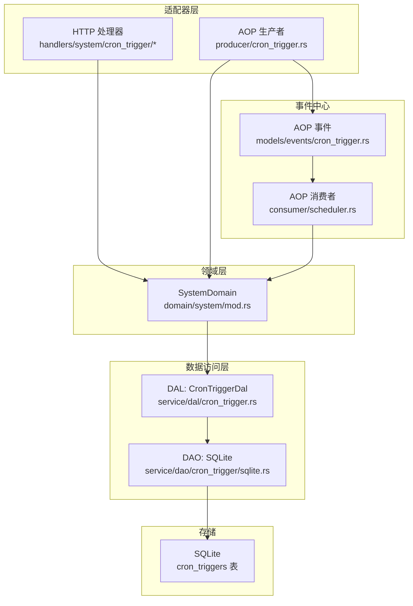
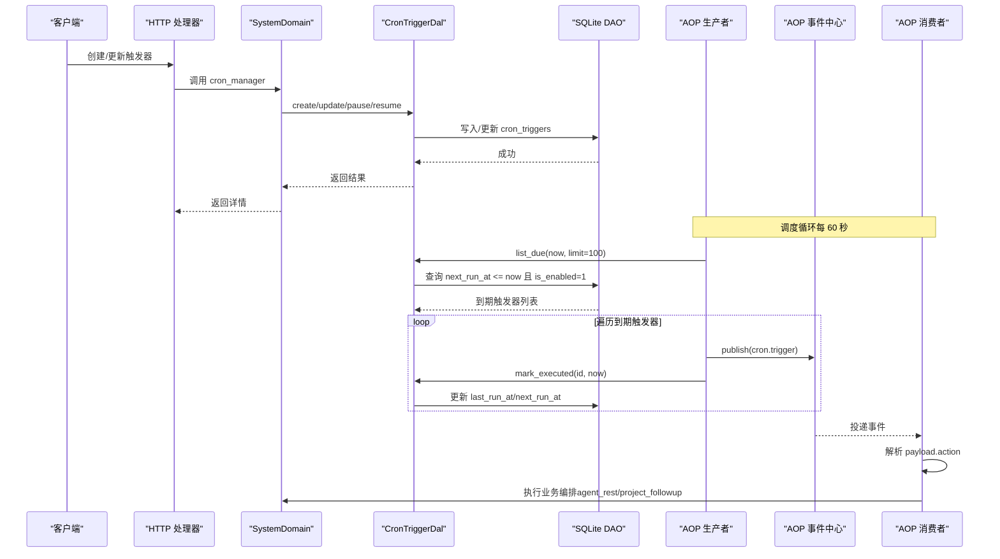
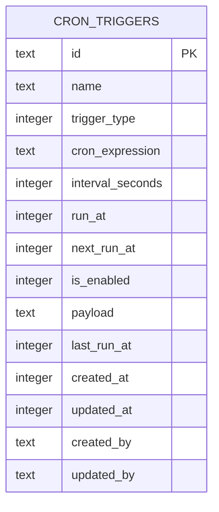
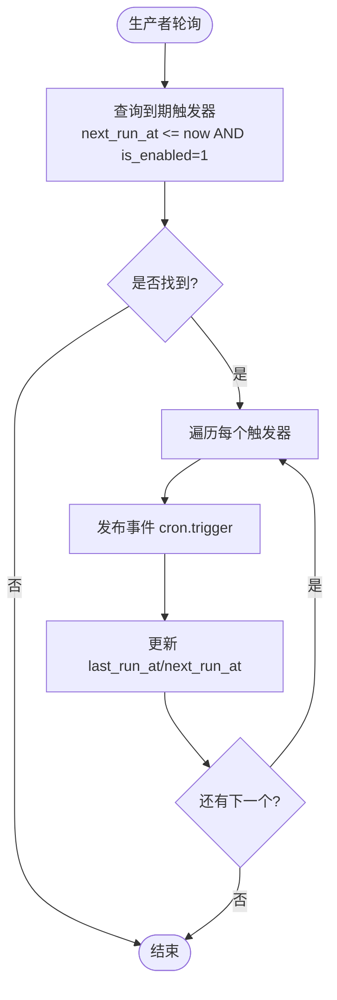
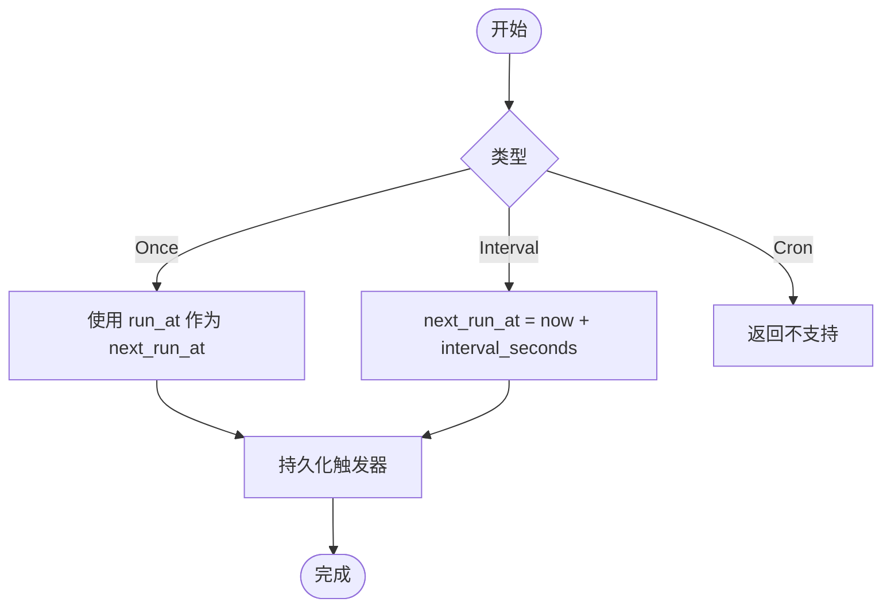
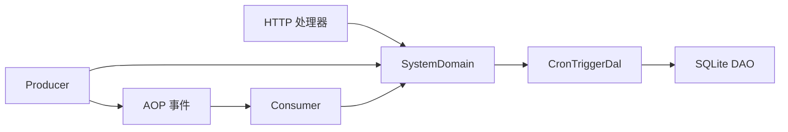

# 定时任务处理器

<cite>
**本文引用的文件**
- [common/src/api/cron_trigger.rs](file://common/src/api/cron_trigger.rs)
- [common/src/enums/cron_trigger.rs](file://common/src/enums/cron_trigger.rs)
- [migrations/20260711000000_cron_triggers.sql](file://migrations/20260711000000_cron_triggers.sql)
- [src/models/cron_trigger.rs](file://src/models/cron_trigger.rs)
- [src/models/events/cron_trigger.rs](file://src/models/events/cron_trigger.rs)
- [src/service/dal/cron_trigger.rs](file://src/service/dal/cron_trigger.rs)
- [src/service/dao/cron_trigger/sqlite.rs](file://src/service/dao/cron_trigger/sqlite.rs)
- [src/handlers/system/cron_trigger/mod.rs](file://src/handlers/system/cron_trigger/mod.rs)
- [src/handlers/system/cron_trigger/create_cron_trigger.rs](file://src/handlers/system/cron_trigger/create_cron_trigger.rs)
- [src/handlers/system/cron_trigger/list_cron_triggers.rs](file://src/handlers/system/cron_trigger/list_cron_triggers.rs)
- [src/handlers/system/cron_trigger/update_cron_trigger.rs](file://src/handlers/system/cron_trigger/update_cron_trigger.rs)
- [src/handlers/system/cron_trigger/get_cron_trigger.rs](file://src/handlers/system/cron_trigger/get_cron_trigger.rs)
- [src/handlers/system/cron_trigger/resume_cron_trigger.rs](file://src/handlers/system/cron_trigger/resume_cron_trigger.rs)
- [src/handlers/system/cron_trigger/response.rs](file://src/handlers/system/cron_trigger/response.rs)
- [src/producer/cron_trigger.rs](file://src/producer/cron_trigger.rs)
- [src/consumer/scheduler.rs](file://src/consumer/scheduler.rs)
- [src/service/domain/system/mod.rs](file://src/service/domain/system/mod.rs)
- [frontend/src/pages/system/triggers.rs](file://frontend/src/pages/system/triggers.rs)
- [tests/integration/system_cron_triggers_test.rs](file://tests/integration/system_cron_triggers_test.rs)
</cite>

## 目录
1. [简介](#简介)
2. [项目结构](#项目结构)
3. [核心组件](#核心组件)
4. [架构总览](#架构总览)
5. [详细组件分析](#详细组件分析)
6. [依赖关系分析](#依赖关系分析)
7. [性能考量](#性能考量)
8. [故障排查指南](#故障排查指南)
9. [结论](#结论)
10. [附录](#附录)

## 简介
本文件面向“定时任务处理器”的完整技术文档，覆盖以下主题：
- Cron 表达式解析现状与限制（当前仅支持 Once 与 Interval；Cron 类型尚未实现）
- 任务调度执行流程（生产者轮询、事件发布、消费者分发、业务编排）
- 任务生命周期管理（创建、查询、更新、删除、暂停、恢复）
- 内部机制（数据库模型、索引、下次执行时间计算、状态跟踪）
- 失败重试策略与异常处理
- 时区与时间同步（统一使用 Unix 秒级时间戳）
- API 使用示例与前端监控界面要点
- 性能调优建议

## 项目结构
定时任务相关代码遵循四层单向调用：Adapter（HTTP Handler / AOP Producer）→ Domain → DAL → DAO。关键文件分布如下：
- 公共 DTO 与枚举：common/src/api/cron_trigger.rs、common/src/enums/cron_trigger.rs
- 数据模型与持久化：src/models/cron_trigger.rs、migrations/..._cron_triggers.sql
- 领域与数据访问：src/service/dal/cron_trigger.rs、src/service/dao/cron_trigger/sqlite.rs
- HTTP 接口：src/handlers/system/cron_trigger/*
- 调度与事件：src/producer/cron_trigger.rs、src/consumer/scheduler.rs、src/models/events/cron_trigger.rs
- 系统域入口与默认任务：src/service/domain/system/mod.rs
- 前端页面：frontend/src/pages/system/triggers.rs
- 集成测试：tests/integration/system_cron_triggers_test.rs

图表来源
- [src/handlers/system/cron_trigger/mod.rs:1-21](file://src/handlers/system/cron_trigger/mod.rs#L1-L21)
- [src/producer/cron_trigger.rs:1-88](file://src/producer/cron_trigger.rs#L1-L88)
- [src/service/domain/system/mod.rs:1-114](file://src/service/domain/system/mod.rs#L1-L114)
- [src/service/dal/cron_trigger.rs:1-177](file://src/service/dal/cron_trigger.rs#L1-L177)
- [src/service/dao/cron_trigger/sqlite.rs:27-77](file://src/service/dao/cron_trigger/sqlite.rs#L27-L77)
- [src/models/events/cron_trigger.rs:1-29](file://src/models/events/cron_trigger.rs#L1-L29)
- [src/consumer/scheduler.rs:1-211](file://src/consumer/scheduler.rs#L1-L211)

章节来源
- [src/handlers/system/cron_trigger/mod.rs:1-21](file://src/handlers/system/cron_trigger/mod.rs#L1-L21)
- [migrations/20260711000000_cron_triggers.sql:1-25](file://migrations/20260711000000_cron_triggers.sql#L1-L25)

## 核心组件
- 触发器类型与请求响应模型
  - TriggerType：Once、Cron、Interval（当前仅 Once 与 Interval 可用）
  - 创建/更新/列表等 DTO 定义于 common/src/api/cron_trigger.rs
- 持久化模型
  - CronTriggerPo：包含 id、name、trigger_type、cron_expression、interval_seconds、run_at、next_run_at、is_enabled、payload、last_run_at、created_at、updated_at、created_by、updated_by
- 数据访问
  - DAL：封装业务逻辑（创建时计算 next_run_at、执行后更新 next_run_at、暂停/恢复）
  - DAO：SQLite 具体实现，含 list_due 查询与 update_next_run_at 更新
- 调度与事件
  - 生产者：每 60 秒扫描到期触发器，发布 cron.trigger 事件并标记已执行
  - 消费者：按 payload.action 路由到 agent_rest 或 project_followup 等业务编排
- 系统域
  - SystemDomain 暴露 cron_manager，并提供 ensure_system_cron_triggers 幂等注入两条系统级任务

章节来源
- [common/src/enums/cron_trigger.rs:1-46](file://common/src/enums/cron_trigger.rs#L1-L46)
- [common/src/api/cron_trigger.rs:1-105](file://common/src/api/cron_trigger.rs#L1-L105)
- [src/models/cron_trigger.rs:1-66](file://src/models/cron_trigger.rs#L1-L66)
- [src/service/dal/cron_trigger.rs:1-177](file://src/service/dal/cron_trigger.rs#L1-L177)
- [src/service/dao/cron_trigger/sqlite.rs:27-77](file://src/service/dao/cron_trigger/sqlite.rs#L27-L77)
- [src/producer/cron_trigger.rs:1-88](file://src/producer/cron_trigger.rs#L1-L88)
- [src/consumer/scheduler.rs:1-211](file://src/consumer/scheduler.rs#L1-L211)
- [src/service/domain/system/mod.rs:1-114](file://src/service/domain/system/mod.rs#L1-L114)

## 架构总览
定时任务从“配置”到“执行”的端到端流程如下：
- 用户通过 HTTP 接口创建/更新触发器，设置 trigger_type 与参数（Interval 需 interval_seconds；Once 需 run_at；Cron 暂不支持）
- 调度器周期性扫描到期触发器，发布事件并更新下次执行时间
- 消费者订阅事件，根据 action 执行业务编排（agent_rest 记忆沉淀、project_followup 项目跟进）
- 所有时间以 Unix 秒级时间戳表示，无显式时区字段

图表来源
- [src/handlers/system/cron_trigger/create_cron_trigger.rs:1-68](file://src/handlers/system/cron_trigger/create_cron_trigger.rs#L1-L68)
- [src/service/dal/cron_trigger.rs:131-176](file://src/service/dal/cron_trigger.rs#L131-L176)
- [src/service/dao/cron_trigger/sqlite.rs:166-213](file://src/service/dao/cron_trigger/sqlite.rs#L166-L213)
- [src/producer/cron_trigger.rs:42-87](file://src/producer/cron_trigger.rs#L42-L87)
- [src/consumer/scheduler.rs:53-95](file://src/consumer/scheduler.rs#L53-L95)

## 详细组件分析

### HTTP 接口与请求响应
- 创建触发器
  - 路径与方法：POST /api/v1/system/cron-triggers
  - 请求体关键字段：name、trigger_type、cron_expression（可选）、interval_seconds（Interval 必填）、run_at（Once 必填）、payload（JSON 字符串）
  - 行为：根据类型计算 next_run_at；Cron 类型直接返回不支持错误
- 查询触发器
  - GET /api/v1/system/cron-triggers
  - 支持按 trigger_type、is_enabled、limit 过滤
- 获取详情
  - GET /api/v1/system/cron-triggers/{trigger_id}
- 更新触发器
  - PUT /api/v1/system/cron-triggers/{trigger_id}
  - 可更新 name、trigger_type、cron_expression、interval_seconds、run_at、payload
- 删除触发器
  - DELETE /api/v1/system/cron-triggers/{trigger_id}
- 暂停/恢复
  - POST /api/v1/system/cron-triggers/{trigger_id}/pause
  - POST /api/v1/system/cron-triggers/{trigger_id}/resume

章节来源
- [src/handlers/system/cron_trigger/create_cron_trigger.rs:1-68](file://src/handlers/system/cron_trigger/create_cron_trigger.rs#L1-L68)
- [src/handlers/system/cron_trigger/list_cron_triggers.rs:1-31](file://src/handlers/system/cron_trigger/list_cron_triggers.rs#L1-L31)
- [src/handlers/system/cron_trigger/get_cron_trigger.rs:1-25](file://src/handlers/system/cron_trigger/get_cron_trigger.rs#L1-L25)
- [src/handlers/system/cron_trigger/update_cron_trigger.rs:1-57](file://src/handlers/system/cron_trigger/update_cron_trigger.rs#L1-L57)
- [src/handlers/system/cron_trigger/resume_cron_trigger.rs:1-22](file://src/handlers/system/cron_trigger/resume_cron_trigger.rs#L1-L22)
- [src/handlers/system/cron_trigger/response.rs:1-125](file://src/handlers/system/cron_trigger/response.rs#L1-L125)
- [common/src/api/cron_trigger.rs:1-105](file://common/src/api/cron_trigger.rs#L1-L105)

### 数据模型与数据库设计
- 表结构
  - cron_triggers：id、name、trigger_type、cron_expression、interval_seconds、run_at、next_run_at、is_enabled、payload、last_run_at、created_at、updated_at、created_by、updated_by
  - 索引：next_run_at、is_enabled、trigger_type、created_at DESC
- 模型
  - CronTriggerPo：用于 DAO/DAL 内部持久化对象
  - 公共 DTO：Create/Update/List/Detail 等定义在 common 模块

图表来源
- [migrations/20260711000000_cron_triggers.sql:1-25](file://migrations/20260711000000_cron_triggers.sql#L1-L25)
- [src/models/cron_trigger.rs:1-66](file://src/models/cron_trigger.rs#L1-L66)

章节来源
- [migrations/20260711000000_cron_triggers.sql:1-25](file://migrations/20260711000000_cron_triggers.sql#L1-L25)
- [src/models/cron_trigger.rs:1-66](file://src/models/cron_trigger.rs#L1-L66)

### 调度器与事件流转
- 生产者（poll）
  - 每 60 秒轮询一次
  - 查询 next_run_at <= now 且 is_enabled=1 的触发器（最多 100 条）
  - 对每个到期触发器：发布 cron.trigger 事件，并立即更新 last_run_at/next_run_at
- 消费者（on_event）
  - 解析事件与 payload
  - 根据 action 路由：
    - agent_rest：加载 Agent 并执行记忆沉淀（复用 settle_memory 能力）
    - project_followup：扫描进行中且有 Owner Agent 的项目，发送跟进通知（预检查 Agent 状态避免无效投递）
- 事件模型
  - CronTriggerEvent：event_id、trigger_id、trigger_name、payload、created_at

图表来源
- [src/producer/cron_trigger.rs:42-87](file://src/producer/cron_trigger.rs#L42-L87)
- [src/service/dao/cron_trigger/sqlite.rs:166-213](file://src/service/dao/cron_trigger/sqlite.rs#L166-L213)
- [src/consumer/scheduler.rs:53-95](file://src/consumer/scheduler.rs#L53-L95)

章节来源
- [src/producer/cron_trigger.rs:1-88](file://src/producer/cron_trigger.rs#L1-L88)
- [src/consumer/scheduler.rs:1-211](file://src/consumer/scheduler.rs#L1-L211)
- [src/models/events/cron_trigger.rs:1-29](file://src/models/events/cron_trigger.rs#L1-L29)

### 任务生命周期管理
- 创建
  - 校验 trigger_type 与必填字段
  - 计算 next_run_at：
    - Once：使用 run_at
    - Interval：current_timestamp + interval_seconds
    - Cron：当前返回不支持
  - 持久化并返回详情
- 查询/更新/删除
  - 列表支持过滤；更新为部分字段覆盖；删除为软删除（由上层控制）
- 暂停/恢复
  - 修改 is_enabled 并记录更新时间与操作者
- 执行后更新
  - Once：执行后禁用
  - Interval：next_run_at = executed_at + interval_seconds
  - Cron：当前未实现，返回不支持

图表来源
- [src/handlers/system/cron_trigger/create_cron_trigger.rs:19-38](file://src/handlers/system/cron_trigger/create_cron_trigger.rs#L19-L38)
- [src/service/dal/cron_trigger.rs:140-176](file://src/service/dal/cron_trigger.rs#L140-L176)

章节来源
- [src/handlers/system/cron_trigger/create_cron_trigger.rs:1-68](file://src/handlers/system/cron_trigger/create_cron_trigger.rs#L1-L68)
- [src/service/dal/cron_trigger.rs:109-176](file://src/service/dal/cron_trigger.rs#L109-L176)

### 系统默认任务与幂等注入
- 启动时确保两条系统级触发器存在：
  - agent_rest：每 4 小时执行一次记忆沉淀
  - project_followup：每 1 小时执行一次项目进度巡检
- 幂等性：若已存在相同 action 的触发器则跳过创建

章节来源
- [src/service/domain/system/mod.rs:382-415](file://src/service/domain/system/mod.rs#L382-L415)
- [tests/integration/system_cron_triggers_test.rs:1-200](file://tests/integration/system_cron_triggers_test.rs#L1-L200)

### 前端监控界面
- 展示触发器列表、状态分布（启用/暂停/1h 内执行）
- 提供创建/编辑表单（名称、类型、Cron/间隔/一次性时间、模板与负载 JSON）
- 支持暂停/恢复/删除操作

章节来源
- [frontend/src/pages/system/triggers.rs:113-335](file://frontend/src/pages/system/triggers.rs#L113-L335)

## 依赖关系分析
- 耦合与内聚
  - Handler 仅依赖 Domain 暴露的 cron_manager，不直接访问 DAL/DAO
  - DAL 聚合 DAO 能力，封装业务规则（如 mark_executed 的类型分支）
  - 生产者与消费者通过 AOP 事件解耦，职责清晰
- 外部依赖
  - SQLx 用于 SQLite 查询与事务
  - uuid 生成 ID
  - chrono 在前端用于时间显示（后端统一使用 current_timestamp）

图表来源
- [src/handlers/system/cron_trigger/mod.rs:1-21](file://src/handlers/system/cron_trigger/mod.rs#L1-L21)
- [src/service/domain/system/mod.rs:1-114](file://src/service/domain/system/mod.rs#L1-L114)
- [src/service/dal/cron_trigger.rs:1-177](file://src/service/dal/cron_trigger.rs#L1-L177)
- [src/producer/cron_trigger.rs:1-88](file://src/producer/cron_trigger.rs#L1-L88)
- [src/consumer/scheduler.rs:1-211](file://src/consumer/scheduler.rs#L1-L211)

章节来源
- [src/service/dal/cron_trigger.rs:1-177](file://src/service/dal/cron_trigger.rs#L1-L177)
- [src/producer/cron_trigger.rs:1-88](file://src/producer/cron_trigger.rs#L1-L88)
- [src/consumer/scheduler.rs:1-211](file://src/consumer/scheduler.rs#L1-L211)

## 性能考量
- 查询优化
  - 使用 next_run_at 与 is_enabled 索引加速到期任务筛选
  - 批量拉取上限 100，避免单次过多
- 调度频率
  - 生产者轮询间隔 60 秒，适合大多数批处理场景
- 并发与背压
  - 消费者为同步模式，注意长时间任务应拆分或异步化
- 时间一致性
  - 统一使用 current_timestamp，避免时区漂移导致误判

[本节为通用指导，无需特定文件引用]

## 故障排查指南
- 常见错误
  - 创建 Cron 类型触发器：返回不支持（当前未实现 Cron 表达式解析）
  - 缺少必填字段：Interval 缺 interval_seconds、Once 缺 run_at
  - 资源不存在：get/pause/resume 时触发器 ID 不存在
- 日志定位
  - 生产者：记录发现到期触发器数量与发布数量
  - 消费者：记录收到事件、解析 payload、未知 action 警告
- 数据验证
  - 检查 cron_triggers 表中 next_run_at、is_enabled、payload 是否符合预期
  - 确认系统默认任务是否幂等注入成功

章节来源
- [src/handlers/system/cron_trigger/create_cron_trigger.rs:19-38](file://src/handlers/system/cron_trigger/create_cron_trigger.rs#L19-L38)
- [src/service/dal/cron_trigger.rs:140-176](file://src/service/dal/cron_trigger.rs#L140-L176)
- [src/producer/cron_trigger.rs:64-83](file://src/producer/cron_trigger.rs#L64-L83)
- [src/consumer/scheduler.rs:53-95](file://src/consumer/scheduler.rs#L53-L95)

## 结论
- 当前定时任务处理器已具备完整的 CRUD 与调度执行闭环，但 Cron 表达式解析尚未实现
- 通过 AOP 事件将调度与业务解耦，便于扩展新的 action
- 系统默认任务保证基础能力可用，幂等注入确保稳定性
- 建议在后续版本中补充 Cron 表达式解析与时区处理，增强可观测性与重试策略

[本节为总结，无需特定文件引用]

## 附录

### API 使用示例（文本说明）
- 创建 Interval 触发器
  - 方法：POST /api/v1/system/cron-triggers
  - 请求体示例字段：name="每小时Agent休息沉淀"、trigger_type=Interval、interval_seconds=3600、payload='{"action":"agent_rest","extra":{"agent_id":"xxx","settle_limit":10}}'
- 创建 Once 触发器
  - 方法：POST /api/v1/system/cron-triggers
  - 请求体示例字段：name="一次性任务"、trigger_type=Once、run_at=<Unix秒时间戳>、payload='{"action":"project_followup","extra":{}}'
- 列表查询
  - 方法：GET /api/v1/system/cron-triggers?trigger_type=Interval&is_enabled=true&limit=50
- 暂停/恢复
  - 方法：POST /api/v1/system/cron-triggers/{trigger_id}/pause 或 /resume

章节来源
- [common/src/api/cron_trigger.rs:1-105](file://common/src/api/cron_trigger.rs#L1-L105)
- [src/handlers/system/cron_trigger/create_cron_trigger.rs:1-68](file://src/handlers/system/cron_trigger/create_cron_trigger.rs#L1-L68)
- [src/handlers/system/cron_trigger/list_cron_triggers.rs:1-31](file://src/handlers/system/cron_trigger/list_cron_triggers.rs#L1-L31)
- [src/handlers/system/cron_trigger/resume_cron_trigger.rs:1-22](file://src/handlers/system/cron_trigger/resume_cron_trigger.rs#L1-L22)

### Cron 表达式语法规范与时区处理
- 当前状态
  - Cron 类型在创建与执行路径均返回不支持
  - 因此暂无 Cron 表达式解析与校验逻辑
- 时间与时区
  - 后端统一使用 Unix 秒级时间戳（current_timestamp），不存储时区信息
  - 前端展示时使用本地时间格式化
- 建议
  - 未来实现 Cron 解析时，明确输入输出时区约定（例如 UTC 存储、用户时区展示）
  - 增加表达式合法性校验与友好错误提示

章节来源
- [src/handlers/system/cron_trigger/create_cron_trigger.rs:32-37](file://src/handlers/system/cron_trigger/create_cron_trigger.rs#L32-L37)
- [src/service/dal/cron_trigger.rs:168-173](file://src/service/dal/cron_trigger.rs#L168-L173)
- [frontend/src/pages/system/triggers.rs:113-122](file://frontend/src/pages/system/triggers.rs#L113-L122)

### 任务监控界面要点
- 状态分布统计：启用、暂停、1h 内执行
- 快速操作：暂停/恢复/删除
- 创建表单：类型选择、Cron/间隔/一次性时间、负载 JSON 模板

章节来源
- [frontend/src/pages/system/triggers.rs:294-335](file://frontend/src/pages/system/triggers.rs#L294-L335)

### 失败重试策略
- 当前实现
  - 生产者发布事件后立即更新 next_run_at/last_run_at，避免重复触发
  - 消费者同步执行，若失败会在事件处理链路中抛出错误
- 建议改进
  - 引入死信队列或重试次数限制
  - 对长耗时动作采用异步化与幂等设计

章节来源
- [src/producer/cron_trigger.rs:66-83](file://src/producer/cron_trigger.rs#L66-L83)
- [src/consumer/scheduler.rs:53-95](file://src/consumer/scheduler.rs#L53-L95)