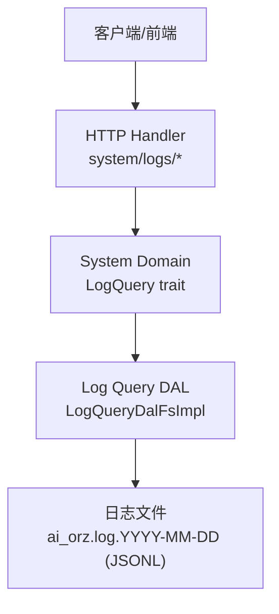
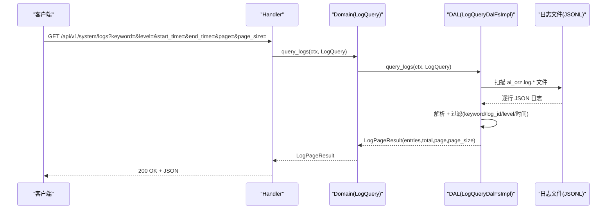
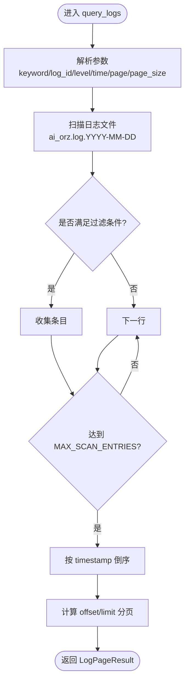
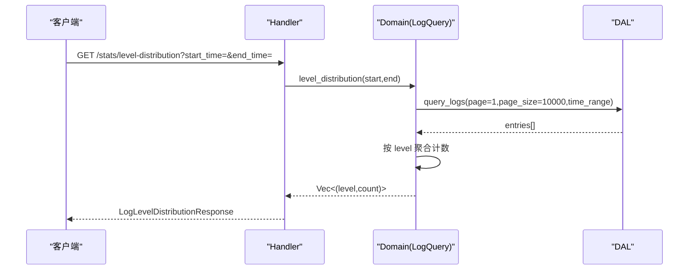
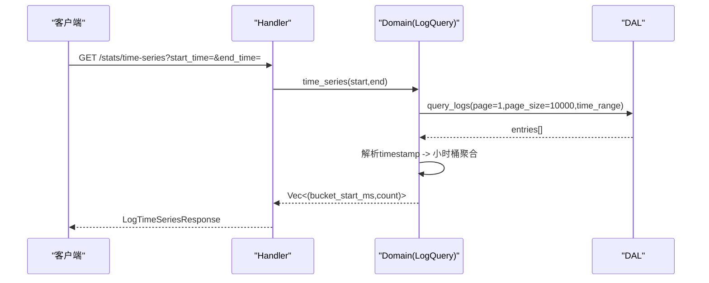
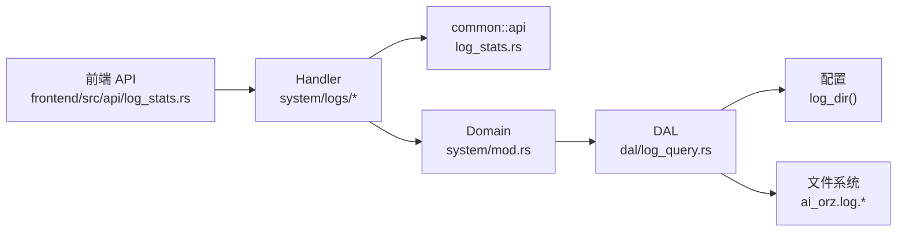

# 日志查询处理器

<cite>
**本文引用的文件**
- [src/handlers/system/logs/mod.rs](file://src/handlers/system/logs/mod.rs)
- [src/handlers/system/logs/query_logs.rs](file://src/handlers/system/logs/query_logs.rs)
- [src/handlers/system/logs/log_stats.rs](file://src/handlers/system/logs/log_stats.rs)
- [common/src/api/log_stats.rs](file://common/src/api/log_stats.rs)
- [src/service/domain/system/mod.rs](file://src/service/domain/system/mod.rs)
- [src/service/dal/log_query.rs](file://src/service/dal/log_query.rs)
- [frontend/src/api/log_stats.rs](file://frontend/src/api/log_stats.rs)
</cite>

## 目录
1. [简介](#简介)
2. [项目结构](#项目结构)
3. [核心组件](#核心组件)
4. [架构总览](#架构总览)
5. [详细组件分析](#详细组件分析)
6. [依赖关系分析](#依赖关系分析)
7. [性能与索引优化](#性能与索引优化)
8. [故障排查指南](#故障排查指南)
9. [结论](#结论)
10. [附录：API 使用示例](#附录api-使用示例)

## 简介
本文件为“日志查询处理器”的完整技术文档，覆盖系统日志检索、过滤与分析的 HTTP 接口实现。重点说明日志级别过滤、时间范围查询、关键词搜索、分页加载机制；并文档化日志统计信息的收集、聚合与展示（错误率、请求量、时序指标）。同时解释日志存储结构、查询性能调优策略，提供 API 使用示例、实时日志流处理建议与归档策略，以及日志分析工具与监控集成方案。

## 项目结构
日志查询相关代码遵循四层单向调用：Adapter（HTTP Handler）→ Domain → DAL → 文件系统（日志 JSONL 文件）。Handler 层仅负责参数解析与转发；Domain 层定义 LogQuery trait 并提供统计聚合逻辑；DAL 层负责从按日滚动的 JSONL 文件中读取、解析、过滤与分页。

图示来源
- [src/handlers/system/logs/query_logs.rs:1-29](file://src/handlers/system/logs/query_logs.rs#L1-L29)
- [src/handlers/system/logs/log_stats.rs:1-76](file://src/handlers/system/logs/log_stats.rs#L1-L76)
- [src/service/domain/system/mod.rs:151-170](file://src/service/domain/system/mod.rs#L151-L170)
- [src/service/dal/log_query.rs:100-210](file://src/service/dal/log_query.rs#L100-L210)

章节来源
- [src/handlers/system/logs/mod.rs:1-6](file://src/handlers/system/logs/mod.rs#L1-L6)
- [src/handlers/system/logs/query_logs.rs:1-29](file://src/handlers/system/logs/query_logs.rs#L1-L29)
- [src/handlers/system/logs/log_stats.rs:1-76](file://src/handlers/system/logs/log_stats.rs#L1-L76)
- [src/service/domain/system/mod.rs:151-170](file://src/service/domain/system/mod.rs#L151-L170)
- [src/service/dal/log_query.rs:1-24](file://src/service/dal/log_query.rs#L1-L24)

## 核心组件
- HTTP Handler
  - GET /api/v1/system/logs：查询应用日志，支持 keyword、log_id、level、start_time、end_time、page、page_size。
  - GET /api/v1/system/logs/stats/level-distribution：返回日志级别分布（INFO/WARN/ERROR/DEBUG/TRACE），默认最近 24 小时。
  - GET /api/v1/system/logs/stats/time-series：返回按小时桶的日志时序数据，默认最近 24 小时。
- Domain 层
  - LogQuery trait：定义 query_logs、level_distribution、time_series 三个方法。
  - SystemDomainImpl 实现：对 level_distribution 与 time_series 进行内存聚合（基于 DAL 拉取的结果）。
- DAL 层
  - LogQueryDalFsImpl：扫描 ai_orz.log.YYYY-MM-DD 文件，逐行解析 JSON，应用过滤条件，排序后分页返回。
  - 数据结构：LogEntry、LogQuery、LogPageResult。
- DTO（common::api）
  - LogQueryRequest、LogStatsQueryParams、LogLevelDistributionResponse、LogTimeSeriesResponse 等。

章节来源
- [src/handlers/system/logs/query_logs.rs:1-29](file://src/handlers/system/logs/query_logs.rs#L1-L29)
- [src/handlers/system/logs/log_stats.rs:1-76](file://src/handlers/system/logs/log_stats.rs#L1-L76)
- [common/src/api/log_stats.rs:41-77](file://common/src/api/log_stats.rs#L41-L77)
- [src/service/domain/system/mod.rs:151-170](file://src/service/domain/system/mod.rs#L151-L170)
- [src/service/dal/log_query.rs:32-82](file://src/service/dal/log_query.rs#L32-L82)

## 架构总览
日志查询处理器采用清晰的 Adapter → Domain → DAL 分层：
- Adapter（Handler）：接收请求，构造 LogQueryRequest/LogStatsQueryParams，调用 Domain。
- Domain：对外暴露统一 LogQuery trait；统计类方法在 Domain 层做轻量聚合。
- DAL：实现具体日志读取与过滤逻辑，面向文件系统（JSONL 滚动日志）。

图示来源
- [src/handlers/system/logs/query_logs.rs:13-28](file://src/handlers/system/logs/query_logs.rs#L13-L28)
- [src/service/domain/system/mod.rs:281-284](file://src/service/domain/system/mod.rs#L281-L284)
- [src/service/dal/log_query.rs:120-210](file://src/service/dal/log_query.rs#L120-L210)

## 详细组件分析

### 日志查询接口（GET /api/v1/system/logs）
- 功能：按关键词、log_id、日志级别、时间范围过滤，支持分页。
- 参数：
  - keyword：message 字段包含（不区分大小写）
  - log_id：精确匹配
  - level：INFO/WARN/ERROR/DEBUG（不区分大小写）
  - start_time/end_time：unix ms，含边界
  - page/page_size：页码从 1 开始，默认 20
- 返回：LogPageResult（entries、total、page、page_size）

图示来源
- [src/service/dal/log_query.rs:120-210](file://src/service/dal/log_query.rs#L120-L210)
- [src/service/dal/log_query.rs:260-354](file://src/service/dal/log_query.rs#L260-L354)

章节来源
- [src/handlers/system/logs/query_logs.rs:13-28](file://src/handlers/system/logs/query_logs.rs#L13-L28)
- [src/service/dal/log_query.rs:120-210](file://src/service/dal/log_query.rs#L120-L210)
- [src/service/dal/log_query.rs:260-354](file://src/service/dal/log_query.rs#L260-L354)

### 日志级别分布接口（GET /api/v1/system/logs/stats/level-distribution）
- 功能：统计指定时间范围内各日志级别的计数，默认最近 24 小时。
- 参数：start_time、end_time（unix ms）
- 返回：LogLevelDistributionResponse（items: [{level,count}], total）

图示来源
- [src/handlers/system/logs/log_stats.rs:25-49](file://src/handlers/system/logs/log_stats.rs#L25-L49)
- [src/service/domain/system/mod.rs:286-309](file://src/service/domain/system/mod.rs#L286-L309)

章节来源
- [src/handlers/system/logs/log_stats.rs:25-49](file://src/handlers/system/logs/log_stats.rs#L25-L49)
- [src/service/domain/system/mod.rs:286-309](file://src/service/domain/system/mod.rs#L286-L309)
- [common/src/api/log_stats.rs:7-23](file://common/src/api/log_stats.rs#L7-L23)

### 日志时序接口（GET /api/v1/system/logs/stats/time-series）
- 功能：按小时桶统计日志数量，默认最近 24 小时。
- 参数：start_time、end_time（unix ms）
- 返回：LogTimeSeriesResponse（points: [{interval_start,count}]）

图示来源
- [src/handlers/system/logs/log_stats.rs:51-76](file://src/handlers/system/logs/log_stats.rs#L51-L76)
- [src/service/domain/system/mod.rs:311-341](file://src/service/domain/system/mod.rs#L311-L341)

章节来源
- [src/handlers/system/logs/log_stats.rs:51-76](file://src/handlers/system/logs/log_stats.rs#L51-L76)
- [src/service/domain/system/mod.rs:311-341](file://src/service/domain/system/mod.rs#L311-L341)
- [common/src/api/log_stats.rs:25-39](file://common/src/api/log_stats.rs#L25-L39)

### 日志存储结构与解析
- 存储格式：tracing-appender 按日滚动生成 JSONL，文件名 ai_orz.log.YYYY-MM-DD。
- 单行 JSON 字段：
  - timestamp：ISO8601/RFC3339
  - level：日志级别
  - fields.message：消息体
  - fields.log_id：调用链 ID
  - fields.user_id：用户 ID
  - fields.operation：操作名
  - target/filename/line_number：定位信息
- 解析与过滤：
  - 关键字过滤：message 不区分大小写包含
  - 级别过滤：不区分大小写
  - log_id 精确匹配
  - 时间范围：将 timestamp 解析为 unix ms 比较
  - 结果排序：按 timestamp 字典序倒序（最新在前）
  - 分页：offset=(page-1)*page_size，take(page_size)

章节来源
- [src/service/dal/log_query.rs:1-24](file://src/service/dal/log_query.rs#L1-L24)
- [src/service/dal/log_query.rs:260-354](file://src/service/dal/log_query.rs#L260-L354)
- [src/service/dal/log_query.rs:196-209](file://src/service/dal/log_query.rs#L196-L209)

### 分页加载机制
- 默认 page=1，page_size=20；page=0 时归一化为 1。
- 单次查询最多收集 MAX_SCAN_ENTRIES=10000 条记录，防止内存溢出。
- 统计接口复用 query_logs，设置 page_size=10000 以支撑可视化场景。

章节来源
- [src/service/dal/log_query.rs:120-130](file://src/service/dal/log_query.rs#L120-L130)
- [src/service/dal/log_query.rs:114-117](file://src/service/dal/log_query.rs#L114-L117)
- [src/service/domain/system/mod.rs:292-302](file://src/service/domain/system/mod.rs#L292-L302)
- [src/service/domain/system/mod.rs:317-325](file://src/service/domain/system/mod.rs#L317-L325)

### 实时日志流处理
当前实现为“拉取式”查询（HTTP GET 返回历史日志）。若需实时流：
- 可新增 SSE 端点，订阅日志文件尾部增量（tail -f 语义），按事件推送。
- 或使用 AOP 事件队列（AopStatsCollector/AopMonitor）作为内部事件总线，再暴露 SSE 或 WebSocket。
- 注意：当前日志写入由 tracing-appender 完成，SSE 应仅消费只读文件，避免阻塞写入。

[本节为概念性设计，不直接引用具体源码]

### 日志归档策略
- 文件命名：ai_orz.log.YYYY-MM-DD，便于按天归档。
- 扫描窗口：默认仅保留最近 MAX_SCAN_DAYS=30 天的文件，旧文件自动忽略。
- 建议：结合外部归档工具（如压缩冷数据、迁移至对象存储），并在服务启动时清理过期文件。

章节来源
- [src/service/dal/log_query.rs:217-258](file://src/service/dal/log_query.rs#L217-L258)

## 依赖关系分析
- Handler 依赖 common::api 的 DTO 与 Domain。
- Domain 通过 LogQuery trait 抽象日志查询能力，实现委托给 DAL。
- DAL 依赖配置获取日志目录，并直接访问文件系统。
- 前端通过 frontend/src/api/log_stats.rs 调用后端统计接口。

图示来源
- [frontend/src/api/log_stats.rs:31-55](file://frontend/src/api/log_stats.rs#L31-L55)
- [src/handlers/system/logs/log_stats.rs:1-76](file://src/handlers/system/logs/log_stats.rs#L1-L76)
- [common/src/api/log_stats.rs:41-77](file://common/src/api/log_stats.rs#L41-L77)
- [src/service/domain/system/mod.rs:151-170](file://src/service/domain/system/mod.rs#L151-L170)
- [src/service/dal/log_query.rs:120-210](file://src/service/dal/log_query.rs#L120-L210)

章节来源
- [frontend/src/api/log_stats.rs:31-55](file://frontend/src/api/log_stats.rs#L31-L55)
- [src/handlers/system/logs/log_stats.rs:1-76](file://src/handlers/system/logs/log_stats.rs#L1-L76)
- [common/src/api/log_stats.rs:41-77](file://common/src/api/log_stats.rs#L41-L77)
- [src/service/domain/system/mod.rs:151-170](file://src/service/domain/system/mod.rs#L151-L170)
- [src/service/dal/log_query.rs:120-210](file://src/service/dal/log_query.rs#L120-L210)

## 性能与索引优化
- 文件扫描优化
  - 仅扫描最近 MAX_SCAN_DAYS=30 天的日志文件，减少 I/O。
  - 限制单次扫描条目数 MAX_SCAN_ENTRIES=10000，防止内存膨胀。
- 过滤顺序
  - 先进行轻量级过滤（level、log_id、keyword），再解析时间戳，降低解析成本。
- 排序与分页
  - 按 ISO8601 字符串字典序倒序排序，避免复杂时间解析开销。
  - 使用 skip/take 实现高效分页。
- 统计接口优化
  - level_distribution 与 time_series 复用 query_logs，page_size=10000，适合可视化渲染。
- 未来优化方向
  - 引入 SQLite FTS5 或 DuckDB 对日志进行结构化索引，提升关键词与时间范围查询性能。
  - 对高频查询建立物化视图（如每小时桶的预聚合表）。
  - 使用异步并发读取多文件，提高吞吐。

章节来源
- [src/service/dal/log_query.rs:114-117](file://src/service/dal/log_query.rs#L114-L117)
- [src/service/dal/log_query.rs:217-258](file://src/service/dal/log_query.rs#L217-L258)
- [src/service/dal/log_query.rs:196-209](file://src/service/dal/log_query.rs#L196-L209)
- [src/service/domain/system/mod.rs:292-302](file://src/service/domain/system/mod.rs#L292-L302)
- [src/service/domain/system/mod.rs:317-325](file://src/service/domain/system/mod.rs#L317-L325)

## 故障排查指南
- 日志目录不存在：返回空结果（total=0，entries=[]），检查配置中的 log_dir。
- 非法时间戳：启用时间过滤时，无法解析 timestamp 的行将被丢弃。
- 空字段处理：fields 中 log_id/user_id/operation 为空字符串会被视为 None。
- 权限问题：路由层 require_role_middleware 要求 Admin/SuperAdmin 访问。
- 性能问题：大时间范围+无过滤可能导致大量扫描，建议缩小时间范围或增加过滤条件。

章节来源
- [src/service/dal/log_query.rs:132-141](file://src/service/dal/log_query.rs#L132-L141)
- [src/service/dal/log_query.rs:330-343](file://src/service/dal/log_query.rs#L330-L343)
- [src/service/dal/log_query.rs:286-305](file://src/service/dal/log_query.rs#L286-L305)
- [src/handlers/system/logs/query_logs.rs:1-4](file://src/handlers/system/logs/query_logs.rs#L1-L4)

## 结论
日志查询处理器通过清晰的分层设计与高效的文件扫描、过滤与分页机制，提供了稳定的日志检索与统计能力。当前实现适用于中小规模日志量与可视化场景；未来可通过结构化索引与预聚合进一步提升查询性能与扩展性。

[本节为总结性内容，不直接引用具体源码]

## 附录：API 使用示例
- 查询日志
  - GET /api/v1/system/logs?keyword=error&level=ERROR&start_time=...&end_time=...&page=1&page_size=20
- 日志级别分布
  - GET /api/v1/system/logs/stats/level-distribution?start_time=...&end_time=...
- 日志时序
  - GET /api/v1/system/logs/stats/time-series?start_time=...&end_time=...

前端调用参考：
- frontend/src/api/log_stats.rs 中 get_log_level_distribution 与 get_log_time_series 封装了上述两个统计接口的调用。

章节来源
- [frontend/src/api/log_stats.rs:31-55](file://frontend/src/api/log_stats.rs#L31-L55)
- [src/handlers/system/logs/log_stats.rs:25-76](file://src/handlers/system/logs/log_stats.rs#L25-L76)
- [src/handlers/system/logs/query_logs.rs:13-28](file://src/handlers/system/logs/query_logs.rs#L13-L28)