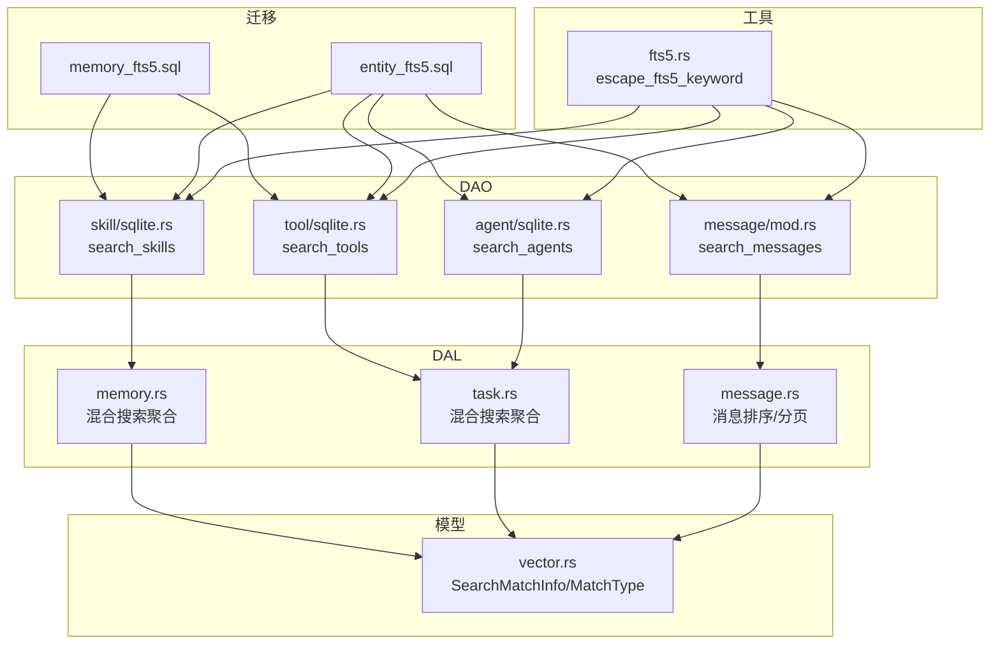
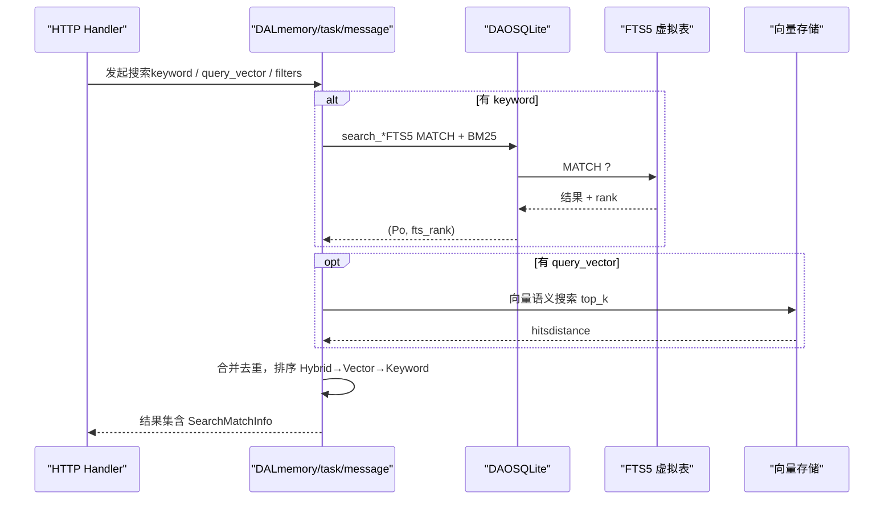
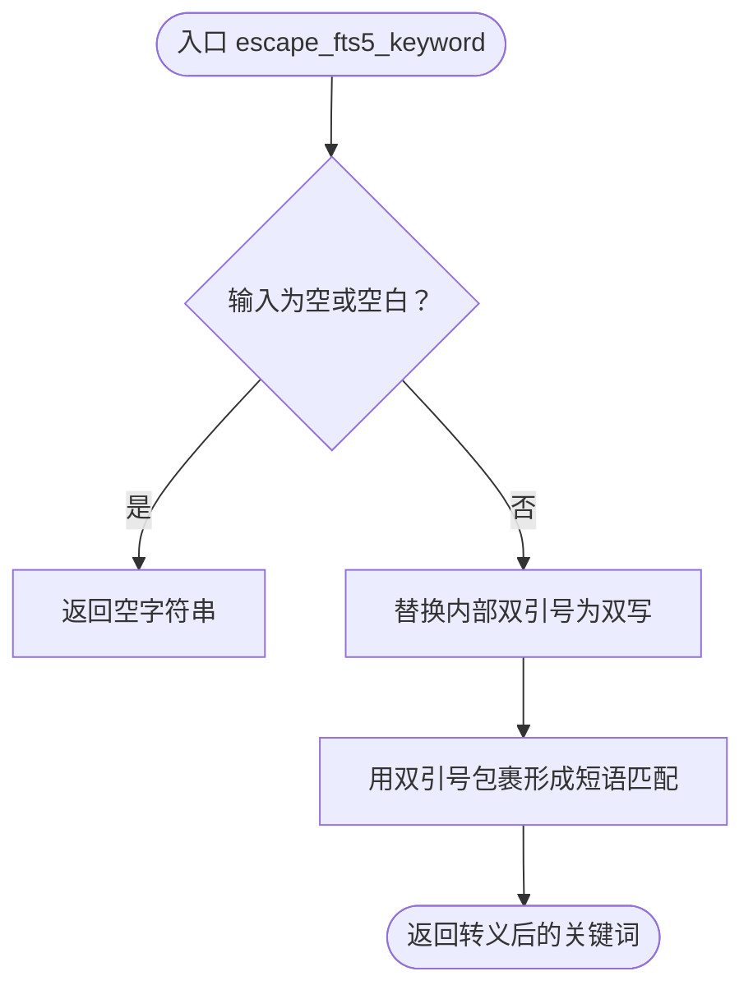
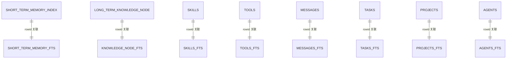
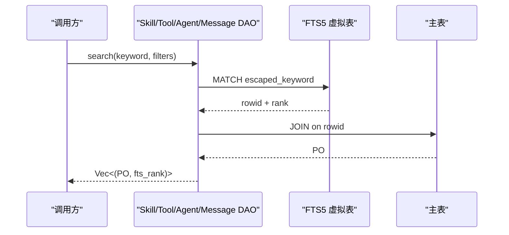
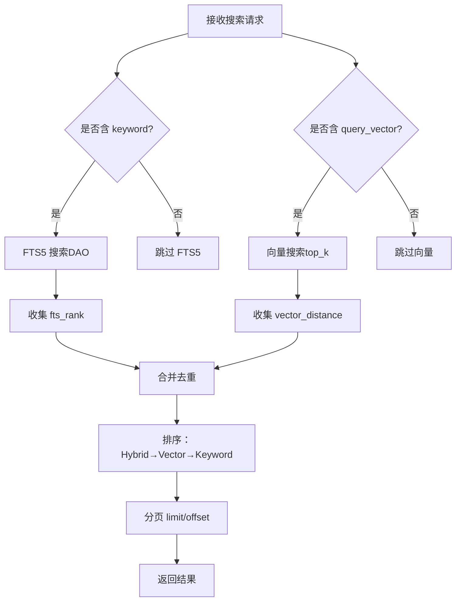
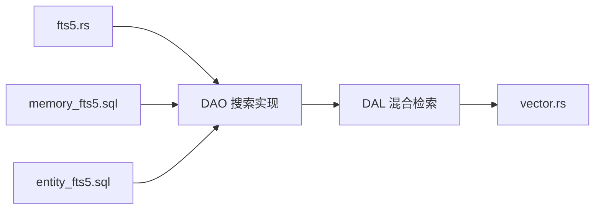

# 全文搜索

<cite>
**本文引用的文件**
- [fts5.rs](file://src/pkg/storage/fts5.rs)
- [20260712000000_memory_fts5.sql](file://migrations/20260712000000_memory_fts5.sql)
- [20260712000001_entity_fts5.sql](file://migrations/20260712000001_entity_fts5.sql)
- [memory.rs](file://src/service/dal/memory.rs)
- [task.rs](file://src/service/dal/task.rs)
- [vector.rs](file://src/models/vector.rs)
- [sqlite.rs（Skill）](file://src/service/dao/skill/sqlite.rs)
- [sqlite.rs（Tool）](file://src/service/dao/tool/sqlite.rs)
- [sqlite.rs（Agent）](file://src/service/dao/agent/sqlite.rs)
- [mod.rs（Message DAO）](file://src/service/dao/message/mod.rs)
- [message.rs（DAL）](file://src/service/dal/message.rs)
- [backup/mod.rs](file://src/handlers/system/backup/mod.rs)
</cite>

## 目录
1. [简介](#简介)
2. [项目结构](#项目结构)
3. [核心组件](#核心组件)
4. [架构总览](#架构总览)
5. [详细组件分析](#详细组件分析)
6. [依赖关系分析](#依赖关系分析)
7. [性能与调优](#性能与调优)
8. [故障排查指南](#故障排查指南)
9. [结论](#结论)
10. [附录：查询示例、排序与分页](#附录：查询示例排序与分页)

## 简介
本文件面向 AI Orz 的 FTS5 全文搜索能力，系统性说明 SQLite FTS5 的配置、索引构建、中文分词、关键词转义、查询语法、性能调优、索引维护与备份恢复策略；并给出与向量搜索结合的混合检索模式、结果排序与分页处理，以及在不同业务场景下的实践建议。

## 项目结构
FTS5 相关能力贯穿迁移脚本、DAO 层 SQL、DAL 层聚合与排序、通用工具函数与模型定义：
- 迁移脚本：为记忆与实体表创建 FTS5 虚拟表、触发器与存量回填
- 工具函数：统一关键词转义，避免 MATCH 语法错误
- DAO 层：各实体的 search_* 方法使用 FTS5 MATCH + BM25 排序
- DAL 层：混合检索（FTS5 + 向量），统一排序 Hybrid → Vector → Keyword
- 模型层：SearchMatchInfo 携带 fts_rank、match_type 等元信息

**图表来源**
- [20260712000000_memory_fts5.sql:1-92](file://migrations/20260712000000_memory_fts5.sql#L1-L92)
- [20260712000001_entity_fts5.sql:1-246](file://migrations/20260712000001_entity_fts5.sql#L1-L246)
- [fts5.rs:1-45](file://src/pkg/storage/fts5.rs#L1-L45)
- [sqlite.rs（Skill）:335-363](file://src/service/dao/skill/sqlite.rs#L335-L363)
- [sqlite.rs（Tool）:402-453](file://src/service/dao/tool/sqlite.rs#L402-L453)
- [sqlite.rs（Agent）:155-186](file://src/service/dao/agent/sqlite.rs#L155-L186)
- [mod.rs（Message DAO）:162-176](file://src/service/dao/message/mod.rs#L162-L176)
- [memory.rs:70-86](file://src/service/dal/memory.rs#L70-L86)
- [task.rs:405-472](file://src/service/dal/task.rs#L405-L472)
- [message.rs:564-579](file://src/service/dal/message.rs#L564-L579)
- [vector.rs:94-125](file://src/models/vector.rs#L94-L125)

**章节来源**
- [20260712000000_memory_fts5.sql:1-92](file://migrations/20260712000000_memory_fts5.sql#L1-L92)
- [20260712000001_entity_fts5.sql:1-246](file://migrations/20260712000001_entity_fts5.sql#L1-L246)
- [fts5.rs:1-45](file://src/pkg/storage/fts5.rs#L1-L45)

## 核心组件
- 关键词转义工具：escape_fts5_keyword，将用户输入转为短语匹配，自动转义双引号，避免空格被解释为 AND，屏蔽 FTS5 特殊字符影响
- FTS5 虚拟表与触发器：为短期记忆、知识节点及六大实体表建立 FTS5 索引，并通过 AFTER INSERT/UPDATE/DELETE 触发器保持同步
- 搜索 DAO：各实体的 search_* 方法统一采用 FTS5 MATCH + JOIN 主表 + BM25 排序，返回 fts_rank
- 混合检索 DAL：MemoryDAL、TaskDAL、MessageDAL 在 DAL 层聚合 FTS5 与向量搜索结果，按 Hybrid → Vector → Keyword 排序
- 模型元信息：SearchMatchInfo 记录 match_type、fts_rank、vector_distance 等，便于上层展示与排序

**章节来源**
- [fts5.rs:6-18](file://src/pkg/storage/fts5.rs#L6-L18)
- [20260712000000_memory_fts5.sql:12-92](file://migrations/20260712000000_memory_fts5.sql#L12-L92)
- [20260712000001_entity_fts5.sql:14-246](file://migrations/20260712000001_entity_fts5.sql#L14-L246)
- [sqlite.rs（Skill）:335-363](file://src/service/dao/skill/sqlite.rs#L335-L363)
- [sqlite.rs（Tool）:402-453](file://src/service/dao/tool/sqlite.rs#L402-L453)
- [sqlite.rs（Agent）:155-186](file://src/service/dao/agent/sqlite.rs#L155-L186)
- [mod.rs（Message DAO）:162-176](file://src/service/dao/message/mod.rs#L162-L176)
- [memory.rs:70-86](file://src/service/dal/memory.rs#L70-L86)
- [task.rs:405-472](file://src/service/dal/task.rs#L405-L472)
- [vector.rs:94-125](file://src/models/vector.rs#L94-L125)

## 架构总览
FTS5 全文搜索在四层单向调用中位于 DAO/DAL 层，向上暴露统一接口，向下通过 SQL 与 SQLite FTS5 交互，并与向量搜索协同完成混合检索。

**图表来源**
- [memory.rs:70-86](file://src/service/dal/memory.rs#L70-L86)
- [task.rs:405-472](file://src/service/dal/task.rs#L405-L472)
- [sqlite.rs（Skill）:335-363](file://src/service/dao/skill/sqlite.rs#L335-L363)
- [sqlite.rs（Tool）:402-453](file://src/service/dao/tool/sqlite.rs#L402-L453)
- [sqlite.rs（Agent）:155-186](file://src/service/dao/agent/sqlite.rs#L155-L186)
- [mod.rs（Message DAO）:162-176](file://src/service/dao/message/mod.rs#L162-L176)

## 详细组件分析

### 关键词转义与短语匹配
- 设计目标：将用户输入安全地用于 FTS5 MATCH，避免解析歧义与注入风险
- 行为要点：
  - 空输入直接返回空字符串，避免执行无效 MATCH
  - 内部双引号双写转义，外层包裹形成短语匹配
  - 空格不视为 AND，保证“短语”语义
  - 屏蔽 FTS5 特殊字符（如 *、(、) 等）

**图表来源**
- [fts5.rs:6-18](file://src/pkg/storage/fts5.rs#L6-L18)

**章节来源**
- [fts5.rs:6-18](file://src/pkg/storage/fts5.rs#L6-L18)

### FTS5 表创建与触发器同步
- 记忆类：short_term_memory_fts、knowledge_node_fts，字段覆盖 summary/tags 或 node_name/summary/node_description
- 实体类：skills_fts、tools_fts、messages_fts、tasks_fts、projects_fts、agents_fts，覆盖各自关键可搜索字段
- 触发器：AFTER INSERT/UPDATE/DELETE 三态同步，确保 FTS 与主表一致
- 存量回填：迁移脚本包含 SELECT ... FROM main_table 回填语句

**图表来源**
- [20260712000000_memory_fts5.sql:12-92](file://migrations/20260712000000_memory_fts5.sql#L12-L92)
- [20260712000001_entity_fts5.sql:14-246](file://migrations/20260712000001_entity_fts5.sql#L14-L246)

**章节来源**
- [20260712000000_memory_fts5.sql:12-92](file://migrations/20260712000000_memory_fts5.sql#L12-L92)
- [20260712000001_entity_fts5.sql:14-246](file://migrations/20260712000001_entity_fts5.sql#L14-L246)

### 搜索 DAO：FTS5 MATCH + BM25 排序
- Skill/Tool/Agent/Message 等 DAO 的 search_* 方法统一：
  - 使用 escape_fts5_keyword 构造 MATCH 参数
  - 从对应 fts 表 JOIN 主表获取完整 PO
  - ORDER BY fts.rank（BM25，越小越相关）
  - 限制最大返回数量（默认 20，防止全量扫描）
  - 支持分页 offset

**图表来源**
- [sqlite.rs（Skill）:335-363](file://src/service/dao/skill/sqlite.rs#L335-L363)
- [sqlite.rs（Tool）:402-453](file://src/service/dao/tool/sqlite.rs#L402-L453)
- [sqlite.rs（Agent）:155-186](file://src/service/dao/agent/sqlite.rs#L155-L186)
- [mod.rs（Message DAO）:162-176](file://src/service/dao/message/mod.rs#L162-L176)

**章节来源**
- [sqlite.rs（Skill）:335-363](file://src/service/dao/skill/sqlite.rs#L335-L363)
- [sqlite.rs（Tool）:402-453](file://src/service/dao/tool/sqlite.rs#L402-L453)
- [sqlite.rs（Agent）:155-186](file://src/service/dao/agent/sqlite.rs#L155-L186)
- [mod.rs（Message DAO）:162-176](file://src/service/dao/message/mod.rs#L162-L176)

### DAL 层混合检索与排序
- MemoryDAL：聚合短期记忆与知识节点的 FTS5 与向量结果，按 Hybrid → Vector → Keyword 排序
- TaskDAL：任务搜索同样走混合检索，向量失败降级为纯关键词
- MessageDAL：消息搜索支持 FTS5 与向量，最终排序与分页

**图表来源**
- [memory.rs:70-86](file://src/service/dal/memory.rs#L70-L86)
- [task.rs:405-472](file://src/service/dal/task.rs#L405-L472)
- [message.rs:564-579](file://src/service/dal/message.rs#L564-L579)

**章节来源**
- [memory.rs:70-86](file://src/service/dal/memory.rs#L70-L86)
- [task.rs:405-472](file://src/service/dal/task.rs#L405-L472)
- [message.rs:564-579](file://src/service/dal/message.rs#L564-L579)

### 模型层：SearchMatchInfo 与 MatchType
- MatchType：Vector / Keyword / Hybrid，标识命中类型
- SearchMatchInfo：携带 match_type、fts_rank、vector_distance、embedding_model、indexed_at、content_hash 等
- 作用：统一描述搜索结果来源与相关性指标，支撑前端排序与展示

**章节来源**
- [vector.rs:94-125](file://src/models/vector.rs#L94-L125)

## 依赖关系分析
- DAO 层对 FTS5 虚拟表的依赖：通过迁移脚本创建，DAO 仅负责 MATCH 查询
- DAL 层对 DAO 与向量存储的依赖：DAL 编排 FTS5 与向量，统一排序
- 工具函数解耦：escape_fts5_keyword 被多个 DAO 复用，避免重复实现
- 触发器保障数据一致性：主表变更自动同步至 FTS5

**图表来源**
- [fts5.rs:1-45](file://src/pkg/storage/fts5.rs#L1-L45)
- [20260712000000_memory_fts5.sql:1-92](file://migrations/20260712000000_memory_fts5.sql#L1-L92)
- [20260712000001_entity_fts5.sql:1-246](file://migrations/20260712000001_entity_fts5.sql#L1-L246)
- [sqlite.rs（Skill）:335-363](file://src/service/dao/skill/sqlite.rs#L335-L363)
- [sqlite.rs（Tool）:402-453](file://src/service/dao/tool/sqlite.rs#L402-L453)
- [sqlite.rs（Agent）:155-186](file://src/service/dao/agent/sqlite.rs#L155-L186)
- [memory.rs:70-86](file://src/service/dal/memory.rs#L70-L86)
- [task.rs:405-472](file://src/service/dal/task.rs#L405-L472)
- [vector.rs:94-125](file://src/models/vector.rs#L94-L125)

**章节来源**
- [fts5.rs:1-45](file://src/pkg/storage/fts5.rs#L1-L45)
- [20260712000000_memory_fts5.sql:1-92](file://migrations/20260712000000_memory_fts5.sql#L1-L92)
- [20260712000001_entity_fts5.sql:1-246](file://migrations/20260712000001_entity_fts5.sql#L1-L246)
- [sqlite.rs（Skill）:335-363](file://src/service/dao/skill/sqlite.rs#L335-L363)
- [sqlite.rs（Tool）:402-453](file://src/service/dao/tool/sqlite.rs#L402-L453)
- [sqlite.rs（Agent）:155-186](file://src/service/dao/agent/sqlite.rs#L155-L186)
- [memory.rs:70-86](file://src/service/dal/memory.rs#L70-L86)
- [task.rs:405-472](file://src/service/dal/task.rs#L405-L472)
- [vector.rs:94-125](file://src/models/vector.rs#L94-L125)

## 性能与调优
- 分词器选择：trigram 支持中英文混合，基于三字符子串匹配，适合短文本与多语言场景
- 关键词转义：统一使用 escape_fts5_keyword，避免 MATCH 解析异常与全表扫描
- 结果上限：搜索场景默认限制返回条数（如 20），防止关键词失控导致大结果集
- BM25 排序：rank 越小越相关，DAL 层按 Hybrid → Vector → Keyword 综合排序
- 向量降级：当向量搜索不可用时，自动降级为纯关键词搜索，保障可用性
- 索引维护：触发器自动同步，增量更新开销小；必要时可重建向量索引

[本节为通用指导，无需具体文件引用]

## 故障排查指南
- 关键词为空：escape_fts5_keyword 返回空字符串，避免 MATCH 报错；DAL 层会跳过 FTS5 搜索
- 特殊字符未转义：统一通过 escape_fts5_keyword 处理，若自定义拼接需遵循相同规则
- 触发器不同步：检查迁移脚本是否正确执行，确认 AFTER INSERT/UPDATE/DELETE 触发器存在
- 向量不可用：DAL 层记录警告日志并降级到关键词搜索，优先保证功能可用
- 权限问题：备份/恢复操作需 SuperAdmin 权限校验

**章节来源**
- [fts5.rs:6-18](file://src/pkg/storage/fts5.rs#L6-L18)
- [20260712000000_memory_fts5.sql:32-79](file://migrations/20260712000000_memory_fts5.sql#L32-L79)
- [20260712000001_entity_fts5.sql:68-217](file://migrations/20260712000001_entity_fts5.sql#L68-L217)
- [task.rs:405-430](file://src/service/dal/task.rs#L405-L430)
- [backup/mod.rs:19-32](file://src/handlers/system/backup/mod.rs#L19-L32)

## 结论
AI Orz 的 FTS5 全文搜索以 trigram 分词器为基础，结合统一的关键词转义、触发器自动同步、BM25 相关性排序与 DAL 层混合检索，实现了稳定高效的中文与英文混合检索能力。通过 SearchMatchInfo 与 MatchType，系统能够清晰表达命中来源与相关性，并在向量不可用时优雅降级。配合合理的分页与结果上限控制，可在大规模数据下保持良好性能。

[本节为总结性内容，无需具体文件引用]

## 附录：查询示例、排序与分页
- 关键词转义：使用 escape_fts5_keyword 将用户输入封装为短语匹配，避免空格与特殊字符干扰
- 搜索语法：FTS5 MATCH 左侧必须使用完整表名（非别名），右侧绑定转义后的关键词
- 排序规则：DAO 层 ORDER BY fts.rank（BM25，越小越相关）；DAL 层综合排序 Hybrid → Vector → Keyword
- 分页处理：LIMIT 默认不超过 20，OFFSET 可选；消息搜索在 DAL 层进行最终 limit 截取
- 混合检索：同时提供 keyword 与 query_vector 时，DAL 层合并去重并按优先级排序

**章节来源**
- [sqlite.rs（Skill）:335-363](file://src/service/dao/skill/sqlite.rs#L335-L363)
- [sqlite.rs（Tool）:402-453](file://src/service/dao/tool/sqlite.rs#L402-L453)
- [sqlite.rs（Agent）:155-186](file://src/service/dao/agent/sqlite.rs#L155-L186)
- [task.rs:513-542](file://src/service/dal/task.rs#L513-L542)
- [message.rs:564-579](file://src/service/dal/message.rs#L564-L579)