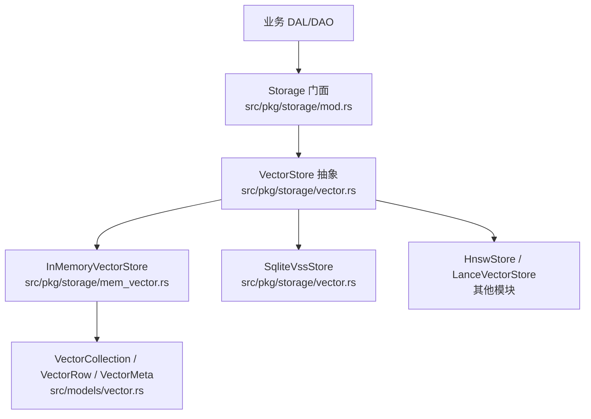
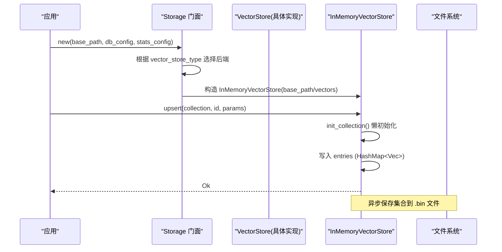
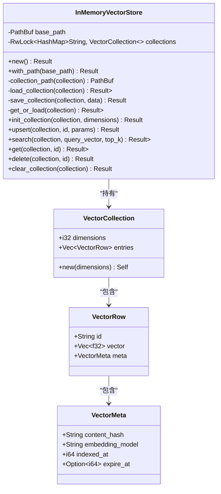
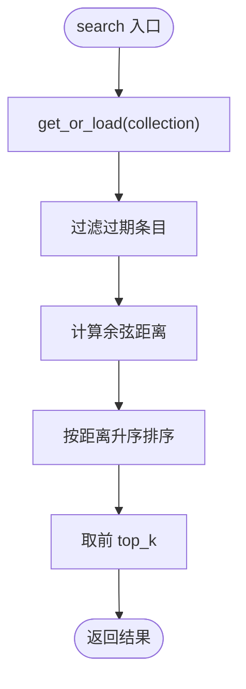
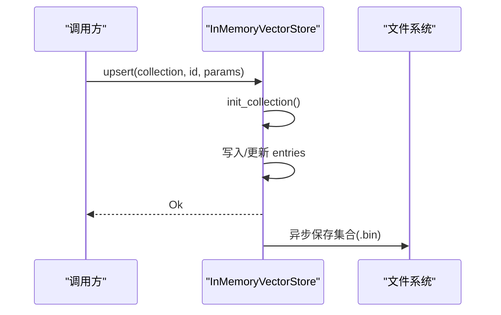
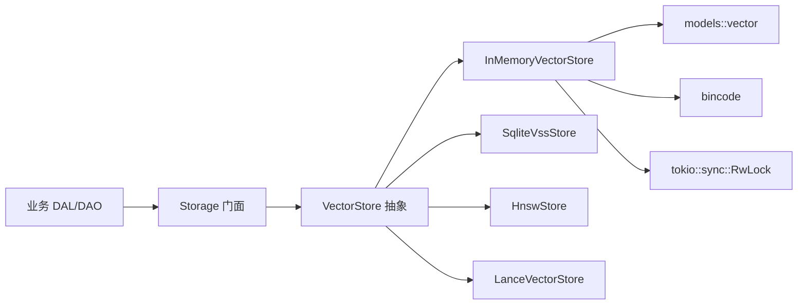

# 内存向量存储

<cite>
**本文引用的文件**
- [mem_vector.rs](file://src/pkg/storage/mem_vector.rs)
- [vector.rs](file://src/pkg/storage/vector.rs)
- [mod.rs](file://src/pkg/storage/mod.rs)
- [vector.rs（模型）](file://src/models/vector.rs)
- [vector_search_architecture.md](file://docs/vector_search_architecture.md)
- [message_vector_test.rs](file://tests/integration/message_vector_test.rs)
</cite>

## 目录
1. [简介](#简介)
2. [项目结构](#项目结构)
3. [核心组件](#核心组件)
4. [架构总览](#架构总览)
5. [详细组件分析](#详细组件分析)
6. [依赖关系分析](#依赖关系分析)
7. [性能与容量规划](#性能与容量规划)
8. [故障排除指南](#故障排除指南)
9. [结论](#结论)
10. [附录：与持久化后端的对比](#附录与持久化后端的对比)

## 简介
本文件面向 AI Orz 的内存向量存储实现，聚焦 InMemoryVectorStore 的设计与实现原理。内容涵盖：
- 基于 Rust 原生数据结构的向量索引构建与生命周期管理
- 相似度计算算法（余弦距离）与检索流程
- 插入、更新、删除操作的内存管理与异步持久化策略
- 批量操作的性能特点、内存使用模式与并发安全机制
- 容量规划建议、性能调优技巧与故障排除
- 与持久化后端（SQLite VSS、HNSW、LanceDB）的对比分析与适用场景

## 项目结构
InMemoryVectorStore 位于存储抽象层之下，作为 VectorStore trait 的一种纯内存实现，并通过 Storage 门面按配置注入到系统中。

图表来源
- [mod.rs:36-122](file://src/pkg/storage/mod.rs#L36-L122)
- [vector.rs:18-74](file://src/pkg/storage/vector.rs#L18-L74)
- [mem_vector.rs:18-101](file://src/pkg/storage/mem_vector.rs#L18-L101)
- [vector.rs（模型）:9-67](file://src/models/vector.rs#L9-L67)

章节来源
- [mod.rs:1-212](file://src/pkg/storage/mod.rs#L1-L212)
- [vector.rs:1-291](file://src/pkg/storage/vector.rs#L1-L291)
- [mem_vector.rs:1-276](file://src/pkg/storage/mem_vector.rs#L1-L276)
- [vector.rs（模型）:1-192](file://src/models/vector.rs#L1-L192)

## 核心组件
- VectorStore 抽象：定义统一的增删改查与搜索接口，支持多后端可插拔切换。
- InMemoryVectorStore：纯 Rust 内存实现，基于 HashMap + Vec 的集合结构，懒加载持久化到磁盘（bincode）。
- 数据结构：VectorCollection、VectorRow、VectorMeta、VectorIndexParams 等统一数据模型。

章节来源
- [vector.rs:18-74](file://src/pkg/storage/vector.rs#L18-L74)
- [mem_vector.rs:18-101](file://src/pkg/storage/mem_vector.rs#L18-L101)
- [vector.rs（模型）:9-67](file://src/models/vector.rs#L9-L67)

## 架构总览
InMemoryVectorStore 通过 Storage 门面在启动时根据配置选择并注入。其内部维护每个 collection 的内存集合，并提供懒加载与异步落盘能力。

图表来源
- [mod.rs:56-122](file://src/pkg/storage/mod.rs#L56-L122)
- [mem_vector.rs:27-101](file://src/pkg/storage/mem_vector.rs#L27-L101)
- [mem_vector.rs:138-186](file://src/pkg/storage/mem_vector.rs#L138-L186)

章节来源
- [mod.rs:56-122](file://src/pkg/storage/mod.rs#L56-L122)
- [mem_vector.rs:27-101](file://src/pkg/storage/mem_vector.rs#L27-L101)

## 详细组件分析

### InMemoryVectorStore 类与职责
- 职责：提供线程安全的内存向量集合，支持懒加载、异步持久化、相似度检索。
- 关键成员：
  - base_path：持久化目录（默认 base_data_path/vectors）
  - collections：Arc<RwLock<HashMap<String, VectorCollection>>>，按集合名索引内存集合
- 关键方法：
  - new()/with_path()：创建实例并准备目录
  - get_or_load()：懒加载集合（内存命中优先，否则从 .bin 读取）
  - save_collection()：将集合序列化为 bincode 写入磁盘
  - init_collection()：确保集合存在（含维度信息）
  - upsert()/get()/delete()/clear_collection()：CRUD 操作，写后异步落盘
  - search()：线性扫描所有条目，过滤过期项，计算余弦距离，排序取 top_k

图表来源
- [mem_vector.rs:18-101](file://src/pkg/storage/mem_vector.rs#L18-L101)
- [vector.rs（模型）:9-67](file://src/models/vector.rs#L9-L67)

章节来源
- [mem_vector.rs:18-101](file://src/pkg/storage/mem_vector.rs#L18-L101)
- [vector.rs（模型）:9-67](file://src/models/vector.rs#L9-L67)

### 相似度计算与检索优化
- 相似度算法：余弦距离 = 1 - cos(θ)，其中 cos(θ) = dot(a,b)/(|a||b|)。零向量或空向量视为最大距离。
- 检索流程：
  - 获取或加载集合（懒加载）
  - 过滤过期条目（expire_at > now）
  - 对每个条目计算余弦距离
  - 按距离升序排序，返回 top_k
- 优化点：
  - 惰性加载减少冷启动 IO
  - 过滤过期项降低无效计算
  - 线性扫描适用于中小规模数据集；大规模建议使用 HNSW/LanceDB

图表来源
- [mem_vector.rs:188-228](file://src/pkg/storage/mem_vector.rs#L188-L228)
- [mem_vector.rs:103-117](file://src/pkg/storage/mem_vector.rs#L103-L117)

章节来源
- [mem_vector.rs:103-117](file://src/pkg/storage/mem_vector.rs#L103-L117)
- [mem_vector.rs:188-228](file://src/pkg/storage/mem_vector.rs#L188-L228)

### 插入、更新、删除与内存管理
- 插入/更新（upsert）：
  - 确保集合存在（init_collection），若不存在则从磁盘加载或新建
  - 在内存中查找已有 id 位置，更新或追加 VectorRow
  - 写后异步保存集合到磁盘（不阻塞调用方）
- 删除（delete）：
  - 在内存中移除对应条目
  - 写后异步保存集合到磁盘
- 清空（clear_collection）：
  - 重置集合为新的空集合（保留维度）
  - 写后异步保存集合到磁盘
- 内存管理：
  - 集合以 Vec<VectorRow> 顺序存储，适合中小规模
  - 通过 RwLock 保证并发读写安全
  - 异步持久化避免同步 IO 阻塞热点路径

图表来源
- [mem_vector.rs:138-186](file://src/pkg/storage/mem_vector.rs#L138-L186)
- [mem_vector.rs:236-254](file://src/pkg/storage/mem_vector.rs#L236-L254)
- [mem_vector.rs:256-274](file://src/pkg/storage/mem_vector.rs#L256-L274)

章节来源
- [mem_vector.rs:138-186](file://src/pkg/storage/mem_vector.rs#L138-L186)
- [mem_vector.rs:236-274](file://src/pkg/storage/mem_vector.rs#L236-L274)

### 并发安全与批处理特性
- 并发安全：
  - collections 使用 Arc<RwLock<HashMap...>>，读多写少场景下并发安全
  - 每次写操作后异步持久化，避免长时间持锁
- 批处理：
  - 当前实现未提供显式批量 API；可通过多次 upsert 调用组合
  - 由于每次 upsert 都会触发一次异步落盘，高频批量写入会产生较多 IO；建议在业务层合并后再写入或使用支持批处理的持久化后端（如 HNSW/LanceDB）

章节来源
- [mem_vector.rs:21-49](file://src/pkg/storage/mem_vector.rs#L21-L49)
- [mem_vector.rs:138-186](file://src/pkg/storage/mem_vector.rs#L138-L186)

## 依赖关系分析
- 上层依赖：
  - Storage 门面根据配置选择 VectorStore 实现（InMemory/Hnsw/LanceDb/SqliteVss）
  - 业务 DAO/DAL 通过 Storage.vector() 访问向量存储
- 内部依赖：
  - mem_vector 依赖 models::vector 的数据结构
  - 持久化使用 bincode 序列化
  - 并发控制使用 tokio::sync::RwLock

图表来源
- [mod.rs:36-122](file://src/pkg/storage/mod.rs#L36-L122)
- [vector.rs:18-74](file://src/pkg/storage/vector.rs#L18-L74)
- [mem_vector.rs:1-17](file://src/pkg/storage/mem_vector.rs#L1-L17)
- [vector.rs（模型）:1-67](file://src/models/vector.rs#L1-L67)

章节来源
- [mod.rs:36-122](file://src/pkg/storage/mod.rs#L36-L122)
- [vector.rs:18-74](file://src/pkg/storage/vector.rs#L18-L74)
- [mem_vector.rs:1-17](file://src/pkg/storage/mem_vector.rs#L1-L17)
- [vector.rs（模型）:1-67](file://src/models/vector.rs#L1-L67)

## 性能与容量规划
- 时间复杂度：
  - upsert/get/delete/clear：O(1)~O(n)（取决于集合大小与定位方式）
  - search：O(n) 线性扫描 + O(n log n) 排序（n 为有效条目数）
- 空间复杂度：
  - 内存占用 ≈ Σ(条目数 × (id长度 + 向量长度×4字节 + 元数据开销))
  - 持久化占用 ≈ 集合 bincode 文件大小（含向量与元数据）
- 容量规划建议：
  - 小数据集（万级以内）：InMemoryVectorStore 足够，延迟低、部署简单
  - 中大数据集（十万级以上）：建议切换到 HNSW/LanceDB，以获得近似最近邻检索与更好的扩展性
  - 高并发写入：考虑批处理与异步落盘合并，或采用支持事务/批写的后端
- 性能调优技巧：
  - 合理设置 top_k，避免过大导致排序成本上升
  - 使用 expire_at 清理过期向量，减少无效计算
  - 在业务层合并多次 upsert 再写入，减少 IO 次数
  - 监控内存使用与磁盘 IO，必要时调整 base_path 所在磁盘类型（SSD 更佳）

[本节为通用指导，无需特定文件引用]

## 故障排除指南
- 常见问题：
  - 向量维度不匹配：upsert/search 时维度不一致会触发断言失败；请确保同一集合维度一致
  - 空向量：余弦距离计算中零向量被视为最大距离，可能导致检索结果异常；检查上游 Embedding 生成逻辑
  - 过期条目未生效：expire_at 需大于当前时间戳；确认时间源与时区
  - 持久化失败：异步保存失败不影响主流程，但会导致重启后数据丢失；检查磁盘权限与可用空间
- 调试建议：
  - 启用日志观察 upsert/search 调用链与耗时
  - 检查 base_data_path/vectors 目录下 .bin 文件是否生成与更新
  - 使用 with_path 指定测试目录，隔离数据与复现问题

章节来源
- [mem_vector.rs:103-117](file://src/pkg/storage/mem_vector.rs#L103-L117)
- [mem_vector.rs:202-217](file://src/pkg/storage/mem_vector.rs#L202-L217)
- [mem_vector.rs:175-183](file://src/pkg/storage/mem_vector.rs#L175-L183)

## 结论
InMemoryVectorStore 提供了零系统依赖、跨平台一致的内存向量存储实现，适合开发、测试与小规模生产场景。其设计简洁、易于理解与维护，并通过懒加载与异步持久化平衡了性能与可靠性。对于大规模数据与高并发场景，建议评估 HNSW/LanceDB 等后端以获得更优的检索性能与扩展性。

[本节为总结性内容，无需特定文件引用]

## 附录：与持久化后端的对比
- SQLite VSS：
  - 优点：利用数据库内置 VSS 扩展进行相似性搜索，适合已有 SQLite 生态的场景
  - 缺点：需要系统依赖（vss0 扩展），且该实现中不存储原始向量，需额外查询业务表
- HNSW：
  - 优点：近似最近邻检索，适合大规模数据；支持持久化与 lazy rebuild
  - 缺点：实现相对复杂，需权衡召回率与性能
- LanceDB：
  - 优点：列式存储、高性能嵌入式向量数据库，适合生产环境
  - 缺点：引入外部依赖，资源占用相对较高
- InMemoryVectorStore：
  - 优点：零依赖、部署简单、延迟低
  - 缺点：线性扫描，不适合超大规模数据；重启后需依赖持久化恢复

章节来源
- [vector.rs:76-291](file://src/pkg/storage/vector.rs#L76-L291)
- [vector_search_architecture.md:161-184](file://docs/vector_search_architecture.md#L161-L184)
- [vector_search_architecture.md:425-507](file://docs/vector_search_architecture.md#L425-L507)