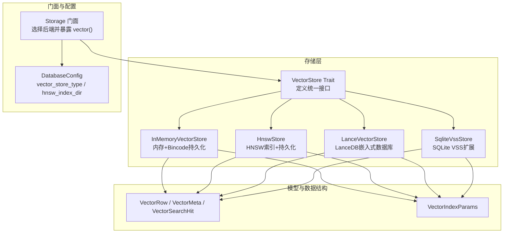
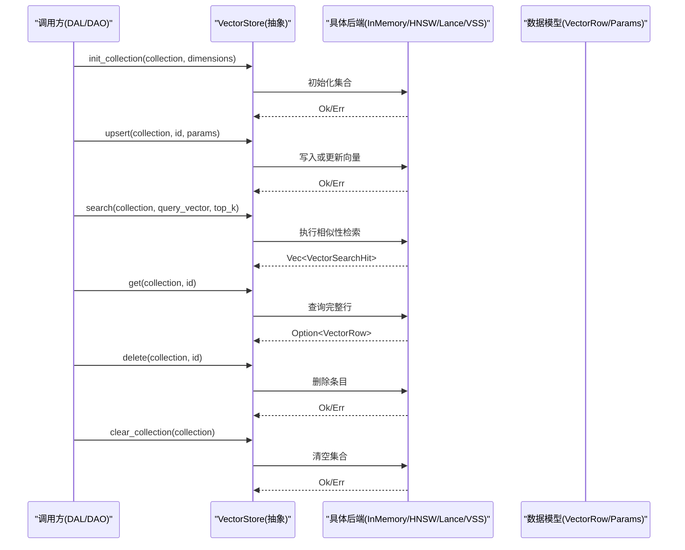
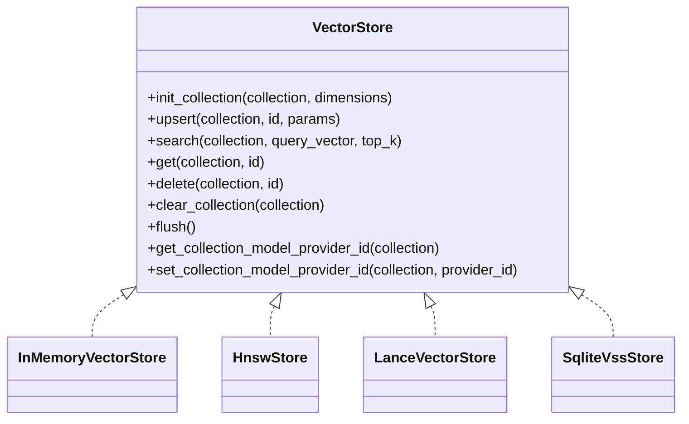
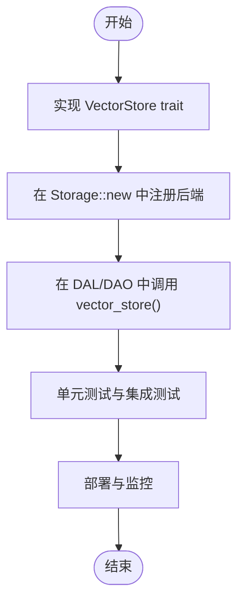

# 向量存储抽象接口

<cite>
**本文引用的文件**
- [src/pkg/storage/vector.rs](file://src/pkg/storage/vector.rs)
- [src/pkg/storage/mem_vector.rs](file://src/pkg/storage/mem_vector.rs)
- [src/pkg/storage/lance.rs](file://src/pkg/storage/lance.rs)
- [src/pkg/storage/hnsw.rs](file://src/pkg/storage/hnsw.rs)
- [src/models/vector.rs](file://src/models/vector.rs)
- [common/src/config.rs](file://common/src/config.rs)
- [src/pkg/storage/mod.rs](file://src/pkg/storage/mod.rs)
- [docs/vector_search_architecture.md](file://docs/vector_search_architecture.md)
</cite>

## 目录
1. [简介](#简介)
2. [项目结构](#项目结构)
3. [核心组件](#核心组件)
4. [架构总览](#架构总览)
5. [详细组件分析](#详细组件分析)
6. [依赖关系分析](#依赖关系分析)
7. [性能考量](#性能考量)
8. [故障排查指南](#故障排查指南)
9. [结论](#结论)
10. [附录：自定义后端实现示例](#附录自定义后端实现示例)

## 简介
本文件为 AI Orz 项目的“向量存储抽象接口”提供系统化、可操作的文档。重点围绕 VectorStore trait 的设计理念与核心方法（init_collection、upsert、search、get、delete、clear_collection，以及可选的 flush、元数据管理扩展）展开，说明参数、返回值、异常处理策略、异步模式、性能特征，并给出如何基于该接口实现自定义向量存储后端的实践指南。同时结合项目分层规范与配置机制，解释如何在不同后端（InMemory、HNSW、LanceDB、SQLite VSS）之间平滑切换，以及在 DAL/DAO 层中正确使用这些能力。

## 项目结构
向量存储相关代码位于 pkg/storage 子模块，统一通过 Storage 门面暴露；业务实体向量化与索引生命周期由 DAL/DAO 组合基础 DAO 与向量 DAO 完成。

图表来源
- [src/pkg/storage/mod.rs:36-153](file://src/pkg/storage/mod.rs#L36-L153)
- [common/src/config.rs:90-114](file://common/src/config.rs#L90-L114)
- [src/models/vector.rs:9-67](file://src/models/vector.rs#L9-L67)

章节来源
- [src/pkg/storage/mod.rs:36-153](file://src/pkg/storage/mod.rs#L36-L153)
- [common/src/config.rs:90-114](file://common/src/config.rs#L90-L114)
- [src/models/vector.rs:9-67](file://src/models/vector.rs#L9-L67)

## 核心组件
- VectorStore trait：定义跨后端统一的向量增删改查与集合管理能力，所有方法均为异步，返回统一 Result 类型，便于错误传播与降级处理。
- 数据模型：
  - VectorRow：包含 id、向量、元数据（内容哈希、嵌入模型、索引时间、过期时间）。
  - VectorSearchHit：搜索结果行 + 相似度距离。
  - VectorIndexParams：创建/更新索引所需参数（向量、内容哈希、模型提供者 ID、嵌入模型、过期时间）。
- 后端实现：
  - InMemoryVectorStore：纯 Rust 内存实现，支持 Bincode 持久化，适合开发与测试。
  - HnswStore：纯 Rust HNSW 近似最近邻索引，支持懒重建与持久化，生产可用。
  - LanceVectorStore：基于 LanceDB 的高性能嵌入式向量数据库，适合大数据集。
  - SqliteVssStore：基于 SQLite VSS 扩展，利用 SQL 进行向量检索。
- Storage 门面：根据配置自动选择后端，对外暴露 vector() 获取 Arc<dyn VectorStore>，屏蔽后端差异。

章节来源
- [src/pkg/storage/vector.rs:18-74](file://src/pkg/storage/vector.rs#L18-L74)
- [src/models/vector.rs:9-67](file://src/models/vector.rs#L9-L67)
- [src/pkg/storage/mod.rs:78-93](file://src/pkg/storage/mod.rs#L78-L93)

## 架构总览
向量存储作为通用底层能力，不感知业务逻辑；业务 DAL/DAO 负责决定“何时、对哪些字段、使用何种模型”生成向量并维护索引生命周期。搜索时，DAL 层组合关键词搜索（FTS5）与向量搜索，按 Hybrid > Vector > Keyword 三级排序合并结果。

图表来源
- [src/pkg/storage/vector.rs:23-74](file://src/pkg/storage/vector.rs#L23-L74)
- [src/pkg/storage/mem_vector.rs:119-275](file://src/pkg/storage/mem_vector.rs#L119-L275)
- [src/pkg/storage/hnsw.rs:432-616](file://src/pkg/storage/hnsw.rs#L432-L616)
- [src/pkg/storage/lance.rs:126-364](file://src/pkg/storage/lance.rs#L126-L364)
- [src/pkg/storage/vector.rs:84-235](file://src/pkg/storage/vector.rs#L84-L235)

## 详细组件分析

### VectorStore trait 设计原则与方法语义
- 设计原则
  - 统一抽象：所有后端实现同一组方法，上层零感知切换。
  - 异步优先：所有方法 async，便于与 tokio 生态集成。
  - 错误统一：返回 Result，便于在 DAL/DAO 层做降级与重试。
  - 可扩展：提供可选的 flush、元数据管理扩展点，供特定后端覆写。
- 关键方法
  - init_collection(collection, dimensions)：初始化集合，确保维度一致。
  - upsert(collection, id, params)：插入或更新向量及元数据。
  - search(collection, query_vector, top_k)：返回 Top-K 相似结果。
  - get(collection, id)：获取指定 ID 的完整向量行。
  - delete(collection, id)：删除指定 ID 的向量。
  - clear_collection(collection)：清空集合。
  - flush()：刷新脏数据到持久化（默认空实现，HnswStore 覆写）。
  - get/set_collection_model_provider_id：记录/查询集合使用的模型提供者 ID，用于重建判断。

章节来源
- [src/pkg/storage/vector.rs:18-74](file://src/pkg/storage/vector.rs#L18-L74)

### InMemoryVectorStore（内存+Bincode持久化）
- 特点
  - 零系统依赖，跨平台；余弦相似度线性扫描。
  - 懒加载集合，异步落盘 bincode 文件。
- 行为要点
  - init_collection：若存在则从磁盘加载，否则创建新集合。
  - upsert：新增或更新条目，异步保存集合。
  - search：过滤过期项，计算余弦距离，排序取 Top-K。
  - get/delete/clear_collection：内存操作并异步持久化。
- 适用场景
  - 开发、测试、小数据集；CI 安全路径。

章节来源
- [src/pkg/storage/mem_vector.rs:18-101](file://src/pkg/storage/mem_vector.rs#L18-L101)
- [src/pkg/storage/mem_vector.rs:119-275](file://src/pkg/storage/mem_vector.rs#L119-L275)

### HnswStore（HNSW 近似最近邻索引）
- 特点
  - 纯 Rust HNSW 索引，惰性重建（dirty flag），后台定时落盘，Drop 兜底。
  - 每个 collection 独立索引文件，元数据集中管理。
- 行为要点
  - init_collection：确保集合存在。
  - upsert：写入向量与行数据，标记 dirty，更新集合元数据（含 model_provider_id）。
  - search：按需重建索引，过滤过期项，Top-K 排序。
  - get/delete/clear_collection：内存状态变更并标记 dirty。
  - flush：批量落盘 dirty 集合与元数据。
  - get/set_collection_model_provider_id：用于重建流程。
- 适用场景
  - 生产环境高性能近似检索，支持冷启动加载与持久化。

章节来源
- [src/pkg/storage/hnsw.rs:149-166](file://src/pkg/storage/hnsw.rs#L149-L166)
- [src/pkg/storage/hnsw.rs:189-219](file://src/pkg/storage/hnsw.rs#L189-L219)
- [src/pkg/storage/hnsw.rs:344-388](file://src/pkg/storage/hnsw.rs#L344-L388)
- [src/pkg/storage/hnsw.rs:432-616](file://src/pkg/storage/hnsw.rs#L432-L616)

### LanceVectorStore（LanceDB 嵌入式向量数据库）
- 特点
  - 高性能列式存储，内置索引，单文件持久化，支持元数据过滤。
- 行为要点
  - init_collection：懒加载表，不存在则创建固定 schema。
  - upsert：先删除旧记录，再追加新批次（Arrow RecordBatch）。
  - search：vector_search 流式执行，收集结果并映射为标准命中结构。
  - get/delete/clear_collection：基于表查询与删除。
- 适用场景
  - 生产级大数据集，需要高性能与持久化的场景。

章节来源
- [src/pkg/storage/lance.rs:26-62](file://src/pkg/storage/lance.rs#L26-L62)
- [src/pkg/storage/lance.rs:64-123](file://src/pkg/storage/lance.rs#L64-L123)
- [src/pkg/storage/lance.rs:126-364](file://src/pkg/storage/lance.rs#L126-L364)

### SqliteVssStore（SQLite VSS 扩展）
- 特点
  - 基于 SQLite vss0 扩展，虚拟表存储向量，元数据表维护映射。
- 行为要点
  - init_collection：创建 vss_ 虚拟表。
  - upsert：先写入元数据表，再写入 vss 虚拟表。
  - search：JOIN 元数据表，过滤过期项，按距离排序。
  - get/delete/clear_collection：元数据与 vss 表联动操作。
- 适用场景
  - 已有 SQLite 基础设施且可加载 vss0 扩展的环境。

章节来源
- [src/pkg/storage/vector.rs:76-235](file://src/pkg/storage/vector.rs#L76-L235)

### 数据模型与索引参数
- VectorRow：id、向量、meta（content_hash、embedding_model、indexed_at、expire_at）。
- VectorSearchHit：row + distance。
- VectorIndexParams：vector、content_hash、model_provider_id、embedding_model、expire_at。
- MatchType/SearchMatchInfo/SearchResult：混合搜索匹配类型与元信息包装。

章节来源
- [src/models/vector.rs:9-67](file://src/models/vector.rs#L9-L67)
- [src/models/vector.rs:94-136](file://src/models/vector.rs#L94-L136)

## 依赖关系分析
- Storage 门面根据 DatabaseConfig.vector_store_type 选择后端，并通过 vector() 暴露统一接口。
- 各后端均实现 VectorStore trait，依赖 models/vector 中的数据结构。
- HnswStore 额外依赖 bincode 序列化与 instant-distance 库；LanceVectorStore 依赖 Arrow/LanceDB；SqliteVssStore 依赖 sqlx 与 vss0 扩展。
- 配置项控制后端类型与 HNSW 索引目录。

图表来源
- [src/pkg/storage/vector.rs:23-74](file://src/pkg/storage/vector.rs#L23-L74)
- [src/pkg/storage/mem_vector.rs:119-275](file://src/pkg/storage/mem_vector.rs#L119-L275)
- [src/pkg/storage/hnsw.rs:432-616](file://src/pkg/storage/hnsw.rs#L432-L616)
- [src/pkg/storage/lance.rs:126-364](file://src/pkg/storage/lance.rs#L126-L364)
- [src/pkg/storage/vector.rs:84-235](file://src/pkg/storage/vector.rs#L84-L235)

章节来源
- [src/pkg/storage/mod.rs:78-93](file://src/pkg/storage/mod.rs#L78-L93)
- [common/src/config.rs:90-114](file://common/src/config.rs#L90-L114)

## 性能考量
- 算法复杂度
  - InMemoryVectorStore：线性扫描 O(N)，适合小规模数据。
  - HnswStore：近似最近邻检索，构建与查询复杂度受 HNSW 参数影响，适合大规模数据。
  - LanceVectorStore：内置索引优化，适合高吞吐与大数据集。
  - SqliteVssStore：SQL 层优化，依赖 vss0 扩展性能。
- 持久化策略
  - InMemoryVectorStore：异步落盘，避免阻塞主流程。
  - HnswStore：后台 60s 定时落盘 + Drop 兜底，冷启动加载索引。
  - LanceVectorStore：单文件持久化，增量追加。
  - SqliteVssStore：事务型写入，注意连接池大小。
- 并发与锁
  - 使用 RwLock 保护集合状态，读多写少场景下提升并发性能。
- 降级策略
  - 向量化失败仅 warn 降级，不影响主流程；向量不可用时 FTS5 仍可用。

章节来源
- [src/pkg/storage/mem_vector.rs:175-186](file://src/pkg/storage/mem_vector.rs#L175-L186)
- [src/pkg/storage/hnsw.rs:377-388](file://src/pkg/storage/hnsw.rs#L377-L388)
- [docs/vector_search_architecture.md:120-131](file://docs/vector_search_architecture.md#L120-L131)

## 故障排查指南
- 常见问题
  - 向量维度不一致：确保 init_collection 与 upsert 的维度一致。
  - 过期数据未过滤：检查 expire_at 设置与搜索时的过滤逻辑。
  - 后端切换失败：确认 DatabaseConfig.vector_store_type 与路径配置正确。
  - HNSW 索引未重建：检查 dirty 标志与后台任务是否运行。
- 错误处理
  - 所有方法返回 Result，建议在 DAL/DAO 层捕获并降级。
  - 日志记录关键步骤（如连接、建表、索引重建、落盘失败）。
- 调试建议
  - 使用 InMemoryVectorStore 快速验证逻辑。
  - 开启 HNSW 后台任务日志，观察定时落盘。
  - 对 LanceDB 与 SqliteVssStore 检查外部依赖（Arrow/LanceDB/vss0）。

章节来源
- [src/pkg/storage/hnsw.rs:344-388](file://src/pkg/storage/hnsw.rs#L344-L388)
- [src/pkg/storage/lance.rs:126-364](file://src/pkg/storage/lance.rs#L126-L364)
- [src/pkg/storage/vector.rs:84-235](file://src/pkg/storage/vector.rs#L84-L235)

## 结论
VectorStore trait 提供了稳定、可扩展的向量存储抽象，使 AI Orz 能在多种后端间无缝切换，满足从开发测试到生产环境的多样化需求。结合 DAL/DAO 的组合模式与配置驱动的后端选择，系统实现了高性能、可维护、可演进的向量检索能力。遵循本文档的最佳实践与故障排查指南，可有效保障系统的稳定性与性能。

## 附录：自定义后端实现示例
以下示例展示如何实现一个自定义向量存储后端，并接入 Storage 门面。

- 步骤一：实现 VectorStore trait
  - 实现 init_collection、upsert、search、get、delete、clear_collection。
  - 可选实现 flush、get/set_collection_model_provider_id。
- 步骤二：注册到 Storage
  - 在 Storage::new 中根据配置选择你的后端。
- 步骤三：在 DAL/DAO 中使用
  - 通过 ctx.storage().vector_store() 获取后端实例并调用方法。

图表来源
- [src/pkg/storage/vector.rs:23-74](file://src/pkg/storage/vector.rs#L23-L74)
- [src/pkg/storage/mod.rs:78-93](file://src/pkg/storage/mod.rs#L78-L93)

章节来源
- [src/pkg/storage/vector.rs:23-74](file://src/pkg/storage/vector.rs#L23-L74)
- [src/pkg/storage/mod.rs:78-93](file://src/pkg/storage/mod.rs#L78-L93)