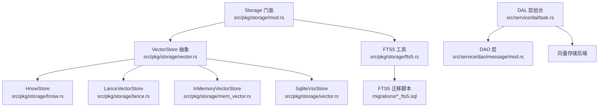
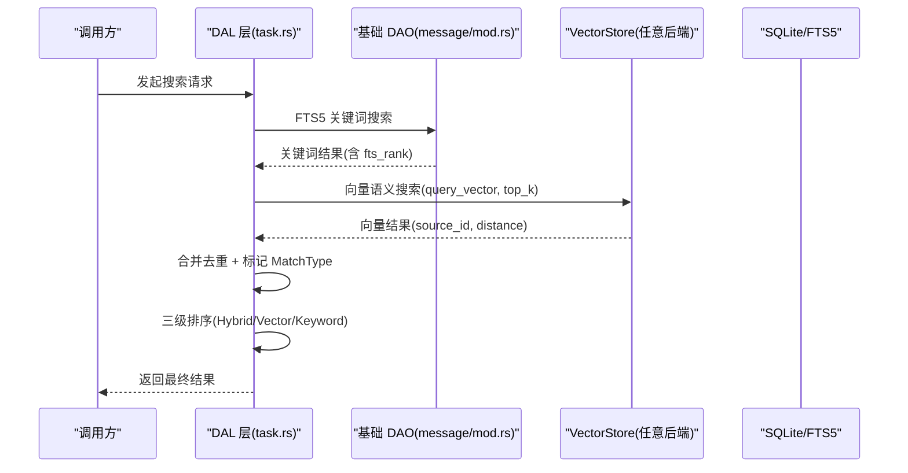
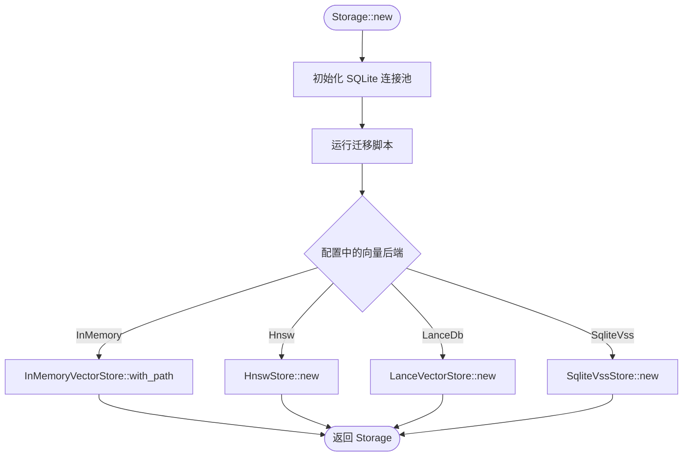
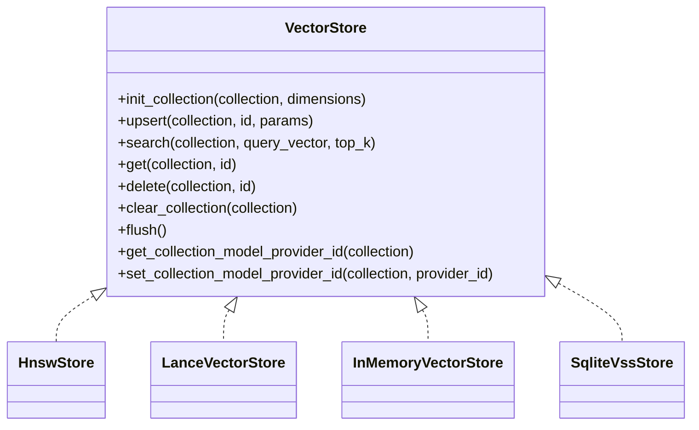
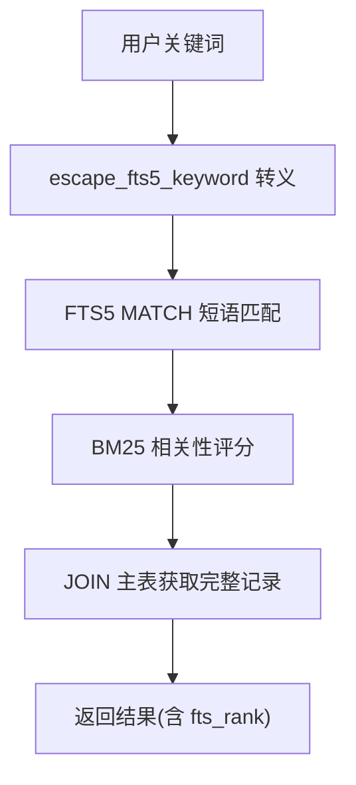
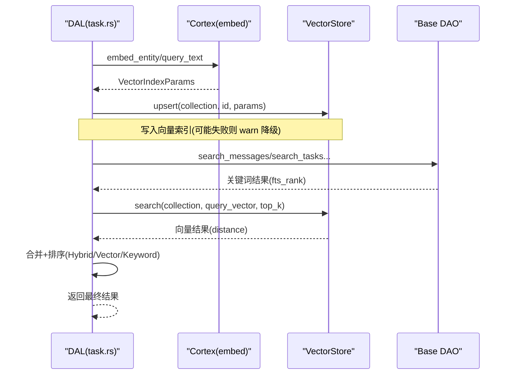
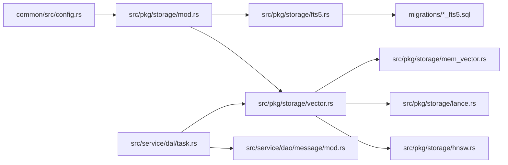

# 存储系统

<cite>
**本文引用的文件**
- [src/pkg/storage/mod.rs](file://src/pkg/storage/mod.rs)
- [src/pkg/storage/vector.rs](file://src/pkg/storage/vector.rs)
- [src/pkg/storage/hnsw.rs](file://src/pkg/storage/hnsw.rs)
- [src/pkg/storage/lance.rs](file://src/pkg/storage/lance.rs)
- [src/pkg/storage/mem_vector.rs](file://src/pkg/storage/mem_vector.rs)
- [src/pkg/storage/fts5.rs](file://src/pkg/storage/fts5.rs)
- [migrations/20260712000000_memory_fts5.sql](file://migrations/20260712000000_memory_fts5.sql)
- [migrations/20260712000001_entity_fts5.sql](file://migrations/20260712000001_entity_fts5.sql)
- [migrations/20260505000000_vector_metadata.sql](file://migrations/20260505000000_vector_metadata.sql)
- [common/src/config.rs](file://common/src/config.rs)
- [docs/vector_search_architecture.md](file://docs/vector_search_architecture.md)
- [src/service/dal/task.rs](file://src/service/dal/task.rs)
- [src/service/dao/message/mod.rs](file://src/service/dao/message/mod.rs)
</cite>

## 目录
1. [简介](#简介)
2. [项目结构](#项目结构)
3. [核心组件](#核心组件)
4. [架构总览](#架构总览)
5. [详细组件分析](#详细组件分析)
6. [依赖关系分析](#依赖关系分析)
7. [性能考量](#性能考量)
8. [故障排查指南](#故障排查指南)
9. [结论](#结论)
10. [附录](#附录)

## 简介
本文件为 AI Orz 存储系统的权威技术文档，聚焦向量存储、全文搜索（FTS5）、文件与元数据持久化、以及多后端可插拔的向量索引实现。内容涵盖：
- 向量索引构建、相似度计算与检索优化
- FTS5 全文搜索引擎配置与使用
- HNSW 算法在向量搜索中的应用与调优
- 存储抽象接口设计、数据迁移策略与备份恢复机制
- 存储选型指南、性能基准测试建议与容量规划

## 项目结构
存储子系统位于 src/pkg/storage 下，提供统一的 Storage 门面与多种向量存储后端；FTS5 通过 SQL 迁移脚本在各业务表上建立虚拟表与触发器；DAL 层组合基础 DAO 与向量 DAO 实现混合搜索。

图表来源
- [src/pkg/storage/mod.rs:36-153](file://src/pkg/storage/mod.rs#L36-L153)
- [src/pkg/storage/vector.rs:18-74](file://src/pkg/storage/vector.rs#L18-L74)
- [src/pkg/storage/hnsw.rs:149-166](file://src/pkg/storage/hnsw.rs#L149-L166)
- [src/pkg/storage/lance.rs:26-33](file://src/pkg/storage/lance.rs#L26-L33)
- [src/pkg/storage/mem_vector.rs:18-25](file://src/pkg/storage/mem_vector.rs#L18-L25)
- [src/pkg/storage/fts5.rs:1-18](file://src/pkg/storage/fts5.rs#L1-L18)
- [migrations/20260712000001_entity_fts5.sql:18-66](file://migrations/20260712000001_entity_fts5.sql#L18-L66)
- [src/service/dal/task.rs:405-437](file://src/service/dal/task.rs#L405-L437)
- [src/service/dao/message/mod.rs:46-57](file://src/service/dao/message/mod.rs#L46-L57)

章节来源
- [src/pkg/storage/mod.rs:36-153](file://src/pkg/storage/mod.rs#L36-L153)
- [docs/vector_search_architecture.md:46-55](file://docs/vector_search_architecture.md#L46-L55)

## 核心组件
- Storage 门面：统一初始化 SQLite 连接池、运行迁移、按配置选择向量后端、暴露 vector() 与 stats() 访问点。
- VectorStore 抽象：定义 init_collection/upsert/search/get/delete/clear_collection/flush 等通用方法，所有后端统一实现。
- 向量后端：
  - HnswStore：纯 Rust HNSW 索引，lazy rebuild + bincode 持久化，后台定时落盘，Drop 兜底。
  - LanceVectorStore：基于 LanceDB 的高性能嵌入式向量数据库，内置 HNSW，支持元数据过滤。
  - InMemoryVectorStore：纯内存余弦相似度线性扫描，bincode 持久化集合文件。
  - SqliteVssStore：基于 SQLite VSS 扩展，vss 虚拟表 + vector_metadata 元数据表。
- FTS5 工具：escape_fts5_keyword 将用户关键词转义并短语匹配，避免特殊字符与空格误解析。
- 迁移脚本：为记忆、技能、工具、消息、任务、项目、Agent 等实体创建 FTS5 虚拟表与触发器，并回填存量数据。

章节来源
- [src/pkg/storage/mod.rs:56-122](file://src/pkg/storage/mod.rs#L56-L122)
- [src/pkg/storage/vector.rs:18-74](file://src/pkg/storage/vector.rs#L18-L74)
- [src/pkg/storage/hnsw.rs:432-616](file://src/pkg/storage/hnsw.rs#L432-L616)
- [src/pkg/storage/lance.rs:126-364](file://src/pkg/storage/lance.rs#L126-L364)
- [src/pkg/storage/mem_vector.rs:119-275](file://src/pkg/storage/mem_vector.rs#L119-L275)
- [src/pkg/storage/fts5.rs:6-18](file://src/pkg/storage/fts5.rs#L6-L18)
- [migrations/20260712000000_memory_fts5.sql:16-29](file://migrations/20260712000000_memory_fts5.sql#L16-L29)
- [migrations/20260712000001_entity_fts5.sql:18-66](file://migrations/20260712000001_entity_fts5.sql#L18-L66)

## 架构总览
存储系统遵循“索引与数据完全分离”的原则：关系型主表承载业务数据，FTS5 虚拟表负责关键词索引，向量存储作为语义索引附加层，仅通过 source_id 关联。DAL 层组合基础 DAO 与向量 DAO，实现混合搜索与三态匹配排序（Hybrid > Vector > Keyword）。

图表来源
- [src/service/dal/task.rs:405-437](file://src/service/dal/task.rs#L405-L437)
- [src/service/dao/message/mod.rs:46-57](file://src/service/dao/message/mod.rs#L46-L57)
- [docs/vector_search_architecture.md:72-118](file://docs/vector_search_architecture.md#L72-L118)

章节来源
- [docs/vector_search_architecture.md:11-43](file://docs/vector_search_architecture.md#L11-L43)
- [docs/vector_search_architecture.md:72-130](file://docs/vector_search_architecture.md#L72-L130)

## 详细组件分析

### 存储门面与后端选择
- Storage::new 根据配置自动选择向量后端：InMemory/Hnsw/LanceDb/SqliteVss。
- 启动时运行 migrations，确保 FTS5 与 vector_metadata 表存在。
- 暴露 sqlite()/vector()/stats() 供上层使用。

图表来源
- [src/pkg/storage/mod.rs:56-122](file://src/pkg/storage/mod.rs#L56-L122)

章节来源
- [src/pkg/storage/mod.rs:56-122](file://src/pkg/storage/mod.rs#L56-L122)

### 向量存储抽象与实现
- VectorStore trait 统一接口：init_collection/upsert/search/get/delete/clear_collection/flush。
- HnswStore：
  - lazy rebuild：upsert/delete 标记 dirty，search 时按需重建 HNSW 索引。
  - 持久化：每个 collection 一个 .bincode 文件，后台 60s 定时落盘，Drop 兜底。
  - 距离度量：余弦距离 1 - cos(θ)。
- LanceVectorStore：
  - 基于 LanceDB，固定维度列式存储，vector_search 流式返回结果。
  - 元数据字段：content_hash/embedding_model/indexed_at/expire_at。
- InMemoryVectorStore：
  - 线性扫描余弦相似度，适合小数据集与测试。
  - 异步持久化集合到 bincode 文件。
- SqliteVssStore：
  - vss 虚拟表 + vector_metadata 元数据表，search 时 JOIN 获取距离与元信息。

图表来源
- [src/pkg/storage/vector.rs:18-74](file://src/pkg/storage/vector.rs#L18-L74)
- [src/pkg/storage/hnsw.rs:432-616](file://src/pkg/storage/hnsw.rs#L432-L616)
- [src/pkg/storage/lance.rs:126-364](file://src/pkg/storage/lance.rs#L126-L364)
- [src/pkg/storage/mem_vector.rs:119-275](file://src/pkg/storage/mem_vector.rs#L119-L275)
- [src/pkg/storage/vector.rs:76-291](file://src/pkg/storage/vector.rs#L76-L291)

章节来源
- [src/pkg/storage/vector.rs:18-74](file://src/pkg/storage/vector.rs#L18-L74)
- [src/pkg/storage/hnsw.rs:432-616](file://src/pkg/storage/hnsw.rs#L432-L616)
- [src/pkg/storage/lance.rs:126-364](file://src/pkg/storage/lance.rs#L126-L364)
- [src/pkg/storage/mem_vector.rs:119-275](file://src/pkg/storage/mem_vector.rs#L119-L275)
- [src/pkg/storage/vector.rs:76-291](file://src/pkg/storage/vector.rs#L76-L291)

### FTS5 全文搜索配置与使用
- 迁移脚本为各实体创建 FTS5 虚拟表，使用 trigram 分词器，支持中文/英文混合搜索。
- 触发器保证 INSERT/UPDATE/DELETE 时自动同步 FTS 索引。
- escape_fts5_keyword 将用户输入转义并短语匹配，避免特殊字符与空格误解析。

图表来源
- [src/pkg/storage/fts5.rs:6-18](file://src/pkg/storage/fts5.rs#L6-L18)
- [migrations/20260712000001_entity_fts5.sql:18-66](file://migrations/20260712000001_entity_fts5.sql#L18-L66)
- [migrations/20260712000000_memory_fts5.sql:16-29](file://migrations/20260712000000_memory_fts5.sql#L16-L29)

章节来源
- [src/pkg/storage/fts5.rs:6-18](file://src/pkg/storage/fts5.rs#L6-L18)
- [migrations/20260712000001_entity_fts5.sql:18-66](file://migrations/20260712000001_entity_fts5.sql#L18-L66)
- [migrations/20260712000000_memory_fts5.sql:16-29](file://migrations/20260712000000_memory_fts5.sql#L16-L29)

### 向量索引构建与检索流程
- 构建：DAL 层决定何时索引、索引哪些字段、使用哪个 Embedding Provider，生成 VectorIndexParams 后调用 VectorStore::upsert。
- 检索：DAL 层执行 FTS5 关键词搜索与向量语义搜索，合并结果并标记 MatchType，按 Hybrid > Vector > Keyword 排序。
- 降级：向量化失败或向量搜索不可用时，降级到纯 FTS5 路径，不影响主流程。

图表来源
- [src/service/dal/task.rs:805-858](file://src/service/dal/task.rs#L805-L858)
- [src/service/dal/task.rs:405-437](file://src/service/dal/task.rs#L405-L437)
- [docs/vector_search_architecture.md:97-130](file://docs/vector_search_architecture.md#L97-L130)

章节来源
- [src/service/dal/task.rs:805-858](file://src/service/dal/task.rs#L805-L858)
- [src/service/dal/task.rs:405-437](file://src/service/dal/task.rs#L405-L437)
- [docs/vector_search_architecture.md:97-130](file://docs/vector_search_architecture.md#L97-L130)

### HNSW 算法应用与性能调优
- 算法：余弦距离 1 - cos(θ)，lazy rebuild 策略避免频繁重建索引。
- 持久化：bincode 序列化每个 collection，后台 60s 落盘，Drop 兜底。
- 调优建议：
  - 控制 top_k 与查询频率，减少重建开销。
  - 合理设置集合维度（由 Embedding 模型决定），避免动态扩容。
  - 监控 dirty flag 与落盘延迟，必要时调整后台任务间隔。

章节来源
- [src/pkg/storage/hnsw.rs:20-34](file://src/pkg/storage/hnsw.rs#L20-L34)
- [src/pkg/storage/hnsw.rs:377-388](file://src/pkg/storage/hnsw.rs#L377-L388)
- [src/pkg/storage/hnsw.rs:403-429](file://src/pkg/storage/hnsw.rs#L403-L429)

### 数据迁移策略
- 向量元数据：vector_metadata 表记录 collection/source_id/content_hash/model/dimensions/indexed_at/expire_at，支持过期清理与重建判断。
- FTS5 迁移：为各实体创建 FTS5 虚拟表与触发器，并回填存量数据。
- 切换 Embedding Provider：通过 set_collection_model_provider_id 记录当前 Provider，重建时清空集合并重新索引。

章节来源
- [migrations/20260505000000_vector_metadata.sql:1-16](file://migrations/20260505000000_vector_metadata.sql#L1-L16)
- [migrations/20260712000001_entity_fts5.sql:220-246](file://migrations/20260712000001_entity_fts5.sql#L220-L246)
- [src/pkg/storage/hnsw.rs:578-616](file://src/pkg/storage/hnsw.rs#L578-L616)

### 备份恢复机制
- HNSW 索引：bincode 文件位于 hnsw_index_dir，进程重启后冷启动加载已有索引，避免重建。
- 内存向量：集合文件 vectors/*.bin，异步持久化，崩溃后可恢复。
- LanceDB：单文件存储，跨平台持久化，支持元数据过滤。
- SQLite 主库：通过 sqlx migrate 管理版本，配合外部备份工具（如文件系统快照）进行全量备份。

章节来源
- [src/pkg/storage/hnsw.rs:190-218](file://src/pkg/storage/hnsw.rs#L190-L218)
- [src/pkg/storage/mem_vector.rs:51-80](file://src/pkg/storage/mem_vector.rs#L51-L80)
- [src/pkg/storage/lance.rs:43-62](file://src/pkg/storage/lance.rs#L43-L62)
- [src/pkg/storage/mod.rs:72-76](file://src/pkg/storage/mod.rs#L72-L76)

### 存储选型指南
- InMemoryVectorStore：零依赖、开发测试首选，小数据集友好。
- HnswStore：纯 Rust HNSW，生产环境高性能，支持持久化与懒重建。
- LanceVectorStore：内置 HNSW，百万级向量快速检索，适合大数据集。
- SqliteVssStore：依赖系统扩展，适合已有 SQLite 生态场景。

章节来源
- [docs/vector_search_architecture.md:178-184](file://docs/vector_search_architecture.md#L178-L184)
- [src/pkg/storage/mod.rs:78-93](file://src/pkg/storage/mod.rs#L78-L93)

### 性能基准测试建议
- 指标：QPS、P99 延迟、内存占用、重建耗时、落盘 IO。
- 场景：不同 top_k、不同向量维度、不同数据规模（万/十万/百万级）。
- 对比：HNSW vs LanceDB vs InMemory vs SqliteVss。
- 工具：tokio-console、criterion、自定义压测脚本。

[本节为通用指导，不直接分析具体文件]

### 容量规划建议
- 向量维度：由 Embedding 模型决定（如 384/768/1536），需预留磁盘空间。
- 集合数量：每类实体一个集合，预估增长曲线。
- 过期策略：expire_at 控制向量生命周期，定期清理过期条目。
- 存储路径：base_data_path/vectors、hnsw_index、vectors_lance 分区管理。

章节来源
- [common/src/config.rs:91-109](file://common/src/config.rs#L91-L109)
- [common/src/config.rs:275-277](file://common/src/config.rs#L275-L277)

## 依赖关系分析
- Storage 门面依赖配置模块选择后端，依赖 sqlx 运行迁移。
- VectorStore 抽象被 DAL 层调用，DAO 层封装业务语义。
- FTS5 工具被各 DAO 复用，避免 DAO 间耦合。
- 迁移脚本与业务表解耦，通过 rowid 关联 FTS5 虚拟表。

图表来源
- [common/src/config.rs:91-109](file://common/src/config.rs#L91-L109)
- [src/pkg/storage/mod.rs:56-122](file://src/pkg/storage/mod.rs#L56-L122)
- [src/pkg/storage/vector.rs:18-74](file://src/pkg/storage/vector.rs#L18-L74)
- [src/pkg/storage/hnsw.rs:149-166](file://src/pkg/storage/hnsw.rs#L149-L166)
- [src/pkg/storage/lance.rs:26-33](file://src/pkg/storage/lance.rs#L26-L33)
- [src/pkg/storage/mem_vector.rs:18-25](file://src/pkg/storage/mem_vector.rs#L18-L25)
- [src/pkg/storage/fts5.rs:1-18](file://src/pkg/storage/fts5.rs#L1-L18)
- [migrations/20260712000001_entity_fts5.sql:18-66](file://migrations/20260712000001_entity_fts5.sql#L18-L66)
- [src/service/dal/task.rs:405-437](file://src/service/dal/task.rs#L405-L437)
- [src/service/dao/message/mod.rs:46-57](file://src/service/dao/message/mod.rs#L46-L57)

章节来源
- [src/pkg/storage/mod.rs:56-122](file://src/pkg/storage/mod.rs#L56-L122)
- [src/pkg/storage/vector.rs:18-74](file://src/pkg/storage/vector.rs#L18-L74)
- [src/pkg/storage/hnsw.rs:149-166](file://src/pkg/storage/hnsw.rs#L149-L166)
- [src/pkg/storage/lance.rs:26-33](file://src/pkg/storage/lance.rs#L26-L33)
- [src/pkg/storage/mem_vector.rs:18-25](file://src/pkg/storage/mem_vector.rs#L18-L25)
- [src/pkg/storage/fts5.rs:1-18](file://src/pkg/storage/fts5.rs#L1-L18)
- [migrations/20260712000001_entity_fts5.sql:18-66](file://migrations/20260712000001_entity_fts5.sql#L18-L66)
- [src/service/dal/task.rs:405-437](file://src/service/dal/task.rs#L405-L437)
- [src/service/dao/message/mod.rs:46-57](file://src/service/dao/message/mod.rs#L46-L57)

## 性能考量
- 向量搜索：HNSW 与 LanceDB 适合大规模数据，InMemory 适合小规模与测试。
- FTS5：trigram 分词器对中英文混合友好，BM25 相关性评分提升召回质量。
- 降级策略：向量化失败不影响主流程，FTS5 仍可用。
- 持久化：HNSW 后台落盘与 Drop 兜底保障数据一致性。

[本节为通用指导，不直接分析具体文件]

## 故障排查指南
- 向量搜索失败：检查 Embedding Provider 是否启用，确认向量集合是否存在，查看降级日志。
- FTS5 查询异常：使用 escape_fts5_keyword 转义关键词，检查触发器是否生效。
- 索引重建问题：确认 clear_collection 与 upsert 顺序，检查 model_provider_id 更新。
- 持久化失败：检查 hnsw_index_dir 权限与磁盘空间，查看后台落盘任务状态。

章节来源
- [src/service/dal/task.rs:405-437](file://src/service/dal/task.rs#L405-L437)
- [src/pkg/storage/fts5.rs:6-18](file://src/pkg/storage/fts5.rs#L6-L18)
- [src/pkg/storage/hnsw.rs:377-388](file://src/pkg/storage/hnsw.rs#L377-L388)
- [src/pkg/storage/hnsw.rs:403-429](file://src/pkg/storage/hnsw.rs#L403-L429)

## 结论
AI Orz 存储系统通过统一的 VectorStore 抽象与多后端实现，结合 FTS5 全文搜索，提供了高可扩展、高性能、可降级的混合检索能力。HNSW 与 LanceDB 满足生产级向量搜索需求，FTS5 保障关键词检索准确性。迁移脚本与持久化策略确保数据一致性与可恢复性。建议根据数据规模与性能要求选择合适的向量后端，并结合降级策略与监控指标持续优化。

[本节为总结，不直接分析具体文件]

## 附录
- 配置项：vector_store_type、hnsw_index_dir、base_data_path。
- 实体覆盖：Memory/Skill/Tool/Message/Task/Project/Agent 均支持 FTS5 与向量搜索。
- 集成测试：默认测试走 FTS5 路径，ignored 测试验证端到端向量搜索。

章节来源
- [common/src/config.rs:91-109](file://common/src/config.rs#L91-L109)
- [docs/vector_search_architecture.md:132-156](file://docs/vector_search_architecture.md#L132-L156)