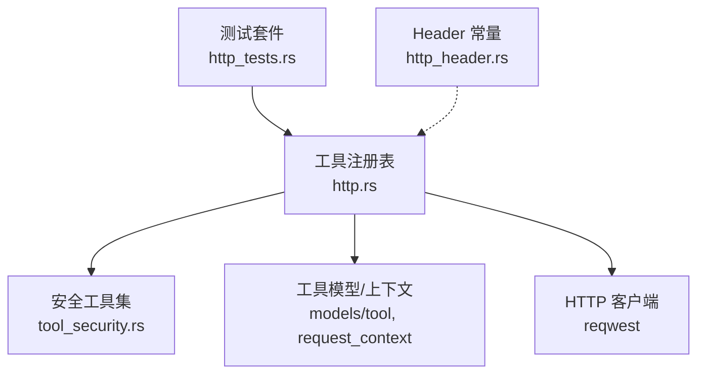
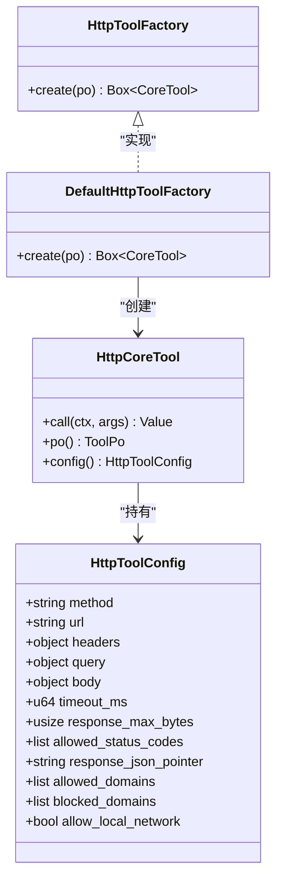
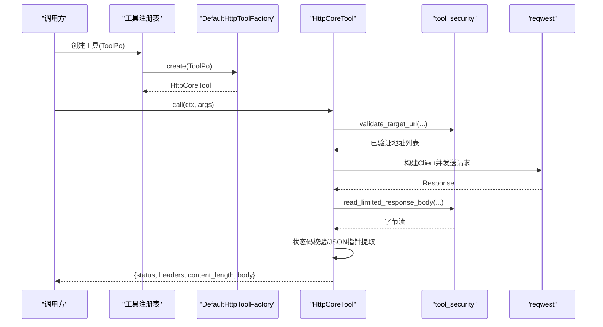
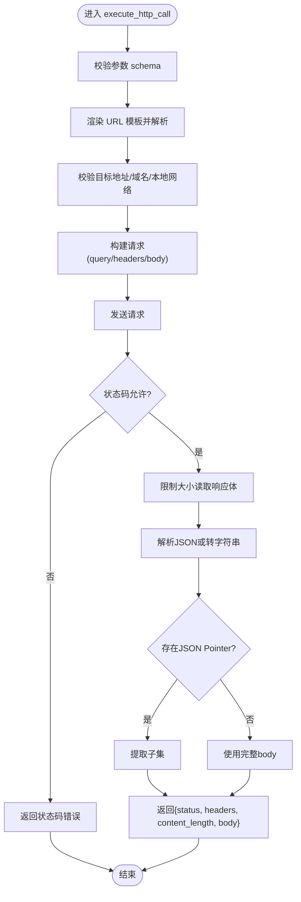
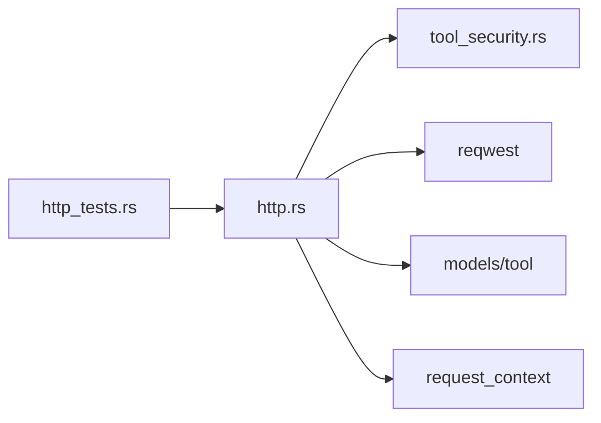

# HTTP 工具

<cite>
**本文引用的文件**
- [src/pkg/tool_registry/http.rs](file://src/pkg/tool_registry/http.rs)
- [src/pkg/tool_registry/tool_security.rs](file://src/pkg/tool_registry/tool_security.rs)
- [src/pkg/tool_registry/http_tests.rs](file://src/pkg/tool_registry/http_tests.rs)
- [common/src/constants/http_header.rs](file://common/src/constants/http_header.rs)
- [docs/generic_builtin_tools_design.md](file://docs/generic_builtin_tools_design.md)
</cite>

## 目录
1. [简介](#简介)
2. [项目结构](#项目结构)
3. [核心组件](#核心组件)
4. [架构总览](#架构总览)
5. [详细组件分析](#详细组件分析)
6. [依赖关系分析](#依赖关系分析)
7. [性能与安全特性](#性能与安全特性)
8. [测试与调试](#测试与调试)
9. [使用示例](#使用示例)
10. [故障排查](#故障排查)
11. [结论](#结论)

## 简介
本文件面向“HTTP 工具系统”，围绕 HttpToolFactory 接口设计与默认实现 DefaultHttpToolFactory，系统化说明 HTTP 请求工具的能力边界、方法支持、参数配置、安全机制、超时控制、错误处理、认证与头部设置、响应解析、测试方法与调优建议。该子系统位于 pkg 层（通用基础设施工具），无业务感知，通过 ToolPo + HttpToolConfig 将数据库注册的工具元数据转换为可执行的 HTTP 调用。

## 项目结构
HTTP 工具的核心代码集中在工具注册表模块中：
- 协议级工厂与执行体：src/pkg/tool_registry/http.rs
- 共享安全能力（SSRF、大小限制、脱敏等）：src/pkg/tool_registry/tool_security.rs
- 单元测试与集成用例：src/pkg/tool_registry/http_tests.rs
- 通用 Header Key 常量：common/src/constants/http_header.rs
- 通用 Builtin 工具设计文档（含安全策略复用说明）：docs/generic_builtin_tools_design.md

图表来源
- [src/pkg/tool_registry/http.rs:1-120](file://src/pkg/tool_registry/http.rs#L1-L120)
- [src/pkg/tool_registry/tool_security.rs:1-170](file://src/pkg/tool_registry/tool_security.rs#L1-L170)
- [src/pkg/tool_registry/http_tests.rs:1-120](file://src/pkg/tool_registry/http_tests.rs#L1-L120)
- [common/src/constants/http_header.rs:1-20](file://common/src/constants/http_header.rs#L1-L20)

章节来源
- [src/pkg/tool_registry/http.rs:1-120](file://src/pkg/tool_registry/http.rs#L1-L120)
- [src/pkg/tool_registry/tool_security.rs:1-170](file://src/pkg/tool_registry/tool_security.rs#L1-L170)
- [src/pkg/tool_registry/http_tests.rs:1-120](file://src/pkg/tool_registry/http_tests.rs#L1-L120)
- [common/src/constants/http_header.rs:1-20](file://common/src/constants/http_header.rs#L1-L20)

## 核心组件
- HttpToolFactory：协议级工厂接口，用于根据 ToolPo 创建可执行的 CoreTool。
- DefaultHttpToolFactory：默认实现，委托 create_tool 构造 HttpCoreTool。
- HttpToolConfig：持久化在 ToolPo.config 中的 JSON 配置，描述目标 URL、方法、模板、超时、响应限制、域名白/黑名单、本地网络访问开关等。
- HttpCoreTool：基于 ToolPo + HttpToolConfig 构建的可执行 HTTP 工具，实现 CoreTool::call 以发起请求并返回统一结果。

图表来源
- [src/pkg/tool_registry/http.rs:23-114](file://src/pkg/tool_registry/http.rs#L23-L114)

章节来源
- [src/pkg/tool_registry/http.rs:23-114](file://src/pkg/tool_registry/http.rs#L23-L114)

## 架构总览
HTTP 工具的执行流程从 ToolRegistry 创建 HttpCoreTool 开始，随后在 call 中完成参数校验、URL 渲染、目标地址校验、构建 reqwest Client、组装请求、发送、读取响应、状态码校验、响应体大小限制、JSON Pointer 提取、最终返回统一结构。

图表来源
- [src/pkg/tool_registry/http.rs:126-220](file://src/pkg/tool_registry/http.rs#L126-L220)
- [src/pkg/tool_registry/tool_security.rs:92-170](file://src/pkg/tool_registry/tool_security.rs#L92-L170)
- [src/pkg/tool_registry/tool_security.rs:200-231](file://src/pkg/tool_registry/tool_security.rs#L200-L231)

## 详细组件分析

### HttpToolFactory 与 DefaultHttpToolFactory
- 职责：将数据库注册的 ToolPo 转换为可执行的 CoreTool；默认实现直接委托给 create_tool。
- 扩展点：可通过注入自定义 HttpToolFactory 替换默认行为（测试中演示了记录式工厂）。

章节来源
- [src/pkg/tool_registry/http.rs:23-39](file://src/pkg/tool_registry/http.rs#L23-L39)
- [src/pkg/tool_registry/http_tests.rs:121-174](file://src/pkg/tool_registry/http_tests.rs#L121-L174)

### HttpToolConfig 配置项
- method：当前仅支持 GET 与 POST（PUT/DELETE 等未开放）。
- url：固定 URL 模板，禁止动态 scheme/host/userinfo，必须包含 http/https。
- headers/query/body：对象模板，键不可包含占位符，值可为字符串/数字/布尔/空；body 仅在 POST 时作为 JSON 发送。
- timeout_ms：单工具超时覆盖，范围受硬上限约束。
- response_max_bytes：响应体最大字节数，受硬上限约束。
- allowed_status_codes：允许的状态码集合，为空或非法将被拒绝。
- response_json_pointer：可选 JSON Pointer，用于从响应中提取子集。
- allowed_domains/blocked_domains：域名白/黑名单，配合 SSRF 防护。
- allow_local_network：是否允许本地/私网目标，默认关闭。

章节来源
- [src/pkg/tool_registry/http.rs:41-73](file://src/pkg/tool_registry/http.rs#L41-L73)
- [src/pkg/tool_registry/http.rs:369-443](file://src/pkg/tool_registry/http.rs#L369-L443)
- [src/pkg/tool_registry/tool_security.rs:233-270](file://src/pkg/tool_registry/tool_security.rs#L233-L270)

### 执行流程与数据处理
- 参数校验：依据 ToolPo.parameters_schema 校验 args 类型、必填字段、枚举值与额外属性限制。
- URL 渲染与解析：仅支持 {{args.key}} 形式的占位符，scheme/host 必须固定且不含 userinfo。
- 目标校验：校验 scheme、host、端口、域名白/黑名单、本地网络访问开关，并进行 DNS 解析与 pinning。
- 请求构建：按 method 添加 query/headers/body（POST 时以 JSON 发送）。
- 响应处理：校验状态码、限制响应体大小、解析 JSON 或回退为字符串、可选 JSON Pointer 提取。
- 返回结构：统一返回 status、headers（敏感头脱敏）、content_length、body。

图表来源
- [src/pkg/tool_registry/http.rs:126-220](file://src/pkg/tool_registry/http.rs#L126-L220)
- [src/pkg/tool_registry/tool_security.rs:200-231](file://src/pkg/tool_registry/tool_security.rs#L200-L231)

章节来源
- [src/pkg/tool_registry/http.rs:126-220](file://src/pkg/tool_registry/http.rs#L126-L220)

### 安全机制
- SSRF 防护：
  - 仅允许 http/https 方案，禁止 userinfo。
  - 支持域名白/黑名单匹配。
  - 默认拒绝本地/私网地址，需显式开启 allow_local_network。
  - DNS 解析后 pin 到具体地址，禁用代理，防止重定向与 DNS Rebinding。
- 大小限制：
  - 默认响应体上限 1MB，硬上限 10MB。
  - 超限时立即报错，避免 OOM。
- 超时控制：
  - 默认 30s，硬上限 10 分钟。
  - 单工具可覆盖，但必须在合法范围内。
- 脱敏：
  - 响应头中敏感字段（如 Authorization、Cookie、Set-Cookie、含 token/api-key/secret/password 的键）会被替换为 [REDACTED]。
  - 错误信息不暴露目标 URL、敏感参数与内部 IP。
- 模板安全：
  - 仅支持 {{args.key}} 形式，禁止空白与不支持的占位符。
  - headers/query 的键不允许包含占位符，headers 值需为标量。

章节来源
- [src/pkg/tool_registry/tool_security.rs:17-170](file://src/pkg/tool_registry/tool_security.rs#L17-L170)
- [src/pkg/tool_registry/tool_security.rs:172-231](file://src/pkg/tool_registry/tool_security.rs#L172-L231)
- [src/pkg/tool_registry/http.rs:369-559](file://src/pkg/tool_registry/http.rs#L369-L559)
- [docs/generic_builtin_tools_design.md:281-310](file://docs/generic_builtin_tools_design.md#L281-L310)

### 认证方式与头部设置
- 认证方式：通过 headers 模板注入，例如 Authorization、X-Api-Key 等；敏感头在响应中被脱敏。
- 头部设置：headers 为对象模板，键为合法 HTTP 头名，值为标量模板；运行时渲染后附加到请求。
- 追踪与上下文：可使用 common 提供的 Header Key 常量（如 X-Log-Id、X-User-Id 等）在 headers 中传递上下文。

章节来源
- [src/pkg/tool_registry/http.rs:165-172](file://src/pkg/tool_registry/http.rs#L165-L172)
- [common/src/constants/http_header.rs:1-20](file://common/src/constants/http_header.rs#L1-L20)

### 响应解析
- 自动解析：优先尝试 JSON 反序列化，失败则回退为 UTF-8 字符串。
- 子集提取：可选 response_json_pointer（JSON Pointer）从响应体中提取指定路径。
- 统一返回：包含 status、headers（已脱敏）、content_length、body。

章节来源
- [src/pkg/tool_registry/http.rs:194-219](file://src/pkg/tool_registry/http.rs#L194-L219)

### 方法支持与限制
- 当前仅支持 GET 与 POST。
- PUT、DELETE 等方法在当前实现中不被支持（测试断言会拒绝）。

章节来源
- [src/pkg/tool_registry/http.rs:222-228](file://src/pkg/tool_registry/http.rs#L222-L228)
- [src/pkg/tool_registry/http_tests.rs:189-202](file://src/pkg/tool_registry/http_tests.rs#L189-L202)

## 依赖关系分析
- http.rs 依赖 tool_security.rs 提供的安全能力（SSRF、大小限制、脱敏、模板校验）。
- http.rs 依赖 reqwest 进行网络请求，禁用重定向与代理，并通过 resolve_to_addrs 做 DNS pinning。
- http.rs 依赖 models/tool 与 request_context 完成工具元数据与上下文传递。
- 测试套件覆盖配置校验、方法限制、URL 合法性、状态码校验、响应大小限制、错误脱敏等场景。

图表来源
- [src/pkg/tool_registry/http.rs:1-22](file://src/pkg/tool_registry/http.rs#L1-L22)
- [src/pkg/tool_registry/tool_security.rs:1-170](file://src/pkg/tool_registry/tool_security.rs#L1-L170)
- [src/pkg/tool_registry/http_tests.rs:1-120](file://src/pkg/tool_registry/http_tests.rs#L1-L120)

章节来源
- [src/pkg/tool_registry/http.rs:1-22](file://src/pkg/tool_registry/http.rs#L1-L22)
- [src/pkg/tool_registry/tool_security.rs:1-170](file://src/pkg/tool_registry/tool_security.rs#L1-L170)
- [src/pkg/tool_registry/http_tests.rs:1-120](file://src/pkg/tool_registry/http_tests.rs#L1-L120)

## 性能与安全特性
- 性能
  - 连接池：由 reqwest::Client 管理，建议在应用层复用 Client 实例以减少握手开销。
  - 超时：默认 30s，可按工具粒度调整；过大可能阻塞资源，过小可能导致误超时。
  - 响应体限制：默认 1MB，硬上限 10MB，避免大响应导致内存压力。
  - 重定向：默认关闭，减少不可控跳转带来的性能与安全风险。
- 安全
  - SSRF 防护：严格校验 scheme/host/port，支持域名白/黑名单，默认拒绝本地/私网。
  - 脱敏：响应头敏感字段被替换；错误信息不泄露目标地址与敏感参数。
  - 模板安全：仅支持 {{args.key}}，禁止任意表达式与空白占位符。
  - 固定目标：URL 的 scheme 与 authority 必须固定，禁止 userinfo。

章节来源
- [src/pkg/tool_registry/tool_security.rs:8-16](file://src/pkg/tool_registry/tool_security.rs#L8-L16)
- [src/pkg/tool_registry/tool_security.rs:92-170](file://src/pkg/tool_registry/tool_security.rs#L92-L170)
- [src/pkg/tool_registry/http.rs:149-157](file://src/pkg/tool_registry/http.rs#L149-L157)
- [src/pkg/tool_registry/http.rs:180-192](file://src/pkg/tool_registry/http.rs#L180-L192)
- [src/pkg/tool_registry/http.rs:369-559](file://src/pkg/tool_registry/http.rs#L369-L559)

## 测试与调试
- 测试要点
  - 配置校验：缺失 url、非法 scheme、userinfo、非法状态码、非法 JSON Pointer、非法模板形状等。
  - 方法限制：仅 GET/POST，其他方法应被拒绝。
  - 运行期行为：GET 请求成功、重定向不跟随、响应过大被拒绝、错误信息脱敏。
  - 工厂注入：可通过自定义 HttpToolFactory 替换默认实现。
- 调试技巧
  - 启用日志：结合系统日志查看请求/响应摘要（注意敏感信息已被脱敏）。
  - 缩小范围：先最小化配置（method/url/timeout/response_max_bytes），逐步增加 headers/query/body。
  - 模拟服务：使用内嵌 TCP 服务器或 Mock 服务验证不同状态码与响应体大小。
  - 关注错误：若出现“http request failed”或“http response too large”，检查网络连通性与响应大小限制。

章节来源
- [src/pkg/tool_registry/http_tests.rs:1-200](file://src/pkg/tool_registry/http_tests.rs#L1-L200)
- [src/pkg/tool_registry/http_tests.rs:732-985](file://src/pkg/tool_registry/http_tests.rs#L732-L985)

## 使用示例
以下为典型配置与调用思路（以 JSON 配置为例）：

- GET 查询示例
  - 配置要点：method=GET，url 固定，query 模板使用 {{args.q}} 与 {{args.limit}}，设置 timeout_ms 与 response_max_bytes，allowed_status_codes=[200]，allowed_domains=["api.example.com"]。
  - 调用：传入 args={q:"rust", limit:10}。
  - 参考：[http_tests.rs:759-776](file://src/pkg/tool_registry/http_tests.rs#L759-L776)

- POST 提交示例
  - 配置要点：method=POST，url 固定，body 模板为 JSON 对象，其中字段值可为字符串/数字/布尔/空；设置 timeout_ms 与 response_max_bytes。
  - 调用：传入 args 对应 body 模板所需的键。
  - 参考：[http.rs:174-178](file://src/pkg/tool_registry/http.rs#L174-L178)

- 头部与认证
  - 配置 headers 模板，注入 Authorization 或自定义 API Key；响应头中敏感字段会被脱敏。
  - 参考：[http.rs:165-172](file://src/pkg/tool_registry/http.rs#L165-L172)，[tool_security.rs:172-198](file://src/pkg/tool_registry/tool_security.rs#L172-L198)

- 响应子集提取
  - 配置 response_json_pointer="/items"，仅返回响应体中指定路径。
  - 参考：[http_tests.rs:54-98](file://src/pkg/tool_registry/http_tests.rs#L54-L98)

- 安全与限制
  - 设置 allowed_domains 与 blocked_domains，必要时开启 allow_local_network=true（谨慎）。
  - 设置 response_max_bytes 与 timeout_ms，避免资源耗尽。
  - 参考：[http.rs:41-73](file://src/pkg/tool_registry/http.rs#L41-L73)，[tool_security.rs:92-170](file://src/pkg/tool_registry/tool_security.rs#L92-L170)

章节来源
- [src/pkg/tool_registry/http_tests.rs:54-98](file://src/pkg/tool_registry/http_tests.rs#L54-L98)
- [src/pkg/tool_registry/http_tests.rs:759-776](file://src/pkg/tool_registry/http_tests.rs#L759-L776)
- [src/pkg/tool_registry/http.rs:165-178](file://src/pkg/tool_registry/http.rs#L165-L178)
- [src/pkg/tool_registry/tool_security.rs:92-170](file://src/pkg/tool_registry/tool_security.rs#L92-L170)

## 故障排查
- 常见错误
  - “unsupported http method”：当前仅支持 GET/POST。
  - “invalid rendered http url”：URL 模板解析失败或包含不支持的占位符。
  - “blocked http domain / http domain is not allowed”：域名不在白名单或被黑名单命中。
  - “local network http target requires allow_local_network=true”：目标为本地/私网但未显式允许。
  - “unexpected http status code”：响应状态码不在 allowed_status_codes 中。
  - “http response too large”：响应体超过 response_max_bytes。
  - “http request failed”：网络层错误（连接失败、DNS 解析失败等）。
- 定位步骤
  - 检查 ToolPo.config 的 method/url/headers/query/body 是否符合模板规则。
  - 确认 allowed_domains/blocked_domains/allow_local_network 配置正确。
  - 降低 response_max_bytes 或增大 timeout_ms 观察是否改善。
  - 查看响应头脱敏后的内容，确认非敏感头是否正确返回。
  - 使用最小配置复现问题，逐步增加参数定位。

章节来源
- [src/pkg/tool_registry/http.rs:222-228](file://src/pkg/tool_registry/http.rs#L222-L228)
- [src/pkg/tool_registry/http.rs:133-192](file://src/pkg/tool_registry/http.rs#L133-L192)
- [src/pkg/tool_registry/tool_security.rs:92-170](file://src/pkg/tool_registry/tool_security.rs#L92-L170)
- [src/pkg/tool_registry/http_tests.rs:732-985](file://src/pkg/tool_registry/http_tests.rs#L732-L985)

## 结论
HTTP 工具系统通过 HttpToolFactory 与 DefaultHttpToolFactory 提供了可插拔、可配置的 HTTP 调用能力。它以 ToolPo + HttpToolConfig 为核心，实现了严格的模板渲染、目标校验、SSRF 防护、大小限制与超时控制，并在响应侧提供统一的脱敏与解析。当前版本仅支持 GET/POST 方法，后续如需扩展 PUT/DELETE 等，应在保持安全边界的前提下逐步开放。测试覆盖充分，便于在生产环境中稳定使用与持续演进。