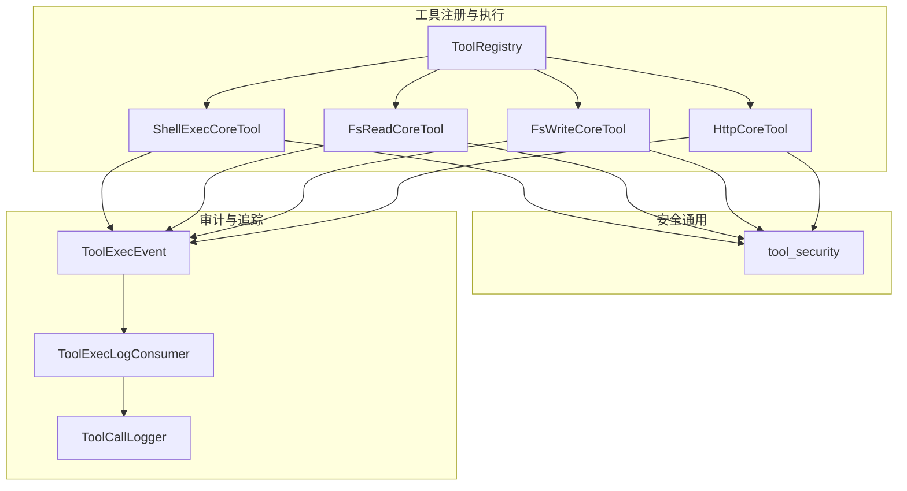
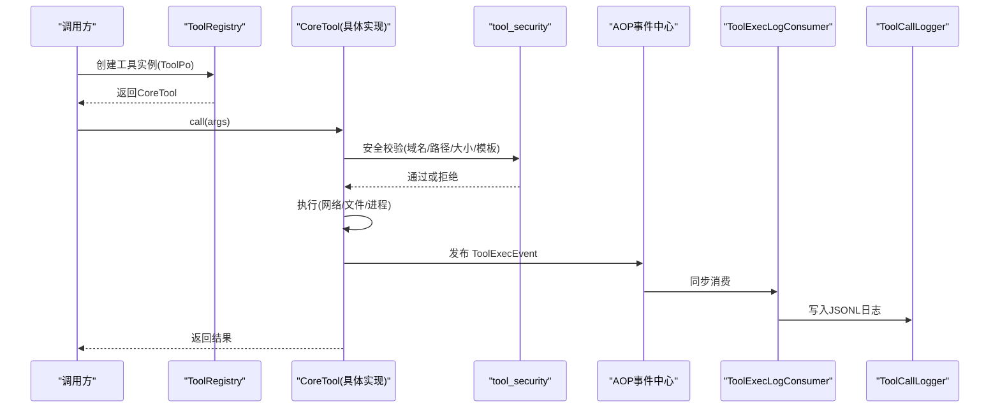
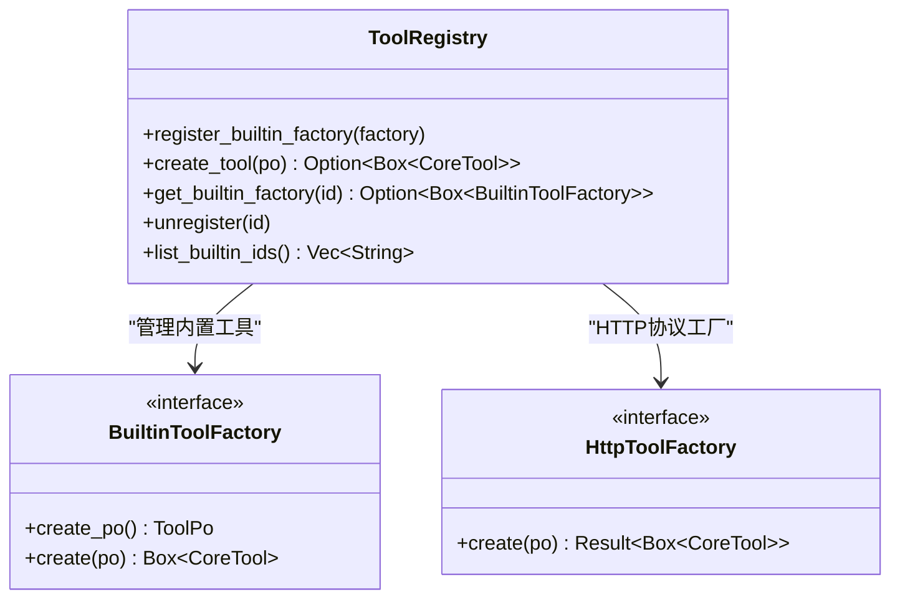
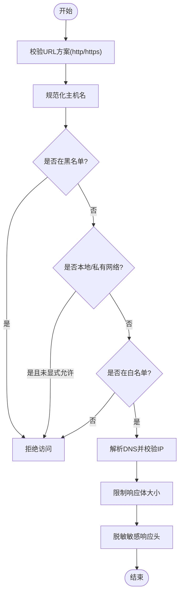
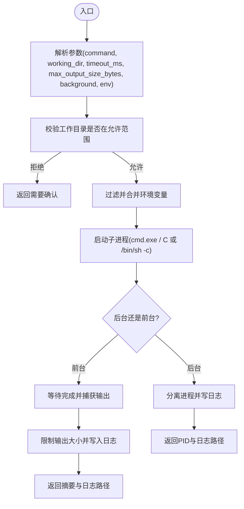
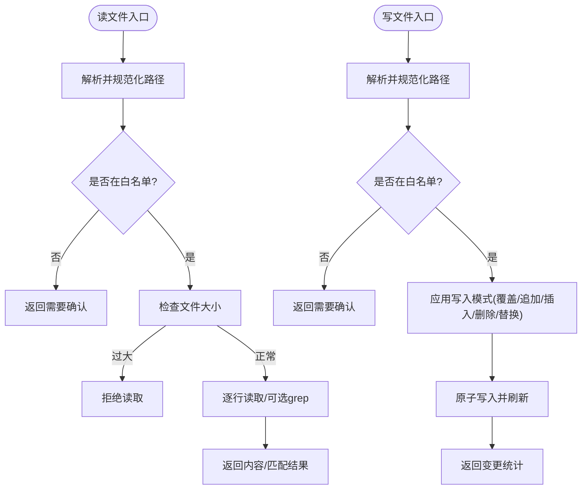
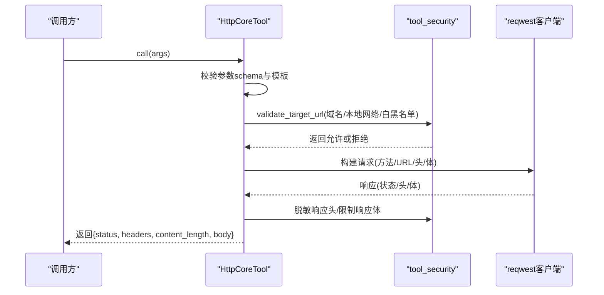
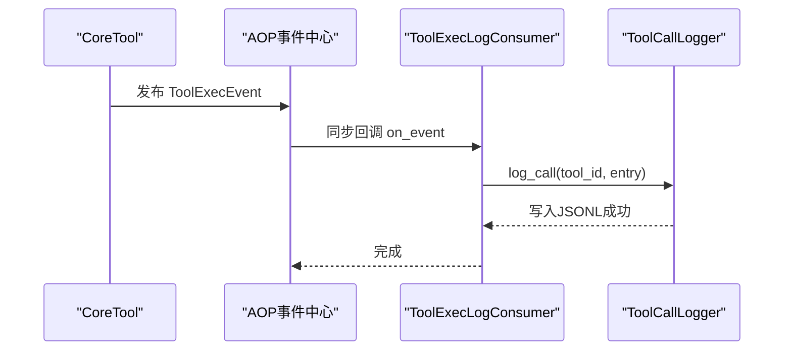
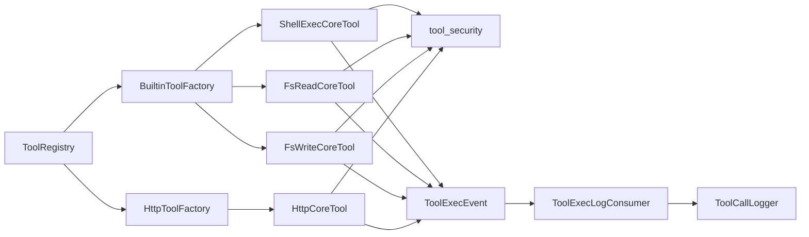

# 工具安全控制

<cite>
**本文引用的文件**
- [src/pkg/tool_registry/mod.rs](file://src/pkg/tool_registry/mod.rs)
- [src/pkg/tool_registry/tool_security.rs](file://src/pkg/tool_registry/tool_security.rs)
- [src/pkg/tool_registry/http.rs](file://src/pkg/tool_registry/http.rs)
- [src/pkg/tool_registry/shell_exec.rs](file://src/pkg/tool_registry/shell_exec.rs)
- [src/pkg/tool_registry/fs_read.rs](file://src/pkg/tool_registry/fs_read.rs)
- [src/pkg/tool_registry/fs_write.rs](file://src/pkg/tool_registry/fs_write.rs)
- [src/consumer/tool_exec_log_consumer.rs](file://src/consumer/tool_exec_log_consumer.rs)
- [src/models/events/tool_exec.rs](file://src/models/events/tool_exec.rs)
- [src/pkg/tool_tracing/entry.rs](file://src/pkg/tool_tracing/entry.rs)
- [src/pkg/tool_tracing/logger.rs](file://src/pkg/tool_tracing/logger.rs)
- [common/config/ai_orz.toml](file://common/config/ai_orz.toml)
</cite>

## 目录
1. [简介](#简介)
2. [项目结构](#项目结构)
3. [核心组件](#核心组件)
4. [架构总览](#架构总览)
5. [详细组件分析](#详细组件分析)
6. [依赖关系分析](#依赖关系分析)
7. [性能与安全考量](#性能与安全考量)
8. [故障排查指南](#故障排查指南)
9. [结论](#结论)
10. [附录：配置与最佳实践](#附录：配置与最佳实践)

## 简介
本文件面向“工具安全控制系统”，围绕工具执行的权限模型、访问控制与资源隔离机制，系统说明安全策略配置、命令白名单、文件访问限制、沙箱环境、环境变量过滤、网络访问控制、审计日志、违规检测与威胁防护，并给出配置最佳实践、风险评估方法与应急响应流程。内容基于仓库中工具注册表、内置工具实现、HTTP/MCP 外部协议工具的安全校验、文件系统安全以及工具调用追踪与审计日志等代码实现进行梳理与归纳。

## 项目结构
本项目采用四层单向调用（Adapter → Domain → DAL → DAO），工具执行相关能力集中在 pkg/tool_registry 与 pkg/tool_tracing 模块，并通过 AOP 事件驱动将工具执行结果持久化到 JSONL 日志。关键路径如下：
- 工具注册与分发：ToolRegistry 根据协议类型创建具体工具实例
- 内置工具：shell_exec、fs_read、fs_write
- 外部协议工具：http（MCP 预留）
- 安全通用能力：tool_security（SSRF、域名白黑名单、响应大小限制、敏感头脱敏、文件路径校验）
- 审计与追踪：ToolExecEvent + ToolExecLogConsumer + ToolCallLogger

**图表来源**
- [src/pkg/tool_registry/mod.rs:29-102](file://src/pkg/tool_registry/mod.rs#L29-L102)
- [src/pkg/tool_registry/shell_exec.rs:257-466](file://src/pkg/tool_registry/shell_exec.rs#L257-L466)
- [src/pkg/tool_registry/fs_read.rs:125-216](file://src/pkg/tool_registry/fs_read.rs#L125-L216)
- [src/pkg/tool_registry/fs_write.rs:121-275](file://src/pkg/tool_registry/fs_write.rs#L121-L275)
- [src/pkg/tool_registry/http.rs:98-220](file://src/pkg/tool_registry/http.rs#L98-L220)
- [src/pkg/tool_registry/tool_security.rs:92-170](file://src/pkg/tool_registry/tool_security.rs#L92-L170)
- [src/models/events/tool_exec.rs:1-65](file://src/models/events/tool_exec.rs#L1-L65)
- [src/consumer/tool_exec_log_consumer.rs:26-52](file://src/consumer/tool_exec_log_consumer.rs#L26-L52)
- [src/pkg/tool_tracing/logger.rs:64-140](file://src/pkg/tool_tracing/logger.rs#L64-L140)

**章节来源**
- [src/pkg/tool_registry/mod.rs:29-132](file://src/pkg/tool_registry/mod.rs#L29-L132)
- [src/pkg/tool_registry/tool_security.rs:1-487](file://src/pkg/tool_registry/tool_security.rs#L1-L487)
- [src/pkg/tool_registry/http.rs:1-599](file://src/pkg/tool_registry/http.rs#L1-L599)
- [src/pkg/tool_registry/shell_exec.rs:1-490](file://src/pkg/tool_registry/shell_exec.rs#L1-L490)
- [src/pkg/tool_registry/fs_read.rs:1-255](file://src/pkg/tool_registry/fs_read.rs#L1-L255)
- [src/pkg/tool_registry/fs_write.rs:1-427](file://src/pkg/tool_registry/fs_write.rs#L1-L427)
- [src/consumer/tool_exec_log_consumer.rs:1-53](file://src/consumer/tool_exec_log_consumer.rs#L1-L53)
- [src/models/events/tool_exec.rs:1-65](file://src/models/events/tool_exec.rs#L1-L65)
- [src/pkg/tool_tracing/entry.rs:1-91](file://src/pkg/tool_tracing/entry.rs#L1-L91)
- [src/pkg/tool_tracing/logger.rs:1-253](file://src/pkg/tool_tracing/logger.rs#L1-L253)

## 核心组件
- 工具注册表（ToolRegistry）：按协议类型分发创建工具实例，支持内置工厂与 HTTP 协议工厂，集中管理工具生命周期。
- 安全通用库（tool_security）：提供 SSRF 防护、域名白/黑名单匹配、URL 模板边界校验、响应体大小限制、敏感头脱敏、文件路径解析与校验等。
- 内置工具：
  - shell_exec：受限工作目录、环境变量白名单过滤、超时与输出大小限制、后台进程与日志落盘。
  - fs_read/fs_write：基于 base_data_path 与 additional_allowed_paths 的路径白名单、拒绝符号链接、敏感文件名拦截、写入原子性。
- 外部协议工具（HTTP）：固定 URL 模板、仅允许 GET/POST、禁用重定向与代理、DNS 地址钉扎、状态码白名单、JSON Pointer 提取、响应大小限制。
- 审计与追踪：通过 AOP 事件发布工具执行完成事件，消费者写入 JSONL 日志；对外部协议工具的输入/输出/错误进行脱敏。

**章节来源**
- [src/pkg/tool_registry/mod.rs:29-132](file://src/pkg/tool_registry/mod.rs#L29-L132)
- [src/pkg/tool_registry/tool_security.rs:17-170](file://src/pkg/tool_registry/tool_security.rs#L17-L170)
- [src/pkg/tool_registry/shell_exec.rs:20-68](file://src/pkg/tool_registry/shell_exec.rs#L20-L68)
- [src/pkg/tool_registry/fs_read.rs:15-35](file://src/pkg/tool_registry/fs_read.rs#L15-L35)
- [src/pkg/tool_registry/fs_write.rs:16-38](file://src/pkg/tool_registry/fs_write.rs#L16-L38)
- [src/pkg/tool_registry/http.rs:41-73](file://src/pkg/tool_registry/http.rs#L41-L73)
- [src/models/events/tool_exec.rs:1-65](file://src/models/events/tool_exec.rs#L1-L65)
- [src/pkg/tool_tracing/entry.rs:70-91](file://src/pkg/tool_tracing/entry.rs#L70-L91)
- [src/pkg/tool_tracing/logger.rs:1-140](file://src/pkg/tool_tracing/logger.rs#L1-L140)

## 架构总览
工具执行从请求进入后，由 ToolRegistry 根据协议类型创建对应 CoreTool 实例，执行前进行参数校验与安全策略检查，执行过程中受超时、大小限制、网络与文件访问控制约束，执行完成后通过 AOP 事件发布 ToolExecEvent，由消费者写入 JSONL 日志，供查询与审计使用。

**图表来源**
- [src/pkg/tool_registry/mod.rs:81-102](file://src/pkg/tool_registry/mod.rs#L81-L102)
- [src/pkg/tool_registry/http.rs:126-220](file://src/pkg/tool_registry/http.rs#L126-L220)
- [src/pkg/tool_registry/shell_exec.rs:257-466](file://src/pkg/tool_registry/shell_exec.rs#L257-L466)
- [src/pkg/tool_registry/fs_read.rs:125-216](file://src/pkg/tool_registry/fs_read.rs#L125-L216)
- [src/pkg/tool_registry/fs_write.rs:121-275](file://src/pkg/tool_registry/fs_write.rs#L121-L275)
- [src/models/events/tool_exec.rs:1-65](file://src/models/events/tool_exec.rs#L1-L65)
- [src/consumer/tool_exec_log_consumer.rs:26-52](file://src/consumer/tool_exec_log_consumer.rs#L26-L52)
- [src/pkg/tool_tracing/logger.rs:64-140](file://src/pkg/tool_tracing/logger.rs#L64-L140)

## 详细组件分析

### 工具注册与分发（ToolRegistry）
- 职责：维护内置工具工厂映射、HTTP 协议工厂，按 ToolPo 的 protocol 字段分发创建具体工具实例。
- 关键点：
  - 内置工具通过 BuiltinToolFactory 创建，支持动态注入 ToolPo 的配置（名称、描述、参数 schema、控制模式）。
  - HTTP 工具通过 HttpToolFactory 创建，配置来自数据库持久化的 ToolPo.config。
  - MCP 工具为配置驱动的桩实现，后续可扩展。

**图表来源**
- [src/pkg/tool_registry/mod.rs:29-132](file://src/pkg/tool_registry/mod.rs#L29-L132)

**章节来源**
- [src/pkg/tool_registry/mod.rs:29-132](file://src/pkg/tool_registry/mod.rs#L29-L132)

### 安全通用能力（tool_security）
- 网络访问控制：
  - SSRF 防护：is_local_network_host/is_local_network_ip 识别本地/私有/链路本地/广播/未指定等地址族，阻止默认访问内网。
  - 域名白/黑名单：domain_matches 支持精确与子域匹配；validate_target_url 在解析 DNS 后进行二次校验。
  - URL 模板边界：validate_url_template_boundary 强制 scheme 与 authority 固定，禁止 userinfo 与模板占位符注入。
  - 响应体限制：read_limited_response_body 流式读取并限制最大字节数，防止内存耗尽。
  - 敏感头脱敏：sanitize_response_headers 对 Authorization/Cookie/Token/Secret/Password 等头部值进行脱敏。
- 文件访问控制：
  - resolve_and_validate_path 基于 base_data_path 与 additional_allowed_paths 进行路径白名单校验，拒绝符号链接与敏感文件名。
  - is_sensitive_filename 拦截 .env/.pem/.key/.p12/.pfx/id_rsa/password/secret/token/credential/auth 及隐藏文件。
  - sanitize_error 去除绝对路径前缀，避免泄露敏感信息。

**图表来源**
- [src/pkg/tool_registry/tool_security.rs:92-170](file://src/pkg/tool_registry/tool_security.rs#L92-L170)
- [src/pkg/tool_registry/tool_security.rs:172-231](file://src/pkg/tool_registry/tool_security.rs#L172-L231)
- [src/pkg/tool_registry/tool_security.rs:233-312](file://src/pkg/tool_registry/tool_security.rs#L233-L312)

**章节来源**
- [src/pkg/tool_registry/tool_security.rs:17-312](file://src/pkg/tool_registry/tool_security.rs#L17-L312)
- [src/pkg/tool_registry/tool_security.rs:314-487](file://src/pkg/tool_registry/tool_security.rs#L314-L487)

### 内置工具：shell_exec
- 权限模型与工作目录：
  - working_dir 必须位于 base_data_path 或 additional_allowed_paths 范围内，否则需用户确认。
  - 相对路径自动锚定到 base_data_path。
- 环境变量过滤：
  - 继承父进程环境变量时，仅允许白名单中的键（默认包含 PATH），并额外过滤敏感变量（如 password、token、secret、aws_*、ssh_auth_sock 等）。
  - 支持通过参数 env 追加额外环境变量。
- 执行限制：
  - 超时控制：默认 300s，可覆盖；超过则终止进程。
  - 输出大小限制：默认 10MB，超出部分截断并记录完整输出到日志文件。
  - 后台运行：支持不阻塞返回 PID 与日志路径。
- 日志落盘：
  - 所有输出写入 base_data_path/tools/shell_exec/logs/{trace_id}.log。

**图表来源**
- [src/pkg/tool_registry/shell_exec.rs:20-68](file://src/pkg/tool_registry/shell_exec.rs#L20-L68)
- [src/pkg/tool_registry/shell_exec.rs:168-207](file://src/pkg/tool_registry/shell_exec.rs#L168-L207)
- [src/pkg/tool_registry/shell_exec.rs:210-254](file://src/pkg/tool_registry/shell_exec.rs#L210-L254)
- [src/pkg/tool_registry/shell_exec.rs:257-466](file://src/pkg/tool_registry/shell_exec.rs#L257-L466)

**章节来源**
- [src/pkg/tool_registry/shell_exec.rs:20-68](file://src/pkg/tool_registry/shell_exec.rs#L20-L68)
- [src/pkg/tool_registry/shell_exec.rs:168-207](file://src/pkg/tool_registry/shell_exec.rs#L168-L207)
- [src/pkg/tool_registry/shell_exec.rs:210-254](file://src/pkg/tool_registry/shell_exec.rs#L210-L254)
- [src/pkg/tool_registry/shell_exec.rs:257-466](file://src/pkg/tool_registry/shell_exec.rs#L257-L466)

### 内置工具：fs_read 与 fs_write
- 路径白名单：
  - fs_read：以 base_data_path 为根，additional_allowed_paths 为扩展白名单；拒绝符号链接与敏感文件名；超大文件直接拒绝。
  - fs_write：以 agent_data_dir(agent_id) 为根，实现 Agent 级目录隔离；同样拒绝符号链接与敏感文件名。
- 读写模式：
  - fs_read：支持全文、行范围读取、grep 匹配带上下文。
  - fs_write：支持 overwrite、append、insert_after、delete_range、replace_range，保证原子写入。
- 安全提示：
  - 当路径不在默认作用域时，返回 require_confirmation=true，要求用户明确确认后再继续。

**图表来源**
- [src/pkg/tool_registry/fs_read.rs:125-216](file://src/pkg/tool_registry/fs_read.rs#L125-L216)
- [src/pkg/tool_registry/fs_write.rs:121-275](file://src/pkg/tool_registry/fs_write.rs#L121-L275)
- [src/pkg/tool_registry/tool_security.rs:314-419](file://src/pkg/tool_registry/tool_security.rs#L314-L419)

**章节来源**
- [src/pkg/tool_registry/fs_read.rs:15-35](file://src/pkg/tool_registry/fs_read.rs#L15-L35)
- [src/pkg/tool_registry/fs_read.rs:125-216](file://src/pkg/tool_registry/fs_read.rs#L125-L216)
- [src/pkg/tool_registry/fs_write.rs:16-38](file://src/pkg/tool_registry/fs_write.rs#L16-L38)
- [src/pkg/tool_registry/fs_write.rs:121-275](file://src/pkg/tool_registry/fs_write.rs#L121-L275)
- [src/pkg/tool_registry/tool_security.rs:314-487](file://src/pkg/tool_registry/tool_security.rs#L314-L487)

### 外部协议工具：HTTP
- 配置校验：
  - method 仅允许 GET/POST；url 必须包含 http/https 且 scheme/authority 固定，禁止 userinfo 与模板占位符注入。
  - headers/query/body 模板必须渲染为标量或合法对象，headers 键必须为有效 HeaderName。
  - allowed_status_codes 非空且为有效 HTTP 状态码；response_json_pointer 必须为有效 JSON Pointer。
  - timeout_ms/response_max_bytes 必须在合理范围（默认 30s/1MB，硬上限 10min/10MB）。
- 运行时安全：
  - 禁用重定向与代理；DNS 解析后进行 IP 级别白名单校验；resolve_to_addrs 钉扎目标地址。
  - 响应体流式读取并限制大小；敏感响应头脱敏。
  - 支持 JSON Pointer 提取响应子集。

**图表来源**
- [src/pkg/tool_registry/http.rs:98-220](file://src/pkg/tool_registry/http.rs#L98-L220)
- [src/pkg/tool_registry/http.rs:369-475](file://src/pkg/tool_registry/http.rs#L369-L475)
- [src/pkg/tool_registry/http.rs:561-589](file://src/pkg/tool_registry/http.rs#L561-L589)
- [src/pkg/tool_registry/tool_security.rs:92-170](file://src/pkg/tool_registry/tool_security.rs#L92-L170)

**章节来源**
- [src/pkg/tool_registry/http.rs:41-73](file://src/pkg/tool_registry/http.rs#L41-L73)
- [src/pkg/tool_registry/http.rs:98-220](file://src/pkg/tool_registry/http.rs#L98-L220)
- [src/pkg/tool_registry/http.rs:369-589](file://src/pkg/tool_registry/http.rs#L369-L589)

### 审计日志与违规检测
- 事件模型：ToolExecEvent 封装工具调用条目、组织/用户 ID、参数/结果长度等信息，按 agent_id 串行排序。
- 消费者：ToolExecLogConsumer 订阅 agent.tool.executed 事件，同步写入 ToolCallLogger。
- 日志存储：Daily JSONL 文件，路径为 base_data_path/tools/{tool_id}/call_trace/{YYYYMMDD}.jsonl。
- 脱敏策略：对外部协议工具（HTTP/MCP）的输入/输出/错误进行脱敏，避免敏感数据落入日志。
- 查询能力：支持按 call_id、agent_id、project_id、task_id、tool_id、status、时间范围等条件查询，限制最大返回条数。

**图表来源**
- [src/models/events/tool_exec.rs:1-65](file://src/models/events/tool_exec.rs#L1-L65)
- [src/consumer/tool_exec_log_consumer.rs:26-52](file://src/consumer/tool_exec_log_consumer.rs#L26-L52)
- [src/pkg/tool_tracing/logger.rs:64-140](file://src/pkg/tool_tracing/logger.rs#L64-L140)
- [src/pkg/tool_tracing/entry.rs:70-91](file://src/pkg/tool_tracing/entry.rs#L70-L91)

**章节来源**
- [src/models/events/tool_exec.rs:1-65](file://src/models/events/tool_exec.rs#L1-L65)
- [src/consumer/tool_exec_log_consumer.rs:1-53](file://src/consumer/tool_exec_log_consumer.rs#L1-L53)
- [src/pkg/tool_tracing/entry.rs:1-91](file://src/pkg/tool_tracing/entry.rs#L1-L91)
- [src/pkg/tool_tracing/logger.rs:1-253](file://src/pkg/tool_tracing/logger.rs#L1-L253)

## 依赖关系分析
- ToolRegistry 依赖各协议的工厂接口（BuiltinToolFactory、HttpToolFactory），解耦工具创建逻辑。
- 各工具实现依赖 tool_security 进行统一安全校验，确保一致的策略执行。
- 审计链路依赖 AOP 事件系统与 DailyJsonlWriter，保持日志格式与存储细节解耦。
- 配置文件 ai_orz.toml 提供服务器监听、数据库、前端静态目录、日志目录、A2A 开关、JWT 等基础配置项。

**图表来源**
- [src/pkg/tool_registry/mod.rs:29-132](file://src/pkg/tool_registry/mod.rs#L29-L132)
- [src/pkg/tool_registry/tool_security.rs:17-312](file://src/pkg/tool_registry/tool_security.rs#L17-L312)
- [src/models/events/tool_exec.rs:1-65](file://src/models/events/tool_exec.rs#L1-L65)
- [src/consumer/tool_exec_log_consumer.rs:26-52](file://src/consumer/tool_exec_log_consumer.rs#L26-L52)
- [src/pkg/tool_tracing/logger.rs:64-140](file://src/pkg/tool_tracing/logger.rs#L64-L140)

**章节来源**
- [src/pkg/tool_registry/mod.rs:29-132](file://src/pkg/tool_registry/mod.rs#L29-L132)
- [src/pkg/tool_registry/tool_security.rs:17-312](file://src/pkg/tool_registry/tool_security.rs#L17-L312)
- [src/models/events/tool_exec.rs:1-65](file://src/models/events/tool_exec.rs#L1-L65)
- [src/consumer/tool_exec_log_consumer.rs:26-52](file://src/consumer/tool_exec_log_consumer.rs#L26-L52)
- [src/pkg/tool_tracing/logger.rs:64-140](file://src/pkg/tool_tracing/logger.rs#L64-L140)

## 性能与安全考量
- 网络性能与安全：
  - 禁用重定向与代理，减少不可控跳转风险。
  - DNS 解析后进行 IP 钉扎，避免中间人攻击与缓存投毒。
  - 响应体流式读取与大小限制，防止内存耗尽与慢速攻击。
  - 超时限制保护服务可用性。
- 文件系统性能与安全：
  - 大文件读取限制与 grep 模式减少 I/O 压力。
  - 写入采用原子模式，降低并发竞争导致的损坏风险。
  - 路径白名单与符号链接拒绝，防止越权访问。
- 进程执行性能与安全：
  - 超时与输出大小限制，避免僵尸进程与资源泄漏。
  - 环境变量白名单过滤，减少敏感信息泄露面。
- 审计与合规：
  - JSONL 日志按日归档，便于检索与轮转。
  - 外部协议工具输入/输出/错误脱敏，满足最小可见原则。
  - 查询限制防止滥用导致性能退化。

[本节为通用指导，不直接分析具体文件]

## 故障排查指南
- 常见错误与定位：
  - 网络访问被拒绝：检查域名白/黑名单、本地网络访问开关、URL 模板边界校验。
  - 文件访问被拒绝：检查工作目录是否在白名单、是否存在符号链接、是否命中敏感文件名。
  - 进程执行超时：调整 timeout_ms，检查后台进程是否异常挂起。
  - 响应体过大：调整 response_max_bytes，检查服务端是否返回异常大响应。
  - 审计日志缺失：确认 AOP 事件是否发布、消费者是否注册、日志目录是否有写权限。
- 日志查询建议：
  - 使用 ToolCallLogger.query_calls 按 call_id、agent_id、tool_id、时间范围筛选。
  - 关注 ToolExecEvent 的 args_len/result_len 判断数据规模。
  - 外部协议工具的输入/输出/错误已脱敏，如需调试可在安全策略允许的范围内放宽。

**章节来源**
- [src/pkg/tool_registry/tool_security.rs:92-170](file://src/pkg/tool_registry/tool_security.rs#L92-L170)
- [src/pkg/tool_registry/tool_security.rs:314-419](file://src/pkg/tool_registry/tool_security.rs#L314-L419)
- [src/pkg/tool_registry/http.rs:561-589](file://src/pkg/tool_registry/http.rs#L561-L589)
- [src/pkg/tool_tracing/logger.rs:105-140](file://src/pkg/tool_tracing/logger.rs#L105-L140)
- [src/models/events/tool_exec.rs:1-65](file://src/models/events/tool_exec.rs#L1-L65)

## 结论
该工具安全控制系统通过统一的注册分发、严格的安全策略校验、细粒度的资源隔离与全面的审计追踪，构建了从配置到执行的全链路安全保障。建议在部署与运维中遵循最小权限原则、启用白名单策略、限制网络与文件访问范围、配置合理的超时与大小限制，并结合审计日志进行持续监控与快速响应。

[本节为总结性内容，不直接分析具体文件]

## 附录：配置与最佳实践
- 安全策略配置要点：
  - 网络访问：
    - 启用域名白名单，必要时设置黑名单；默认禁止本地/私有网络访问，确需使用时显式开启 allow_local_network。
    - 固定 URL 模板的 scheme 与 authority，禁止 userinfo 与模板占位符注入。
    - 设置合理的 timeout_ms 与 response_max_bytes，避免资源耗尽。
  - 文件访问：
    - 配置 base_data_path 与 additional_allowed_paths，限制工具只能访问授权目录。
    - 拒绝符号链接与敏感文件名，避免越权与敏感信息泄露。
  - 进程执行：
    - 配置 allowed_env 白名单，仅传递必要的环境变量；默认包含 PATH。
    - 设置 default_timeout_ms 与 default_max_output_size_bytes，限制执行时间与输出规模。
- 最佳实践：
  - 最小权限：仅授予工具必要的网络与文件访问能力。
  - 白名单优先：优先使用白名单而非黑名单策略。
  - 审计先行：启用工具执行日志，定期审查异常与违规操作。
  - 渐进放开：新增外部协议工具时先限制域名与状态码，逐步验证后放宽。
- 风险评估方法：
  - 识别高风险工具（shell_exec、HTTP 外联、文件读写）。
  - 评估配置项（白名单、超时、大小限制、环境变量）是否足够严格。
  - 模拟攻击场景（SSRF、路径穿越、敏感信息泄露、资源耗尽）进行验证。
- 应急响应流程：
  - 发现违规：通过审计日志快速定位工具与调用上下文。
  - 临时阻断：关闭相关域名或禁用工具，限制影响范围。
  - 修复与加固：调整安全策略，增加白名单与限制。
  - 复盘与改进：更新配置与文档，补充测试用例与监控告警。

**章节来源**
- [src/pkg/tool_registry/http.rs:41-73](file://src/pkg/tool_registry/http.rs#L41-L73)
- [src/pkg/tool_registry/http.rs:369-475](file://src/pkg/tool_registry/http.rs#L369-L475)
- [src/pkg/tool_registry/shell_exec.rs:20-68](file://src/pkg/tool_registry/shell_exec.rs#L20-L68)
- [src/pkg/tool_registry/fs_read.rs:15-35](file://src/pkg/tool_registry/fs_read.rs#L15-L35)
- [src/pkg/tool_registry/fs_write.rs:16-38](file://src/pkg/tool_registry/fs_write.rs#L16-L38)
- [common/config/ai_orz.toml:9-43](file://common/config/ai_orz.toml#L9-L43)