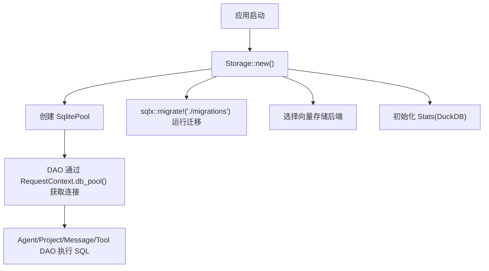
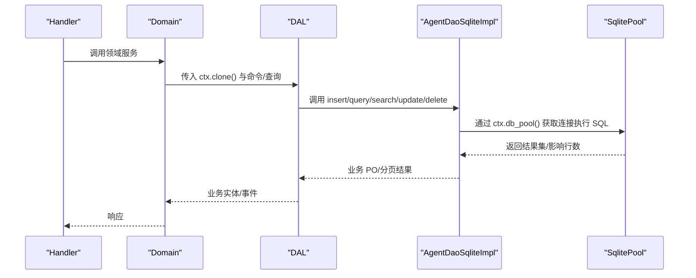
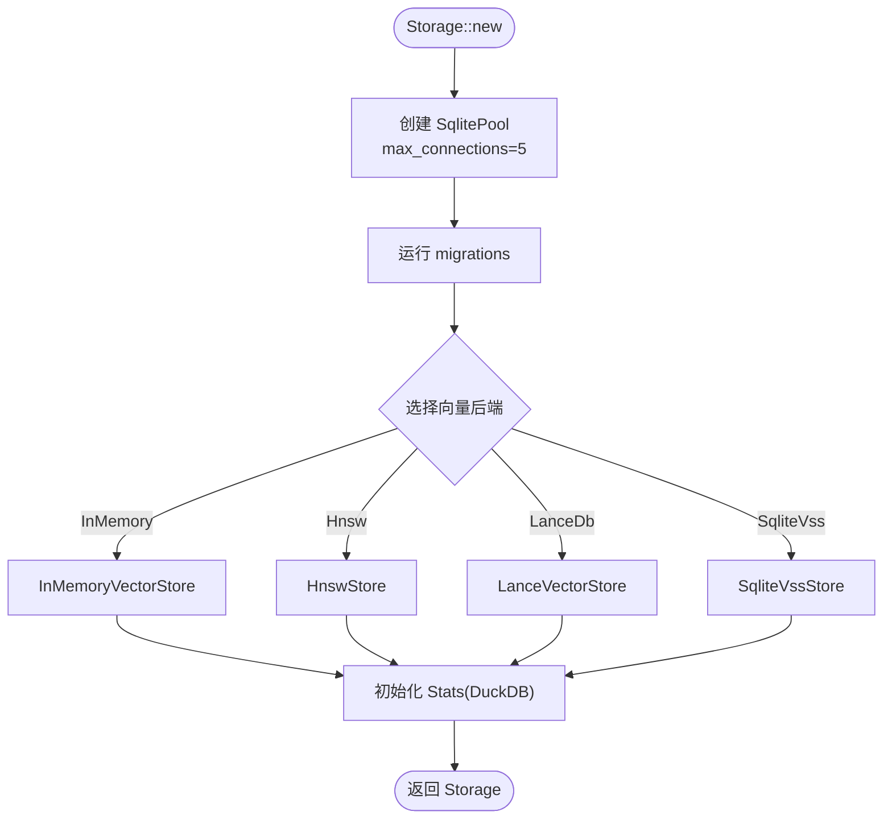
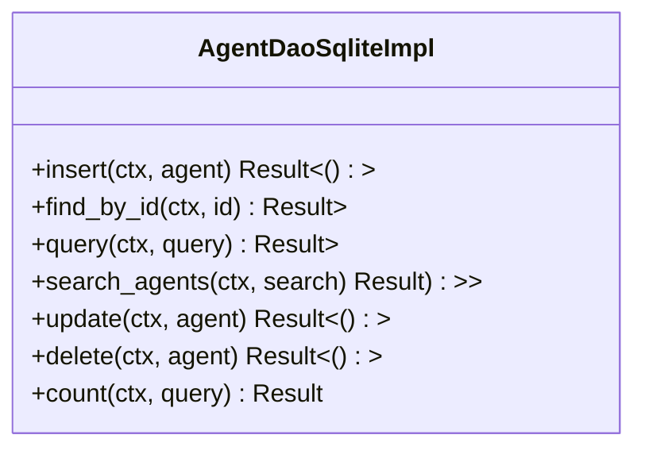
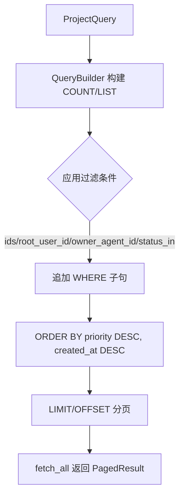
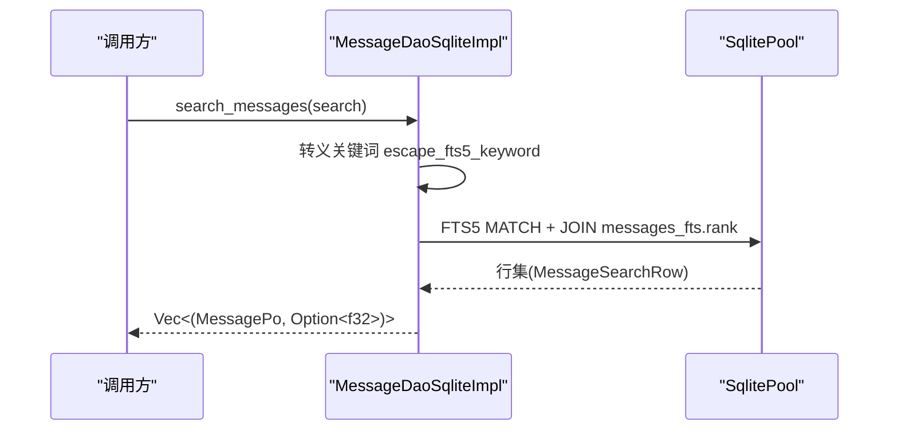
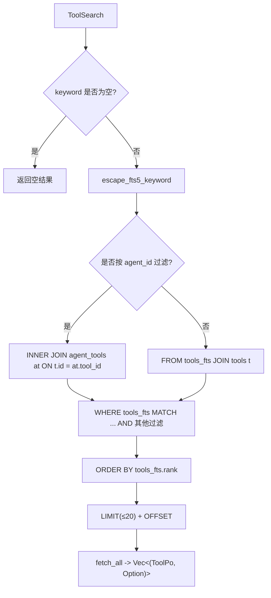
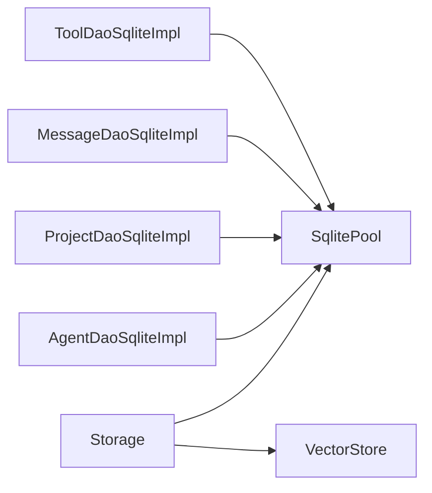

# SQLite 数据访问对象

<cite>
**本文引用的文件**
- [src/pkg/storage/mod.rs](file://src/pkg/storage/mod.rs)
- [migrations/20260420000000_initial.sql](file://migrations/20260420000000_initial.sql)
- [src/service/dao/agent/sqlite.rs](file://src/service/dao/agent/sqlite.rs)
- [src/service/dao/project/sqlite.rs](file://src/service/dao/project/sqlite.rs)
- [src/service/dao/message/sqlite.rs](file://src/service/dao/message/sqlite.rs)
- [src/service/dao/tool/sqlite.rs](file://src/service/dao/tool/sqlite.rs)
- [tests/integration/core_crud_test.rs](file://tests/integration/core_crud_test.rs)
</cite>

## 目录
1. [简介](#简介)
2. [项目结构](#项目结构)
3. [核心组件](#核心组件)
4. [架构总览](#架构总览)
5. [详细组件分析](#详细组件分析)
6. [依赖关系分析](#依赖关系分析)
7. [性能与优化](#性能与优化)
8. [故障排查指南](#故障排查指南)
9. [结论](#结论)
10. [附录：迁移管理与回滚](#附录：迁移管理与回滚)

## 简介
本文件面向基于 SQLx 的 SQLite 数据访问层，系统性说明连接池管理、事务处理、查询优化与索引策略；覆盖 Agent、Project、Message、Tool 等实体的 CRUD、复杂查询、关联查询与聚合；并给出迁移管理、版本控制与回滚建议，以及性能调优、超时处理和错误恢复策略。同时提供自定义查询开发与最佳实践示例，帮助在四层单向调用（Adapter → Domain → DAL → DAO）约束下正确扩展 DAO。

## 项目结构
- 存储门面与连接池：Storage 封装 SqlitePool、向量存储后端与 Stats，统一初始化数据库、运行迁移、选择向量后端。
- DAO 实现：按实体分模块（agent、project、message、tool），每个模块提供 sqlite.rs 实现，使用 sqlx::query/query_as/QueryBuilder 构建类型安全 SQL。
- 迁移脚本：migrations 目录包含初始 schema 与增量变更，启动时自动执行。
- 测试：集成测试验证核心 CRUD 流程与降级路径。

图表来源
- [src/pkg/storage/mod.rs:56-122](file://src/pkg/storage/mod.rs#L56-L122)
- [src/service/dao/agent/sqlite.rs:64-139](file://src/service/dao/agent/sqlite.rs#L64-L139)
- [src/service/dao/project/sqlite.rs:75-137](file://src/service/dao/project/sqlite.rs#L75-L137)
- [src/service/dao/message/sqlite.rs:71-133](file://src/service/dao/message/sqlite.rs#L71-L133)
- [src/service/dao/tool/sqlite.rs:89-249](file://src/service/dao/tool/sqlite.rs#L89-L249)

章节来源
- [src/pkg/storage/mod.rs:56-122](file://src/pkg/storage/mod.rs#L56-L122)
- [migrations/20260420000000_initial.sql:10-273](file://migrations/20260420000000_initial.sql#L10-L273)

## 核心组件
- Storage 门面：集中管理 SqlitePool、向量存储后端、Stats，并提供 sqlite()/sqlite_pool()/vector()/stats() 等访问器；支持全局单例 init/get 用于无 ctx 场景。
- DAO 抽象与实现：各实体 DAO 定义 trait（如 AgentDao、ProjectDao、MessageDao、ToolDao），sqlite.rs 提供具体实现，使用 sqlx 宏或 QueryBuilder 构建查询。
- 查询参数与分页：统一使用 PagedResult/PaginationParams，DAO 内部复用 push_query_filters 等辅助函数生成 COUNT/LIST SQL。
- 全文检索：FTS5 + escape_fts5_keyword + BM25 rank 排序，搜索方法返回 (Po, Option<f32>) 元组。
- 软删除：多数实体采用 status=0 表示已删除，默认查询排除软删除记录。

章节来源
- [src/pkg/storage/mod.rs:36-179](file://src/pkg/storage/mod.rs#L36-L179)
- [src/service/dao/agent/sqlite.rs:141-256](file://src/service/dao/agent/sqlite.rs#L141-L256)
- [src/service/dao/project/sqlite.rs:283-395](file://src/service/dao/project/sqlite.rs#L283-L395)
- [src/service/dao/message/sqlite.rs:429-527](file://src/service/dao/message/sqlite.rs#L429-L527)
- [src/service/dao/tool/sqlite.rs:383-452](file://src/service/dao/tool/sqlite.rs#L383-L452)

## 架构总览
遵循严格四层单向调用：Adapter → Domain → DAL → DAO。PO 仅在 DAO/DAL 内部使用，Domain 输入为 Command/Query，输出为业务实体与事件。所有跨层传递使用 RequestContext.clone()。

图表来源
- [src/service/dao/agent/sqlite.rs:64-139](file://src/service/dao/agent/sqlite.rs#L64-L139)
- [src/service/dao/project/sqlite.rs:75-137](file://src/service/dao/project/sqlite.rs#L75-L137)
- [src/service/dao/message/sqlite.rs:71-133](file://src/service/dao/message/sqlite.rs#L71-L133)
- [src/service/dao/tool/sqlite.rs:89-249](file://src/service/dao/tool/sqlite.rs#L89-L249)

## 详细组件分析

### 连接池与存储门面（Storage）
- 连接池：SqlitePoolOptions 设置 max_connections=5，适配 SQLite 单文件写并发限制。
- 迁移：sqlx::migrate!("./migrations") 在启动时自动运行，确保表结构与索引存在。
- 向量后端：根据配置选择 InMemory/HNSW/LanceDB/SqliteVss，统一通过 VectorStore trait 暴露。
- Stats：DuckDB 统计模块，初始化后注入全局，供 AOP 消费者等无 ctx 场景使用。

图表来源
- [src/pkg/storage/mod.rs:56-122](file://src/pkg/storage/mod.rs#L56-L122)

章节来源
- [src/pkg/storage/mod.rs:56-122](file://src/pkg/storage/mod.rs#L56-L122)

### Agent DAO（SQLite）
- 插入/更新/删除：使用 sqlx::query! 绑定字段，更新时写入 modified_by 与 updated_at；删除为软删除（status=0）。
- 列表与计数：使用 QueryBuilder 动态拼接过滤条件，COUNT 与 LIST 共享 push_query_filters。
- 搜索：FTS5 MATCH + JOIN agents_fts.rank，空关键词直接返回空结果；角色标签使用 json_each 精确匹配；限制最大返回数量避免失控。
- 索引策略：agents 表未显式建索引，但结合 FTS5 与常用过滤字段（created_by、model_provider_id、status）提升查询效率。

图表来源
- [src/service/dao/agent/sqlite.rs:64-329](file://src/service/dao/agent/sqlite.rs#L64-L329)

章节来源
- [src/service/dao/agent/sqlite.rs:64-329](file://src/service/dao/agent/sqlite.rs#L64-L329)

### Project DAO（SQLite）
- 插入/更新/状态更新：使用 sqlx::query! 绑定字段，状态更新单独方法便于幂等。
- 列表与计数：支持 root_user_id、owner_agent_id、status_in 过滤；默认排序 priority DESC, created_at DESC；分页支持 limit/offset。
- 搜索：FTS5 MATCH + JOIN projects_fts.rank，复用业务过滤条件（ids、root_user_id、owner_agent_id、status_in），默认排除软删除；限制最大返回数量。

图表来源
- [src/service/dao/project/sqlite.rs:101-137](file://src/service/dao/project/sqlite.rs#L101-L137)
- [src/service/dao/project/sqlite.rs:283-395](file://src/service/dao/project/sqlite.rs#L283-L395)

章节来源
- [src/service/dao/project/sqlite.rs:75-395](file://src/service/dao/project/sqlite.rs#L75-L395)

### Message DAO（SQLite）
- 插入/查询：支持 task_id、project_id、from_id、to_id、message_type、status_in 等过滤；默认按 created_at ASC 排序；可选 order_by。
- 软删除：delete 将 status 置 0；list_by_status 允许显式指定状态集合以覆盖默认软删除过滤。
- 搜索：FTS5 MATCH + JOIN messages_fts.rank，动态添加业务过滤（task_id、project_id、from_id、to_id、id、status_in），限制最大返回数量。

图表来源
- [src/service/dao/message/sqlite.rs:429-527](file://src/service/dao/message/sqlite.rs#L429-L527)

章节来源
- [src/service/dao/message/sqlite.rs:71-527](file://src/service/dao/message/sqlite.rs#L71-L527)

### Tool DAO（SQLite）
- 工具生命周期：create_tool/update_tool/delete_tool，内置工具禁止修改/删除；同步内置工具到 DB 时幂等跳过已存在项。
- 列表与计数：支持 agent_id 关联查询（INNER JOIN agent_tools），tags 使用 json_each 精确匹配；默认按 created_at DESC 排序。
- 搜索：FTS5 MATCH + JOIN tools_fts.rank，默认排除 Stale 状态；限制最大返回数量；支持 protocol/status/server_id/enabled_only 等过滤。

图表来源
- [src/service/dao/tool/sqlite.rs:383-452](file://src/service/dao/tool/sqlite.rs#L383-L452)
- [src/service/dao/tool/sqlite.rs:455-520](file://src/service/dao/tool/sqlite.rs#L455-L520)

章节来源
- [src/service/dao/tool/sqlite.rs:89-520](file://src/service/dao/tool/sqlite.rs#L89-L520)

### 实体模型与索引策略
- 表结构：organizations、users、agents、model_providers、tasks、projects、short_term_memory_index、long_term_knowledge_node、knowledge_node_relation、knowledge_reference、messages、artifacts、tools、agent_tools、skills。
- 索引：针对高频查询列建立索引，如 users.organization_id、users.username、messages.task_id/from_id/to_id/created_at、skills.status/category/parent_skill_id/updated_at/author_id、artifacts.project_id/task_id/status 等。
- 设计要点：STRICT 表、整数枚举存储、JSON 字段用于 tags/config/file_meta 等灵活结构。

章节来源
- [migrations/20260420000000_initial.sql:10-273](file://migrations/20260420000000_initial.sql#L10-L273)

## 依赖关系分析
- Storage 依赖 sqlx 连接池与向量存储后端，DAO 通过 RequestContext.db_pool() 获取连接。
- DAO 之间无直接依赖，均通过 trait 抽象被 DAL/Domain 调用，符合单向调用原则。
- 测试通过 sqlx::test 注入 SqlitePool，验证 CRUD 与降级路径。

图表来源
- [src/pkg/storage/mod.rs:36-179](file://src/pkg/storage/mod.rs#L36-L179)
- [src/service/dao/agent/sqlite.rs:64-139](file://src/service/dao/agent/sqlite.rs#L64-L139)
- [src/service/dao/project/sqlite.rs:75-137](file://src/service/dao/project/sqlite.rs#L75-L137)
- [src/service/dao/message/sqlite.rs:71-133](file://src/service/dao/message/sqlite.rs#L71-L133)
- [src/service/dao/tool/sqlite.rs:89-249](file://src/service/dao/tool/sqlite.rs#L89-L249)

章节来源
- [tests/integration/core_crud_test.rs:1-37](file://tests/integration/core_crud_test.rs#L1-L37)

## 性能与优化
- 连接池大小：max_connections=5 适合 SQLite 单文件写并发限制，避免锁争用。
- 查询构建：大量使用 QueryBuilder 动态拼接 WHERE 条件，减少无效扫描；COUNT 与 LIST 共享过滤逻辑，降低重复代码。
- 全文检索：FTS5 MATCH + BM25 rank，空关键词短路返回，避免无效查询；搜索限制最大返回数量防止全表扫描。
- JSON 字段：使用 json_each/json_extract 进行精确匹配，注意空字符串防护（如 Tool tags 为空时跳过 json_each）。
- 索引利用：对高频过滤列建立索引（如 messages.created_at、skills.status/category/updated_at），提升分页与筛选性能。
- 事务建议：多表写入（如消息+工具调用结果）应包裹在同一事务中，保证一致性；DAO 层可通过 ctx 的事务上下文或上层 DAL 组合多个 DAO 操作。
- 超时与重试：SQLx 连接/查询超时由驱动与网络层控制；建议在 DAL/Domain 层捕获超时错误并实施退避重试（指数退避 + 熔断）。
- 批量操作：对于大批量插入/更新，考虑分批提交，避免长事务导致 WAL 膨胀与锁竞争。

[本节为通用指导，不直接分析具体文件]

## 故障排查指南
- 启动失败：检查 Storage::new 中 SqlitePool 创建与迁移执行是否成功；确认数据库文件路径与权限。
- 查询异常：确认 FTS5 关键字转义是否正确；检查 JSON 字段是否为空字符串导致 json_each 报错。
- 软删除误判：默认查询排除 status=0，若需包含已删除记录，请显式传入 status_in。
- 搜索结果为空：空关键词会短路返回空结果；确认关键词非空且 FTS5 索引可用。
- 内置工具不可改删：Tool DAO 对内置工具进行保护，如需调整应通过升级机制而非直接修改。

章节来源
- [src/service/dao/tool/sqlite.rs:121-176](file://src/service/dao/tool/sqlite.rs#L121-L176)
- [src/service/dao/message/sqlite.rs:530-595](file://src/service/dao/message/sqlite.rs#L530-L595)
- [src/service/dao/tool/sqlite.rs:455-520](file://src/service/dao/tool/sqlite.rs#L455-L520)

## 结论
本项目基于 SQLx 的 SQLite DAO 实现了高内聚、低耦合的数据访问层，配合 FTS5 全文检索、严格的软删除策略与统一的查询构建器，满足 Agent、Project、Message、Tool 等实体的 CRUD、复杂查询与聚合需求。Storage 门面统一管理连接池、迁移与向量后端，确保可移植性与可测试性。遵循四层单向调用与 RequestContext 传递规范，可在不破坏架构约束的前提下扩展自定义查询。

[本节为总结，不直接分析具体文件]

## 附录：迁移管理与回滚
- 迁移执行：启动时通过 sqlx::migrate!("./migrations") 自动运行所有迁移，确保表结构与索引就绪。
- 版本控制：迁移文件命名采用时间戳前缀，便于顺序执行与追踪；初始 schema 位于 20260420000000_initial.sql。
- 回滚建议：SQLite 不支持原生回滚，建议通过“反向迁移”脚本逐步撤销变更；在 CI/CD 中先备份数据库再执行迁移。
- 测试隔离：集成测试使用内存数据库或临时文件，确保每次测试独立；DAO 单例在测试中通过 new() 工厂重置。

章节来源
- [src/pkg/storage/mod.rs:56-122](file://src/pkg/storage/mod.rs#L56-L122)
- [migrations/20260420000000_initial.sql:1-273](file://migrations/20260420000000_initial.sql#L1-L273)
- [tests/integration/core_crud_test.rs:1-37](file://tests/integration/core_crud_test.rs#L1-L37)