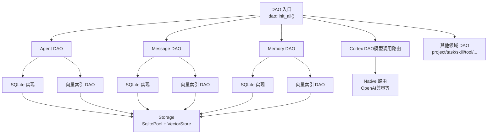
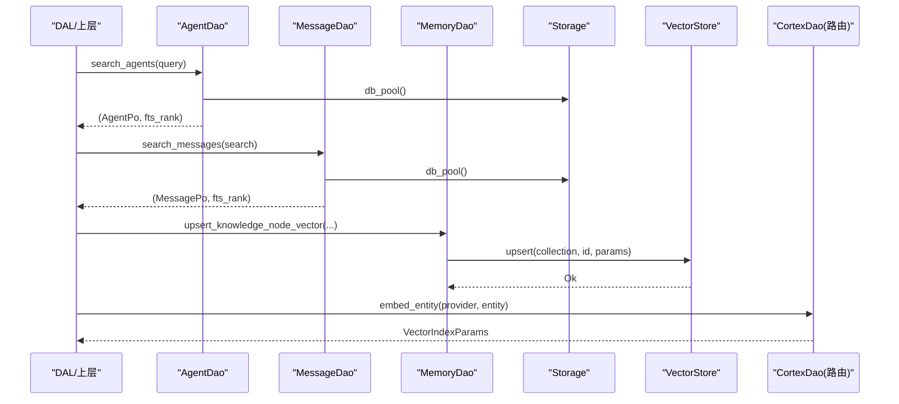
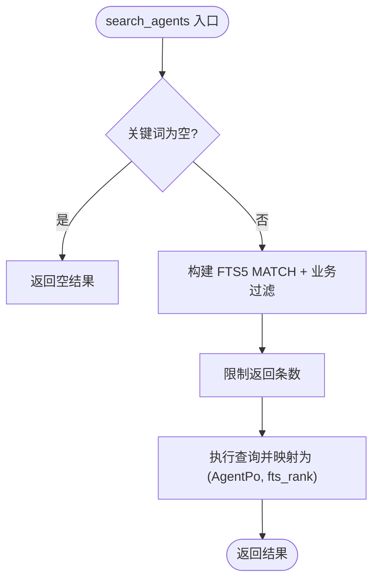
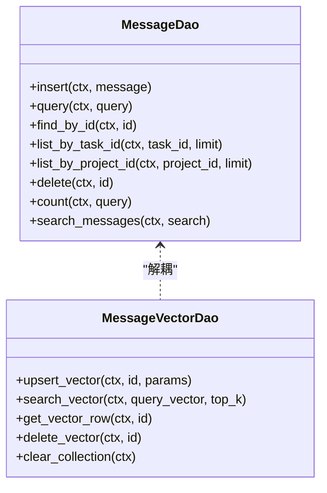
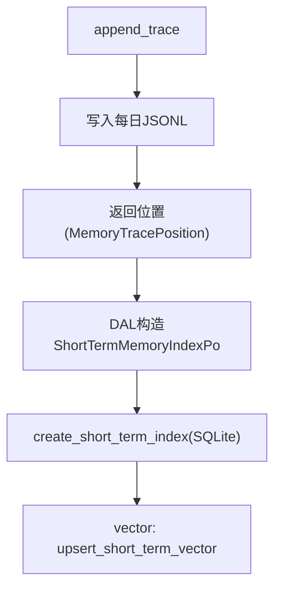
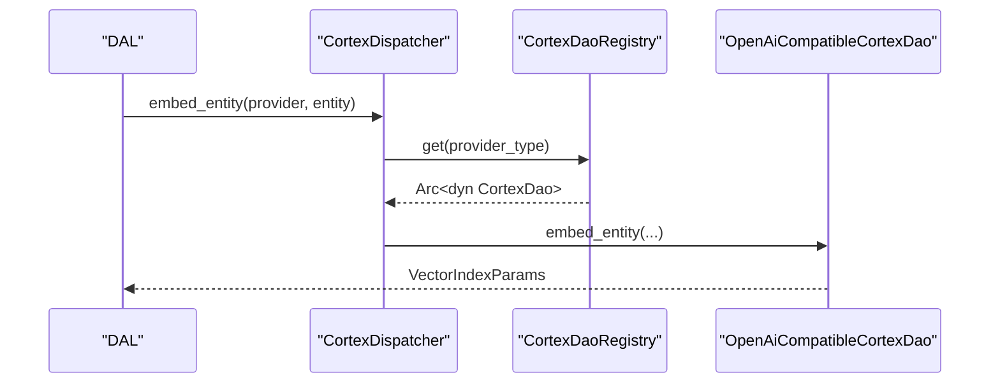
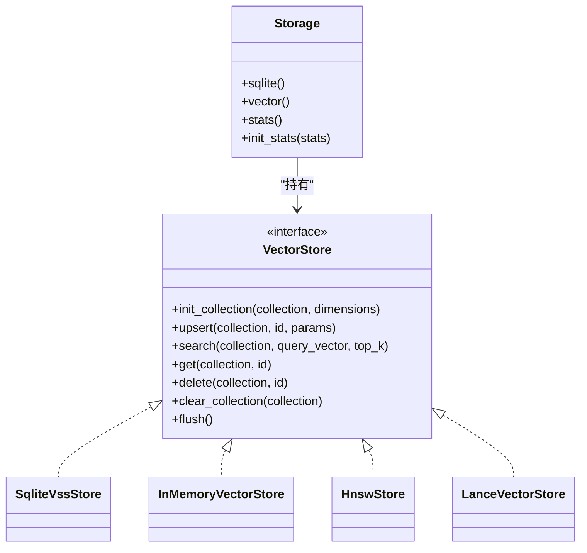
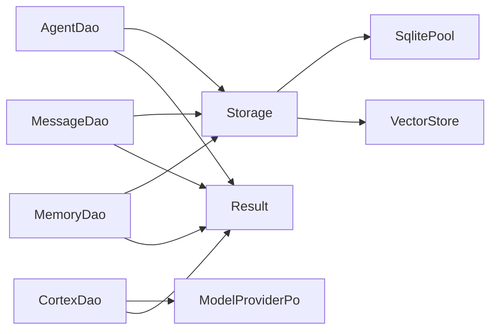

# 数据对象层（DAO）

<cite>
**本文引用的文件**
- [src/service/dao/mod.rs](file://src/service/dao/mod.rs)
- [src/service/dao/agent/mod.rs](file://src/service/dao/agent/mod.rs)
- [src/service/dao/agent/sqlite.rs](file://src/service/dao/agent/sqlite.rs)
- [src/service/dao/message/mod.rs](file://src/service/dao/message/mod.rs)
- [src/service/dao/message/sqlite.rs](file://src/service/dao/message/sqlite.rs)
- [src/service/dao/memory/mod.rs](file://src/service/dao/memory/mod.rs)
- [src/service/dao/cortex/mod.rs](file://src/service/dao/cortex/mod.rs)
- [src/service/dao/cortex/native/mod.rs](file://src/service/dao/cortex/native/mod.rs)
- [src/pkg/storage/mod.rs](file://src/pkg/storage/mod.rs)
- [src/pkg/storage/vector.rs](file://src/pkg/storage/vector.rs)
- [common/src/error/mod.rs](file://common/src/error/mod.rs)
</cite>

## 目录
1. [简介](#简介)
2. [项目结构](#项目结构)
3. [核心组件](#核心组件)
4. [架构总览](#架构总览)
5. [详细组件分析](#详细组件分析)
6. [依赖关系分析](#依赖关系分析)
7. [性能考量](#性能考量)
8. [故障排查指南](#故障排查指南)
9. [结论](#结论)
10. [附录](#附录)

## 简介
本文件面向 AI Orz 的数据对象层（DAO），系统性说明 DAO 层的设计模式与实现要点，覆盖 SQLite 持久化、外部模型 API 集成、存储适配器模式、向量搜索、全文检索、文件存储管理、序列化/反序列化与类型安全、连接管理、重试与错误恢复策略，以及扩展指南、性能调优与第三方服务集成示例。

本项目遵循严格四层单向调用：Adapter → Domain → DAL → DAO；PO 仅在 DAO/DAL 内部使用，Domain 层不感知 PO；service 层公共方法首参为 RequestContext，跨层传递统一 clone()；通用工具放在 pkg 层，禁止业务 DAO 间耦合。

## 项目结构
DAO 层按领域划分模块，每个模块提供接口 Trait、SQLite 实现、向量索引 DAO、统计 DAO（可选）与初始化入口。全局通过 dao::init_all() 集中注册所有子模块单例。

图表来源
- [src/service/dao/mod.rs:29-55](file://src/service/dao/mod.rs#L29-L55)
- [src/pkg/storage/mod.rs:36-122](file://src/pkg/storage/mod.rs#L36-L122)

章节来源
- [src/service/dao/mod.rs:1-56](file://src/service/dao/mod.rs#L1-L56)
- [src/pkg/storage/mod.rs:1-212](file://src/pkg/storage/mod.rs#L1-L212)

## 核心组件
- 存储门面 Storage：封装 SqlitePool、VectorStore、Stats，负责迁移、后端选择与 Stats 初始化。
- 向量存储抽象 VectorStore：定义 init_collection/upsert/search/get/delete/clear_collection 等能力，支持 InMemory/HNSW/LanceDB/SqliteVss 多后端。
- 各业务 DAO 接口：如 AgentDao、MessageDao、MemoryDao，统一以 RequestContext 为上下文，返回 Result<T>。
- Cortex DAO：按 provider_type 路由到具体模型提供方实现，提供 think/embed/embed_entity/embed_text_for_search。
- 统一错误模型：common::error::Result<T>，基于 Error/ErrorCode/ErrorType 的强类型错误体系。

章节来源
- [src/pkg/storage/mod.rs:36-122](file://src/pkg/storage/mod.rs#L36-L122)
- [src/pkg/storage/vector.rs:18-74](file://src/pkg/storage/vector.rs#L18-L74)
- [src/service/dao/cortex/mod.rs:1-82](file://src/service/dao/cortex/mod.rs#L1-L82)
- [src/service/dao/cortex/native/mod.rs:19-88](file://src/service/dao/cortex/native/mod.rs#L19-L88)
- [common/src/error/mod.rs:1-25](file://common/src/error/mod.rs#L1-L25)

## 架构总览
DAO 层采用“接口 + 实现”的适配器模式：
- 业务 DAO 接口定义领域操作（CRUD、搜索、统计）。
- SQLite 实现负责 SQL 构建、FTS5 全文检索、软删除、审计字段填充。
- 向量索引 DAO 解耦基础数据与向量索引，仅维护集合 CRUD。
- Cortex DAO 作为外部模型 API 的适配层，屏蔽不同 Provider 差异。
- Storage 作为基础设施门面，统一管理数据库连接池、向量后端与统计。

图表来源
- [src/service/dao/agent/sqlite.rs:141-256](file://src/service/dao/agent/sqlite.rs#L141-L256)
- [src/service/dao/message/sqlite.rs:429-527](file://src/service/dao/message/sqlite.rs#L429-L527)
- [src/pkg/storage/mod.rs:56-122](file://src/pkg/storage/mod.rs#L56-L122)
- [src/pkg/storage/vector.rs:22-74](file://src/pkg/storage/vector.rs#L22-L74)
- [src/service/dao/cortex/mod.rs:24-45](file://src/service/dao/cortex/mod.rs#L24-L45)

## 详细组件分析

### Agent DAO（SQLite + FTS5 + 向量）
- 查询参数与搜索入参：AgentQuery 用于过滤（ID、状态、角色标签 JSON 匹配、分页等），AgentSearch 统一关键词与向量搜索入口。
- SQLite 实现：
  - 插入/更新/删除：使用 sqlx::query! 直接映射枚举与时间戳，更新时写入 modified_by/updated_at。
  - 通用查询：QueryBuilder 动态拼接条件，COUNT 与 LIST 复用过滤逻辑。
  - 全文检索：FTS5 MATCH + BM25 排序，限制最大返回数量防止失控。
  - 角色标签过滤：使用 json_each 精确匹配 JSON 数组元素。
- 向量索引 DAO：upsert_vector/search_vector/get_vector_row/delete_vector/clear_collection，与基础数据解耦。
- 统计 DAO：基于 DuckDB 的唤醒事件聚合，提供 sum_calls/get_stats。

图表来源
- [src/service/dao/agent/sqlite.rs:141-256](file://src/service/dao/agent/sqlite.rs#L141-L256)
- [src/service/dao/agent/sqlite.rs:331-383](file://src/service/dao/agent/sqlite.rs#L331-L383)

章节来源
- [src/service/dao/agent/mod.rs:12-90](file://src/service/dao/agent/mod.rs#L12-L90)
- [src/service/dao/agent/sqlite.rs:64-329](file://src/service/dao/agent/sqlite.rs#L64-L329)

### Message DAO（SQLite + FTS5 + 向量）
- 查询参数与搜索入参：MessageQuery 支持任务/项目/发送方/接收方/类型/状态/分页/组织隔离等组合条件；MessageSearch 统一关键词与向量搜索。
- SQLite 实现：
  - 插入/查找/列表：QueryBuilder 动态拼接，默认按 created_at 升序，支持自定义排序与分页。
  - 软删除：将 status 置为 Recalled（0），保留审计信息。
  - 全文检索：FTS5 MATCH + BM25 排序，默认限制返回条数。
  - 工具调用消息便捷方法：create_tool_call_request/create_tool_call_result，自动序列化 ToolCallMessage 并处理附件元数据。
- 向量索引 DAO：upsert_vector/search_vector/get_vector_row/delete_vector/clear_collection。

图表来源
- [src/service/dao/message/mod.rs:61-176](file://src/service/dao/message/mod.rs#L61-L176)
- [src/service/dao/message/mod.rs:178-211](file://src/service/dao/message/mod.rs#L178-L211)

章节来源
- [src/service/dao/message/mod.rs:9-57](file://src/service/dao/message/mod.rs#L9-L57)
- [src/service/dao/message/sqlite.rs:71-527](file://src/service/dao/message/sqlite.rs#L71-L527)

### Memory DAO（短期记忆 + 长期知识图谱 + 向量）
- 短期记忆：原始追踪不可修改删除，仅追加；索引可创建/更新/查询/遗忘；支持 FTS5 全文检索。
- 长期知识图谱：节点 upsert/批量保存/查询/删除；引用与关系增删查；支持 FTS5 全文检索。
- 向量索引 DAO：短期记忆与长期知识节点分别维护向量集合，支持语义搜索与行级元数据获取。
- 文件存储：append_trace/batch_append_traces 写入每日 JSONL 文件，返回位置以便后续索引。

图表来源
- [src/service/dao/memory/mod.rs:66-182](file://src/service/dao/memory/mod.rs#L66-L182)
- [src/service/dao/memory/mod.rs:488-553](file://src/service/dao/memory/mod.rs#L488-L553)

章节来源
- [src/service/dao/memory/mod.rs:15-58](file://src/service/dao/memory/mod.rs#L15-L58)
- [src/service/dao/memory/mod.rs:66-486](file://src/service/dao/memory/mod.rs#L66-L486)

### Cortex DAO（外部模型 API 集成）
- 路由机制：CortexDispatcher 根据 provider.provider_type 路由到 native::registry 中的具体实现（当前 OpenAI 兼容）。
- 能力：
  - think：多轮对话推理，返回最终回答或工具调用请求。
  - embed：文本转向量。
  - embed_entity/embed_text_for_search：封装为 VectorIndexParams，便于索引。
- 注册表：CortexDaoRegistry 持有各 Provider 实现，支持扩展新 Provider。

图表来源
- [src/service/dao/cortex/mod.rs:24-45](file://src/service/dao/cortex/mod.rs#L24-L45)
- [src/service/dao/cortex/native/mod.rs:90-139](file://src/service/dao/cortex/native/mod.rs#L90-L139)

章节来源
- [src/service/dao/cortex/mod.rs:1-82](file://src/service/dao/cortex/mod.rs#L1-L82)
- [src/service/dao/cortex/native/mod.rs:19-88](file://src/service/dao/cortex/native/mod.rs#L19-L88)

### 存储适配器与向量后端
- Storage 门面：
  - 初始化 SqlitePool（max_connections=5），运行 migrations。
  - 根据配置选择向量后端：InMemory/HNSW/LanceDB/SqliteVss。
  - 初始化 Stats（DuckDB），并提供全局 Stats 访问。
- VectorStore 抽象：
  - 统一接口：init_collection/upsert/search/get/delete/clear_collection/flush。
  - SqliteVssStore：基于 vss0 扩展，元数据与向量分离存储，支持过期过滤。
  - InMemoryVectorStore/HnswStore/LanceVectorStore：纯 Rust 或高性能嵌入式实现。

图表来源
- [src/pkg/storage/mod.rs:36-122](file://src/pkg/storage/mod.rs#L36-L122)
- [src/pkg/storage/vector.rs:18-74](file://src/pkg/storage/vector.rs#L18-L74)
- [src/pkg/storage/vector.rs:76-291](file://src/pkg/storage/vector.rs#L76-L291)

章节来源
- [src/pkg/storage/mod.rs:56-122](file://src/pkg/storage/mod.rs#L56-L122)
- [src/pkg/storage/vector.rs:18-74](file://src/pkg/storage/vector.rs#L18-L74)

## 依赖关系分析
- DAO 模块依赖 Storage 提供的 SqlitePool 与 VectorStore。
- 各业务 DAO 通过 RequestContext 获取 db_pool()，避免全局状态耦合。
- Cortex DAO 依赖 Provider 配置（ModelProviderPo），由 DAL 注入。
- 错误模型统一为 common::error::Result<T>，保证类型安全与结构化错误上下文。

图表来源
- [src/service/dao/agent/sqlite.rs:64-329](file://src/service/dao/agent/sqlite.rs#L64-L329)
- [src/service/dao/message/sqlite.rs:71-527](file://src/service/dao/message/sqlite.rs#L71-L527)
- [src/service/dao/memory/mod.rs:66-486](file://src/service/dao/memory/mod.rs#L66-L486)
- [src/service/dao/cortex/mod.rs:24-45](file://src/service/dao/cortex/mod.rs#L24-L45)
- [common/src/error/mod.rs:1-25](file://common/src/error/mod.rs#L1-L25)

章节来源
- [src/service/dao/mod.rs:29-55](file://src/service/dao/mod.rs#L29-L55)
- [common/src/error/mod.rs:1-25](file://common/src/error/mod.rs#L1-L25)

## 性能考量
- SQLite 连接池：max_connections=5，适合单文件写并发有限场景。
- 全文检索：FTS5 MATCH + BM25，限制返回条数避免全表扫描。
- 向量搜索：
  - InMemory/HNSW/LanceDB 提供高性能近似最近邻。
  - SqliteVss 需要系统依赖，注意扩展加载失败降级。
- 统计：DuckDB 异步批量化，减少主库压力。
- 建议：
  - 合理设置 top_k 与距离阈值，控制向量搜索开销。
  - 对高频查询建立合适索引（FTS5 已内置）。
  - 批量操作优先（如 batch_save_knowledge_nodes）。

[本节为通用指导，无需特定文件来源]

## 故障排查指南
- 常见错误：
  - FTS5 空关键词：search_agents/search_messages 会提前返回空结果，避免 MATCH 报错。
  - 向量后端未就绪：SqliteVss 扩展加载失败需检查系统依赖或切换后端。
  - 统计未初始化：Storage::new 中初始化 Stats，若未调用则 stats_opt() 返回 None。
- 调试建议：
  - 使用 RequestContext.db_pool() 直接执行 SQL 验证查询。
  - 检查 vector_store.get_collection_model_provider_id 判断是否需要重建索引。
  - 利用 common::error::Error 的结构化字段定位问题。

章节来源
- [src/service/dao/agent/sqlite.rs:141-157](file://src/service/dao/agent/sqlite.rs#L141-L157)
- [src/service/dao/message/sqlite.rs:429-447](file://src/service/dao/message/sqlite.rs#L429-L447)
- [src/pkg/storage/vector.rs:254-257](file://src/pkg/storage/vector.rs#L254-L257)
- [src/pkg/storage/mod.rs:164-178](file://src/pkg/storage/mod.rs#L164-L178)
- [common/src/error/mod.rs:1-25](file://common/src/error/mod.rs#L1-L25)

## 结论
DAO 层通过清晰的接口抽象、SQLite 持久化、向量搜索适配器与外部模型 API 路由，实现了高内聚、低耦合的数据访问层。结合 FTS5 全文检索、多后端向量存储与统一错误模型，提供了类型安全、可扩展且高性能的数据访问能力。遵循四层单向调用与 RequestContext 上下文传递，确保代码可测试性与可维护性。

[本节为总结，无需特定文件来源]

## 附录

### DAO 层扩展指南
- 新增领域 DAO：
  - 在 src/service/dao/<domain>/mod.rs 定义接口 Trait。
  - 实现 sqlite.rs 与 vector.rs（如需向量）。
  - 在 dao::init_all() 中注册 init()。
- 新增向量后端：
  - 实现 VectorStore trait。
  - 在 Storage::new 的配置分支中添加新后端。
- 新增模型 Provider：
  - 在 cortex/native 下实现新的 CortexDao。
  - 在 CortexDaoRegistry::get 中增加路由分支。

章节来源
- [src/service/dao/mod.rs:29-55](file://src/service/dao/mod.rs#L29-L55)
- [src/pkg/storage/mod.rs:78-93](file://src/pkg/storage/mod.rs#L78-L93)
- [src/service/dao/cortex/native/mod.rs:101-124](file://src/service/dao/cortex/native/mod.rs#L101-L124)

### 性能调优建议
- 调整向量搜索 top_k 与距离阈值。
- 使用批量接口（如 batch_add_knowledge_references）。
- 监控 Stats 指标，识别热点查询。
- 合理设置 SQLite 连接池大小与超时。

[本节为通用指导，无需特定文件来源]

### 第三方服务集成示例
- 模型 Provider：通过 CortexDao 路由到 OpenAI 兼容实现，传入 ModelProviderPo 配置。
- 向量后端：根据配置选择 InMemory/HNSW/LanceDB/SqliteVss。
- 全文检索：FTS5 已内置，无需额外依赖。

章节来源
- [src/service/dao/cortex/mod.rs:24-45](file://src/service/dao/cortex/mod.rs#L24-L45)
- [src/pkg/storage/mod.rs:78-93](file://src/pkg/storage/mod.rs#L78-L93)