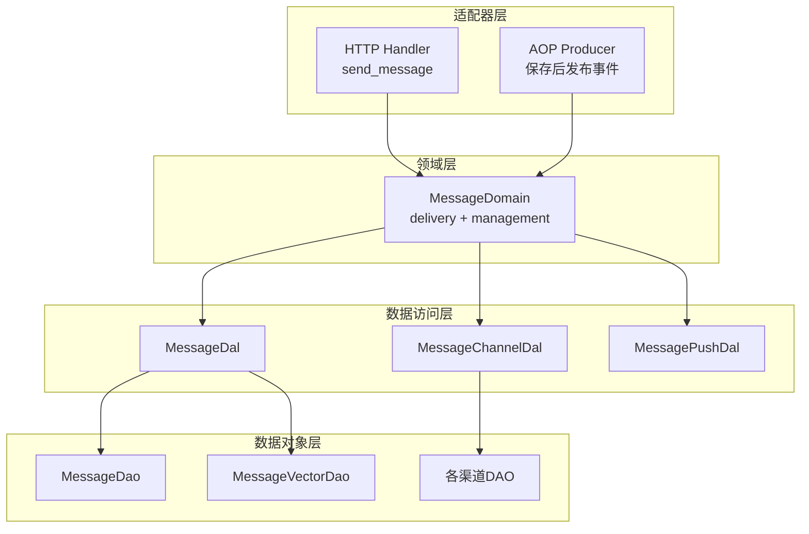
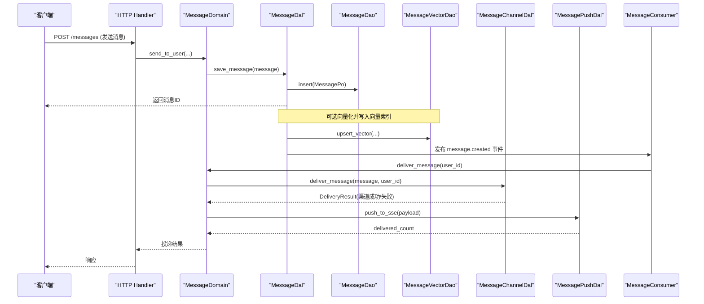
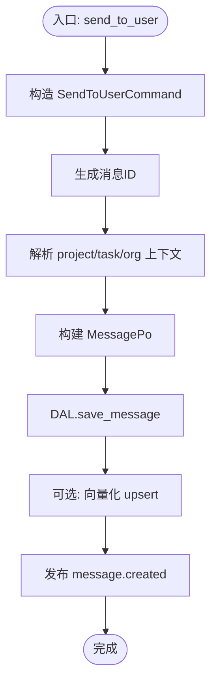
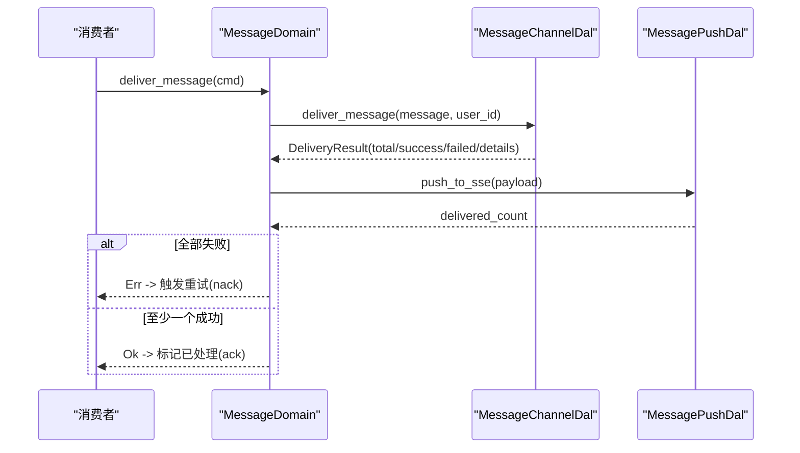
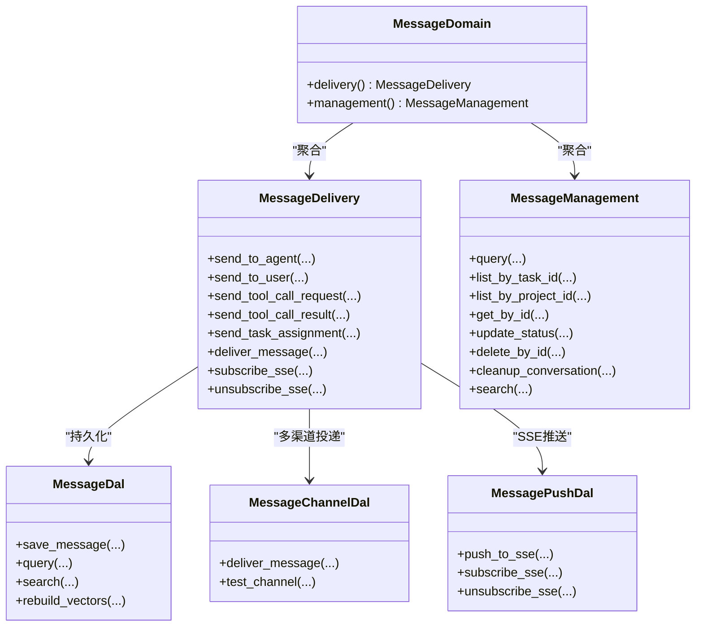

# 消息领域

<cite>
**本文引用的文件**
- [src/service/domain/message/mod.rs](file://src/service/domain/message/mod.rs)
- [src/service/domain/message/delivery.rs](file://src/service/domain/message/delivery.rs)
- [src/service/domain/message/management.rs](file://src/service/domain/message/management.rs)
- [src/models/message.rs](file://src/models/message.rs)
- [src/service/dal/message.rs](file://src/service/dal/message.rs)
- [src/service/dao/message/mod.rs](file://src/service/dao/message/mod.rs)
- [src/consumer/message.rs](file://src/consumer/message.rs)
- [src/service/dal/message_channel.rs](file://src/service/dal/message_channel.rs)
- [src/service/dal/message_push.rs](file://src/service/dal/message_push.rs)
- [src/handlers/finance/message/send_message.rs](file://src/handlers/finance/message/send_message.rs)
- [common/src/enums/message.rs](file://common/src/enums/message.rs)
- [common/src/enums/message_channel.rs](file://common/src/enums/message_channel.rs)
- [src/router.rs](file://src/router.rs)
</cite>

## 目录
1. [简介](#简介)
2. [项目结构](#项目结构)
3. [核心组件](#核心组件)
4. [架构总览](#架构总览)
5. [详细组件分析](#详细组件分析)
6. [依赖关系分析](#依赖关系分析)
7. [性能与扩展性](#性能与扩展性)
8. [故障排查指南](#故障排查指南)
9. [结论](#结论)
10. [附录：API 与示例路径](#附录api-与示例路径)

## 简介
本文件围绕“消息领域”进行系统化文档化，覆盖消息管理系统与消息投递系统的领域模型、创建路由、存储检索、投递策略、重试与失败处理、队列管理、批量与异步投递、生命周期与状态管理、清理策略、序列化与协议适配，以及发送、接收、转发和监控的实现模式。整体遵循四层单向调用：Adapter（HTTP Handler / AOP Producer）→ Domain → DAL → DAO，禁止跨层与同层互调；所有公共方法首参为 RequestContext，跨层使用 ctx.clone()。

## 项目结构
消息领域由以下层次组成：
- Adapter 层：HTTP Handler 暴露消息发送、列表、搜索、SSE 订阅等接口；AOP Producer 在保存消息后发布事件。
- Domain 层：MessageDomain 聚合 delivery（投递）与 management（管理）能力，定义命令对象与业务编排。
- DAL 层：MessageDal 封装消息持久化、向量索引、搜索合并；MessageChannelDal 负责多渠道分发；MessagePushDal 负责 SSE 推送。
- DAO 层：MessageDao/MessageVectorDao 提供 SQL/向量索引的 CRUD 与查询；各渠道 DAO 实现具体推送。

**图表来源**
- [src/handlers/finance/message/send_message.rs:1-41](file://src/handlers/finance/message/send_message.rs#L1-L41)
- [src/service/domain/message/mod.rs:1-119](file://src/service/domain/message/mod.rs#L1-L119)
- [src/service/dal/message.rs:1-122](file://src/service/dal/message.rs#L1-L122)
- [src/service/dal/message_channel.rs:1-126](file://src/service/dal/message_channel.rs#L1-L126)
- [src/service/dal/message_push.rs:1-59](file://src/service/dal/message_push.rs#L1-L59)
- [src/service/dao/message/mod.rs:1-57](file://src/service/dao/message/mod.rs#L1-L57)

**章节来源**
- [src/router.rs:480-524](file://src/router.rs#L480-L524)
- [src/service/domain/message/mod.rs:1-119](file://src/service/domain/message/mod.rs#L1-L119)

## 核心组件
- 领域模型与实体
  - Message 业务实体与 MessagePo 持久化对象，承载消息元信息、内容、附件、回复链、根链、组织上下文等。
  - ToolCallMessage 统一工具调用请求/结果载荷，支持大结果附件与轻量追踪引用。
  - TaskAssignmentMessage 任务分配通知载荷。
- 领域接口
  - MessageDelivery：发送 Agent/用户消息、工具调用请求/结果、任务分配、分发消息到渠道、SSE 订阅/取消。
  - MessageManagement：通用查询、按任务/项目列表、按 ID 获取、状态更新、删除、对话清理、混合搜索。
- 数据访问接口
  - MessageDal：保存、查询、计数、状态更新、删除、搜索、重建向量索引。
  - MessageChannelDal：渠道配置管理与 deliver_message 分发。
  - MessagePushDal：SSE 推送、订阅、连接数统计。
- 消费者与事件
  - MessageConsumer 订阅 message.created 事件，按 to_role 分发至 RuntimeDomain 或 MessageDomain，完成唤醒、投递与工具执行。

**章节来源**
- [src/models/message.rs:18-247](file://src/models/message.rs#L18-L247)
- [src/models/message.rs:402-612](file://src/models/message.rs#L402-L612)
- [src/service/domain/message/mod.rs:121-377](file://src/service/domain/message/mod.rs#L121-L377)
- [src/service/dal/message.rs:49-122](file://src/service/dal/message.rs#L49-L122)
- [src/service/dal/message_channel.rs:62-126](file://src/service/dal/message_channel.rs#L62-L126)
- [src/service/dal/message_push.rs:40-59](file://src/service/dal/message_push.rs#L40-L59)
- [src/consumer/message.rs:64-141](file://src/consumer/message.rs#L64-L141)

## 架构总览
消息从 Adapter 进入，经 Domain 编排，DAL 协调 DAO 完成持久化与投递，并通过 AOP 事件驱动异步消费。

**图表来源**
- [src/handlers/finance/message/send_message.rs:1-41](file://src/handlers/finance/message/send_message.rs#L1-L41)
- [src/service/domain/message/delivery.rs:160-208](file://src/service/domain/message/delivery.rs#L160-L208)
- [src/service/dal/message.rs:131-193](file://src/service/dal/message.rs#L131-L193)
- [src/consumer/message.rs:78-120](file://src/consumer/message.rs#L78-L120)
- [src/service/dal/message_channel.rs:226-284](file://src/service/dal/message_channel.rs#L226-L284)
- [src/service/dal/message_push.rs:71-84](file://src/service/dal/message_push.rs#L71-L84)

## 详细组件分析

### 领域模型与数据结构
- Message/MessagePo：包含项目/任务关联、角色、类型、状态、内容、附件、回复链 root_id、组织上下文、时间戳等。
- ToolCallMessage：统一请求/结果载荷，支持 result_file_meta 与 trace_ref，便于大结果与链路追踪。
- TaskAssignmentMessage：任务分配通知载荷。
- 枚举：
  - MessageRole：User/Agent/System。
  - MessageType：Text/Image/File/Audio/Video/ToolCallRequest/ToolCallResult/ConfirmRequest/ConfirmResponse/TaskAssignment/ProjectFollowupNotification 等。
  - MessageStatus：Recalled/Pending/Processing/Processed/Failed。
  - ChannelType：Lark/Wechat/Slack/Email/Webhook/A2aCallback。

这些类型贯穿 Domain/DAL/DAO/Handler，保证序列化一致性与跨层契约稳定。

**章节来源**
- [src/models/message.rs:18-300](file://src/models/message.rs#L18-L300)
- [src/models/message.rs:402-612](file://src/models/message.rs#L402-L612)
- [common/src/enums/message.rs:7-188](file://common/src/enums/message.rs#L7-L188)
- [common/src/enums/message_channel.rs:9-60](file://common/src/enums/message_channel.rs#L9-L60)

### 消息创建与路由
- 发送给用户：Handler 解析参数，构造 SendToUserCommand 调用 Domain.delivery().send_to_user，DAL 保存并可选向量化，随后通过 AOP 发布事件。
- 发送给 Agent：send_to_agent 支持附件消息链与 root_id 继承，确保对话链可拉取。
- 工具调用：send_tool_call_request 生成 ToolCallMessage 请求，保存后由消费者触发工具执行，再 send_tool_call_result 回写结果。
- 任务分配：send_task_assignment 生成 TaskAssignmentMessage 并持久化。

**图表来源**
- [src/handlers/finance/message/send_message.rs:1-41](file://src/handlers/finance/message/send_message.rs#L1-L41)
- [src/service/domain/message/delivery.rs:160-208](file://src/service/domain/message/delivery.rs#L160-L208)
- [src/service/dal/message.rs:131-193](file://src/service/dal/message.rs#L131-L193)

**章节来源**
- [src/service/domain/message/delivery.rs:51-158](file://src/service/domain/message/delivery.rs#L51-L158)
- [src/service/domain/message/delivery.rs:210-330](file://src/service/domain/message/delivery.rs#L210-L330)
- [src/service/domain/message/delivery.rs:332-379](file://src/service/domain/message/delivery.rs#L332-L379)

### 消息投递策略与失败处理
- 多渠道投递：MessageChannelDal.deliver_message 查询用户活跃渠道并按 scope_project 过滤，逐个 push_to_channel，记录成功/失败详情。
- SSE 推送：MessagePushDal.push_to_sse 将消息推送到在线连接，返回 delivered_count。
- 失败重试：
  - 消费者 handle_user_message 在所有渠道失败且无 SSE 投递时返回错误，触发 nack 重试。
  - ack/nack 分别将消息状态置为 Processed/Pending，配合 AOP 队列的重试机制。
- 去重与限流：has_pending_message_for_agent 用于避免对同一 Agent 重复投递系统通知。

**图表来源**
- [src/service/dal/message_channel.rs:226-284](file://src/service/dal/message_channel.rs#L226-L284)
- [src/service/dal/message_push.rs:71-84](file://src/service/dal/message_push.rs#L71-L84)
- [src/consumer/message.rs:359-389](file://src/consumer/message.rs#L359-L389)

**章节来源**
- [src/service/dal/message_channel.rs:226-335](file://src/service/dal/message_channel.rs#L226-L335)
- [src/consumer/message.rs:114-141](file://src/consumer/message.rs#L114-L141)
- [src/consumer/message.rs:359-389](file://src/consumer/message.rs#L359-L389)

### 消息队列管理与异步投递
- AOP 事件中心：保存消息后发布 message.created，消费者以 Async 模式轮询消费，并发度与空队列休眠、错误重试间隔可配置。
- 消费者职责：仅做订阅与调度，业务逻辑委托给 Domain（RuntimeDomain 唤醒 Agent、MessageDomain 投递）。
- 上下文重建：消费者根据 MessagePo 重建 RequestContext，确保日志链路、模型上下文、租户隔离等完整。

**章节来源**
- [src/service/dal/message.rs:131-193](file://src/service/dal/message.rs#L131-L193)
- [src/consumer/message.rs:64-141](file://src/consumer/message.rs#L64-L141)
- [src/consumer/message.rs:479-514](file://src/consumer/message.rs#L479-L514)

### 批量处理与异步投递
- 批量查询：MessageQuery 支持 limit/offset/order_by/status_in 等组合条件，DAL 提供 list_by_* 语法糖。
- 批量向量重建：rebuild_vectors 清空集合后遍历消息逐条向量化，失败降级不影响主流程。
- 异步投递：消费者异步处理消息，结合 AOP 队列实现背压与重试。

**章节来源**
- [src/service/dao/message/mod.rs:9-57](file://src/service/dao/message/mod.rs#L9-L57)
- [src/service/dal/message.rs:398-445](file://src/service/dal/message.rs#L398-L445)
- [src/consumer/message.rs:74-141](file://src/consumer/message.rs#L74-L141)

### 消息生命周期、状态管理与清理策略
- 状态机：Recalled/Pending/Processing/Processed/Failed，由消费者 ack/nack 驱动状态迁移。
- 清理：cleanup_conversation 删除任务下所有消息；delete_by_id 物理删除单条消息；删除时同步清理向量索引。
- 会话链：reply_to_id 与 root_id 共同维护消息链，便于按根拉取完整对话。

**章节来源**
- [src/service/domain/message/management.rs:57-79](file://src/service/domain/message/management.rs#L57-L79)
- [src/service/dal/message.rs:338-355](file://src/service/dal/message.rs#L338-L355)
- [src/models/message.rs:281-299](file://src/models/message.rs#L281-L299)

### 序列化、格式转换与协议适配
- 统一载荷：ToolCallMessage 统一请求/结果结构，支持大结果附件与 trace_ref。
- Prompt 格式化：MessagePo.to_prompt 输出结构化文本，便于 LLM 理解。
- 协议适配：MessageChannelDal 通过 match 分发到 Lark/Wechat/Slack/Email/Webhook/A2aCallback 等渠道 DAO，新增渠道只需添加分支。

**章节来源**
- [src/models/message.rs:302-356](file://src/models/message.rs#L302-L356)
- [src/models/message.rs:402-571](file://src/models/message.rs#L402-L571)
- [src/service/dal/message_channel.rs:202-222](file://src/service/dal/message_channel.rs#L202-L222)
- [src/service/dal/message_channel.rs:299-313](file://src/service/dal/message_channel.rs#L299-L313)

### 实际代码示例（路径）
- 发送消息给用户：[src/handlers/finance/message/send_message.rs:1-41](file://src/handlers/finance/message/send_message.rs#L1-L41)
- 发送消息给 Agent：[src/service/domain/message/delivery.rs:51-158](file://src/service/domain/message/delivery.rs#L51-L158)
- 工具调用请求/结果：[src/service/domain/message/delivery.rs:210-330](file://src/service/domain/message/delivery.rs#L210-L330)
- 任务分配消息：[src/service/domain/message/delivery.rs:332-379](file://src/service/domain/message/delivery.rs#L332-L379)
- 多渠道投递：[src/service/dal/message_channel.rs:226-284](file://src/service/dal/message_channel.rs#L226-L284)
- SSE 推送：[src/service/dal/message_push.rs:71-84](file://src/service/dal/message_push.rs#L71-L84)
- 消费者处理：[src/consumer/message.rs:78-120](file://src/consumer/message.rs#L78-L120)

## 依赖关系分析
- 单向依赖：Adapter → Domain → DAL → DAO；Domain 不直接依赖 DAO，DAL 不暴露 PO 到 Domain。
- 关键耦合点：
  - Domain 依赖 DAL 抽象，解耦具体存储与渠道实现。
  - DAL 依赖 DAO 抽象，屏蔽 SQLite/LanceDB/各渠道 SDK 差异。
  - 消费者依赖 AOP 事件总线，与业务编排解耦。

**图表来源**
- [src/service/domain/message/mod.rs:255-377](file://src/service/domain/message/mod.rs#L255-L377)
- [src/service/dal/message.rs:49-122](file://src/service/dal/message.rs#L49-L122)
- [src/service/dal/message_channel.rs:62-126](file://src/service/dal/message_channel.rs#L62-L126)
- [src/service/dal/message_push.rs:40-59](file://src/service/dal/message_push.rs#L40-L59)

**章节来源**
- [src/service/domain/message/mod.rs:255-377](file://src/service/domain/message/mod.rs#L255-L377)
- [src/service/dal/message.rs:49-122](file://src/service/dal/message.rs#L49-L122)

## 性能与扩展性
- 向量搜索降级：当 Embedding Provider 不可用时，自动降级为关键词搜索；写入失败记录警告但不阻塞主流程。
- 并发与背压：消费者并发度、空队列休眠、错误重试间隔可调，避免资源争用。
- 可扩展性：新增渠道仅需在 MessageChannelDal 的 match 中添加分支；新增搜索后端可通过 MessageVectorDao 抽象接入。
- 批量重建：rebuild_vectors 支持全量重建向量索引，适合离线场景。

**章节来源**
- [src/service/dal/message.rs:150-193](file://src/service/dal/message.rs#L150-L193)
- [src/consumer/message.rs:130-141](file://src/consumer/message.rs#L130-L141)
- [src/service/dal/message.rs:398-445](file://src/service/dal/message.rs#L398-L445)

## 故障排查指南
- 投递失败重试：若所有渠道失败且无 SSE 投递，消费者返回错误触发 nack 重试；检查渠道配置与网络连通性。
- 向量索引异常：关注“向量索引写入失败/重建失败”的警告日志，确认 Embedding Provider 可用。
- 上下文丢失：检查 ToolCallMessage.from_log_id/from_user_id/from_model_provider_id/from_model_name 是否回填，确保异步路径上下文完整。
- 死锁与竞态：Agent 唤醒前 try_set_busy 原子占用，失败释放 Busy；确保异常路径正确 set_idle。

**章节来源**
- [src/consumer/message.rs:359-389](file://src/consumer/message.rs#L359-L389)
- [src/service/dal/message.rs:150-193](file://src/service/dal/message.rs#L150-L193)
- [src/consumer/message.rs:402-477](file://src/consumer/message.rs#L402-L477)
- [src/consumer/message.rs:147-196](file://src/consumer/message.rs#L147-L196)

## 结论
消息领域通过清晰的领域模型与分层架构，实现了高内聚的消息管理与投递能力。借助 AOP 事件驱动与多渠道适配，系统在可靠性、可扩展性与可观测性方面具备良好基础。建议在生产环境持续监控投递成功率、向量索引健康度与消费者延迟，并根据业务规模调整并发与重试策略。

## 附录：API 与示例路径
- HTTP 路由：
  - 消息相关：/messages、/messages/search、/messages/sse、/message-channels/*
  - 参考：[src/router.rs:480-524](file://src/router.rs#L480-L524)
- Handler 示例：
  - 发送消息给用户：[src/handlers/finance/message/send_message.rs:1-41](file://src/handlers/finance/message/send_message.rs#L1-L41)
- Domain 示例：
  - 投递与 SSE 订阅：[src/service/domain/message/delivery.rs:381-459](file://src/service/domain/message/delivery.rs#L381-L459)
- DAL/DAO 示例：
  - 消息保存与搜索：[src/service/dal/message.rs:131-193](file://src/service/dal/message.rs#L131-L193)
  - 多渠道投递：[src/service/dal/message_channel.rs:226-284](file://src/service/dal/message_channel.rs#L226-L284)
- 消费者示例：
  - 事件消费与重试：[src/consumer/message.rs:78-141](file://src/consumer/message.rs#L78-L141)