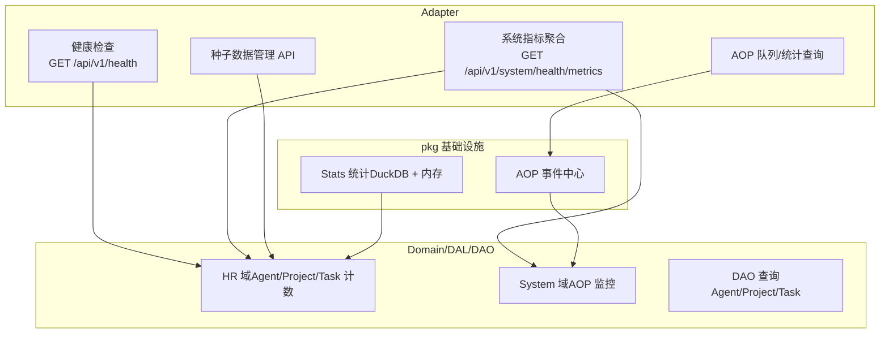
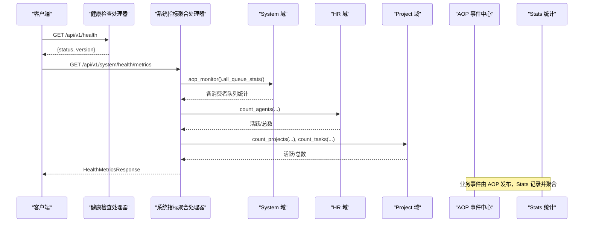
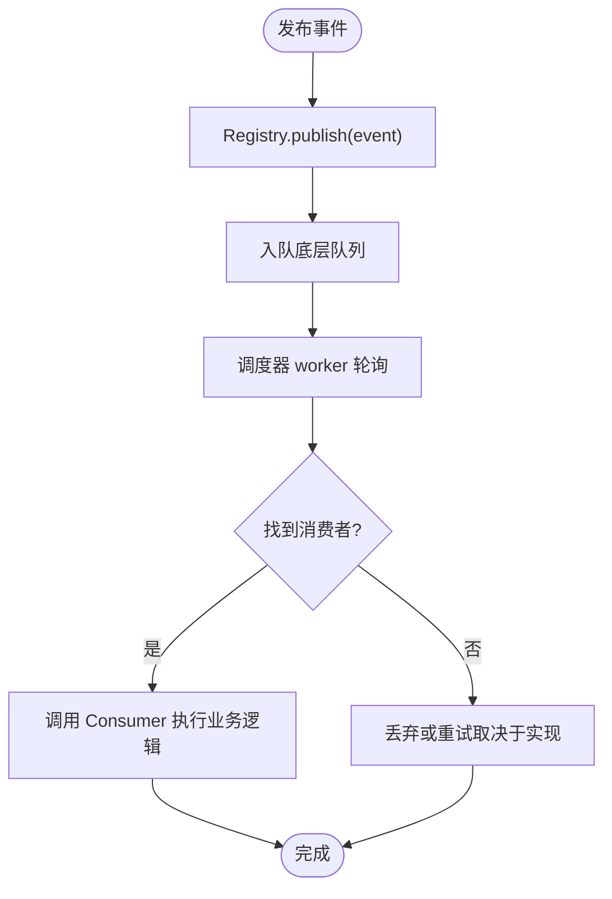
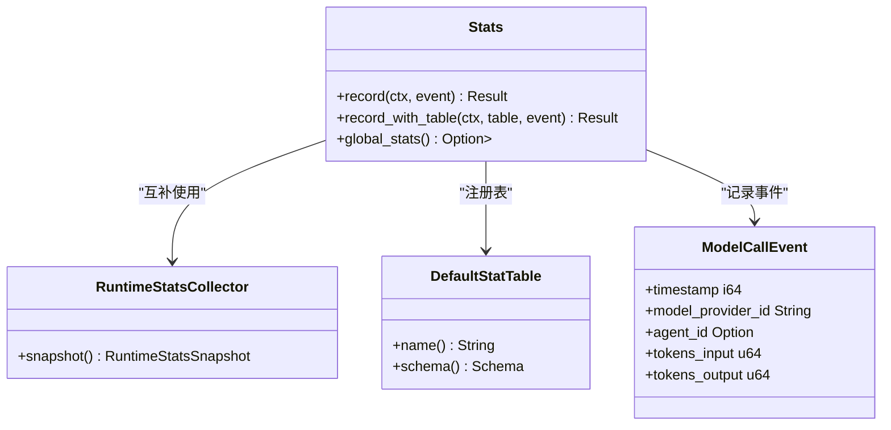
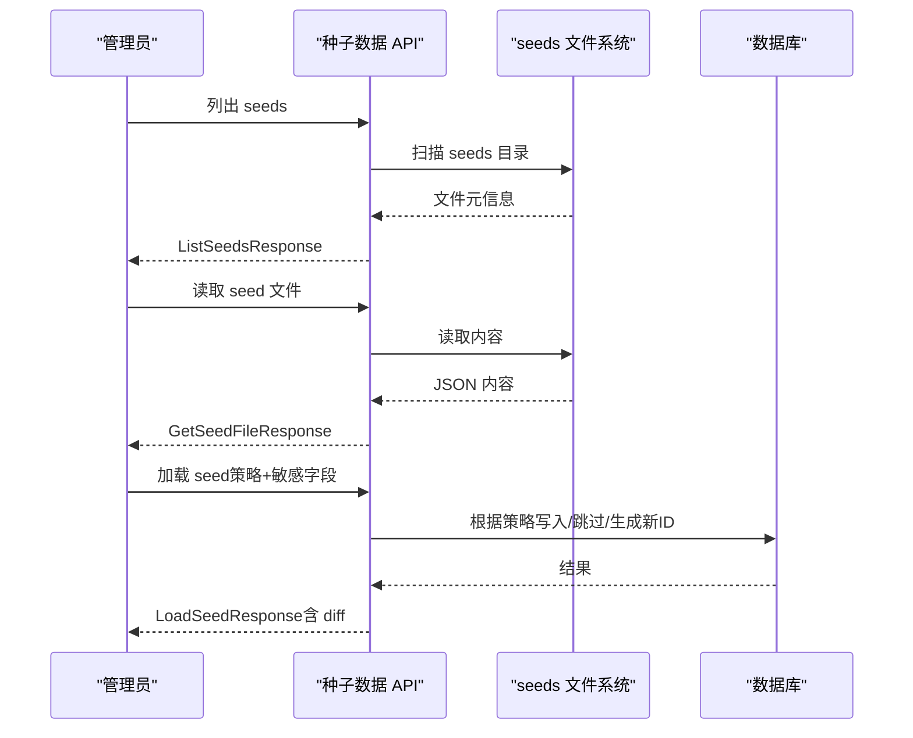
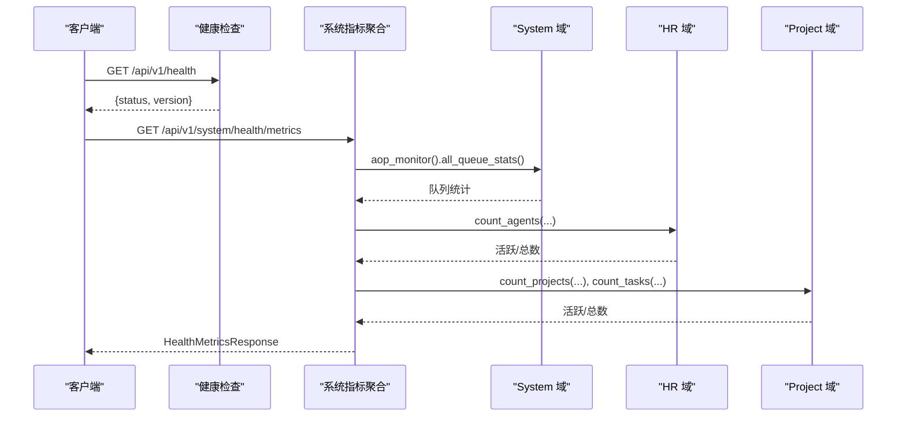
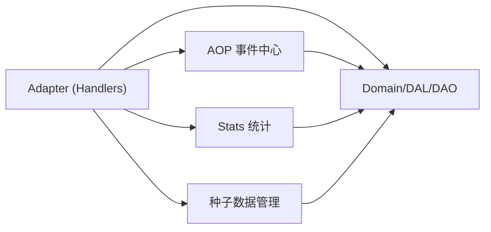

# 系统领域

<cite>
**本文引用的文件**
- [src/pkg/aop/mod.rs](file://src/pkg/aop/mod.rs)
- [common/src/api/system.rs](file://common/src/api/system.rs)
- [common/src/api/seed.rs](file://common/src/api/seed.rs)
- [src/handlers/health.rs](file://src/handlers/health.rs)
- [src/handlers/system/health_metrics.rs](file://src/handlers/system/health_metrics.rs)
- [src/pkg/stats/mod.rs](file://src/pkg/stats/mod.rs)
</cite>

## 目录
1. [简介](#简介)
2. [项目结构](#项目结构)
3. [核心组件](#核心组件)
4. [架构总览](#架构总览)
5. [详细组件分析](#详细组件分析)
6. [依赖关系分析](#依赖关系分析)
7. [性能考量](#性能考量)
8. [故障排查指南](#故障排查指南)
9. [结论](#结论)
10. [附录](#附录)

## 简介
本章节面向“系统领域”，聚焦系统监控、统计收集与种子数据管理三大主题。文档围绕以下目标展开：
- AOP 监控机制：事件生产-消费、队列监控、实时指标聚合与告警规则建议。
- 性能指标收集：基于 Stats 模块的持久化（DuckDB）与内存运行时统计，采集、聚合与查询接口。
- 种子数据管理：定义、版本化、导入策略与默认模板应用。
- 健康检查、配置管理与维护操作：统一健康端点与系统级指标聚合。
- 扩展点与插件机制：AOP 消费者注册、自定义统计表、可插拔存储后端。
- 实战示例：通过代码路径展示监控、统计与初始化的实现模式。

## 项目结构
系统领域相关能力分布在以下层次：
- Adapter（HTTP Handler / AOP Producer）：对外暴露健康检查、系统指标、AOP 队列与统计查询；AOP 生产者发布事件。
- Domain/DAL/DAO：业务实体与数据访问，被 Adapter 调用以聚合指标或执行维护操作。
- pkg 通用层：AOP 框架、Stats 统计、日志、存储等无业务感知的基础设施。

图表来源
- [src/handlers/health.rs:1-16](file://src/handlers/health.rs#L1-L16)
- [src/handlers/system/health_metrics.rs:1-135](file://src/handlers/system/health_metrics.rs#L1-L135)
- [src/pkg/aop/mod.rs:1-61](file://src/pkg/aop/mod.rs#L1-L61)
- [src/pkg/stats/mod.rs:1-175](file://src/pkg/stats/mod.rs#L1-L175)

章节来源
- [src/handlers/health.rs:1-16](file://src/handlers/health.rs#L1-L16)
- [src/handlers/system/health_metrics.rs:1-135](file://src/handlers/system/health_metrics.rs#L1-L135)
- [src/pkg/aop/mod.rs:1-61](file://src/pkg/aop/mod.rs#L1-L61)
- [src/pkg/stats/mod.rs:1-175](file://src/pkg/stats/mod.rs#L1-L175)

## 核心组件
- AOP 事件中心：提供全局 Registry、事件发布、调度器启动与消费者注册能力，负责事件分发与异步消费，不感知业务实体。
- Stats 统计模块：双层实现——DuckDB 持久化（跨重启保留、复杂 SQL 查询）与内存运行时统计（零 DB 依赖、重启重置），提供宏式记录与全局单例访问。
- 系统健康与指标聚合：统一健康端点与系统指标聚合端点，汇总 AOP 队列、Agent/Project/Task 数量与运行时长。
- 种子数据管理：提供列出、读取、保存、加载、Diff、应用默认模板等 API，支持多种导入策略与敏感字段注入。

章节来源
- [src/pkg/aop/mod.rs:1-61](file://src/pkg/aop/mod.rs#L1-L61)
- [src/pkg/stats/mod.rs:1-175](file://src/pkg/stats/mod.rs#L1-L175)
- [common/src/api/system.rs:1-239](file://common/src/api/system.rs#L1-L239)
- [common/src/api/seed.rs:1-163](file://common/src/api/seed.rs#L1-L163)
- [src/handlers/system/health_metrics.rs:1-135](file://src/handlers/system/health_metrics.rs#L1-L135)
- [src/handlers/health.rs:1-16](file://src/handlers/health.rs#L1-L16)

## 架构总览
系统领域的关键交互如下：
- 健康检查：简单返回服务状态与版本。
- 系统指标聚合：从 System 域获取 AOP 队列统计，从 HR/Project 域获取 Agent/Project/Task 计数，计算进程运行时长。
- AOP 监控：通过 AOP 事件中心发布/消费事件，提供队列统计与事件列表查询。
- 统计收集：使用 Stats 模块记录事件，支持持久化与内存快照，提供聚合与时间序列查询。
- 种子数据：通过 API 对 seeds 目录进行 CRUD 与导入，支持 Diff 与默认模板应用。

图表来源
- [src/handlers/health.rs:1-16](file://src/handlers/health.rs#L1-L16)
- [src/handlers/system/health_metrics.rs:1-135](file://src/handlers/system/health_metrics.rs#L1-L135)
- [src/pkg/aop/mod.rs:1-61](file://src/pkg/aop/mod.rs#L1-L61)
- [src/pkg/stats/mod.rs:1-175](file://src/pkg/stats/mod.rs#L1-L175)

## 详细组件分析

### AOP 监控机制
- 设计要点：
  - 事件（Event）为纯数据结构，消费者（Consumer）在业务层实现，注册到全局 Registry。
  - 调度器启动后，后台 worker 轮询队列并消费事件，解耦发布与处理。
  - 提供队列统计与事件列表查询接口，便于运维观察与排障。
- 关键流程：
  - 发布事件：通过全局 Registry 发布，进入底层队列。
  - 消费事件：调度器拉取队列项，调用对应 Consumer 完成业务逻辑。
  - 监控查询：通过 System 域聚合所有消费者的队列统计。

图表来源
- [src/pkg/aop/mod.rs:1-61](file://src/pkg/aop/mod.rs#L1-L61)

章节来源
- [src/pkg/aop/mod.rs:1-61](file://src/pkg/aop/mod.rs#L1-L61)
- [common/src/api/system.rs:55-129](file://common/src/api/system.rs#L55-L129)

### 性能指标收集与查询
- 双层实现：
  - DuckDB 持久化：适合跨重启保留与复杂 SQL 查询。
  - 内存运行时统计：零 DB 依赖，适合 AOP/SSE/Channel 等实时能力。
- 记录方式：
  - 使用 record_event! 宏自动推断表并记录事件，支持显式指定表。
  - 全局 Stats 单例供无 RequestContext 场景（如 AOP 消费者）使用。
- 查询能力：
  - 聚合查询：按维度分组统计。
  - 时间序列：按桶统计调用次数。
  - 分布查询：按 consumer/status/kind 分组。

图表来源
- [src/pkg/stats/mod.rs:1-175](file://src/pkg/stats/mod.rs#L1-L175)

章节来源
- [src/pkg/stats/mod.rs:1-175](file://src/pkg/stats/mod.rs#L1-L175)

### 种子数据管理
- 能力概览：
  - 列出 seeds 目录文件，读取/保存/删除 seed 文件。
  - 加载 seed 文件到数据库，支持 PreserveIds、RegenerateIds、DryRun、SkipExisting 策略。
  - 对比文件与数据库差异（Diff），以及两个文件之间的 Diff。
  - 应用默认模板，注入敏感字段值。
- 版本管理：
  - 文件名作为版本标识，结合 Diff 报告确保变更可追踪。
- 应用策略：
  - DryRun 预演后再实际写入，避免误操作。
  - SkipExisting 仅新建不存在实体，适合增量部署。

图表来源
- [common/src/api/seed.rs:1-163](file://common/src/api/seed.rs#L1-L163)

章节来源
- [common/src/api/seed.rs:1-163](file://common/src/api/seed.rs#L1-L163)

### 系统健康检查与维护操作
- 健康检查：
  - GET /api/v1/health 返回服务状态与版本。
- 系统指标聚合：
  - GET /api/v1/system/health/metrics 聚合 AOP 队列、Agent/Project/Task 数量与运行时长。
- 维护操作：
  - 备份/恢复、任务清理、Cron 触发器管理等（位于 system 子模块）。

图表来源
- [src/handlers/health.rs:1-16](file://src/handlers/health.rs#L1-L16)
- [src/handlers/system/health_metrics.rs:1-135](file://src/handlers/system/health_metrics.rs#L1-L135)

章节来源
- [src/handlers/health.rs:1-16](file://src/handlers/health.rs#L1-L16)
- [src/handlers/system/health_metrics.rs:1-135](file://src/handlers/system/health_metrics.rs#L1-L135)
- [common/src/api/system.rs:1-239](file://common/src/api/system.rs#L1-L239)

## 依赖关系分析
- Adapter 层依赖 Domain/DAL/DAO 获取业务数据与执行维护操作。
- AOP 事件中心独立于业务，仅负责事件流转与调度。
- Stats 统计模块提供记录与查询能力，被业务事件与 AOP 消费者使用。
- 种子数据管理依赖文件系统与数据库，通过 API 暴露管理能力。

图表来源
- [src/handlers/system/health_metrics.rs:1-135](file://src/handlers/system/health_metrics.rs#L1-L135)
- [src/pkg/aop/mod.rs:1-61](file://src/pkg/aop/mod.rs#L1-L61)
- [src/pkg/stats/mod.rs:1-175](file://src/pkg/stats/mod.rs#L1-L175)
- [common/src/api/seed.rs:1-163](file://common/src/api/seed.rs#L1-L163)

章节来源
- [src/handlers/system/health_metrics.rs:1-135](file://src/handlers/system/health_metrics.rs#L1-L135)
- [src/pkg/aop/mod.rs:1-61](file://src/pkg/aop/mod.rs#L1-L61)
- [src/pkg/stats/mod.rs:1-175](file://src/pkg/stats/mod.rs#L1-L175)
- [common/src/api/seed.rs:1-163](file://common/src/api/seed.rs#L1-L163)

## 性能考量
- AOP 队列：关注 pending/in_progress 数量，避免积压导致延迟。
- Stats 持久化：DuckDB 适合复杂查询但需注意写入吞吐；内存版用于高频实时指标。
- 健康指标聚合：合并多域查询，减少前端并发请求；使用 saturating_add 防止溢出。
- 种子数据导入：优先 DryRun 验证，再批量写入；SkipExisting 降低重复成本。

[本节为通用指导，无需具体文件引用]

## 故障排查指南
- AOP 队列积压：
  - 通过系统指标聚合查看 aop_pending/aop_in_progress。
  - 使用 AOP 队列统计与事件列表定位失败事件。
- 统计缺失：
  - 确认 Stats 全局单例已初始化。
  - 检查 record_event! 宏是否正确使用。
- 种子数据导入失败：
  - 使用 Diff 报告比对文件与数据库差异。
  - 调整导入策略（PreserveIds/RegenerateIds/SkipExisting）。

章节来源
- [common/src/api/system.rs:55-129](file://common/src/api/system.rs#L55-L129)
- [src/pkg/stats/mod.rs:152-171](file://src/pkg/stats/mod.rs#L152-L171)
- [common/src/api/seed.rs:70-114](file://common/src/api/seed.rs#L70-L114)

## 结论
系统领域通过 AOP 事件中心、Stats 统计模块与健康指标聚合，构建了完整的监控与可观测性基础。种子数据管理提供了灵活的版本化与迁移能力。遵循四层单向调用与 pkg 无业务感知原则，确保了系统的可扩展性与稳定性。

[本节为总结，无需具体文件引用]

## 附录
- 实际代码示例路径：
  - AOP 发布与调度：[src/pkg/aop/mod.rs:1-61](file://src/pkg/aop/mod.rs#L1-L61)
  - 健康检查端点：[src/handlers/health.rs:1-16](file://src/handlers/health.rs#L1-L16)
  - 系统指标聚合：[src/handlers/system/health_metrics.rs:1-135](file://src/handlers/system/health_metrics.rs#L1-L135)
  - Stats 记录与全局访问：[src/pkg/stats/mod.rs:1-175](file://src/pkg/stats/mod.rs#L1-L175)
  - 种子数据 API：[common/src/api/seed.rs:1-163](file://common/src/api/seed.rs#L1-L163)

[本节为索引，无需具体文件引用]