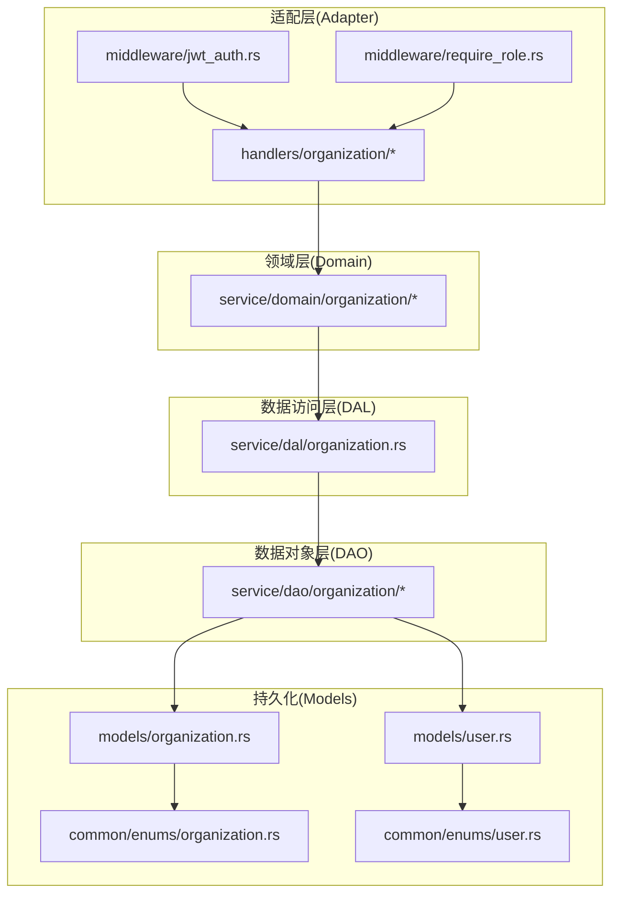
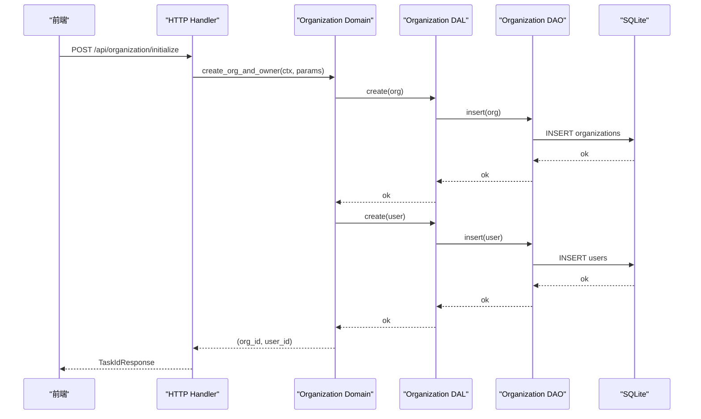
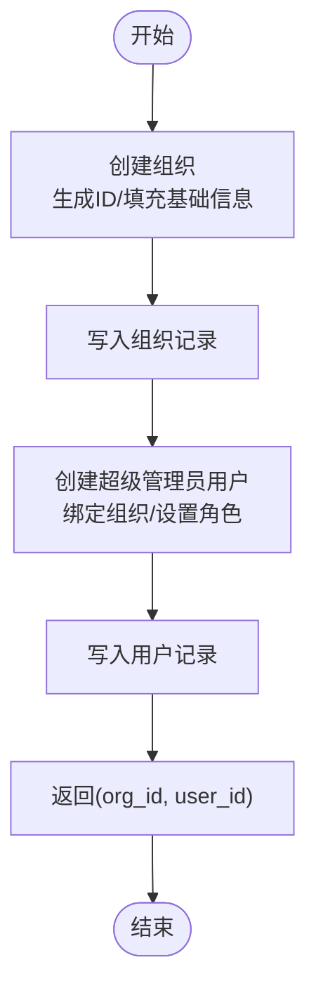
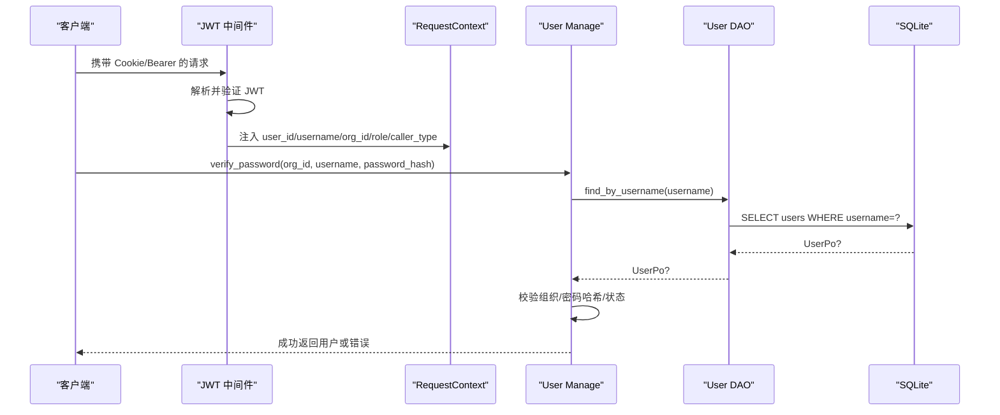
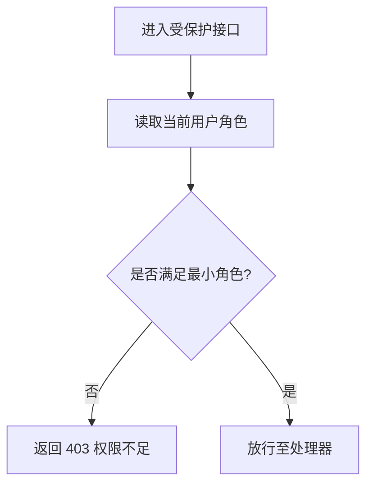
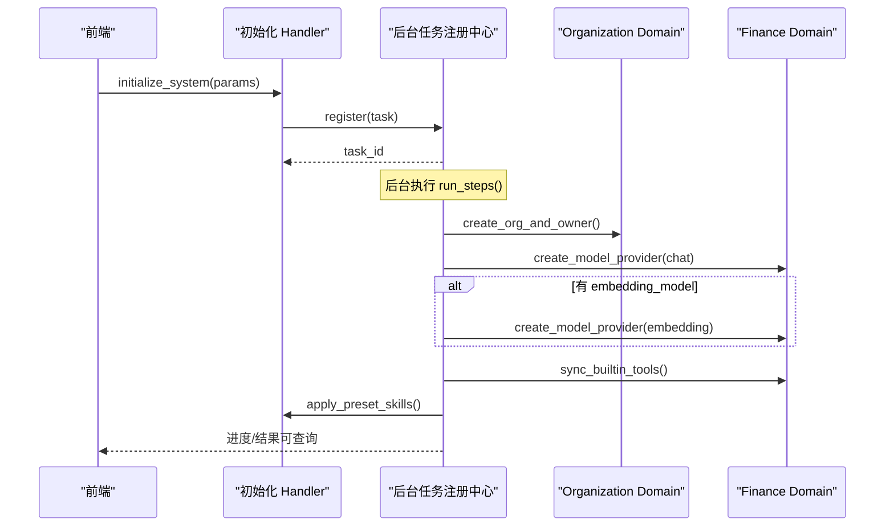
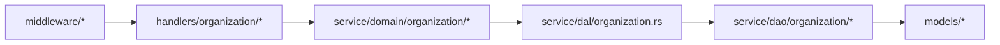

# 组织领域

<cite>
**本文引用的文件**
- [organization_design.md](file://docs/organization_design.md)
- [organization.rs](file://src/models/organization.rs)
- [user.rs](file://src/models/user.rs)
- [organization.rs（枚举）](file://common/src/enums/organization.rs)
- [user.rs（枚举）](file://common/src/enums/user.rs)
- [domain/mod.rs](file://src/service/domain/organization/mod.rs)
- [org.rs](file://src/service/domain/organization/org.rs)
- [user.rs（Domain）](file://src/service/domain/organization/user.rs)
- [organization.rs（DAL）](file://src/service/dal/organization.rs)
- [organization/mod.rs（DAO）](file://src/service/dao/organization/mod.rs)
- [initialize_system.rs](file://src/handlers/organization/initialize_system.rs)
- [jwt_auth.rs](file://src/middleware/jwt_auth.rs)
- [require_role.rs](file://src/middleware/require_role.rs)
</cite>

## 目录
1. [简介](#简介)
2. [项目结构](#项目结构)
3. [核心组件](#核心组件)
4. [架构总览](#架构总览)
5. [详细组件分析](#详细组件分析)
6. [依赖关系分析](#依赖关系分析)
7. [性能考量](#性能考量)
8. [故障排查指南](#故障排查指南)
9. [结论](#结论)
10. [附录：API与数据模型速查](#附录api与数据模型速查)

## 简介
本文件聚焦“组织领域”的领域模型设计与实现，覆盖组织的创建、配置、成员管理与权限控制；用户的注册、认证、授权与角色管理；组织层级与资源共享机制；用户与组织的关联、访问控制与数据隔离；多租户架构支持、安全策略与数据隐私保护。文档同时给出实际代码路径示例，帮助读者快速定位实现位置。

## 项目结构
组织领域遵循严格四层单向调用：Adapter → Domain → DAL → DAO → Models(SQL)。Handler 负责协议解析、鉴权与编排；Domain 聚合多个 DAL 完成业务逻辑；DAL 封装 DAO 提供业务级数据操作；DAO 仅做数据访问。PO 仅在 DAO/DAL 内部使用，不暴露到 Domain 及以上层。

图表来源
- [initialize_system.rs:1-284](file://src/handlers/organization/initialize_system.rs#L1-L284)
- [domain/mod.rs:1-200](file://src/service/domain/organization/mod.rs#L1-L200)
- [organization.rs（DAL）:1-126](file://src/service/dal/organization.rs#L1-L126)
- [organization/mod.rs（DAO）:1-40](file://src/service/dao/organization/mod.rs#L1-L40)
- [organization.rs:1-62](file://src/models/organization.rs#L1-L62)
- [user.rs:1-98](file://src/models/user.rs#L1-L98)
- [organization.rs（枚举）:1-101](file://common/src/enums/organization.rs#L1-L101)
- [user.rs（枚举）:1-212](file://common/src/enums/user.rs#L1-L212)

章节来源
- [organization_design.md:1-218](file://docs/organization_design.md#L1-L218)

## 核心组件
- 组织模型与状态
  - 组织 PO：包含 id、name、description、base_url、status、scope、审计字段与时间戳。
  - 组织状态：Active/Disabled；组织范围：Local/Remote（用于多节点网络扩展）。
- 用户模型与角色
  - 用户 PO：包含 id、organization_id、username、display_name、email、password_hash、role、status、审计字段与时间戳。
  - 用户角色：SuperAdmin > Admin > Member，具备并查集继承语义，支持 has_permission(parent-chain) 校验。
  - 用户状态：Active/Disabled。
- 领域服务
  - OrganizationManage：检查初始化、创建组织+Owner、CRUD、综合查询与计数。
  - UserManage：按用户名查找、综合分页查询、按组织查询、创建/更新/删除、存在性检查、计数、密码验证、按 ID 获取。
- 数据访问
  - OrganizationDal：对 OrganizationDao 的统一封装，提供 is_initialized/get_by_id/create/query/list_all/update/delete/count。
  - OrganizationDao：insert/find_by_id/query/find_all/update/delete/count_all/count。
- 认证与授权
  - JWT 中间件：Cookie/Bearer 双模式提取 token，验证后将 user_id、username、organization_id、role、caller_type 注入请求头，供后续 RequestContext 使用。
  - 角色中间件：基于 UserRole::has_permission 进行最小权限校验。

章节来源
- [organization.rs:1-62](file://src/models/organization.rs#L1-L62)
- [user.rs:1-98](file://src/models/user.rs#L1-L98)
- [organization.rs（枚举）:1-101](file://common/src/enums/organization.rs#L1-L101)
- [user.rs（枚举）:1-212](file://common/src/enums/user.rs#L1-L212)
- [domain/mod.rs:1-200](file://src/service/domain/organization/mod.rs#L1-L200)
- [organization.rs（DAL）:1-126](file://src/service/dal/organization.rs#L1-L126)
- [organization/mod.rs（DAO）:1-40](file://src/service/dao/organization/mod.rs#L1-L40)
- [jwt_auth.rs:1-156](file://src/middleware/jwt_auth.rs#L1-L156)
- [require_role.rs:1-39](file://src/middleware/require_role.rs#L1-L39)

## 架构总览
组织领域采用“单组织 + 多资源”的多租户思路：所有实体通过 organization_id 进行数据隔离；JWT 中携带 organization_id，RequestContext 贯穿全链路，确保跨层上下文一致。系统初始化时创建首个组织与超级管理员，并可选配置聊天/向量模型提供者，随后同步内置工具与预置技能。

图表来源
- [initialize_system.rs:134-224](file://src/handlers/organization/initialize_system.rs#L134-L224)
- [org.rs:53-90](file://src/service/domain/organization/org.rs#L53-L90)
- [organization.rs（DAL）:93-95](file://src/service/dal/organization.rs#L93-L95)
- [organization/mod.rs（DAO）:14-33](file://src/service/dao/organization/mod.rs#L14-L33)

## 详细组件分析

### 组织模型与生命周期
- 组织创建
  - 生成唯一 org_id，构造 OrganizationPo，调用 DAL/DAO 写入。
  - 同时创建超级管理员用户，绑定 organization_id，角色为 SuperAdmin。
- 组织查询与统计
  - 支持按条件 query 与 count，list_all 作为默认空条件的便捷方法。
- 组织更新与软删除
  - update 修改基本信息；delete 执行软删除（由 DAO 实现保证）。

图表来源
- [org.rs:53-90](file://src/service/domain/organization/org.rs#L53-L90)
- [organization.rs（DAL）:93-95](file://src/service/dal/organization.rs#L93-L95)
- [organization/mod.rs（DAO）:14-33](file://src/service/dao/organization/mod.rs#L14-L33)

章节来源
- [org.rs:1-134](file://src/service/domain/organization/org.rs#L1-L134)
- [organization.rs（DAL）:1-126](file://src/service/dal/organization.rs#L1-L126)
- [organization/mod.rs（DAO）:1-40](file://src/service/dao/organization/mod.rs#L1-L40)

### 用户模型与认证流程
- 用户创建与存储
  - 新用户需指定 organization_id、username、display_name、email、password_hash、role。
- 登录验证
  - 根据 username 查找用户；校验所属组织是否匹配；校验密码哈希；检查用户状态是否为 Active。
- 认证中间件
  - 从 Cookie 或 Authorization 头提取 JWT；验证后将 user_id、username、organization_id、role、caller_type 注入请求头，供 RequestContext 使用。

图表来源
- [jwt_auth.rs:36-87](file://src/middleware/jwt_auth.rs#L36-L87)
- [user.rs（Domain）:85-117](file://src/service/domain/organization/user.rs#L85-L117)

章节来源
- [user.rs（Domain）:1-124](file://src/service/domain/organization/user.rs#L1-L124)
- [jwt_auth.rs:1-156](file://src/middleware/jwt_auth.rs#L1-L156)

### 权限控制与角色继承
- 角色体系
  - SuperAdmin > Admin > Member，上级拥有下级全部权限。
- 权限判定
  - 使用 UserRole::has_permission(user_role, min_role) 沿祖先链判断是否满足最低角色要求。
- 路由级权限
  - require_role_middleware 在路由前拦截，不足则返回 403。

图表来源
- [require_role.rs:20-38](file://src/middleware/require_role.rs#L20-L38)
- [user.rs（枚举）:54-99](file://common/src/enums/user.rs#L54-L99)

章节来源
- [require_role.rs:1-39](file://src/middleware/require_role.rs#L1-L39)
- [user.rs（枚举）:1-212](file://common/src/enums/user.rs#L1-L212)

### 多租户与数据隔离
- 多租户边界
  - 以 organization_id 作为租户标识，所有用户与资源均归属特定组织。
- 上下文传递
  - JWT 中的 organization_id 经中间件注入请求头，RequestContext 贯穿全链路，确保 DAL/DAO 查询自动带租户过滤。
- 资源共享
  - 同一组织内成员共享该组织下的资源；不同组织间数据完全隔离。

章节来源
- [jwt_auth.rs:56-84](file://src/middleware/jwt_auth.rs#L56-L84)
- [user.rs:13-26](file://src/models/user.rs#L13-L26)
- [organization.rs:13-27](file://src/models/organization.rs#L13-L27)

### 系统初始化与后台任务
- 初始化步骤
  - 创建组织 + Owner；创建聊天模型提供者；可选创建向量模型提供者；同步内置工具；导入预置技能。
- 异步任务
  - 将初始化过程包装为后台任务，支持进度查询与结果回传。

图表来源
- [initialize_system.rs:114-224](file://src/handlers/organization/initialize_system.rs#L114-L224)

章节来源
- [initialize_system.rs:1-284](file://src/handlers/organization/initialize_system.rs#L1-L284)

## 依赖关系分析
- 单向依赖
  - Handler → Domain → DAL → DAO → Models
- 关键耦合点
  - Domain 组合 OrganizationDal 与 UserDal，完成跨领域编排（如初始化时同时创建组织与用户）。
  - 认证与授权中间件位于最外层，先于 RequestContext 构建，确保上下文完整。
- 外部依赖
  - sqlx（SQLite）、JWT、后台任务注册中心等通用能力位于 pkg 层，无业务感知。

图表来源
- [domain/mod.rs:1-200](file://src/service/domain/organization/mod.rs#L1-L200)
- [organization.rs（DAL）:1-126](file://src/service/dal/organization.rs#L1-L126)
- [organization/mod.rs（DAO）:1-40](file://src/service/dao/organization/mod.rs#L1-L40)
- [jwt_auth.rs:1-156](file://src/middleware/jwt_auth.rs#L1-L156)
- [require_role.rs:1-39](file://src/middleware/require_role.rs#L1-L39)

章节来源
- [CODE_WIKI.md:130-161](file://docs/CODE_WIKI.md#L130-L161)

## 性能考量
- 查询优化
  - 使用 OrganizationQuery/UserQuery 的组合条件与 count 透传，避免不必要的数据加载。
- 索引与搜索
  - 向量搜索与 FTS5 作为附加索引层，按需触发非全量索引，降低 Embedding 成本。
- 并发与异步
  - 初始化等耗时操作通过后台任务异步执行，前端轮询进度，提升用户体验。
- 缓存与降级
  - 向量后端支持多实现降级（LanceDB/HNSW/InMemory/SqliteVss），保障可用性。

[本节为通用指导，无需具体文件引用]

## 故障排查指南
- 未认证/过期
  - JWT 中间件失败时，浏览器请求重定向到登录页，API 请求返回 401 JSON。
- 权限不足
  - 角色中间件检测到用户角色低于最小要求时返回 403。
- 登录失败
  - 用户名不存在、组织不匹配、密码哈希不一致或用户被禁用，均会返回错误。
- 初始化失败
  - 后台任务记录错误信息与步骤进度，可通过进度接口查看。

章节来源
- [jwt_auth.rs:139-156](file://src/middleware/jwt_auth.rs#L139-L156)
- [require_role.rs:20-38](file://src/middleware/require_role.rs#L20-L38)
- [user.rs（Domain）:85-117](file://src/service/domain/organization/user.rs#L85-L117)
- [initialize_system.rs:251-284](file://src/handlers/organization/initialize_system.rs#L251-L284)

## 结论
组织领域以严格的分层架构与清晰的职责边界实现了多租户的组织与用户管理。通过 JWT 与角色中间件完成认证与授权，结合 RequestContext 实现跨层上下文传递与数据隔离。系统初始化流程将组织、用户与模型提供者、工具、技能等生态要素一次性装配，便于快速上线。未来可在 DAL/DAO 层继续扩展组织层级、继承与资源共享策略，以满足更复杂的治理需求。

## 附录：API与数据模型速查
- 初始化相关
  - 检查是否已初始化：POST /api/organization/initialize（返回 task_id）
  - 查询初始化进度：GET /api/organization/init-progress
- 组织管理
  - 获取组织信息：GET /api/organization/{org_id}
  - 获取组织列表：GET /api/organization/list
  - 更新组织信息：PUT /api/organization/update
  - 删除组织：DELETE /api/organization/{org_id}
- 用户管理
  - 创建用户：POST /api/organization/user
  - 按用户名查询（登录用）：GET /api/organization/user/{username}
  - 按组织查询用户列表：GET /api/organization/{org_id}/users
  - 更新用户信息：PUT /api/organization/user/update
  - 删除用户：DELETE /api/organization/user/{user_id}

章节来源
- [organization_design.md:73-102](file://docs/organization_design.md#L73-L102)