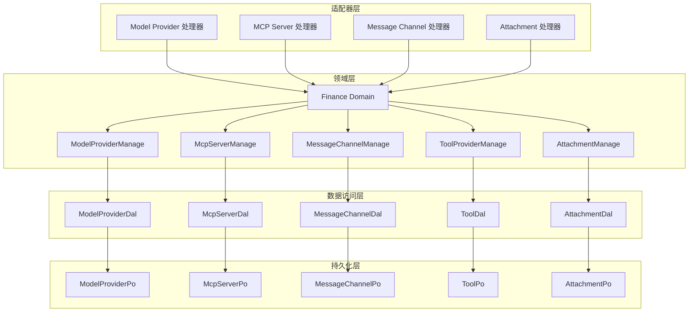
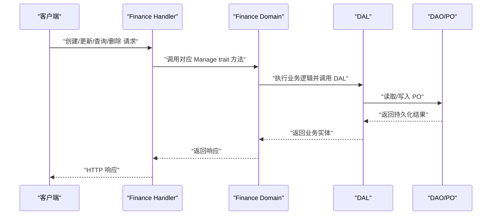
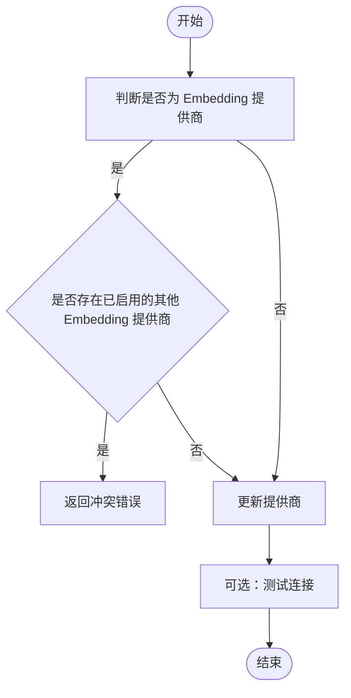
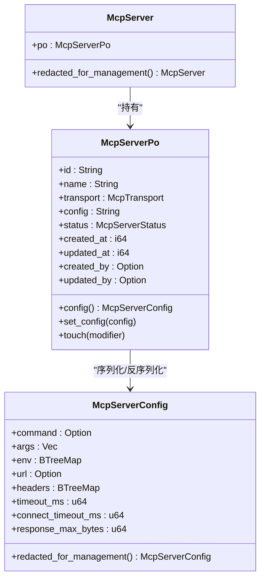
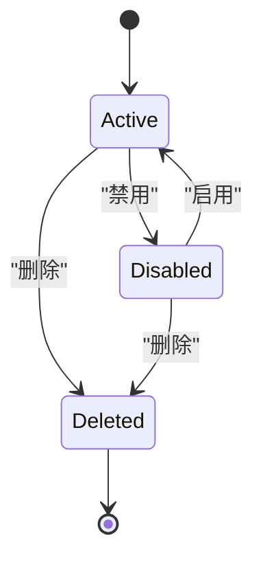
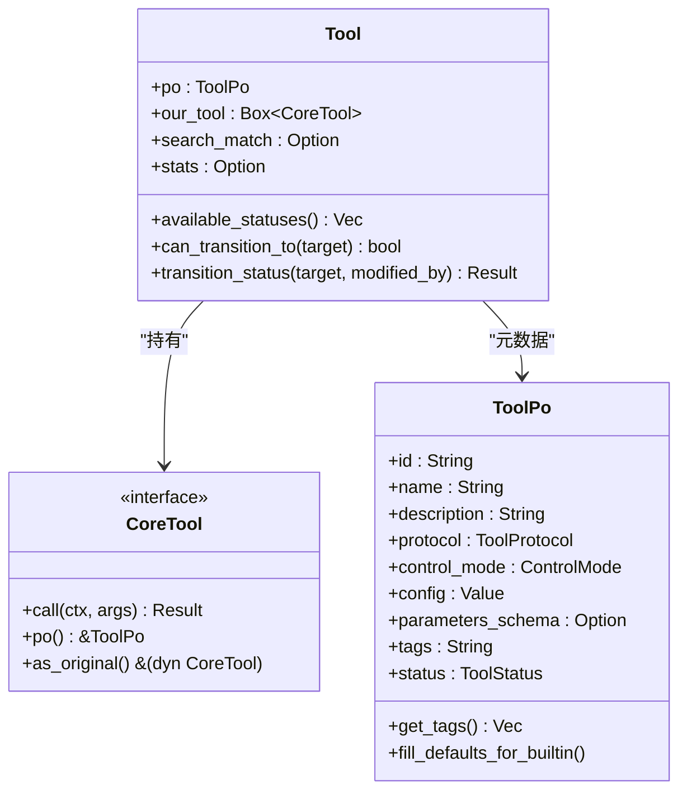
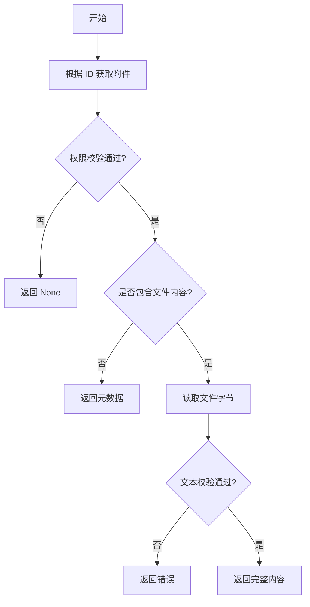
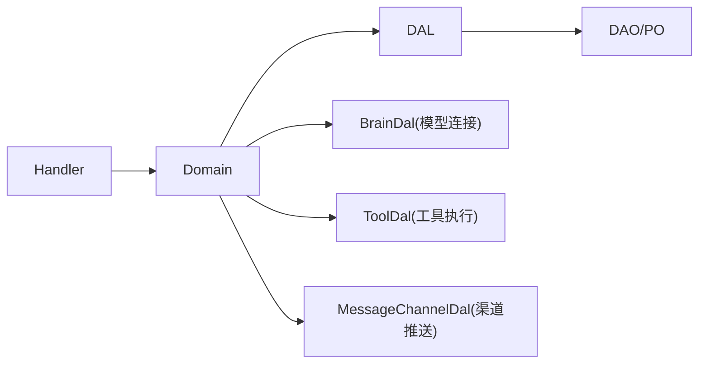

# 财务领域

<cite>
**本文引用的文件**
- [src/models/model_provider.rs](file://src/models/model_provider.rs)
- [src/models/mcp_server.rs](file://src/models/mcp_server.rs)
- [src/models/message_channel.rs](file://src/models/message_channel.rs)
- [src/models/attachment.rs](file://src/models/attachment.rs)
- [src/models/tool.rs](file://src/models/tool.rs)
- [src/service/domain/finance/mod.rs](file://src/service/domain/finance/mod.rs)
- [src/service/domain/finance/model_provider.rs](file://src/service/domain/finance/model_provider.rs)
- [src/service/domain/finance/mcp_server.rs](file://src/service/domain/finance/mcp_server.rs)
- [src/service/domain/finance/message_channel.rs](file://src/service/domain/finance/message_channel.rs)
- [src/service/domain/finance/tool_provider.rs](file://src/service/domain/finance/tool_provider.rs)
- [src/service/domain/finance/attachment.rs](file://src/service/domain/finance/attachment.rs)
- [src/handlers/finance/model_provider/mod.rs](file://src/handlers/finance/model_provider/mod.rs)
- [src/handlers/finance/mcp_server/mod.rs](file://src/handlers/finance/mcp_server/mod.rs)
- [src/handlers/finance/message_channel/mod.rs](file://src/handlers/finance/message_channel/mod.rs)
- [src/handlers/finance/attachment/mod.rs](file://src/handlers/finance/attachment/mod.rs)
</cite>

## 目录
1. [简介](#简介)
2. [项目结构](#项目结构)
3. [核心组件](#核心组件)
4. [架构总览](#架构总览)
5. [详细组件分析](#详细组件分析)
6. [依赖关系分析](#依赖关系分析)
7. [性能考虑](#性能考虑)
8. [故障排查指南](#故障排查指南)
9. [结论](#结论)
10. [附录](#附录)

## 简介
本文件围绕财务领域的领域模型与实现，系统化阐述以下能力：
- 模型提供商的配置、连接测试与调用代理
- MCP 服务器的注册、发现与服务治理
- 工具提供商的统一抽象、注册机制与执行调度
- 消息渠道的多协议支持与消息路由
- 附件的上传、存储、版本管理与访问控制
- 第三方服务集成、缓存策略与错误处理机制
- 实际代码示例路径，展示外部服务集成与资源管理实现模式

本项目遵循严格四层单向调用：Adapter（HTTP Handler / 公开回调 / AOP Producer）→ Domain → DAL → DAO，禁止跨层调用与同层互调；Domain 输入为 Command/Query，输出为业务实体与内部事件；DAO/DAL 使用 PO，对外接口统一使用业务实体。

## 项目结构
财务领域由 Finance Domain 聚合多个子域管理能力，并通过 HTTP Handler 暴露 API。各子域在 Domain 层定义 trait 与实现，DAL 负责数据访问，DAO 负责持久化细节。

图表来源
- [src/handlers/finance/model_provider/mod.rs:1-25](file://src/handlers/finance/model_provider/mod.rs#L1-L25)
- [src/handlers/finance/mcp_server/mod.rs:1-24](file://src/handlers/finance/mcp_server/mod.rs#L1-L24)
- [src/handlers/finance/message_channel/mod.rs:1-22](file://src/handlers/finance/message_channel/mod.rs#L1-L22)
- [src/handlers/finance/attachment/mod.rs:1-21](file://src/handlers/finance/attachment/mod.rs#L1-L21)
- [src/service/domain/finance/mod.rs:92-115](file://src/service/domain/finance/mod.rs#L92-L115)

章节来源
- [src/service/domain/finance/mod.rs:1-115](file://src/service/domain/finance/mod.rs#L1-L115)

## 核心组件
- 模型提供商：配置 JSON、状态、能力枚举、上下文增强、统计装配
- MCP 服务器：传输类型、状态、配置脱敏、查询条件
- 消息渠道：多协议配置、状态机迁移、范围与推送记录
- 工具提供商：统一 CoreTool 抽象、执行结果、向量检索支持
- 附件：上传、文本内容读写、安全校验、版本乐观锁

章节来源
- [src/models/model_provider.rs:9-68](file://src/models/model_provider.rs#L9-L68)
- [src/models/mcp_server.rs:17-123](file://src/models/mcp_server.rs#L17-L123)
- [src/models/message_channel.rs:19-113](file://src/models/message_channel.rs#L19-L113)
- [src/models/tool.rs:16-106](file://src/models/tool.rs#L16-L106)
- [src/models/attachment.rs:9-117](file://src/models/attachment.rs#L9-L117)

## 架构总览
财务领域通过 Finance Domain 聚合各子域管理能力，Handler 仅做参数解析与调用转发，Domain 编排业务规则并委托 DAL，DAL 再调用 DAO 完成持久化。

图表来源
- [src/service/domain/finance/mod.rs:92-115](file://src/service/domain/finance/mod.rs#L92-L115)
- [src/service/domain/finance/model_provider.rs:13-149](file://src/service/domain/finance/model_provider.rs#L13-L149)
- [src/service/domain/finance/mcp_server.rs:13-81](file://src/service/domain/finance/mcp_server.rs#L13-L81)
- [src/service/domain/finance/message_channel.rs:13-73](file://src/service/domain/finance/message_channel.rs#L13-L73)
- [src/service/domain/finance/tool_provider.rs:13-166](file://src/service/domain/finance/tool_provider.rs#L13-L166)
- [src/service/domain/finance/attachment.rs:17-137](file://src/service/domain/finance/attachment.rs#L17-L137)

## 详细组件分析

### 模型提供商（Model Provider）
- 领域模型
  - ModelProviderPo：包含名称、提供商类型、模型名、能力、API Key、Base URL、描述、JSON 配置、状态、审计字段
  - ModelProviderConfig：上下文窗口、推荐长度、最大输出、温度、RPM/TPM 限制、每日配额
  - ModelProvider：业务实体，可选装配统计信息，提供 ID/名称/模型名/能力等访问器
- 配置与连接
  - 更新时若为 Embedding 提供商且启用，会检查是否已有其他启用的 Embedding 提供商，避免冲突
  - 切换 Embedding 提供商为原子操作：禁用旧 → 启用新，后续由调用方触发向量索引重建
  - 连接测试通过 BrainDal 执行，将上下文增强后调用底层连接测试
- 调用代理
  - 通过 RequestContext 注入 model_provider_id 与 model_name，便于统计与追踪
- 错误处理
  - 重复启用不同 Embedding 提供商返回特定错误码与字段提示

图表来源
- [src/service/domain/finance/model_provider.rs:54-101](file://src/service/domain/finance/model_provider.rs#L54-L101)
- [src/models/model_provider.rs:9-68](file://src/models/model_provider.rs#L9-L68)

章节来源
- [src/models/model_provider.rs:9-68](file://src/models/model_provider.rs#L9-L68)
- [src/service/domain/finance/model_provider.rs:13-149](file://src/service/domain/finance/model_provider.rs#L13-L149)
- [src/handlers/finance/model_provider/mod.rs:1-25](file://src/handlers/finance/model_provider/mod.rs#L1-L25)

### MCP 服务器（MCP Server）
- 领域模型
  - McpTransport：stdio 与 streamable_http 两种传输
  - McpServerStatus：已删除、启用、禁用
  - McpServerConfig：命令/参数/环境变量、URL/Headers、超时、响应体大小限制
  - McpServer/McpServerPo：业务实体与持久化对象，支持配置脱敏
- 注册与发现
  - 创建/更新/查询/列出/删除，更新时合并保留敏感字段（env/headers/url），避免覆盖
  - 列表与详情返回时进行配置脱敏，防止泄露
- 服务治理
  - 状态更新接口用于启用/禁用，删除为软删除
  - 查询条件支持按 ID、名称、传输类型、状态过滤与分页

图表来源
- [src/models/mcp_server.rs:17-123](file://src/models/mcp_server.rs#L17-L123)
- [src/models/mcp_server.rs:224-322](file://src/models/mcp_server.rs#L224-L322)

章节来源
- [src/models/mcp_server.rs:17-123](file://src/models/mcp_server.rs#L17-L123)
- [src/models/mcp_server.rs:224-322](file://src/models/mcp_server.rs#L224-L322)
- [src/service/domain/finance/mcp_server.rs:13-81](file://src/service/domain/finance/mcp_server.rs#L13-L81)
- [src/handlers/finance/mcp_server/mod.rs:1-24](file://src/handlers/finance/mcp_server/mod.rs#L1-L24)

### 消息渠道（Message Channel）
- 领域模型
  - MessageChannelPo：组织隔离、用户绑定、Agent 绑定、渠道类型、名称、Webhook、Token/Secret、扩展配置、状态、项目范围、推送记录
  - ChannelConfig：飞书、微信、邮件、Slack、通用 Webhook 等多协议配置
  - MessageChannel：业务实体，提供状态迁移与可用目标状态判断
- 多协议支持与路由
  - 支持多种渠道类型，扩展配置以 JSON 存储，便于新增协议
  - 支持为 Agent 绑定专用渠道或用户全局默认渠道
  - 推送成功时间与错误信息记录，便于诊断
- 状态机
  - Active ↔ Disabled 可切换，Deleted 为终态不可恢复
  - can_transition_to 与 transition_status 保证状态迁移合法性

图表来源
- [src/models/message_channel.rs:67-113](file://src/models/message_channel.rs#L67-L113)

章节来源
- [src/models/message_channel.rs:19-113](file://src/models/message_channel.rs#L19-L113)
- [src/models/message_channel.rs:115-255](file://src/models/message_channel.rs#L115-L255)
- [src/service/domain/finance/message_channel.rs:13-73](file://src/service/domain/finance/message_channel.rs#L13-L73)
- [src/handlers/finance/message_channel/mod.rs:1-22](file://src/handlers/finance/message_channel/mod.rs#L1-L22)

### 工具提供商（Tool Provider）
- 统一抽象
  - CoreTool trait：call(ctx, args) 执行、po() 获取持久化对象、as_original() 装饰器解包
  - ToolExecutionResult：业务结果与调用追踪引用
  - Tool：包含 ToolPo 与 Box<dyn CoreTool>，支持搜索匹配与统计
- 注册机制
  - 内置工具同步到 DB，确保系统初始化包含所有内置工具
  - HTTP/MCP 动态工具的运行时执行链路通过 ToolCallDao 组装可执行工具
- 执行调度
  - 工具状态受控：Enabled/Disabled/Stale，Stale 仅由 MCP 同步恢复
  - 绑定/解绑工具给 Agent，internal 标签工具不可绑定给 Agent
  - 混合搜索：向量 + 关键词，支持 Agent 思考时选择工具

图表来源
- [src/models/tool.rs:16-106](file://src/models/tool.rs#L16-L106)
- [src/models/tool.rs:204-283](file://src/models/tool.rs#L204-L283)

章节来源
- [src/models/tool.rs:16-106](file://src/models/tool.rs#L16-L106)
- [src/models/tool.rs:204-283](file://src/models/tool.rs#L204-L283)
- [src/service/domain/finance/tool_provider.rs:13-166](file://src/service/domain/finance/tool_provider.rs#L13-L166)

### 附件（Attachment）
- 领域模型
  - AttachmentPo：原始文件名、存储文件名、相对路径、MIME、文件类型、大小、用途、状态、归属用户、审计字段
  - Attachment：业务实体，附带按需读取的文件内容
  - TextAttachmentCreate/TextContentUpdate：文本创建与全量替换命令
- 上传、存储与版本管理
  - 创建上传资产与小型文本附件，文本内容限制与 MIME 校验
  - 读取文本内容时进行 UTF-8 校验与大小限制
  - 更新文本内容支持乐观锁（expected_updated_at），冲突时返回 Conflict
- 访问控制
  - 获取附件时校验 root_user_id 与当前用户一致，越权返回 None
  - 文本读取需满足文本类型与扩展名白名单

图表来源
- [src/service/domain/finance/attachment.rs:41-86](file://src/service/domain/finance/attachment.rs#L41-L86)
- [src/service/domain/finance/attachment.rs:88-124](file://src/service/domain/finance/attachment.rs#L88-L124)
- [src/models/attachment.rs:9-117](file://src/models/attachment.rs#L9-L117)

章节来源
- [src/models/attachment.rs:9-117](file://src/models/attachment.rs#L9-L117)
- [src/service/domain/finance/attachment.rs:17-137](file://src/service/domain/finance/attachment.rs#L17-L137)
- [src/handlers/finance/attachment/mod.rs:1-21](file://src/handlers/finance/attachment/mod.rs#L1-L21)

## 依赖关系分析
- Handler 到 Domain：每个财务子域的 Handler 模块仅暴露处理器函数，调用 Finance Domain 对应 Manage trait
- Domain 到 DAL：Finance DomainImpl 聚合各子域 Dal，方法直接委托 DAL
- DAL 到 DAO/PO：DAL 封装 DAO 调用，PO 仅在 DAL/DAO 内部使用，Domain 不感知 PO
- 外部集成：
  - Model Provider 连接测试通过 BrainDal
  - Tool 执行通过 ToolDal 与工具注册表（如 http/shell/fs mcp）
  - Message Channel 推送通过 MessageChannelDal 与具体渠道实现

图表来源
- [src/service/domain/finance/mod.rs:461-522](file://src/service/domain/finance/mod.rs#L461-L522)
- [src/service/domain/finance/model_provider.rs:93-101](file://src/service/domain/finance/model_provider.rs#L93-L101)
- [src/service/domain/finance/tool_provider.rs:57-66](file://src/service/domain/finance/tool_provider.rs#L57-L66)
- [src/service/domain/finance/message_channel.rs:63-71](file://src/service/domain/finance/message_channel.rs#L63-L71)

章节来源
- [src/service/domain/finance/mod.rs:461-522](file://src/service/domain/finance/mod.rs#L461-L522)

## 性能考虑
- 向量搜索：ToolPo 与 Tool 实现 Vectorizable，集合名为 tools，支持 LanceDB/HNSW/InMemory/SqliteVss 多后端降级
- 全文搜索：FTS5 + trigram 分词器，提升查询效率
- 配置脱敏：MCP 服务器配置在管理面返回时进行脱敏，减少敏感数据传输
- 文本附件：限制文本大小与 MIME 类型，避免大对象与非法内容影响性能与安全
- 状态机：MessageChannel 与 Tool 的状态迁移在领域层集中校验，减少无效数据库操作

[本节为通用指导，不直接分析具体文件]

## 故障排查指南
- 模型提供商
  - 重复启用不同 Embedding 提供商：检查当前启用的 Embedding 提供商，避免冲突
  - 连接测试失败：确认 Base URL、API Key、网络连通性与超时配置
- MCP 服务器
  - 配置更新丢失敏感值：确认更新时 env/headers/url 是否被标记为脱敏占位符，Domain 会自动合并保留
  - 状态异常：检查状态更新接口是否正确设置 Enabled/Disabled
- 消息渠道
  - 状态迁移非法：检查 available_statuses 与 can_transition_to，确保从当前状态切换到目标状态合法
  - 推送失败：查看 last_error 与 last_pushed_at，定位渠道配置或网络问题
- 工具提供商
  - 绑定 internal 工具失败：internal 标签工具不可绑定给 Agent，需移除标签或使用其他工具
  - MCP 工具控制模式错误：MCP 工具仅支持 Manual 控制模式
- 附件
  - 文本内容非 UTF-8：检查文件编码与 MIME 类型，确保为文本类文件
  - 并发更新冲突：使用 expected_updated_at 进行乐观锁，冲突时刷新重试

章节来源
- [src/service/domain/finance/model_provider.rs:54-101](file://src/service/domain/finance/model_provider.rs#L54-L101)
- [src/service/domain/finance/mcp_server.rs:53-65](file://src/service/domain/finance/mcp_server.rs#L53-L65)
- [src/models/message_channel.rs:67-113](file://src/models/message_channel.rs#L67-L113)
- [src/service/domain/finance/tool_provider.rs:77-101](file://src/service/domain/finance/tool_provider.rs#L77-L101)
- [src/service/domain/finance/attachment.rs:88-124](file://src/service/domain/finance/attachment.rs#L88-L124)

## 结论
财务领域通过清晰的领域模型与分层架构，实现了模型提供商、MCP 服务器、工具提供商、消息渠道与附件的统一管理。Domain 层承担业务规则编排，DAL 层封装数据访问，Handler 层仅负责适配。该设计确保了可扩展性、安全性与可维护性，并为第三方服务集成、缓存策略与错误处理提供了坚实基础。

[本节为总结，不直接分析具体文件]

## 附录
- 实际代码示例路径
  - 模型提供商配置与连接测试：[src/service/domain/finance/model_provider.rs:54-101](file://src/service/domain/finance/model_provider.rs#L54-L101)
  - MCP 服务器注册与配置脱敏：[src/service/domain/finance/mcp_server.rs:13-81](file://src/service/domain/finance/mcp_server.rs#L13-L81)
  - 消息渠道状态迁移与测试：[src/service/domain/finance/message_channel.rs:13-73](file://src/service/domain/finance/message_channel.rs#L13-L73)
  - 工具提供商绑定与搜索：[src/service/domain/finance/tool_provider.rs:77-145](file://src/service/domain/finance/tool_provider.rs#L77-L145)
  - 附件上传与文本内容更新：[src/service/domain/finance/attachment.rs:17-137](file://src/service/domain/finance/attachment.rs#L17-L137)

[本节为参考路径，不直接分析具体文件]