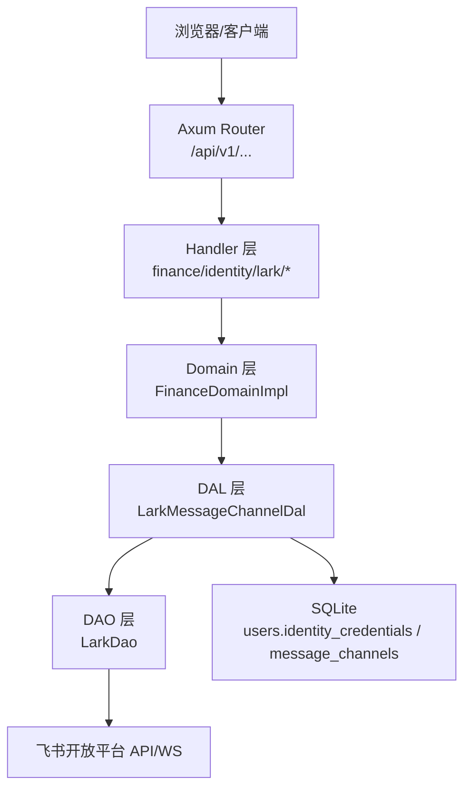
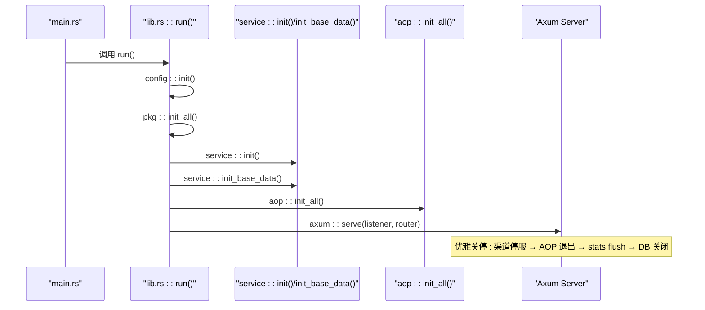
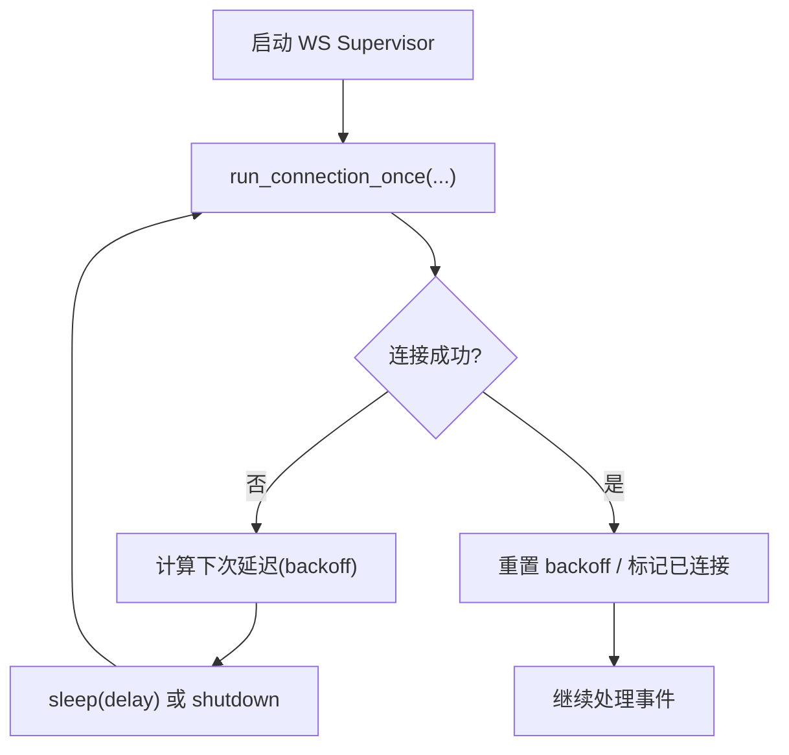
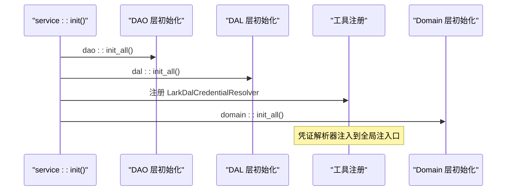
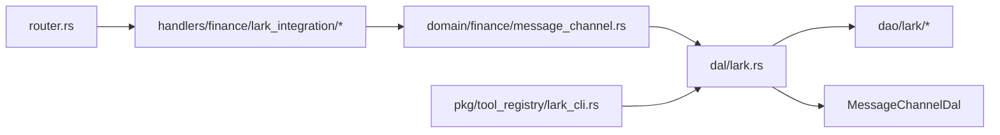

# 飞书集成系统

<cite>
**本文引用的文件**
- [src/main.rs](file://src/main.rs)
- [src/lib.rs](file://src/lib.rs)
- [src/router.rs](file://src/router.rs)
- [common/src/lib.rs](file://common/src/lib.rs)
- [common/src/models/identity_credentials.rs](file://common/src/models/identity_credentials.rs)
- [docs/design/lark_cli_integration.md](file://docs/design/lark_cli_integration.md)
- [src/handlers/finance/lark_integration/mod.rs](file://src/handlers/finance/lark_integration/mod.rs)
- [src/pkg/tool_registry/lark_cli.rs](file://src/pkg/tool_registry/lark_cli.rs)
- [src/pkg/lark_integration.rs](file://src/pkg/lark_integration.rs)
- [src/service/dal/lark.rs](file://src/service/dal/lark.rs)
- [src/service/domain/finance/message_channel.rs](file://src/service/domain/finance/message_channel.rs)
- [src/handlers/finance/message_channel/create_message_channel.rs](file://src/handlers/finance/message_channel/create_message_channel.rs)
- [src/handlers/finance/message_channel/response.rs](file://src/handlers/finance/message_channel/response.rs)
- [tests/integration/lark_integration_test.rs](file://tests/integration/lark_integration_test.rs)
- [tests/integration/message_channel_lifecycle_test.rs](file://tests/integration/message_channel_lifecycle_test.rs)
- [src/service/dal/user.rs](file://src/service/dal/user.rs)
- [src/service/domain/organization/user.rs](file://src/service/domain/organization/user.rs)
- [migrations/20260812000000_users_identity_credentials.sql](file://migrations/20260812000000_users_identity_credentials.sql)
- [src/service/dao/user/mod.rs](file://src/service/dao/user/mod.rs)
- [src/service/dao/lark/ws.rs](file://src/service/dao/lark/ws.rs)
</cite>

## 更新摘要
**变更内容**
- 新增用户级凭证库（users.identity_credentials JSON 列）与渠道引用机制
- 实现 lark-cli 集成二期：OAuth device flow、config init --new 自动绑定会话、WS 指数退避重连
- 重构 DAL 层凭证解析架构，消除 DAO 层跨层依赖，实现分层单向调用
- 新增凭证变更联动编排（Domain 层协调 user DAL 与 lark DAL）
- 完善健康指标聚合，挂接 WS 连接监控数据

## 目录
1. [简介](#简介)
2. [项目结构](#项目结构)
3. [核心组件](#核心组件)
4. [架构总览](#架构总览)
5. [详细组件分析](#详细组件分析)
6. [依赖关系分析](#依赖关系分析)
7. [性能与稳定性](#性能与稳定性)
8. [故障排查指南](#故障排查指南)
9. [结论](#结论)
10. [附录](#附录)

## 简介
本仓库实现了一个全栈 Rust 多 Agent 协作框架，并在其中完成了"飞书集成"的一期与二期能力：以用户级凭证为中心的多应用化、lark-cli 工具集成、OAuth device flow 用户身份接入、以及 WS 指数退避重连与健康指标上报。整体遵循严格的四层单向调用（Adapter → Domain → DAL → DAO），并通过 AOP 生产者/消费者进行异步编排。

**更新** 二期完成用户级凭证管理、OAuth 授权流程与 WS 稳定性增强，DAL 层职责清晰化，消除了跨层依赖问题。

## 项目结构
- 后端入口与启动流程集中在 src/main.rs 与 src/lib.rs；HTTP 路由在 src/router.rs；公共 DTO/枚举/错误等定义在 common 模块。
- 飞书集成功能横跨多个层次：
  - Adapter 层：HTTP Handler（finance/identity/lark/*）与消息入站适配（LarkMessageChannelDal）。
  - Domain 层：FinanceDomainImpl 对渠道生命周期进行编排（WS 监听同步/释放）。
  - DAL 层：LarkMessageChannelDal 组合 MessageChannelDal 与 LarkDao，负责连接池、事件回调、凭证解析。
  - DAO 层：LarkDao 提供 HTTP API + WebSocket 长连接池（per-app token 缓存与连接池）。
- 前端通过 Dioxus 渲染设置页与渠道管理页，调用 /api/v1/finance/identity/lark/* 完成绑定与授权。



**图表来源**
- [src/router.rs:75-130](file://src/router.rs#L75-L130)
- [src/handlers/finance/lark_integration/mod.rs:1-18](file://src/handlers/finance/lark_integration/mod.rs#L1-L18)
- [src/service/domain/finance/message_channel.rs:12-38](file://src/service/domain/finance/message_channel.rs#L12-L38)
- [src/service/dal/lark.rs:65-142](file://src/service/dal/lark.rs#L65-L142)

**章节来源**
- [src/main.rs:1-5](file://src/main.rs#L1-L5)
- [src/lib.rs:114-199](file://src/lib.rs#L114-L199)
- [src/router.rs:75-130](file://src/router.rs#L75-L130)
- [common/src/lib.rs:1-19](file://common/src/lib.rs#L1-L19)

## 核心组件
- 路由与中间件：统一挂载 protected/public 路由，JWT 认证与 RequestContext 注入，A2A/SSE/健康端点。
- 飞书集成 Handler：/api/v1/finance/identity/lark/* 提供凭证 CRUD、OAuth device flow、绑定快照聚合与自动绑定。
- 消息渠道与 WS 管理：按 app_id 维护 per-app token 缓存与 WS 连接池；支持 listen_inbound 开关与生命周期联动。
- lark-cli 内置工具：通过子进程调用 lark-cli，HOME 隔离、输出脱敏、超时截断，凭证实时从 DAL 解析。
- 安全与脱敏：secret 落库加密、响应恒脱敏、日志禁止携带敏感字段。

**章节来源**
- [src/router.rs:175-247](file://src/router.rs#L175-L247)
- [src/handlers/finance/lark_integration/mod.rs:1-18](file://src/handlers/finance/lark_integration/mod.rs#L1-L18)
- [src/pkg/tool_registry/lark_cli.rs:1-39](file://src/pkg/tool_registry/lark_cli.rs#L1-L39)
- [docs/design/lark_cli_integration.md:144-162](file://docs/design/lark_cli_integration.md#L144-L162)

## 架构总览
系统采用两阶段初始化：同步 service::init() 注册单例与 AOP producer/consumer；异步 service::init_base_data() 幂等注入默认基础数据。随后启动 AOP 调度器与 HTTP 服务，优雅关停顺序为：消息渠道停服 → AOP worker/producer 退出 → stats flush → DB 连接池关闭。



**图表来源**
- [src/lib.rs:114-199](file://src/lib.rs#L114-L199)
- [src/lib.rs:244-284](file://src/lib.rs#L244-L284)

**章节来源**
- [src/lib.rs:114-199](file://src/lib.rs#L114-L199)
- [src/lib.rs:244-284](file://src/lib.rs#L244-L284)

## 详细组件分析

### 用户级凭证库与迁移
**新增** 用户级凭证库存储在 users 表的 identity_credentials JSON 列中，实现了凭证与渠道的解耦设计。

#### 数据库迁移
```sql
ALTER TABLE users ADD COLUMN identity_credentials TEXT NOT NULL DEFAULT '';
```

#### 类型化结构体
- `UserIdentityCredentials`：凭证库容器，包含 items 列表和 default_credential_id
- `UserIdentityCredential`：单条凭证，包含 id、kind、name、时间戳和 detail
- `CredentialKind`：凭证类型枚举（当前仅 LarkApp）
- `CredentialDetail`：按类型区分的详情（serde tag 序列化）

#### 凭证解析机制
- 渠道通过 `lark_credential_id` 引用用户凭证库中的具体凭证
- 创建渠道时必须选择已绑定的应用凭证，不再支持手填内联凭证
- 凭证库查询使用缓存机制，同一批渠道扫描中同用户只查一次，消除 N+1 查询问题

**章节来源**
- [migrations/20260812000000_users_identity_credentials.sql:1-13](file://migrations/20260812000000_users_identity_credentials.sql#L1-L13)
- [common/src/models/identity_credentials.rs:11-77](file://common/src/models/identity_credentials.rs#L11-L77)

### OAuth Device Flow 授权流程
**新增** 完整的用户 OAuth 授权流程，支持设备码模式和浏览器验证链接。

#### 授权流程步骤
1. **发起授权**：`start_device_login()` 调用 `auth login --no-wait --json`，返回 device_code 和 verification_url
2. **用户授权**：用户在浏览器打开 verification_url 完成授权
3. **完成授权**：`complete_device_login()` 使用 device_code 完成授权流程
4. **状态查询**：`auth_status()` 实时查询用户授权状态
5. **取消授权**：`auth_logout()` 清理由本机登录态

#### Keychain 降级处理
- 检测 keychain 不可用错误，返回降级提示而非 500 错误
- 降级时允许继续使用应用身份（bot）操作飞书
- 所有输出经过脱敏处理，防止敏感信息泄露

**章节来源**
- [src/pkg/lark_integration.rs:263-362](file://src/pkg/lark_integration.rs#L263-L362)
- [src/pkg/lark_integration.rs:147-156](file://src/pkg/lark_integration.rs#L147-L156)

### 自动绑定会话管理
**新增** config init --new 自动化绑定流程，支持后台进程管理和进度轮询。

#### 会话管理机制
- 内存态会话注册表，支持 per-user 单活跃会话约束
- 后台任务并行扫描 stdout/stderr 提取验证 URL
- 会话 TTL 惰性清理，仅清理已终态会话
- 进程状态检测：Pending → Done/Failed 状态转换

#### 绑定流程特性
- 首次幂等写入配置，secret 走 stdin 传输
- 实测 secret 存于系统 keychain，config show 脱敏显示
- 完成后引导用户补填 App Secret，形成完整绑定闭环

**章节来源**
- [src/pkg/lark_integration.rs:364-612](file://src/pkg/lark_integration.rs#L364-L612)

### WS 指数退避重连与健康指标
**增强** WebSocket 连接稳定性，实现指数退避重连策略和健康指标上报。

#### 重连策略
- 初始延迟 1s，每次倍增，封顶 60s，±20% 随机抖动
- 连接成功后重置退避计数器
- 记录重连次数和连接阶段（connecting/connected/reconnecting）

#### 健康指标
- LarkWsMetrics 挂入 health metrics，供监控面板展示
- 连接状态实时监控，支持异常告警
- 心跳机制确保连接活性



**图表来源**
- [src/service/dao/lark/ws.rs:228-279](file://src/service/dao/lark/ws.rs#L228-L279)
- [src/service/domain/finance/message_channel.rs:113-120](file://src/service/domain/finance/message_channel.rs#L113-L120)

**章节来源**
- [src/service/dao/lark/ws.rs:228-279](file://src/service/dao/lark/ws.rs#L228-L279)
- [src/service/domain/finance/message_channel.rs:113-120](file://src/service/domain/finance/message_channel.rs#L113-L120)

### 分层架构优化与依赖注入链
**优化** DAL 层现在负责凭证解析和依赖注入链的完成，消除了 DAO 层对 UserDao 的跨层依赖。

#### 依赖注入链初始化
系统启动时按照严格顺序初始化各层依赖：



#### DAL 层凭证解析机制
LarkMessageChannelDal 现在负责完整的凭证解析流程：
- 用户凭证库加载：通过 UserDao 获取用户的 identity_credentials
- 凭证引用解析：将渠道的 lark_credential_id 映射到具体的应用凭证
- 解密与安全处理：在 DAL 层完成 secret 解密，避免明文泄露
- 缓存优化：同一批渠道扫描中同用户只查一次，消除 N+1 查询问题

**章节来源**
- [src/service/mod.rs:6-20](file://src/service/mod.rs#L6-L20)
- [src/service/dal/lark.rs:161-223](file://src/service/dal/lark.rs#L161-L223)
- [src/service/dal/user.rs:73-87](file://src/service/dal/user.rs#L73-L87)

### 凭证变更联动编排
**新增** Domain 层协调凭证变更的完整链路，确保数据一致性。

#### 变更流程
```
Handler（lark_integration credentials PUT/DELETE）
  → OrganizationDomain::user（domain/organization/user.rs 扩展）
      ① user DAL：read-modify-write users.identity_credentials（secret 加密）
      ② 返回后同层编排联动：lark DAL 查引用该凭证的渠道
         → 清该用户 per-user HOME 的 .lark-cli config（下次 lark_cli 执行重建）
         → WS 重建联：release_listener_if_unused(old_app_id) → ensure_listener_for(new_app_id)
```

#### 约束规则
- user DAL 与 lark/message_channel DAL 之间零互调，联动编排只发生在 Domain 层
- 凭证删除：Domain 先查引用，有渠道引用报 Conflict
- 删成功不联动删 HOME config（token 保留）

**章节来源**
- [src/service/dal/lark.rs:298-318](file://src/service/dal/lark.rs#L298-L318)
- [src/service/dal/lark.rs:581-612](file://src/service/dal/lark.rs#L581-L612)

## 依赖关系分析
- 分层单向依赖：Adapter → Domain → DAL → DAO，禁止跨层与同层互调。
- 关键依赖链：
  - Router → finance/identity/lark handlers → FinanceDomainImpl → LarkMessageChannelDal → LarkDao
  - LarkMessageChannelDal 组合 MessageChannelDal 与 LarkDao，并可选注入 UserDao 用于凭证引用解析。
  - lark-cli 工具通过 DAL 获取渠道凭证，不直接访问 DAO。



**图表来源**
- [src/router.rs:175-247](file://src/router.rs#L175-L247)
- [src/service/domain/finance/message_channel.rs:12-38](file://src/service/domain/finance/message_channel.rs#L12-L38)
- [src/service/dal/lark.rs:65-142](file://src/service/dal/lark.rs#L65-L142)
- [src/pkg/tool_registry/lark_cli.rs:1-39](file://src/pkg/tool_registry/lark_cli.rs#L1-L39)

**章节来源**
- [src/router.rs:175-247](file://src/router.rs#L175-L247)
- [src/service/domain/finance/message_channel.rs:12-38](file://src/service/domain/finance/message_channel.rs#L12-L38)
- [src/service/dal/lark.rs:65-142](file://src/service/dal/lark.rs#L65-L142)
- [src/pkg/tool_registry/lark_cli.rs:1-39](file://src/pkg/tool_registry/lark_cli.rs#L1-L39)

## 性能与稳定性
- WS 连接池按 app_id 去重，避免重复建连；listen_inbound=false 时仅出站推送与工具凭证来源。
- 指数退避重连降低瞬时压力，配合健康指标便于观测。
- 工具执行超时与输出截断防止资源占用；HOME 隔离避免用户间干扰。
- 密钥落库加密与响应脱敏减少泄露风险。
- **新增** DAL 层凭证解析缓存机制，消除 N+1 查询问题，提升批量操作性能。
- **新增** 用户级凭证库设计，实现凭证与渠道解耦，提升可维护性。

## 故障排查指南
- 无 CLI 配置/二进制时，auth/bind 端点应返回引导性 4xx JSON（非 5xx），且不包含 secret 明文。
- 创建 Lark 渠道缺少凭证引用时应返回 400 校验错误；连接测试在无网络/假凭证场景返回结构化失败。
- 删除渠道后应释放 WS 监听；删除凭证若有引用需拦截（软删计数需过滤 Deleted 状态）。
- **新增** 检查 DAL 层凭证解析是否正确：确认 user_dao 已正确注入，用户凭证库可正常加载。
- **新增** 验证 keychain 降级逻辑：keychain 不可用时应返回降级提示而非错误。

**章节来源**
- [tests/integration/lark_integration_test.rs:16-112](file://tests/integration/lark_integration_test.rs#L16-L112)
- [tests/integration/message_channel_lifecycle_test.rs:1-20](file://tests/integration/message_channel_lifecycle_test.rs#L1-L20)

## 结论
本系统以用户级凭证为中心实现了飞书多应用化与工具集成，通过严格的分层架构与 AOP 编排保证了可扩展性与可维护性。二期完善了绑定体验、用户身份接入与 WS 稳定性，形成完整的飞书集成闭环。分层架构的进一步优化确保了 DAL 层职责清晰，消除了跨层依赖，提升了系统的可维护性和性能表现。后续可关注 keychain 可用性降级策略与更多渠道扩展。

## 附录
- 设计文档：docs/design/lark_cli_integration.md
- 公共模型：common/src/models/identity_credentials.rs（含 identity_credentials 等）
- 启动流程与关停编排：src/lib.rs
- **新增** 分层架构初始化：src/service/mod.rs
- **新增** 用户级凭证库迁移：migrations/20260812000000_users_identity_credentials.sql

**章节来源**
- [docs/design/lark_cli_integration.md:1-196](file://docs/design/lark_cli_integration.md#L1-L196)
- [common/src/models/identity_credentials.rs:1-234](file://common/src/models/identity_credentials.rs#L1-L234)
- [src/lib.rs:114-199](file://src/lib.rs#L114-L199)
- [src/lib.rs:244-284](file://src/lib.rs#L244-L284)
- [src/service/mod.rs:6-20](file://src/service/mod.rs#L6-L20)
- [migrations/20260812000000_users_identity_credentials.sql:1-13](file://migrations/20260812000000_users_identity_credentials.sql#L1-L13)