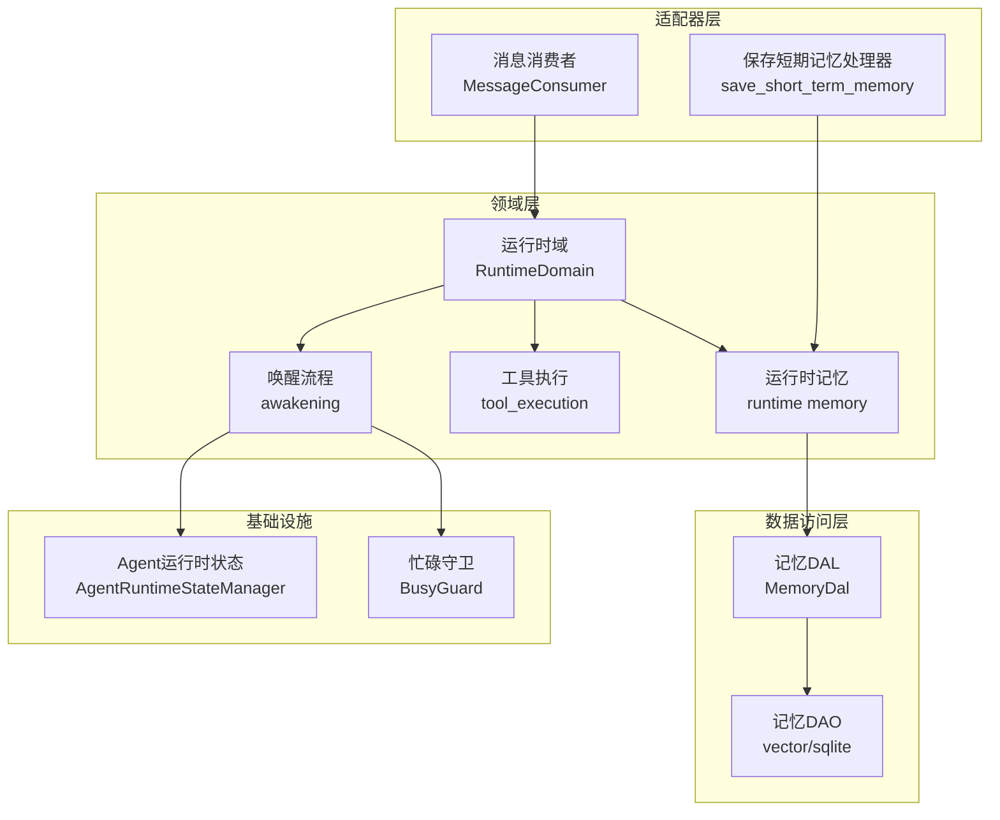
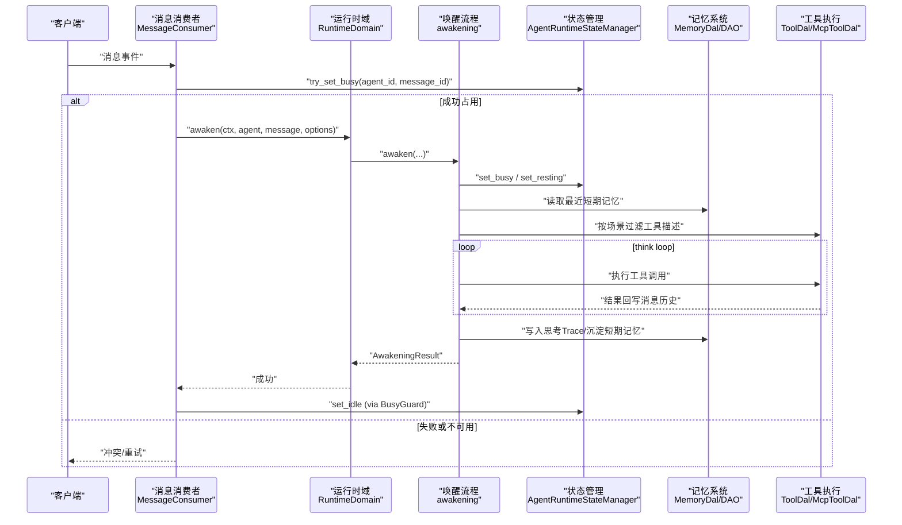
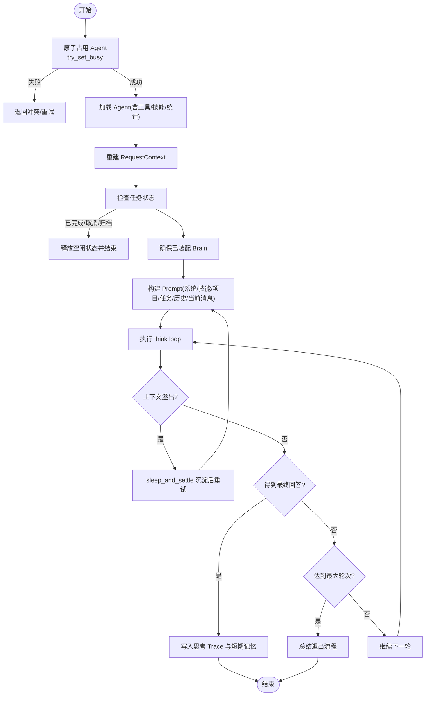
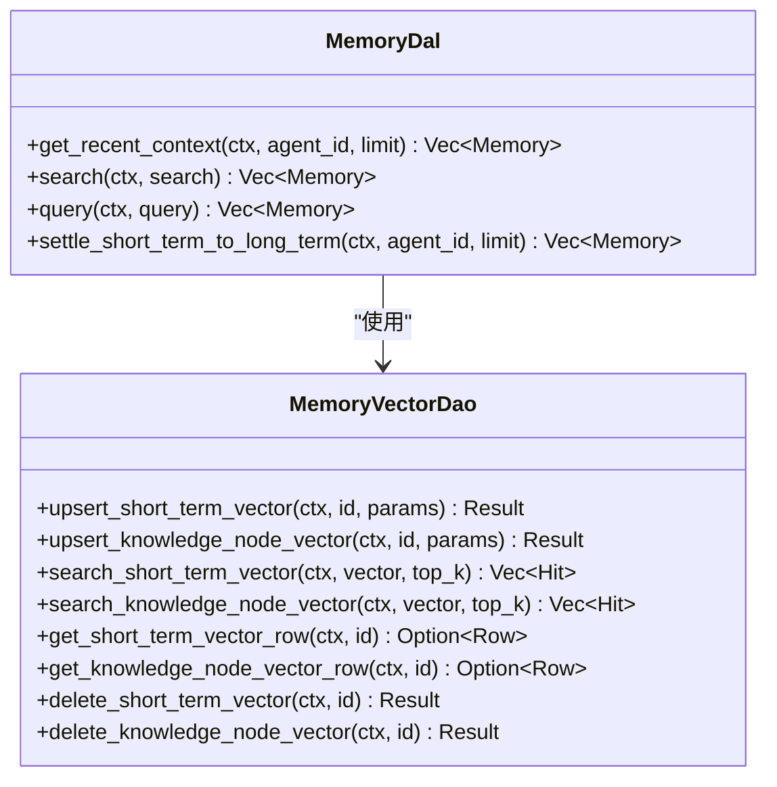
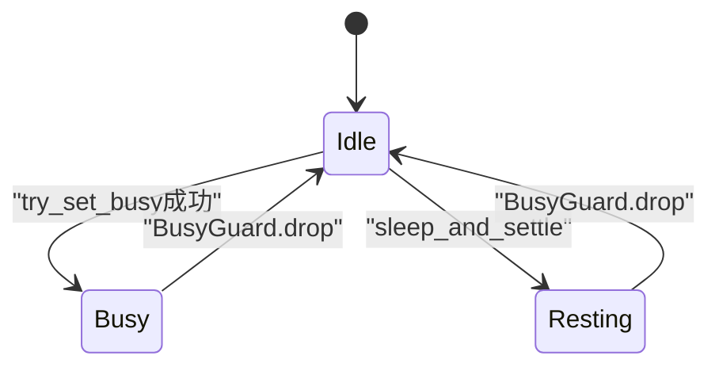
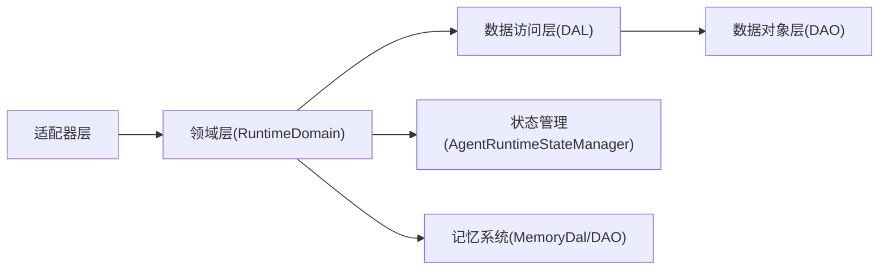
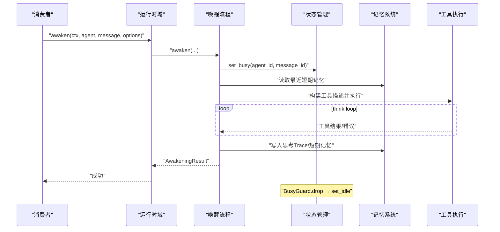
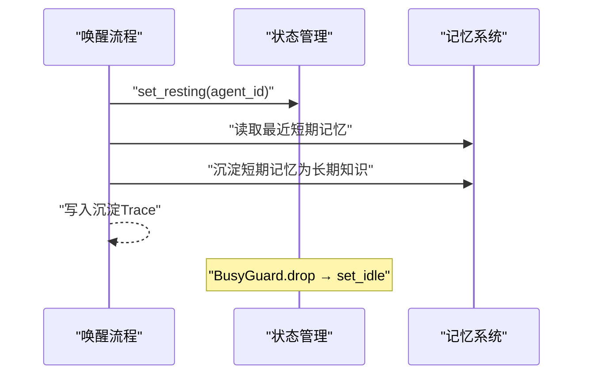

# 运行时领域

<cite>
**本文引用的文件**
- [src/consumer/message.rs](file://src/consumer/message.rs)
- [src/service/domain/runtime/mod.rs](file://src/service/domain/runtime/mod.rs)
- [src/service/domain/runtime/awakening.rs](file://src/service/domain/runtime/awakening.rs)
- [src/service/domain/runtime/busy_guard.rs](file://src/service/domain/runtime/busy_guard.rs)
- [src/pkg/agent_runtime_state.rs](file://src/pkg/agent_runtime_state.rs)
- [src/models/tool.rs](file://src/models/tool.rs)
- [src/service/dal/memory.rs](file://src/service/dal/memory.rs)
- [src/service/dao/memory/vector.rs](file://src/service/dao/memory/vector.rs)
- [src/handlers/hr/agent/save_short_term_memory.rs](file://src/handlers/hr/agent/save_short_term_memory.rs)
- [tests/integration/memory_test.rs](file://tests/integration/memory_test.rs)
</cite>

## 目录
1. [简介](#简介)
2. [项目结构](#项目结构)
3. [核心组件](#核心组件)
4. [架构总览](#架构总览)
5. [详细组件分析](#详细组件分析)
6. [依赖关系分析](#依赖关系分析)
7. [性能与并发](#性能与并发)
8. [故障排查指南](#故障排查指南)
9. [结论](#结论)
10. [附录：关键流程时序图](#附录：关键流程时序图)

## 简介
本章节面向“AI Agent 运行时”的读者，聚焦唤醒机制、内存管理、工具执行与忙闲状态控制。文档基于仓库中运行时域（Runtime Domain）、消息消费者（MessageConsumer）、Agent 状态管理器（AgentRuntimeStateManager）以及记忆系统（短期/长期记忆、向量检索）的实现进行系统化说明，帮助读者理解 Agent 从被唤醒到完成一轮思考、沉淀记忆的完整生命周期，并给出监控、指标与故障恢复的实践建议。

## 项目结构
运行时相关代码主要分布在以下层次：
- Adapter 层：HTTP Handler 与 AOP Consumer（如消息消费者）。
- Domain 层：运行时域（awakening、tool_execution、memory），负责动态执行逻辑。
- DAL 层：记忆 DAL、大脑 DAL、工具 DAL 等。
- DAO 层：SQLite/LanceDB/HNSW 等存储实现。



**图表来源**
- [src/consumer/message.rs:147-357](file://src/consumer/message.rs#L147-L357)
- [src/service/domain/runtime/mod.rs:36-49](file://src/service/domain/runtime/mod.rs#L36-L49)
- [src/service/domain/runtime/awakening.rs:415-748](file://src/service/domain/runtime/awakening.rs#L415-L748)
- [src/pkg/agent_runtime_state.rs:31-107](file://src/pkg/agent_runtime_state.rs#L31-L107)
- [src/service/dal/memory.rs:578-608](file://src/service/dal/memory.rs#L578-L608)
- [src/service/dao/memory/vector.rs:36-124](file://src/service/dao/memory/vector.rs#L36-L124)

**章节来源**
- [src/consumer/message.rs:147-357](file://src/consumer/message.rs#L147-L357)
- [src/service/domain/runtime/mod.rs:36-49](file://src/service/domain/runtime/mod.rs#L36-L49)

## 核心组件
- 消息消费者（MessageConsumer）：订阅消息事件，按目标角色分发；对 Agent 消息进行唤醒编排，包含原子占用、上下文重建、任务状态检查、ThinkingOptions 组装与调用 awaken。
- 运行时域（RuntimeDomain）：聚合 awakening、tool_execution、memory 能力，提供统一入口与状态查询。
- 唤醒流程（awakening）：装配 Brain、构建 Prompt、执行 think loop（含超时、轮次限制、上下文压缩）、沉淀记忆、统计与事件发布。
- 忙碌守卫（BusyGuard）：RAII 模式确保 Busy/Resting 状态在任意返回路径释放为 Idle。
- Agent 运行时状态管理器（AgentRuntimeStateManager）：全局单例维护每个 Agent 的 Idle/Busy/Resting 状态，支持 try_set_busy 原子占用，避免 TOCTOU 竞态。
- 记忆系统：短期记忆（FTS + 向量）、长期知识节点（FTS + 向量）、沉淀流程（settle_short_term_to_long_term）。

**章节来源**
- [src/consumer/message.rs:147-357](file://src/consumer/message.rs#L147-L357)
- [src/service/domain/runtime/mod.rs:36-49](file://src/service/domain/runtime/mod.rs#L36-L49)
- [src/service/domain/runtime/awakening.rs:415-748](file://src/service/domain/runtime/awakening.rs#L415-L748)
- [src/service/domain/runtime/busy_guard.rs:1-32](file://src/service/domain/runtime/busy_guard.rs#L1-L32)
- [src/pkg/agent_runtime_state.rs:31-107](file://src/pkg/agent_runtime_state.rs#L31-L107)
- [src/service/dal/memory.rs:578-608](file://src/service/dal/memory.rs#L578-L608)

## 架构总览
运行时以“事件驱动 + 领域编排”的方式组织：
- 外部消息进入后由 MessageConsumer 消费，根据 to_role 路由到不同 Domain。
- Agent 消息走 RuntimeDomain.awakening()，内部通过 run_think_loop 驱动模型推理与工具调用，并在上下文溢出或轮次耗尽时触发沉淀或总结退出。
- 记忆系统在 awaken/sleep_and_settle 中读写短期/长期记忆，并通过向量索引支持语义检索。
- 状态管理贯穿始终，BusyGuard 保证状态一致性。



**图表来源**
- [src/consumer/message.rs:147-357](file://src/consumer/message.rs#L147-L357)
- [src/service/domain/runtime/awakening.rs:415-748](file://src/service/domain/runtime/awakening.rs#L415-L748)
- [src/pkg/agent_runtime_state.rs:73-107](file://src/pkg/agent_runtime_state.rs#L73-L107)
- [src/service/dal/memory.rs:578-608](file://src/service/dal/memory.rs#L578-L608)

## 详细组件分析

### 唤醒机制与上下文恢复
- 唤醒入口：MessageConsumer.handle_agent_message 先尝试原子占用 Agent（try_set_busy），再加载 Agent（含 tools/skills/stats），构造 ThinkingOptions（注入 project/task 上下文），最后调用 RuntimeDomain.awakening().awaken。
- 上下文恢复：awaken 内会读取最近短期记忆，使用 PromptBuilder 拼装系统提示、技能、项目/任务上下文、历史与当前消息，形成最终 prompt。
- 大脑装配：若 Agent 未装配 Brain，则调用 wake_agent_brain 获取 ModelProvider 信息并 enrich ctx，确保后续统计与追踪字段完整。
- 循环控制：run_think_loop 内置超时（300s）、轮次上限（默认 90，可配置）、上下文溢出检测（input_tokens 阈值），并在溢出时触发 sleep_and_settle 沉淀后重试。



**图表来源**
- [src/consumer/message.rs:147-357](file://src/consumer/message.rs#L147-L357)
- [src/service/domain/runtime/awakening.rs:415-748](file://src/service/domain/runtime/awakening.rs#L415-L748)

**章节来源**
- [src/consumer/message.rs:147-357](file://src/consumer/message.rs#L147-L357)
- [src/service/domain/runtime/awakening.rs:415-748](file://src/service/domain/runtime/awakening.rs#L415-L748)

### 内存管理：短期记忆与长期记忆
- 短期记忆：
  - 创建：通过 save_short_term_memory 处理器调用 runtime_domain.memory().create，持久化为 ShortTerm 类型，并建立 FTS 与向量索引。
  - 检索：get_recent_context 用于唤醒时注入历史；search/query 支持关键词与语义混合检索。
- 长期记忆：
  - 沉淀：MemoryDal.settle_short_term_to_long_term 将 Active 短期记忆聚合成知识节点，建立引用关系，并标记为 Settled。
  - 向量检索：MemoryVectorDaoImpl 提供 upsert/search/get/delete 接口，命名空间区分 short_term 与 knowledge_node。
- 测试覆盖：集成测试验证了短期记忆查询、搜索与向量检索行为。



**图表来源**
- [src/service/dal/memory.rs:148-177](file://src/service/dal/memory.rs#L148-L177)
- [src/service/dao/memory/vector.rs:36-124](file://src/service/dao/memory/vector.rs#L36-L124)

**章节来源**
- [src/handlers/hr/agent/save_short_term_memory.rs:30-57](file://src/handlers/hr/agent/save_short_term_memory.rs#L30-L57)
- [src/service/dal/memory.rs:578-608](file://src/service/dal/memory.rs#L578-L608)
- [src/service/dao/memory/vector.rs:36-124](file://src/service/dao/memory/vector.rs#L36-L124)
- [tests/integration/memory_test.rs:179-219](file://tests/integration/memory_test.rs#L179-L219)

### 工具执行流程：参数验证与结果处理
- 工具描述：awaken 中从 agent.tools 派生 ToolDescriptor 列表，供模型 function calling。
- 执行分发：run_think_loop 根据 tool.po.control_mode 选择 auto/manual 执行路径，分别调用 ToolDal.execute_auto/execute_manual。
- 结果处理：工具执行结果以 ChatMessage::tool 形式追加到消息历史；错误路径记录错误信息并继续循环。
- 手动工具调用：consumer.handle_tool_call_request 解析 ToolCallRequest，构建 RequestContext，调用 call_manual_tool_for_agent，并将结果通过 MessageDomain 回写。

```mermaid
sequenceDiagram
participant Loop as "think loop"
participant ToolDAL as "工具DAL"
participant MCP as "MCP工具DAL"
participant Msg as "消息历史"
Loop->>ToolDAL : "execute_auto/execute_manual(tool, args)"
alt Auto
ToolDAL-->>Loop : "(value, entry)"
else Manual
ToolDAL->>MCP : "协议路由"
MCP-->>ToolDAL : "执行结果"
ToolDAL-->>Loop : "(value, entry)"
end
Loop->>Msg : "追加工具结果或错误"
```

**图表来源**
- [src/service/domain/runtime/awakening.rs:248-323](file://src/service/domain/runtime/awakening.rs#L248-L323)
- [src/consumer/message.rs:402-477](file://src/consumer/message.rs#L402-L477)

**章节来源**
- [src/service/domain/runtime/awakening.rs:248-323](file://src/service/domain/runtime/awakening.rs#L248-L323)
- [src/consumer/message.rs:402-477](file://src/consumer/message.rs#L402-L477)
- [src/models/tool.rs:48-88](file://src/models/tool.rs#L48-L88)

### 忙闲状态管理与并发控制
- 状态枚举：Idle/Busy/Resting，分别表示空闲、忙碌、休息（沉淀）。
- 原子占用：try_set_busy 在同一临界区判断并设置 Busy，避免 TOCTOU 竞态。
- RAII 清理：BusyGuard 在 drop 时自动 set_idle，确保任何返回路径（包括 panic）都释放状态。
- 消费者并发：MessageConsumer 设置 concurrency=4，空队列休眠 100ms，错误重试休眠 1000ms。



**图表来源**
- [src/pkg/agent_runtime_state.rs:73-107](file://src/pkg/agent_runtime_state.rs#L73-L107)
- [src/service/domain/runtime/busy_guard.rs:1-32](file://src/service/domain/runtime/busy_guard.rs#L1-L32)
- [src/consumer/message.rs:130-141](file://src/consumer/message.rs#L130-L141)

**章节来源**
- [src/pkg/agent_runtime_state.rs:73-107](file://src/pkg/agent_runtime_state.rs#L73-L107)
- [src/service/domain/runtime/busy_guard.rs:1-32](file://src/service/domain/runtime/busy_guard.rs#L1-L32)
- [src/consumer/message.rs:130-141](file://src/consumer/message.rs#L130-L141)

## 依赖关系分析
- 单向依赖：Adapter → Domain → DAL → DAO，禁止跨层与同层互调。
- 运行时域依赖：BrainDal、ToolDal、McpToolDal、AgentDal、CodexAgentDal、A2aAgentDal、ToolCallLogger。
- 记忆系统依赖：MemoryDal 组合 MemoryDao 与 MemoryVectorDao，后者对接向量存储后端。



**图表来源**
- [src/service/domain/runtime/mod.rs:251-304](file://src/service/domain/runtime/mod.rs#L251-L304)
- [src/service/dal/memory.rs:181-186](file://src/service/dal/memory.rs#L181-L186)

**章节来源**
- [src/service/domain/runtime/mod.rs:251-304](file://src/service/domain/runtime/mod.rs#L251-L304)
- [src/service/dal/memory.rs:181-186](file://src/service/dal/memory.rs#L181-L186)

## 性能与并发
- 超时与轮次：run_think_loop 设置 300s 超时与默认 90 轮上限，防止无限循环。
- 上下文压缩：当 input_tokens 超过阈值（recommended_context_length 或 max_context_length*60%）时中断循环，触发沉淀后重试。
- 并发控制：消费者并发度 4，空队列与错误重试退避策略降低资源竞争。
- 向量检索：短/长记忆均支持向量索引，提升语义检索效率；支持多后端降级（LanceDB/HNSW/InMemory/SqliteVss）。

[本节为通用指导，不直接分析具体文件]

## 故障排查指南
- Agent 永远 Busy：检查 awaken 中是否正确使用 BusyGuard；确认 try_set_busy 成功后所有失败路径均能释放状态。
- 消息无法投递：确认 handle_user_message 在所有渠道失败时返回错误以触发 nack 重试。
- 上下文溢出频繁：调整 recommended_context_length 或 max_context_length；优化 Prompt 与历史长度。
- 工具执行失败：查看 ToolCallEntry 日志，确认 control_mode 与协议配置；必要时切换到 manual 模式进行调试。
- 记忆沉淀异常：检查 settle_short_term_to_long_term 是否找到 Active 短期记忆；验证向量索引是否成功 upsert。

**章节来源**
- [src/service/domain/runtime/busy_guard.rs:1-32](file://src/service/domain/runtime/busy_guard.rs#L1-L32)
- [src/consumer/message.rs:359-389](file://src/consumer/message.rs#L359-L389)
- [src/service/dal/memory.rs:578-608](file://src/service/dal/memory.rs#L578-L608)

## 结论
运行时领域通过清晰的层次划分与严格的依赖约束，实现了 Agent 的可靠唤醒、上下文恢复、工具执行与记忆沉淀。借助 BusyGuard 与 try_set_busy 的状态管理，避免了状态泄漏与竞态问题；通过 think loop 的超时、轮次与上下文压缩控制，保障了稳定性与可扩展性。结合向量检索与 FTS 的记忆系统，Agent 能够在长对话中保持高效的知识利用与沉淀。

[本节为总结性内容，不直接分析具体文件]

## 附录：关键流程时序图

### 唤醒主流程（awaken）


**图表来源**
- [src/service/domain/runtime/awakening.rs:415-748](file://src/service/domain/runtime/awakening.rs#L415-L748)
- [src/pkg/agent_runtime_state.rs:73-107](file://src/pkg/agent_runtime_state.rs#L73-L107)

### 沉淀流程（sleep_and_settle）


**图表来源**
- [src/service/domain/runtime/awakening.rs:750-800](file://src/service/domain/runtime/awakening.rs#L750-L800)
- [src/service/dal/memory.rs:578-608](file://src/service/dal/memory.rs#L578-L608)