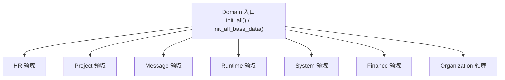
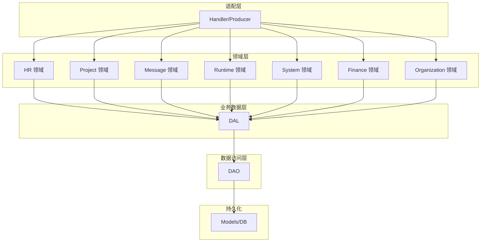
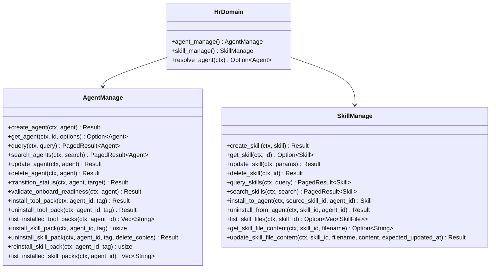
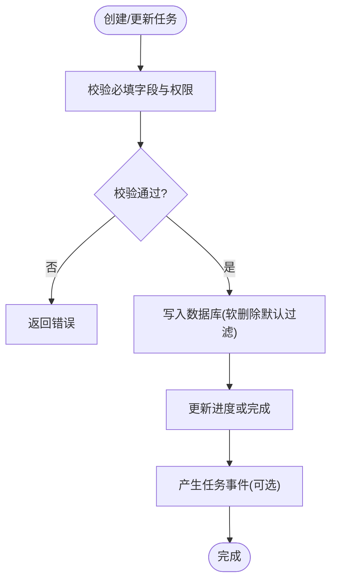
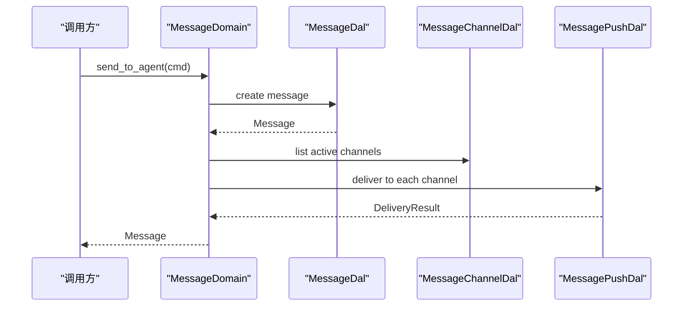
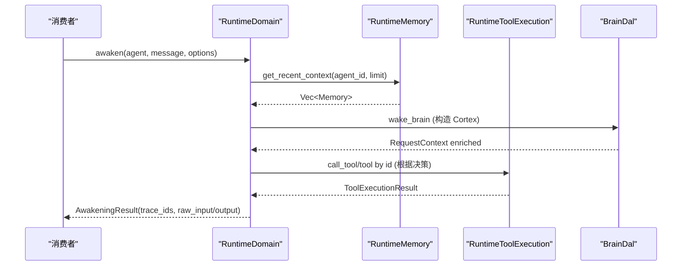
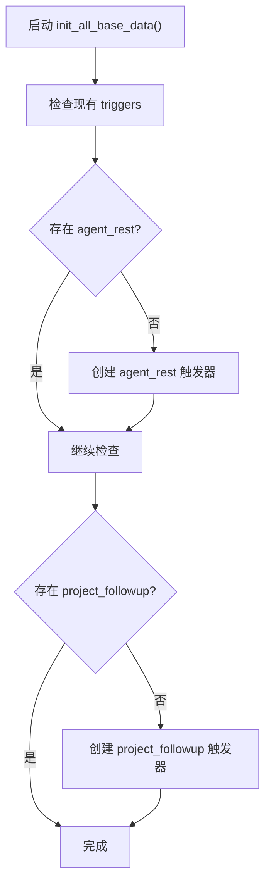
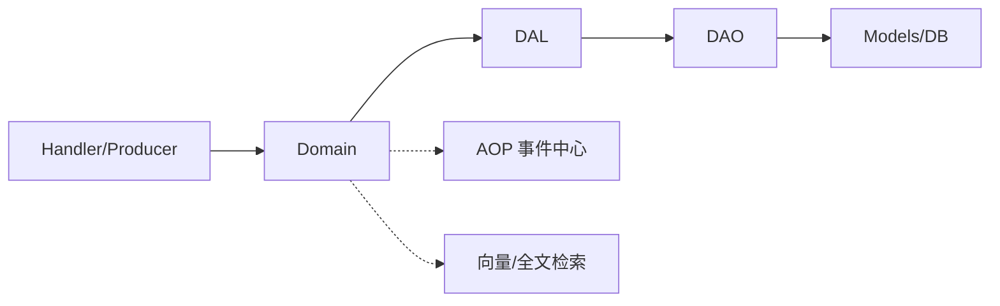

# 领域层

<cite>
**本文引用的文件**
- [src/service/domain/mod.rs](file://src/service/domain/mod.rs)
- [src/service/domain/hr/mod.rs](file://src/service/domain/hr/mod.rs)
- [src/service/domain/project/mod.rs](file://src/service/domain/project/mod.rs)
- [src/service/domain/message/mod.rs](file://src/service/domain/message/mod.rs)
- [src/service/domain/runtime/mod.rs](file://src/service/domain/runtime/mod.rs)
- [src/service/domain/system/mod.rs](file://src/service/domain/system/mod.rs)
- [src/service/domain/finance/mod.rs](file://src/service/domain/finance/mod.rs)
- [src/service/domain/organization/mod.rs](file://src/service/domain/organization/mod.rs)
- [docs/ARCHITECTURE.md](file://docs/ARCHITECTURE.md)
- [AGENTS.md](file://AGENTS.md)
</cite>

## 目录
1. [引言](#引言)
2. [项目结构](#项目结构)
3. [核心组件](#核心组件)
4. [架构总览](#架构总览)
5. [详细组件分析](#详细组件分析)
6. [依赖关系分析](#依赖关系分析)
7. [性能与扩展性](#性能与扩展性)
8. [故障排查指南](#故障排查指南)
9. [结论](#结论)
10. [附录：业务规则与事务边界](#附录：业务规则与事务边界)

## 引言
本文件聚焦 AI Orz 的领域层（service/domain），以领域驱动设计（DDD）为核心，系统化阐述领域模型、实体、值对象与聚合根的设计模式，以及各业务领域的核心规则与编排原则。重点覆盖：
- Agent 生命周期管理（HR 领域）
- 技能包系统（HR 领域）
- 项目任务编排（Project 领域）
- 消息管理与多渠道投递（Message 领域）
- 运行时唤醒、记忆与工具执行（Runtime 领域）
- 系统监控、备份、日志查询与定时触发器（System 领域）
- 财务相关配置与能力（Finance 领域）
- 组织与用户（Organization 领域）

同时明确领域服务的设计原则、业务规则验证、事务边界划分、领域事件发布、跨领域协调机制与复杂业务流程编排方式，并提供扩展指南、性能优化建议与常见场景实现示例。

## 项目结构
领域层按业务域拆分模块，每个域通过 trait + impl 暴露统一能力，并通过单例注册到全局 OnceLock，供上层 Handler/Producer 调用。顶层入口负责初始化所有 Domain 及异步基础数据注入。

**图表来源**
- [src/service/domain/mod.rs:23-42](file://src/service/domain/mod.rs#L23-L42)

**章节来源**
- [src/service/domain/mod.rs:1-42](file://src/service/domain/mod.rs#L1-L42)
- [docs/ARCHITECTURE.md:245-260](file://docs/ARCHITECTURE.md#L245-L260)

## 核心组件
- HR 领域：Agent 全生命周期、技能包安装/卸载/重装、工具包绑定、综合查询与搜索、状态流转与入职就绪校验。
- Project 领域：Project/Task/Artifact 聚合管理，状态机与进度追踪，执行计划与结果记录，混合搜索与分页。
- Message 领域：消息投递（Agent/User/ToolCall/TaskAssignment）、多渠道分发、SSE 订阅、消息管理（CRUD/清理/搜索）。
- Runtime 领域：Agent 唤醒、沉睡沉淀、记忆读写、工具执行路由（MCP/内置/HTTP）、工具调用追踪查询。
- System 领域：Cron 触发器管理、备份恢复、日志查询统计、AOP 监控与统计、系统级默认定时任务幂等注入。
- Finance 领域：ModelProvider、MessageChannel、ToolProvider、MCP Server/Tool、Attachment 管理能力。
- Organization 领域：组织与用户管理、系统初始化、权限角色支撑。

**章节来源**
- [src/service/domain/hr/mod.rs:1-393](file://src/service/domain/hr/mod.rs#L1-L393)
- [src/service/domain/project/mod.rs:1-539](file://src/service/domain/project/mod.rs#L1-L539)
- [src/service/domain/message/mod.rs:1-378](file://src/service/domain/message/mod.rs#L1-L378)
- [src/service/domain/runtime/mod.rs:1-469](file://src/service/domain/runtime/mod.rs#L1-L469)
- [src/service/domain/system/mod.rs:1-416](file://src/service/domain/system/mod.rs#L1-L416)
- [src/service/domain/finance/mod.rs:1-522](file://src/service/domain/finance/mod.rs#L1-L522)
- [src/service/domain/organization/mod.rs:1-200](file://src/service/domain/organization/mod.rs#L1-L200)

## 架构总览
领域层遵循严格单向调用：Adapter → Domain → DAL → DAO → Models。Domain 组合多个 DAL，封装核心业务规则与流程编排；不直接访问 DAO，不暴露 PO。

**图表来源**
- [docs/ARCHITECTURE.md:325-385](file://docs/ARCHITECTURE.md#L325-L385)
- [AGENTS.md:150-186](file://AGENTS.md#L150-L186)

**章节来源**
- [docs/ARCHITECTURE.md:325-385](file://docs/ARCHITECTURE.md#L325-L385)
- [AGENTS.md:150-186](file://AGENTS.md#L150-L186)

## 详细组件分析

### HR 领域：Agent 生命周期与技能包系统
- 职责：Agent CRUD、状态流转、入职就绪校验、工具包/技能包安装/卸载/重装、综合查询与搜索、前台 Agent 解析。
- 关键设计：
  - 单例与子能力 trait：HrDomain → AgentManage/SkillManage。
  - 状态流转：transition_status 统一校验并更新。
  - 技能包：install/uninstall/reinstall 支持 tag 维度批量操作，副本与原始分离。
  - 工具包：按 tag 安装/卸载，维护 runtime_config.installed_tags。
  - 搜索：FTS5 + 向量语义混合搜索，返回分页。

**图表来源**
- [src/service/domain/hr/mod.rs:131-393](file://src/service/domain/hr/mod.rs#L131-L393)

**章节来源**
- [src/service/domain/hr/mod.rs:1-393](file://src/service/domain/hr/mod.rs#L1-L393)

### Project 领域：项目任务编排与产物管理
- 职责：Project/Task/Artifact 聚合管理，状态机与进度追踪，执行计划/结果记录，混合搜索与分页。
- 关键设计：
  - 聚合：Project 聚合 Task，Task 聚合 Artifact。
  - 状态流转：统一 transition_status 方法，保证状态合法性。
  - 进度：Task.update_progress 支持 0-100 进度更新，complete 自动设 100。
  - 执行信息：execution_plan/execution_result 字段用于步骤策略与实际产出记录。
  - 搜索：query/search 均支持完整过滤条件与分页，search 侧重语义相关性。

**图表来源**
- [src/service/domain/project/mod.rs:228-359](file://src/service/domain/project/mod.rs#L228-L359)
- [docs/ARCHITECTURE.md:466-486](file://docs/ARCHITECTURE.md#L466-L486)

**章节来源**
- [src/service/domain/project/mod.rs:1-539](file://src/service/domain/project/mod.rs#L1-L539)
- [docs/ARCHITECTURE.md:466-486](file://docs/ARCHITECTURE.md#L466-L486)

### Message 领域：消息管理与多渠道投递
- 职责：消息投递（Agent/User/ToolCall/TaskAssignment）、多渠道分发、SSE 订阅、消息管理（CRUD/清理/搜索）。
- 关键设计：
  - 命令参数：SendToAgentCommand/SendToUserCommand/SendToolCallRequestCommand/SendToolCallResultCommand/SendTaskAssignmentCommand/DeliverMessageCommand。
  - 投递：deliver_message 自动查询用户活跃渠道并推送。
  - SSE：subscribe_sse/unsubscribe_sse 提供实时推送通道。
  - 管理：query/list_by_*、get_by_id、update_status、delete_by_id、cleanup_conversation、search（FTS5+向量）。

**图表来源**
- [src/service/domain/message/mod.rs:121-331](file://src/service/domain/message/mod.rs#L121-L331)

**章节来源**
- [src/service/domain/message/mod.rs:1-378](file://src/service/domain/message/mod.rs#L1-L378)

### Runtime 领域：唤醒、记忆与工具执行
- 职责：Agent 唤醒主流程、沉睡沉淀、记忆读写、工具执行路由（MCP/内置/HTTP）、工具调用追踪查询。
- 关键设计：
  - 唤醒：wake_agent_brain 装配 Brain；awaken/sleep_and_settle 对称处理思考与沉淀。
  - 记忆：get_recent_context/write_thinking_trace/search/query/traverse_graph。
  - 工具执行：call_tool_by_id/call_tool/call_manual_tool_for_agent，协议路由由 Runtime 拥有。
  - 追踪：query_tool_call_entries/get_tool_call_entry_by_id，带访问范围控制。

**图表来源**
- [src/service/domain/runtime/mod.rs:108-173](file://src/service/domain/runtime/mod.rs#L108-L173)
- [src/service/domain/runtime/mod.rs:175-228](file://src/service/domain/runtime/mod.rs#L175-L228)

**章节来源**
- [src/service/domain/runtime/mod.rs:1-469](file://src/service/domain/runtime/mod.rs#L1-L469)

### System 领域：监控、备份、日志与定时任务
- 职责：Cron 触发器管理、备份恢复、日志查询统计、AOP 监控与统计、系统级默认定时任务幂等注入。
- 关键设计：
  - Cron：create/get/list/update/delete/pause/resume/list_due/marked_executed。
  - 备份：create_backup/list_backups/delete_backup/generate_restore_script。
  - 日志：query_logs/level_distribution/time_series。
  - AOP：队列统计、事件列表/详情、概览/时序/分布。
  - 系统任务：ensure_system_cron_triggers 幂等注入 agent_rest（4h）与 project_followup（1h）。

**图表来源**
- [src/service/domain/system/mod.rs:34-46](file://src/service/domain/system/mod.rs#L34-L46)
- [src/service/domain/system/mod.rs:358-416](file://src/service/domain/system/mod.rs#L358-L416)

**章节来源**
- [src/service/domain/system/mod.rs:1-416](file://src/service/domain/system/mod.rs#L1-L416)

### Finance 领域：模型提供商、消息渠道、工具与附件
- 职责：ModelProvider、MessageChannel、ToolProvider、MCP Server/Tool、Attachment 管理能力。
- 关键设计：
  - ModelProvider：test_connection、switch_embedding_provider（原子切换旧/新）。
  - MessageChannel：test_message_channel 连通性测试。
  - ToolProvider：sync_builtin_tools、bind/unbind tool to agent、search_tools。
  - MCP：sync_mcp_tools、list_mcp_tools_by_server。
  - Attachment：create/get/update/delete text/binary attachment。

**章节来源**
- [src/service/domain/finance/mod.rs:1-522](file://src/service/domain/finance/mod.rs#L1-L522)

### Organization 领域：组织与用户
- 职责：组织与用户管理、系统初始化、权限角色支撑。
- 关键设计：
  - 组织：check_initialized、create_org_and_owner、query/list/update/delete/count。
  - 用户：find_by_username、verify_password、create/update/delete、count_by_organization_id。

**章节来源**
- [src/service/domain/organization/mod.rs:1-200](file://src/service/domain/organization/mod.rs#L1-L200)

## 依赖关系分析
- 依赖方向：Handler/Producer → Domain → DAL → DAO → Models。
- 耦合与内聚：
  - Domain 高内聚：每个域聚合其所需 DAL，避免跨域直接调用。
  - 低耦合：通过 trait 抽象 DAL，便于替换与测试。
- 外部依赖：
  - AOP 事件中心（System 领域使用 aop_monitor/aop_stats）。
  - 向量存储与全文检索（Message/Project/HR 搜索）。
  - 外部渠道（MessageChannelDal/McpToolDal）。

**图表来源**
- [docs/ARCHITECTURE.md:325-385](file://docs/ARCHITECTURE.md#L325-L385)
- [AGENTS.md:150-186](file://AGENTS.md#L150-L186)

**章节来源**
- [docs/ARCHITECTURE.md:325-385](file://docs/ARCHITECTURE.md#L325-L385)
- [AGENTS.md:150-186](file://AGENTS.md#L150-L186)

## 性能与扩展性
- 性能要点：
  - 分页与计数：query 与 count 复用 push_query_filters，避免重复 SQL 拼接。
  - 混合搜索：FTS5 + 向量语义合并结果，减少不必要的全表扫描。
  - 上下文传递：ctx.clone() 低成本传递，避免所有权移动。
  - 软删除：status=0 默认过滤，提升常规查询效率。
- 扩展性：
  - 新增领域：在 domain/mod.rs 中注册 init/init_base_data。
  - 新增 DAL：通过 trait 注入 Domain，保持 DIP。
  - 新增渠道：在 Message 领域扩展 DeliverMessageCommand 与渠道实现。
  - 新增工具类型：在 Runtime 领域扩展 call_tool_by_id 路由逻辑。

[本节为通用指导，无需特定文件引用]

## 故障排查指南
- 常见问题：
  - 状态流转失败：检查 transition_status 前置条件与目标状态合法性。
  - 技能包安装失败：确认 tag 是否存在、副本是否已安装、文件路径权限。
  - 工具调用失败：确认工具绑定关系、ControlMode、MCP 服务器状态。
  - 消息投递失败：检查渠道配置、连接测试、SSE 订阅状态。
  - 定时任务未执行：确认 cron trigger 是否启用、payload 是否正确、consumer 是否注册。
- 定位手段：
  - 使用 AOP 监控查看队列状态与事件详情。
  - 使用日志查询 level_distribution/time_series 定位问题时段。
  - 使用工具调用追踪 entry 查询 trace_ref 关联上下文。

**章节来源**
- [src/service/domain/system/mod.rs:172-204](file://src/service/domain/system/mod.rs#L172-L204)
- [src/service/domain/message/mod.rs:326-331](file://src/service/domain/message/mod.rs#L326-L331)
- [src/service/domain/runtime/mod.rs:215-228](file://src/service/domain/runtime/mod.rs#L215-L228)

## 结论
AI Orz 领域层以 DDD 为核心，通过清晰的领域划分、trait 抽象与 DAL 组合，实现了高内聚、低耦合的业务编排。各领域职责明确，支持复杂的业务流程与跨领域协调，同时具备良好的扩展性与可维护性。结合 AOP 事件中心、混合搜索与运行时监控，形成了完整的智能体协作框架。

[本节为总结，无需特定文件引用]

## 附录：业务规则与事务边界
- 业务规则：
  - Agent 入职就绪：validate_onboard_readiness 校验工具绑定与技能安装。
  - 项目状态机：start/complete/archive 通过 transition_status 统一控制。
  - 任务进度：update_progress 支持 0-100，complete 自动设 100。
  - 消息去重：has_pending_message_for_agent 避免重复投递系统通知。
  - 模型切换：switch_embedding_provider 原子切换旧/新 Provider。
- 事务边界：
  - 写操作：DAL 层组合 DAO，确保单一数据源一致性。
  - 跨域协调：通过 Domain 编排，避免直接跨域调用。
  - 事件发布：AOP 事件中心解耦生产与消费，保证顺序与优先级。

**章节来源**
- [src/service/domain/hr/mod.rs:219-223](file://src/service/domain/hr/mod.rs#L219-L223)
- [src/service/domain/project/mod.rs:219-226](file://src/service/domain/project/mod.rs#L219-L226)
- [src/service/domain/message/mod.rs:107-117](file://src/service/domain/message/mod.rs#L107-L117)
- [src/service/domain/finance/mod.rs:176-184](file://src/service/domain/finance/mod.rs#L176-L184)