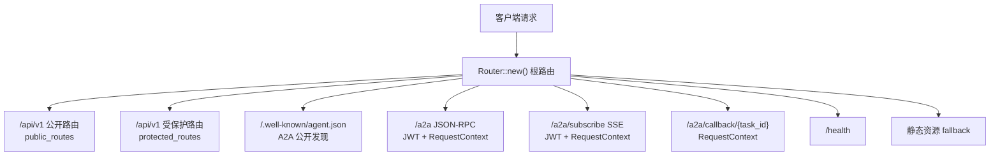
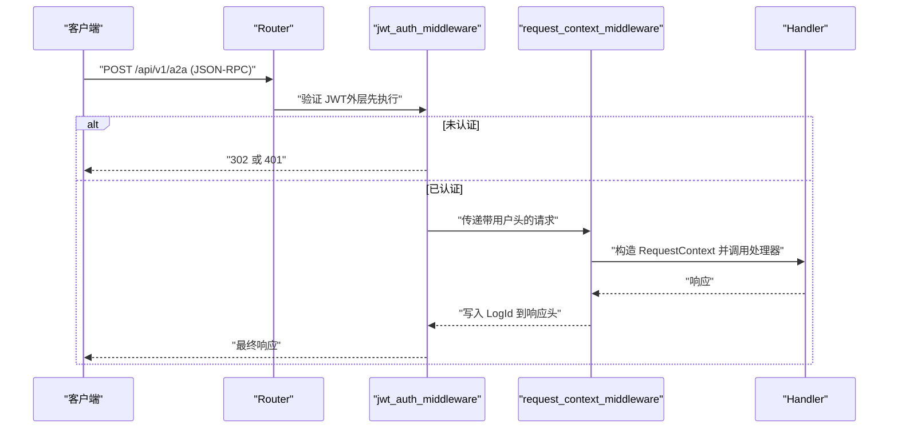
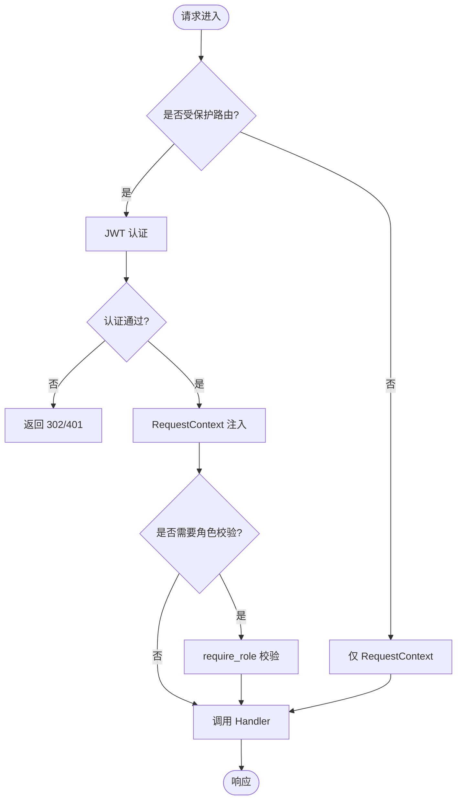
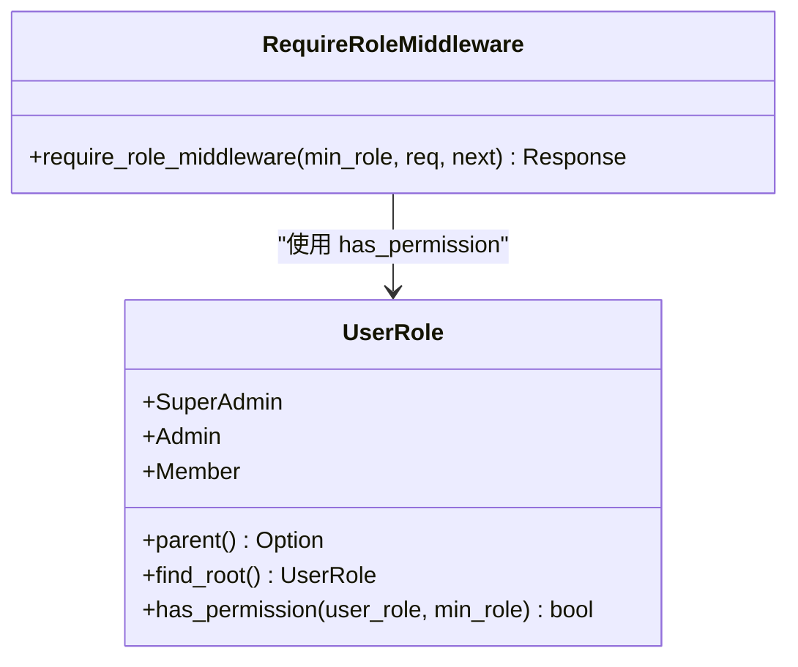
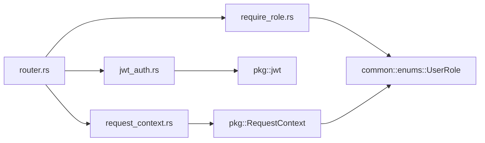

# 路由和中间件

<cite>
**本文引用的文件**
- [src/router.rs](file://src/router.rs)
- [src/middleware/mod.rs](file://src/middleware/mod.rs)
- [src/middleware/jwt_auth.rs](file://src/middleware/jwt_auth.rs)
- [src/middleware/request_context.rs](file://src/middleware/request_context.rs)
- [src/middleware/require_role.rs](file://src/middleware/require_role.rs)
- [src/pkg/request_context.rs](file://src/pkg/request_context.rs)
- [common/src/enums/user.rs](file://common/src/enums/user.rs)
</cite>

## 目录
1. [简介](#简介)
2. [项目结构](#项目结构)
3. [核心组件](#核心组件)
4. [架构总览](#架构总览)
5. [详细组件分析](#详细组件分析)
6. [依赖关系分析](#依赖关系分析)
7. [性能考虑](#性能考虑)
8. [故障排查指南](#故障排查指南)
9. [结论](#结论)
10. [附录：示例与最佳实践](#附录示例与最佳实践)

## 简介
本章节面向 AI Orz 的 HTTP 路由与中间件系统，系统性说明以下要点：
- HTTP 路由配置、URL 模式定义与请求分发机制
- 中间件链设计原理与执行顺序（认证授权、请求上下文、角色权限）
- 错误处理策略与性能优化考量
- 路由注册示例、中间件开发指南与调试技巧
- 如何添加新路由和处理中间件逻辑的实践指引

## 项目结构
路由与中间件的核心位于 src/router.rs 与 src/middleware/*。路由按“公开”“受保护”“A2A协议”等维度分层组织；中间件通过 Axum 的 layer 机制组合为洋葱模型，确保认证、上下文注入、权限校验在正确时机执行。

图表来源
- [src/router.rs:12-59](file://src/router.rs#L12-L59)

章节来源
- [src/router.rs:12-59](file://src/router.rs#L12-L59)

## 核心组件
- 路由层：统一入口 create_router，划分 public_routes、protected_routes，以及 A2A 专用路由。
- 中间件层：
  - JWT 认证中间件：双模式（Cookie/Bearer），失败时区分浏览器重定向与 API 401。
  - 请求上下文中间件：从请求头构建 RequestContext，注入扩展并写回 LogId。
  - 角色权限中间件：基于 UserRole 的继承关系进行最小权限校验。
- 数据与枚举：UserRole 提供 parent/find_root/has_permission 实现并查集式权限判定。

章节来源
- [src/middleware/mod.rs:1-10](file://src/middleware/mod.rs#L1-L10)
- [src/middleware/jwt_auth.rs:1-156](file://src/middleware/jwt_auth.rs#L1-L156)
- [src/middleware/request_context.rs:1-41](file://src/middleware/request_context.rs#L1-L41)
- [src/middleware/require_role.rs:1-39](file://src/middleware/require_role.rs#L1-L39)
- [common/src/enums/user.rs:8-100](file://common/src/enums/user.rs#L8-L100)

## 架构总览
请求进入 Router 后，根据路径选择不同路由组。受保护路由整体挂载了 JWT 认证与 RequestContext 提取；部分子模块（如 /system）额外挂载 require_role 以限制管理员访问。A2A 相关路由按需组合中间件，满足公开发现、JSON-RPC、SSE 与回调的不同安全需求。

图表来源
- [src/router.rs:30-48](file://src/router.rs#L30-L48)
- [src/middleware/jwt_auth.rs:36-87](file://src/middleware/jwt_auth.rs#L36-L87)
- [src/middleware/request_context.rs:20-40](file://src/middleware/request_context.rs#L20-L40)

章节来源
- [src/router.rs:12-59](file://src/router.rs#L12-L59)
- [src/middleware/jwt_auth.rs:36-87](file://src/middleware/jwt_auth.rs#L36-L87)
- [src/middleware/request_context.rs:20-40](file://src/middleware/request_context.rs#L20-L40)

## 详细组件分析

### 路由层设计与 URL 模式
- 分组策略：
  - 公开路由：初始化、登录登出、组织列表等，不要求 JWT。
  - 受保护路由：HR、Finance、System、Organization、Project、Task、User 等，统一要求 JWT。
  - A2A 协议路由：独立于 /api/v1，分别处理 agent.json、JSON-RPC、SSE 订阅与回调。
- URL 模式：
  - RESTful 风格：/projects、/tasks、/artifacts、/message-channels、/mcp-servers、/tools 等。
  - 动态段：{id}、{project_id}、{agent_id}、{organization_id}、{trigger_id}、{version}、{consumer}、{event_id}、{task_id}、{server_id} 等。
  - 特殊路径：/.well-known/agent.json、/a2a、/a2a/subscribe、/a2a/callback/{task_id}。
- 分发机制：
  - 使用 axum 的 route/nest/merge 组合 Router，形成层级化路由树。
  - 通过 .layer 将中间件按“外层先执行、内层后执行”的洋葱模型挂载。

章节来源
- [src/router.rs:61-136](file://src/router.rs#L61-L136)
- [src/router.rs:145-739](file://src/router.rs#L145-L739)

### 中间件链与执行顺序
- 洋葱模型：
  - 外层中间件先执行，包裹内层中间件与 Handler。
  - 受保护路由中，jwt_auth_middleware 在外层，request_context_middleware 在内层，确保先认证再构造上下文。
- 具体顺序：
  - 全局受保护路由：jwt_auth → request_context。
  - /system 子路由：在 protected_routes 基础上再叠加 require_role(UserRole::Admin)。
  - A2A JSON-RPC/SSE：jwt_auth → request_context（与受保护路由一致）。
  - A2A agent.json：仅 request_context（无需 JWT）。
  - A2A callback：仅 request_context（外部 Agent 推送，无需 JWT）。

图表来源
- [src/router.rs:104-136](file://src/router.rs#L104-L136)
- [src/middleware/jwt_auth.rs:36-87](file://src/middleware/jwt_auth.rs#L36-L87)
- [src/middleware/request_context.rs:20-40](file://src/middleware/request_context.rs#L20-L40)
- [src/middleware/require_role.rs:20-38](file://src/middleware/require_role.rs#L20-L38)

章节来源
- [src/router.rs:104-136](file://src/router.rs#L104-L136)
- [src/middleware/jwt_auth.rs:36-87](file://src/middleware/jwt_auth.rs#L36-L87)
- [src/middleware/request_context.rs:20-40](file://src/middleware/request_context.rs#L20-L40)
- [src/middleware/require_role.rs:20-38](file://src/middleware/require_role.rs#L20-L38)

### 认证授权中间件（JWT）
- 双模式提取：
  - Cookie 优先（浏览器场景），否则回退 Authorization: Bearer（API 工具/代码调用）。
- 失败响应：
  - 浏览器请求：302 重定向到登录页。
  - API 请求：401 JSON 错误。
- 成功后续：
  - 将 user_id、username、organization_id、user_role、caller_type 注入请求头，供后续 RequestContext 使用。

章节来源
- [src/middleware/jwt_auth.rs:25-87](file://src/middleware/jwt_auth.rs#L25-L87)
- [src/middleware/jwt_auth.rs:89-156](file://src/middleware/jwt_auth.rs#L89-L156)

### 请求上下文中间件（RequestContext）
- 职责：
  - 从请求头解析 log_id、user_id、username、organization_id、user_role、caller_type。
  - 构建 RequestContext 并通过 Extension 注入请求。
  - 将 log_id 写回响应头，便于链路追踪。
- 构建方式：
  - RequestContext::from_headers 负责解析与构建。
  - 支持 builder/to_builder/enrich_ctx! 宏进行上下文增强与扩展。

章节来源
- [src/middleware/request_context.rs:1-41](file://src/middleware/request_context.rs#L1-L41)
- [src/pkg/request_context.rs:295-356](file://src/pkg/request_context.rs#L295-L356)
- [src/pkg/request_context.rs:582-632](file://src/pkg/request_context.rs#L582-L632)

### 角色权限验证中间件（require_role）
- 权限模型：
  - UserRole 采用并查集式继承：Member → Admin → SuperAdmin（根）。
  - has_permission 从 min_role 向上遍历祖先链，若包含当前用户角色则通过。
- 行为：
  - 读取 RequestContext 中的 user_role，默认 Member。
  - 不满足最小权限要求时返回 403。

图表来源
- [common/src/enums/user.rs:8-100](file://common/src/enums/user.rs#L8-L100)
- [src/middleware/require_role.rs:20-38](file://src/middleware/require_role.rs#L20-L38)

章节来源
- [common/src/enums/user.rs:8-100](file://common/src/enums/user.rs#L8-L100)
- [src/middleware/require_role.rs:20-38](file://src/middleware/require_role.rs#L20-L38)

### 路由注册示例与新增路由步骤
- 新增路由建议步骤：
  1. 在对应业务路由函数（如 hr_routes/finance_routes/system_routes）中添加 route 定义。
  2. 如需权限控制，使用 .layer(require_role_middleware(...)) 限定最小角色。
  3. 若需 RequestContext，确保该路由处于受保护路由组或显式挂载 request_context_middleware。
  4. 编写 handler 并从 RequestContext 获取必要上下文信息。
- 示例参考：
  - 受保护路由组：/api/v1/hr、/api/v1/finance、/api/v1/system、/api/v1/organization、/api/v1/project、/api/v1/tasks、/api/v1/user。
  - A2A 路由：/.well-known/agent.json、/a2a、/a2a/subscribe、/a2a/callback/{task_id}。

章节来源
- [src/router.rs:145-739](file://src/router.rs#L145-L739)

### 中间件开发指南
- 通用模式：
  - 使用 axum::middleware::from_fn 包装异步函数，接收 Request 与 Next。
  - 在中间件中可读取/修改请求头、注入扩展、提前返回响应。
- 注意事项：
  - 顺序至关重要：认证应在上下文之前，权限校验应在上下文之后。
  - 错误处理：区分浏览器与 API 响应，避免泄露敏感信息。
  - 性能：避免重复解析头部，尽量复用 RequestContext。

章节来源
- [src/middleware/jwt_auth.rs:36-87](file://src/middleware/jwt_auth.rs#L36-L87)
- [src/middleware/request_context.rs:20-40](file://src/middleware/request_context.rs#L20-L40)
- [src/middleware/require_role.rs:20-38](file://src/middleware/require_role.rs#L20-L38)

### 调试技巧
- 日志追踪：
  - 检查响应头 LOG_ID，确认 RequestContext 是否正确生成与写回。
  - 查看中间件日志输出（如未认证时的 sys_debug 日志）。
- 断点定位：
  - 在 jwt_auth_middleware 的 extract_token 与 unauthorized_response 处设置断点。
  - 在 require_role_middleware 的 has_permission 判断处观察角色值。
- 模拟请求：
  - 浏览器：携带 Cookie ai_orz_jwt，验证 302 重定向。
  - API：携带 Authorization: Bearer <token>，验证 401/403 响应。

章节来源
- [src/middleware/jwt_auth.rs:89-156](file://src/middleware/jwt_auth.rs#L89-L156)
- [src/middleware/request_context.rs:20-40](file://src/middleware/request_context.rs#L20-L40)
- [src/middleware/require_role.rs:20-38](file://src/middleware/require_role.rs#L20-L38)

## 依赖关系分析
- 路由依赖：
  - router.rs 依赖 handlers 各模块与 middleware 三个中间件。
  - 通过 nest/merge/layer 组合形成完整路由树。
- 中间件依赖：
  - jwt_auth 依赖 pkg::jwt 与 common 常量与错误类型。
  - request_context 依赖 pkg::RequestContext 与 AppConfig。
  - require_role 依赖 pkg::RequestContext 与 common::enums::UserRole。
- 数据依赖：
  - UserRole 提供权限判定方法，被 require_role 使用。
  - RequestContext 提供上下文字段与方法，被所有中间件与 Handler 使用。

图表来源
- [src/router.rs:1-10](file://src/router.rs#L1-L10)
- [src/middleware/jwt_auth.rs:1-18](file://src/middleware/jwt_auth.rs#L1-L18)
- [src/middleware/request_context.rs:1-15](file://src/middleware/request_context.rs#L1-L15)
- [src/middleware/require_role.rs:1-15](file://src/middleware/require_role.rs#L1-L15)
- [common/src/enums/user.rs:8-100](file://common/src/enums/user.rs#L8-L100)

章节来源
- [src/router.rs:1-10](file://src/router.rs#L1-L10)
- [src/middleware/jwt_auth.rs:1-18](file://src/middleware/jwt_auth.rs#L1-L18)
- [src/middleware/request_context.rs:1-15](file://src/middleware/request_context.rs#L1-L15)
- [src/middleware/require_role.rs:1-15](file://src/middleware/require_role.rs#L1-L15)
- [common/src/enums/user.rs:8-100](file://common/src/enums/user.rs#L8-L100)

## 性能考虑
- 中间件顺序优化：
  - 将昂贵的认证放在外层尽早失败，减少无效处理。
  - RequestContext 构建轻量，适合内层执行。
- 头部解析：
  - 避免重复解析相同头部，利用 RequestContext 缓存。
- 响应头写入：
  - 仅在必要时写入 LOG_ID，减少 IO。
- 路由匹配：
  - 使用 nest/merge 组织路由，提升匹配效率。

[本节为通用指导，不直接分析具体文件]

## 故障排查指南
- 401 未认证：
  - 检查 Cookie 或 Authorization 头是否正确携带。
  - 查看 jwt_auth_middleware 的日志输出。
- 403 权限不足：
  - 确认 RequestContext 中的 user_role 是否正确注入。
  - 检查 require_role_middleware 的最小权限要求。
- 缺少 LOG_ID：
  - 确认 request_context_middleware 是否执行成功。
  - 检查响应头是否写回 LOG_ID。

章节来源
- [src/middleware/jwt_auth.rs:89-156](file://src/middleware/jwt_auth.rs#L89-L156)
- [src/middleware/require_role.rs:20-38](file://src/middleware/require_role.rs#L20-L38)
- [src/middleware/request_context.rs:20-40](file://src/middleware/request_context.rs#L20-L40)

## 结论
AI Orz 的路由与中间件系统通过清晰的层次划分与严格的执行顺序，实现了安全的认证授权、统一的请求上下文与灵活的权限控制。借助 Axum 的 layer 机制与 RequestContext 的扩展能力，开发者可以高效地添加新路由与中间件，同时保持系统的可维护性与可扩展性。

[本节为总结，不直接分析具体文件]

## 附录：示例与最佳实践
- 添加新路由示例：
  - 在对应路由函数中添加 route 定义，如 /api/v1/projects/{id}/status。
  - 如需权限控制，使用 .layer(require_role_middleware(UserRole::Admin, req, next))。
- 中间件开发最佳实践：
  - 明确中间件职责，单一职责原则。
  - 合理处理错误，区分浏览器与 API 响应。
  - 避免在中间件中执行耗时操作，必要时异步化。
- 调试技巧：
  - 使用 LOG_ID 追踪请求链路。
  - 在关键中间件处打印日志，观察执行顺序与状态。

章节来源
- [src/router.rs:145-739](file://src/router.rs#L145-L739)
- [src/middleware/jwt_auth.rs:36-87](file://src/middleware/jwt_auth.rs#L36-L87)
- [src/middleware/request_context.rs:20-40](file://src/middleware/request_context.rs#L20-L40)
- [src/middleware/require_role.rs:20-38](file://src/middleware/require_role.rs#L20-L38)