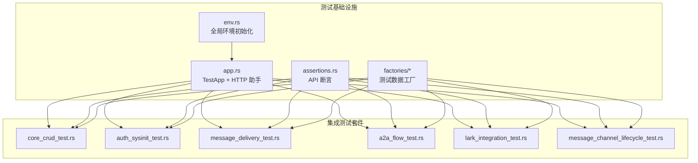
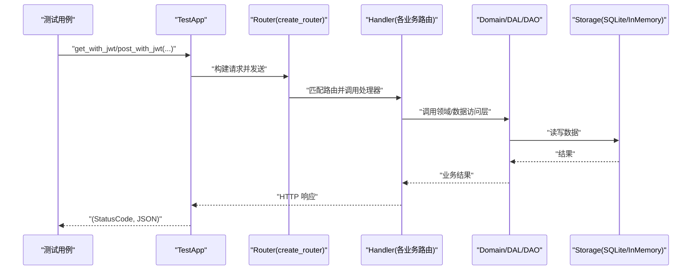
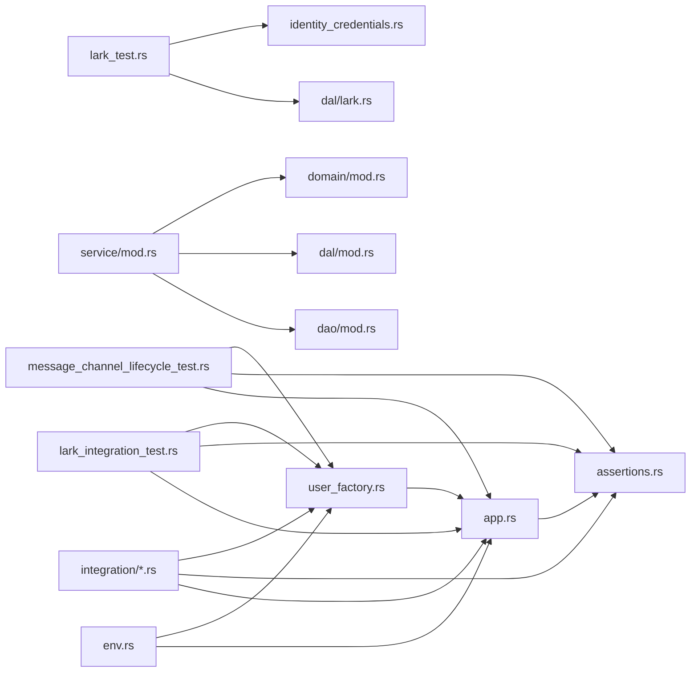
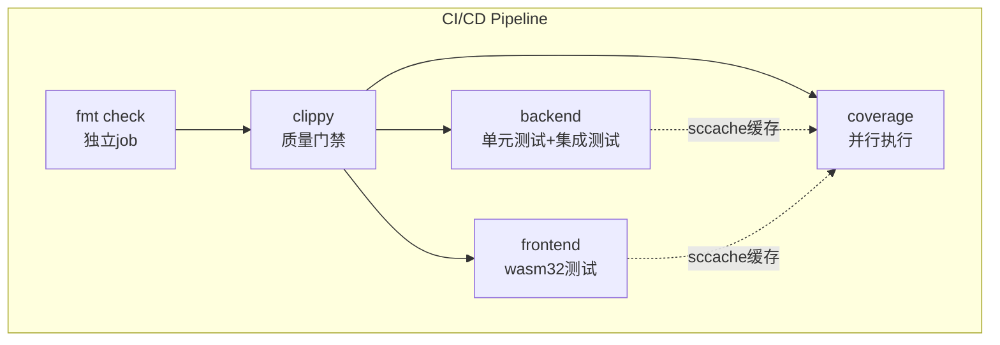

# 测试指南

<cite>
**本文引用的文件**
- [Cargo.toml](file://Cargo.toml)
- [tests/common/mod.rs](file://tests/common/mod.rs)
- [tests/common/env.rs](file://tests/common/env.rs)
- [tests/common/app.rs](file://tests/common/app.rs)
- [tests/common/assertions.rs](file://tests/common/assertions.rs)
- [tests/common/factories/mod.rs](file://tests/common/factories/mod.rs)
- [tests/common/factories/user_factory.rs](file://tests/common/factories/user_factory.rs)
- [tests/integration/core_crud_test.rs](file://tests/integration/core_crud_test.rs)
- [tests/integration/auth_sysinit_test.rs](file://tests/integration/auth_sysinit_test.rs)
- [tests/integration/lark_integration_test.rs](file://tests/integration/lark_integration_test.rs)
- [tests/integration/message_channel_lifecycle_test.rs](file://tests/integration/message_channel_lifecycle_test.rs)
- [src/service/dal/lark_test.rs](file://src/service/dal/lark_test.rs)
- [common/src/models/identity_credentials.rs](file://common/src/models/identity_credentials.rs)
- [src/pkg/lark_integration.rs](file://src/pkg/lark_integration.rs)
- [common/src/api/lark_integration.rs](file://common/src/api/lark_integration.rs)
- [.github/workflows/rust.yml](file://.github/workflows/rust.yml)
- [docs/design/testing_guidelines.md](file://docs/design/testing_guidelines.md)
- [src/service/domain/message/delivery_test.rs](file://src/service/domain/message/delivery_test.rs)
- [src/service/mod.rs](file://src/service/mod.rs)
- [src/service/dao/mod.rs](file://src/service/dao/mod.rs)
- [src/service/dal/mod.rs](file://src/service/dal/mod.rs)
- [src/service/domain/mod.rs](file://src/service/domain/mod.rs)
- [src/service/dao/a2a_callback/http.rs](file://src/service/dao/a2a_callback/http.rs)
- [src/service/dao/user/sqlite.rs](file://src/service/dao/user/sqlite.rs)
</cite>

## 更新摘要
**所做更改**
- 新增测试基础设施改进说明，包括显式的依赖初始化顺序和统一的测试环境设置函数
- 更新了服务层初始化流程，强调 service::init() 替代手动 30+ 个 init 调用
- 增强了 DAO/DAL/Domain 层的初始化顺序说明，解决 CI 中的单例初始化问题
- 新增了 UserDao 和 a2a_callback 的正确初始化策略
- 扩展了测试环境隔离机制，使用 tokio::sync::OnceCell 确保串行化初始化

## 目录
1. [简介](#简介)
2. [项目结构](#项目结构)
3. [核心组件](#核心组件)
4. [架构总览](#架构总览)
5. [详细组件分析](#详细组件分析)
6. [依赖关系分析](#依赖关系分析)
7. [性能与覆盖率](#性能与覆盖率)
8. [故障排查与调试](#故障排查与调试)
9. [结论](#结论)
10. [附录](#附录)

## 简介
本指南面向 AI Orz 的开发者，提供从单元测试、集成测试到端到端（E2E）测试的完整策略与实践。内容涵盖：
- 测试框架与运行方式
- 测试数据准备与工厂化
- Mock 策略与外部依赖隔离
- 断言方法与响应校验
- 覆盖率要求与 CI/CD 集成
- 性能测试方法、最佳实践与常见问题定位

**更新** 测试基础设施得到显著改进，包括显式的依赖初始化顺序、统一的测试环境设置函数 init_test_env，以及多个模块中 UserDao 和 a2a_callback 的正确初始化，解决了 CI 中的单例初始化问题。

## 项目结构
AI Orz 的测试体系由三层组成：
- 单元测试：位于源码模块内或独立 lib 测试，使用内存数据库和最小依赖，快速验证内部逻辑。
- 集成测试：位于 tests/integration，通过 HTTP 调用真实路由，验证 Adapter → Domain → DAL → DAO 全链路。
- E2E 测试：基于 HTTP 的端到端场景（如认证初始化、消息投递、SSE/Webhook 推送），在共享全局 DB 上以唯一 ID 隔离数据。



**图表来源**
- [tests/common/env.rs:25-87](file://tests/common/env.rs#L25-L87)
- [tests/common/app.rs:16-289](file://tests/common/app.rs#L16-L289)
- [tests/common/assertions.rs:1-46](file://tests/common/assertions.rs#L1-L46)
- [tests/common/factories/user_factory.rs:70-178](file://tests/common/factories/user_factory.rs#L70-L178)
- [tests/integration/lark_integration_test.rs:1-289](file://tests/integration/lark_integration_test.rs#L1-L289)
- [tests/integration/message_channel_lifecycle_test.rs:1-208](file://tests/integration/message_channel_lifecycle_test.rs#L1-L208)

**章节来源**
- [tests/common/mod.rs:1-19](file://tests/common/mod.rs#L1-L19)
- [tests/common/env.rs:1-88](file://tests/common/env.rs#L1-L88)
- [tests/common/app.rs:1-289](file://tests/common/app.rs#L1-L289)
- [tests/common/assertions.rs:1-46](file://tests/common/assertions.rs#L1-L46)
- [tests/common/factories/mod.rs:1-15](file://tests/common/factories/mod.rs#L1-L15)

## 核心组件
- 全局环境初始化（env.rs）
  - 一次性初始化配置、存储、JWT、工具注册、服务层单例、生产者/消费者与基础数据注入。
  - 使用 OnceCell 串行化，避免并行测试竞争；所有集成测试共享全局 Storage 单例，通过唯一 ID 隔离数据。
- HTTP 测试应用（app.rs）
  - TestApp 封装 axum Router，提供 get/post/put/delete 等带 JWT 的请求方法。
  - 支持 SSE 事件收集，便于端到端流式场景验证。
- API 断言（assertions.rs）
  - assert_api_ok / assert_api_error 统一校验 HTTP 状态码与业务 code 字段，返回 data 以便进一步断言。
- 测试数据工厂（factories/*）
  - bootstrap_system/bootstrap_and_login：通过真实 API 创建组织、管理员、聊天模型提供者并登录获取 JWT。
  - create_test_agent/create_test_project：便捷创建业务实体，减少样板代码。

**更新** 新增了统一的测试环境设置函数 init_full_test_env，通过 service::init() 一行替代 30+ 个手动 init 调用，确保 DAO/DAL/Domain 层的正确初始化顺序。

**章节来源**
- [tests/common/env.rs:25-87](file://tests/common/env.rs#L25-L87)
- [tests/common/app.rs:16-289](file://tests/common/app.rs#L16-L289)
- [tests/common/assertions.rs:1-46](file://tests/common/assertions.rs#L1-L46)
- [tests/common/factories/user_factory.rs:70-178](file://tests/common/factories/user_factory.rs#L70-L178)

## 架构总览
集成测试的典型请求流程如下：



**更新** 测试环境现在使用统一的 init_full_test_env 函数，确保正确的依赖初始化顺序：配置 → 存储 → JWT → 工具注册 → 服务层初始化 → 生产者/消费者 → 基础数据注入。

**图表来源**
- [tests/common/app.rs:16-289](file://tests/common/app.rs#L16-L289)
- [tests/common/env.rs:25-87](file://tests/common/env.rs#L25-L87)

**章节来源**
- [tests/common/app.rs:16-289](file://tests/common/app.rs#L16-L289)
- [tests/common/env.rs:25-87](file://tests/common/env.rs#L25-L87)

## 详细组件分析

### 单元测试策略
- 目标：快速验证内部逻辑，不依赖外部系统。
- 实现要点：
  - 使用内存数据库与最小依赖，确保测试隔离与速度。
  - 对需要外部依赖的接口，采用 Mock 对象替换真实实现（例如 MockModelProviderDao/MockCortexDao）。
- 示例参考：
  - 在消息投递相关单元测试中，通过自定义 Mock 实现跳过向量搜索路径，保证测试稳定且快速。

**更新** 新增了飞书集成的单元测试，覆盖凭证解析、渠道定位和监听生命周期等核心路径。

**章节来源**
- [src/service/domain/message/delivery_test.rs:23-69](file://src/service/domain/message/delivery_test.rs#L23-L69)
- [src/service/dal/lark_test.rs:1-283](file://src/service/dal/lark_test.rs#L1-L283)

### 集成测试策略
- 目标：通过 HTTP 端到端验证 Adapter → Domain → DAL → DAO 全链路。
- 关键设计：
  - 使用 init_full_test_env 一次性初始化全局环境，后续测试复用。
  - 通过 TestApp 发起带 JWT 的请求，模拟真实客户端行为。
  - 使用 assert_api_ok/assert_api_error 统一断言响应格式。
- 典型场景：
  - 认证与系统初始化：验证组织创建、管理员登录、受保护路由鉴权。
  - 核心 CRUD：Agent/Project/Task 的创建、更新、删除与状态流转。
  - 消息投递与 SSE/Webhook：验证持久化、流式推送与失败聚合。

**更新** 新增了飞书集成的集成测试，覆盖以下场景：
- 无 CLI 配置时的引导性错误处理
- 凭证-渠道引用生命周期管理
- OAuth 认证流程的降级处理
- 连接测试的结构化失败响应

**章节来源**
- [tests/integration/auth_sysinit_test.rs:1-28](file://tests/integration/auth_sysinit_test.rs#L1-L28)
- [tests/integration/core_crud_test.rs:1-337](file://tests/integration/core_crud_test.rs#L1-L337)
- [tests/integration/lark_integration_test.rs:1-289](file://tests/integration/lark_integration_test.rs#L1-L289)
- [tests/integration/message_channel_lifecycle_test.rs:1-208](file://tests/integration/message_channel_lifecycle_test.rs#L1-L208)
- [tests/common/app.rs:16-289](file://tests/common/app.rs#L16-L289)
- [tests/common/assertions.rs:1-46](file://tests/common/assertions.rs#L1-L46)

### 端到端测试策略
- 目标：覆盖用户视角的关键业务流程，包括认证、初始化、消息推送等。
- 实现要点：
  - 使用 bootstrap_system/bootstrap_and_login 建立测试上下文（组织、管理员、JWT）。
  - 通过 TestApp 的 SSE 收集方法验证流式事件内容与顺序。
  - 使用唯一 ID 隔离不同测试的数据，避免共享 DB 上的干扰。

**更新** 飞书集成的端到端测试特别关注无 CLI 环境下的用户体验，确保所有操作都能返回友好的引导信息。

**章节来源**
- [tests/common/factories/user_factory.rs:70-178](file://tests/common/factories/user_factory.rs#L70-L178)
- [tests/common/app.rs:199-289](file://tests/common/app.rs#L199-L289)

### Mock 策略与外部依赖隔离
- 原则：
  - 对慢速或外部依赖（如向量模型、网络请求）进行 Mock 或降级，确保测试稳定与快速。
  - 在单元测试中使用 Mock 实现接口，在集成测试中通过配置跳过外部依赖（如 embedding_model: None）。
- 示例：
  - 单元测试中通过 MockModelProviderDao/MockCortexDao 跳过向量搜索。
  - 集成测试中 bootstrap_system 传 embedding_model: None，避免触发 FastEmbed 模型加载。

**更新** 飞书集成测试采用了特殊的降级策略：当检测到无 lark-cli 二进制或未配置时，返回引导性错误而非抛出异常，确保测试在不同环境下都能稳定运行。

**章节来源**
- [src/service/domain/message/delivery_test.rs:23-69](file://src/service/domain/message/delivery_test.rs#L23-L69)
- [tests/common/factories/user_factory.rs:70-178](file://tests/common/factories/user_factory.rs#L70-L178)
- [tests/integration/lark_integration_test.rs:16-112](file://tests/integration/lark_integration_test.rs#L16-L112)

### 断言方法与响应校验
- 统一断言：
  - assert_api_ok：校验 HTTP 200 与业务 code=0，返回 data 用于进一步断言。
  - assert_api_error：校验预期错误状态与非零 code。
- 建议：
  - 所有集成测试统一使用上述断言，避免分散的断言逻辑。
  - 对复杂响应结构，优先断言关键字段（如 id、status、name）。

**更新** 飞书集成测试增加了特殊的断言规则：
- 验证响应中绝不包含 secret 明文
- 检查引导性错误的 message 字段不为空
- 确认降级响应的 logged_in 字段为 false

**章节来源**
- [tests/common/assertions.rs:1-46](file://tests/common/assertions.rs#L1-L46)
- [tests/integration/lark_integration_test.rs:31-98](file://tests/integration/lark_integration_test.rs#L31-L98)
- [tests/integration/message_channel_lifecycle_test.rs:101-152](file://tests/integration/message_channel_lifecycle_test.rs#L101-L152)

### 测试数据准备与工厂化
- 工厂函数：
  - bootstrap_system/bootstrap_and_login：创建组织、管理员、聊天提供者并登录。
  - create_test_agent/create_test_project：便捷创建业务实体。
- 优势：
  - 减少重复代码，提高测试可读性。
  - 集中管理测试数据构造逻辑，便于维护与扩展。

**更新** 新增了飞书集成专用的测试数据准备方法：
- seed_user_lark_credential：直接写入 users.identity_credentials JSON 列
- 支持明文直通兼容：解密路径对未加密值原样返回
- 提供凭证引用关系的完整生命周期测试数据

**章节来源**
- [tests/common/factories/user_factory.rs:70-178](file://tests/common/factories/user_factory.rs#L70-L178)
- [tests/common/factories/mod.rs:1-15](file://tests/common/factories/mod.rs#L1-L15)
- [tests/integration/message_channel_lifecycle_test.rs:22-50](file://tests/integration/message_channel_lifecycle_test.rs#L22-L50)

### 飞书集成测试策略
- 目标：覆盖飞书集成的核心功能，包括凭证管理、认证流程和渠道生命周期。
- 关键设计：
  - 在无 lark-cli 环境下测试引导性错误处理
  - 验证凭证-渠道引用关系的完整性
  - 测试 OAuth device flow 的降级处理
  - 确保敏感信息（secret）不会泄露到响应中
- 典型场景：
  - 无 CLI 配置时的 auth/bind 端点引导错误
  - 凭证创建、更新、删除的生命周期
  - 渠道引用关系的建立与解除
  - 连接测试的结构化失败响应

**章节来源**
- [tests/integration/lark_integration_test.rs:1-289](file://tests/integration/lark_integration_test.rs#L1-L289)
- [tests/integration/message_channel_lifecycle_test.rs:1-208](file://tests/integration/message_channel_lifecycle_test.rs#L1-L208)
- [src/service/dal/lark_test.rs:1-283](file://src/service/dal/lark_test.rs#L1-L283)

### 测试基础设施改进
- **统一的测试环境设置**：
  - init_full_test_env 函数提供一致的初始化流程
  - 使用 tokio::sync::OnceCell 确保串行化初始化
  - 所有集成测试共享同一个全局 Storage 单例
- **显式的依赖初始化顺序**：
  - 配置 → 存储 → JWT → 工具注册 → 服务层 → 生产者/消费者 → 基础数据
  - service::init() 一行替代 30+ 个手动 init 调用
  - 确保 DAO → DAL → Domain 的正确初始化顺序
- **单例初始化问题解决**：
  - UserDao 和 a2a_callback 的正确初始化
  - 解决 CI 中的单例初始化竞争条件
  - 幂等的 init_* 函数支持多次调用

**章节来源**
- [tests/common/env.rs:25-87](file://tests/common/env.rs#L25-L87)
- [src/service/mod.rs:6-28](file://src/service/mod.rs#L6-L28)
- [src/service/dao/mod.rs:29-56](file://src/service/dao/mod.rs#L29-L56)
- [src/service/dal/mod.rs:54-76](file://src/service/dal/mod.rs#L54-L76)

## 依赖关系分析
测试基础设施之间的依赖关系如下：



**更新** 新增了服务层初始化的依赖关系，展示了 service::init() 如何协调 DAO、DAL 和 Domain 层的初始化顺序。

**图表来源**
- [tests/common/env.rs:25-87](file://tests/common/env.rs#L25-L87)
- [tests/common/app.rs:16-289](file://tests/common/app.rs#L16-L289)
- [tests/common/factories/user_factory.rs:70-178](file://tests/common/factories/user_factory.rs#L70-L178)
- [tests/integration/lark_integration_test.rs:1-289](file://tests/integration/lark_integration_test.rs#L1-L289)
- [tests/integration/message_channel_lifecycle_test.rs:1-208](file://tests/integration/message_channel_lifecycle_test.rs#L1-L208)
- [src/service/dal/lark_test.rs:1-283](file://src/service/dal/lark_test.rs#L1-L283)
- [common/src/models/identity_credentials.rs:1-234](file://common/src/models/identity_credentials.rs#L1-L234)
- [src/service/mod.rs:6-28](file://src/service/mod.rs#L6-L28)

**章节来源**
- [tests/common/mod.rs:1-19](file://tests/common/mod.rs#L1-L19)

## 性能与覆盖率

### CI/CD 管道优化

**已实现的优化措施：**

#### 并行化作业执行
- **格式检查（fmt）**：独立 job，秒级返回，纯文本检查不阻塞后续步骤
- **Clippy 检查**：安装 protobuf 依赖后执行严格的质量门禁
- **后端测试**：单元测试 + 集成测试并行执行
- **前端测试**：wasm32 clippy + 前端测试独立运行
- **覆盖率检查**：与后端/前端测试并行执行，移出关键路径

#### sccache 缓存优化
- **跨 Job 共享缓存**：所有 job 共享同一个 sccache 缓存，按内容寻址复用编译产物
- **增量编译禁用**：禁用 incremental compilation 让 sccache 完全接管缓存
- **缓存键策略**：基于 `**/Cargo.lock` 哈希值生成缓存键
- **预构建二进制缓存**：ort-sys 预构建二进制文件缓存

#### 差异化覆盖率阈值
- **Main 分支推送**：45% 覆盖率门槛（严格模式）
- **Pull Request**：38% 覆盖率门槛（警告模式）
- **GitHub Actions Summary**：覆盖率摘要直接写入运行摘要页面

#### 依赖管理优化
- **Protobuf 依赖**：显式安装 `protobuf-compiler` 和 `libprotobuf-dev`
- **依赖库缓存**：lance-encoding 所需的 well-known types 正确解析
- **构建脚本优化**：避免 empty.proto not found 错误



**图表来源**
- [.github/workflows/rust.yml:16-295](file://.github/workflows/rust.yml#L16-L295)

### 覆盖率统计与报告

#### 覆盖率收集流程
1. **测试执行阶段**：使用 `cargo llvm-cov --workspace --tests --no-clean --no-fail-fast`
2. **报告生成阶段**：仅输出文本表格到日志 + 摘要到 GitHub Actions Summary
3. **阈值检查**：根据触发事件动态设置 fail-under-lines 阈值
4. **摘要输出**：将覆盖率摘要写入 GitHub Actions Summary 页面

**更新** 移除了 lcov.info 和 HTML 报告生成步骤，简化了覆盖率报告流程，专注于核心的覆盖率数据和阈值检查。

#### 忽略规则配置
- 过滤测试脚手架：`tests/common/`
- 过滤依赖库：`/cargo/registry/`、`/rustc/`
- 过滤构建脚本：`build.rs`、`target/`

**章节来源**
- [.github/workflows/rust.yml:176-295](file://.github/workflows/rust.yml#L176-L295)
- [docs/design/testing_guidelines.md:388-396](file://docs/design/testing_guidelines.md#L388-L396)

### 本地开发优化

#### 推荐的本地测试命令
```bash
# 快速单元测试
cargo test --lib

# 完整集成测试
cargo test --test '*'

# 飞书集成测试
cargo test --test lark_integration_test
cargo test --test message_channel_lifecycle_test

# 覆盖率统计（本地）
cargo llvm-cov --workspace --tests --no-clean --no-fail-fast

# 格式化检查
cargo fmt --all -- --check

# Clippy 检查
cargo clippy --all-targets -- -D warnings
```

#### 性能优化技巧
- **启用 sccache**：配置环境变量 `RUSTC_WRAPPER=sccache`
- **并行测试执行**：使用 `cargo test --jobs N` 控制并行度
- **选择性测试**：使用 `--test` 参数运行特定测试套件
- **增量构建**：利用 sccache 缓存跨次构建的编译产物

**章节来源**
- [.github/workflows/rust.yml:42-74](file://.github/workflows/rust.yml#L42-L74)
- [.github/workflows/rust.yml:90-129](file://.github/workflows/rust.yml#L90-L129)

## 故障排查与调试

### 常见问题与解决方案

#### CI/CD 相关问题
- **Protobuf 依赖缺失**：确保安装 `protobuf-compiler` 和 `libprotobuf-dev`
- **sccache 缓存失效**：检查缓存键是否基于 Cargo.lock 哈希
- **覆盖率阈值失败**：确认分支类型和对应的阈值配置

#### 测试执行问题
- **并行测试竞争**：通过 OnceCell 串行化初始化解决
- **外部依赖干扰**：通过 embedding_model: None 跳过向量模型加载
- **SSE 流式响应**：使用 TestApp::get_with_jwt_collect_sse_events 收集事件并断言

**更新** 测试基础设施改进后的常见问题：
- **单例初始化顺序**：确保 service::init() 在测试开始前正确调用
- **DAO/DAL/Domain 依赖**：遵循正确的初始化顺序，避免循环依赖
- **全局存储隔离**：使用临时目录避免污染开发环境

#### 构建性能问题
- **编译时间过长**：启用 sccache 并利用缓存
- **依赖下载缓慢**：配置镜像源或使用预构建二进制
- **内存不足**：调整并行度限制

### 调试技巧

#### 日志输出
- **测试日志**：使用 `--verbose` 参数获取详细输出
- **sccache 统计**：通过 `sccache --show-stats` 查看缓存命中率
- **覆盖率详情**：查看 GitHub Actions Summary 页面的覆盖率摘要

**更新** 测试基础设施改进后的调试技巧：
- **初始化顺序验证**：检查 env.rs 中的初始化步骤是否正确执行
- **单例状态监控**：通过 OnceLock 状态检查依赖初始化情况
- **存储隔离验证**：确认临时目录正确创建和使用

#### 性能分析
- **测试耗时分析**：识别慢测试用例并优化
- **构建时间分析**：分析依赖编译瓶颈
- **内存使用分析**：监控测试执行过程中的内存占用

**章节来源**
- [tests/common/env.rs:25-87](file://tests/common/env.rs#L25-L87)
- [tests/common/app.rs:199-289](file://tests/common/app.rs#L199-L289)
- [tests/integration/lark_integration_test.rs:16-112](file://tests/integration/lark_integration_test.rs#L16-L112)
- [src/pkg/lark_integration.rs:147-156](file://src/pkg/lark_integration.rs#L147-L156)
- [.github/workflows/rust.yml:68-74](file://.github/workflows/rust.yml#L68-L74)

## 结论
AI Orz 的测试体系通过分层设计（单元、集成、E2E）、统一的测试基础设施（env/app/assertions/factories）与严格的 CI/CD 质量门禁，确保了代码质量与开发效率。最新的测试基础设施改进包括统一的测试环境设置函数、显式的依赖初始化顺序和单例初始化问题的解决，显著提升了测试的稳定性和可维护性。

**更新** 新增的测试基础设施改进通过 service::init() 一行替代 30+ 个手动 init 调用，确保 DAO/DAL/Domain 层的正确初始化顺序，解决了 CI 中的单例初始化问题。同时，tokio::sync::OnceCell 的使用确保了串行化初始化，避免了并行测试竞争。

## 附录

### 测试规范文档
- [docs/testing_guidelines.md](file://docs/design/testing_guidelines.md)

### CI/CD 配置
- [.github/workflows/rust.yml](file://.github/workflows/rust.yml)

### 测试入口与依赖
- [Cargo.toml](file://Cargo.toml)

### 相关工具链
- **cargo-llvm-cov**：覆盖率统计工具
- **sccache**：编译缓存加速
- **protobuf**：协议缓冲区编译器
- **clippy**：Rust 代码质量检查器

**最后更新**：2026-08-12  
**维护者**：AI Orz 开发团队