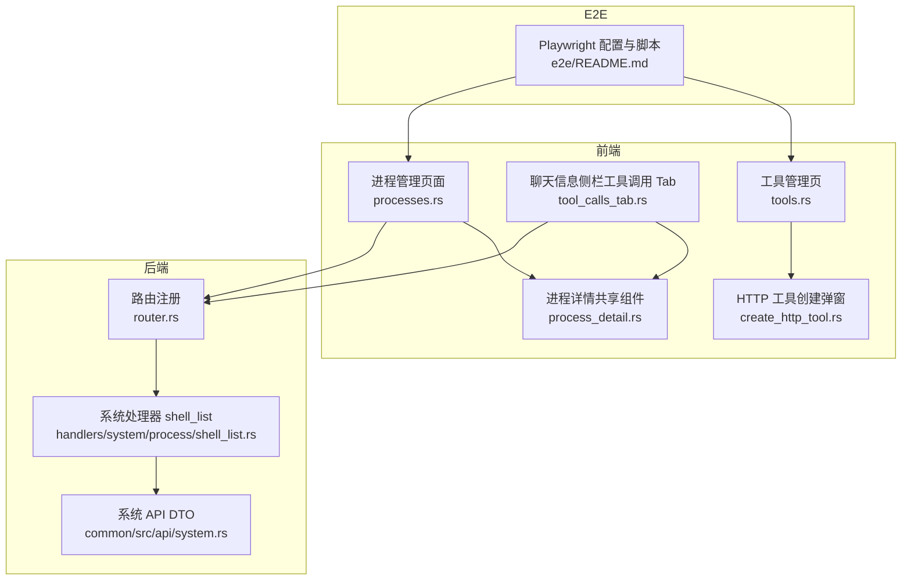
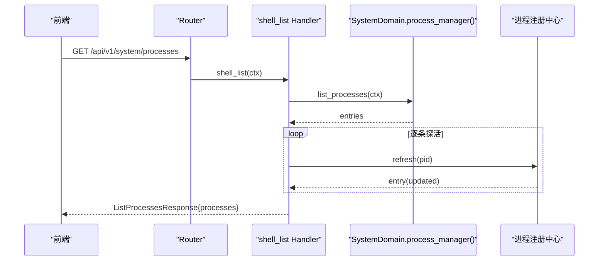
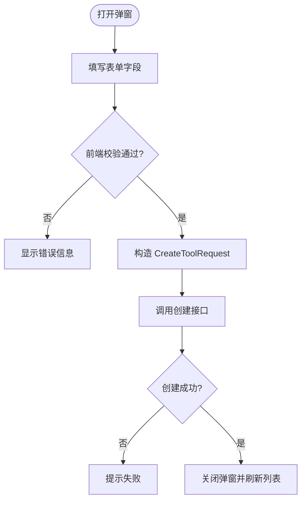
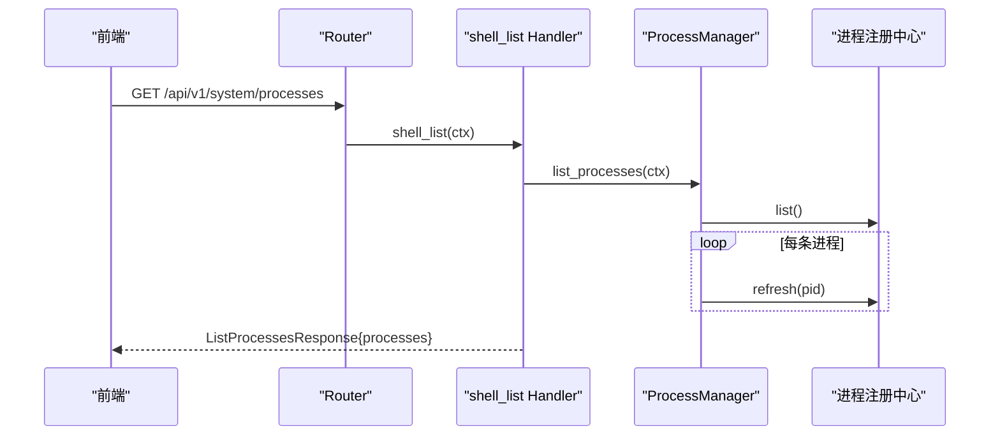
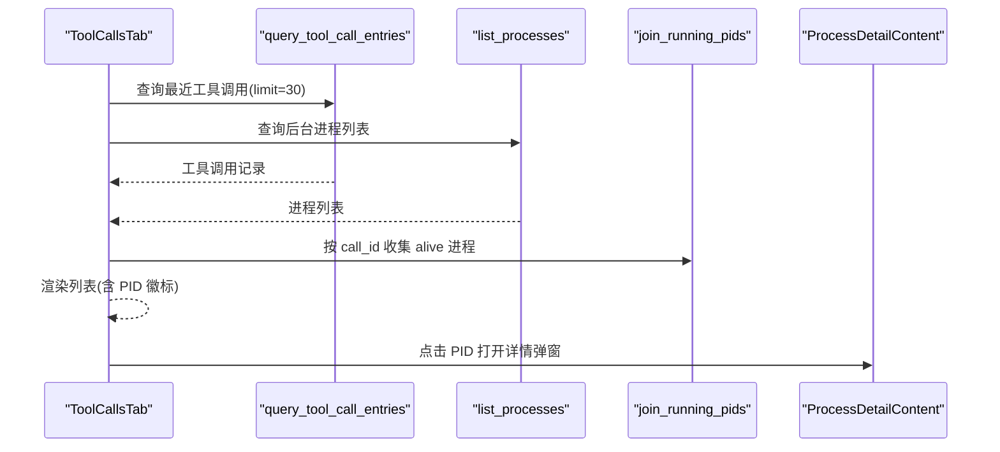
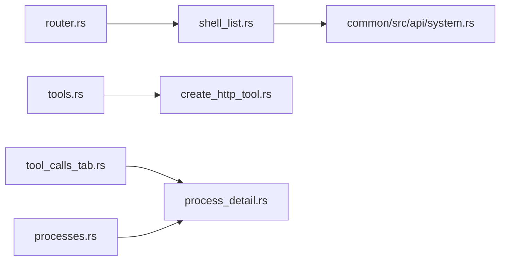

# 端到端测试基础设施

<cite>
**本文引用的文件**
- [common/src/api/system.rs](file://common/src/api/system.rs)
- [src/handlers/system/process/shell_list.rs](file://src/handlers/system/process/shell_list.rs)
- [frontend/src/pages/finance/tools.rs](file://frontend/src/pages/finance/tools.rs)
- [frontend/src/components/create_http_tool.rs](file://frontend/src/components/create_http_tool.rs)
- [frontend/src/components/chat/tool_calls_tab.rs](file://frontend/src/components/chat/tool_calls_tab.rs)
- [frontend/src/pages/system/processes.rs](file://frontend/src/pages/system/processes.rs)
- [frontend/src/components/process_detail.rs](file://frontend/src/components/process_detail.rs)
- [src/router.rs](file://src/router.rs)
- [e2e/README.md](file://e2e/README.md)
- [docs/design/browser_e2e_test_design.md](file://docs/design/browser_e2e_test_design.md)
</cite>

## 目录
1. [简介](#简介)
2. [项目结构](#项目结构)
3. [核心组件](#核心组件)
4. [架构总览](#架构总览)
5. [详细组件分析](#详细组件分析)
6. [依赖关系分析](#依赖关系分析)
7. [性能与可观测性](#性能与可观测性)
8. [故障排查指南](#故障排查指南)
9. [结论](#结论)
10. [附录](#附录)

## 简介
本仓库围绕“端到端测试基础设施”的目标，补齐了前端体验闭环：HTTP 工具创建表单、后台进程管理页面（列表 + 弹窗详情）、以及聊天侧栏的“工具调用”Tab。后端新增进程列表接口（shell_list）并以 HTTP + LLM 工具双露形式暴露，配合统一的进程详情组件，形成“工具调用—后台进程—日志”的可观测链路。E2E 工程提供本地回归能力，通过 Playwright 驱动浏览器执行导航巡检与冒烟用例，保障前后端协议一致性与交互稳定性。

## 项目结构
本次改动涉及前后端多处协作：
- 前端新增/增强页面与组件：工具管理页增加创建入口与弹窗表单；聊天信息侧栏新增“工具调用”Tab；通用 Modal 组件复用；新增进程管理页面与共享进程详情组件。
- 后端新增系统域进程列表接口（shell_list），并通过路由暴露；HTTP 工具运行时负责配置校验与执行。
- E2E 工程以 Playwright 为核心，提供独立端口启动、隔离数据目录、登录态初始化与路由巡检。

**图表来源**
- [src/router.rs:175-188](file://src/router.rs#L175-L188)
- [src/handlers/system/process/shell_list.rs:10-49](file://src/handlers/system/process/shell_list.rs#L10-L49)
- [common/src/api/system.rs:240-278](file://common/src/api/system.rs#L240-L278)
- [frontend/src/pages/finance/tools.rs:114-123](file://frontend/src/pages/finance/tools.rs#L114-L123)
- [frontend/src/components/create_http_tool.rs:144-188](file://frontend/src/components/create_http_tool.rs#L144-L188)
- [frontend/src/components/chat/tool_calls_tab.rs:78-163](file://frontend/src/components/chat/tool_calls_tab.rs#L78-L163)
- [frontend/src/pages/system/processes.rs:33-65](file://frontend/src/pages/system/processes.rs#L33-L65)
- [frontend/src/components/process_detail.rs:28-79](file://frontend/src/components/process_detail.rs#L28-L79)
- [e2e/README.md:1-43](file://e2e/README.md#L1-L43)

**章节来源**
- [src/router.rs:175-188](file://src/router.rs#L175-L188)
- [src/handlers/system/process/shell_list.rs:10-49](file://src/handlers/system/process/shell_list.rs#L10-L49)
- [common/src/api/system.rs:240-278](file://common/src/api/system.rs#L240-L278)
- [frontend/src/pages/finance/tools.rs:114-123](file://frontend/src/pages/finance/tools.rs#L114-L123)
- [frontend/src/components/create_http_tool.rs:144-188](file://frontend/src/components/create_http_tool.rs#L144-L188)
- [frontend/src/components/chat/tool_calls_tab.rs:78-163](file://frontend/src/components/chat/tool_calls_tab.rs#L78-L163)
- [frontend/src/pages/system/processes.rs:33-65](file://frontend/src/pages/system/processes.rs#L33-L65)
- [frontend/src/components/process_detail.rs:28-79](file://frontend/src/components/process_detail.rs#L28-L79)
- [e2e/README.md:1-43](file://e2e/README.md#L1-L43)

## 核心组件
- HTTP 工具创建弹窗：对齐后端 CreateToolRequest 与 HttpToolConfig，支持方法白名单（GET/POST）、URL 模板必填、JSON 字段解析校验、SSRF 白/黑名单与本地网络访问开关等。
- 聊天信息侧栏工具调用 Tab：并行拉取最近工具调用记录与后台进程列表，按 call_id join 出仍在运行的进程 PID，点击 PID 弹出进程详情（复用共享组件）。
- 后端进程列表接口：通过 shell_list 处理器列出后台进程，逐条探活刷新 alive 状态，并按调用方 scope（用户/Agent）过滤可见范围。
- 进程管理页面与详情：列表页支持自动/手动刷新、终止进程与弹窗详情；详情组件懒加载 shell_status，展示命令、call_id、日志尾部与操作按钮。

**章节来源**
- [frontend/src/components/create_http_tool.rs:85-142](file://frontend/src/components/create_http_tool.rs#L85-L142)
- [frontend/src/components/chat/tool_calls_tab.rs:78-163](file://frontend/src/components/chat/tool_calls_tab.rs#L78-L163)
- [src/handlers/system/process/shell_list.rs:10-49](file://src/handlers/system/process/shell_list.rs#L10-L49)
- [frontend/src/pages/system/processes.rs:33-65](file://frontend/src/pages/system/processes.rs#L33-L65)
- [frontend/src/components/process_detail.rs:28-79](file://frontend/src/components/process_detail.rs#L28-L79)

## 架构总览
整体遵循四层单向调用：Adapter（HTTP Handler / 公开回调 Handler / AOP Producer）→ Domain → DAL → DAO。进程列表接口作为 Adapter 层暴露给前端与 Agent，内部委托 SystemDomain.process_manager() 获取进程条目，再经进程注册中心逐条 refresh 后转为 ProcessInfo 返回。

**图表来源**
- [src/router.rs:175-188](file://src/router.rs#L175-L188)
- [src/handlers/system/process/shell_list.rs:19-49](file://src/handlers/system/process/shell_list.rs#L19-L49)
- [common/src/api/system.rs:240-278](file://common/src/api/system.rs#L240-L278)

**章节来源**
- [src/router.rs:175-188](file://src/router.rs#L175-L188)
- [src/handlers/system/process/shell_list.rs:19-49](file://src/handlers/system/process/shell_list.rs#L19-L49)
- [common/src/api/system.rs:240-278](file://common/src/api/system.rs#L240-L278)

## 详细组件分析

### HTTP 工具创建表单
- 表单状态与校验：维护 HttpToolFormState，提供可选 JSON、逗号分隔列表、数字字段的解析函数；build_create_request 对必填字段与方法白名单（仅 GET/POST）进行校验。
- 提交流程：构建 CreateToolRequest（包含 HttpToolConfig JSON），调用 create_tool 接口，成功后提示并关闭弹窗，触发父级列表刷新。
- 安全与约束：方法白名单、URL 模板必填、headers/query/body 为对象且值需可渲染为标量、timeout_ms/response_max_bytes 有上下界、allowed_status_codes 非空且在有效范围、response_json_pointer 以 / 开头、域名白/黑名单与本地网络访问受控。

**图表来源**
- [frontend/src/components/create_http_tool.rs:85-142](file://frontend/src/components/create_http_tool.rs#L85-L142)
- [frontend/src/components/create_http_tool.rs:164-188](file://frontend/src/components/create_http_tool.rs#L164-L188)

**章节来源**
- [frontend/src/components/create_http_tool.rs:85-142](file://frontend/src/components/create_http_tool.rs#L85-L142)
- [frontend/src/components/create_http_tool.rs:164-188](file://frontend/src/components/create_http_tool.rs#L164-L188)

### 进程管理页面与详情
- 列表页：自动刷新（5s 轮询）、手动刷新、终止按钮、详情弹窗；显示运行中计数、命令截断、call_id 截断、状态徽标。
- 详情组件：懒加载 shell_status（含日志尾部），支持刷新与终止确认；复用 Modal，列表页与聊天侧栏弹窗共用。

**图表来源**
- [src/router.rs:175-188](file://src/router.rs#L175-L188)
- [src/handlers/system/process/shell_list.rs:19-49](file://src/handlers/system/process/shell_list.rs#L19-L49)
- [common/src/api/system.rs:240-278](file://common/src/api/system.rs#L240-L278)

**章节来源**
- [frontend/src/pages/system/processes.rs:33-65](file://frontend/src/pages/system/processes.rs#L33-L65)
- [frontend/src/components/process_detail.rs:28-79](file://frontend/src/components/process_detail.rs#L28-L79)
- [src/handlers/system/process/shell_list.rs:19-49](file://src/handlers/system/process/shell_list.rs#L19-L49)

### 聊天侧栏工具调用 Tab
- 数据：并行 query_tool_call_entries（项目模式传 project_id、默认模式传 reception agent_id，limit 30）+ list_processes，前端按 entry.call_id == process.call_id join 出关联进程（仅 Running 显示）。
- 行内容：tool_name、状态徽标、duration_ms、started_at、关联 pid 徽标；点击 pid 徽标弹出 Modal 复用 ProcessDetailContent；行展开可看 input/output 摘要（JSON 截断）。
- 刷新：加入现有 refresh_tick 防抖刷新链路与手动刷新。

**图表来源**
- [frontend/src/components/chat/tool_calls_tab.rs:78-163](file://frontend/src/components/chat/tool_calls_tab.rs#L78-L163)
- [frontend/src/components/process_detail.rs:28-79](file://frontend/src/components/process_detail.rs#L28-L79)

**章节来源**
- [frontend/src/components/chat/tool_calls_tab.rs:78-163](file://frontend/src/components/chat/tool_calls_tab.rs#L78-L163)
- [frontend/src/components/process_detail.rs:28-79](file://frontend/src/components/process_detail.rs#L28-L79)

## 依赖关系分析
- 路由与中间件：system 路由整体要求 Admin 权限，shell_list_handler 在 system nest 下 GET /processes 注册，排在 /processes/{pid} 前避免遮蔽。
- 处理器与领域：shell_list handler 调用 system::domain().process_manager().list_processes(ctx)，逐条 refresh 后转 ProcessInfo。
- 前端组件：工具管理页集成 CreateHttpToolModal；聊天侧栏 ToolCallsTab 与进程详情共享组件；进程管理页面复用同一详情组件。

**图表来源**
- [src/router.rs:175-188](file://src/router.rs#L175-L188)
- [src/handlers/system/process/shell_list.rs:19-49](file://src/handlers/system/process/shell_list.rs#L19-L49)
- [common/src/api/system.rs:240-278](file://common/src/api/system.rs#L240-L278)
- [frontend/src/pages/finance/tools.rs:114-123](file://frontend/src/pages/finance/tools.rs#L114-L123)
- [frontend/src/components/create_http_tool.rs:144-188](file://frontend/src/components/create_http_tool.rs#L144-L188)
- [frontend/src/components/chat/tool_calls_tab.rs:78-163](file://frontend/src/components/chat/tool_calls_tab.rs#L78-L163)
- [frontend/src/pages/system/processes.rs:33-65](file://frontend/src/pages/system/processes.rs#L33-L65)
- [frontend/src/components/process_detail.rs:28-79](file://frontend/src/components/process_detail.rs#L28-L79)

**章节来源**
- [src/router.rs:175-188](file://src/router.rs#L175-L188)
- [src/handlers/system/process/shell_list.rs:19-49](file://src/handlers/system/process/shell_list.rs#L19-L49)
- [common/src/api/system.rs:240-278](file://common/src/api/system.rs#L240-L278)
- [frontend/src/pages/finance/tools.rs:114-123](file://frontend/src/pages/finance/tools.rs#L114-L123)
- [frontend/src/components/create_http_tool.rs:144-188](file://frontend/src/components/create_http_tool.rs#L144-L188)
- [frontend/src/components/chat/tool_calls_tab.rs:78-163](file://frontend/src/components/chat/tool_calls_tab.rs#L78-L163)
- [frontend/src/pages/system/processes.rs:33-65](file://frontend/src/pages/system/processes.rs#L33-L65)
- [frontend/src/components/process_detail.rs:28-79](file://frontend/src/components/process_detail.rs#L28-L79)

## 性能与可观测性
- 前端防抖与并行请求：ToolCallsTab 使用 2s 防抖刷新，并行拉取工具调用与进程列表，减少重复渲染与阻塞。
- 列表页自动轮询：进程管理页面默认关闭自动刷新，开启后 5s 轮询一次，降低不必要的请求压力。
- 后端探活刷新：shell_list 逐条 refresh 进程状态，保证 alive 准确性，避免陈旧状态误导。
- 可观测性：进程详情展示日志尾部（最近 50 行），便于快速定位问题；工具调用 Tab 支持展开查看输入输出摘要。

[本节为一般性指导，不直接分析具体文件]

## 故障排查指南
- 表单校验失败：检查名称/URL 是否为空、方法是否仅 GET/POST、JSON 字段是否合法、数字字段是否在允许范围、状态码列表是否有效、JSON Pointer 是否以 / 开头。
- 创建失败：确认后端工具 API 可用，检查域名白/黑名单与本地网络访问开关是否符合预期。
- 进程列表为空或状态不准：确认 Agent 上下文是否正确注入；检查进程注册中心是否有对应条目；确认 shell_list 路由未被其他路径遮蔽。
- 工具调用 Tab 无数据：确认已选择项目或前台 Agent；检查 limit 与查询条件；确认 JSONL 扫描是否启用。
- E2E 白屏排查：先跑诊断脚本区分三类问题——资源 404（构建产物缺失）、API 挂起（后端阻塞）、PAGE CRASHED（前端渲染死循环等）。

**章节来源**
- [frontend/src/components/create_http_tool.rs:85-142](file://frontend/src/components/create_http_tool.rs#L85-L142)
- [src/handlers/system/process/shell_list.rs:19-49](file://src/handlers/system/process/shell_list.rs#L19-L49)
- [frontend/src/components/chat/tool_calls_tab.rs:78-163](file://frontend/src/components/chat/tool_calls_tab.rs#L78-L163)
- [e2e/README.md:32-43](file://e2e/README.md#L32-L43)

## 结论
本次改动补齐了 HTTP 工具创建的前端体验闭环，并通过统一的进程管理接口与聊天侧栏的工具调用 Tab，实现了“工具调用—后台进程—日志”的可观测链路。前端采用防抖与并行请求优化交互体验，后端通过严格的安全策略与运行时限制保障稳定性。E2E 工程提供本地回归能力，确保前后端协议一致性与交互稳定性。后续可在 PUT/PATCH/DELETE 方法扩展、更丰富的进程操作能力方面继续演进。

[本节为总结性内容，不直接分析具体文件]

## 附录
- 关键数据结构参考：
  - HttpToolConfig：method/url/headers/query/body/timeout_ms/response_max_bytes/allowed_status_codes/response_json_pointer/allowed_domains/blocked_domains/allow_local_network。
  - ProcessInfo：pid/call_id/tool_id/agent_id/command/working_dir/background/started_at/alive/exit_code/log_path。
- 相关路由：
  - GET /api/v1/system/processes → shell_list_handler。
  - GET /api/v1/system/processes/{pid} → shell_status_handler。
  - POST /api/v1/system/processes/{pid}/kill → shell_kill_handler。

**章节来源**
- [common/src/api/system.rs:240-278](file://common/src/api/system.rs#L240-L278)
- [src/router.rs:175-188](file://src/router.rs#L175-L188)