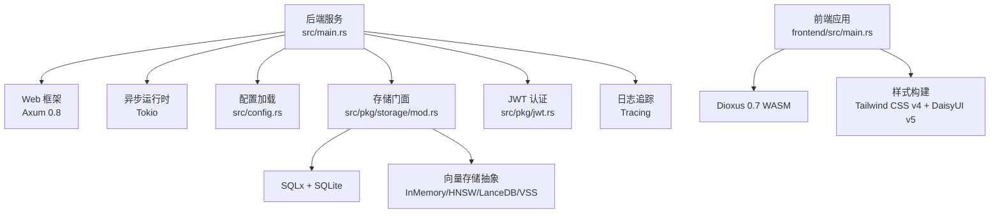
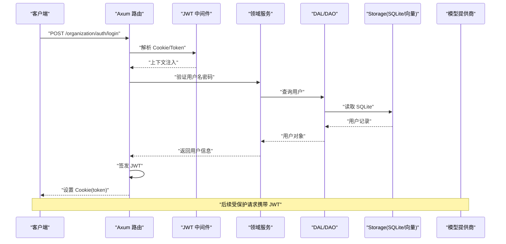
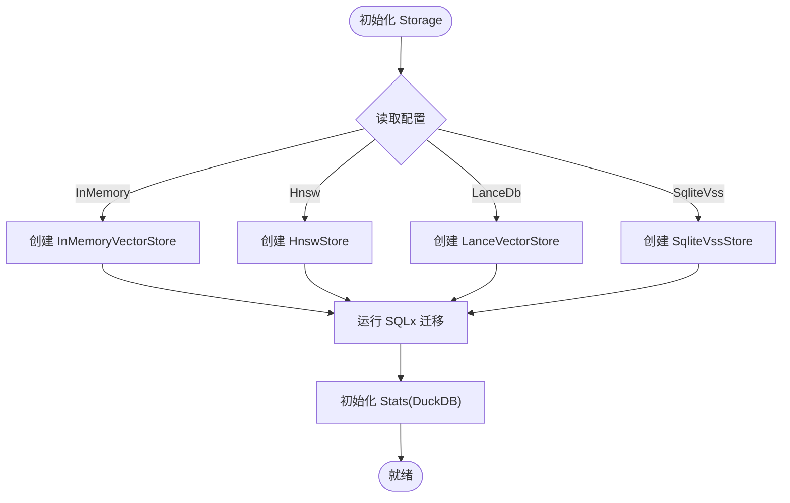
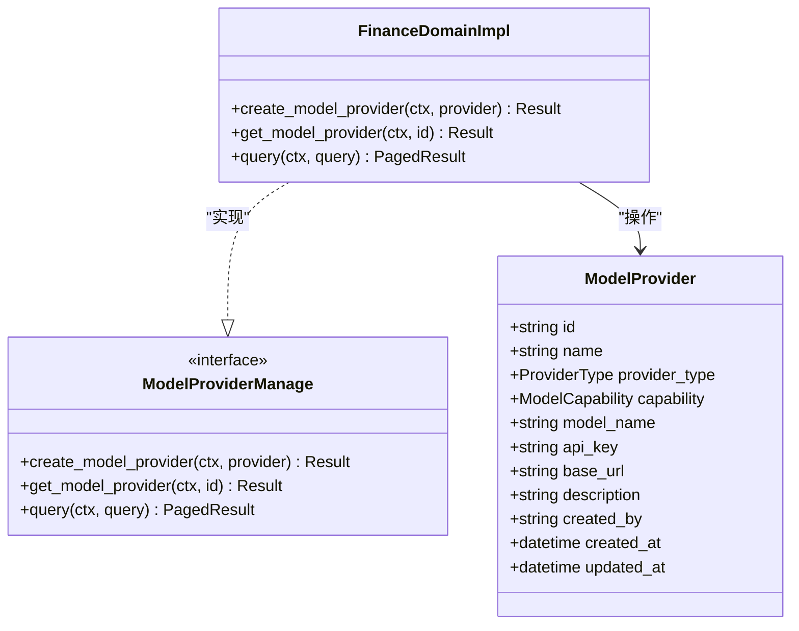
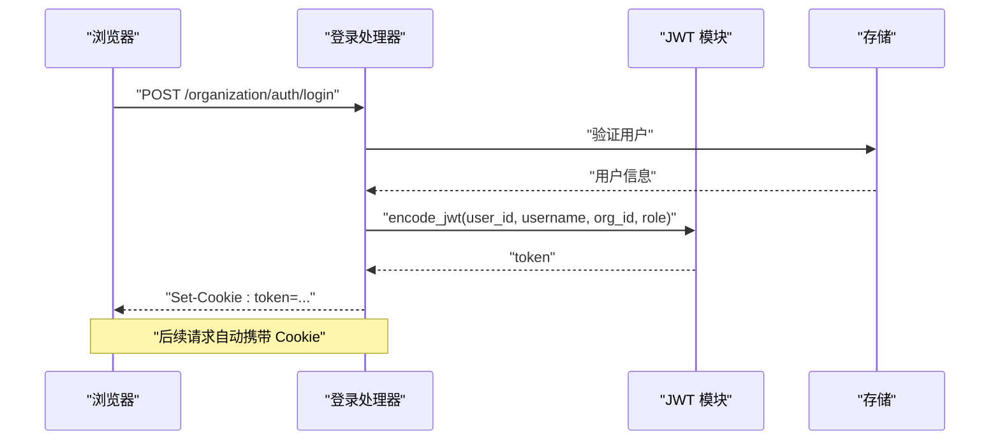
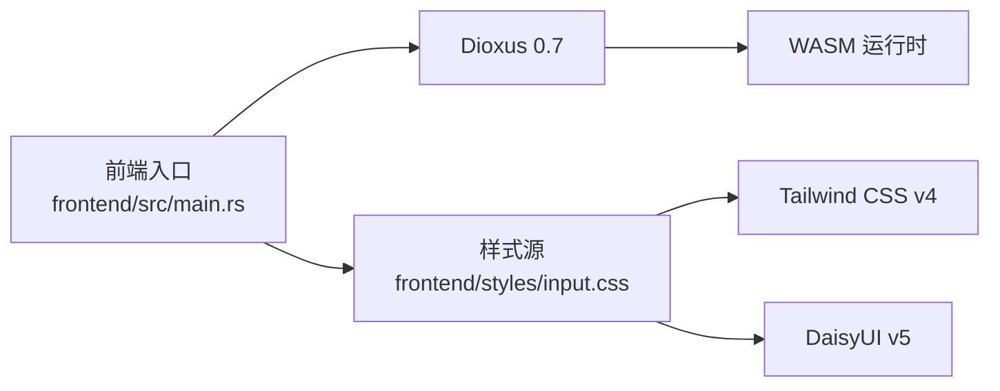
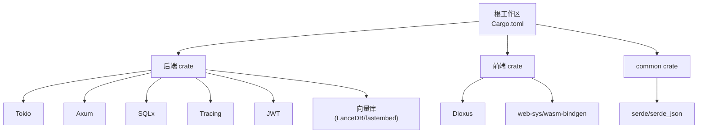

# 技术栈概览

<cite>
**本文引用的文件**
- [Cargo.toml](file://Cargo.toml)
- [frontend/Cargo.toml](file://frontend/Cargo.toml)
- [frontend/package.json](file://frontend/package.json)
- [common/Cargo.toml](file://common/Cargo.toml)
- [rust-toolchain.toml](file://rust-toolchain.toml)
- [src/main.rs](file://src/main.rs)
- [frontend/src/main.rs](file://frontend/src/main.rs)
- [src/config.rs](file://src/config.rs)
- [common/config/ai_orz.toml](file://common/config/ai_orz.toml)
- [src/pkg/storage/mod.rs](file://src/pkg/storage/mod.rs)
- [src/pkg/jwt.rs](file://src/pkg/jwt.rs)
- [src/handlers/organization/auth/login.rs](file://src/handlers/organization/auth/login.rs)
- [tests/integration/auth_sysinit_test.rs](file://tests/integration/auth_sysinit_test.rs)
- [src/service/dal/model_provider_test.rs](file://src/service/dal/model_provider_test.rs)
- [src/handlers/finance/model_provider/create_model_provider.rs](file://src/handlers/finance/model_provider/create_model_provider.rs)
- [src/handlers/finance/model_provider/get_model_provider.rs](file://src/handlers/finance/model_provider/get_model_provider.rs)
- [src/service/domain/finance/model_provider.rs](file://src/service/domain/finance/model_provider.rs)
- [common/src/enums/provider.rs](file://common/src/enums/provider.rs)
- [frontend/styles/input.css](file://frontend/styles/input.css)
</cite>

## 目录
1. [简介](#简介)
2. [项目结构](#项目结构)
3. [核心组件](#核心组件)
4. [架构总览](#架构总览)
5. [详细组件分析](#详细组件分析)
6. [依赖关系分析](#依赖关系分析)
7. [性能考量](#性能考量)
8. [故障排查指南](#故障排查指南)
9. [结论](#结论)
10. [附录](#附录)

## 简介
本技术栈概览面向 AI Orz 项目的后端与前端、数据存储、第三方服务集成及构建部署等关键维度，系统性说明技术选型原因、版本兼容性、依赖关系与性能特点，并给出开发环境与部署要点。项目采用 Rust 1.85+（通过工具链稳定通道）作为主语言，后端基于 Axum 0.8 提供 Web API，使用 SQLx 0.8.6 进行 SQLite 数据访问与迁移；异步运行时为 Tokio；日志追踪使用 Tracing。前端采用 Dioxus 0.7 WASM 构建单页应用，样式层使用 Tailwind CSS v4 与 DaisyUI v5。数据存储以 SQLite 为核心，结合 LanceDB 向量存储与 FTS5 全文检索，支持多后端向量索引（内存、HNSW、LanceDB、SQLite VSS）。认证采用 JWT，模型提供方兼容 OpenAI 接口并可扩展至多种提供商。

## 项目结构
仓库采用多 crate 工作区组织：
- 根 crate 提供后端服务入口、路由、中间件、领域服务与存储抽象
- common crate 共享类型、枚举、错误与配置片段
- frontend crate 提供 Dioxus WASM 前端与样式构建脚本
- ai-orz-macros 提供 HTTP 处理器与工具注册宏
- migrations 管理数据库演进
- tests 包含集成测试与端到端流程验证

图表来源
- [src/main.rs:1-5](file://src/main.rs#L1-L5)
- [frontend/src/main.rs:1-58](file://frontend/src/main.rs#L1-L58)
- [src/config.rs:1-78](file://src/config.rs#L1-L78)
- [src/pkg/storage/mod.rs:1-212](file://src/pkg/storage/mod.rs#L1-L212)

章节来源
- [Cargo.toml:1-147](file://Cargo.toml#L1-L147)
- [frontend/Cargo.toml:1-26](file://frontend/Cargo.toml#L1-L26)
- [common/Cargo.toml:1-34](file://common/Cargo.toml#L1-L34)
- [rust-toolchain.toml:1-5](file://rust-toolchain.toml#L1-L5)

## 核心组件
- 后端 Web 框架：Axum 0.8，启用 multipart 上传能力，配合 tower-http 静态资源处理
- 异步运行时：Tokio full 特性，支撑高并发请求与后台任务
- 数据库访问：SQLx 0.8.6，启用 sqlite、macros、migrate、uuid、chrono 等特性，连接池默认最大连接数 5
- 向量存储：统一 VectorStore 抽象，支持 InMemoryVectorStore、HnswStore、LanceVectorStore、SqliteVssStore，按配置热插拔
- 全文搜索：FTS5 虚拟表与触发器同步，BM25 相关性排序，关键词转义工具函数
- 认证鉴权：JWT HS256，Cookie 携带 token，支持角色与过期时间配置
- 第三方模型服务：ProviderType 枚举覆盖 OpenAI、DeepSeek、Qwen、Doubao、Ollama、Custom、FastEmbed、DoubaoVision，能力区分 Agent 与 Embedding
- 日志追踪：Tracing 与 tracing-subscriber，支持 JSON 输出与环境过滤

章节来源
- [Cargo.toml:17-71](file://Cargo.toml#L17-L71)
- [src/pkg/storage/mod.rs:1-212](file://src/pkg/storage/mod.rs#L1-L212)
- [common/src/enums/provider.rs:1-100](file://common/src/enums/provider.rs#L1-L100)
- [src/pkg/jwt.rs:1-158](file://src/pkg/jwt.rs#L1-L158)

## 架构总览
系统分层清晰：
- 接入层：Axum 路由与中间件（JWT、请求上下文、角色校验）
- 领域层：业务域实现（财务、人力、消息、系统等）
- 数据访问层：DAO/DAL 封装 SQLx 查询与事务
- 存储层：Storage 门面统一 SQLite 与向量存储，自动运行迁移
- 外部集成：OpenAI 兼容 API、MCP Server、A2A 协议

图表来源
- [src/handlers/organization/auth/login.rs:1-48](file://src/handlers/organization/auth/login.rs#L1-L48)
- [src/pkg/jwt.rs:1-158](file://src/pkg/jwt.rs#L1-L158)
- [src/pkg/storage/mod.rs:1-212](file://src/pkg/storage/mod.rs#L1-L212)

## 详细组件分析

### 后端技术栈：Rust 1.85+、Axum 0.8、SQLx、Tokio、Tracing
- Rust 工具链：稳定通道，启用 rustfmt、clippy，目标 wasm32-unknown-unknown 用于前端编译
- Axum 0.8：HTTP 路由与中间件生态完善，multipart 支持附件上传
- SQLx 0.8.6：编译期 SQL 检查、迁移自动化、连接池管理，SQLite 单文件写并发有限，连接池上限 5
- Tokio：full 特性开启线程池、定时器、信号等，支撑高吞吐与长连接
- Tracing：结构化日志，JSON 输出便于采集与分析

章节来源
- [rust-toolchain.toml:1-5](file://rust-toolchain.toml#L1-L5)
- [Cargo.toml:17-38](file://Cargo.toml#L17-L38)
- [src/pkg/storage/mod.rs:50-122](file://src/pkg/storage/mod.rs#L50-L122)

### 数据存储方案：SQLite + LanceDB + FTS5
- SQLite：基础关系型存储，migrations 自动建表与升级，base_data_path 下生成数据库文件
- 向量存储：统一 VectorStore 抽象，根据配置选择 InMemory/HNSW/LanceDB/SQLite VSS；LanceDB 嵌入式高性能向量库
- FTS5：虚拟表与触发器同步，BM25 排序，关键词转义避免特殊字符导致匹配失败

图表来源
- [src/pkg/storage/mod.rs:50-122](file://src/pkg/storage/mod.rs#L50-L122)

章节来源
- [src/pkg/storage/mod.rs:1-212](file://src/pkg/storage/mod.rs#L1-L212)
- [common/config/ai_orz.toml:14-18](file://common/config/ai_orz.toml#L14-L18)

### 第三方服务集成：OpenAI 兼容 API 与模型提供商
- ProviderType 枚举支持多种提供商与能力区分（Agent/Embedding）
- Handler 层提供创建、获取、查询模型提供商的 REST 接口
- DAL 层负责持久化与查询，支持自定义 base_url 适配兼容接口

图表来源
- [src/service/domain/finance/model_provider.rs:1-48](file://src/service/domain/finance/model_provider.rs#L1-L48)
- [common/src/enums/provider.rs:1-100](file://common/src/enums/provider.rs#L1-L100)

章节来源
- [src/handlers/finance/model_provider/create_model_provider.rs:1-31](file://src/handlers/finance/model_provider/create_model_provider.rs#L1-L31)
- [src/handlers/finance/model_provider/get_model_provider.rs:1-71](file://src/handlers/finance/model_provider/get_model_provider.rs#L1-L71)
- [src/service/domain/finance/model_provider.rs:1-48](file://src/service/domain/finance/model_provider.rs#L1-L48)
- [common/src/enums/provider.rs:1-100](file://common/src/enums/provider.rs#L1-L100)
- [src/service/dal/model_provider_test.rs:54-174](file://src/service/dal/model_provider_test.rs#L54-L174)

### 认证与授权：JWT 与 Cookie
- 登录流程：验证用户名密码后签发 JWT，写入 HttpOnly Cookie，浏览器自动携带
- 受保护路由：无 JWT 返回 401，有有效 JWT 返回 200
- 配置：secret 与 default_expiry_hours 可通过环境变量或配置文件覆盖

图表来源
- [src/handlers/organization/auth/login.rs:1-48](file://src/handlers/organization/auth/login.rs#L1-L48)
- [src/pkg/jwt.rs:1-158](file://src/pkg/jwt.rs#L1-L158)

章节来源
- [tests/integration/auth_sysinit_test.rs:1-101](file://tests/integration/auth_sysinit_test.rs#L1-L101)
- [common/config/ai_orz.toml:36-42](file://common/config/ai_orz.toml#L36-L42)

### 前端技术栈：Dioxus 0.7 WASM、Tailwind CSS v4、DaisyUI v5
- Dioxus 0.7：WASM 目标，Router、Signal、Context 等现代 UI 能力
- Tailwind CSS v4：原子化样式，按需生成，主题变量定制
- DaisyUI v5：组件主题丰富，内置多套主题，支持自定义 orz-light 主题
- 构建脚本：package.json 中定义 tailwindcss CLI 构建与 watch 模式

图表来源
- [frontend/src/main.rs:1-58](file://frontend/src/main.rs#L1-L58)
- [frontend/styles/input.css:1-202](file://frontend/styles/input.css#L1-L202)
- [frontend/package.json:1-14](file://frontend/package.json#L1-L14)

章节来源
- [frontend/Cargo.toml:1-26](file://frontend/Cargo.toml#L1-L26)
- [frontend/package.json:1-14](file://frontend/package.json#L1-L14)
- [frontend/styles/input.css:1-202](file://frontend/styles/input.css#L1-L202)

## 依赖关系分析
- 后端依赖：tokio、axum、sqlx、tracing、reqwest、jsonwebtoken、cookie、fastembed、lancedb、instant-distance、arrow 等
- 前端依赖：dioxus、web-sys、wasm-bindgen、gloo-timers、js-sys、serde、reqwest（WASM 环境）
- 公共依赖：common crate 提供共享类型与可选特性开关（sqlx、axum-integration、jwt-integration、reqwest-integration、toml-integration、bincode-integration、tokio-integration）

图表来源
- [Cargo.toml:1-147](file://Cargo.toml#L1-L147)
- [frontend/Cargo.toml:1-26](file://frontend/Cargo.toml#L1-L26)
- [common/Cargo.toml:1-34](file://common/Cargo.toml#L1-L34)

章节来源
- [Cargo.toml:17-71](file://Cargo.toml#L17-L71)
- [frontend/Cargo.toml:11-26](file://frontend/Cargo.toml#L11-L26)
- [common/Cargo.toml:7-34](file://common/Cargo.toml#L7-L34)

## 性能考量
- 连接池：SQLite 单文件写并发有限，连接池上限设为 5，避免锁竞争
- 向量存储：优先纯 Rust 内存实现（零系统依赖），生产可切换 HNSW 或 LanceDB 提升相似度检索性能
- 全文搜索：FTS5 BM25 排序，关键词转义确保精确匹配，空关键词时降级到纯向量或返回空结果
- 日志：结构化 JSON 输出，便于集中采集与性能分析
- 前端：Tailwind 按需生成 CSS，减少体积；Dioxus 组件化渲染，状态驱动更新

[本节为通用指导，不直接分析具体文件]

## 故障排查指南
- 认证失败：检查 JWT secret 与过期时间配置，确认 Cookie 是否被浏览器拦截（HttpOnly、SameSite、Secure）
- 数据库迁移失败：确认 migrations 目录存在且可读，base_data_path 权限正确
- 向量检索异常：检查向量存储后端配置与路径，必要时回退到内存实现或关键词搜索
- 模型调用失败：核对 ProviderType、model_name、api_key、base_url，确认网络可达与鉴权通过

章节来源
- [src/pkg/jwt.rs:52-121](file://src/pkg/jwt.rs#L52-L121)
- [src/pkg/storage/mod.rs:50-122](file://src/pkg/storage/mod.rs#L50-L122)
- [common/config/ai_orz.toml:36-42](file://common/config/ai_orz.toml#L36-L42)

## 结论
AI Orz 项目以 Rust 为核心，采用 Axum 提供高性能 Web 服务，SQLx 保障数据安全与一致性，结合多种向量存储与 FTS5 实现混合检索；前端基于 Dioxus WASM 与 Tailwind/DaisyUI 构建现代化界面。JWT 认证与多模型提供商支持使系统具备良好扩展性与兼容性。通过清晰的存储抽象与配置驱动，系统在开发、测试与生产环境中均具备良好的可维护性与可观测性。

[本节为总结性内容，不直接分析具体文件]

## 附录
- 开发环境要求：Rust 稳定通道，启用 rustfmt、clippy；安装 wasm32-unknown-unknown 目标；Node.js 用于前端样式构建
- 构建工具：cargo 构建后端，tailwindcss CLI 构建前端 CSS；migrations 自动执行
- 部署要点：配置 .ai_orz/ai_orz.toml，设置 JWT secret 与过期时间；确保 base_data_path 可写；HTTPS 环境下将 Cookie Secure 设置为 true

章节来源
- [rust-toolchain.toml:1-5](file://rust-toolchain.toml#L1-L5)
- [common/config/ai_orz.toml:9-42](file://common/config/ai_orz.toml#L9-L42)
- [src/config.rs:25-78](file://src/config.rs#L25-L78)