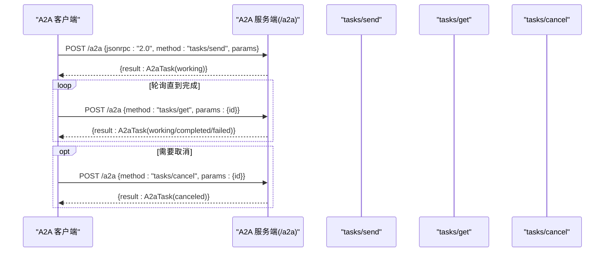
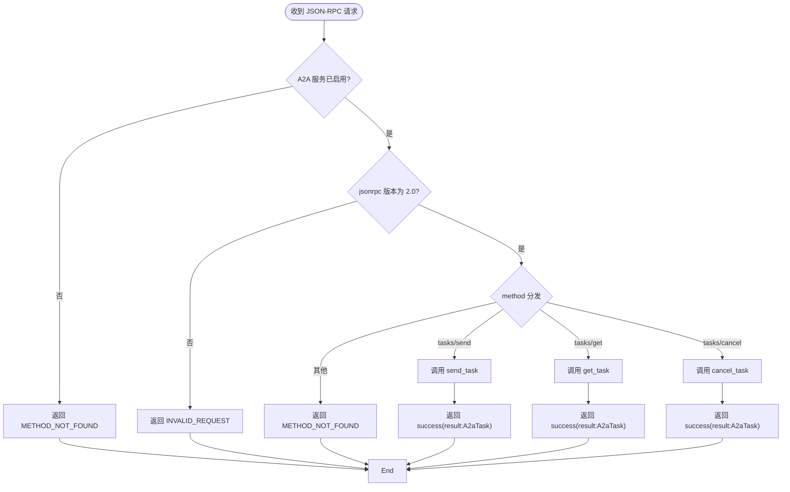
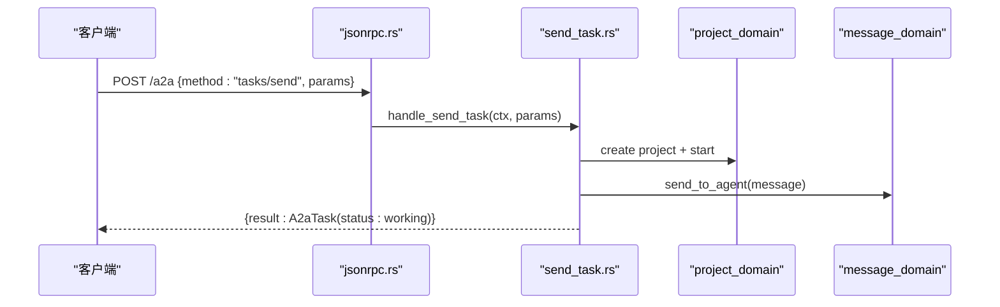
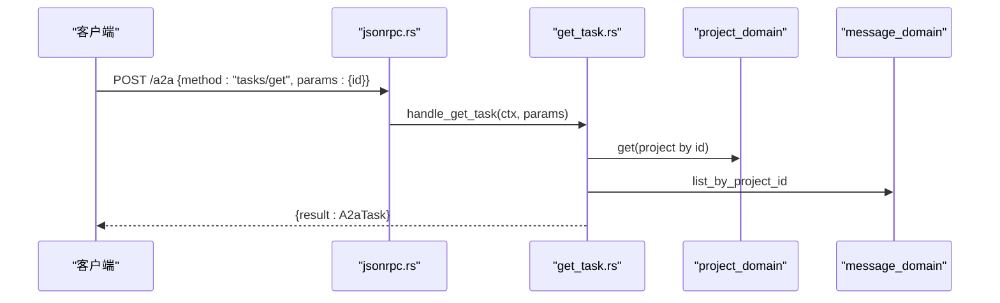
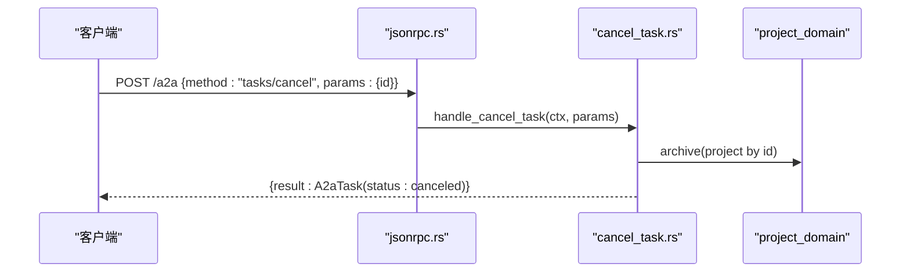
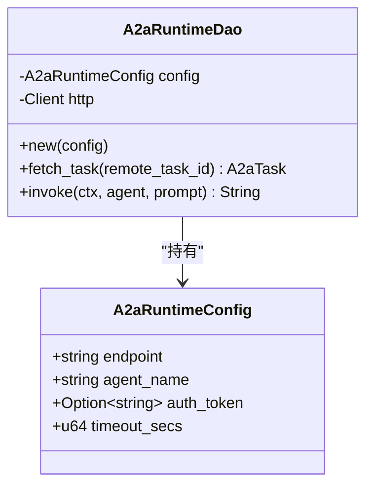
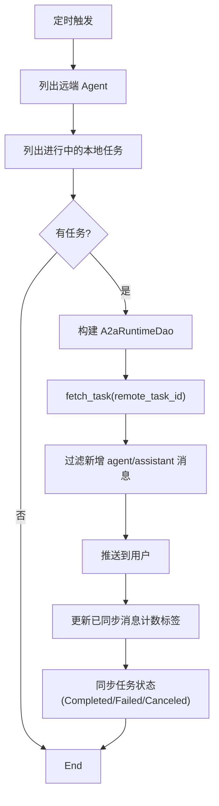
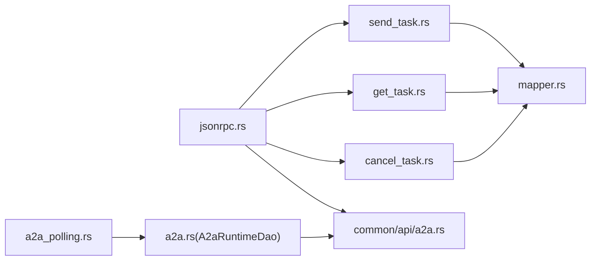

# A2A Client 模式

<cite>
**本文引用的文件**
- [common/src/api/a2a.rs](file://common/src/api/a2a.rs)
- [src/handlers/a2a/mod.rs](file://src/handlers/a2a/mod.rs)
- [src/handlers/a2a/jsonrpc.rs](file://src/handlers/a2a/jsonrpc.rs)
- [src/handlers/a2a/send_task.rs](file://src/handlers/a2a/send_task.rs)
- [src/handlers/a2a/get_task.rs](file://src/handlers/a2a/get_task.rs)
- [src/handlers/a2a/cancel_task.rs](file://src/handlers/a2a/cancel_task.rs)
- [src/handlers/a2a/mapper.rs](file://src/handlers/a2a/mapper.rs)
- [src/service/dao/agent_runtime/a2a.rs](file://src/service/dao/agent_runtime/a2a.rs)
- [src/producer/a2a_polling.rs](file://src/producer/a2a_polling.rs)
- [tests/integration/a2a_flow_test.rs](file://tests/integration/a2a_flow_test.rs)
</cite>

## 目录
1. [简介](#简介)
2. [项目结构](#项目结构)
3. [核心组件](#核心组件)
4. [架构总览](#架构总览)
5. [详细组件分析](#详细组件分析)
6. [依赖关系分析](#依赖关系分析)
7. [性能与可靠性](#性能与可靠性)
8. [故障排查指南](#故障排查指南)
9. [结论](#结论)
10. [附录：JSON-RPC 协议与使用示例](#附录json-rpc-协议与使用示例)

## 简介
本文件面向“作为 A2A 客户端调用外部 Agent”的使用者，说明如何以 JSON-RPC 2.0 协议与远端 A2A 服务端交互，完成任务发送、状态查询、取消任务等核心操作。文档同时覆盖请求参数、响应结构、错误码、超时与重试、连接管理、异步响应（SSE/Push）以及最佳实践。代码级实现参考仓库中的 A2A 协议类型定义、HTTP Handler、DAO 层远程调用封装以及轮询消费者。

## 项目结构
A2A 相关能力分布在以下位置：
- 协议与数据模型：common 层的 A2A 类型定义（AgentCard、JsonRpcRequest/Response、Task、Message、Artifact、方法参数）。
- HTTP 入口与分发：handlers/a2a 模块提供 /a2a 的 JSON-RPC 入口与方法分发（tasks/send、tasks/get、tasks/cancel），以及 mapper 转换逻辑。
- 远程调用 DAO：service/dao/agent_runtime/a2a.rs 封装了通过 HTTP JSON-RPC 调用远端 A2A 服务的能力（tasks/send、tasks/get）。
- 轮询消费者：producer/a2a_polling.rs 定时拉取远端任务状态并同步到本地消息与任务状态。
- 集成测试：tests/integration/a2a_flow_test.rs 验证 Agent Card 发现与 tasks/send → tasks/get 流程。

```mermaid
graph TB
subgraph "客户端"
C["A2A 客户端"]
end
subgraph "A2A 服务端(HTTP)"
H["/a2a JSON-RPC 入口<br/>jsonrpc.rs"]
S["tasks/send<br/>send_task.rs"]
G["tasks/get<br/>get_task.rs"]
X["tasks/cancel<br/>cancel_task.rs"]
M["mapper 转换<br/>mapper.rs"]
end
subgraph "内部系统"
P["轮询消费者<br/>a2a_polling.rs"]
D["DAO: A2aRuntimeDao<br/>a2a.rs"]
end
C --> |POST /a2a (JSON-RPC)| H
H --> S
H --> G
H --> X
S --> M
G --> M
P --> D
D --> |HTTP JSON-RPC| C
```

图表来源
- [src/handlers/a2a/jsonrpc.rs:1-94](file://src/handlers/a2a/jsonrpc.rs#L1-L94)
- [src/handlers/a2a/send_task.rs:1-128](file://src/handlers/a2a/send_task.rs#L1-L128)
- [src/handlers/a2a/get_task.rs:1-49](file://src/handlers/a2a/get_task.rs#L1-L49)
- [src/handlers/a2a/cancel_task.rs:1-55](file://src/handlers/a2a/cancel_task.rs#L1-L55)
- [src/handlers/a2a/mapper.rs:1-99](file://src/handlers/a2a/mapper.rs#L1-L99)
- [src/producer/a2a_polling.rs:1-272](file://src/producer/a2a_polling.rs#L1-L272)
- [src/service/dao/agent_runtime/a2a.rs:1-458](file://src/service/dao/agent_runtime/a2a.rs#L1-L458)

章节来源
- [src/handlers/a2a/mod.rs:1-28](file://src/handlers/a2a/mod.rs#L1-L28)

## 核心组件
- 协议与数据模型（common/src/api/a2a.rs）
  - JSON-RPC 2.0 请求/响应与标准错误码
  - AgentCard、AgentCapabilities、AgentSkill
  - A2aTask、A2aTaskStatus、A2aTaskState
  - A2aMessage、A2aMessagePart（text/file/data）、A2aFilePart
  - A2aArtifact
  - 方法参数：SendTaskParams、GetTaskParams、CancelTaskParams
- HTTP 入口与分发（src/handlers/a2a/jsonrpc.rs）
  - POST /a2a 接收 JSON-RPC 请求，校验版本与启用开关，按 method 分发
  - 统一成功/错误响应包装
- 任务处理（send/get/cancel）
  - send_task：创建项目（对应 Task）、写入消息、立即返回 working 状态；可选 PushNotifications
  - get_task：按 task_id 查询项目、消息、产物并组装 A2aTask
  - cancel_task：归档项目（对应 canceled），返回最新任务视图
- 实体映射（mapper.rs）
  - ProjectStatus ↔ A2aTaskState
  - Message/Artifact → A2aMessage/A2aArtifact
  - build_a2a_task 统一构建
- 远程调用 DAO（service/dao/agent_runtime/a2a.rs）
  - A2aRuntimeDao：封装 HTTP JSON-RPC 调用（tasks/send、tasks/get）
  - 统一 call_a2a_jsonrpc：构造请求、鉴权、超时、解析响应、错误映射
  - extract_text_from_task_result：从返回 Task 中抽取文本
- 轮询消费者（producer/a2a_polling.rs）
  - 定时拉取远端任务状态，同步新消息到用户，更新本地任务状态
  - 基于标签记录已同步消息数，避免重复推送

章节来源
- [common/src/api/a2a.rs:1-306](file://common/src/api/a2a.rs#L1-L306)
- [src/handlers/a2a/jsonrpc.rs:1-94](file://src/handlers/a2a/jsonrpc.rs#L1-L94)
- [src/handlers/a2a/send_task.rs:1-128](file://src/handlers/a2a/send_task.rs#L1-L128)
- [src/handlers/a2a/get_task.rs:1-49](file://src/handlers/a2a/get_task.rs#L1-L49)
- [src/handlers/a2a/cancel_task.rs:1-55](file://src/handlers/a2a/cancel_task.rs#L1-L55)
- [src/handlers/a2a/mapper.rs:1-99](file://src/handlers/a2a/mapper.rs#L1-L99)
- [src/service/dao/agent_runtime/a2a.rs:1-458](file://src/service/dao/agent_runtime/a2a.rs#L1-L458)
- [src/producer/a2a_polling.rs:1-272](file://src/producer/a2a_polling.rs#L1-L272)

## 架构总览
A2A 客户端与服务端通过 JSON-RPC 2.0 在 HTTP 上交互。客户端发起 tasks/send 提交任务，服务端立即返回 working 状态的任务；随后通过 tasks/get 轮询或订阅 SSE/Push 获取结果；必要时通过 tasks/cancel 取消任务。对于“作为 A2A 客户端调用外部 Agent”的场景，DAO 层提供了统一的远程调用封装，便于上层业务复用。



图表来源
- [src/handlers/a2a/jsonrpc.rs:1-94](file://src/handlers/a2a/jsonrpc.rs#L1-L94)
- [src/handlers/a2a/send_task.rs:1-128](file://src/handlers/a2a/send_task.rs#L1-L128)
- [src/handlers/a2a/get_task.rs:1-49](file://src/handlers/a2a/get_task.rs#L1-L49)
- [src/handlers/a2a/cancel_task.rs:1-55](file://src/handlers/a2a/cancel_task.rs#L1-L55)

## 详细组件分析

### JSON-RPC 入口与方法分发
- 入口：POST /a2a，要求 jsonrpc="2.0"，根据 method 分发到 tasks/send、tasks/get、tasks/cancel。
- 错误处理：未启用 A2A 服务、不支持的版本、未知方法均返回标准 JSON-RPC 错误。
- 上下文：通过 RequestContext 注入，handler 内提取用户身份等信息。



图表来源
- [src/handlers/a2a/jsonrpc.rs:1-94](file://src/handlers/a2a/jsonrpc.rs#L1-L94)

章节来源
- [src/handlers/a2a/jsonrpc.rs:1-94](file://src/handlers/a2a/jsonrpc.rs#L1-L94)

### 任务发送（tasks/send）
- 行为：创建项目（对应 A2A Task），写入用户消息，启动项目流转至进行中，立即返回 working 状态的 A2aTask。
- 会话与回调：支持 session_id；可选 notification_url 用于后续 PushNotifications。
- 唤醒机制：消息入队后由消费者异步唤醒 Agent，不阻塞请求。



图表来源
- [src/handlers/a2a/jsonrpc.rs:1-94](file://src/handlers/a2a/jsonrpc.rs#L1-L94)
- [src/handlers/a2a/send_task.rs:1-128](file://src/handlers/a2a/send_task.rs#L1-L128)

章节来源
- [src/handlers/a2a/send_task.rs:1-128](file://src/handlers/a2a/send_task.rs#L1-L128)

### 任务查询（tasks/get）
- 行为：按 task_id 查询项目、消息、产物，转换为 A2aTask 返回。
- 用途：客户端轮询任务进度与结果。



图表来源
- [src/handlers/a2a/jsonrpc.rs:1-94](file://src/handlers/a2a/jsonrpc.rs#L1-L94)
- [src/handlers/a2a/get_task.rs:1-49](file://src/handlers/a2a/get_task.rs#L1-L49)

章节来源
- [src/handlers/a2a/get_task.rs:1-49](file://src/handlers/a2a/get_task.rs#L1-L49)

### 任务取消（tasks/cancel）
- 行为：归档项目（对应 canceled），重新查询并返回最新任务视图。
- 适用场景：长时间运行任务需提前终止。



图表来源
- [src/handlers/a2a/jsonrpc.rs:1-94](file://src/handlers/a2a/jsonrpc.rs#L1-L94)
- [src/handlers/a2a/cancel_task.rs:1-55](file://src/handlers/a2a/cancel_task.rs#L1-L55)

章节来源
- [src/handlers/a2a/cancel_task.rs:1-55](file://src/handlers/a2a/cancel_task.rs#L1-L55)

### 远程调用 DAO（作为 A2A 客户端调用外部 Agent）
- 功能：封装 HTTP JSON-RPC 调用，支持 tasks/send 与 tasks/get。
- 配置：endpoint、agent_name、auth_token、timeout_secs。
- 超时：reqwest Client 设置全局超时。
- 鉴权：可选 Bearer Token。
- 错误：HTTP 非 2xx 与 JSON-RPC error 均转为内部错误。



图表来源
- [src/service/dao/agent_runtime/a2a.rs:1-458](file://src/service/dao/agent_runtime/a2a.rs#L1-L458)

章节来源
- [src/service/dao/agent_runtime/a2a.rs:1-458](file://src/service/dao/agent_runtime/a2a.rs#L1-L458)

### 轮询消费者（将远端任务状态同步回本地）
- 周期：每 30 秒轮询一次。
- 行为：查找进行中的远端任务，拉取消息增量，推送给用户，更新本地任务状态。
- 去重：通过标签记录已同步消息数量，避免重复。



图表来源
- [src/producer/a2a_polling.rs:1-272](file://src/producer/a2a_polling.rs#L1-L272)

章节来源
- [src/producer/a2a_polling.rs:1-272](file://src/producer/a2a_polling.rs#L1-L272)

## 依赖关系分析
- handlers/a2a/jsonrpc.rs 依赖 common::api::a2a 的类型与错误码，并调用 send_task、get_task、cancel_task。
- send_task/get_task/cancel_task 依赖 mapper 进行实体转换，并调用 domain 层的项目与消息服务。
- service/dao/agent_runtime/a2a.rs 依赖 reqwest 进行 HTTP 调用，并使用 common::api::a2a 的 JSON-RPC 类型。
- producer/a2a_polling.rs 依赖 domain 层的服务与事件工具函数，使用 A2aRuntimeDao 拉取远端任务。



图表来源
- [src/handlers/a2a/jsonrpc.rs:1-94](file://src/handlers/a2a/jsonrpc.rs#L1-L94)
- [src/handlers/a2a/send_task.rs:1-128](file://src/handlers/a2a/send_task.rs#L1-L128)
- [src/handlers/a2a/get_task.rs:1-49](file://src/handlers/a2a/get_task.rs#L1-L49)
- [src/handlers/a2a/cancel_task.rs:1-55](file://src/handlers/a2a/cancel_task.rs#L1-L55)
- [src/handlers/a2a/mapper.rs:1-99](file://src/handlers/a2a/mapper.rs#L1-L99)
- [src/producer/a2a_polling.rs:1-272](file://src/producer/a2a_polling.rs#L1-L272)
- [src/service/dao/agent_runtime/a2a.rs:1-458](file://src/service/dao/agent_runtime/a2a.rs#L1-L458)
- [common/src/api/a2a.rs:1-306](file://common/src/api/a2a.rs#L1-L306)

章节来源
- [common/src/api/a2a.rs:1-306](file://common/src/api/a2a.rs#L1-L306)
- [src/handlers/a2a/jsonrpc.rs:1-94](file://src/handlers/a2a/jsonrpc.rs#L1-L94)
- [src/service/dao/agent_runtime/a2a.rs:1-458](file://src/service/dao/agent_runtime/a2a.rs#L1-L458)

## 性能与可靠性
- 超时控制：A2aRuntimeDao 使用 reqwest Client 设置超时时间，避免长连接阻塞。
- 重试机制：当前实现未内置自动重试；建议在客户端侧对网络抖动与临时错误实施指数退避重试。
- 连接管理：使用 reqwest 默认连接池；如需高并发可复用 Client 实例并合理配置连接池大小。
- 轮询间隔：消费者固定 30 秒轮询；可根据业务调整以减少负载或提升实时性。
- 幂等性：tasks/send 会创建新项目；建议客户端生成唯一 task id，避免重复提交。
- 资源释放：取消任务会将项目归档，减少活跃资源占用。

[本节为通用指导，无需特定文件引用]

## 故障排查指南
- 常见错误码
  - -32700 解析错误：请求体不是合法 JSON 或字段缺失。
  - -32600 无效请求：jsonrpc 版本不为 "2.0"。
  - -32601 方法未找到：method 不在支持列表。
  - -32602 参数无效：params 无法反序列化为目标结构。
  - -32603 内部错误：服务端异常或下游调用失败。
- 检查清单
  - 确认 A2A 服务已启用（jsonrpc 入口会检查配置）。
  - 确认请求包含 jsonrpc、id、method、params。
  - 确认 tasks/send 的 message.parts 至少包含一个 text 部分。
  - 确认 tasks/get 的 id 与 send 返回一致。
  - 若使用鉴权，确保 Authorization 头正确。
- 日志定位
  - 查看 JSON-RPC 入口的错误包装信息。
  - 查看 DAO 层 HTTP 调用失败的上下文信息。
  - 查看轮询消费者的警告日志（如远端任务拉取失败、消息推送失败）。

章节来源
- [common/src/api/a2a.rs:121-145](file://common/src/api/a2a.rs#L121-L145)
- [src/handlers/a2a/jsonrpc.rs:21-75](file://src/handlers/a2a/jsonrpc.rs#L21-L75)
- [src/service/dao/agent_runtime/a2a.rs:86-148](file://src/service/dao/agent_runtime/a2a.rs#L86-L148)
- [src/producer/a2a_polling.rs:98-127](file://src/producer/a2a_polling.rs#L98-L127)

## 结论
A2A Client 模式通过 JSON-RPC 2.0 在 HTTP 上实现了标准化的 Agent 间通信。客户端可通过 tasks/send 提交任务、tasks/get 轮询结果、tasks/cancel 取消任务；结合 SSE/Push 可实现更实时的交互。DAO 层提供了统一的远程调用封装，便于复用与扩展。建议在生产环境加入客户端重试、超时与连接池优化，并结合轮询消费者实现状态同步与消息推送。

[本节为总结，无需特定文件引用]

## 附录：JSON-RPC 协议与使用示例

### 协议概览
- 端点：POST /a2a
- 版本：jsonrpc = "2.0"
- 方法：
  - tasks/send：提交任务
  - tasks/get：查询任务
  - tasks/cancel：取消任务
- 错误：遵循 JSON-RPC 标准错误码

章节来源
- [src/handlers/a2a/jsonrpc.rs:1-94](file://src/handlers/a2a/jsonrpc.rs#L1-L94)
- [common/src/api/a2a.rs:64-145](file://common/src/api/a2a.rs#L64-L145)

### 请求与响应结构
- JsonRpcRequest
  - jsonrpc: "2.0"
  - id: string | number | null
  - method: "tasks/send" | "tasks/get" | "tasks/cancel"
  - params: 具体方法参数
- JsonRpcResponse
  - jsonrpc: "2.0"
  - id: 与请求一致
  - result: 成功时返回 A2aTask
  - error: 失败时返回错误对象（code、message、data）

章节来源
- [common/src/api/a2a.rs:64-145](file://common/src/api/a2a.rs#L64-L145)

### 方法参数与返回值
- tasks/send
  - 参数：SendTaskParams（id、message、session_id、metadata、notification_url）
  - 返回：A2aTask（status.state=working）
- tasks/get
  - 参数：GetTaskParams（id、history_length）
  - 返回：A2aTask（可能包含 messages/artifacts）
- tasks/cancel
  - 参数：CancelTaskParams（id）
  - 返回：A2aTask（status.state=canceled）

章节来源
- [common/src/api/a2a.rs:267-306](file://common/src/api/a2a.rs#L267-L306)
- [src/handlers/a2a/send_task.rs:31-128](file://src/handlers/a2a/send_task.rs#L31-L128)
- [src/handlers/a2a/get_task.rs:17-49](file://src/handlers/a2a/get_task.rs#L17-L49)
- [src/handlers/a2a/cancel_task.rs:17-55](file://src/handlers/a2a/cancel_task.rs#L17-L55)

### 完整调用流程示例（概念性）
- 初始化客户端：配置 endpoint、auth_token、超时。
- 发送任务：构造 JsonRpcRequest(method="tasks/send")，发送并等待返回 A2aTask。
- 轮询结果：循环调用 tasks/get，直到 status.state 为 completed/failed/canceled。
- 取消任务：必要时调用 tasks/cancel。
- 处理异步：若提供 notification_url，服务端会通过 HTTP POST 推送任务更新。

[本节为概念性示例，无需特定文件引用]

### 集成测试参考
- 验证 Agent Card 发现：GET /.well-known/agent.json
- 验证 tasks/send → tasks/get 往返：POST /a2a 发送任务并查询结果

章节来源
- [tests/integration/a2a_flow_test.rs:1-202](file://tests/integration/a2a_flow_test.rs#L1-L202)