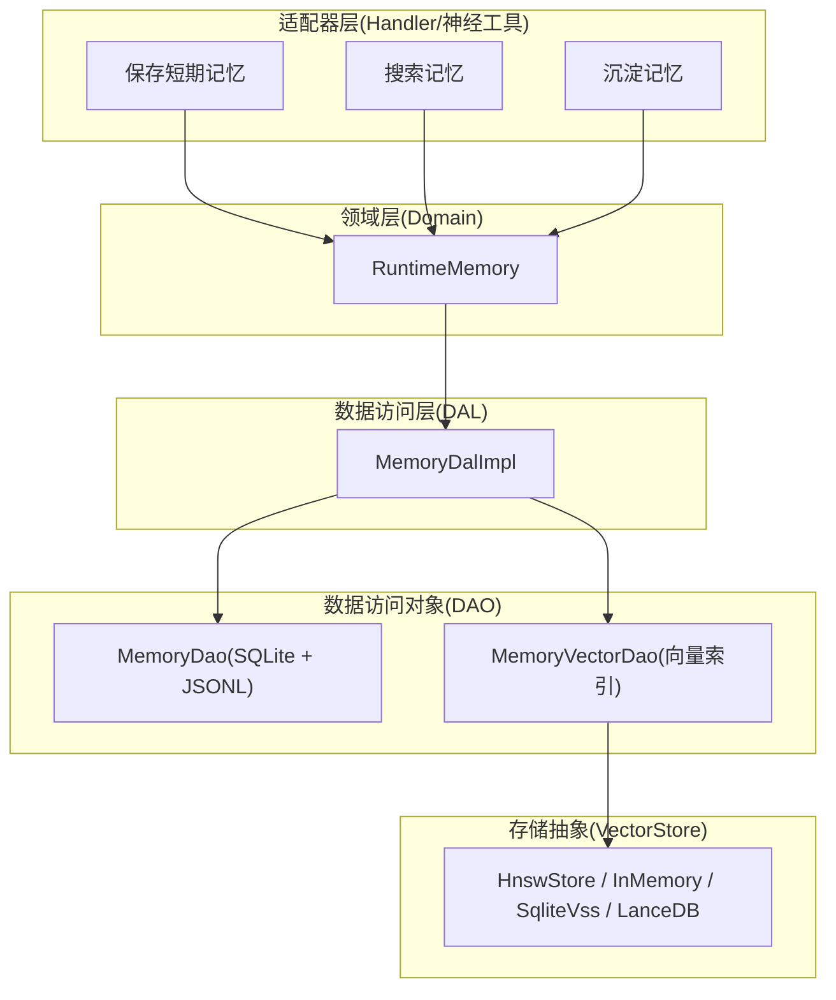
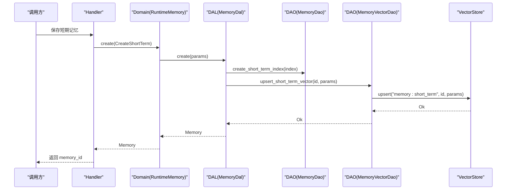
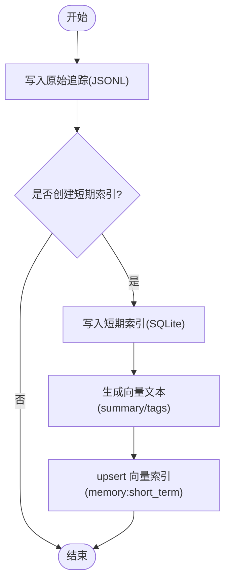
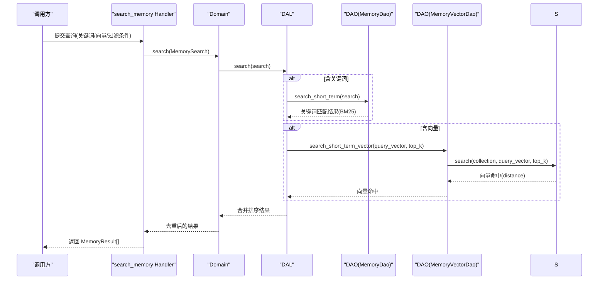
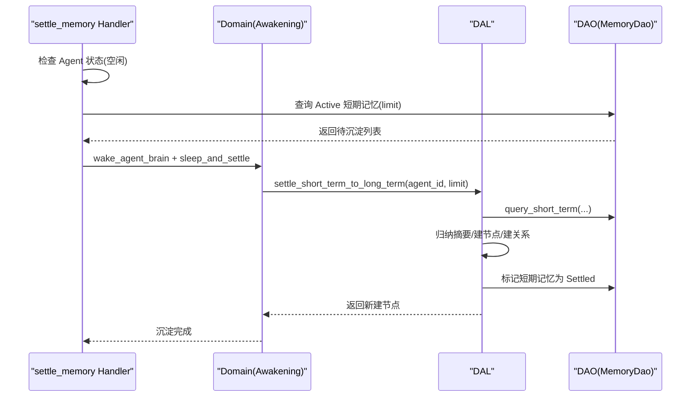
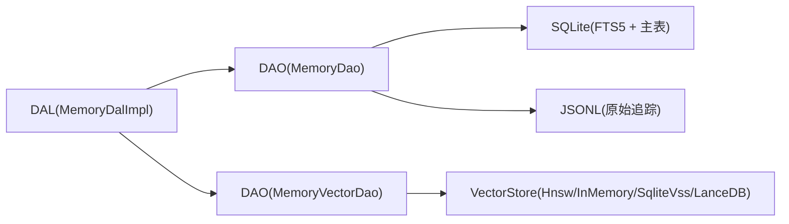

# Agent 记忆系统

<cite>
**本文引用的文件**
- [memory.rs](file://src/models/memory.rs)
- [memory.rs（枚举）](file://common/src/enums/memory.rs)
- [memory.rs（DAL）](file://src/service/dal/memory.rs)
- [mod.rs（DAO 接口）](file://src/service/dao/memory/mod.rs)
- [vector.rs（DAO 向量层）](file://src/service/dao/memory/vector.rs)
- [memory.rs（Domain 运行时）](file://src/service/domain/runtime/memory.rs)
- [save_short_term_memory.rs](file://src/handlers/hr/agent/save_short_term_memory.rs)
- [search_memory.rs](file://src/handlers/hr/agent/search_memory.rs)
- [settle_memory.rs](file://src/handlers/hr/agent/settle_memory.rs)
- [vector.rs（存储抽象）](file://src/pkg/storage/vector.rs)
- [mod.rs（存储门面）](file://src/pkg/storage/mod.rs)
- [20260712000000_memory_fts5.sql](file://migrations/20260712000000_memory_fts5.sql)
- [memory_test.rs（集成测试）](file://tests/integration/memory_test.rs)
</cite>

## 目录
1. [简介](#简介)
2. [项目结构](#项目结构)
3. [核心组件](#核心组件)
4. [架构总览](#架构总览)
5. [详细组件分析](#详细组件分析)
6. [依赖关系分析](#依赖关系分析)
7. [性能考量](#性能考量)
8. [故障排查指南](#故障排查指南)
9. [结论](#结论)
10. [附录：API 调用示例与最佳实践](#附录api-调用示例与最佳实践)

## 简介
本文件面向 Agent 记忆系统的完整设计与实现，覆盖短期记忆与长期记忆的区分、存储机制、创建/保存/查询/沉淀流程、向量存储与全文检索能力、生命周期管理（自动清理与归档策略）、以及性能优化与最佳实践。系统遵循四层单向调用：Adapter（Handler/神经工具）→ Domain → DAL → DAO，PO 仅在 DAO/DAL 内部使用，Domain 对外暴露业务实体与事件；所有 service 层公共方法首参为 RequestContext，跨层统一 ctx.clone()。

## 项目结构
记忆系统横跨模型、领域、数据访问与存储基础设施：
- 模型层：定义 MemoryTrace、ShortTermMemoryIndexPo、LongTermKnowledgeNodePo、KnowledgeReferencePo、Memory 等业务实体与 PO。
- 领域层（Domain）：封装运行时记忆能力（写入思考 trace、获取近期上下文、搜索/遍历知识图谱等）。
- 数据访问层（DAL）：编排跨 DAO 的复杂流程（混合搜索、沉淀、重建向量索引等）。
- 数据访问对象（DAO）：SQLite FTS5 全文检索、短期/长期记忆 CRUD、JSONL 原始追踪追加、向量索引 upsert/search/delete。
- 存储抽象：VectorStore 抽象支持 HNSW/InMemory/SqliteVss/LanceDB 多后端，统一 upsert/search/get/delete/clear_collection。

图表来源
- [save_short_term_memory.rs:1-58](file://src/handlers/hr/agent/save_short_term_memory.rs#L1-L58)
- [search_memory.rs:1-222](file://src/handlers/hr/agent/search_memory.rs#L1-L222)
- [settle_memory.rs:1-155](file://src/handlers/hr/agent/settle_memory.rs#L1-L155)
- [memory.rs（Domain 运行时）:1-120](file://src/service/domain/runtime/memory.rs#L1-L120)
- [memory.rs（DAL）:1-200](file://src/service/dal/memory.rs#L1-L200)
- [mod.rs（DAO 接口）:1-200](file://src/service/dao/memory/mod.rs#L1-L200)
- [vector.rs（存储抽象）:1-200](file://src/pkg/storage/vector.rs#L1-L200)

章节来源
- [memory.rs:1-424](file://src/models/memory.rs#L1-L424)
- [memory.rs（枚举）:1-212](file://common/src/enums/memory.rs#L1-L212)
- [memory.rs（DAL）:1-200](file://src/service/dal/memory.rs#L1-L200)
- [mod.rs（DAO 接口）:1-200](file://src/service/dao/memory/mod.rs#L1-L200)
- [vector.rs（存储抽象）:1-200](file://src/pkg/storage/vector.rs#L1-L200)

## 核心组件
- 短期记忆：以 ShortTermMemoryIndexPo 表示，聚合多条原始记忆细节（trace_ids），包含 summary/tags/status 等，用于快速检索与向量化。
- 长期记忆：以 LongTermKnowledgeNodePo 表示，经过归纳总结的知识节点，支持 tags、is_published、node_type 等元信息，并维护 KnowledgeNodeRelationPo 关系。
- 原始追踪：MemoryTrace 持久化到每日 JSONL 文件，不可修改删除，仅可追加；通过 KnowledgeReferencePo 建立“知识节点 → 原始细节”的可追溯引用。
- 向量存储：ShortTerm/KnowledgeNode 均实现 Vectorizable，分别映射到集合 memory:short_term 与 memory:knowledge_node，支持语义检索与距离阈值过滤。
- 全文检索：FTS5 虚拟表 + trigram 分词器，对 summary/tags/node_description 等字段进行关键词匹配与 BM25 相关性排序。

章节来源
- [memory.rs:158-320](file://src/models/memory.rs#L158-L320)
- [memory.rs（DAL）:1000-1011](file://src/service/dal/memory.rs#L1000-L1011)
- [20260712000000_memory_fts5.sql:1-92](file://migrations/20260712000000_memory_fts5.sql#L1-L92)

## 架构总览
记忆系统采用分层解耦设计：
- Handler/神经工具负责参数校验与 DTO 转换，调用 Domain。
- Domain 提供统一的记忆操作入口（写 trace、搜索、遍历、沉淀等）。
- DAL 编排跨 DAO 的流程（混合搜索、沉淀、重建向量索引）。
- DAO 对接 SQLite（FTS5、主表）、JSONL（原始追踪）、向量存储（upsert/search/delete）。
- VectorStore 抽象屏蔽后端差异，支持 HNSW/InMemory/SqliteVss/LanceDB 降级。

图表来源
- [save_short_term_memory.rs:1-58](file://src/handlers/hr/agent/save_short_term_memory.rs#L1-L58)
- [memory.rs（Domain 运行时）:91-94](file://src/service/domain/runtime/memory.rs#L91-L94)
- [memory.rs（DAL）:104-111](file://src/service/dal/memory.rs#L104-L111)
- [mod.rs（DAO 接口）:102-117](file://src/service/dao/memory/mod.rs#L102-L117)
- [vector.rs（DAO 向量层）:36-51](file://src/service/dao/memory/vector.rs#L36-L51)
- [vector.rs（存储抽象）:27-33](file://src/pkg/storage/vector.rs#L27-L33)

## 详细组件分析

### 短期记忆与长期记忆的区别与使用场景
- 短期记忆
  - 定位：会话/任务内的高频交互聚合，summary 作为摘要，tags 用于过滤与检索增强。
  - 生命周期：Active → Settled（沉淀后不再参与默认检索，降低信息过载）。
  - 使用场景：对话上下文注入、近期经验召回、快速检索。
- 长期记忆
  - 定位：经归纳总结的结构化知识节点，支持 node_type、tags、is_published、关系边。
  - 生命周期：Active/Settled，可发布（published）供跨 Agent 共享。
  - 使用场景：知识图谱构建、主题推荐、跨会话推理、全局检索。

章节来源
- [memory.rs:158-320](file://src/models/memory.rs#L158-L320)
- [memory.rs（枚举）:12-30](file://common/src/enums/memory.rs#L12-L30)

### 记忆的创建与保存
- 原始追踪（不可变）：通过 AppendTraces 将 MemoryTrace 写入每日 JSONL，返回位置信息（date_path + line_number），便于后续溯源。
- 短期记忆索引：CreateShortTerm 将聚合后的索引写入 SQLite，并触发向量索引 upsert（summary+tags 文本）。
- 长期知识节点：CreateKnowledgeNode 写入节点与引用，并触发向量索引 upsert（node_description+summary+tags）。

图表来源
- [mod.rs（DAO 接口）:67-117](file://src/service/dao/memory/mod.rs#L67-L117)
- [memory.rs:342-366](file://src/models/memory.rs#L342-L366)
- [vector.rs（DAO 向量层）:36-51](file://src/service/dao/memory/vector.rs#L36-L51)

章节来源
- [mod.rs（DAO 接口）:67-117](file://src/service/dao/memory/mod.rs#L67-L117)
- [memory.rs:342-366](file://src/models/memory.rs#L342-L366)

### 记忆的查询与混合检索
- 关键词检索：FTS5 MATCH + BM25 排序，适用于精确关键词匹配。
- 语义检索：基于 query_vector 在 memory:short_term 或 memory:knowledge_node 集合中搜索，支持 top_k 与距离阈值过滤。
- 混合检索：DAL 层同时执行关键词与向量检索，合并结果并按相关性排序。

图表来源
- [search_memory.rs:24-154](file://src/handlers/hr/agent/search_memory.rs#L24-L154)
- [memory.rs（DAL）:74-81](file://src/service/dal/memory.rs#L74-L81)
- [mod.rs（DAO 接口）:169-182](file://src/service/dao/memory/mod.rs#L169-L182)
- [vector.rs（DAO 向量层）:67-79](file://src/service/dao/memory/vector.rs#L67-L79)
- [vector.rs（存储抽象）:35-43](file://src/pkg/storage/vector.rs#L35-L43)

章节来源
- [search_memory.rs:24-154](file://src/handlers/hr/agent/search_memory.rs#L24-L154)
- [memory.rs（DAL）:74-81](file://src/service/dal/memory.rs#L74-L81)
- [mod.rs（DAO 接口）:169-182](file://src/service/dao/memory/mod.rs#L169-L182)
- [vector.rs（DAO 向量层）:67-79](file://src/service/dao/memory/vector.rs#L67-L79)

### 记忆的沉淀（短期 → 长期）
- 触发方式：Handler 直接调用 sleep_and_settle，或由 CronTrigger agent_rest 定时触发。
- 处理流程：查询 Active 状态的短期记忆 → 编号摘要 → 唤醒 Brain → 沉睡模式自主归纳 → 创建/更新知识节点与关系 → 标记短期记忆为 Settled。
- 约束：沉淀过程仅允许使用记忆相关工具，避免外部消息干扰。

图表来源
- [settle_memory.rs:74-123](file://src/handlers/hr/agent/settle_memory.rs#L74-L123)
- [memory.rs（DAL）:578-606](file://src/service/dal/memory.rs#L578-L606)
- [mod.rs（DAO 接口）:162-167](file://src/service/dao/memory/mod.rs#L162-L167)

章节来源
- [settle_memory.rs:22-123](file://src/handlers/hr/agent/settle_memory.rs#L22-L123)
- [memory.rs（DAL）:148-176](file://src/service/dal/memory.rs#L148-L176)

### 向量存储与全文搜索能力
- 向量存储
  - 集合命名：memory:short_term、memory:knowledge_node。
  - 行为：upsert/search/get/delete/clear_collection，支持 model_provider_id 跟踪以便重建。
  - 后端：HNSW/InMemory/SqliteVss/LanceDB，可通过配置切换。
- 全文搜索
  - FTS5 虚拟表 + trigram 分词器，对 summary/tags/node_description 等字段建立索引。
  - 支持 BM25 相关性评分，结合业务过滤（agent_id、status、tags、task_id 等）。

章节来源
- [vector.rs（DAO 向量层）:36-124](file://src/service/dao/memory/vector.rs#L36-L124)
- [vector.rs（存储抽象）:18-74](file://src/pkg/storage/vector.rs#L18-L74)
- [20260712000000_memory_fts5.sql:12-79](file://migrations/20260712000000_memory_fts5.sql#L12-L79)

### 记忆的生命周期管理与清理策略
- 状态机
  - Active：活跃可检索。
  - Settled：已沉淀，默认不参与检索，减少噪声。
  - Forgotten：已遗忘（软删除），保留数据可恢复。
- 自动清理与归档
  - 通过 cron 任务或后台任务定期触发沉淀，将短期记忆转为长期知识。
  - 可结合过期时间（expire_at）与清理任务，回收无用向量索引。
- 重建索引
  - rebuild_vectors 清空集合后全量重建，单条失败不影响整体，记录告警。

章节来源
- [memory.rs（枚举）:12-30](file://common/src/enums/memory.rs#L12-L30)
- [memory.rs（DAL）:171-176](file://src/service/dal/memory.rs#L171-L176)
- [vector.rs（存储抽象）:51-73](file://src/pkg/storage/vector.rs#L51-L73)

## 依赖关系分析
- 耦合与内聚
  - DAL 高内聚于跨 DAO 流程（搜索、沉淀、重建），低耦合于具体 DAO 实现。
  - DAO 层职责清晰：MemoryDao 负责 SQLite/JSONL，MemoryVectorDao 负责向量索引。
- 外部依赖
  - VectorStore 抽象屏蔽后端差异，便于替换与降级。
  - FTS5 迁移脚本确保全文索引可用。

图表来源
- [memory.rs（DAL）:181-186](file://src/service/dal/memory.rs#L181-L186)
- [mod.rs（DAO 接口）:1-200](file://src/service/dao/memory/mod.rs#L1-L200)
- [vector.rs（存储抽象）:1-74](file://src/pkg/storage/vector.rs#L1-L74)

章节来源
- [memory.rs（DAL）:181-186](file://src/service/dal/memory.rs#L181-L186)
- [mod.rs（DAO 接口）:1-200](file://src/service/dao/memory/mod.rs#L1-L200)
- [vector.rs（存储抽象）:1-74](file://src/pkg/storage/vector.rs#L1-L74)

## 性能考量
- 向量检索
  - 使用 HNSW/InMemory 作为默认后端，零系统依赖且高性能；SqliteVss 需系统依赖但可直接利用 SQLite 扩展。
  - 合理设置 top_k 与 vector_distance_threshold，避免过度召回。
- 全文检索
  - FTS5 + trigram 适合中英文混合检索；BM25 排序提升相关性。
- I/O 与并发
  - JSONL 追加写入顺序落盘，避免锁竞争；批量追加 batch_append_traces 提升吞吐。
- 重建与降级
  - rebuild_vectors 支持部分失败继续；当向量服务不可用时，可回退到关键词检索。

[本节为通用指导，不直接分析具体文件]

## 故障排查指南
- 向量检索无结果
  - 检查是否已完成 upsert 向量索引；确认 collection 名称与维度一致。
  - 若使用 SqliteVss，确认 vss 扩展可用；必要时切换到 HNSW/InMemory。
- 关键词检索不命中
  - 确认 FTS5 虚拟表已创建且触发器生效；检查 tokenize=trigram 配置。
- 沉淀未生效
  - 检查 Agent 状态是否为空闲；确认存在 Active 短期记忆；查看 sleep_and_settle 日志。
- 重建索引失败
  - 关注单条失败日志；确认 embedding 模型与维度正确；必要时重新初始化集合。

章节来源
- [memory_test.rs:486-522](file://tests/integration/memory_test.rs#L486-L522)
- [20260712000000_memory_fts5.sql:12-79](file://migrations/20260712000000_memory_fts5.sql#L12-L79)
- [vector.rs（存储抽象）:51-73](file://src/pkg/storage/vector.rs#L51-L73)

## 结论
Agent 记忆系统通过短期与长期记忆的分层设计，结合 FTS5 全文检索与向量语义检索，实现了高效、可扩展的记忆管理能力。沉淀机制将高频交互转化为结构化知识，支持知识图谱遍历与跨 Agent 共享。多层抽象与可插拔向量后端保障了系统在多种部署环境下的稳定性与性能。

[本节为总结性内容，不直接分析具体文件]

## 附录：API 调用示例与最佳实践

- 添加短期记忆
  - 调用 save_short_term_memory，传入 summary、tags、trace_ids、task_id 等，返回 memory_id。
  - 参考路径：[保存短期记忆 Handler:1-58](file://src/handlers/hr/agent/save_short_term_memory.rs#L1-L58)

- 查询历史记忆
  - 调用 search_memory，支持 keyword、query_vector、top_k、filters（agent_id、memory_type、tags、task_id、include_shared）。
  - 参考路径：[搜索记忆 Handler:1-222](file://src/handlers/hr/agent/search_memory.rs#L1-L222)

- 沉淀重要信息
  - 调用 settle_memory，传入 limit；系统将在 Resting 状态下自主归纳并创建/更新知识节点。
  - 参考路径：[沉淀记忆 Handler:1-155](file://src/handlers/hr/agent/settle_memory.rs#L1-L155)

- 最佳实践
  - 控制短期记忆规模：合理设置 limit，避免过多 Active 记忆影响检索质量。
  - 合理使用标签：为记忆打上精准 tags，提升过滤与检索效果。
  - 定期重建向量索引：在模型升级或数据变更时执行 rebuild_vectors。
  - 监控与降级：当向量服务不可用时，优先回退到关键词检索，保证可用性。

章节来源
- [save_short_term_memory.rs:1-58](file://src/handlers/hr/agent/save_short_term_memory.rs#L1-L58)
- [search_memory.rs:1-222](file://src/handlers/hr/agent/search_memory.rs#L1-L222)
- [settle_memory.rs:1-155](file://src/handlers/hr/agent/settle_memory.rs#L1-L155)