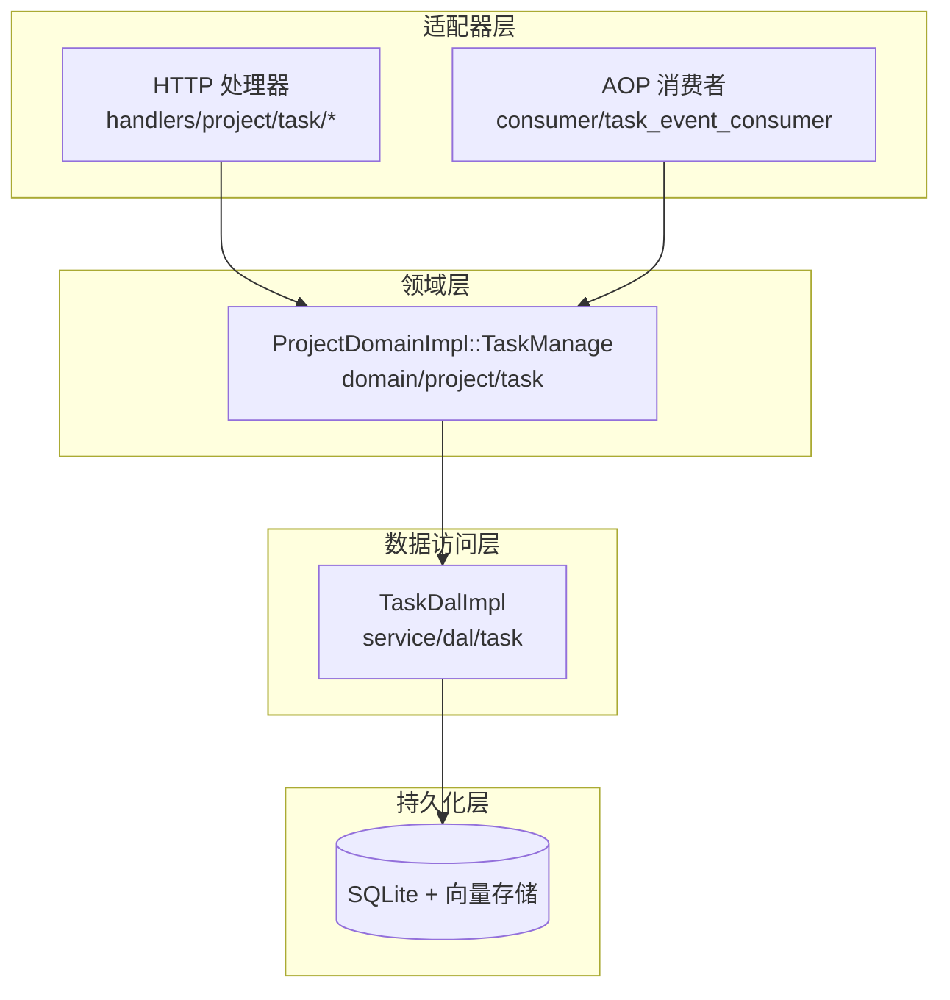
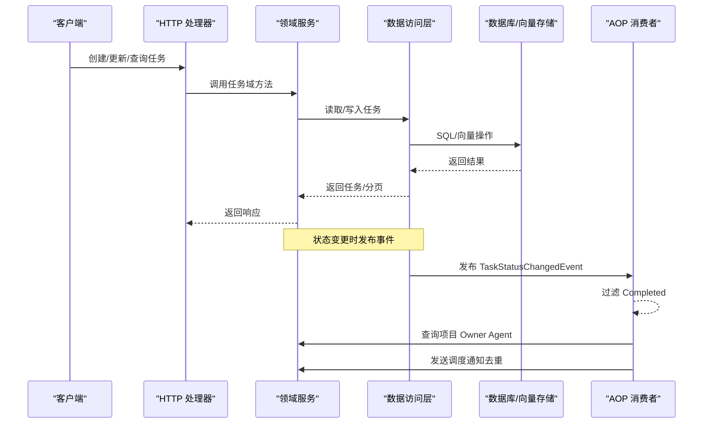
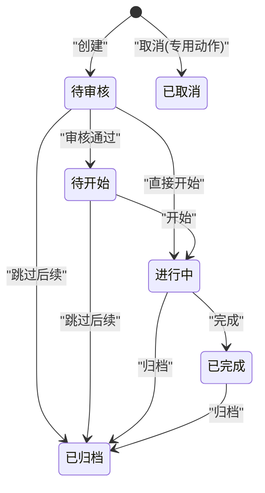
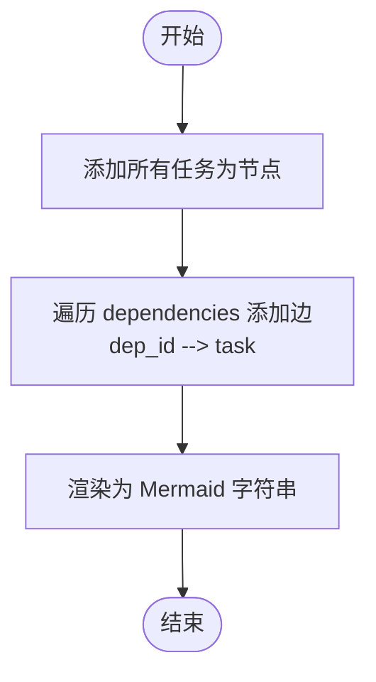
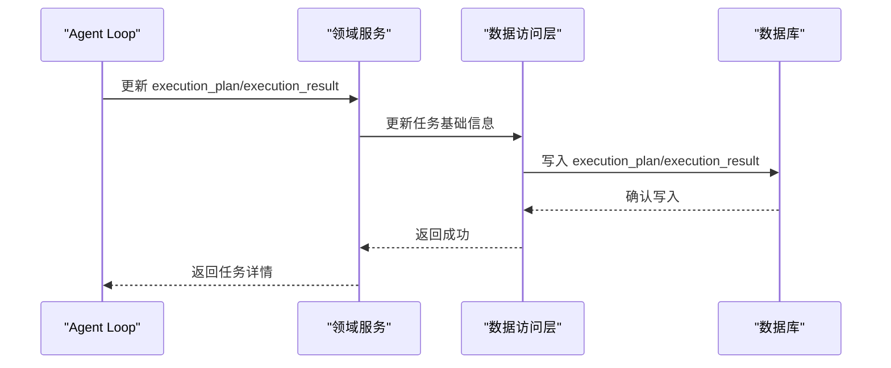
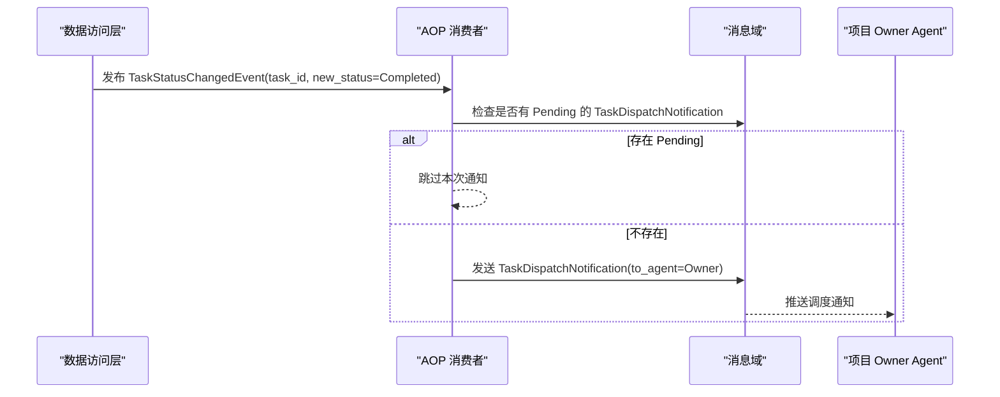
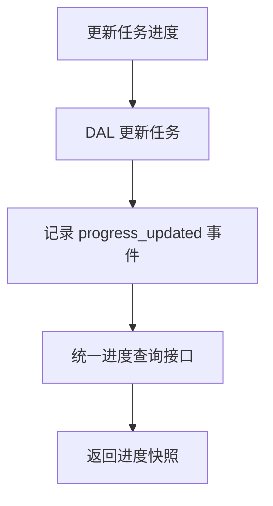
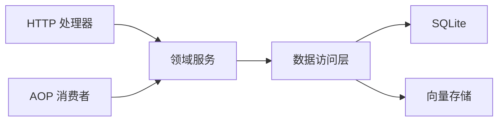

# 任务协作与执行计划

<cite>
**本文引用的文件**
- [common/src/enums/task.rs](file://common/src/enums/task.rs)
- [src/models/task.rs](file://src/models/task.rs)
- [src/service/domain/project/task.rs](file://src/service/domain/project/task.rs)
- [src/service/domain/project/task_graph.rs](file://src/service/domain/project/task_graph.rs)
- [src/consumer/task_event_consumer.rs](file://src/consumer/task_event_consumer.rs)
- [common/src/api/task.rs](file://common/src/api/task.rs)
- [src/handlers/system/task_progress.rs](file://src/handlers/system/task_progress.rs)
- [migrations/20260806000001_execution_plan_result.sql](file://migrations/20260806000001_execution_plan_result.sql)
- [src/service/dal/task.rs](file://src/service/dal/task.rs)
- [src/handlers/project/task/mod.rs](file://src/handlers/project/task/mod.rs)
</cite>

## 目录
1. [简介](#简介)
2. [项目结构](#项目结构)
3. [核心组件](#核心组件)
4. [架构总览](#架构总览)
5. [详细组件分析](#详细组件分析)
6. [依赖关系分析](#依赖关系分析)
7. [性能考虑](#性能考虑)
8. [故障排查指南](#故障排查指南)
9. [结论](#结论)
10. [附录：API 示例](#附录api-示例)

## 简介
本文件围绕“任务协作与执行计划追踪”能力，系统说明项目、任务、Agent 之间的协作机制，覆盖任务分配、状态流转、进度跟踪；解释 execution_plan 与 execution_result 的显式记录机制；阐述 DAG 依赖关系的建立与管理；定义任务状态机（待开始→进行中→已完成→已取消）及扩展状态的转换规则；介绍如何创建和执行复杂任务计划（多 Agent 协作、任务依赖、并行执行等）；并提供任务管理的 API 示例（创建、更新进度、查询状态等），以及监控、调试和性能优化方法。

## 项目结构
本项目遵循严格四层单向调用：Adapter（HTTP Handler / AOP Producer）→ Domain → DAL → DAO。任务相关代码主要分布在以下位置：
- Adapter 层：HTTP 处理器（handlers）暴露任务 CRUD、状态、进度、搜索等接口；AOP 消费者（consumer）异步处理任务事件。
- Domain 层：project::task 实现任务业务编排（创建、查询、状态流转、进度更新、事件记录）。
- DAL 层：task DAL 封装数据访问、混合搜索、统计聚合、向量索引维护与重建。
- DAO 层：SQL 持久化与统计存储（由 DAL 内部使用）。
- 模型与枚举：TaskPo/Task 实体、TaskStatus/AssigneeType 枚举、API DTO。

**图表来源**
- [src/handlers/project/task/mod.rs:1-28](file://src/handlers/project/task/mod.rs#L1-L28)
- [src/service/domain/project/task.rs:1-526](file://src/service/domain/project/task.rs#L1-L526)
- [src/service/dal/task.rs:1-800](file://src/service/dal/task.rs#L1-L800)
- [src/consumer/task_event_consumer.rs:1-138](file://src/consumer/task_event_consumer.rs#L1-L138)

**章节来源**
- [src/handlers/project/task/mod.rs:1-28](file://src/handlers/project/task/mod.rs#L1-L28)
- [src/service/domain/project/task.rs:1-526](file://src/service/domain/project/task.rs#L1-L526)
- [src/service/dal/task.rs:1-800](file://src/service/dal/task.rs#L1-L800)
- [src/consumer/task_event_consumer.rs:1-138](file://src/consumer/task_event_consumer.rs#L1-L138)

## 核心组件
- 任务实体与枚举
  - TaskPo：持久化对象，包含任务基本信息、时间戳、依赖、execution_plan、execution_result 等字段。
  - Task：业务实体，封装 TaskPo 并暴露 start/complete/cancel/set_progress 等方法。
  - TaskStatus：任务状态枚举（含 Cancelled/PendingReview/Pending/InProgress/Completed/Archived）。
  - AssigneeType：任务分配对象类型（User/Agent）。
- 领域服务（Domain）
  - ProjectDomainImpl::TaskManage：负责任务创建、查询、状态流转、进度更新、事件记录。
- 数据访问层（DAL）
  - TaskDalImpl：统一查询、混合搜索（FTS5+向量）、统计聚合、向量索引维护与重建、状态更新后发布事件。
- AOP 消费者
  - TaskEventConsumer：订阅 task.status_changed，当任务完成时向项目 Owner Agent 发送调度通知（去重）。
- 依赖图构建
  - build_task_graph_mermaid：基于 dependencies 构建 DAG 并渲染为 Mermaid 字符串。

**章节来源**
- [src/models/task.rs:1-343](file://src/models/task.rs#L1-L343)
- [common/src/enums/task.rs:1-100](file://common/src/enums/task.rs#L1-L100)
- [src/service/domain/project/task.rs:1-526](file://src/service/domain/project/task.rs#L1-L526)
- [src/service/dal/task.rs:1-800](file://src/service/dal/task.rs#L1-L800)
- [src/consumer/task_event_consumer.rs:1-138](file://src/consumer/task_event_consumer.rs#L1-L138)
- [src/service/domain/project/task_graph.rs:1-67](file://src/service/domain/project/task_graph.rs#L1-L67)

## 架构总览
任务协作与执行计划的关键流程如下：
- 创建任务：Adapter 接收请求 → Domain 校验并创建 Task → DAL 写入 SQLite 并尝试构建向量索引。
- 状态流转：Domain 校验目标状态合法性 → DAL 更新状态并发布 TaskStatusChangedEvent → Consumer 异步消费（仅 Completed）→ 向项目 Owner Agent 发送调度通知。
- 进度跟踪：Domain 更新 progress → 记录事件 → 可通过统一进度接口查询。
- 依赖管理：通过 dependencies 字段表达前置任务；支持构建 DAG 可视化。
- 执行计划与结果：execution_plan/execution_result 在任务上显式记录，便于审计与回溯。

**图表来源**
- [src/handlers/project/task/mod.rs:1-28](file://src/handlers/project/task/mod.rs#L1-L28)
- [src/service/domain/project/task.rs:281-482](file://src/service/domain/project/task.rs#L281-L482)
- [src/service/dal/task.rs:607-643](file://src/service/dal/task.rs#L607-L643)
- [src/consumer/task_event_consumer.rs:52-136](file://src/consumer/task_event_consumer.rs#L52-L136)

## 详细组件分析

### 任务实体与状态机
- 实体
  - TaskPo：包含 id/title/description/status/priority/tags/due_at/start_at/end_at/dependencies/root_user_id/assignee_type/assignee_id/project_id/thinking_depth/progress/created_by/modified_by/created_at/updated_at/execution_plan/execution_result。
  - Task：提供 start()/complete()/cancel()/set_progress() 等业务方法，自动更新时间戳与进度。
- 状态机
  - 允许的状态转移包括：PendingReview→Pending/InProgress/Archived；Pending→InProgress/Archived；InProgress→Completed/Archived；Completed→Archived。
  - Cancelled 不允许通过通用状态接口设置，需使用专门的取消动作。
  - 进入 InProgress 时若未设置 start_at，则自动填充当前时间；进入 Completed 时自动设置 end_at。
  - 所有状态变更均记录 TaskEvent（created/started/completed/cancelled/status_changed/progress_updated）。

**图表来源**
- [src/service/domain/project/task.rs:394-482](file://src/service/domain/project/task.rs#L394-L482)
- [src/models/task.rs:172-188](file://src/models/task.rs#L172-L188)

**章节来源**
- [src/models/task.rs:1-343](file://src/models/task.rs#L1-L343)
- [common/src/enums/task.rs:1-100](file://common/src/enums/task.rs#L1-L100)
- [src/service/domain/project/task.rs:394-482](file://src/service/domain/project/task.rs#L394-L482)

### 依赖关系与 DAG 管理
- 依赖字段
  - TaskPo.dependencies 存储“前置任务 ID 列表”，即 A.dependencies 含 B 表示 A 依赖 B。
- DAG 构建
  - 将每个任务作为节点，按 dependencies 添加边 dep_id → task，形成有向无环图。
  - 支持渲染为 Mermaid flowchart，便于前端展示与文档输出。
- 可视化分类
  - 根据任务状态映射到 mermaid 类别（todo/doing/done/archived/pending_review/cancelled）。

**图表来源**
- [src/service/domain/project/task_graph.rs:17-54](file://src/service/domain/project/task_graph.rs#L17-L54)

**章节来源**
- [src/service/domain/project/task_graph.rs:1-67](file://src/service/domain/project/task_graph.rs#L1-L67)
- [src/models/task.rs:296-302](file://src/models/task.rs#L296-L302)

### 执行计划与执行结果的显式记录
- 字段说明
  - execution_plan：Agent Loop 规划阶段产出，用于记录任务的执行计划。
  - execution_result：Agent Loop 执行阶段产出，用于记录执行结果。
- 持久化
  - 数据库迁移为 projects 与 tasks 表新增 execution_plan、execution_result 字段。
- 更新入口
  - Domain 提供 update_basic 接口，可更新 execution_plan/execution_result，并记录修改者。

**图表来源**
- [migrations/20260806000001_execution_plan_result.sql:1-9](file://migrations/20260806000001_execution_plan_result.sql#L1-L9)
- [src/service/domain/project/task.rs:227-279](file://src/service/domain/project/task.rs#L227-L279)

**章节来源**
- [migrations/20260806000001_execution_plan_result.sql:1-9](file://migrations/20260806000001_execution_plan_result.sql#L1-L9)
- [src/service/domain/project/task.rs:227-279](file://src/service/domain/project/task.rs#L227-L279)
- [src/models/task.rs:59-62](file://src/models/task.rs#L59-L62)

### 任务事件与多 Agent 协作
- 事件发布
  - DAL 在更新任务状态后发布 TaskStatusChangedEvent（仅在状态实际变化时）。
- 事件消费
  - TaskEventConsumer 仅处理 Completed 事件，避免重复通知。
  - 检查项目 Owner Agent 是否已有 Pending 的 TaskDispatchNotification，若有则跳过。
  - 构建消息内容并发送到 Owner Agent，携带 project_id 与 task_id 上下文。
- 协作意义
  - 当子任务完成后，驱动项目级 Agent 进行下一步协调或补偿（Layer 2 补偿机制）。

**图表来源**
- [src/service/dal/task.rs:607-643](file://src/service/dal/task.rs#L607-L643)
- [src/consumer/task_event_consumer.rs:52-136](file://src/consumer/task_event_consumer.rs#L52-L136)

**章节来源**
- [src/consumer/task_event_consumer.rs:1-138](file://src/consumer/task_event_consumer.rs#L1-L138)
- [src/service/dal/task.rs:607-643](file://src/service/dal/task.rs#L607-L643)

### 进度跟踪与统一查询
- 进度更新
  - Domain::update_progress 更新任务进度（0-100），记录修改者与事件。
- 统一进度查询
  - handlers/system/task_progress::get_task_progress 提供后台任务进度查询，返回快照。
- 用途
  - 适用于长时间运行的任务或 Agent 循环的执行进度反馈。

**图表来源**
- [src/service/domain/project/task.rs:484-524](file://src/service/domain/project/task.rs#L484-L524)
- [src/handlers/system/task_progress.rs:1-26](file://src/handlers/system/task_progress.rs#L1-L26)

**章节来源**
- [src/service/domain/project/task.rs:484-524](file://src/service/domain/project/task.rs#L484-L524)
- [src/handlers/system/task_progress.rs:1-26](file://src/handlers/system/task_progress.rs#L1-L26)

### 混合搜索与统计
- 混合搜索
  - DAL::search 支持关键词（FTS5）与向量语义搜索，自动选择策略并合并结果。
  - 对向量搜索结果进行距离阈值过滤，失败时降级到纯关键词搜索。
- 统计聚合
  - 可按任务维度获取 TaskStats 与 ModelCallStats，支持时间范围与粒度控制。
- 向量索引
  - 创建/更新任务时尝试构建向量索引；取消任务时清理索引；支持全量重建。

**章节来源**
- [src/service/dal/task.rs:366-571](file://src/service/dal/task.rs#L366-L571)
- [src/service/dal/task.rs:690-800](file://src/service/dal/task.rs#L690-L800)

## 依赖关系分析
- 模块耦合
  - HTTP 处理器依赖 Domain 接口；Domain 依赖 DAL；DAL 依赖 DAO 与外部存储（SQLite、向量存储）。
  - AOP 消费者依赖 Domain 的消息域以发送调度通知。
- 外部依赖
  - FTS5 全文检索、向量存储（LanceDB/HNSW/InMemory/SqliteVss）、DuckDB 统计。
- 潜在风险
  - 向量搜索失败应降级；向量索引重建需幂等且容忍单条失败。
  - 事件消费需去重，避免重复通知。

**图表来源**
- [src/handlers/project/task/mod.rs:1-28](file://src/handlers/project/task/mod.rs#L1-L28)
- [src/service/domain/project/task.rs:1-526](file://src/service/domain/project/task.rs#L1-L526)
- [src/service/dal/task.rs:1-800](file://src/service/dal/task.rs#L1-L800)
- [src/consumer/task_event_consumer.rs:1-138](file://src/consumer/task_event_consumer.rs#L1-L138)

**章节来源**
- [src/handlers/project/task/mod.rs:1-28](file://src/handlers/project/task/mod.rs#L1-L28)
- [src/service/dal/task.rs:1-800](file://src/service/dal/task.rs#L1-L800)

## 性能考虑
- 搜索性能
  - 混合搜索优先返回 Hybrid/Vector/Keyword 三类命中，并按距离或 BM25 排序；限制最大返回数量以避免过载。
- 向量索引
  - 创建/更新时异步或降级处理向量索引；重建时检查 model_provider_id 一致性，避免重复工作。
- 事件消费
  - 异步消费任务状态变更事件，避免阻塞主流程；对 Completed 事件进行去重。
- 统计查询
  - 支持时间范围与粒度控制，按需加载统计数据，减少不必要计算。

**章节来源**
- [src/service/dal/task.rs:366-571](file://src/service/dal/task.rs#L366-L571)
- [src/service/dal/task.rs:723-800](file://src/service/dal/task.rs#L723-L800)
- [src/consumer/task_event_consumer.rs:52-136](file://src/consumer/task_event_consumer.rs#L52-L136)

## 故障排查指南
- 任务状态异常
  - 检查 Domain 状态流转逻辑，确保目标状态合法；Cancelled 需通过专用动作设置。
- 向量搜索失败
  - 查看日志中的向量搜索降级提示；确认 Embedding Provider 可用；必要时触发重建。
- 事件未消费
  - 确认 TaskEventConsumer 已注册；检查是否有 Pending 的 TaskDispatchNotification 导致去重；验证项目 Owner Agent 是否存在。
- 进度查询为空
  - 确认任务 ID 有效；检查统一进度接口是否正确路由到后台任务注册表。

**章节来源**
- [src/service/domain/project/task.rs:394-482](file://src/service/domain/project/task.rs#L394-L482)
- [src/service/dal/task.rs:366-571](file://src/service/dal/task.rs#L366-L571)
- [src/consumer/task_event_consumer.rs:52-136](file://src/consumer/task_event_consumer.rs#L52-L136)
- [src/handlers/system/task_progress.rs:1-26](file://src/handlers/system/task_progress.rs#L1-L26)

## 结论
该任务协作与执行计划体系通过清晰的层次划分与严格的单向调用，实现了任务创建、状态流转、进度跟踪、依赖管理与多 Agent 协作的完整闭环。execution_plan/execution_result 的显式记录增强了可追溯性；DAG 依赖可视化提升了可观测性；AOP 事件驱动确保了松耦合与高吞吐。结合混合搜索与统计聚合，提供了强大的查询与分析能力。

## 附录：API 示例
以下为任务管理常用接口的请求/响应结构说明（基于 common/src/api/task.rs）：
- 创建任务
  - 请求体：CreateTaskRequest（title、description、priority、tags、root_user_id、assignee_type、assignee_id、project_id、due_at、dependencies）
  - 响应体：GetTaskResponse
- 获取任务
  - 路径参数：id
  - 查询参数：with_stats、with_model_call_stats、stats_time_start、stats_time_end、stats_interval、with_artifacts
  - 响应体：GetTaskResponse
- 更新任务
  - 路径参数：id
  - 请求体：UpdateTaskRequest（title、description、priority、tags、due_at、dependencies、execution_plan、execution_result）
  - 响应体：GetTaskResponse
- 更新任务状态
  - 路径参数：id
  - 请求体：UpdateTaskStatusRequest（status）
  - 响应体：GetTaskResponse
- 更新任务进度
  - 路径参数：id
  - 请求体：UpdateTaskProgressRequest（progress）
  - 响应体：GetTaskResponse
- 查询任务列表
  - 请求体：ListTasksRequest（pagination）
  - 响应体：ListTasksResponse（tasks）
- 通用查询
  - 请求体：TaskQueryRequest（ids、keyword、project_id、assignee_type、assignee_id、status_in、pagination）
  - 响应体：PagedResult<TaskListItem>
- 搜索任务
  - 请求体：SearchTasksRequest（keyword、ids、project_id、assignee_type、assignee_id、status_in、pagination）
  - 响应体：SearchTasksResponse（PagedResult<TaskListItem>）

**章节来源**
- [common/src/api/task.rs:10-299](file://common/src/api/task.rs#L10-L299)