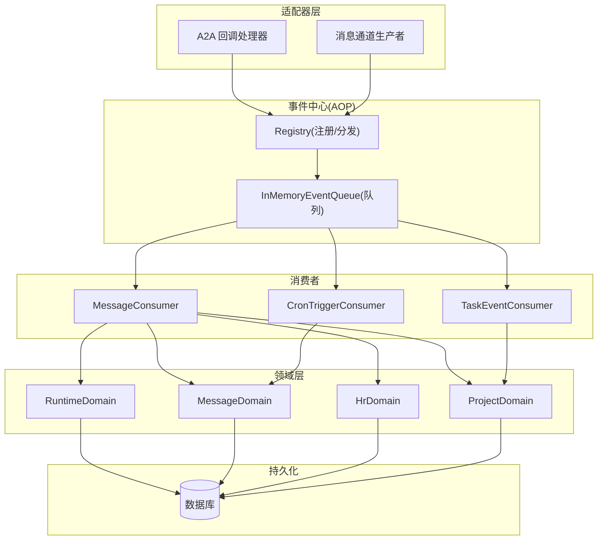
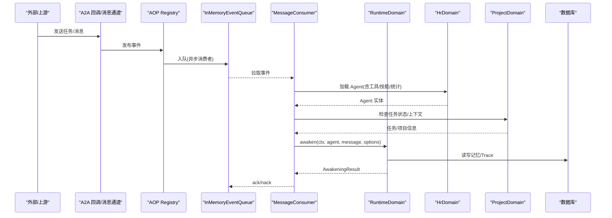
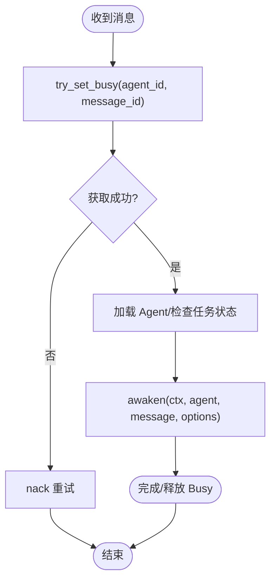
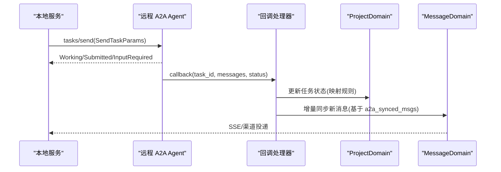
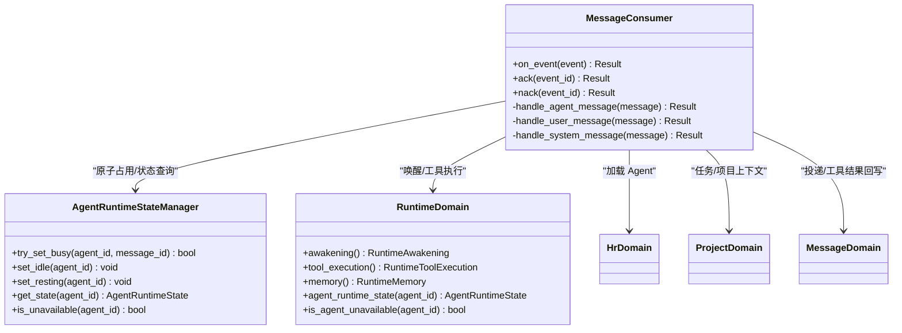

# 多 Agent 协作机制

<cite>
**本文引用的文件**
- [src/consumer/message.rs](file://src/consumer/message.rs)
- [src/consumer/mod.rs](file://src/consumer/mod.rs)
- [src/pkg/agent_runtime_state.rs](file://src/pkg/agent_runtime_state.rs)
- [src/service/domain/runtime/mod.rs](file://src/service/domain/runtime/mod.rs)
- [common/src/enums/agent.rs](file://common/src/enums/agent.rs)
- [src/handlers/a2a/callback.rs](file://src/handlers/a2a/callback.rs)
- [src/producer/message_channel.rs](file://src/producer/message_channel.rs)
- [common/src/api/a2a.rs](file://common/src/api/a2a.rs)
- [src/service/dao/agent_runtime/a2a.rs](file://src/service/dao/agent_runtime/a2a.rs)
- [src/consumer/task_event_consumer.rs](file://src/consumer/task_event_consumer.rs)
- [docs/superpowers/plans/2026-08-05-agent-loop-aop-hooks.md](file://docs/superpowers/plans/2026-08-05-agent-loop-aop-hooks.md)
- [docs/superpowers/plans/2026-07-20-aop-event-center.md](file://docs/superpowers/plans/2026-07-20-aop-event-center.md)
- [docs/external_agent_design.md](file://docs/external_agent_design.md)
</cite>

## 目录
1. [简介](#简介)
2. [项目结构](#项目结构)
3. [核心组件](#核心组件)
4. [架构总览](#架构总览)
5. [详细组件分析](#详细组件分析)
6. [依赖关系分析](#依赖关系分析)
7. [性能与并发特性](#性能与并发特性)
8. [故障转移、重试与恢复](#故障转移重试与恢复)
9. [监控与调试](#监控与调试)
10. [结论](#结论)

## 简介
本文件面向“多 Agent 协作”主题，系统化说明任务如何在多个 Agent 之间分配与流转、Agent 间通信协议与数据格式、进度同步与一致性保证、依赖与并行执行优化、以及监控调试与失败恢复策略。文档严格遵循四层单向调用（Adapter → Domain → DAL → DAO），所有业务编排位于 Consumer/Handler 层，具体执行业务逻辑在 Domain/DAL/DAO 层完成。

## 项目结构
围绕多 Agent 协作的关键路径包括：
- 消息入口与分发：A2A 回调、消息通道生产者、内部 AOP 事件中心
- 消费者编排：MessageConsumer、TaskEventConsumer、CronTriggerConsumer
- 运行时状态：AgentRuntimeStateManager（Idle/Busy/Resting）
- 领域能力：RuntimeDomain（唤醒、工具执行、记忆）
- 外部 Agent：A2A 协议适配与远程调用

图表来源
- [src/consumer/mod.rs:16-36](file://src/consumer/mod.rs#L16-L36)
- [docs/superpowers/plans/2026-07-20-aop-event-center.md:728-943](file://docs/superpowers/plans/2026-07-20-aop-event-center.md#L728-L943)
- [src/consumer/message.rs:64-141](file://src/consumer/message.rs#L64-L141)

章节来源
- [src/consumer/mod.rs:16-36](file://src/consumer/mod.rs#L16-L36)
- [docs/superpowers/plans/2026-07-20-aop-event-center.md:728-943](file://docs/superpowers/plans/2026-07-20-aop-event-center.md#L728-L943)

## 核心组件
- 事件中心与消费者注册：通过 Registry 统一注册 Producer/Consumer，异步消费者使用独立队列，支持 ack/nack 可靠投递。
- 消息消费者：按 to_role 分发到不同领域；对 Agent 消息进行原子占用（try_set_busy）、上下文装配、唤醒与思考循环。
- 运行时状态管理：内存级 Agent 状态机（Idle/Busy/Resting），提供 try_set_busy 避免 TOCTOU 竞态。
- 领域能力：RuntimeDomain 封装唤醒、工具执行、记忆沉淀等；MessageDomain/HrDomain/ProjectDomain 负责各自业务。
- A2A 外部协作：通过 HTTP JSON-RPC 2.0 与远程 Agent 交互，回调与轮询双通道，映射本地 Task 状态并增量同步消息。

章节来源
- [docs/superpowers/plans/2026-07-20-aop-event-center.md:728-943](file://docs/superpowers/plans/2026-07-20-aop-event-center.md#L728-L943)
- [src/consumer/message.rs:64-141](file://src/consumer/message.rs#L64-L141)
- [src/pkg/agent_runtime_state.rs:31-157](file://src/pkg/agent_runtime_state.rs#L31-L157)
- [src/service/domain/runtime/mod.rs:33-49](file://src/service/domain/runtime/mod.rs#L33-L49)
- [docs/external_agent_design.md:152-199](file://docs/external_agent_design.md#L152-L199)

## 架构总览
多 Agent 协作的核心流程是“消息驱动 + 事件编排 + 状态机控制”。外部或内部消息进入后，经 AOP 事件中心路由到对应 Consumer；Consumer 根据角色与上下文调度 Domain；Domain 协调 DAL/DAO 完成持久化与外部调用；Agent 的运行时状态由 AgentRuntimeStateManager 统一管理，确保并发安全与可观测性。

图表来源
- [src/consumer/message.rs:78-141](file://src/consumer/message.rs#L78-L141)
- [src/consumer/message.rs:147-357](file://src/consumer/message.rs#L147-L357)
- [docs/superpowers/plans/2026-07-20-aop-event-center.md:809-878](file://docs/superpowers/plans/2026-07-20-aop-event-center.md#L809-L878)

## 详细组件分析

### 任务分配与流转策略
- 任务来源
  - 用户/系统/A2A 消息进入后，持久化为 MessagePo，并发布 MESSAGE_CREATED 事件。
  - 消息通道生产者支持默认对话框与 Project 对话框两种上下文，未指定 to_agent_id 时走 resolve_agent 兜底。
- 消费者分发
  - MessageConsumer 订阅 message.created，按 to_role 分发：Agent 消息触发唤醒，User 消息走投递，System 消息走工具执行。
  - 并发度为 4，空队列休眠 100ms，错误重试间隔 1000ms。
- 任务状态联动
  - TaskEventConsumer 订阅 task.status_changed，仅处理 Completed 变更，向 Owner Agent 发送 TaskDispatchNotification，驱动后续调度。
  - CronTriggerConsumer 定时检查进行中项目，向 Owner Agent 推送跟进通知，防止阻塞。

章节来源
- [src/consumer/message.rs:64-141](file://src/consumer/message.rs#L64-L141)
- [src/consumer/message.rs:147-357](file://src/consumer/message.rs#L147-L357)
- [src/consumer/task_event_consumer.rs:1-46](file://src/consumer/task_event_consumer.rs#L1-L46)
- [src/producer/message_channel.rs:40-115](file://src/producer/message_channel.rs#L40-L115)

### 负载均衡与可用性控制
- 原子占用
  - 使用 AgentRuntimeStateManager::try_set_busy 原子尝试将 Idle 转为 Busy，避免多 worker 同时唤醒同一 Agent 的竞态。
  - 若返回 false（Busy/Resting），则 nack 重试，实现天然退避与负载分散。
- 不可用判定
  - is_unavailable() 将 Busy/Resting 视为不可用，用于预检与跳过无意义消费。
- 状态事件
  - 状态变更通过 AOP 发布 AgentStateEvent，便于监控与审计。

图表来源
- [src/consumer/message.rs:147-196](file://src/consumer/message.rs#L147-L196)
- [src/pkg/agent_runtime_state.rs:85-107](file://src/pkg/agent_runtime_state.rs#L85-L107)
- [common/src/enums/agent.rs:64-99](file://common/src/enums/agent.rs#L64-L99)

章节来源
- [src/consumer/message.rs:147-196](file://src/consumer/message.rs#L147-L196)
- [src/pkg/agent_runtime_state.rs:85-107](file://src/pkg/agent_runtime_state.rs#L85-L107)
- [common/src/enums/agent.rs:64-99](file://common/src/enums/agent.rs#L64-L99)

### Agent 间通信协议与数据交换格式
- A2A 协议
  - 对外暴露 AgentCard（组织级能力描述），支持 streaming/push_notifications 能力声明。
  - 通过 HTTP JSON-RPC 2.0 调用 tasks/send，回调端点 POST /a2a/callback/:task_id 接收远程结果。
- 数据映射
  - 远程 A2aTask 状态映射到本地 TaskStatus（Completed/Cancelled/Pending→InProgress）。
  - 基于 tags 中的 a2a_synced_msgs:N 做增量消息去重，只同步新消息。
- 出站调用
  - A2aRuntimeDao 维护 endpoint/agent_name/auth_token/timeout 配置，生成单调递增请求 ID，发起远程调用。

图表来源
- [common/src/api/a2a.rs:1-47](file://common/src/api/a2a.rs#L1-L47)
- [src/handlers/a2a/callback.rs:47-158](file://src/handlers/a2a/callback.rs#L47-L158)
- [src/service/dao/agent_runtime/a2a.rs:1-47](file://src/service/dao/agent_runtime/a2a.rs#L1-L47)
- [docs/external_agent_design.md:152-199](file://docs/external_agent_design.md#L152-L199)

章节来源
- [common/src/api/a2a.rs:1-47](file://common/src/api/a2a.rs#L1-L47)
- [src/handlers/a2a/callback.rs:47-158](file://src/handlers/a2a/callback.rs#L47-L158)
- [src/service/dao/agent_runtime/a2a.rs:1-47](file://src/service/dao/agent_runtime/a2a.rs#L1-L47)
- [docs/external_agent_design.md:152-199](file://docs/external_agent_design.md#L152-L199)

### 任务进度同步、冲突解决与一致性保证
- 进度同步
  - TaskEventConsumer 监听 Completed 事件，向 Owner Agent 发送调度通知，驱动下一任务启动。
  - CronTriggerConsumer 定期扫描进行中项目，发现阻塞或停滞时主动干预。
- 冲突解决
  - 通过 try_set_busy 原子抢占，避免重复唤醒；不可用时直接重试，天然退避。
  - 任务状态检查优先于 thinking_depth 检查，避免对已完成/取消/归档任务继续唤醒。
- 一致性保证
  - 消息消费采用 AOP 推送模式，InMemoryEventQueue 按 order_key 维护顺序；ack/nack 由框架自动处理，业务仅更新 DB 消息状态。
  - A2A 回调与轮询均基于已同步计数去重，幂等处理。

章节来源
- [src/consumer/task_event_consumer.rs:1-46](file://src/consumer/task_event_consumer.rs#L1-L46)
- [src/consumer/message.rs:198-244](file://src/consumer/message.rs#L198-L244)
- [docs/superpowers/plans/2026-07-20-aop-event-center.md:375-424](file://docs/superpowers/plans/2026-07-20-aop-event-center.md#L375-L424)
- [docs/external_agent_design.md:176-199](file://docs/external_agent_design.md#L176-L199)

### 依赖关系与并行执行优化
- 依赖关系
  - MessageConsumer 依赖 RuntimeDomain、MessageDomain、HrDomain、ProjectDomain，按职责解耦。
  - RuntimeDomain 聚合 Memory/ToolExecution/Awakening，并通过 PromptBuilder 适配不同 Agent 类型。
- 并行执行
  - MessageConsumer 并发度 4，空队列短休眠，错误重试间隔合理，平衡吞吐与资源占用。
  - think 循环内置超时与最大迭代次数，防止无限循环；每轮发布 ThinkRoundEvent 供统计与追踪。

章节来源
- [src/consumer/message.rs:64-141](file://src/consumer/message.rs#L64-L141)
- [src/service/domain/runtime/mod.rs:33-49](file://src/service/domain/runtime/mod.rs#L33-L49)
- [docs/superpowers/plans/2026-08-05-agent-loop-aop-hooks.md:378-512](file://docs/superpowers/plans/2026-08-05-agent-loop-aop-hooks.md#L378-L512)

## 依赖关系分析

图表来源
- [src/consumer/message.rs:64-141](file://src/consumer/message.rs#L64-L141)
- [src/pkg/agent_runtime_state.rs:31-157](file://src/pkg/agent_runtime_state.rs#L31-L157)
- [src/service/domain/runtime/mod.rs:33-49](file://src/service/domain/runtime/mod.rs#L33-L49)

章节来源
- [src/consumer/message.rs:64-141](file://src/consumer/message.rs#L64-L141)
- [src/pkg/agent_runtime_state.rs:31-157](file://src/pkg/agent_runtime_state.rs#L31-L157)
- [src/service/domain/runtime/mod.rs:33-49](file://src/service/domain/runtime/mod.rs#L33-L49)

## 性能与并发特性
- 消费者并发与背压
  - MessageConsumer 并发度 4，空队列休眠 100ms，错误重试 1000ms，避免忙轮询与过度重试。
- 思考循环保护
  - 内置超时（秒级）与最大迭代次数，防止模型推理卡死；每轮发布事件用于统计。
- 状态机与锁粒度
  - try_set_busy 原子操作减少竞争窗口；DashMap 存储状态，适合高并发读。
- 外部调用超时
  - A2aRuntimeDao 支持 timeout_secs 配置，避免远端慢调用拖垮整体。

章节来源
- [src/consumer/message.rs:130-141](file://src/consumer/message.rs#L130-L141)
- [docs/superpowers/plans/2026-08-05-agent-loop-aop-hooks.md:378-512](file://docs/superpowers/plans/2026-08-05-agent-loop-aop-hooks.md#L378-L512)
- [src/pkg/agent_runtime_state.rs:31-107](file://src/pkg/agent_runtime_state.rs#L31-L107)
- [src/service/dao/agent_runtime/a2a.rs:29-47](file://src/service/dao/agent_runtime/a2a.rs#L29-L47)

## 故障转移、重试与恢复
- 重试机制
  - ack/nack 由 AOP 框架管理；业务 nack 会将消息标记为 Pending，等待下次消费。
  - 当 all delivery channels failed 时返回错误触发重试，确保消息不丢失。
- 失败分支清理
  - 在 get_agent 失败、thinking_depth 检查、任务状态检查等失败路径显式 set_idle，避免 Busy 泄漏。
- 幂等与去重
  - A2A 回调与轮询基于 a2a_synced_msgs 增量同步，天然支持重试。
  - 任务状态映射幂等：终态任务直接返回 ok，避免重复处理。
- 恢复策略
  - 非致命错误（如 stats 查询失败）不阻塞主流程；临时错误释放 Busy 允许重试。

章节来源
- [src/consumer/message.rs:114-141](file://src/consumer/message.rs#L114-L141)
- [src/consumer/message.rs:180-196](file://src/consumer/message.rs#L180-L196)
- [src/consumer/message.rs:359-389](file://src/consumer/message.rs#L359-L389)
- [docs/external_agent_design.md:176-199](file://docs/external_agent_design.md#L176-L199)

## 监控与调试
- 事件与日志
  - AgentLoopConsumer 订阅 agent.loop 与 agent.think.round，记录开始/结束、轮次耗时、工具调用数量。
  - ToolExecLogConsumer/ToolExecStatsConsumer 记录工具调用日志与统计。
- 指标采集
  - AOP Stats Hook 与 Collector 收集分布与时序指标，便于可视化。
- 状态事件
  - AgentRuntimeStateManager 状态变更发布 AgentStateEvent，可用于实时看板与告警。
- 调试建议
  - 关注 trace_id 链路，确保跨模块追踪完整。
  - 结合 ThinkRoundEvent 与 ToolCallEntry 定位瓶颈与异常。

章节来源
- [docs/superpowers/plans/2026-08-05-agent-loop-aop-hooks.md:1598-1693](file://docs/superpowers/plans/2026-08-05-agent-loop-aop-hooks.md#L1598-L1693)
- [src/consumer/mod.rs:16-36](file://src/consumer/mod.rs#L16-L36)
- [src/pkg/agent_runtime_state.rs:134-157](file://src/pkg/agent_runtime_state.rs#L134-L157)

## 结论
本项目通过“消息驱动 + AOP 事件中心 + 状态机控制”的多 Agent 协作机制，实现了任务的高效分配、可靠的流转与一致的状态同步。关键设计包括：
- 原子占用与状态机避免并发冲突
- 事件驱动的消费者编排与可靠投递
- A2A 协议支持与幂等增量同步
- 完善的监控与调试能力
- 合理的重试与恢复策略

这些机制共同保障了在多 Agent 场景下的可扩展性、稳定性与可观测性。