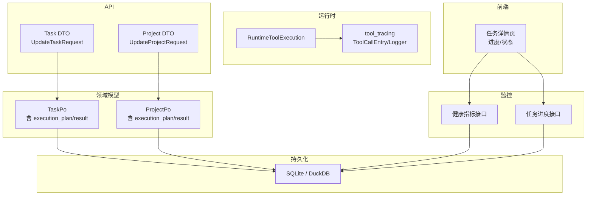
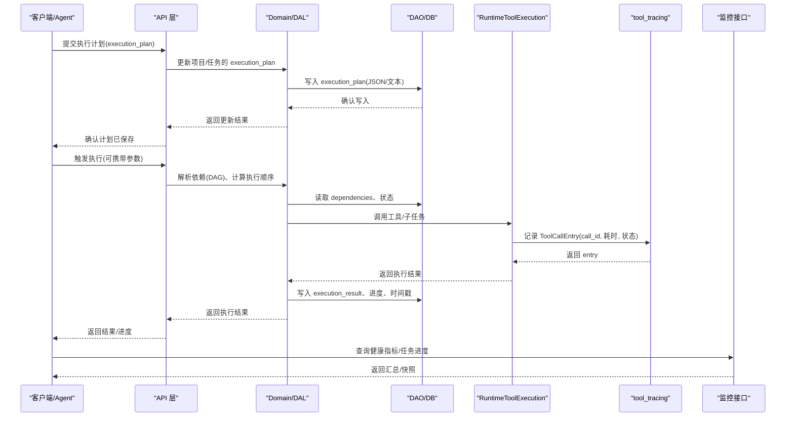
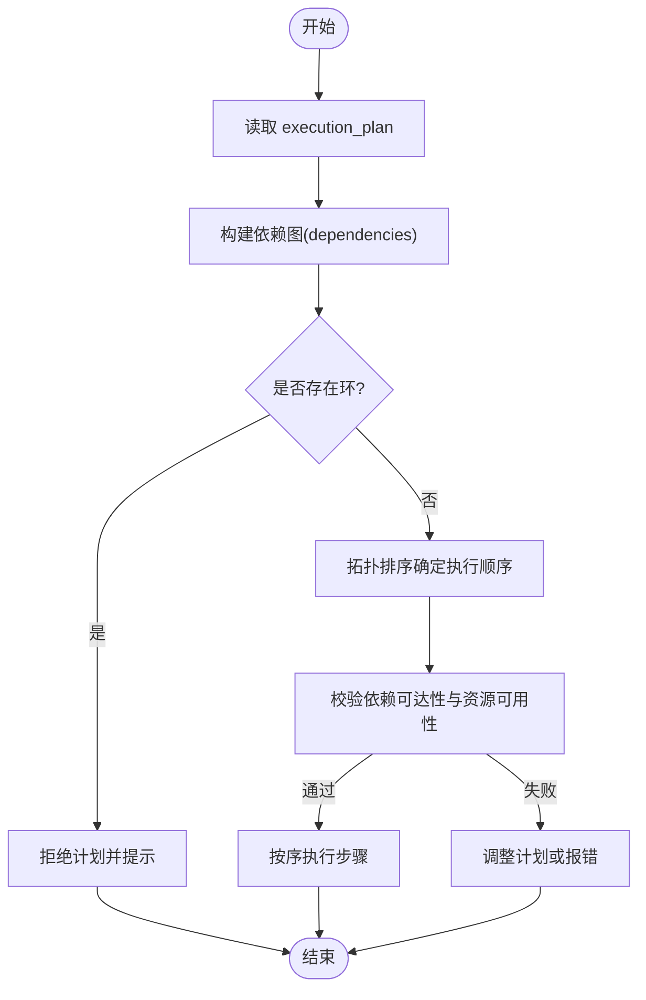
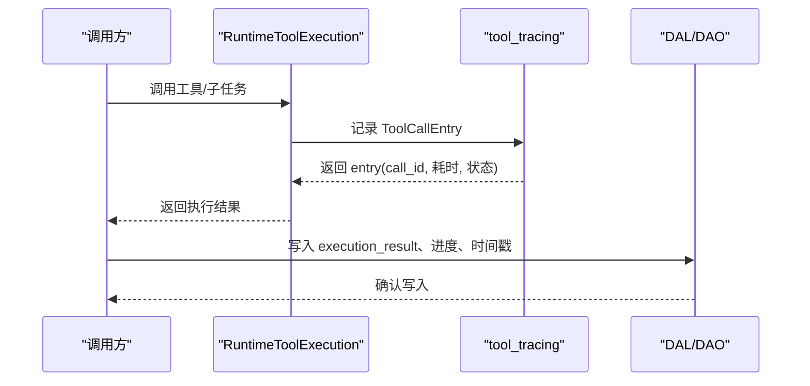
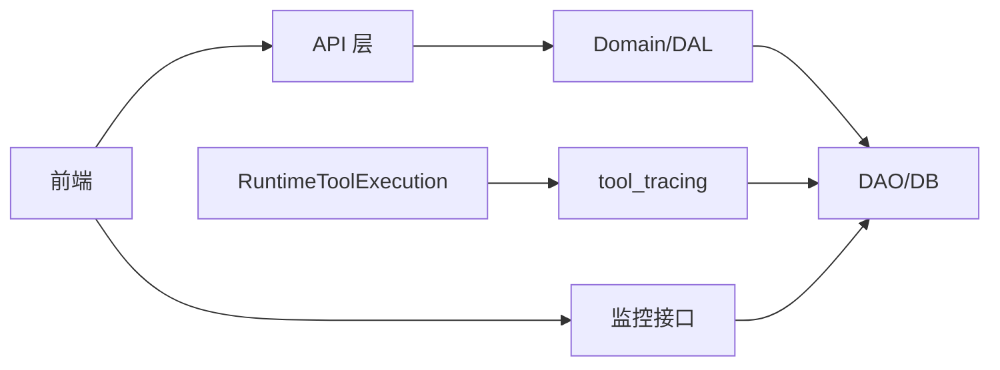

# 执行计划与结果追踪

<cite>
**本文引用的文件**
- [migrations/20260806000001_execution_plan_result.sql](file://migrations/20260806000001_execution_plan_result.sql)
- [src/models/task.rs](file://src/models/task.rs)
- [src/models/project.rs](file://src/models/project.rs)
- [common/src/api/task.rs](file://common/src/api/task.rs)
- [common/src/api/project.rs](file://common/src/api/project.rs)
- [src/service/domain/runtime/tool_execution.rs](file://src/service/domain/runtime/tool_execution.rs)
- [src/pkg/tool_tracing/mod.rs](file://src/pkg/tool_tracing/mod.rs)
- [src/handlers/system/task_progress.rs](file://src/handlers/system/task_progress.rs)
- [src/handlers/system/health_metrics.rs](file://src/handlers/system/health_metrics.rs)
- [frontend/src/pages/project/task_detail.rs](file://frontend/src/pages/project/task_detail.rs)
- [AGENTS.md](file://AGENTS.md)
</cite>

## 目录
1. [简介](#简介)
2. [项目结构](#项目结构)
3. [核心组件](#核心组件)
4. [架构总览](#架构总览)
5. [详细组件分析](#详细组件分析)
6. [依赖关系分析](#依赖关系分析)
7. [性能考量](#性能考量)
8. [故障排查指南](#故障排查指南)
9. [结论](#结论)
10. [附录](#附录)

## 简介
本文件围绕“执行计划与结果追踪”能力，系统性说明 execution_plan 与 execution_result 的数据设计、计划创建流程（DAG 构建、依赖解析、执行顺序）、执行结果记录机制（成功/失败、错误原因、性能指标），以及执行历史的查询与分析方法。同时给出监控接口与实时进度跟踪、异常告警的落地方案，帮助使用者在任务与项目维度上完整掌握执行全生命周期。

## 项目结构
- 数据持久化层：通过迁移脚本为 projects 与 tasks 表新增 execution_plan、execution_result 字段，用于存储 Agent Loop 规划阶段与执行阶段的产物。
- 领域模型层：TaskPo 与 ProjectPo 分别包含 execution_plan 与 execution_result 可选字符串字段；Task/Project 业务实体对外暴露这些字段以支撑上层使用。
- API 契约层：common 中的 Task/Project DTO 提供更新 execution_plan/execution_result 的请求体与响应扩展点。
- 运行时工具调用与追踪：RuntimeToolExecution 负责工具调用的统一入口，结合 tool_tracing 模块生成结构化日志条目，便于后续检索与回溯。
- 监控与进度：系统级健康指标与后台任务进度查询接口，支持按 task_id 获取进度快照；前端任务详情页展示进度与状态。

图表来源
- [migrations/20260806000001_execution_plan_result.sql:1-9](file://migrations/20260806000001_execution_plan_result.sql#L1-L9)
- [src/models/task.rs:16-63](file://src/models/task.rs#L16-L63)
- [src/models/project.rs:15-58](file://src/models/project.rs#L15-L58)
- [common/src/api/task.rs:190-214](file://common/src/api/task.rs#L190-L214)
- [common/src/api/project.rs:167-187](file://common/src/api/project.rs#L167-L187)
- [src/service/domain/runtime/tool_execution.rs:12-76](file://src/service/domain/runtime/tool_execution.rs#L12-L76)
- [src/pkg/tool_tracing/mod.rs:1-12](file://src/pkg/tool_tracing/mod.rs#L1-L12)
- [src/handlers/system/task_progress.rs:1-25](file://src/handlers/system/task_progress.rs#L1-L25)
- [src/handlers/system/health_metrics.rs:106-134](file://src/handlers/system/health_metrics.rs#L106-L134)
- [frontend/src/pages/project/task_detail.rs:224-259](file://frontend/src/pages/project/task_detail.rs#L224-L259)

章节来源
- [migrations/20260806000001_execution_plan_result.sql:1-9](file://migrations/20260806000001_execution_plan_result.sql#L1-L9)
- [src/models/task.rs:16-63](file://src/models/task.rs#L16-L63)
- [src/models/project.rs:15-58](file://src/models/project.rs#L15-L58)
- [common/src/api/task.rs:190-214](file://common/src/api/task.rs#L190-L214)
- [common/src/api/project.rs:167-187](file://common/src/api/project.rs#L167-L187)
- [src/service/domain/runtime/tool_execution.rs:12-76](file://src/service/domain/runtime/tool_execution.rs#L12-L76)
- [src/pkg/tool_tracing/mod.rs:1-12](file://src/pkg/tool_tracing/mod.rs#L1-L12)
- [src/handlers/system/task_progress.rs:1-25](file://src/handlers/system/task_progress.rs#L1-L25)
- [src/handlers/system/health_metrics.rs:106-134](file://src/handlers/system/health_metrics.rs#L106-L134)
- [frontend/src/pages/project/task_detail.rs:224-259](file://frontend/src/pages/project/task_detail.rs#L224-L259)

## 核心组件
- 执行计划与结果字段
  - 项目与任务均具备 execution_plan 与 execution_result 两个可选文本字段，用于承载 Agent Loop 规划与执行阶段的产物。
  - 数据库迁移确保字段存在，模型层提供读写通道，API 层提供更新请求体。
- 工具调用与追踪
  - RuntimeToolExecution 统一工具调用入口，返回 ToolExecutionResult，并借助 tool_tracing 模块生成结构化日志条目（含 call_id、耗时、状态等）。
- 监控与进度
  - 健康指标接口统计活跃项目/任务数量、AOP 队列情况、运行时长等。
  - 统一后台任务进度查询接口支持按 task_id 获取进度快照。
- 前端可视化
  - 任务详情页展示进度条、状态切换与统计信息，支持实时更新。

章节来源
- [src/models/task.rs:16-63](file://src/models/task.rs#L16-L63)
- [src/models/project.rs:15-58](file://src/models/project.rs#L15-L58)
- [common/src/api/task.rs:190-214](file://common/src/api/task.rs#L190-L214)
- [common/src/api/project.rs:167-187](file://common/src/api/project.rs#L167-L187)
- [src/service/domain/runtime/tool_execution.rs:12-76](file://src/service/domain/runtime/tool_execution.rs#L12-L76)
- [src/pkg/tool_tracing/mod.rs:1-12](file://src/pkg/tool_tracing/mod.rs#L1-L12)
- [src/handlers/system/task_progress.rs:1-25](file://src/handlers/system/task_progress.rs#L1-L25)
- [src/handlers/system/health_metrics.rs:106-134](file://src/handlers/system/health_metrics.rs#L106-L134)
- [frontend/src/pages/project/task_detail.rs:224-259](file://frontend/src/pages/project/task_detail.rs#L224-L259)

## 架构总览
执行计划与结果追踪贯穿“计划定义 → DAG 构建 → 依赖解析 → 执行顺序确定 → 执行记录 → 历史查询 → 监控告警”的全链路。

图表来源
- [common/src/api/task.rs:190-214](file://common/src/api/task.rs#L190-L214)
- [common/src/api/project.rs:167-187](file://common/src/api/project.rs#L167-L187)
- [src/models/task.rs:16-63](file://src/models/task.rs#L16-L63)
- [src/models/project.rs:15-58](file://src/models/project.rs#L15-L58)
- [src/service/domain/runtime/tool_execution.rs:12-76](file://src/service/domain/runtime/tool_execution.rs#L12-L76)
- [src/pkg/tool_tracing/mod.rs:1-12](file://src/pkg/tool_tracing/mod.rs#L1-L12)
- [src/handlers/system/task_progress.rs:1-25](file://src/handlers/system/task_progress.rs#L1-L25)
- [src/handlers/system/health_metrics.rs:106-134](file://src/handlers/system/health_metrics.rs#L106-L134)

## 详细组件分析

### 数据模型与字段含义
- TaskPo/ProjectPo
  - execution_plan: 可选文本，存储 Agent Loop 规划阶段产出的步骤策略、依赖关系、产物计划等。
  - execution_result: 可选文本，存储实际产出、错误原因、artifact 链接等执行结果。
  - dependencies: JSON 数组字符串，表示前置任务 ID 列表，构成 DAG 依赖边。
  - progress: 0-100 的任务进度，完成时自动置为 100。
- API DTO
  - UpdateTaskRequest/UpdateProjectRequest 提供 execution_plan 与 execution_result 的可写字段，便于 Agent 或用户显式更新。
- 数据库迁移
  - 为 projects 与 tasks 表添加 execution_plan、execution_result 字段，保证持久化一致性。

章节来源
- [src/models/task.rs:16-63](file://src/models/task.rs#L16-L63)
- [src/models/project.rs:15-58](file://src/models/project.rs#L15-L58)
- [common/src/api/task.rs:190-214](file://common/src/api/task.rs#L190-L214)
- [common/src/api/project.rs:167-187](file://common/src/api/project.rs#L167-L187)
- [migrations/20260806000001_execution_plan_result.sql:1-9](file://migrations/20260806000001_execution_plan_result.sql#L1-L9)

### 执行计划的创建与 DAG 构建
- 计划写入
  - 通过 API 将 execution_plan 写入项目或任务，作为后续执行的蓝图。
- DAG 构建与依赖解析
  - 依赖关系由 dependencies 字段描述，形成有向无环图。
  - 需进行环形依赖检测，禁止自依赖与环路，确保拓扑排序可行。
- 执行顺序确定
  - 基于 DAG 拓扑排序确定各步骤的执行顺序，满足依赖约束。
- 计划校验
  - 在执行前检查 plan 完整性与依赖可达性，避免无效执行。

图表来源
- [src/models/task.rs:16-63](file://src/models/task.rs#L16-L63)
- [src/models/project.rs:15-58](file://src/models/project.rs#L15-L58)
- [common/src/api/task.rs:190-214](file://common/src/api/task.rs#L190-L214)
- [common/src/api/project.rs:167-187](file://common/src/api/project.rs#L167-L187)

章节来源
- [src/models/task.rs:16-63](file://src/models/task.rs#L16-L63)
- [src/models/project.rs:15-58](file://src/models/project.rs#L15-L58)
- [common/src/api/task.rs:190-214](file://common/src/api/task.rs#L190-L214)
- [common/src/api/project.rs:167-187](file://common/src/api/project.rs#L167-L187)

### 执行结果的记录机制
- 工具调用与追踪
  - RuntimeToolExecution 统一调用入口，返回 ToolExecutionResult，并借助 tool_tracing 模块生成 ToolCallEntry（含 call_id、耗时、状态、输入输出摘要等）。
- 结果落库
  - 执行完成后，将 execution_result 写入对应项目或任务，记录成功/失败、错误原因、产物链接等。
- 进度与时间戳
  - 更新 progress、start_at/end_at 等时间戳，便于进度聚合与审计。

图表来源
- [src/service/domain/runtime/tool_execution.rs:12-76](file://src/service/domain/runtime/tool_execution.rs#L12-L76)
- [src/pkg/tool_tracing/mod.rs:1-12](file://src/pkg/tool_tracing/mod.rs#L1-L12)
- [src/models/task.rs:16-63](file://src/models/task.rs#L16-L63)
- [src/models/project.rs:15-58](file://src/models/project.rs#L15-L58)

章节来源
- [src/service/domain/runtime/tool_execution.rs:12-76](file://src/service/domain/runtime/tool_execution.rs#L12-L76)
- [src/pkg/tool_tracing/mod.rs:1-12](file://src/pkg/tool_tracing/mod.rs#L1-L12)
- [src/models/task.rs:16-63](file://src/models/task.rs#L16-L63)
- [src/models/project.rs:15-58](file://src/models/project.rs#L15-L58)

### 执行历史的查询与分析
- 查询维度
  - 按任务(task_id)、项目(project_id)、时间范围(started_after/started_before)、执行状态(status)等维度检索。
- 查询入口
  - 工具调用记录查询接口支持列表与详情，便于定位具体 call_id 的输入输出与错误信息。
- 分析与报表
  - 结合 stats 与 model_call_stats 进行趋势分析，评估执行效率与资源消耗。

章节来源
- [src/service/domain/runtime/tool_execution.rs:167-185](file://src/service/domain/runtime/tool_execution.rs#L167-L185)
- [src/pkg/tool_tracing/mod.rs:1-12](file://src/pkg/tool_tracing/mod.rs#L1-L12)
- [frontend/src/pages/project/task_detail.rs:224-259](file://frontend/src/pages/project/task_detail.rs#L224-L259)

### 监控接口与实时进度跟踪
- 健康指标
  - 健康指标接口统计 AOP 队列、活跃 Agent/项目/任务数量、运行时长等，便于系统级监控。
- 任务进度
  - 统一后台任务进度查询接口支持按 task_id 获取进度快照，前端轮询或 SSE 推送实现实时跟踪。
- 异常告警
  - 结合健康指标与任务进度异常（长时间未完成、频繁失败）触发告警，通知运维或负责人。

章节来源
- [src/handlers/system/health_metrics.rs:106-134](file://src/handlers/system/health_metrics.rs#L106-L134)
- [src/handlers/system/task_progress.rs:1-25](file://src/handlers/system/task_progress.rs#L1-L25)
- [frontend/src/pages/project/task_detail.rs:224-259](file://frontend/src/pages/project/task_detail.rs#L224-L259)

## 依赖关系分析
- 层级单向调用
  - Adapter(HTTP Handler/AOP Producer) → Domain → DAL → DAO，禁止跨层与同层互调。
- 关键依赖链
  - API DTO 更新 execution_plan/execution_result → Domain/DAL 写入 → DAO 持久化。
  - RuntimeToolExecution 调用工具 → tool_tracing 记录 → 结果回写至 execution_result。
  - 监控接口读取系统状态与任务进度，供前端展示与告警。

图表来源
- [common/src/api/task.rs:190-214](file://common/src/api/task.rs#L190-L214)
- [common/src/api/project.rs:167-187](file://common/src/api/project.rs#L167-L187)
- [src/service/domain/runtime/tool_execution.rs:12-76](file://src/service/domain/runtime/tool_execution.rs#L12-L76)
- [src/pkg/tool_tracing/mod.rs:1-12](file://src/pkg/tool_tracing/mod.rs#L1-L12)
- [src/handlers/system/task_progress.rs:1-25](file://src/handlers/system/task_progress.rs#L1-L25)
- [src/handlers/system/health_metrics.rs:106-134](file://src/handlers/system/health_metrics.rs#L106-L134)

章节来源
- [common/src/api/task.rs:190-214](file://common/src/api/task.rs#L190-L214)
- [common/src/api/project.rs:167-187](file://common/src/api/project.rs#L167-L187)
- [src/service/domain/runtime/tool_execution.rs:12-76](file://src/service/domain/runtime/tool_execution.rs#L12-L76)
- [src/pkg/tool_tracing/mod.rs:1-12](file://src/pkg/tool_tracing/mod.rs#L1-L12)
- [src/handlers/system/task_progress.rs:1-25](file://src/handlers/system/task_progress.rs#L1-L25)
- [src/handlers/system/health_metrics.rs:106-134](file://src/handlers/system/health_metrics.rs#L106-L134)

## 性能考量
- DAG 构建与拓扑排序
  - 依赖解析应在内存中进行，避免频繁 IO；对大型 DAG 采用增量更新与缓存。
- 工具调用追踪
  - tool_tracing 使用每日 JSONL 存储，降低数据库压力；批量写入与异步落盘提升吞吐。
- 监控与进度
  - 健康指标与进度查询应轻量且幂等，避免阻塞主流程；必要时引入缓存与分页。
- 前端渲染
  - 任务详情页按需加载统计与图谱，减少首屏负载；使用并行请求加速数据获取。

## 故障排查指南
- 常见问题
  - 计划无效：检查 dependencies 是否形成环；确认 execution_plan 内容完整。
  - 执行失败：查看 tool_tracing 的 ToolCallEntry，定位 call_id 对应的错误信息与耗时。
  - 进度不更新：确认 progress 更新逻辑与 start_at/end_at 时间戳是否正确写入。
- 排查步骤
  - 通过任务进度接口获取快照，核对状态与时间戳。
  - 使用健康指标接口观察系统负载与队列积压情况。
  - 在前端任务详情页查看统计与模型调用统计，辅助定位瓶颈。

章节来源
- [src/service/domain/runtime/tool_execution.rs:167-185](file://src/service/domain/runtime/tool_execution.rs#L167-L185)
- [src/handlers/system/task_progress.rs:1-25](file://src/handlers/system/task_progress.rs#L1-L25)
- [src/handlers/system/health_metrics.rs:106-134](file://src/handlers/system/health_metrics.rs#L106-L134)
- [frontend/src/pages/project/task_detail.rs:224-259](file://frontend/src/pages/project/task_detail.rs#L224-L259)

## 结论
本项目通过 execution_plan 与 execution_result 字段在项目与任务层面实现了完整的执行计划与结果追踪能力。依托 DAG 依赖解析、工具调用追踪、监控与进度接口，形成了从计划到执行、从记录到查询、从监控到告警的闭环。建议在实际使用中严格遵循分层调用规范，合理设计依赖关系，充分利用追踪与监控能力，保障执行过程的可观测性与可维护性。

## 附录
- 相关规范与背景
  - AGENTS.md 中明确了 execution_plan/execution_result 的用途与模板技能补充要求，指导 Agent 在规划与执行阶段显式维护计划与结果。

章节来源
- [AGENTS.md:44-46](file://AGENTS.md#L44-L46)
- [AGENTS.md:1124-1128](file://AGENTS.md#L1124-L1128)