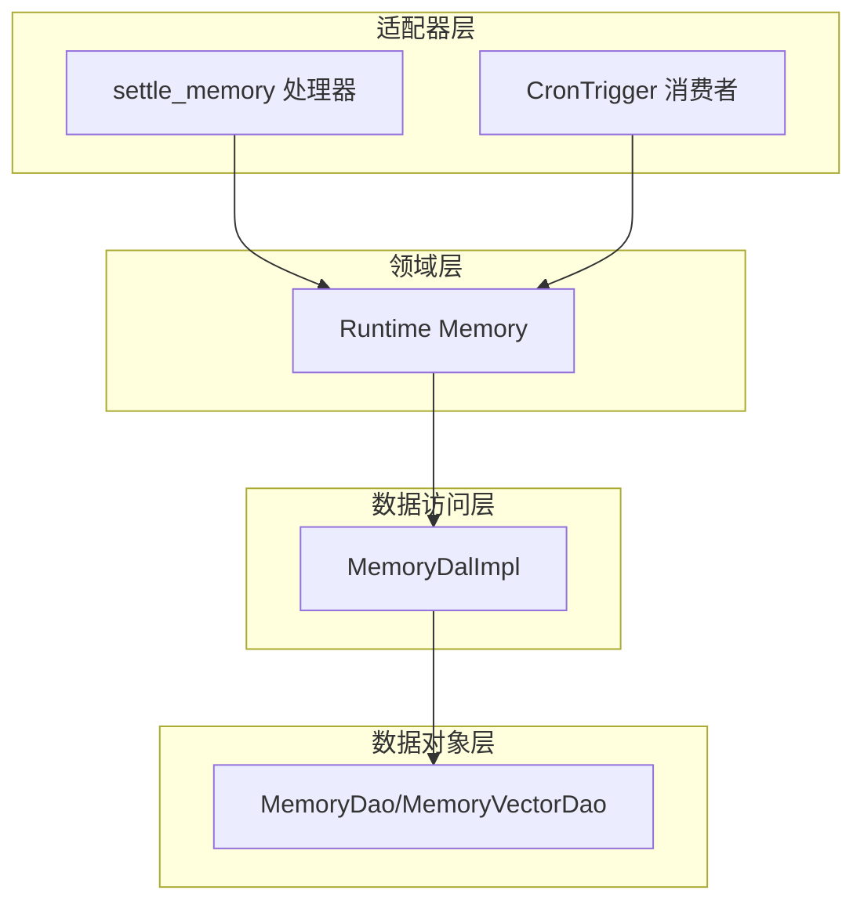
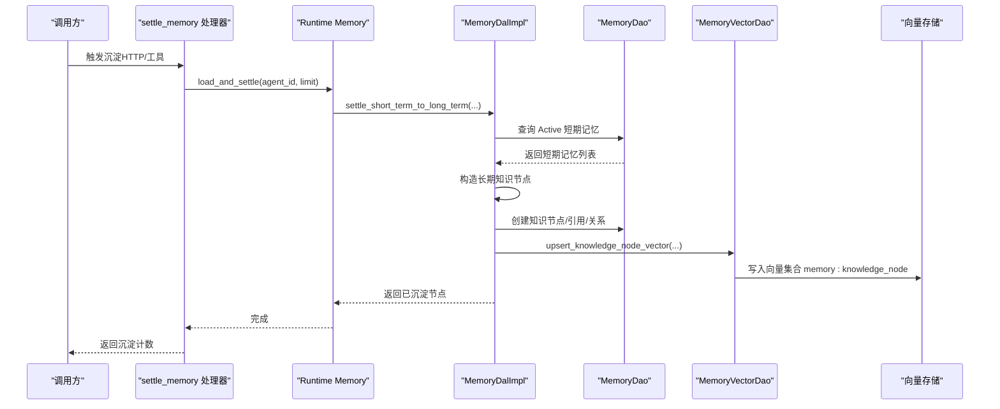
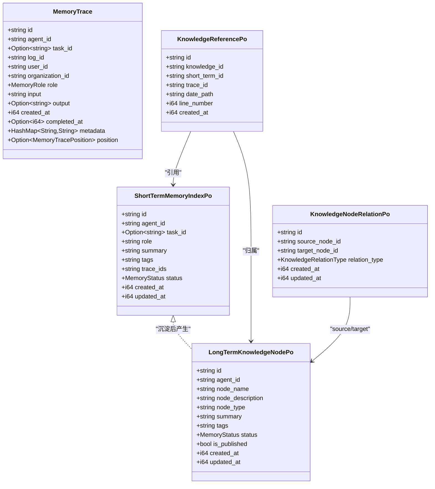
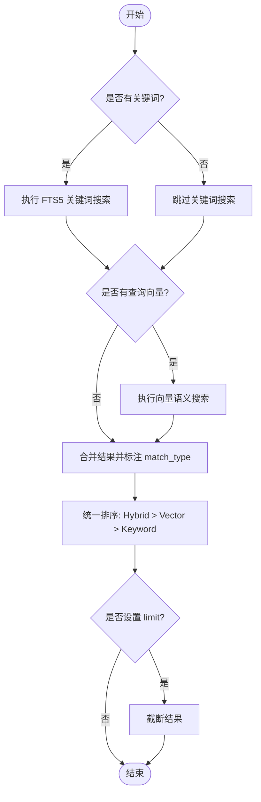
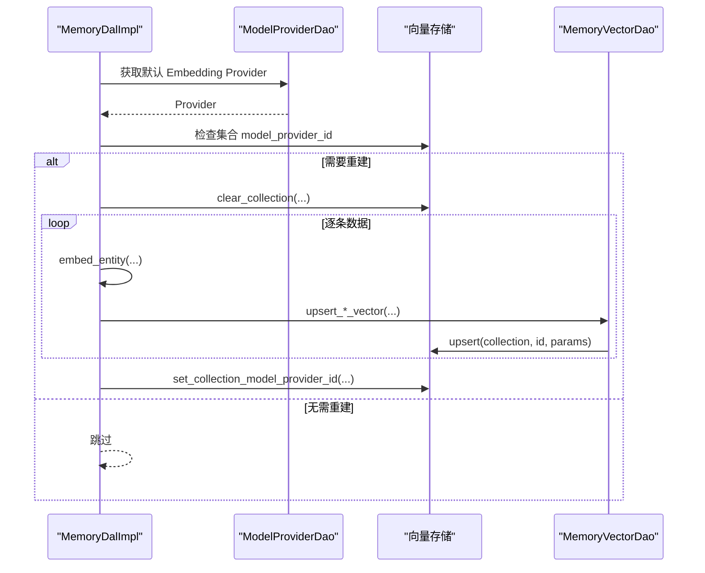
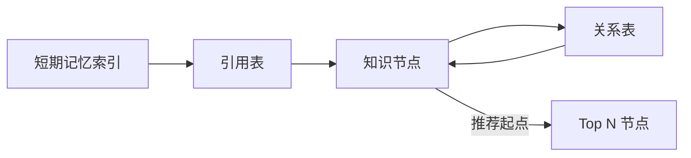
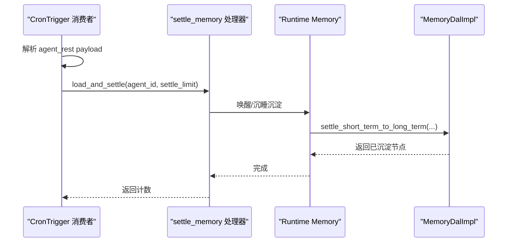
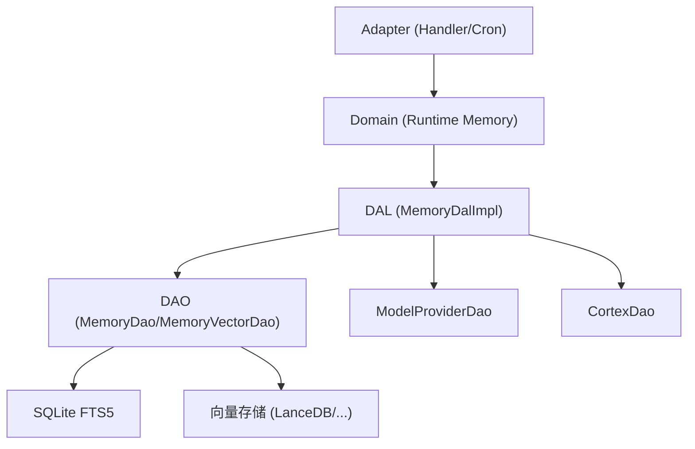

# 四层记忆系统

<cite>
**本文引用的文件**
- [memory.rs](file://src/models/memory.rs)
- [memory.rs（枚举）](file://common/src/enums/memory.rs)
- [memory.rs（DAL）](file://src/service/dal/memory.rs)
- [memory.rs（Domain Runtime）](file://src/service/domain/runtime/memory.rs)
- [vector.rs（DAO）](file://src/service/dao/memory/vector.rs)
- [vector.rs（模型）](file://src/models/vector.rs)
- [settle_memory.rs](file://src/handlers/hr/agent/settle_memory.rs)
- [scheduler.rs](file://src/consumer/scheduler.rs)
- [system_cron_triggers_test.rs](file://tests/integration/system_cron_triggers_test.rs)
- [memory_test.rs](file://tests/integration/memory_test.rs)
- [mod.rs（Memory DAO）](file://src/service/dao/memory/mod.rs)
</cite>

## 目录
1. [简介](#简介)
2. [项目结构](#项目结构)
3. [核心组件](#核心组件)
4. [架构总览](#架构总览)
5. [详细组件分析](#详细组件分析)
6. [依赖关系分析](#依赖关系分析)
7. [性能考量](#性能考量)
8. [故障排查指南](#故障排查指南)
9. [结论](#结论)
10. [附录](#附录)

## 简介
本技术文档围绕“四层记忆系统”展开，覆盖 Core Memory（核心记忆）、Working Memory（工作记忆）、Short-term Memory（短期记忆）、Long-term Memory（长期记忆）的设计与实现。重点说明：
- 存储结构与检索算法：FTS5 关键词搜索、向量语义搜索、混合搜索排序策略
- 向量嵌入生成过程：实体向量化、索引写入、重建机制
- 知识图谱构建与维护：节点、关系、引用、推荐起点
- 定时沉淀机制：agent_rest 每 4 小时将短期记忆整理为长期知识
- 生命周期管理：状态流转、清理策略、降级与容错
- 记忆搜索 API 使用示例：关键词、向量、混合搜索

## 项目结构
记忆系统遵循严格四层单向调用：Adapter → Domain → DAL → DAO。数据与能力分层清晰：
- Adapter：HTTP Handler / AOP Producer（如 settle_memory 处理器、CronTrigger 消费者）
- Domain：业务编排（Runtime Memory 对外暴露统一接口）
- DAL：跨 DAO 流程编排（混合搜索、图谱遍历、沉淀、重建）
- DAO：持久化与向量索引 CRUD（SQLite FTS5 + 向量存储抽象）

图表来源
- [settle_memory.rs:125-154](file://src/handlers/hr/agent/settle_memory.rs#L125-L154)
- [scheduler.rs:99-131](file://src/consumer/scheduler.rs#L99-L131)
- [memory.rs（Domain Runtime）:11-119](file://src/service/domain/runtime/memory.rs#L11-L119)
- [memory.rs（DAL）:70-177](file://src/service/dal/memory.rs#L70-L177)
- [vector.rs（DAO）:36-147](file://src/service/dao/memory/vector.rs#L36-L147)

章节来源
- [memory.rs（DAL）:70-177](file://src/service/dal/memory.rs#L70-L177)
- [memory.rs（Domain Runtime）:11-119](file://src/service/domain/runtime/memory.rs#L11-L119)

## 核心组件
- 模型与枚举
  - MemoryTrace：原始思考闭环记录（JSONL 物理位置可追溯）
  - ShortTermMemoryIndexPo：短期记忆索引（SQLite），支持向量化
  - LongTermKnowledgeNodePo：长期知识节点（SQLite），支持向量化
  - KnowledgeReferencePo：知识节点对原始短期记忆的引用
  - KnowledgeNodeRelationPo：知识节点之间的关系
  - MemoryStatus/MemoryRole/KnowledgeRelationType/MemoryType：状态、角色、关系类型、过滤类型
- 向量与匹配
  - Vectorizable：实体向量化接口（定义 vectorize_text、vector_collection）
  - SearchMatchInfo：混合搜索结果元信息（match_type、fts_rank、vector_distance 等）
  - VectorIndexParams/VectorRow/VectorSearchHit：向量索引与搜索结果通用结构
- DAL 能力
  - search：混合搜索（Keyword/Vector/Hybrid），统一排序
  - query：通用关系型查询（按 agent/status/type 过滤）
  - recommend_seed_nodes：按度数推荐知识图谱起点
  - create/update/delete：记忆全生命周期操作（含向量索引维护）
  - traverse_knowledge_graph：BFS/DFS 遍历知识图谱
  - settle_short_term_to_long_term：短期→长期沉淀
  - rebuild_vectors：向量索引重建（按 provider 维度）

章节来源
- [memory.rs（模型）:15-424](file://src/models/memory.rs#L15-L424)
- [memory.rs（枚举）:12-212](file://common/src/enums/memory.rs#L12-L212)
- [vector.rs（模型）:9-192](file://src/models/vector.rs#L9-L192)
- [memory.rs（DAL）:70-177](file://src/service/dal/memory.rs#L70-L177)

## 架构总览
记忆系统以“混合搜索 + 知识图谱 + 定时沉淀”为核心，形成从原始思考到结构化知识的闭环。

图表来源
- [settle_memory.rs:125-154](file://src/handlers/hr/agent/settle_memory.rs#L125-L154)
- [memory.rs（DAL）:578-652](file://src/service/dal/memory.rs#L578-L652)
- [vector.rs（DAO）:53-65](file://src/service/dao/memory/vector.rs#L53-L65)

章节来源
- [memory.rs（DAL）:578-652](file://src/service/dal/memory.rs#L578-L652)
- [vector.rs（DAO）:53-65](file://src/service/dao/memory/vector.rs#L53-L65)

## 详细组件分析

### 存储结构与数据模型
- 核心记忆（Core Memory）
  - 由 MemoryTrace 表示，作为原始思考闭环的完整记录，包含输入、输出、时间戳、角色、元数据，以及 JSONL 物理位置（date_path + line_number）。
  - 特点：不可变、可溯源、不参与直接检索，但可作为引用来源。
- 工作记忆（Working Memory）
  - 在运行时通过 get_recent_context 获取 Agent 的近期短期记忆，用于上下文注入。
- 短期记忆（Short-term Memory）
  - ShortTermMemoryIndexPo：聚合多条相关细节，提供 summary/tags/trace_ids；支持向量化（summary+tags）。
  - 状态：Active/Forgotten/Settled，默认仅 Active 参与检索。
- 长期记忆（Long-term Memory）
  - LongTermKnowledgeNodePo：经过归纳总结的知识节点，包含 node_description/summary/tags；支持向量化（node_description+summary+tags）。
  - 关系：KnowledgeNodeRelationPo 描述节点间关系（related/contains/depends/prerequisite 等）。
  - 引用：KnowledgeReferencePo 将知识节点与原始短期记忆关联，支持认知回溯。

图表来源
- [memory.rs（模型）:15-424](file://src/models/memory.rs#L15-L424)

章节来源
- [memory.rs（模型）:15-424](file://src/models/memory.rs#L15-L424)

### 检索算法与混合搜索
- 关键词搜索（FTS5）
  - 使用 SQLite FTS5 MATCH + BM25 排序，返回 fts_rank（越小越相关）。
  - 支持中文 trigram 分词器，特殊字符转义避免语法错误。
- 向量语义搜索
  - 基于 Vectorizable 接口生成文本，调用 Cortex 生成 embedding，写入向量集合（memory:short_term / memory:knowledge_node）。
  - 支持距离阈值过滤（默认 0.8），结果携带 vector_distance。
- 混合搜索与排序
  - 同时命中关键词与向量时标记 Hybrid，优先排序；其次 Vector；最后 Keyword。
  - 组内排序：Hybrid/Vector 按 vector_distance 升序；Keyword 按 fts_rank 升序。

图表来源
- [memory.rs（DAL）:190-276](file://src/service/dal/memory.rs#L190-L276)
- [mod.rs（Memory DAO）:45-58](file://src/service/dao/memory/mod.rs#L45-L58)

章节来源
- [memory.rs（DAL）:190-276](file://src/service/dal/memory.rs#L190-L276)
- [mod.rs（Memory DAO）:45-58](file://src/service/dao/memory/mod.rs#L45-L58)

### 向量嵌入生成与索引维护
- 向量化文本
  - 短期记忆：summary + tags（展平为空格分隔文本）
  - 知识节点：node_description + summary + tags
- 索引写入
  - 通过 MemoryVectorDao 调用向量存储 upsert，集合名分别为 memory:short_term 与 memory:knowledge_node
- 重建机制
  - 当 Embedding Provider 变更或集合 model_provider_id 不一致时，清空对应集合并逐条重新生成 embedding
  - 单条失败不影响整体，记录 warn 日志

图表来源
- [memory.rs（DAL）:654-799](file://src/service/dal/memory.rs#L654-L799)
- [vector.rs（DAO）:38-65](file://src/service/dao/memory/vector.rs#L38-L65)

章节来源
- [memory.rs（DAL）:654-799](file://src/service/dal/memory.rs#L654-L799)
- [vector.rs（DAO）:38-65](file://src/service/dao/memory/vector.rs#L38-L65)

### 知识图谱构建与维护
- 节点与关系
  - 知识节点：LongTermKnowledgeNodePo，支持 published 标签与 is_published 冗余字段加速查询
  - 关系：KnowledgeNodeRelationPo，预定义多种关系类型（related/contains/depends/prerequisite 等）
- 引用与溯源
  - KnowledgeReferencePo 将知识节点与原始短期记忆关联，保留情景痕迹
- 推荐起点
  - 按入边+出边度数统计，Top N 推荐核心节点，便于快速定位

图表来源
- [memory.rs（模型）:212-320](file://src/models/memory.rs#L212-L320)
- [memory.rs（DAL）:314-375](file://src/service/dal/memory.rs#L314-L375)

章节来源
- [memory.rs（模型）:212-320](file://src/models/memory.rs#L212-L320)
- [memory.rs（DAL）:314-375](file://src/service/dal/memory.rs#L314-L375)

### 定时沉淀机制（agent_rest 每 4 小时）
- 触发方式
  - CronTrigger 消费者监听 agent_rest action，解析 payload（agent_id、settle_limit）
  - 系统级默认 trigger 每 4 小时执行一次，确保幂等与稳定
- 处理流程
  - 预检查 Agent 状态（空闲才进入睡眠）
  - 查询未沉淀短期记忆（Active），生成编号摘要
  - 加载 Agent（含 tools/skills），唤醒 Brain，调用 sleep_and_settle 自主沉淀
  - 沉淀完成后更新短期记忆状态为 Settled

图表来源
- [scheduler.rs:99-131](file://src/consumer/scheduler.rs#L99-L131)
- [settle_memory.rs:74-123](file://src/handlers/hr/agent/settle_memory.rs#L74-L123)
- [memory.rs（DAL）:578-652](file://src/service/dal/memory.rs#L578-L652)

章节来源
- [scheduler.rs:99-131](file://src/consumer/scheduler.rs#L99-L131)
- [settle_memory.rs:74-123](file://src/handlers/hr/agent/settle_memory.rs#L74-L123)
- [memory.rs（DAL）:578-652](file://src/service/dal/memory.rs#L578-L652)

### 记忆搜索 API 使用示例
- 关键词搜索（FTS5）
  - 参数：query=关键词，memory_type=short_term/knowledge_node，max_results，agent_id
  - 行为：无 embedding provider 时仍可通过 FTS5 检索
- 向量语义搜索
  - 参数：query_vector（DAL 层填充），top_k，vector_distance_threshold
  - 行为：向量失败降级为纯关键词搜索
- 混合搜索
  - 参数：同时提供 keyword 与 query_vector
  - 行为：Hybrid 优先，Vector 次之，Keyword 最后；组内按距离/相关性排序

章节来源
- [memory_test.rs:332-388](file://tests/integration/memory_test.rs#L332-L388)
- [memory_test.rs:624-712](file://tests/integration/memory_test.rs#L624-L712)
- [mod.rs（Memory DAO）:45-58](file://src/service/dao/memory/mod.rs#L45-L58)

### 生命周期管理与清理策略
- 状态流转
  - Active：正常可检索
  - Settled：短期记忆已沉淀为长期知识，默认不参与检索
  - Forgotten：已遗忘（归档，默认过滤不查询，保留数据可恢复）
- 清理策略
  - 删除短期记忆：软删除 + 删除向量索引（忽略失败）
  - 删除知识节点：级联删除关系与引用 + 删除向量索引
  - 被 references 引用的短期记忆在自动清理时应保留（TODO 中提及）
- 降级与容错
  - 向量化失败仅 warn 降级，不影响主流程
  - 向量搜索失败降级为关键词搜索

章节来源
- [memory.rs（DAL）:477-516](file://src/service/dal/memory.rs#L477-L516)
- [memory.rs（DAL）:654-799](file://src/service/dal/memory.rs#L654-L799)

## 依赖关系分析
- 模块耦合
  - DAL 依赖 DAO（MemoryDao/MemoryVectorDao）、ModelProviderDao、CortexDao
  - Domain 仅依赖 DAL，保持业务编排与数据访问解耦
  - Adapter 仅依赖 Domain，保证 HTTP/工具入口简洁
- 外部依赖
  - SQLite FTS5 用于关键词搜索
  - 向量存储（LanceDB/HNSW/InMemory/SqliteVss）通过 ctx.vector_store() 抽象
  - Cortex 用于 embedding 生成

图表来源
- [memory.rs（DAL）:70-177](file://src/service/dal/memory.rs#L70-L177)
- [vector.rs（DAO）:36-147](file://src/service/dao/memory/vector.rs#L36-L147)

章节来源
- [memory.rs（DAL）:70-177](file://src/service/dal/memory.rs#L70-L177)
- [vector.rs（DAO）:36-147](file://src/service/dao/memory/vector.rs#L36-L147)

## 性能考量
- 搜索性能
  - FTS5 BM25 排序高效，适合关键词精确匹配
  - 向量搜索支持距离阈值过滤，减少无效结果
  - 混合搜索统一排序，提升用户体验
- 索引维护
  - 重建机制按 provider 维度判断，避免不必要的全量重建
  - 单条失败不影响整体，降低批量任务风险
- 降级策略
  - 向量搜索失败自动降级为关键词搜索，保障可用性
  - 向量索引写入失败仅 warn，不阻塞主流程

## 故障排查指南
- 常见问题
  - 向量搜索无结果：检查 Embedding Provider 是否可用、向量集合是否存在、model_provider_id 是否一致
  - 关键词搜索异常：检查 FTS5 语法、特殊字符转义、分词器配置
  - 沉淀失败：检查 Agent 状态是否为空闲、短期记忆是否存在、CronTrigger 是否启用
- 日志定位
  - 关注 vector_index、rebuild_vectors、settle_memory 等日志关键字
  - 查看降级日志（warn/debug）确认失败路径

章节来源
- [memory.rs（DAL）:400-461](file://src/service/dal/memory.rs#L400-L461)
- [memory.rs（DAL）:654-799](file://src/service/dal/memory.rs#L654-L799)

## 结论
四层记忆系统通过“原始思考→短期索引→长期知识→图谱关系”的分层设计，实现了高可用、可扩展的记忆管理能力。混合搜索兼顾精确与语义，定时沉淀保障知识持续演进，向量重建与降级策略确保系统稳定性。未来可进一步完善被引用短期记忆的保留机制与自动清理策略。

## 附录
- 关键枚举与类型
  - MemoryStatus：Forgotten/Active/Settled
  - MemoryRole：System/User/Assistant/Summary
  - KnowledgeRelationType：Related/Contains/Depends/Prerequisite 等
  - MemoryType：Trace/ShortTerm/KnowledgeNode/Relation/All
- 测试验证
  - FTS5 关键词搜索、混合排序、向量重建、CronTrigger 初始化等集成测试覆盖核心场景

章节来源
- [memory.rs（枚举）:12-212](file://common/src/enums/memory.rs#L12-L212)
- [system_cron_triggers_test.rs:70-100](file://tests/integration/system_cron_triggers_test.rs#L70-L100)
- [memory_test.rs:332-712](file://tests/integration/memory_test.rs#L332-L712)