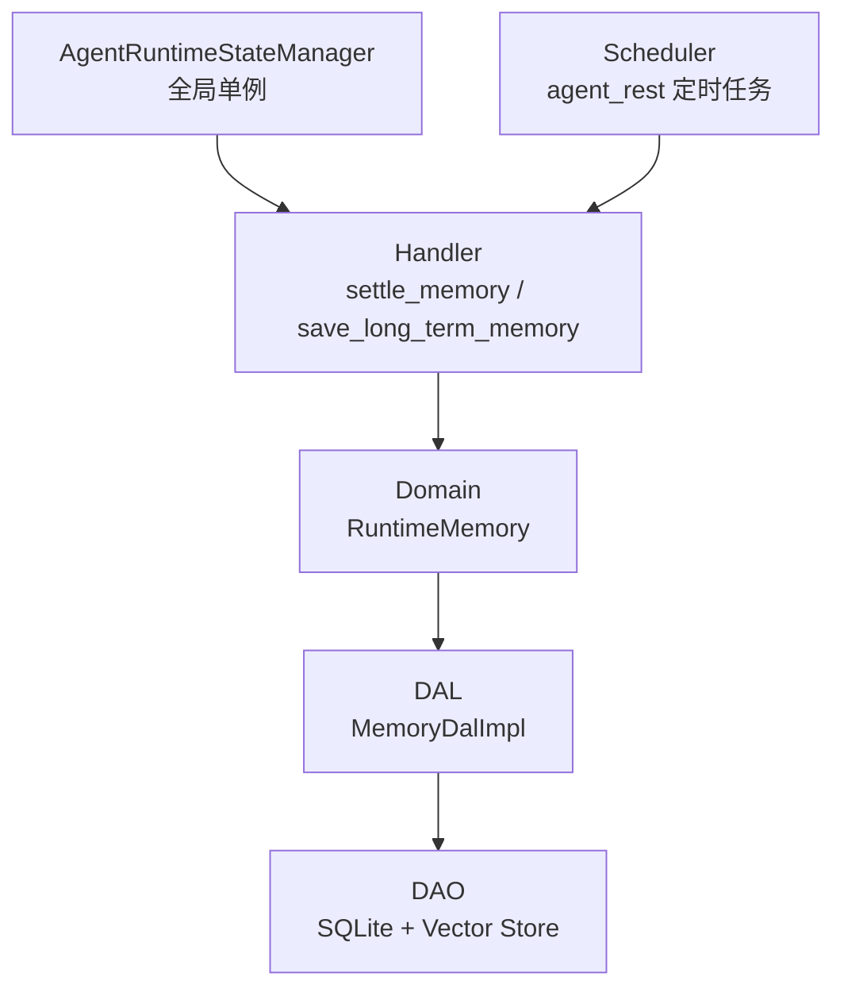
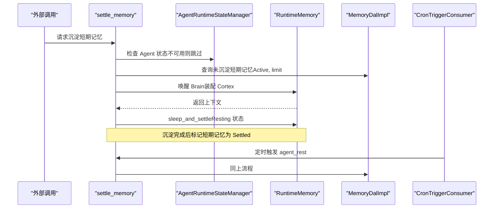
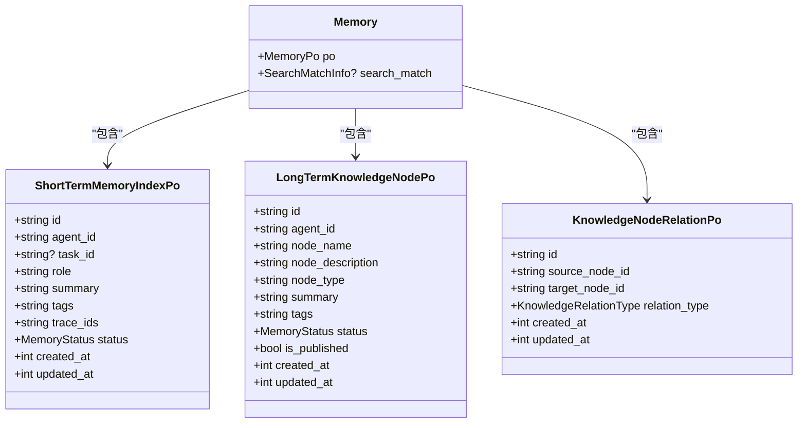
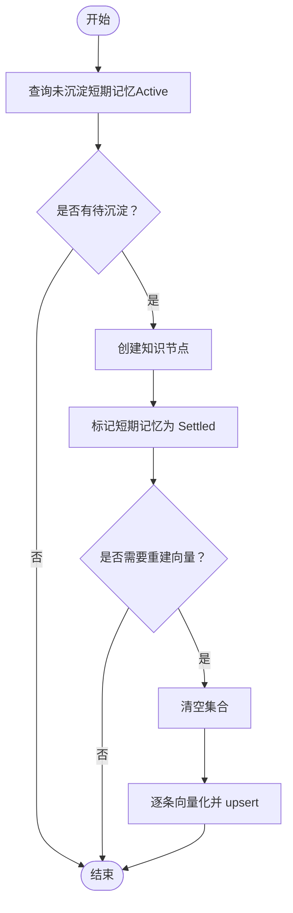
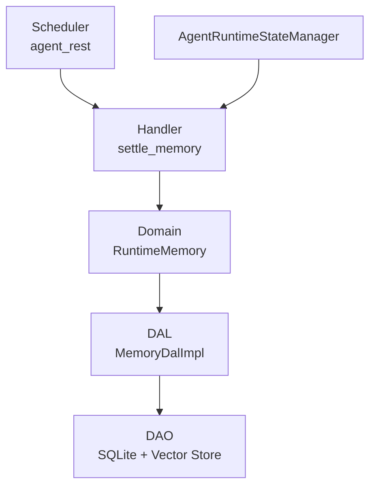

# 工作记忆 (Working Memory)

<cite>
**本文引用的文件**
- [src/models/memory.rs](file://src/models/memory.rs)
- [common/src/enums/memory.rs](file://common/src/enums/memory.rs)
- [src/service/dal/memory.rs](file://src/service/dal/memory.rs)
- [src/service/domain/runtime/memory.rs](file://src/service/domain/runtime/memory.rs)
- [src/handlers/hr/agent/settle_memory.rs](file://src/handlers/hr/agent/settle_memory.rs)
- [src/pkg/agent_runtime_state.rs](file://src/pkg/agent_runtime_state.rs)
- [src/consumer/scheduler.rs](file://src/consumer/scheduler.rs)
- [tests/integration/memory_test.rs](file://tests/integration/memory_test.rs)
</cite>

## 目录
1. [简介](#简介)
2. [项目结构](#项目结构)
3. [核心组件](#核心组件)
4. [架构总览](#架构总览)
5. [详细组件分析](#详细组件分析)
6. [依赖关系分析](#依赖关系分析)
7. [性能考量](#性能考量)
8. [故障排查指南](#故障排查指南)
9. [结论](#结论)
10. [附录：API 使用示例](#附录api-使用示例)

## 简介
本文件聚焦“工作记忆层”的技术设计，围绕 Agent 当前会话上下文与临时状态的管理展开。工作记忆在本项目中体现为短期记忆索引（ShortTerm）与长期知识节点（KnowledgeNode）的协同体系：短期记忆用于承载对话历史、任务中间结果等短期数据；长期知识通过沉淀机制将短期记忆归纳为结构化知识，支持检索与图谱遍历。文档将说明内存管理、生命周期控制、自动清理策略，以及工作记忆在 Agent 思考循环中的角色（上下文构建、状态维护与恢复），并给出 API 使用示例与边界划分建议。

## 项目结构
工作记忆相关代码按四层单向调用组织：Adapter（Handler/工具注册）→ Domain → DAL → DAO。关键文件与职责如下：
- 模型与枚举：定义短期/长期记忆 PO、关系、类型与状态
- DAL：实现查询、搜索、更新、删除、向量重建、沉淀等核心逻辑
- Domain：对外暴露统一接口（如 get_recent_context、search、query、create/update/delete、traverse_graph）
- Handler：暴露 HTTP/神经工具入口（如 settle_memory、save_long_term_memory）
- 运行时状态：Agent 运行态（Idle/Busy/Resting）由全局单例管理，保障并发安全
- 调度器：定时触发 agent_rest 动作，周期性执行沉淀



图表来源
- [src/handlers/hr/agent/settle_memory.rs:1-155](file://src/handlers/hr/agent/settle_memory.rs#L1-L155)
- [src/service/domain/runtime/memory.rs:1-120](file://src/service/domain/runtime/memory.rs#L1-L120)
- [src/service/dal/memory.rs:113-177](file://src/service/dal/memory.rs#L113-L177)
- [src/pkg/agent_runtime_state.rs:1-174](file://src/pkg/agent_runtime_state.rs#L1-L174)
- [src/consumer/scheduler.rs:93-131](file://src/consumer/scheduler.rs#L93-L131)

章节来源
- [src/models/memory.rs:1-424](file://src/models/memory.rs#L1-L424)
- [common/src/enums/memory.rs:1-212](file://common/src/enums/memory.rs#L1-L212)
- [src/service/dal/memory.rs:113-177](file://src/service/dal/memory.rs#L113-L177)
- [src/service/domain/runtime/memory.rs:1-120](file://src/service/domain/runtime/memory.rs#L1-L120)
- [src/handlers/hr/agent/settle_memory.rs:1-155](file://src/handlers/hr/agent/settle_memory.rs#L1-L155)
- [src/pkg/agent_runtime_state.rs:1-174](file://src/pkg/agent_runtime_state.rs#L1-L174)
- [src/consumer/scheduler.rs:93-131](file://src/consumer/scheduler.rs#L93-L131)

## 核心组件
- 记忆模型与类型
  - 短期记忆索引（ShortTermMemoryIndexPo）：SQLite 持久化，包含摘要、标签、trace_ids、状态等
  - 长期知识节点（LongTermKnowledgeNodePo）：SQLite 持久化，包含描述、类型、摘要、标签、是否发布等
  - 知识节点关系（KnowledgeNodeRelationPo）：存储节点间有向关系
  - 记忆业务实体（Memory）：封装 PO 与搜索匹配信息
  - 记忆类型与状态：MemoryType（Trace/ShortTerm/KnowledgeNode/Relation/All）、MemoryStatus（Forgotten/Active/Settled）
- 运行时状态管理器
  - AgentRuntimeStateManager：全局单例，管理每个 Agent 的 Idle/Busy/Resting 状态，提供原子 try_set_busy 避免并发唤醒冲突
- DAL 记忆服务
  - 提供 query/search/create/update/delete/traverse_knowledge_graph/rebuild_vectors/settle_short_term_to_long_term 等方法
- Domain 运行时记忆接口
  - RuntimeMemory：对外暴露 get_recent_context、write_thinking_trace、search/query/create/update/delete/traverse_graph 等
- Handler 与调度器
  - settle_memory：加载未沉淀短期记忆，进入 Resting 状态完成沉淀
  - scheduler.agent_rest：定时触发 agent_rest，周期性沉淀短期记忆

章节来源
- [src/models/memory.rs:158-424](file://src/models/memory.rs#L158-L424)
- [common/src/enums/memory.rs:12-212](file://common/src/enums/memory.rs#L12-L212)
- [src/pkg/agent_runtime_state.rs:31-174](file://src/pkg/agent_runtime_state.rs#L31-L174)
- [src/service/dal/memory.rs:113-177](file://src/service/dal/memory.rs#L113-L177)
- [src/service/domain/runtime/memory.rs:11-120](file://src/service/domain/runtime/memory.rs#L11-L120)
- [src/handlers/hr/agent/settle_memory.rs:1-155](file://src/handlers/hr/agent/settle_memory.rs#L1-L155)
- [src/consumer/scheduler.rs:93-131](file://src/consumer/scheduler.rs#L93-L131)

## 架构总览
工作记忆在 Agent 思考循环中承担“上下文构建、状态维护与恢复”的职责：
- 上下文构建：通过 get_recent_context 获取近期短期记忆，结合任务 ID、标签过滤，组装 Prompt
- 状态维护：Agent 运行态（Idle/Busy/Resting）由 AgentRuntimeStateManager 管理，确保并发安全
- 恢复机制：服务重启后纯内存状态重置，Agent 自动休息；短期记忆持久化于 SQLite，可恢复
- 自动清理：短期记忆经沉淀后标记为 Settled，默认不参与检索；支持 rebuild_vectors 重建向量索引



图表来源
- [src/handlers/hr/agent/settle_memory.rs:68-123](file://src/handlers/hr/agent/settle_memory.rs#L68-L123)
- [src/pkg/agent_runtime_state.rs:73-107](file://src/pkg/agent_runtime_state.rs#L73-L107)
- [src/service/dal/memory.rs:608-641](file://src/service/dal/memory.rs#L608-L641)
- [src/consumer/scheduler.rs:99-131](file://src/consumer/scheduler.rs#L99-L131)

## 详细组件分析

### 短期记忆与长期知识的存储策略
- 短期记忆（ShortTerm）
  - 存储位置：SQLite 表，字段包括 summary、tags、trace_ids、status、时间戳
  - 向量化：实现 Vectorizable trait，集合名为 memory:short_term
  - 状态流转：Active（活跃可检索）→ Settled（已沉淀，默认不检索）
- 长期知识（KnowledgeNode）
  - 存储位置：SQLite 表，字段包括 node_name、node_description、node_type、summary、tags、is_published、时间戳
  - 向量化：实现 Vectorizable trait，集合名为 memory:knowledge_node
  - 发布机制：tags 含 published 时 is_published=true，支持跨 Agent 共享
- 关系与引用
  - KnowledgeNodeRelationPo：记录源节点到目标节点的有向关系
  - KnowledgeReferencePo：记录知识节点对原始短期记忆的引用（含 trace_id、日期路径、行号）



图表来源
- [src/models/memory.rs:158-320](file://src/models/memory.rs#L158-L320)
- [common/src/enums/memory.rs:96-212](file://common/src/enums/memory.rs#L96-L212)

章节来源
- [src/models/memory.rs:158-424](file://src/models/memory.rs#L158-L424)
- [common/src/enums/memory.rs:12-212](file://common/src/enums/memory.rs#L12-L212)

### 工作记忆的内存管理与生命周期控制
- 内存管理
  - 短期记忆：SQLite 持久化，向量索引独立集合；删除时同步清理向量索引（失败降级）
  - 长期知识：SQLite 持久化，向量索引独立集合；删除时级联清理关系、引用、节点、向量
- 生命周期控制
  - Active：正常可检索，参与问答和搜索
  - Settled：已沉淀，默认不参与检索，降低信息过载
  - Forgotten：已遗忘，归档保留，默认过滤不查询
- 自动清理
  - 沉淀流程：查询未沉淀短期记忆（Active）→ 生成编号摘要 → 创建知识节点 → 标记短期记忆为 Settled
  - 向量重建：rebuild_vectors 清空集合后重新向量化，单条失败不影响整体



图表来源
- [src/service/dal/memory.rs:608-641](file://src/service/dal/memory.rs#L608-L641)
- [src/service/dal/memory.rs:684-750](file://src/service/dal/memory.rs#L684-L750)

章节来源
- [src/service/dal/memory.rs:477-504](file://src/service/dal/memory.rs#L477-L504)
- [src/service/dal/memory.rs:608-641](file://src/service/dal/memory.rs#L608-L641)
- [src/service/dal/memory.rs:684-750](file://src/service/dal/memory.rs#L684-L750)

### 工作记忆在 Agent 思考循环中的作用
- 上下文构建
  - get_recent_context：按 agent_id、memory_type=ShortTerm、limit 限制，返回近期短期记忆
  - 支持 task_id、tags 过滤，聚焦特定任务或主题
- 状态维护
  - AgentRuntimeStateManager：管理 Idle/Busy/Resting，try_set_busy 原子设置避免并发唤醒
  - settle_memory：预检查 Agent 状态，不可用时跳过沉淀，避免覆盖 Busy
- 恢复机制
  - 服务重启后纯内存状态重置，Agent 自动休息；短期记忆持久化于 SQLite，可恢复
  - 向量索引重建：rebuild_vectors 支持切换 embedding provider 后重建

```mermaid
sequenceDiagram
participant Loop as "思考循环"
participant Domain as "RuntimeMemory"
participant DAL as "MemoryDalImpl"
participant State as "AgentRuntimeStateManager"
Loop->>Domain : get_recent_context(agent_id, limit)
Domain->>DAL : query(MemoryQuery{agent_id, ShortTerm, limit})
DAL-->>Domain : Vec<Memory>
Domain-->>Loop : 近期短期记忆
Loop->>State : set_busy(message_id)
Note over Loop,State : 忙碌期间禁止沉淀
Loop->>State : set_idle()
```

图表来源
- [src/service/domain/runtime/memory.rs:14-33](file://src/service/domain/runtime/memory.rs#L14-L33)
- [src/pkg/agent_runtime_state.rs:73-107](file://src/pkg/agent_runtime_state.rs#L73-L107)
- [src/handlers/hr/agent/settle_memory.rs:74-85](file://src/handlers/hr/agent/settle_memory.rs#L74-L85)

章节来源
- [src/service/domain/runtime/memory.rs:14-33](file://src/service/domain/runtime/memory.rs#L14-L33)
- [src/pkg/agent_runtime_state.rs:73-107](file://src/pkg/agent_runtime_state.rs#L73-L107)
- [src/handlers/hr/agent/settle_memory.rs:74-85](file://src/handlers/hr/agent/settle_memory.rs#L74-L85)

### 工作记忆的 API 使用示例
- 状态设置
  - 设置空闲：AgentRuntimeStateManager::set_idle(agent_id)
  - 设置忙碌：AgentRuntimeStateManager::set_busy(agent_id, message_id)
  - 原子尝试忙碌：AgentRuntimeStateManager::try_set_busy(agent_id, message_id) -> bool
- 查询与搜索
  - 查询近期上下文：RuntimeMemory::get_recent_context(ctx, agent_id, limit)
  - 通用查询：RuntimeMemory::query(ctx, MemoryQuery)
  - 搜索：RuntimeMemory::search(ctx, MemorySearch)
- 清理与沉淀
  - 沉淀短期记忆：Handler settle_memory（内部调用 load_and_settle）
  - 删除记忆：RuntimeMemory::delete(ctx, Memory)
  - 重建向量：DAL::rebuild_vectors(ctx)

章节来源
- [src/pkg/agent_runtime_state.rs:51-107](file://src/pkg/agent_runtime_state.rs#L51-L107)
- [src/service/domain/runtime/memory.rs:14-120](file://src/service/domain/runtime/memory.rs#L14-L120)
- [src/handlers/hr/agent/settle_memory.rs:68-123](file://src/handlers/hr/agent/settle_memory.rs#L68-L123)
- [src/service/dal/memory.rs:684-750](file://src/service/dal/memory.rs#L684-L750)

### 工作记忆与短期记忆的边界划分与数据迁移策略
- 边界划分
  - 短期记忆：会话内临时数据，承载对话历史、任务中间结果，状态为 Active/Settled
  - 长期知识：沉淀后的结构化知识，支持检索与图谱遍历，状态为 Active/Forgotten
- 数据迁移策略
  - 沉淀流程：短期记忆 → 知识节点 + 引用关系 → 标记短期记忆为 Settled
  - 向量索引：短期记忆与知识节点分别维护向量集合，支持独立重建
  - 发布机制：知识节点 tags 含 published 时 is_published=true，支持跨 Agent 共享

章节来源
- [src/models/memory.rs:158-320](file://src/models/memory.rs#L158-L320)
- [src/service/dal/memory.rs:608-641](file://src/service/dal/memory.rs#L608-L641)
- [common/src/enums/memory.rs:12-212](file://common/src/enums/memory.rs#L12-L212)

## 依赖关系分析
工作记忆模块依赖关系清晰，遵循四层单向调用：
- Handler 依赖 Domain 暴露的接口
- Domain 依赖 DAL 实现具体逻辑
- DAL 依赖 DAO 进行数据访问与向量操作
- AgentRuntimeStateManager 作为全局单例被 Handler 和调度器使用



图表来源
- [src/handlers/hr/agent/settle_memory.rs:1-155](file://src/handlers/hr/agent/settle_memory.rs#L1-L155)
- [src/service/domain/runtime/memory.rs:1-120](file://src/service/domain/runtime/memory.rs#L1-L120)
- [src/service/dal/memory.rs:113-177](file://src/service/dal/memory.rs#L113-L177)
- [src/consumer/scheduler.rs:93-131](file://src/consumer/scheduler.rs#L93-L131)
- [src/pkg/agent_runtime_state.rs:1-174](file://src/pkg/agent_runtime_state.rs#L1-L174)

章节来源
- [src/handlers/hr/agent/settle_memory.rs:1-155](file://src/handlers/hr/agent/settle_memory.rs#L1-L155)
- [src/service/domain/runtime/memory.rs:1-120](file://src/service/domain/runtime/memory.rs#L1-L120)
- [src/service/dal/memory.rs:113-177](file://src/service/dal/memory.rs#L113-L177)
- [src/consumer/scheduler.rs:93-131](file://src/consumer/scheduler.rs#L93-L131)
- [src/pkg/agent_runtime_state.rs:1-174](file://src/pkg/agent_runtime_state.rs#L1-L174)

## 性能考量
- 向量索引重建：rebuild_vectors 支持增量重建，单条失败不影响整体，适合切换 embedding provider 场景
- 查询优化：MemoryQuery 支持 agent_id、task_id、tags、limit 等过滤，减少不必要的数据传输
- 并发安全：AgentRuntimeStateManager 使用 DashMap 实现线程安全的状态管理，try_set_busy 避免并发唤醒冲突
- 降级处理：向量索引删除/重建失败时记录警告日志，不影响主流程

[本节提供一般性指导，无需特定文件分析]

## 故障排查指南
- 沉淀失败
  - 检查 Agent 状态：若处于 Busy/Resting，load_and_settle 会跳过沉淀
  - 查看日志：向量索引删除/重建失败会记录 warn 日志
- 查询无结果
  - 确认 MemoryQuery 参数：agent_id、memory_type、status、limit 是否正确
  - 检查短期记忆状态：Active 可检索，Settled/Forgotten 默认不检索
- 向量索引异常
  - 使用 rebuild_vectors 重建向量索引
  - 检查 embedding provider 配置与连接

章节来源
- [src/handlers/hr/agent/settle_memory.rs:74-85](file://src/handlers/hr/agent/settle_memory.rs#L74-L85)
- [src/service/dal/memory.rs:477-504](file://src/service/dal/memory.rs#L477-L504)
- [src/service/dal/memory.rs:684-750](file://src/service/dal/memory.rs#L684-L750)

## 结论
工作记忆层通过短期记忆与长期知识的协同，实现了 Agent 会话上下文的有效管理与知识沉淀。其设计遵循四层单向调用，具备清晰的边界划分、完善的生命周期控制与自动清理机制。通过 AgentRuntimeStateManager 保证并发安全，通过 DAL 提供统一的 CRUD 与向量操作接口，满足复杂场景下的上下文构建与恢复需求。未来可进一步优化查询性能与向量索引重建效率。

[本节总结内容，无需特定文件分析]

## 附录：API 使用示例
- 状态设置
  - 设置空闲：调用 AgentRuntimeStateManager::set_idle(agent_id)
  - 设置忙碌：调用 AgentRuntimeStateManager::set_busy(agent_id, message_id)
  - 原子尝试忙碌：调用 AgentRuntimeStateManager::try_set_busy(agent_id, message_id)
- 查询与搜索
  - 查询近期上下文：调用 RuntimeMemory::get_recent_context(ctx, agent_id, limit)
  - 通用查询：调用 RuntimeMemory::query(ctx, MemoryQuery)
  - 搜索：调用 RuntimeMemory::search(ctx, MemorySearch)
- 清理与沉淀
  - 沉淀短期记忆：调用 Handler settle_memory（内部调用 load_and_settle）
  - 删除记忆：调用 RuntimeMemory::delete(ctx, Memory)
  - 重建向量：调用 DAL::rebuild_vectors(ctx)

章节来源
- [src/pkg/agent_runtime_state.rs:51-107](file://src/pkg/agent_runtime_state.rs#L51-L107)
- [src/service/domain/runtime/memory.rs:14-120](file://src/service/domain/runtime/memory.rs#L14-L120)
- [src/handlers/hr/agent/settle_memory.rs:68-123](file://src/handlers/hr/agent/settle_memory.rs#L68-L123)
- [src/service/dal/memory.rs:684-750](file://src/service/dal/memory.rs#L684-L750)