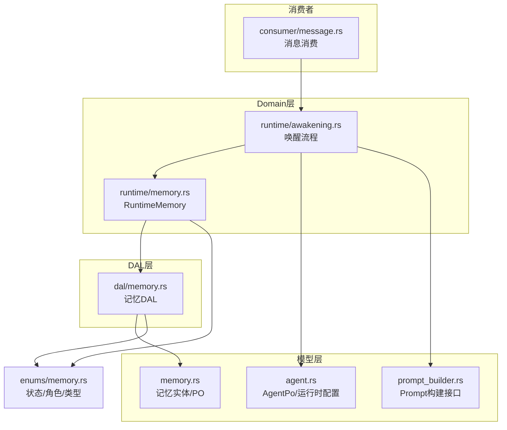
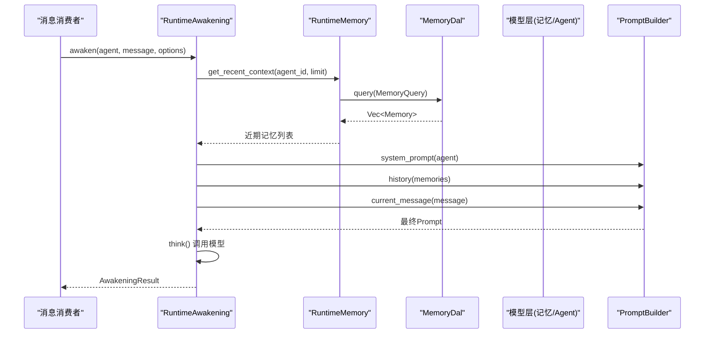
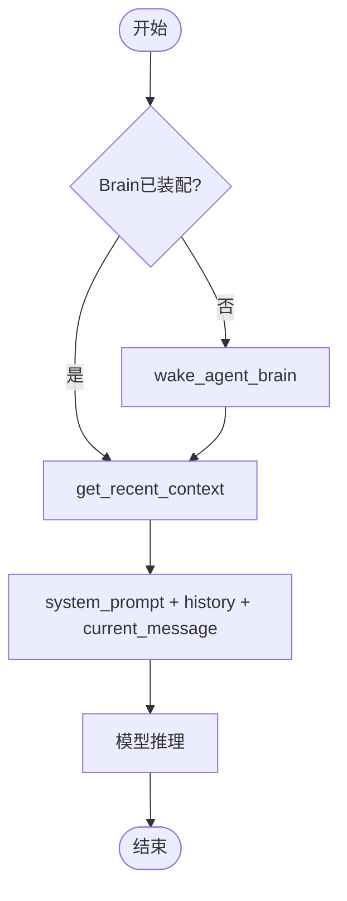
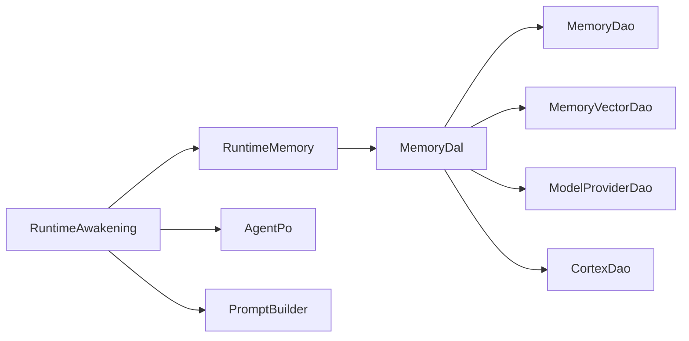

# 核心记忆 (Core Memory)

<cite>
**本文引用的文件**
- [src/models/memory.rs](file://src/models/memory.rs)
- [src/service/dal/memory.rs](file://src/service/dal/memory.rs)
- [src/service/domain/runtime/memory.rs](file://src/service/domain/runtime/memory.rs)
- [common/src/enums/memory.rs](file://common/src/enums/memory.rs)
- [src/models/agent.rs](file://src/models/agent.rs)
- [src/models/prompt_builder.rs](file://src/models/prompt_builder.rs)
- [src/service/domain/runtime/awakening.rs](file://src/service/domain/runtime/awakening.rs)
- [src/consumer/message.rs](file://src/consumer/message.rs)
- [src/service/dal/agent.rs](file://src/service/dal/agent.rs)
</cite>

## 目录
1. [简介](#简介)
2. [项目结构](#项目结构)
3. [核心组件](#核心组件)
4. [架构总览](#架构总览)
5. [详细组件分析](#详细组件分析)
6. [依赖关系分析](#依赖关系分析)
7. [性能考量](#性能考量)
8. [故障排查指南](#故障排查指南)
9. [结论](#结论)
10. [附录：配置与管理 API](#附录配置与管理-api)

## 简介
本技术文档聚焦“核心记忆”在系统中的角色与实现。核心记忆用于持久化 Agent 的基础配置与系统级信息，包括 Agent 基本信息、系统提示词、全局配置等，并在 Agent 唤醒过程中按优先级加载到 Prompt 中参与推理。本文说明核心记忆的读写操作、更新策略、版本管理（通过状态与时间戳）、唤醒加载流程与优先级处理，以及与其他记忆层的交互和数据流转。

## 项目结构
围绕核心记忆的相关代码分布在以下层次：
- 模型层（models）：定义记忆实体、短期/长期索引、追踪条目、Agent 运行时配置与系统提示词生成。
- DAL 层（service/dal）：编排跨 DAO 的记忆搜索、创建、更新、删除、向量重建、知识图谱遍历与沉淀。
- Domain 层（service/domain/runtime）：对外暴露 RuntimeMemory 能力，封装最近上下文获取、思考 Trace 写入、检索与图遍历等。
- 枚举与常量（common/enums）：记忆状态、角色、类型等统一枚举。
- 消费者与唤醒（consumer/message, domain/runtime/awakening）：Agent 消息消费与唤醒流程，负责装配 Brain、读取近期记忆并拼装 Prompt。

图表来源
- [src/models/memory.rs:1-424](file://src/models/memory.rs#L1-L424)
- [src/service/dal/memory.rs:1-800](file://src/service/dal/memory.rs#L1-L800)
- [src/service/domain/runtime/memory.rs:1-120](file://src/service/domain/runtime/memory.rs#L1-L120)
- [src/service/domain/runtime/awakening.rs:354-456](file://src/service/domain/runtime/awakening.rs#L354-L456)
- [src/consumer/message.rs:290-317](file://src/consumer/message.rs#L290-L317)
- [common/src/enums/memory.rs:1-212](file://common/src/enums/memory.rs#L1-L212)

章节来源
- [src/models/memory.rs:1-424](file://src/models/memory.rs#L1-L424)
- [src/service/dal/memory.rs:1-800](file://src/service/dal/memory.rs#L1-L800)
- [src/service/domain/runtime/memory.rs:1-120](file://src/service/domain/runtime/memory.rs#L1-L120)
- [common/src/enums/memory.rs:1-212](file://common/src/enums/memory.rs#L1-L212)

## 核心组件
- 记忆实体与 PO
  - MemoryTrace：原始思考闭环记录（输入/输出/时间/元数据），不可修改不可删除，仅追加。
  - ShortTermMemoryIndexPo：短期记忆索引（SQLite），聚合多条 trace，支持全文与向量检索。
  - LongTermKnowledgeNodePo：长期知识节点（SQLite），由短期记忆沉淀而来。
  - KnowledgeReferencePo/KnowledgeNodeRelationPo：知识引用与关系。
  - Memory：业务实体，包装 PO 与搜索匹配信息。
- 记忆 DAL
  - 提供统一混合搜索（关键词+向量）、通用查询、推荐起点、创建/更新/删除、知识图谱遍历、短期记忆沉淀为长期知识、向量重建。
- 运行时记忆（RuntimeMemory）
  - 暴露 get_recent_context、write_thinking_trace、search/query/recommend_seed_nodes/create/update/delete/traverse_graph 等方法。
- Agent 基础配置与系统提示词
  - AgentPo：包含 ID、名称、角色、描述、灵魂设定、模型提供商、运行时配置等。
  - AgentRuntimeConfig：最大思考深度/轮次、工具调用限制、是否启用反思、用户确认机制、已安装工具包/技能包标签等。
  - to_system_prompt：生成 Agent 的系统提示词头部（ID/名称/角色/灵魂）。
- 枚举
  - MemoryStatus：Forgotten/Active/Settled。
  - MemoryRole：System/User/Assistant/Summary。
  - MemoryType：Trace/ShortTerm/KnowledgeNode/Relation/All。

章节来源
- [src/models/memory.rs:15-424](file://src/models/memory.rs#L15-L424)
- [src/service/dal/memory.rs:72-177](file://src/service/dal/memory.rs#L72-L177)
- [src/service/domain/runtime/memory.rs:10-119](file://src/service/domain/runtime/memory.rs#L10-L119)
- [src/models/agent.rs:15-167](file://src/models/agent.rs#L15-L167)
- [src/models/agent.rs:330-427](file://src/models/agent.rs#L330-L427)
- [common/src/enums/memory.rs:12-30](file://common/src/enums/memory.rs#L12-L30)
- [common/src/enums/memory.rs:56-94](file://common/src/enums/memory.rs#L56-L94)
- [common/src/enums/memory.rs:184-212](file://common/src/enums/memory.rs#L184-L212)

## 架构总览
核心记忆在系统中承担“基础配置与系统级信息”的持久化与加载职责，并与 Agent 唤醒流程紧密耦合。整体调用方向严格遵循 Adapter → Domain → DAL → DAO，禁止跨层调用与同层互调。

图表来源
- [src/consumer/message.rs:290-317](file://src/consumer/message.rs#L290-L317)
- [src/service/domain/runtime/awakening.rs:415-456](file://src/service/domain/runtime/awakening.rs#L415-L456)
- [src/service/domain/runtime/memory.rs:14-33](file://src/service/domain/runtime/memory.rs#L14-L33)
- [src/service/dal/memory.rs:278-312](file://src/service/dal/memory.rs#L278-L312)
- [src/models/prompt_builder.rs:31-64](file://src/models/prompt_builder.rs#L31-L64)

章节来源
- [src/consumer/message.rs:290-317](file://src/consumer/message.rs#L290-L317)
- [src/service/domain/runtime/awakening.rs:415-456](file://src/service/domain/runtime/awakening.rs#L415-L456)
- [src/service/domain/runtime/memory.rs:14-33](file://src/service/domain/runtime/memory.rs#L14-L33)
- [src/service/dal/memory.rs:278-312](file://src/service/dal/memory.rs#L278-L312)
- [src/models/prompt_builder.rs:31-64](file://src/models/prompt_builder.rs#L31-L64)

## 详细组件分析

### 核心记忆数据模型与存储
- 原始记忆（MemoryTrace）
  - 不可变、不可删，仅追加；每条记录携带完整输入/输出、时间戳、trace_id、角色、元数据。
  - 位置信息（日期文件名+行号）用于后续引用与溯源。
- 短期记忆索引（ShortTermMemoryIndexPo）
  - 聚合多条 trace，摘要用于全文检索；tags 用于过滤；trace_ids 关联原始细节。
  - 向量化文本由 summary + tags 拼接，支持向量集合 memory:short_term。
- 长期知识节点（LongTermKnowledgeNodePo）
  - 由短期记忆沉淀而来；node_description + summary + tags 作为向量化文本；支持发布标记 is_published。
- 关系与引用
  - KnowledgeReferencePo：知识节点引用原始短期索引及具体 trace 位置。
  - KnowledgeNodeRelationPo：节点间关系（相关、包含、依赖、因果等）。
- 业务实体 Memory
  - 包装 PO 与搜索匹配信息（向量距离/FTS排名），便于上层统一处理。

章节来源
- [src/models/memory.rs:15-156](file://src/models/memory.rs#L15-L156)
- [src/models/memory.rs:158-210](file://src/models/memory.rs#L158-L210)
- [src/models/memory.rs:212-266](file://src/models/memory.rs#L212-L266)
- [src/models/memory.rs:268-307](file://src/models/memory.rs#L268-L307)
- [src/models/memory.rs:309-374](file://src/models/memory.rs#L309-L374)

### 读写操作与更新策略
- 写操作（create）
  - AppendTraces：仅写 trace 细节（不向量化、不创建索引）。
  - CreateShortTerm：基于已有 trace 创建短期记忆索引，自动向量化。
  - CreateKnowledgeNode：创建长期知识节点（可选附带引用关系），自动向量化。
  - CreateRelations：写入关系。
- 读操作（query/search）
  - query：纯数据库查询，支持按 agent_id、status、memory_type 等过滤。
  - search：混合搜索（keyword/向量/两者），结果统一排序（Hybrid > Vector > Keyword/None）。
- 更新操作（update）
  - 仅支持 ShortTerm/KnowledgeNode；更新后重新向量化；Trace/Relation 返回不支持错误。
- 删除操作（delete）
  - 仅支持 ShortTerm/KnowledgeNode；Soft delete 短期索引；级联删除知识节点（含关系与引用）；Trace/Relation 返回不支持错误。
- 版本管理
  - 通过 status（Active/Forgotten/Settled）与 created_at/updated_at 控制生命周期与可见性。
  - 向量集合维护 model_provider_id，切换 Embedding Provider 时触发 rebuild_vectors。

章节来源
- [src/service/dal/memory.rs:104-177](file://src/service/dal/memory.rs#L104-L177)
- [src/service/dal/memory.rs:377-516](file://src/service/dal/memory.rs#L377-L516)
- [src/service/dal/memory.rs:654-799](file://src/service/dal/memory.rs#L654-L799)
- [common/src/enums/memory.rs:12-30](file://common/src/enums/memory.rs#L12-L30)

### 唤醒过程中的加载流程与优先级
- 装配 Brain
  - 若 agent.brain 为空，则调用 wake_agent_brain 装配（Local 带 Cortex，External 虚拟 Brain），并 enrich ctx（model_provider_id/model_name）。
- 读取近期记忆
  - 通过 RuntimeMemory.get_recent_context 查询短期记忆（limit 控制数量）。
- 拼装 Prompt
  - system_prompt：来自 AgentPo.to_system_prompt（ID/名称/角色/灵魂）。
  - history：从近期记忆中提取摘要（to_prompt_summary）。
  - current_message：当前消息内容。
  - skills/tools：按场景注入（awaken/sleep_and_settle 各自过滤 ToolDescriptor）。
- 执行推理
  - 调用模型 think，记录输入/输出 Trace，返回 AwakeningResult。

图表来源
- [src/service/domain/runtime/awakening.rs:379-413](file://src/service/domain/runtime/awakening.rs#L379-L413)
- [src/service/domain/runtime/memory.rs:14-33](file://src/service/domain/runtime/memory.rs#L14-L33)
- [src/models/agent.rs:359-376](file://src/models/agent.rs#L359-L376)
- [src/service/dal/agent.rs:1028-1044](file://src/service/dal/agent.rs#L1028-L1044)

章节来源
- [src/service/domain/runtime/awakening.rs:379-456](file://src/service/domain/runtime/awakening.rs#L379-L456)
- [src/service/domain/runtime/memory.rs:14-33](file://src/service/domain/runtime/memory.rs#L14-L33)
- [src/models/agent.rs:359-376](file://src/models/agent.rs#L359-L376)
- [src/service/dal/agent.rs:1028-1044](file://src/service/dal/agent.rs#L1028-L1044)

### 核心记忆与其他记忆层的交互
- 与短期/长期记忆
  - 唤醒时优先加载近期短期记忆（活跃且未沉淀），作为历史上下文注入 Prompt。
  - 沉淀流程将短期记忆总结为长期知识节点，并标记短期记忆为 Settled。
- 与向量/全文检索
  - 混合搜索合并 keyword 与 vector 结果，按 Hybrid > Vector > Keyword 优先级排序。
  - 向量失败降级为 warn，不影响主流程。
- 与知识图谱
  - 支持从种子节点出发进行 BFS/DFS 遍历，返回节点与关系，用于推荐起点与探索。

章节来源
- [src/service/dal/memory.rs:190-276](file://src/service/dal/memory.rs#L190-L276)
- [src/service/dal/memory.rs:518-576](file://src/service/dal/memory.rs#L518-L576)
- [src/service/dal/memory.rs:578-652](file://src/service/dal/memory.rs#L578-L652)

## 依赖关系分析
- 模块耦合
  - RuntimeMemory 依赖 MemoryDal 提供统一访问；MemoryDal 依赖 MemoryDao/MemoryVectorDao/ModelProviderDao/CortexDao。
  - 唤醒流程依赖 AgentPo（系统提示词）、PromptBuilder（Prompt组装）、RuntimeMemory（记忆读取）。
- 外部依赖
  - 向量存储（LanceDB/HNSW/InMemory/SqliteVss）与 FTS5（SQLite）用于检索。
  - sqlx 离线查询缓存确保 SQL 安全。
- 潜在循环依赖
  - 通过 trait 与 Arc 解耦，避免直接循环引用；DAL 层集中编排，Domain 层仅暴露接口。

图表来源
- [src/service/domain/runtime/memory.rs:10-119](file://src/service/domain/runtime/memory.rs#L10-L119)
- [src/service/dal/memory.rs:41-68](file://src/service/dal/memory.rs#L41-L68)
- [src/service/domain/runtime/awakening.rs:379-456](file://src/service/domain/runtime/awakening.rs#L379-L456)
- [src/models/agent.rs:359-376](file://src/models/agent.rs#L359-L376)
- [src/models/prompt_builder.rs:31-64](file://src/models/prompt_builder.rs#L31-L64)

章节来源
- [src/service/domain/runtime/memory.rs:10-119](file://src/service/domain/runtime/memory.rs#L10-L119)
- [src/service/dal/memory.rs:41-68](file://src/service/dal/memory.rs#L41-L68)
- [src/service/domain/runtime/awakening.rs:379-456](file://src/service/domain/runtime/awakening.rs#L379-L456)
- [src/models/agent.rs:359-376](file://src/models/agent.rs#L359-L376)
- [src/models/prompt_builder.rs:31-64](file://src/models/prompt_builder.rs#L31-L64)

## 性能考量
- 向量重建优化
  - rebuild_vectors 检查集合的 model_provider_id，仅在变更时清空并重建；单条失败不影响整体。
- 混合搜索排序
  - Hybrid 优先于 Vector，再优先于 Keyword；组内按向量距离或 FTS 排名升序。
- 短期记忆沉淀
  - 批量查询 Active 短期记忆，逐条创建知识节点并标记 Settled；失败降级为 warn。
- 内存与并发
  - 唤醒时使用 BusyGuard 管理状态，避免重复唤醒；消费者层原子占用 Agent，防止 TOCTOU 竞态。

章节来源
- [src/service/dal/memory.rs:654-799](file://src/service/dal/memory.rs#L654-L799)
- [src/service/dal/memory.rs:220-276](file://src/service/dal/memory.rs#L220-L276)
- [src/service/dal/memory.rs:578-652](file://src/service/dal/memory.rs#L578-L652)
- [src/consumer/message.rs:290-317](file://src/consumer/message.rs#L290-L317)

## 故障排查指南
- 向量索引失败
  - 现象：更新/重建时出现向量失败日志。
  - 处理：查看 warn 日志中的 memory_id/knowledge_id；确认 Embedding Provider 可用；必要时调用 rebuild_vectors。
- 短期记忆未沉淀
  - 现象：无知识节点生成。
  - 处理：检查是否有 Active 短期记忆；确认沉淀流程未被跳过（如 Agent 处于 Busy/Resting）。
- 唤醒失败导致 Busy 卡住
  - 现象：Agent 长时间 Busy。
  - 处理：确认 BusyGuard 是否正确释放；检查 awaken 前失败路径是否清理状态。

章节来源
- [src/service/dal/memory.rs:400-460](file://src/service/dal/memory.rs#L400-L460)
- [src/service/dal/memory.rs:654-799](file://src/service/dal/memory.rs#L654-L799)
- [src/service/domain/runtime/awakening.rs:424-456](file://src/service/domain/runtime/awakening.rs#L424-L456)

## 结论
核心记忆通过严格的分层架构与统一的 DAL 接口，实现了 Agent 基础配置与系统级信息的持久化管理。其读写操作具备幂等性与降级策略，版本管理通过状态与时间戳保障一致性。在 Agent 唤醒过程中，核心记忆按优先级加载到 Prompt，确保推理质量与可追溯性。未来可通过 brain 缓存与更细粒度的向量索引优化进一步提升性能。

## 附录：配置与管理 API
- 配置示例（Agent 运行时配置）
  - max_thinking_depth：最大思考深度（默认 10）。
  - max_thinking_rounds：单次唤醒最大思考轮次（默认 90）。
  - thinking_interval_ms：思考间隔（毫秒）。
  - max_tool_calls_per_step：单步最大工具调用次数（默认 5）。
  - enable_reflection：是否启用反思模式。
  - require_user_confirm：是否启用用户确认机制（默认 true）。
  - installed_tags：已安装的工具包 tag 列表。
  - installed_skill_packs：已安装的技能包 tag 列表。
  - external_config：外部 Agent 执行配置（CLI/Remote）。
- 管理 API（DAL 层）
  - create(params)：写入 trace/短期/长期/关系。
  - update(memory)：更新短期/长期并重新向量化。
  - delete(memory)：删除短期/长期并清理向量索引。
  - search(search)：混合搜索（keyword/vector）。
  - query(query)：通用查询（agent_id/status/type）。
  - recommend_seed_nodes(agent_id, limit)：推荐知识图谱起点。
  - traverse_knowledge_graph(seed_node_ids, max_depth, max_breadth, strategy)：图谱遍历。
  - settle_short_term_to_long_term(agent_id, limit)：短期沉淀为长期。
  - rebuild_vectors()：重建向量索引。

章节来源
- [src/models/agent.rs:15-167](file://src/models/agent.rs#L15-L167)
- [src/service/dal/memory.rs:72-177](file://src/service/dal/memory.rs#L72-L177)
- [src/service/dal/memory.rs:377-799](file://src/service/dal/memory.rs#L377-L799)