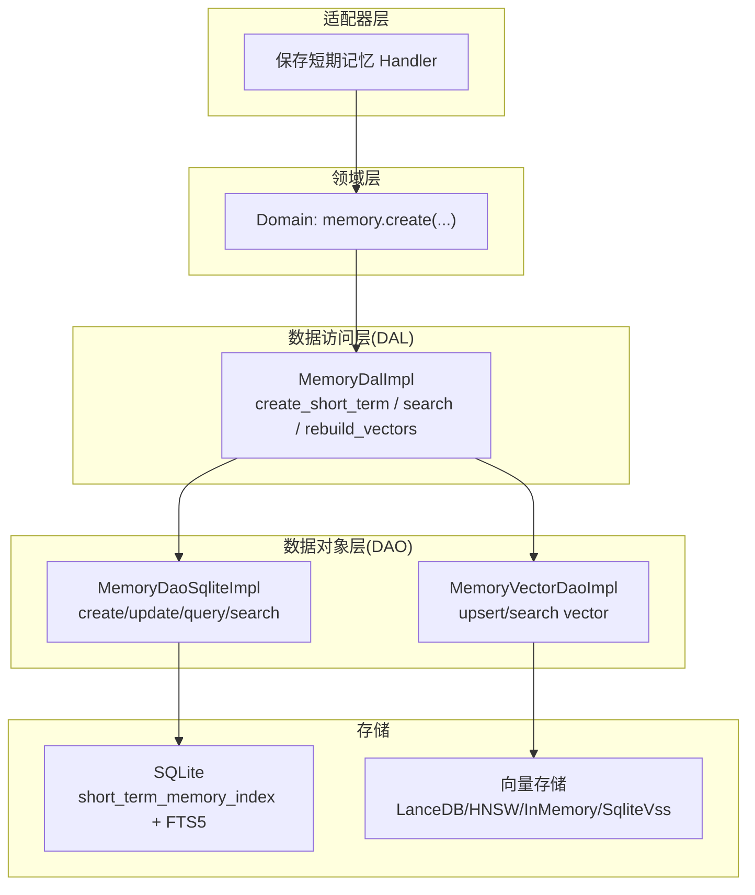
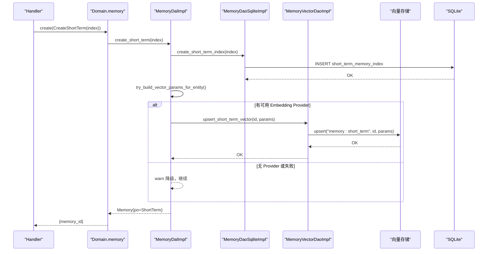
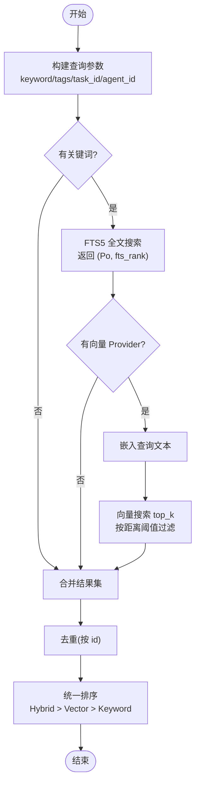
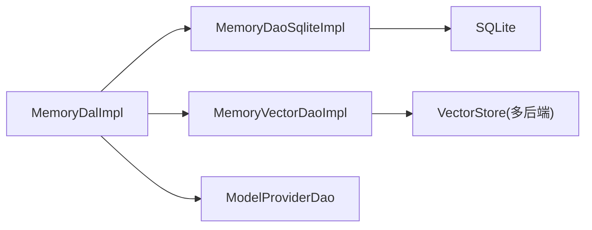

# 短期记忆索引

<cite>
**本文引用的文件**
- [memory.rs](file://src/models/memory.rs)
- [memory.rs（DAL）](file://src/service/dal/memory.rs)
- [sqlite.rs（DAO）](file://src/service/dao/memory/sqlite.rs)
- [vector.rs（向量 DAO）](file://src/service/dao/memory/vector.rs)
- [memory.rs（枚举）](file://common/src/enums/memory.rs)
- [20260712000000_memory_fts5.sql](file://migrations/20260712000000_memory_fts5.sql)
- [20260420000000_initial.sql](file://migrations/20260420000000_initial.sql)
- [save_short_term_memory.rs](file://src/handlers/hr/agent/save_short_term_memory.rs)
</cite>

## 目录
1. [简介](#简介)
2. [项目结构](#项目结构)
3. [核心组件](#核心组件)
4. [架构总览](#架构总览)
5. [详细组件分析](#详细组件分析)
6. [依赖关系分析](#依赖关系分析)
7. [性能考虑](#性能考虑)
8. [故障排查指南](#故障排查指南)
9. [结论](#结论)
10. [附录：CRUD 接口与示例](#附录crud-接口与示例)

## 简介
本技术文档聚焦“短期记忆索引机制”，围绕 ShortTermMemoryIndexPo 的数据结构设计、聚合逻辑、标签系统与状态管理，详细说明从多个相关 trace 到聚合摘要的 AI 处理流程与向量化步骤；并给出 SQLite 表结构、索引设计与查询性能调优建议；最后提供索引的 CRUD 操作说明以及与原始 trace 的关联维护策略。

## 项目结构
短期记忆索引涉及四层单向调用：Adapter（HTTP Handler）→ Domain → DAL → DAO。短期记忆索引的核心实现位于 DAL（业务编排）与 DAO（SQLite 持久化），模型定义在 models 层，向量索引通过统一的存储抽象解耦具体后端。

图表来源
- [save_short_term_memory.rs:30-57](file://src/handlers/hr/agent/save_short_term_memory.rs#L30-L57)
- [memory.rs（DAL）:377-422](file://src/service/dal/memory.rs#L377-L422)
- [sqlite.rs（DAO）:165-235](file://src/service/dao/memory/sqlite.rs#L165-L235)
- [vector.rs（向量 DAO）:36-79](file://src/service/dao/memory/vector.rs#L36-L79)

章节来源
- [memory.rs（DAL）:1-177](file://src/service/dal/memory.rs#L1-L177)
- [sqlite.rs（DAO）:1-127](file://src/service/dao/memory/sqlite.rs#L1-L127)

## 核心组件
- 短期记忆索引 PO：ShortTermMemoryIndexPo，承载聚合后的摘要、标签、trace 关联、状态等。
- 记忆状态：MemoryStatus（Active/Settled/Forgotten），用于检索过滤与生命周期管理。
- 全文检索：FTS5 虚拟表 + trigram 分词器，对 summary/tags 进行中文/英文混合检索。
- 向量检索：通过 Vectorizable trait 将 summary+tags 拼接为文本，调用 Cortex 嵌入生成向量，写入向量存储集合 memory:short_term。
- 聚合与沉淀：短期记忆可沉淀为长期知识节点，并标记原短期记忆为 Settled。

章节来源
- [memory.rs:158-210](file://src/models/memory.rs#L158-L210)
- [memory.rs（枚举）:12-30](file://common/src/enums/memory.rs#L12-L30)
- [20260712000000_memory_fts5.sql:16-29](file://migrations/20260712000000_memory_fts5.sql#L16-L29)
- [memory.rs（DAL）:1381-1422](file://src/service/dal/memory.rs#L1381-L1422)

## 架构总览
短期记忆索引的生命周期包含两条主线：
- 创建与向量化：构造 ShortTermMemoryIndexPo → 写 SQLite → 尝试向量化 → 失败降级不影响主流程。
- 搜索与混合排序：关键词 FTS5 搜索 + 向量语义搜索 → 结果聚合去重 → 统一排序（Hybrid > Vector > Keyword）。

图表来源
- [memory.rs（DAL）:1381-1422](file://src/service/dal/memory.rs#L1381-L1422)
- [sqlite.rs（DAO）:165-192](file://src/service/dao/memory/sqlite.rs#L165-L192)
- [vector.rs（向量 DAO）:36-51](file://src/service/dao/memory/vector.rs#L36-L51)

## 详细组件分析

### 数据结构设计：ShortTermMemoryIndexPo
- 字段职责
  - id：唯一标识（由上游生成，通常基于多条 trace 内容二次 hash）
  - agent_id/task_id：归属与任务维度
  - role：角色（如 assistant/user/system/summary）
  - summary：归纳摘要，参与 FTS5 与向量文本
  - tags：JSON 数组字符串，用于过滤与向量文本增强
  - trace_ids：JSON 数组字符串，记录聚合的原始 trace id 列表
  - status：MemoryStatus（Active/Settled/Forgotten）
  - created_at/updated_at：时间戳
- 向量化文本构建
  - 将 summary 与展平的 tags（空格分隔）拼接为向量输入文本
  - 空标签或解析失败时仅使用 summary
- 集合名
  - 向量集合名为 "memory:short_term"

章节来源
- [memory.rs:158-210](file://src/models/memory.rs#L158-L210)
- [memory.rs:399-407](file://src/models/memory.rs#L399-L407)

### 聚合逻辑与标签系统
- 聚合入口
  - 由上层（例如 Agent 运行期或外部服务）构造 ShortTermMemoryIndexPo，其中 trace_ids 已包含阶段 1 返回的 trace id 列表
  - 通过 MemoryCreateParams::CreateShortTerm 进入 DAL 创建流程
- 标签系统
  - tags 以 JSON 数组字符串存储，支持按 tag 精确匹配过滤（EXISTS json_each）
  - 标签同时参与向量文本增强，提升语义召回
- 状态管理
  - Active：默认可检索
  - Settled：短期记忆沉淀为长期知识后标记，默认不参与检索
  - Forgotten：软删除，默认不参与检索

章节来源
- [memory.rs（DAL）:377-422](file://src/service/dal/memory.rs#L377-L422)
- [sqlite.rs（DAO）:298-381](file://src/service/dao/memory/sqlite.rs#L298-L381)
- [memory.rs（枚举）:12-30](file://common/src/enums/memory.rs#L12-L30)

### 索引创建流程：AI 处理与向量化
- 写库优先
  - 先插入 short_term_memory_index，确保主数据落盘
- 向量化可选且可降级
  - 尝试获取默认 Embedding Provider，若存在则调用 Cortex 嵌入生成 VectorIndexParams
  - 写入向量集合 "memory:short_term"
  - 任何中间步骤失败均记录 warn 日志并降级，不阻塞主流程
- 重建向量索引
  - 当切换 Embedding Provider 或需要全量重建时，清空对应集合并按需重建

章节来源
- [memory.rs（DAL）:1381-1422](file://src/service/dal/memory.rs#L1381-L1422)
- [memory.rs（DAL）:654-799](file://src/service/dal/memory.rs#L654-L799)
- [vector.rs（向量 DAO）:36-79](file://src/service/dao/memory/vector.rs#L36-L79)

### 存储优化：SQLite 表结构与索引
- 表结构
  - short_term_memory_index：id(agent_id, task_id, role, summary, tags, trace_ids, status, created_at, updated_at)
  - 长期知识节点与关系表亦存在，但短期记忆关注上述表
- 索引设计
  - idx_stmi_agent_id：按 agent_id 过滤
  - idx_stmi_created_at：按时间倒序排序
  - idx_stmi_tags：加速 tags 过滤（结合 json_each）
- 全文检索
  - FTS5 虚拟表 short_term_memory_fts，对 summary/tags 建立 trigram 分词索引
  - 触发器自动同步增删改，保证一致性
- 查询性能要点
  - 避免 keyword 直接走 query_short_term（已废弃告警），应使用 search_short_term 走 FTS5
  - 使用 tags 过滤时通过 EXISTS json_each 减少扫描
  - 默认排除 Forgotten 状态，降低无关结果干扰

章节来源
- [20260420000000_initial.sql:117-129](file://migrations/20260420000000_initial.sql#L117-L129)
- [20260420000000_initial.sql:246-253](file://migrations/20260420000000_initial.sql#L246-L253)
- [20260712000000_memory_fts5.sql:16-29](file://migrations/20260712000000_memory_fts5.sql#L16-L29)
- [sqlite.rs（DAO）:298-381](file://src/service/dao/memory/sqlite.rs#L298-L381)

### 查询与混合搜索
- 关键词搜索
  - 通过 FTS5 MATCH 匹配 summary/tags，返回 fts_rank
- 向量搜索
  - 将查询文本嵌入为向量，搜索 top_k 结果，按距离阈值过滤
- 混合搜索
  - 合并关键词与向量命中，去重后统一排序：Hybrid > Vector > Keyword
  - 组内排序：向量距离升序，关键词按 fts_rank 升序

图表来源
- [memory.rs（DAL）:1000-1148](file://src/service/dal/memory.rs#L1000-L1148)
- [sqlite.rs（DAO）:383-484](file://src/service/dao/memory/sqlite.rs#L383-L484)

章节来源
- [memory.rs（DAL）:1000-1148](file://src/service/dal/memory.rs#L1000-L1148)
- [sqlite.rs（DAO）:383-484](file://src/service/dao/memory/sqlite.rs#L383-L484)

### 与原始 trace 的关联与维护
- 关联方式
  - ShortTermMemoryIndexPo.trace_ids 记录聚合的原始 trace id 列表
  - 原始 trace 以每日 JSONL 文件形式追加存储，位置信息（date_path + line_number）可用于回溯
- 维护策略
  - 短期记忆沉淀为长期知识后，将原短期记忆状态更新为 Settled
  - 删除短期记忆采用软删除（标记 Forgotten），保留可恢复性
  - 向量索引与 SQLite 索引保持独立生命周期，删除短期记忆时会尝试删除向量索引（失败降级）

章节来源
- [memory.rs:158-210](file://src/models/memory.rs#L158-L210)
- [memory.rs（DAL）:578-652](file://src/service/dal/memory.rs#L578-L652)
- [sqlite.rs（DAO）:237-257](file://src/service/dao/memory/sqlite.rs#L237-L257)

## 依赖关系分析
- 模块耦合
  - DAL 依赖 DAO（SQLite）与向量 DAO（抽象），并通过 ModelProviderDao 获取 Embedding Provider
  - DAO 仅负责 SQL 与文件写入，无业务感知
  - 向量存储通过 RequestContext.vector_store() 注入，支持多后端降级
- 外部依赖
  - sqlx 用于 SQLite 查询与事务
  - FTS5 虚拟表与触发器保障全文索引一致性
  - 向量存储后端（LanceDB/HNSW/InMemory/SqliteVss）通过统一接口访问

图表来源
- [memory.rs（DAL）:1-177](file://src/service/dal/memory.rs#L1-L177)
- [vector.rs（向量 DAO）:1-34](file://src/service/dao/memory/vector.rs#L1-L34)

章节来源
- [memory.rs（DAL）:1-177](file://src/service/dal/memory.rs#L1-L177)
- [vector.rs（向量 DAO）:1-34](file://src/service/dao/memory/vector.rs#L1-L34)

## 性能考虑
- 写入路径
  - 先写 SQLite，再异步/降级式向量化，避免阻塞主流程
- 查询路径
  - 关键词搜索走 FTS5，避免全表扫描
  - 向量搜索限制 top_k 并应用距离阈值，减少后续 IO
  - 混合搜索结果去重与统一排序，提高相关性
- 索引与过滤
  - 合理使用 agent_id、task_id、tags 过滤条件，利用已有索引
  - 默认排除 Forgotten 状态，减少无效结果
- 重建策略
  - 切换 Embedding Provider 时按需清空并重建向量集合，避免混用不同模型的向量

[本节为通用性能指导，无需特定文件引用]

## 故障排查指南
- 向量化失败
  - 现象：warn 日志提示“向量化失败，已降级”
  - 排查：确认是否配置了默认 Embedding Provider；检查 Cortex 嵌入调用；查看向量存储是否可用
- 关键词搜索为空
  - 现象：search_short_term 返回空
  - 排查：确认 keyword 非空；检查 FTS5 虚拟表是否存在；确认 tags/task_id/agent_id 过滤条件是否过严
- 更新失败
  - 现象：update_short_term_index 影响行数为 0
  - 排查：确认 id 存在且未被遗忘（status != Forgotten）
- 删除失败
  - 现象：向量索引删除失败
  - 现象：warn 日志提示“向量索引删除失败，已降级”
  - 排查：向量存储后端异常；不影响主流程，可忽略或重试

章节来源
- [memory.rs（DAL）:1381-1422](file://src/service/dal/memory.rs#L1381-L1422)
- [sqlite.rs（DAO）:194-235](file://src/service/dao/memory/sqlite.rs#L194-L235)
- [memory.rs（DAL）:477-516](file://src/service/dal/memory.rs#L477-L516)

## 结论
短期记忆索引通过“SQLite + FTS5 + 向量存储”的组合，实现了高可用的聚合摘要存储与多维检索能力。其设计强调：
- 写路径强一致（SQLite 优先），读路径灵活（关键词/向量/混合）
- 标签与状态体系完善，支持过滤与生命周期管理
- 向量化过程可降级，保障主流程稳定性
- 与原始 trace 的关联清晰，便于溯源与审计

[本节为总结性内容，无需特定文件引用]

## 附录：CRUD 接口与示例

### 创建（Create）
- 入口
  - Handler 构造 ShortTermMemoryIndexPo（含 summary、tags、trace_ids、status 等）
  - 调用 Domain.memory().create(MemoryCreateParams::CreateShortTerm(...))
- DAL 行为
  - 写 SQLite short_term_memory_index
  - 尝试向量化 summary+tags，失败降级
- 参考路径
  - [save_short_term_memory.rs:30-57](file://src/handlers/hr/agent/save_short_term_memory.rs#L30-L57)
  - [memory.rs（DAL）:1381-1422](file://src/service/dal/memory.rs#L1381-L1422)
  - [sqlite.rs（DAO）:165-192](file://src/service/dao/memory/sqlite.rs#L165-L192)

### 更新（Update）
- 行为
  - 覆盖更新 SQLite 索引字段（agent_id、task_id、role、summary、tags、trace_ids、status、updated_at）
  - 重新向量化 summary+tags，失败降级
- 参考路径
  - [memory.rs（DAL）:392-429](file://src/service/dal/memory.rs#L392-L429)
  - [sqlite.rs（DAO）:194-235](file://src/service/dao/memory/sqlite.rs#L194-L235)

### 查询（Read）
- 关键词搜索
  - 使用 search_short_term 走 FTS5，返回 (Po, fts_rank)
- 通用查询
  - 使用 query_short_term 支持 agent_id、status、exclude_status、tags、task_id、limit 等过滤
- 参考路径
  - [sqlite.rs（DAO）:298-381](file://src/service/dao/memory/sqlite.rs#L298-L381)
  - [sqlite.rs（DAO）:383-484](file://src/service/dao/memory/sqlite.rs#L383-L484)

### 删除（Delete）
- 行为
  - 软删除：将 status 置为 Forgotten，保留数据可恢复
  - 尝试删除向量索引，失败降级
- 参考路径
  - [memory.rs（DAL）:477-516](file://src/service/dal/memory.rs#L477-L516)
  - [sqlite.rs（DAO）:237-257](file://src/service/dao/memory/sqlite.rs#L237-L257)

### 与原始 trace 的关联
- 关联字段
  - ShortTermMemoryIndexPo.trace_ids 记录聚合的 trace id 列表
- 定位原始内容
  - 通过 KnowledgeReferencePo 的 date_path + line_number 读取 JSONL 中的原始 trace
- 参考路径
  - [memory.rs:158-210](file://src/models/memory.rs#L158-L210)
  - [sqlite.rs（DAO）:105-123](file://src/service/dao/memory/sqlite.rs#L105-L123)