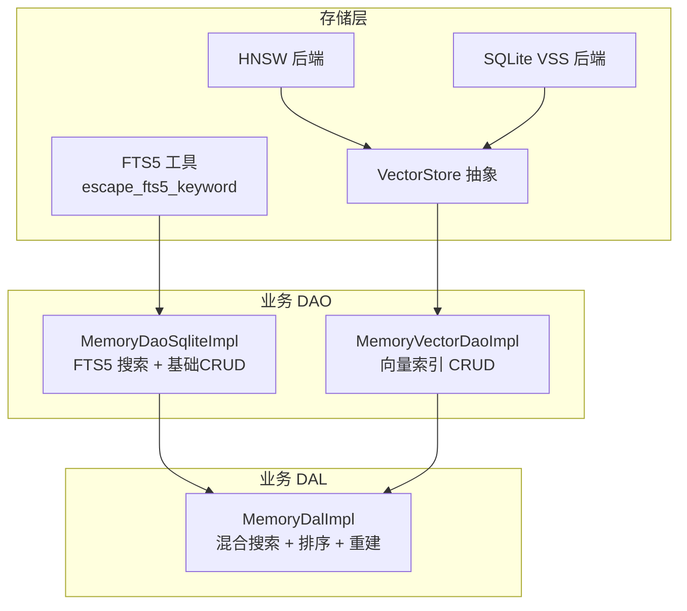
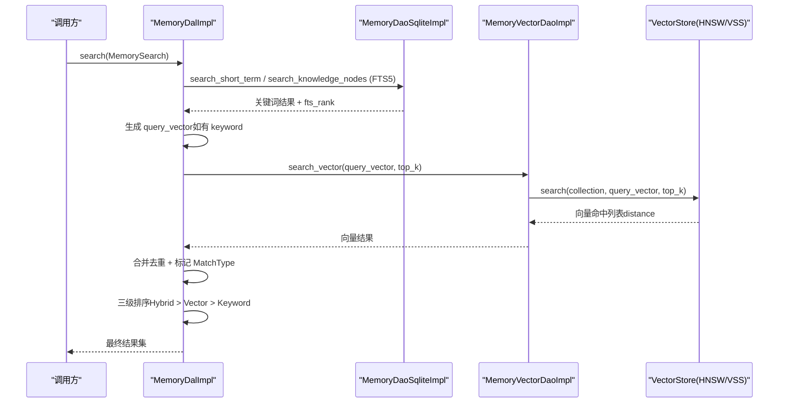
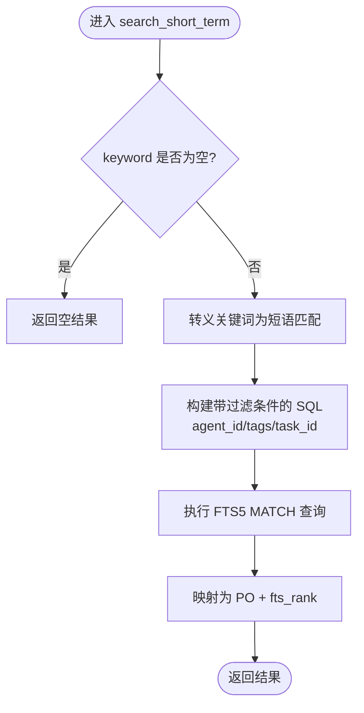
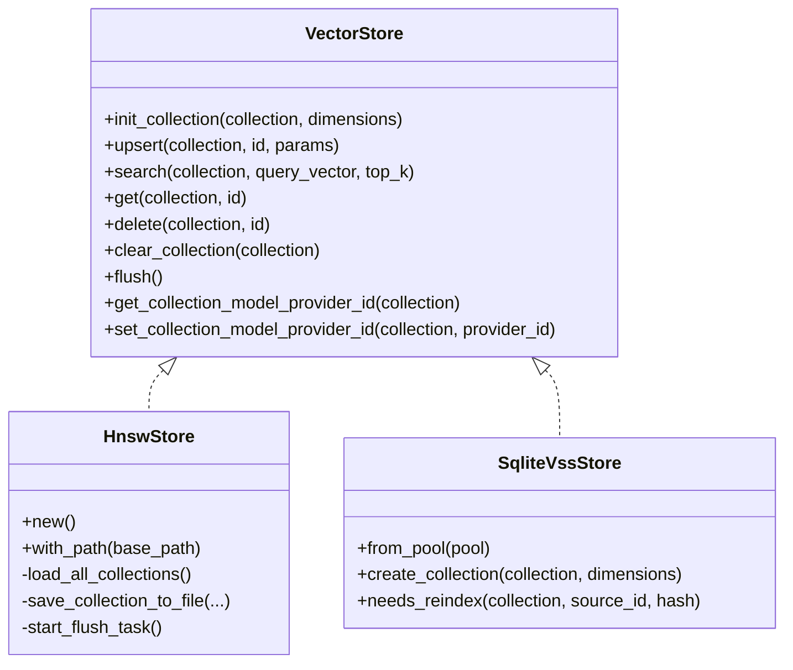
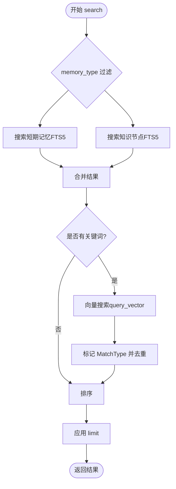
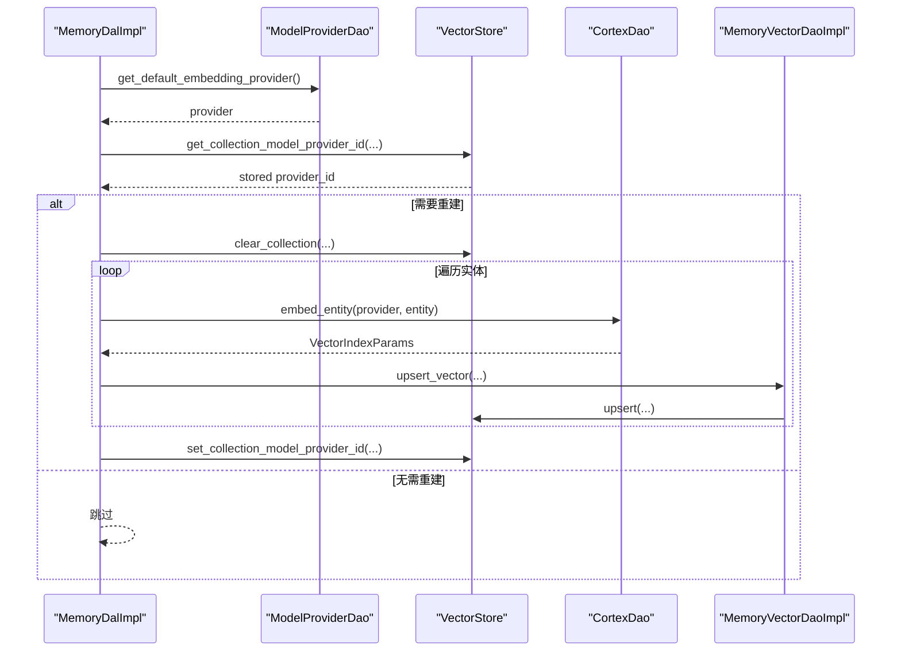
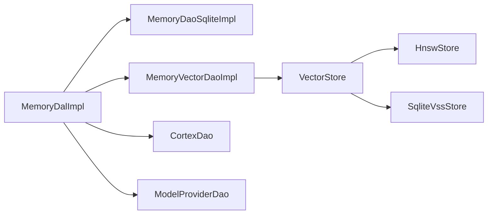

# 记忆搜索机制

<cite>
**本文引用的文件**
- [vector_search_architecture.md](file://docs/vector_search_architecture.md)
- [fts5.rs](file://src/pkg/storage/fts5.rs)
- [vector.rs](file://src/pkg/storage/vector.rs)
- [hnsw.rs](file://src/pkg/storage/hnsw.rs)
- [memory.rs](file://src/service/dal/memory.rs)
- [sqlite.rs](file://src/service/dao/memory/sqlite.rs)
- [vector.rs](file://src/service/dao/memory/vector.rs)
</cite>

## 目录
1. [简介](#简介)
2. [项目结构](#项目结构)
3. [核心组件](#核心组件)
4. [架构总览](#架构总览)
5. [详细组件分析](#详细组件分析)
6. [依赖关系分析](#依赖关系分析)
7. [性能考量](#性能考量)
8. [故障排查指南](#故障排查指南)
9. [结论](#结论)
10. [附录：API 使用示例与最佳实践](#附录api-使用示例与最佳实践)

## 简介
本技术文档围绕“记忆搜索机制”展开，系统性阐述 FTS5 全文搜索、向量语义搜索以及混合搜索的实现原理与工程落地。内容覆盖关键词匹配、语义相似度计算、查询构建（解析、权重、排序）、相关性评分（文本相似度、标签匹配、时间衰减）、API 使用场景与性能优化策略（索引维护、缓存、分页）。设计遵循四层单向调用原则：Adapter → Domain → DAL → DAO，存储层通用能力集中在 pkg/storage，业务 DAO/DAL 组合实现检索编排。

## 项目结构
记忆搜索相关代码按职责分层组织：
- 存储层（pkg/storage）：FTS5 工具函数、向量存储抽象与多后端实现（HNSW、SQLite VSS）
- 业务 DAO（service/dao/memory）：SQLite 基础数据与 FTS5 搜索；向量 DAO 仅负责向量索引 CRUD
- 业务 DAL（service/dal/memory）：组合基础 DAO + 向量 DAO，实现混合搜索、结果聚合与排序
- 设计文档（docs/vector_search_architecture.md）：统一说明三态匹配模型、排序策略、生命周期与降级策略

图表来源
- [fts5.rs:1-45](file://src/pkg/storage/fts5.rs#L1-L45)
- [vector.rs:18-74](file://src/pkg/storage/vector.rs#L18-L74)
- [hnsw.rs:149-166](file://src/pkg/storage/hnsw.rs#L149-L166)
- [sqlite.rs:383-484](file://src/service/dao/memory/sqlite.rs#L383-L484)
- [vector.rs:36-147](file://src/service/dao/memory/vector.rs#L36-L147)
- [memory.rs:188-276](file://src/service/dal/memory.rs#L188-L276)

章节来源
- [vector_search_architecture.md:11-55](file://docs/vector_search_architecture.md#L11-L55)

## 核心组件
- FTS5 关键词搜索
  - 通过 SQLite FTS5 虚拟表进行短语匹配，关键词经 escape_fts5_keyword 转义后以双引号包裹，避免空格被解释为 AND，并正确处理特殊字符。
  - 支持按 agent_id、tags、task_id 等条件过滤，返回 fts_rank（BM25 越小越相关）。
- 向量语义搜索
  - 抽象 VectorStore trait，提供 upsert/search/get/delete/clear_collection 等接口，支持 HNSW 与 SQLite VSS 两种后端。
  - HNSW 后端采用余弦距离（1 - cos(θ)），lazy rebuild 策略，bincode 持久化，后台定时落盘，Drop 兜底落盘。
- 混合搜索与排序
  - DAL 层并行执行关键词搜索与向量搜索，合并结果并标记 MatchType（Hybrid/Vector/Keyword），按三级优先级排序：Hybrid > Vector > Keyword，组内分别按 vector_distance 或 fts_rank 细排。
- 索引生命周期与降级
  - 创建/更新/删除时同步维护 FTS5（触发器自动）与向量索引（DAL 主动 upsert/delete）。
  - 向量化失败仅 warn 降级，不影响主流程；无 Embedding Provider 时回退到 FTS5。

章节来源
- [fts5.rs:6-18](file://src/pkg/storage/fts5.rs#L6-L18)
- [sqlite.rs:383-484](file://src/service/dao/memory/sqlite.rs#L383-L484)
- [vector.rs:18-74](file://src/pkg/storage/vector.rs#L18-L74)
- [hnsw.rs:20-34](file://src/pkg/storage/hnsw.rs#L20-L34)
- [memory.rs:188-276](file://src/service/dal/memory.rs#L188-L276)

## 架构总览
记忆搜索采用“索引与数据完全分离”的架构：业务表不变，FTS5 与向量索引作为附加层通过 source_id 关联。DAL 层组合基础 DAO 与向量 DAO，实现统一的 search() 入口，对外暴露混合搜索能力。

图表来源
- [memory.rs:188-276](file://src/service/dal/memory.rs#L188-L276)
- [sqlite.rs:383-484](file://src/service/dao/memory/sqlite.rs#L383-L484)
- [vector.rs:67-93](file://src/service/dao/memory/vector.rs#L67-L93)
- [hnsw.rs:493-543](file://src/pkg/storage/hnsw.rs#L493-L543)

## 详细组件分析

### FTS5 关键词搜索
- 关键词转义与短语匹配
  - 使用 escape_fts5_keyword 将用户输入转为短语匹配，避免空格与特殊字符导致误匹配。
- SQL 构建与过滤
  - 基于 short_term_memory_fts 与 long_term_knowledge_node_fts 虚拟表 JOIN 业务表，支持 agent_id、tags、task_id 等过滤。
  - 返回 fts_rank，用于组内排序（BM25 越小越相关）。
- 性能要点
  - 空关键词直接返回空结果，避免 MATCH 空串报错。
  - tags 过滤使用 json_each 与 IN 子句，结合部分索引提升效率。

图表来源
- [sqlite.rs:383-484](file://src/service/dao/memory/sqlite.rs#L383-L484)
- [fts5.rs:6-18](file://src/pkg/storage/fts5.rs#L6-L18)

章节来源
- [sqlite.rs:383-484](file://src/service/dao/memory/sqlite.rs#L383-L484)
- [fts5.rs:6-18](file://src/pkg/storage/fts5.rs#L6-L18)

### 向量语义搜索（HNSW 与 SQLite VSS）
- 抽象接口
  - VectorStore trait 定义 init_collection/upsert/search/get/delete/clear_collection/flush 等方法，屏蔽后端差异。
- HNSW 后端
  - 余弦距离计算，lazy rebuild 策略，每个 collection 独立索引，bincode 持久化，后台 60s 定时落盘，Drop 兜底落盘。
  - 冷启动扫描目录加载已有索引，避免全量重建。
- SQLite VSS 后端
  - 使用 vss0 扩展，元数据表 vector_metadata 与 vss_集合 虚拟表配合，search 时按 distance 排序并过滤过期记录。

图表来源
- [vector.rs:18-74](file://src/pkg/storage/vector.rs#L18-L74)
- [hnsw.rs:149-166](file://src/pkg/storage/hnsw.rs#L149-L166)
- [hnsw.rs:432-616](file://src/pkg/storage/hnsw.rs#L432-L616)
- [vector.rs:76-235](file://src/pkg/storage/vector.rs#L76-L235)

章节来源
- [vector.rs:18-74](file://src/pkg/storage/vector.rs#L18-L74)
- [hnsw.rs:20-34](file://src/pkg/storage/hnsw.rs#L20-L34)
- [hnsw.rs:493-543](file://src/pkg/storage/hnsw.rs#L493-L543)
- [vector.rs:76-235](file://src/pkg/storage/vector.rs#L76-L235)

### 混合搜索与结果排序
- 查询构建
  - MemoryDalImpl.search 根据 filters.memory_type 决定搜索短期记忆与知识节点；Relation 类型仅支持关键词搜索。
  - 若存在 keyword，则生成 query_vector 并执行向量搜索；否则仅走 FTS5。
- 结果合并与标记
  - 合并关键词与向量结果，标记 MatchType：Hybrid（同时命中）、Vector（仅向量）、Keyword（仅关键词）。
- 排序策略
  - 三级排序：Hybrid > Vector > Keyword；组内细排：Hybrid/Vector 按 vector_distance 升序，Keyword 按 fts_rank 升序。
  - 应用 limit 截断结果。

图表来源
- [memory.rs:188-276](file://src/service/dal/memory.rs#L188-L276)

章节来源
- [memory.rs:188-276](file://src/service/dal/memory.rs#L188-L276)

### 相关性评分机制
- 文本相似度
  - FTS5 使用 BM25 算法，返回 fts_rank；值越小表示越相关。
  - 向量搜索使用余弦距离（HNSW）或内置距离度量（VSS），distance 越小越相似。
- 标签匹配
  - 通过 JSON 字段 tags 的 json_each 与 IN 子句进行 OR 语义过滤，参与结果筛选但不改变排序权重。
- 时间衰减因子
  - 向量搜索结果在 HNSW/VSS 中会过滤 expire_at 过期的记录；DAL 层未显式引入时间衰减权重，但可通过业务侧对 created_at/updated_at 做二次排序或加权。

章节来源
- [sqlite.rs:383-484](file://src/service/dao/memory/sqlite.rs#L383-L484)
- [hnsw.rs:493-543](file://src/pkg/storage/hnsw.rs#L493-L543)
- [vector.rs:126-173](file://src/pkg/storage/vector.rs#L126-L173)

### 索引维护与重建
- 触发式非全量索引
  - FTS5 由数据库触发器自动同步；向量索引在创建/更新/删除时由 DAL 主动维护。
- 重建流程
  - rebuild_vectors 获取当前启用的 Embedding Provider，检查各集合的 model_provider_id，必要时清空集合并逐条 embed + upsert。
  - 单条失败仅记日志，不中断整体流程。

图表来源
- [memory.rs:654-799](file://src/service/dal/memory.rs#L654-L799)
- [vector.rs:36-147](file://src/service/dao/memory/vector.rs#L36-L147)

章节来源
- [memory.rs:654-799](file://src/service/dal/memory.rs#L654-L799)

## 依赖关系分析
- 耦合与内聚
  - 存储层纯通用能力，无业务感知；业务 DAO 仅关注自身领域；DAL 组合 DAO 实现编排，职责清晰。
- 外部依赖
  - sqlx（SQLite）、instant-distance（HNSW）、bincode（持久化）、serde_json（向量序列化）。
- 潜在循环依赖
  - 通过 trait 与模块拆分避免 DAO 互调；DAL 依赖 DAO 与 Cortex/ModelProvider，无反向依赖。

图表来源
- [memory.rs:181-186](file://src/service/dal/memory.rs#L181-L186)
- [vector.rs:36-147](file://src/service/dao/memory/vector.rs#L36-L147)
- [vector.rs:18-74](file://src/pkg/storage/vector.rs#L18-L74)

章节来源
- [vector_search_architecture.md:46-55](file://docs/vector_search_architecture.md#L46-L55)

## 性能考量
- 索引维护
  - FTS5 触发器自动同步，零额外开销；向量索引 lazy rebuild，减少频繁重建成本。
  - HNSW 后台 60s 定时落盘，Drop 兜底，平衡性能与持久化可靠性。
- 缓存机制
  - HNSW 内存驻留索引，冷启动加载 bincode 文件，避免重复构建。
  - SQLite VSS 利用数据库内置索引加速距离计算。
- 分页查询
  - 通过 limit 控制返回数量；DAL 层在合并排序后截断，避免前端处理大结果集。
- 降级策略
  - 向量化失败仅 warn，主流程不受影响；无 Embedding Provider 时回退到 FTS5。

[本节为通用指导，不直接分析具体文件]

## 故障排查指南
- 向量搜索不可用
  - 检查是否存在启用的 Embedding Provider；若无，系统将降级到 FTS5。
  - 查看重建任务状态与错误日志，确认是否因单个实体失败导致中断。
- 关键词搜索无结果
  - 确认关键词是否已正确转义为短语匹配；空关键词将直接返回空结果。
  - 检查 tags/task_id/agent_id 过滤条件是否过于严格。
- 向量索引不一致
  - 对比集合的 model_provider_id 与当前启用 Provider；必要时执行 rebuild_vectors。
  - 检查 HNSW 索引文件是否存在且可加载，或 VSS 扩展是否成功加载。

章节来源
- [memory.rs:654-799](file://src/service/dal/memory.rs#L654-L799)
- [sqlite.rs:383-484](file://src/service/dao/memory/sqlite.rs#L383-L484)
- [hnsw.rs:191-218](file://src/pkg/storage/hnsw.rs#L191-L218)
- [vector.rs:245-262](file://src/pkg/storage/vector.rs#L245-L262)

## 结论
记忆搜索机制通过 FTS5 与向量语义搜索的有机结合，提供了高召回与高精度的检索能力。DAL 层的混合搜索与三级排序确保结果相关性最优；存储层的多后端支持与降级策略保障系统稳定性与可扩展性。建议在生产环境优先使用 HNSW 后端以获得更好的性能与持久化能力，并结合合理的 limit 与过滤条件优化查询体验。

[本节为总结性内容，不直接分析具体文件]

## 附录：API 使用示例与最佳实践
- 关键词搜索
  - 适用场景：精确术语匹配、短查询、快速定位。
  - 参数建议：设置合理 limit；使用 tags 过滤缩小范围；避免空关键词。
- 语义搜索
  - 适用场景：长查询、意图理解、跨同义词检索。
  - 参数建议：top_k 不宜过大；确保 Embedding Provider 可用；关注 expire_at 过期策略。
- 混合搜索
  - 适用场景：兼顾精确与泛化，提升召回率与准确率。
  - 参数建议：同时提供 keyword 与 filters；关注 MatchType 分布以评估效果。
- 最佳实践
  - 索引维护：定期重建向量索引以适配模型升级；监控重建进度与错误。
  - 缓存与分页：合理使用 limit；前端分页展示；避免一次性拉取大量结果。
  - 降级与容错：向量化失败不影响写入；无 Provider 时回退到 FTS5。

[本节为概念性内容，不直接分析具体文件]