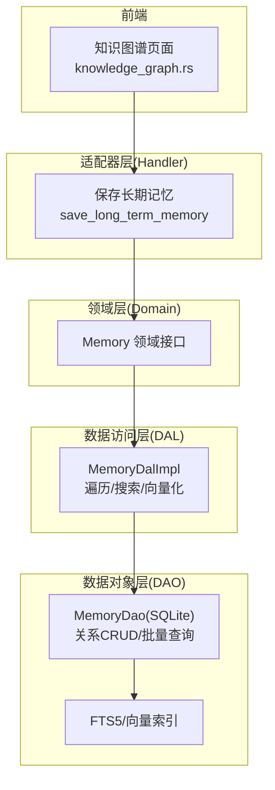
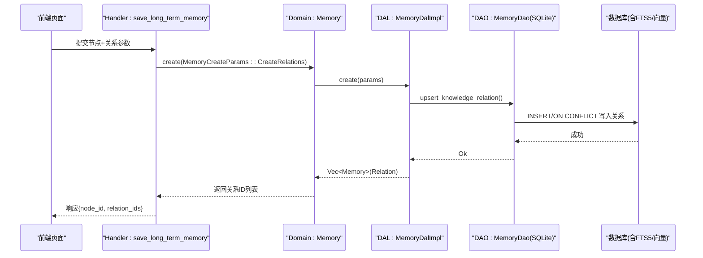
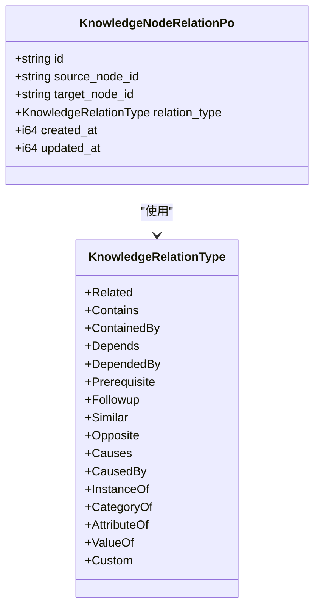
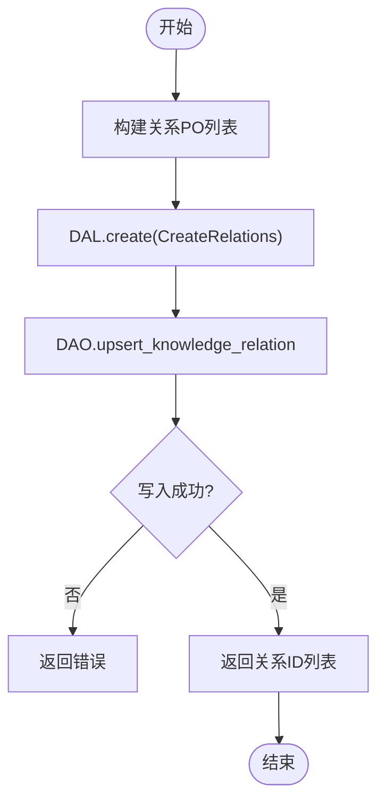
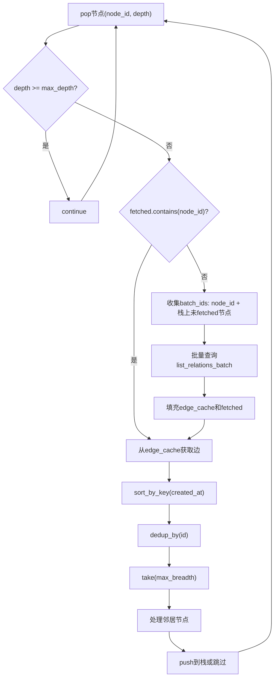
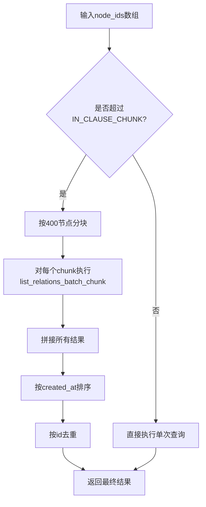
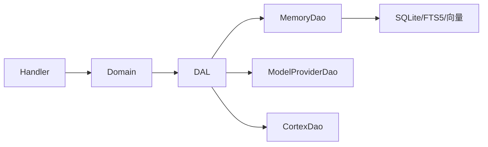

# 知识关系管理

<cite>
**本文引用的文件**
- [memory.rs](file://common/src/enums/memory.rs)
- [sqlite.rs](file://src/service/dao/memory/sqlite.rs)
- [memory.rs](file://src/service/dal/memory.rs)
- [save_long_term_memory.rs](file://src/handlers/hr/agent/save_long_term_memory.rs)
- [knowledge_graph.rs](file://frontend/src/pages/hr/knowledge_graph.rs)
- [20260724000000_knowledge_node_tags.sql](file://migrations/20260724000000_knowledge_node_tags.sql)
- [20260731000001_knowledge_node_is_published.sql](file://migrations/20260731000001_knowledge_node_is_published.sql)
- [tasks.md](file://docs/superpowers/specs/enhance-memory-system/tasks.md)
- [memory_test.rs](file://src/service/dal/memory_test.rs)
</cite>

## 更新摘要
**变更内容**
- 更新了知识图谱遍历算法章节，重点说明DFS遍历的N+1查询优化
- 新增SQLite IN子句分块处理的详细说明
- 更新了性能考虑章节，包含批量缓存和分块处理的性能提升
- 增强了故障排查指南，涵盖新的优化机制相关问题

## 目录
1. [简介](#简介)
2. [项目结构](#项目结构)
3. [核心组件](#核心组件)
4. [架构总览](#架构总览)
5. [详细组件分析](#详细组件分析)
6. [依赖分析](#依赖分析)
7. [性能考虑](#性能考虑)
8. [故障排查指南](#故障排查指南)
9. [结论](#结论)
10. [附录](#附录)

## 简介
本技术文档围绕"知识关系管理"展开，聚焦 KnowledgeNodeRelationPo 的关系模型设计、关系的创建与维护机制、知识图谱遍历算法（深度优先与广度优先）、关系操作的 API 示例、以及完整性检查与一致性维护策略。文档面向开发者，既提供高层架构视图，也给出代码级实现路径与可视化图示，帮助快速掌握知识图谱的核心操作。

**最新更新**：知识图谱遍历算法已进行重大性能优化，DFS遍历从N+1查询改为栈预取批量缓存，SQLite IN子句支持400节点分块处理，显著提升大规模图谱遍历性能。

## 项目结构
本项目采用四层单向调用：Adapter → Domain → DAL → DAO。PO（持久化对象）仅在 DAO/DAL 内部使用，Domain 对外暴露业务实体；DAL 负责跨 DAO 流程编排（如混合搜索、向量化、图谱遍历），DAO 负责具体数据访问（SQLite + FTS5 + 向量索引）。前端通过 Dioxus 页面与组件消费后端能力，支持图谱可视化与交互。

**图表来源**
- [save_long_term_memory.rs:75-109](file://src/handlers/hr/agent/save_long_term_memory.rs#L75-L109)
- [memory.rs:372-390](file://src/service/dal/memory.rs#L372-L390)
- [sqlite.rs:1095-1125](file://src/service/dao/memory/sqlite.rs#L1095-L1125)
- [knowledge_graph.rs:55-108](file://frontend/src/pages/hr/knowledge_graph.rs#L55-L108)

**章节来源**
- [save_long_term_memory.rs:75-109](file://src/handlers/hr/agent/save_long_term_memory.rs#L75-L109)
- [memory.rs:372-390](file://src/service/dal/memory.rs#L372-L390)
- [sqlite.rs:1095-1125](file://src/service/dao/memory/sqlite.rs#L1095-L1125)
- [knowledge_graph.rs:55-108](file://frontend/src/pages/hr/knowledge_graph.rs#L55-L108)

## 核心组件
- 关系类型枚举：KnowledgeRelationType，定义预置关系语义（相关、包含、依赖、因果、实例、分类、属性等）并支持自定义扩展。
- 关系持久化对象：KnowledgeNodeRelationPo，表示有向边（source_node_id → target_node_id），携带类型与时间戳。
- 关系存储与查询：DAO 层提供 upsert、按源/目标/节点集合的批量查询、按类型过滤、删除等。
- 图谱遍历：DAL 层实现 BFS/DFS 两种策略，支持最大深度与每层最大展开数限制，现已优化为批量查询模式。
- 前端可视化：knowledge_graph.rs 将搜索结果与遍历结果渲染为图谱，支持点击节点展开关联、推荐起点等。

**章节来源**
- [memory.rs:96-182](file://common/src/enums/memory.rs#L96-L182)
- [sqlite.rs:1095-1125](file://src/service/dao/memory/sqlite.rs#L1095-L1125)
- [sqlite.rs:1127-1283](file://src/service/dao/memory/sqlite.rs#L1127-L1283)
- [memory.rs:518-576](file://src/service/dal/memory.rs#L518-L576)
- [knowledge_graph.rs:55-108](file://frontend/src/pages/hr/knowledge_graph.rs#L55-L108)

## 架构总览
下图展示从 Handler 到 DAL/DAO 的关系创建与图谱遍历调用链，以及前后端交互。

**图表来源**
- [save_long_term_memory.rs:75-109](file://src/handlers/hr/agent/save_long_term_memory.rs#L75-L109)
- [memory.rs:372-390](file://src/service/dal/memory.rs#L372-L390)
- [sqlite.rs:1095-1125](file://src/service/dao/memory/sqlite.rs#L1095-L1125)

## 详细组件分析

### 关系模型与约束
- 关系类型：KnowledgeRelationType 提供丰富语义，支持字符串互转与 Display 输出，便于序列化与存储。
- 方向性：关系为有向边，source_node_id → target_node_id；查询时区分出边、入边与双向关联。
- 唯一性与幂等：upsert 基于 id 主键冲突更新，保证幂等写入。
- 完整性：删除节点时级联清理其所有出入边；关系不可直接更新，需删除重建。

**图表来源**
- [memory.rs:96-182](file://common/src/enums/memory.rs#L96-L182)
- [sqlite.rs:1095-1125](file://src/service/dao/memory/sqlite.rs#L1095-L1125)

**章节来源**
- [memory.rs:96-182](file://common/src/enums/memory.rs#L96-L182)
- [sqlite.rs:1095-1125](file://src/service/dao/memory/sqlite.rs#L1095-L1125)

### 关系的创建与维护
- 创建：Handler 接收关系参数，构造 KnowledgeNodeRelationPo 并通过 DAL 的 create 分发至 DAO 的 upsert。
- 批量查询：DAO 提供 list_relations_batch，按一组节点 ID 批量拉取与其相关的出入边，用于图谱遍历。
- 删除：支持单条删除与按节点级联删除（事务内同时删除 source/target 匹配的行）。
- 更新：关系不可更新，需删除后重建；DAL 对 Relation 类型的 update/delete 进行限制。

**图表来源**
- [save_long_term_memory.rs:75-109](file://src/handlers/hr/agent/save_long_term_memory.rs#L75-L109)
- [memory.rs:372-390](file://src/service/dal/memory.rs#L372-L390)
- [sqlite.rs:1095-1125](file://src/service/dao/memory/sqlite.rs#L1095-L1125)

**章节来源**
- [save_long_term_memory.rs:75-109](file://src/handlers/hr/agent/save_long_term_memory.rs#L75-L109)
- [memory.rs:372-390](file://src/service/dal/memory.rs#L372-L390)
- [sqlite.rs:1095-1125](file://src/service/dao/memory/sqlite.rs#L1095-L1125)
- [sqlite.rs:1285-1328](file://src/service/dao/memory/sqlite.rs#L1285-L1328)
- [memory_test.rs:1260-1284](file://src/service/dal/memory_test.rs#L1260-L1284)

### 知识图谱遍历算法

#### 广度优先搜索（BFS）
BFS 按层推进，逐层收集当前层节点的关联边，去重后加入下一层队列，支持 max_depth 与 max_breadth 控制。BFS 已经实现了批量查询优化，每层一条 SQL 查询。

#### 深度优先搜索（DFS）- 已优化

**更新** DFS 遍历算法已进行重大性能优化，解决了原有的 N+1 查询问题。

**优化前的问题**：
- 每次 pop 一个节点就调用一次 `list_all_relations_for_node`，查询次数等于访问节点数
- 在大规模图谱中导致严重的性能瓶颈

**优化后的实现**：
- **栈预取批量缓存**：保留逐节点 pop 的深度优先语义，但将「按需单点查边」改为「缓存未命中时批量预取整个栈前沿」
- **双数据结构**：
  - `edge_cache: HashMap<String, Vec<KnowledgeNodeRelationPo>>`：按双端点分组的边索引
  - `fetched: HashSet<String>`：已完整拉取过边的节点标记
- **批量预取机制**：当节点未被 fetched 时，收集当前栈上所有未 fetched 的节点 ID + 当前节点 ID，一次调用 `list_relations_batch` 批量取边
- **智能缓存**：每条边挂到双端点名下的缓存，避免重复查询

**正确性保证**：
- pop 顺序、`take(max_breadth)` 的 created_at ASC 选边顺序完全不变，结果集与旧实现等价
- `visited_relations` 去重天然容忍双端点分组带来的重复边
- 区分 `fetched`（完整拉取）与 `edge_cache`（可能只含经他人发现的边），避免误判

**图表来源**
- [memory.rs:891-995](file://src/service/dal/memory.rs#L891-L995)

**章节来源**
- [memory.rs:805-889](file://src/service/dal/memory.rs#L805-L889)
- [memory.rs:891-995](file://src/service/dal/memory.rs#L891-L995)

### SQLite IN子句分块处理

**更新** 新增了 SQLite IN 子句分块处理机制，解决绑定参数超限问题。

**问题背景**：
- SQLite 默认绑定参数上限为 999（SQLITE_MAX_VARIABLE_NUMBER）
- `list_relations_batch` 每个节点占 2 个绑定参数（source + target 两个 IN 列表）
- 单层超过约 499 个节点会报错溢出

**解决方案**：
- **常量定义**：`pub const IN_CLAUSE_CHUNK: usize = 400;` 提供安全分块大小
- **自动分块**：`list_relations_batch` 将 `node_ids` 按 400 分块，每块执行现有 SQL 并拼接结果
- **排序保证**：跨块拼接后按 `created_at ASC` 重排，保持原有序契约
- **去重处理**：两端点分属不同块的边会在两块中各命中一次，按 id 去重

**应用范围**：
- 关系批量查询：`list_relations_batch` 方法
- 节点批量获取：`fetch_nodes_by_ids` 方法中的 `query_knowledge_nodes` 调用
- 统一常量：通过 `crate::service::dao::memory::sqlite::IN_CLAUSE_CHUNK` 引用

**图表来源**
- [sqlite.rs:1287-1306](file://src/service/dao/memory/sqlite.rs#L1287-L1306)
- [sqlite.rs:131-179](file://src/service/dao/memory/sqlite.rs#L131-L179)

**章节来源**
- [sqlite.rs:25-28](file://src/service/dao/memory/sqlite.rs#L25-L28)
- [sqlite.rs:1287-1306](file://src/service/dao/memory/sqlite.rs#L1287-L1306)
- [memory.rs:997-1028](file://src/service/dal/memory.rs#L997-L1028)

### 关系操作的 API 示例
- 创建关系：通过保存长期记忆的神经工具传入 relations，后端构造 KnowledgeNodeRelationPo 并调用 DAL.create。
- 查询关系：使用 search_memory_with_traversal，设置 traversal_depth/traversal_breadth/strategy/seed_node_ids 以获取节点及其关联。
- 删除关系：DAO 提供 delete_knowledge_relation 与按节点级联删除；DAL 对 Relation 的 update/delete 进行限制。
- 图谱分析：DAL 提供 recommend_seed_nodes，按度数推荐高连接度节点，辅助前端展示"推荐起点"。

**章节来源**
- [save_long_term_memory.rs:75-109](file://src/handlers/hr/agent/save_long_term_memory.rs#L75-L109)
- [tasks.md:1-53](file://docs/superpowers/specs/enhance-memory-system/tasks.md#L1-L53)
- [memory.rs:88-102](file://src/service/dal/memory.rs#L88-L102)
- [sqlite.rs:1285-1328](file://src/service/dao/memory/sqlite.rs#L1285-L1328)

### 完整性检查与一致性维护
- 幂等写入：upsert 基于 id 冲突更新，确保重复提交不产生脏数据。
- 级联清理：删除节点时，事务内删除所有 source/target 匹配的关系，保持图一致性。
- 只读约束：Relation 不支持 update，防止部分字段不一致；如需变更，先删后建。
- 全文索引同步：知识节点 tags 纳入 FTS5，触发器自动同步增删改，保障检索一致性。
- 发布标记优化：is_published 字段与部分索引加速 published 标签查询，减少全表扫描。

**章节来源**
- [sqlite.rs:1095-1125](file://src/service/dao/memory/sqlite.rs#L1095-L1125)
- [sqlite.rs:1302-1328](file://src/service/dao/memory/sqlite.rs#L1302-L1328)
- [20260724000000_knowledge_node_tags.sql:1-77](file://migrations/20260724000000_knowledge_node_tags.sql#L1-L77)
- [20260731000001_knowledge_node_is_published.sql:1-12](file://migrations/20260731000001_knowledge_node_is_published.sql#L1-L12)

## 依赖分析
- Handler 依赖 Domain 暴露的 Memory 接口，Domain 委托 DAL，DAL 组合多个 DAO（MemoryDao、ModelProviderDao、CortexDao）完成搜索、向量化与遍历。
- DAO 层依赖 SQLite 与 FTS5/向量存储，提供关系 CRUD 与批量查询。
- 前端依赖后端 API 进行图谱渲染与交互。

**图表来源**
- [memory.rs:181-186](file://src/service/dal/memory.rs#L181-L186)
- [memory.rs:372-390](file://src/service/dal/memory.rs#L372-L390)
- [sqlite.rs:1095-1125](file://src/service/dao/memory/sqlite.rs#L1095-L1125)

**章节来源**
- [memory.rs:181-186](file://src/service/dal/memory.rs#L181-L186)
- [memory.rs:372-390](file://src/service/dal/memory.rs#L372-L390)
- [sqlite.rs:1095-1125](file://src/service/dao/memory/sqlite.rs#L1095-L1125)

## 性能考虑

**更新** 性能优化已成为系统设计的核心考量，特别是在大规模图谱遍历场景下。

### 主要优化措施

#### 1. DFS遍历批量缓存优化
- **N+1查询消除**：从每节点一次查询优化为栈前沿批量预取
- **内存缓存**：使用 edge_cache 和 fetched 集合避免重复查询
- **智能批处理**：根据栈状态动态决定预取范围，平衡内存使用与查询效率

#### 2. SQLite IN子句分块处理
- **参数上限保护**：400节点分块避免超过SQLite 999绑定参数限制
- **透明分片**：调用方无需关心分块逻辑，自动处理大数据集
- **结果一致性**：跨块拼接后保持排序和去重，确保结果正确性

#### 3. 其他性能优化
- 批量查询：list_relations_batch 使用 IN 子句一次性拉取多节点关联边，减少往返次数。
- 遍历控制：max_depth 与 max_breadth 限制遍历范围，避免大图爆炸式增长。
- 索引优化：tags 与 is_published 字段配合 B-tree 与部分索引，提升过滤与发布节点查询效率。
- 降级策略：向量化失败仅记录警告并降级，不影响主流程。

**章节来源**
- [sqlite.rs:1231-1283](file://src/service/dao/memory/sqlite.rs#L1231-L1283)
- [memory.rs:805-889](file://src/service/dal/memory.rs#L805-L889)
- [memory.rs:891-995](file://src/service/dal/memory.rs#L891-L995)
- [sqlite.rs:1287-1306](file://src/service/dao/memory/sqlite.rs#L1287-L1306)
- [20260724000000_knowledge_node_tags.sql:24-44](file://migrations/20260724000000_knowledge_node_tags.sql#L24-L44)
- [20260731000001_knowledge_node_is_published.sql:1-12](file://migrations/20260731000001_knowledge_node_is_published.sql#L1-L12)

## 故障排查指南

**更新** 新增了针对新优化机制的故障排查指导。

### 传统问题
- 关系更新报错：Relation 类型不支持更新，需删除后重建；检查 DAL 的错误提示是否包含"不可修改，需删除后重建"。
- 删除失败：确认是否存在外键或事务异常；检查 DAO 的级联删除是否在事务中执行。
- 检索无结果：验证 FTS5 触发器是否生效（新增/更新节点后 FTS 表是否有记录）；检查 tags 与 is_published 索引是否命中。
- 遍历为空：确认 seed_node_ids 非空且 max_depth > 0；检查 list_relations_batch 是否能查到关联边。

### 新优化相关问题

#### DFS遍历性能问题
- **缓存未命中**：检查 edge_cache 是否正确填充，fetched 集合是否准确标记已处理节点
- **内存使用过高**：监控 edge_cache 大小，大图中可能需要调整 max_breadth 限制
- **结果不一致**：验证 dedup_by(id) 是否正确去重，特别是跨块拼接的场景

#### SQLite IN子句溢出
- **分块失效**：确认 IN_CLAUSE_CHUNK 常量值（400）与实际数据量匹配
- **排序异常**：检查跨块拼接后的 created_at 排序是否正确
- **去重遗漏**：验证 dedup_by(|a, b| a.id == b.id) 是否处理了跨块重复边

#### 测试验证
- **宽星型图测试**：test_traverse_wide_star_fetch_chunking 覆盖 451 节点场景，验证分块处理
- **链图测试**：验证 DFS 在链状图中的正确性，确保深度限制正常工作

**章节来源**
- [memory_test.rs:1260-1284](file://src/service/dal/memory_test.rs#L1260-L1284)
- [sqlite.rs:1302-1328](file://src/service/dao/memory/sqlite.rs#L1302-L1328)
- [sqlite_test.rs:957-988](file://src/service/dao/memory/sqlite_test.rs#L957-L988)
- [memory_test.rs:2121-2167](file://src/service/dal/memory_test.rs#L2121-L2167)

## 结论
本方案通过明确的关系类型枚举、有向边模型与严格的更新/删除约束，结合高效的批量查询与可控的遍历算法，实现了稳定可靠的知识关系管理与图谱分析能力。**最新的性能优化进一步提升了系统在大规模图谱场景下的表现**：DFS遍历的N+1查询问题得到解决，SQLite IN子句分块处理避免了参数溢出风险。配合 FTS5 与向量索引，系统在检索与可视化方面具备良好性能与可扩展性。开发者可基于现有 API 快速构建知识图谱应用，并在需要时扩展关系类型与遍历策略。

## 附录
- 前端图谱组件：knowledge_graph.rs 提供搜索、推荐起点、节点详情与 Canvas/SVG 双渲染模式，支持渐进式展开与标签过滤。
- 任务清单：enhance-memory-system 任务文档记录了关系批量查询、DAL 遍历方法增强与 search_memory 集成等关键实现点。

**章节来源**
- [knowledge_graph.rs:55-108](file://frontend/src/pages/hr/knowledge_graph.rs#L55-L108)
- [tasks.md:1-53](file://docs/superpowers/specs/enhance-memory-system/tasks.md#L1-L53)