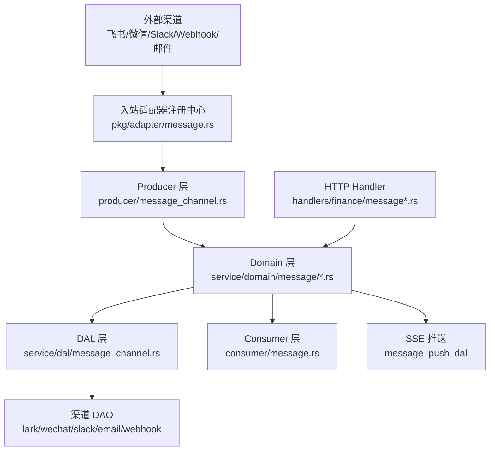
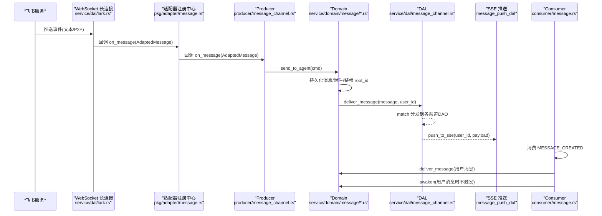
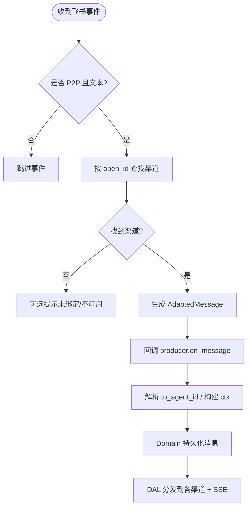
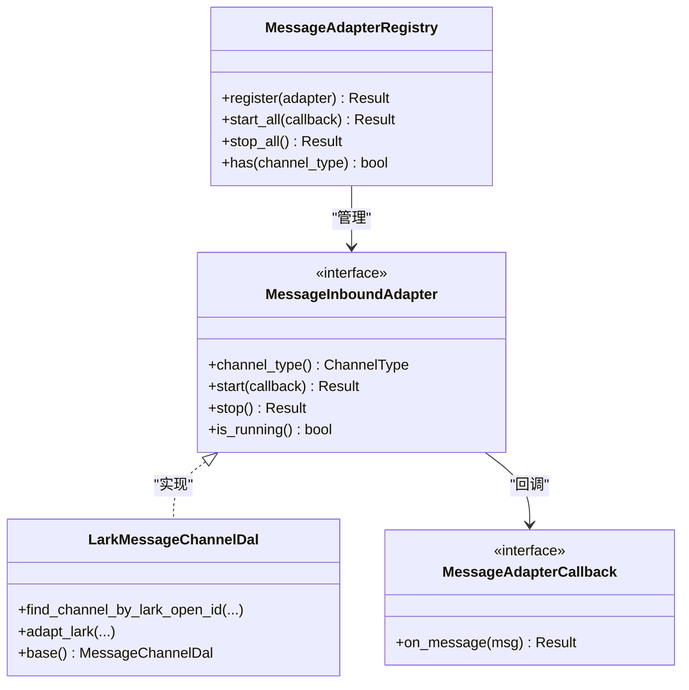
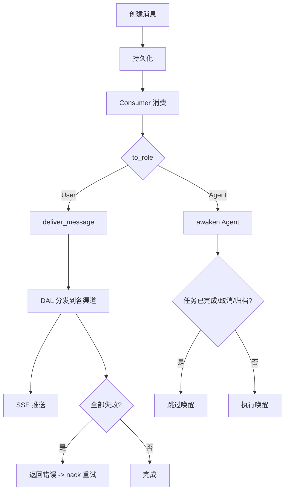
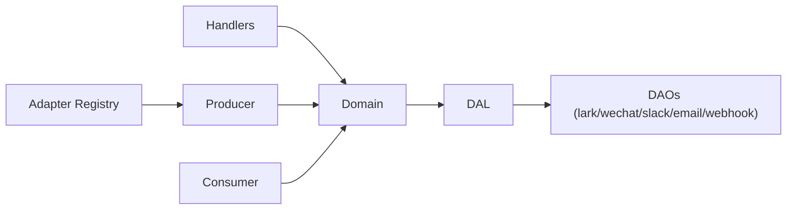

# 多渠道消息系统

<cite>
**本文引用的文件**
- [src/pkg/adapter/message.rs](file://src/pkg/adapter/message.rs)
- [src/producer/message_channel.rs](file://src/producer/message_channel.rs)
- [src/service/dal/lark.rs](file://src/service/dal/lark.rs)
- [src/service/dal/message_channel.rs](file://src/service/dal/message_channel.rs)
- [src/models/message_channel.rs](file://src/models/message_channel.rs)
- [src/service/domain/message/mod.rs](file://src/service/domain/message/mod.rs)
- [src/service/domain/message/delivery.rs](file://src/service/domain/message/delivery.rs)
- [src/consumer/message.rs](file://src/consumer/message.rs)
- [src/handlers/a2a/send_subscribe.rs](file://src/handlers/a2a/send_subscribe.rs)
- [src/handlers/finance/message/mod.rs](file://src/handlers/finance/message/mod.rs)
- [src/handlers/finance/message/send_message_to_agent.rs](file://src/handlers/finance/message/send_message_to_agent.rs)
- [src/handlers/finance/message_channel/response.rs](file://src/handlers/finance/message_channel/response.rs)
- [migrations/20260508000000_message_channels.sql](file://migrations/20260508000000_message_channels.sql)
</cite>

## 目录
1. [简介](#简介)
2. [项目结构](#项目结构)
3. [核心组件](#核心组件)
4. [架构总览](#架构总览)
5. [详细组件分析](#详细组件分析)
6. [依赖关系分析](#依赖关系分析)
7. [性能与可靠性](#性能与可靠性)
8. [故障排查指南](#故障排查指南)
9. [结论](#结论)
10. [附录：API 使用示例](#附录api-使用示例)

## 简介
本文件面向“多渠道消息系统”，系统性说明消息的发送、接收、路由、投递与生命周期管理，重点覆盖飞书 P2P 私信（WebSocket 长连接 + 出站推送）的完整实现路径。文档同时给出渠道适配器扩展方法（微信、Slack、Webhook、邮件等），并提供消息 API 的使用示例（发送消息、查询历史、订阅消息流）。最后给出监控、调试与故障排查建议。

## 项目结构
围绕消息系统的代码主要分布在以下层次：
- 基础设施层（pkg/adapter）：消息入站适配器注册中心，统一启停各渠道监听，将外部事件适配为内部统一格式并回调到 producer 层。
- Producer 层（producer/message_channel）：消费适配器回调，构造 RequestContext，调用 Domain 层发送消息给 Agent。
- DAL 层（service/dal）：渠道配置管理与消息分发；飞书 WebSocket 长连接、HTTP 推送等具体实现。
- Domain 层（service/domain/message）：消息领域能力（投递与管理），封装持久化、SSE 推送、渠道分发等编排逻辑。
- Consumer 层（consumer/message）：AOP 事件消费者，按 to_role 分发到 RuntimeDomain 或 MessageDomain。
- Handler 层（handlers/finance/message*）：对外 HTTP API（发送消息、查询、订阅 SSE 等）。
- 数据模型（models/message_channel）：MessageChannel 实体与 ChannelConfig 配置结构。

图表来源
- [src/pkg/adapter/message.rs:1-190](file://src/pkg/adapter/message.rs#L1-L190)
- [src/producer/message_channel.rs:1-115](file://src/producer/message_channel.rs#L1-L115)
- [src/service/domain/message/mod.rs:1-378](file://src/service/domain/message/mod.rs#L1-L378)
- [src/service/dal/message_channel.rs:1-407](file://src/service/dal/message_channel.rs#L1-L407)
- [src/consumer/message.rs:1-534](file://src/consumer/message.rs#L1-L534)
- [src/handlers/finance/message/mod.rs:1-17](file://src/handlers/finance/message/mod.rs#L1-L17)

章节来源
- [src/pkg/adapter/message.rs:1-190](file://src/pkg/adapter/message.rs#L1-L190)
- [src/producer/message_channel.rs:1-115](file://src/producer/message_channel.rs#L1-L115)
- [src/service/domain/message/mod.rs:1-378](file://src/service/domain/message/mod.rs#L1-L378)
- [src/service/dal/message_channel.rs:1-407](file://src/service/dal/message_channel.rs#L1-L407)
- [src/consumer/message.rs:1-534](file://src/consumer/message.rs#L1-L534)
- [src/handlers/finance/message/mod.rs:1-17](file://src/handlers/finance/message/mod.rs#L1-L17)

## 核心组件
- 消息入站适配器注册中心：提供统一的 start_all/stop_all，屏蔽多渠道差异，将外部事件转换为 AdaptedMessage 并通过回调投递。
- Producer 层：根据 from_role 构建 RequestContext，解析 to_agent_id（可显式或 resolve_agent 兜底），调用 Domain 发送消息。
- 消息领域 Domain：定义 send_to_agent/send_to_user/send_tool_call_request/send_tool_call_result/send_task_assignment/deliver_message/subscribe_sse 等能力，负责消息持久化、附件处理、SSE 推送、渠道分发。
- 渠道 DAL：统一管理渠道配置 CRUD 与消息分发，纯 match 分发到各渠道 DAO（飞书、微信、Slack、邮件、Webhook、A2A 回调）。
- 消费者 Consumer：订阅 MESSAGE_CREATED 事件，按 to_role 分发到 RuntimeDomain（Agent 唤醒）或 MessageDomain（用户消息投递），并处理 ToolCallRequest。
- 飞书接入：LarkMessageChannelDal 实现 MessageInboundAdapter，维护 WebSocket 长连接、心跳、事件解析与适配。

章节来源
- [src/pkg/adapter/message.rs:1-190](file://src/pkg/adapter/message.rs#L1-L190)
- [src/producer/message_channel.rs:1-115](file://src/producer/message_channel.rs#L1-L115)
- [src/service/domain/message/mod.rs:1-378](file://src/service/domain/message/mod.rs#L1-L378)
- [src/service/dal/message_channel.rs:1-407](file://src/service/dal/message_channel.rs#L1-L407)
- [src/consumer/message.rs:1-534](file://src/consumer/message.rs#L1-L534)
- [src/service/dal/lark.rs:1-336](file://src/service/dal/lark.rs#L1-L336)

## 架构总览
下图展示从外部渠道到 Agent 与用户的端到端流程，包括飞书 P2P 私信的 WebSocket 长连接、消息适配、路由、持久化、SSE 推送与渠道分发。

图表来源
- [src/service/dal/lark.rs:1-336](file://src/service/dal/lark.rs#L1-L336)
- [src/pkg/adapter/message.rs:1-190](file://src/pkg/adapter/message.rs#L1-L190)
- [src/producer/message_channel.rs:1-115](file://src/producer/message_channel.rs#L1-L115)
- [src/service/domain/message/delivery.rs:1-461](file://src/service/domain/message/delivery.rs#L1-L461)
- [src/service/dal/message_channel.rs:1-407](file://src/service/dal/message_channel.rs#L1-L407)
- [src/consumer/message.rs:1-534](file://src/consumer/message.rs#L1-L534)

## 详细组件分析

### 飞书 P2P 私信（WebSocket 长连接 + 出站推送）
- 入站：LarkMessageChannelDal 实现 MessageInboundAdapter，启动后通过飞书接口获取 WebSocket 地址并建立连接，定时发送 ping 维持心跳，接收事件后调用 adapt_lark 过滤非 P2P/非文本事件，按 sender open_id 查找绑定渠道，映射 from_id/user_id，生成 AdaptedMessage。
- 路由：adapt_lark 返回的 to_agent_id 可为 None，由 consumer 层根据渠道绑定 agent_id 或策略决定目标 Agent。
- 出站：Domain 层在 deliver_message 中按 scope_project 过滤用户活跃渠道，逐个调用对应 DAO 推送；同时将消息推送到 SSE 通道供前端/A2A 订阅。

图表来源
- [src/service/dal/lark.rs:135-225](file://src/service/dal/lark.rs#L135-L225)
- [src/pkg/adapter/message.rs:36-71](file://src/pkg/adapter/message.rs#L36-L71)
- [src/producer/message_channel.rs:25-90](file://src/producer/message_channel.rs#L25-L90)
- [src/service/domain/message/delivery.rs:381-436](file://src/service/domain/message/delivery.rs#L381-L436)

章节来源
- [src/service/dal/lark.rs:1-336](file://src/service/dal/lark.rs#L1-L336)
- [src/pkg/adapter/message.rs:1-190](file://src/pkg/adapter/message.rs#L1-L190)
- [src/producer/message_channel.rs:1-115](file://src/producer/message_channel.rs#L1-L115)
- [src/service/domain/message/delivery.rs:381-436](file://src/service/domain/message/delivery.rs#L381-L436)

### 消息渠道适配器架构与扩展新渠道
- 适配器接口：MessageInboundAdapter（channel_type/start/stop/is_running），回调接口 MessageAdapterCallback（on_message）。
- 注册中台：MessageAdapterRegistry 管理所有已注册适配器，start_all/stop_all 统一启停，重复注册冲突检测。
- 新增渠道步骤：
  1) DAL 层实现 MessageInboundAdapter trait；
  2) 在 init 时 registry().register(adapter)；
  3) 在 DAL 的消息分发 match 中添加新渠道分支（push_to_channel/test_connection）。
- 出站分发：MessageChannelDalImpl 通过纯 match 分发到 lark/wechat/slack/email/webhook/a2a_callback DAO，新增渠道只需添加字段与分支，编译期保证完整性。

图表来源
- [src/pkg/adapter/message.rs:36-190](file://src/pkg/adapter/message.rs#L36-L190)
- [src/service/dal/lark.rs:240-321](file://src/service/dal/lark.rs#L240-L321)
- [src/service/dal/message_channel.rs:299-313](file://src/service/dal/message_channel.rs#L299-L313)

章节来源
- [src/pkg/adapter/message.rs:1-190](file://src/pkg/adapter/message.rs#L1-L190)
- [src/service/dal/message_channel.rs:1-407](file://src/service/dal/message_channel.rs#L1-L407)
- [src/service/dal/lark.rs:1-336](file://src/service/dal/lark.rs#L1-L336)

### 消息生命周期管理、状态跟踪与重试机制
- 生命周期：
  - 创建：Domain 层持久化消息，支持附件消息与文本消息的 reply_to_id/root_id 链式关联。
  - 消费：Consumer 订阅 MESSAGE_CREATED，按 to_role 分发；User 消息走 deliver_message，Agent 消息唤醒 Agent。
  - 投递：deliver_message 先推送至各渠道，再推送 SSE；若全部失败则返回错误触发重试。
- 状态跟踪：
  - 渠道推送成功/失败记录 last_pushed_at/last_error；DeliveryResult 汇总 total/success/failed/details/sse_delivered。
  - 消息状态更新：Processed/Pending，nack 时回写 Pending 以重试。
- 重试机制：
  - Consumer 对 User 消息投递失败（success=0 且 sse_delivered=0）返回错误，触发 nack 重试。
  - Agent 唤醒采用 try_set_busy 原子占用，避免并发重复唤醒；任务完成/取消/归档时直接跳过唤醒。

图表来源
- [src/service/domain/message/delivery.rs:51-461](file://src/service/domain/message/delivery.rs#L51-L461)
- [src/consumer/message.rs:147-389](file://src/consumer/message.rs#L147-L389)
- [src/service/dal/message_channel.rs:226-335](file://src/service/dal/message_channel.rs#L226-L335)

章节来源
- [src/service/domain/message/delivery.rs:1-461](file://src/service/domain/message/delivery.rs#L1-L461)
- [src/consumer/message.rs:1-534](file://src/consumer/message.rs#L1-L534)
- [src/service/dal/message_channel.rs:1-407](file://src/service/dal/message_channel.rs#L1-L407)

### 消息与 Agent、项目、任务的关联关系
- 关联字段：
  - project_id/task_id：消息上下文，用于限定范围与检索。
  - from_id/to_id/from_role/to_role：发送者与接收者角色。
  - reply_to_id/root_id：消息链与对话根。
- 路由策略：
  - 默认对话框（无 project_id）：与前台 Agent 沟通，to_agent_id 未指定时 resolve_agent(ctx) 兜底。
  - Project 对话框（有 project_id）：优先使用 project.owner_agent_id；若为空则 resolve_agent(ctx)。
- 同步跨渠道：
  - deliver_message 按 scope_project 过滤用户活跃渠道，逐条推送；SSE 推送同一消息给在线订阅者。

章节来源
- [src/producer/message_channel.rs:25-90](file://src/producer/message_channel.rs#L25-L90)
- [src/service/domain/message/delivery.rs:51-461](file://src/service/domain/message/delivery.rs#L51-L461)
- [src/service/dal/message_channel.rs:226-335](file://src/service/dal/message_channel.rs#L226-L335)

### 不同渠道间同步消息
- 出站推送：DAL 层遍历用户活跃渠道，按 scope_project 过滤后逐一推送；每个渠道的成功/失败记录在 DeliveryResult.details 中。
- SSE 推送：deliver_message 将消息序列化为 SsePushPayload 推送给用户级广播通道，A2A 订阅复用该机制。

章节来源
- [src/service/domain/message/delivery.rs:381-436](file://src/service/domain/message/delivery.rs#L381-L436)
- [src/handlers/a2a/send_subscribe.rs:62-123](file://src/handlers/a2a/send_subscribe.rs#L62-L123)

## 依赖关系分析
- 分层单向依赖：Handler → Domain → DAL → DAO；Adapter/Producer 仅依赖 pkg 基础设施与 Domain。
- 关键耦合点：
  - AdapterRegistry 与 MessageInboundAdapter：解耦多渠道入站。
  - Domain 与 DAL：Domain 聚合 DAL 能力，DAL 纯 match 分发到 DAO。
  - Consumer 与 Domain：Consumer 只编排，业务逻辑在 Domain。

图表来源
- [src/pkg/adapter/message.rs:1-190](file://src/pkg/adapter/message.rs#L1-L190)
- [src/producer/message_channel.rs:1-115](file://src/producer/message_channel.rs#L1-L115)
- [src/service/domain/message/mod.rs:1-378](file://src/service/domain/message/mod.rs#L1-L378)
- [src/service/dal/message_channel.rs:1-407](file://src/service/dal/message_channel.rs#L1-L407)
- [src/consumer/message.rs:1-534](file://src/consumer/message.rs#L1-L534)

章节来源
- [src/pkg/adapter/message.rs:1-190](file://src/pkg/adapter/message.rs#L1-L190)
- [src/service/domain/message/mod.rs:1-378](file://src/service/domain/message/mod.rs#L1-L378)
- [src/service/dal/message_channel.rs:1-407](file://src/service/dal/message_channel.rs#L1-L407)
- [src/consumer/message.rs:1-534](file://src/consumer/message.rs#L1-L534)

## 性能与可靠性
- 性能要点：
  - 附件消息与文本消息分离存储，减少主消息体积；ToolCallResult 内联结果限制大小，超限替换为安全 marker。
  - 渠道分发顺序遍历，适合中小规模；未来可按用户维度并行优化。
  - SSE 推送基于广播通道，同用户多连接共享。
- 可靠性要点：
  - 全渠道失败触发重试；Agent 唤醒前检查任务状态与轮次限制，避免无效唤醒。
  - 渠道推送状态记录 last_pushed_at/last_error，便于监控与排障。
  - 工具调用结果携带 trace_ref，便于追踪与审计。

[本节为通用指导，无需特定文件引用]

## 故障排查指南
- 常见问题定位：
  - 飞书事件未进入系统：检查事件类型（需 P2P+文本）、open_id 绑定渠道、内容是否为空。
  - 消息未送达用户：查看 DeliveryResult.details 中各渠道 success/error；确认 scope_project 过滤是否符合预期。
  - 用户消息未重试：确认 Consumer 是否返回错误（success=0 且 sse_delivered=0）；检查消息状态是否被误标记为 Processed。
  - Agent 未唤醒：检查任务状态（Completed/Cancelled/Archived）、轮次限制、Busy 占用情况。
- 日志与指标：
  - 关注 lark_adapt、message_channel_producer、handle_agent_message、user message delivered 等日志。
  - 使用系统健康页面观察 AOP 队列深度、活跃 Agent/项目比例、待处理任务数。

章节来源
- [src/service/dal/lark.rs:135-225](file://src/service/dal/lark.rs#L135-L225)
- [src/service/dal/message_channel.rs:226-335](file://src/service/dal/message_channel.rs#L226-L335)
- [src/consumer/message.rs:359-389](file://src/consumer/message.rs#L359-L389)

## 结论
多渠道消息系统通过“适配器注册中心 + Producer + Domain + DAL”的分层设计，实现了高内聚、低耦合的消息收发与路由。飞书 P2P 私信借助 WebSocket 长连接与事件适配，无缝接入系统；出站推送兼顾多渠道路径与 SSE 实时推送。通过严格的生命周期管理与重试机制，系统在可靠性与可观测性方面具备良好基础。后续可按需扩展更多渠道并优化并发与性能。

[本节为总结，无需特定文件引用]

## 附录：API 使用示例
以下为常见消息 API 的使用思路与入口位置（不包含具体请求体示例）：
- 发送消息到 Agent：
  - 入口：POST /api/v1/messages/agents
  - 参考：send_message_to_agent handler
  - 路由优先级：显式 to_agent_id → project.owner_agent_id → resolve_agent(ctx)
- 发送消息（默认对话框/Project 对话框）：
  - 入口：POST /api/v1/messages
  - 参考：send_message handler
- 查询消息历史：
  - 入口：GET /api/v1/messages
  - 参考：list_messages handler
- 搜索消息（关键词/向量混合）：
  - 入口：POST /api/v1/messages/search
  - 参考：search_messages handler
- 订阅消息流（SSE）：
  - 入口：GET /api/v1/messages/subscribe-sse
  - 参考：subscribe_sse handler
- A2A 任务订阅（复用 SSE）：
  - 入口：POST /api/v1/tasks/sendSubscribe
  - 参考：send_subscribe handler

章节来源
- [src/handlers/finance/message/mod.rs:1-17](file://src/handlers/finance/message/mod.rs#L1-L17)
- [src/handlers/finance/message/send_message_to_agent.rs:1-35](file://src/handlers/finance/message/send_message_to_agent.rs#L1-L35)
- [src/handlers/a2a/send_subscribe.rs:1-193](file://src/handlers/a2a/send_subscribe.rs#L1-L193)