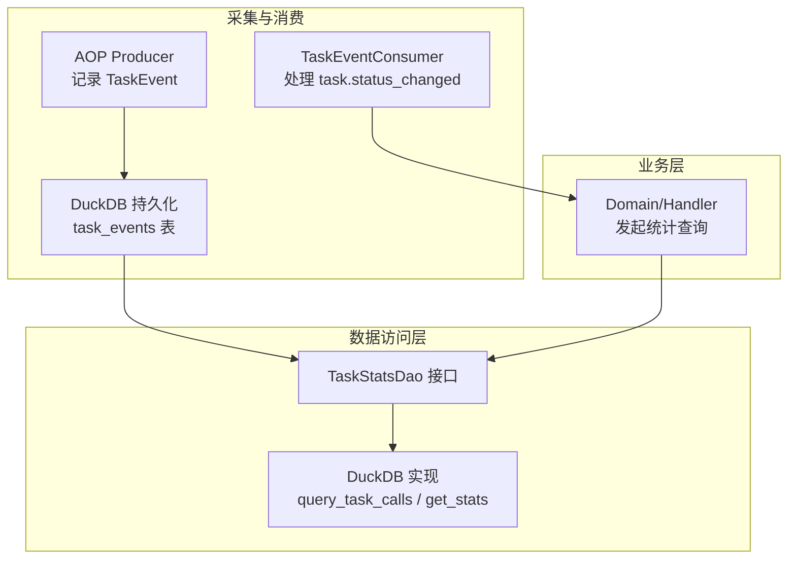
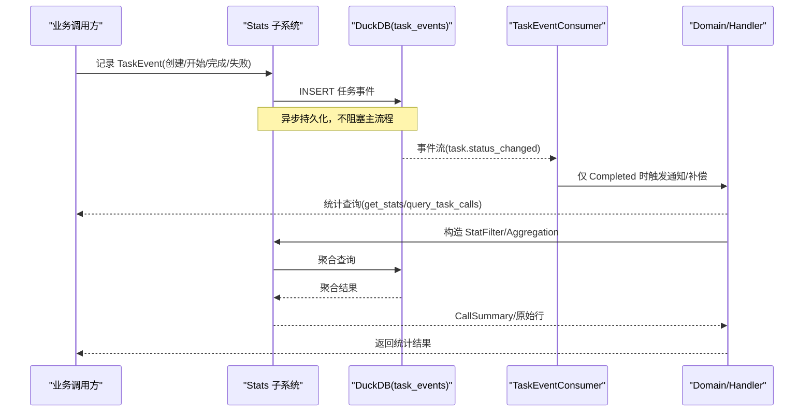
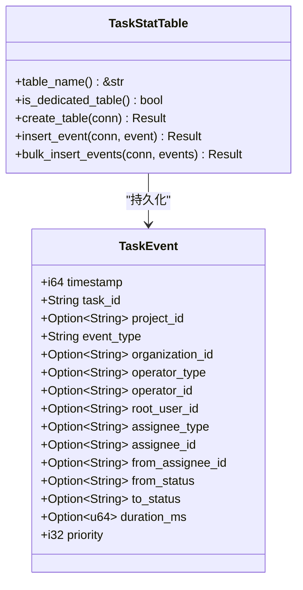
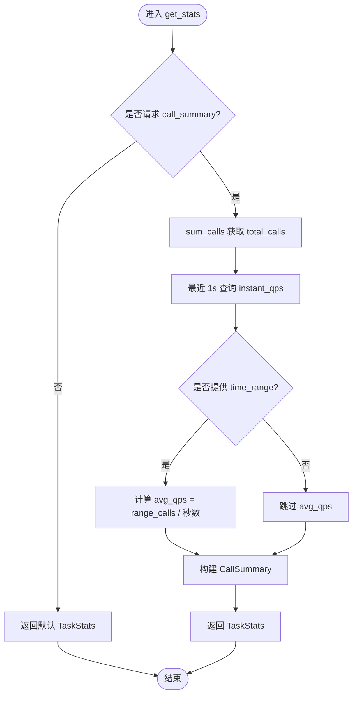
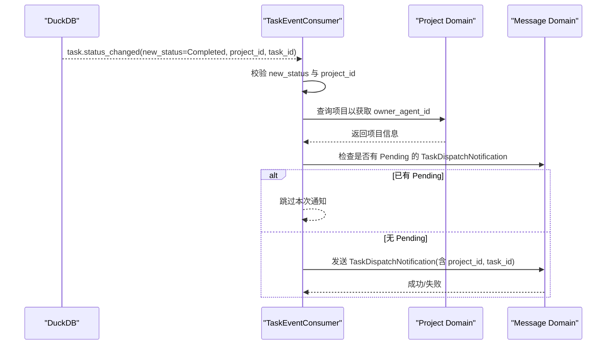
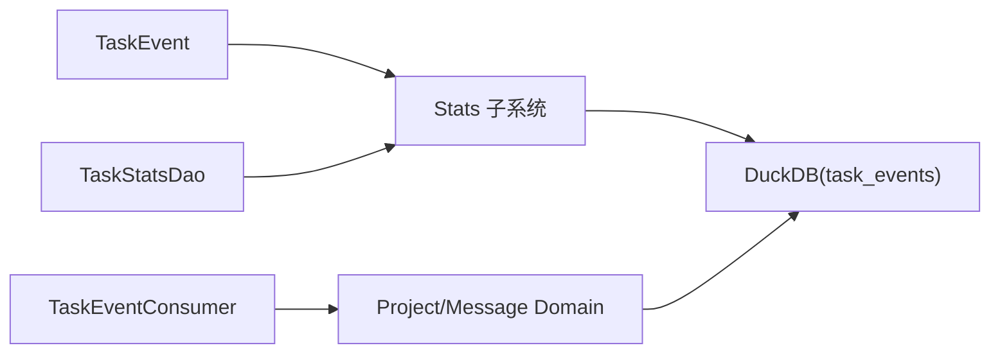

# Task 维度统计

<cite>
**本文引用的文件**
- [src/pkg/stats/task_event.rs](file://src/pkg/stats/task_event.rs)
- [src/consumer/task_event_consumer.rs](file://src/consumer/task_event_consumer.rs)
- [common/src/models/stats.rs](file://common/src/models/stats.rs)
- [src/service/dao/task/mod.rs](file://src/service/dao/task/mod.rs)
- [src/service/dao/task/stats_duckdb.rs](file://src/service/dao/task/stats_duckdb.rs)
- [common/src/enums/task.rs](file://common/src/enums/task.rs)
- [src/pkg/stats/mod.rs](file://src/pkg/stats/mod.rs)
</cite>

## 目录
1. [简介](#简介)
2. [项目结构](#项目结构)
3. [核心组件](#核心组件)
4. [架构总览](#架构总览)
5. [详细组件分析](#详细组件分析)
6. [依赖关系分析](#依赖关系分析)
7. [性能与存储策略](#性能与存储策略)
8. [查询接口与使用方式](#查询接口与使用方式)
9. [可视化展示建议](#可视化展示建议)
10. [故障排查指南](#故障排查指南)
11. [结论](#结论)

## 简介
本文件围绕“任务（Task）维度统计”提供完整说明，覆盖任务全生命周期的数据采集、关键指标计算、查询接口与可视化建议，以及长期归档策略。系统采用四层单向调用：Adapter → Domain → DAL → DAO；统计事件通过 AOP Producer/Consumer 异步落库，DAL/DAO 层负责聚合查询与结果封装。

## 项目结构
任务统计相关代码主要分布在以下位置：
- 统计事件定义与持久化表：src/pkg/stats/task_event.rs
- 统计模块入口与宏：src/pkg/stats/mod.rs
- 任务统计 DAO 接口与 DuckDB 实现：src/service/dao/task/mod.rs、src/service/dao/task/stats_duckdb.rs
- 通用统计模型：common/src/models/stats.rs
- 任务状态枚举：common/src/enums/task.rs
- 任务完成事件消费与通知：src/consumer/task_event_consumer.rs

图表来源
- [src/pkg/stats/task_event.rs:12-45](file://src/pkg/stats/task_event.rs#L12-L45)
- [src/pkg/stats/mod.rs:1-56](file://src/pkg/stats/mod.rs#L1-L56)
- [src/service/dao/task/mod.rs:141-229](file://src/service/dao/task/mod.rs#L141-L229)
- [src/service/dao/task/stats_duckdb.rs:24-67](file://src/service/dao/task/stats_duckdb.rs#L24-L67)
- [src/consumer/task_event_consumer.rs:38-137](file://src/consumer/task_event_consumer.rs#L38-L137)

章节来源
- [src/pkg/stats/task_event.rs:12-45](file://src/pkg/stats/task_event.rs#L12-L45)
- [src/pkg/stats/mod.rs:1-56](file://src/pkg/stats/mod.rs#L1-L56)
- [src/service/dao/task/mod.rs:141-229](file://src/service/dao/task/mod.rs#L141-L229)
- [src/service/dao/task/stats_duckdb.rs:24-67](file://src/service/dao/task/stats_duckdb.rs#L24-L67)
- [src/consumer/task_event_consumer.rs:38-137](file://src/consumer/task_event_consumer.rs#L38-L137)

## 核心组件
- TaskEvent：任务生命周期事件的数据模型，包含时间戳、任务标识、项目标识、事件类型、组织/操作者/分配者信息、状态流转、执行时长与优先级等字段，并映射到 DuckDB 的 task_events 表。
- TaskStatTable：任务事件的专用统计表，负责建表与单条/批量插入。
- TaskStatsQuery / TaskStatsDao：任务统计查询参数与 DAO 接口，提供按任务 ID 过滤、时间范围、聚合函数等查询能力，并内置 get_stats 汇总调用次数、瞬时 QPS、平均 QPS。
- TaskEventConsumer：异步消费者，订阅任务状态变更事件，仅对 Completed 状态进行后续处理（如向 Owner Agent 发送调度通知），用于驱动补偿机制。
- 通用统计模型：CallSummary、TimeSeriesPoint、TokenSumResult、StatsFetchOptions 等，统一在 common 层暴露给各层使用。

章节来源
- [src/pkg/stats/task_event.rs:12-45](file://src/pkg/stats/task_event.rs#L12-L45)
- [src/pkg/stats/task_event.rs:139-255](file://src/pkg/stats/task_event.rs#L139-L255)
- [src/service/dao/task/mod.rs:141-229](file://src/service/dao/task/mod.rs#L141-L229)
- [src/consumer/task_event_consumer.rs:38-137](file://src/consumer/task_event_consumer.rs#L38-L137)
- [common/src/models/stats.rs:8-72](file://common/src/models/stats.rs#L8-L72)
- [common/src/models/stats.rs:121-149](file://common/src/models/stats.rs#L121-L149)

## 架构总览
任务统计遵循“采集→持久化→查询→展示”的链路：
- 采集：通过 Stats 子系统记录 TaskEvent，写入 DuckDB 的 task_events 表。
- 消费：TaskEventConsumer 监听 task.status_changed，仅在 Completed 时触发后续流程。
- 查询：DAL/DAO 层基于 StatFilter 与 StatAggregation 构建查询，返回聚合结果或统计摘要。
- 展示：上层 Handler/Domain 将统计数据提供给前端或监控系统。

图表来源
- [src/pkg/stats/task_event.rs:151-214](file://src/pkg/stats/task_event.rs#L151-L214)
- [src/consumer/task_event_consumer.rs:52-137](file://src/consumer/task_event_consumer.rs#L52-L137)
- [src/service/dao/task/mod.rs:169-229](file://src/service/dao/task/mod.rs#L169-L229)
- [src/service/dao/task/stats_duckdb.rs:30-67](file://src/service/dao/task/stats_duckdb.rs#L30-L67)

## 详细组件分析

### TaskEvent 与 TaskStatTable
- 字段设计：
  - 标签字段（tag）：task_id、project_id、event_type、organization_id、operator_type、operator_id、root_user_id、assignee_type、assignee_id、from_assignee_id、from_status、to_status。
  - 度量字段（metric）：duration_ms、priority。
  - 时间戳：timestamp（毫秒级）。
- 表结构：task_events 为独立表，支持按任务 ID、事件类型、时间段、状态流转等维度筛选。
- 插入逻辑：单条与批量插入均生成 UUID v7 作为主键，错误路径统一包装为内部错误。

图表来源
- [src/pkg/stats/task_event.rs:12-45](file://src/pkg/stats/task_event.rs#L12-L45)
- [src/pkg/stats/task_event.rs:139-255](file://src/pkg/stats/task_event.rs#L139-L255)

章节来源
- [src/pkg/stats/task_event.rs:12-45](file://src/pkg/stats/task_event.rs#L12-L45)
- [src/pkg/stats/task_event.rs:139-255](file://src/pkg/stats/task_event.rs#L139-L255)

### 任务统计 DAO 与 DuckDB 实现
- 查询参数：TaskStatsQuery 包含 task_id（必填）、filters、time_range、aggregations。
- 核心方法：
  - query_task_calls：按 filters 与 aggregations 查询聚合结果。
  - sum_calls：计数聚合，返回总次数。
  - get_stats：组装 CallSummary（total_calls、avg_qps、instant_qps），支持 time_range 计算平均 QPS，最近 1 秒为瞬时 QPS。
- DuckDB 实现：通过 ctx.stats().query_aggregation 执行聚合，返回 JSON 行集合，再转换为结构化结果。

图表来源
- [src/service/dao/task/mod.rs:186-229](file://src/service/dao/task/mod.rs#L186-L229)
- [src/service/dao/task/stats_duckdb.rs:30-67](file://src/service/dao/task/stats_duckdb.rs#L30-L67)

章节来源
- [src/service/dao/task/mod.rs:141-229](file://src/service/dao/task/mod.rs#L141-L229)
- [src/service/dao/task/stats_duckdb.rs:24-67](file://src/service/dao/task/stats_duckdb.rs#L24-L67)

### 任务完成事件消费（TaskEventConsumer）
- 订阅事件：task.status_changed。
- 处理策略：仅当 new_status 为 Completed 且存在 project_id 时继续处理。
- 去重机制：检查是否存在 Pending 的 TaskDispatchNotification，避免重复通知。
- 通知内容：构建意图指令消息，填充 project_id 与 task_id 上下文，发送给 Owner Agent。

图表来源
- [src/consumer/task_event_consumer.rs:52-137](file://src/consumer/task_event_consumer.rs#L52-L137)

章节来源
- [src/consumer/task_event_consumer.rs:38-137](file://src/consumer/task_event_consumer.rs#L38-L137)

### 任务状态与生命周期
- 任务状态枚举：Cancelled、PendingReview、Pending、InProgress、Completed、Archived。
- 生命周期事件：创建、开始、完成、取消、状态流转等，通过 TaskEvent 的 event_type 与 from_status/to_status 描述。
- 执行时长：duration_ms 可用于计算单次任务执行耗时，结合事件序列可推导端到端时长。

章节来源
- [common/src/enums/task.rs:8-47](file://common/src/enums/task.rs#L8-L47)
- [src/pkg/stats/task_event.rs:12-45](file://src/pkg/stats/task_event.rs#L12-L45)

## 依赖关系分析
- 统计事件依赖：TaskEvent 依赖 ai_orz_macros::StatsEvent 派生，自动注册到 Stats 子系统。
- 查询依赖：TaskStatsDao 依赖 RequestContext.stats() 提供的聚合查询能力。
- 消费者依赖：TaskEventConsumer 依赖 Domain 的项目与消息服务，用于完成后的通知。
- 外部依赖：DuckDB 用于持久化与复杂查询；SQLite 用于业务数据（任务本身），但统计走 DuckDB。

图表来源
- [src/pkg/stats/task_event.rs:12-45](file://src/pkg/stats/task_event.rs#L12-L45)
- [src/pkg/stats/mod.rs:1-56](file://src/pkg/stats/mod.rs#L1-L56)
- [src/service/dao/task/mod.rs:169-229](file://src/service/dao/task/mod.rs#L169-L229)
- [src/consumer/task_event_consumer.rs:52-137](file://src/consumer/task_event_consumer.rs#L52-L137)

章节来源
- [src/pkg/stats/task_event.rs:12-45](file://src/pkg/stats/task_event.rs#L12-L45)
- [src/pkg/stats/mod.rs:1-56](file://src/pkg/stats/mod.rs#L1-L56)
- [src/service/dao/task/mod.rs:169-229](file://src/service/dao/task/mod.rs#L169-L229)
- [src/consumer/task_event_consumer.rs:52-137](file://src/consumer/task_event_consumer.rs#L52-L137)

## 性能与存储策略
- 采集性能：
  - 使用 Stats 子系统异步记录事件，避免阻塞主流程。
  - 支持批量插入，降低数据库写入开销。
- 查询性能：
  - 通过 StatFilter 与 StatAggregation 精确过滤与聚合，减少不必要的数据扫描。
  - 瞬时 QPS 基于最近 1 秒窗口，快速反映当前负载。
- 存储策略：
  - task_events 为独立表，便于按任务维度隔离与归档。
  - 建议定期归档历史数据至冷存储（如对象存储或归档库），保留热数据窗口（例如最近 30 天）。
  - 压缩策略：对历史分区表启用列式压缩（如 ZSTD/LZ4），降低存储空间与 I/O。
- 资源消耗：
  - 关注 duration_ms 与 priority 字段，用于识别高耗时与高优先级任务的资源占用。
  - 结合工具调用统计（tool_call_events）与模型调用统计（model_call_events）进行综合瓶颈分析。

[本节为通用指导，无需特定文件引用]

## 查询接口与使用方式
- 查询参数：
  - task_id：必填，限定任务维度。
  - filters：额外过滤条件（如 event_type、status 等）。
  - time_range：可选，时间范围（毫秒）。
  - aggregations：聚合函数（如 Count、Sum、Avg 等）。
- 常用方法：
  - query_task_calls：返回聚合行集合，适合自定义分析。
  - sum_calls：返回总次数，适合简单计数场景。
  - get_stats：返回 TaskStats，包含 CallSummary（total_calls、avg_qps、instant_qps）。
- 示例用法（概念性）：
  - 获取某任务在过去 1 小时的总调用次数与瞬时 QPS。
  - 按事件类型分组统计任务创建、开始、完成、失败的次数。
  - 结合时间段计算平均 QPS，评估任务吞吐能力。

章节来源
- [src/service/dao/task/mod.rs:141-229](file://src/service/dao/task/mod.rs#L141-L229)
- [src/service/dao/task/stats_duckdb.rs:30-67](file://src/service/dao/task/stats_duckdb.rs#L30-L67)
- [common/src/models/stats.rs:8-72](file://common/src/models/stats.rs#L8-L72)

## 可视化展示建议
- 任务执行趋势图：
  - 横轴为时间（小时/天），纵轴为任务调用次数或成功率。
  - 数据来源：task_events 按时间分桶聚合。
- 成功率统计：
  - 按事件类型（完成/失败/取消）统计比例，展示健康度。
- 性能瓶颈分析：
  - 结合 duration_ms 分布（P50/P90/P99）识别慢任务。
  - 关联工具调用与模型调用统计，定位热点环节。
- 资源消耗视图：
  - 按优先级与执行时长筛选高资源消耗任务，辅助容量规划。

[本节为概念性建议，无需特定文件引用]

## 故障排查指南
- 事件未入库：
  - 检查 Stats 子系统初始化与全局单例设置。
  - 确认 task_events 表已创建且权限正确。
- 查询结果为空：
  - 核对 task_id 与 filters 是否正确。
  - 确认 time_range 是否覆盖目标时间段。
- 消费者未触发通知：
  - 检查事件是否为 Completed 且包含 project_id。
  - 确认是否存在 Pending 的 TaskDispatchNotification 导致去重跳过。
- 性能问题：
  - 优化 filters 与 aggregations，减少不必要扫描。
  - 考虑对历史数据进行归档与压缩。

章节来源
- [src/pkg/stats/task_event.rs:151-214](file://src/pkg/stats/task_event.rs#L151-L214)
- [src/consumer/task_event_consumer.rs:60-103](file://src/consumer/task_event_consumer.rs#L60-L103)
- [src/service/dao/task/stats_duckdb.rs:30-67](file://src/service/dao/task/stats_duckdb.rs#L30-L67)

## 结论
任务维度统计通过 TaskEvent 与 DuckDB 实现了高扩展性与高性能的事件采集与查询。结合 TaskStatsDao 的聚合能力，可灵活支持多种统计需求。配合 TaskEventConsumer 的异步处理，系统在保障主流程性能的同时，完成了任务完成后的补偿与通知。建议在生产环境中实施数据归档与压缩策略，并结合可视化手段持续监控任务健康与性能瓶颈。

[本节为总结性内容，无需特定文件引用]