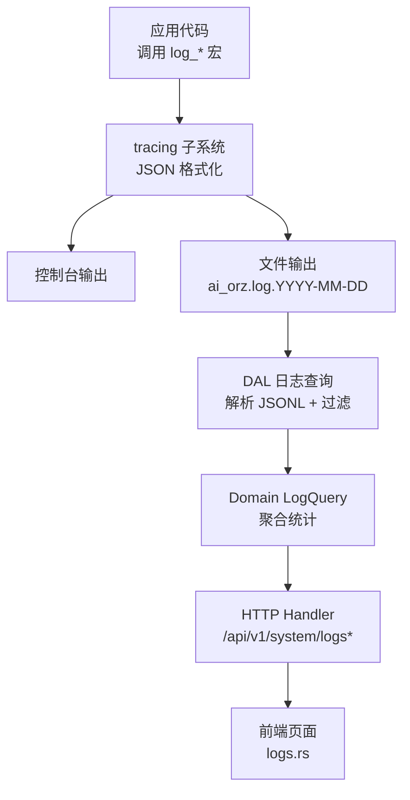
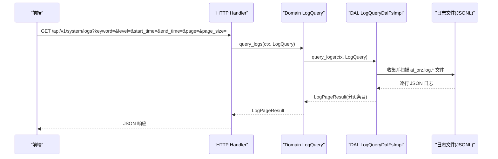
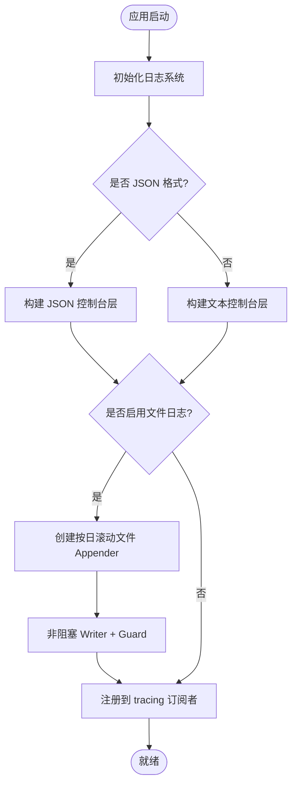
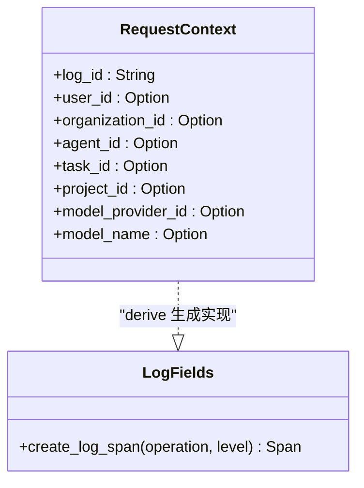
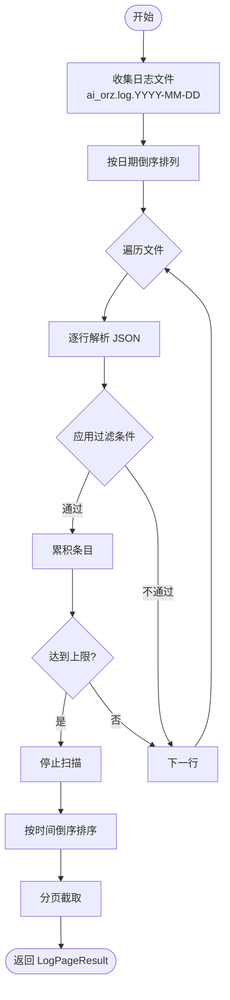
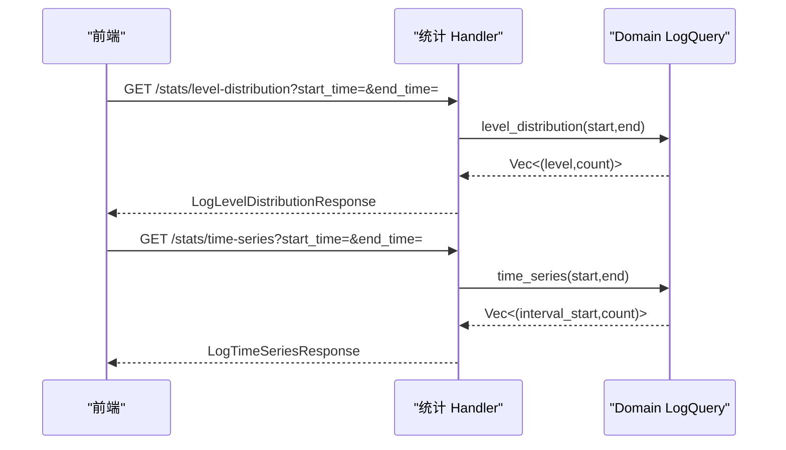
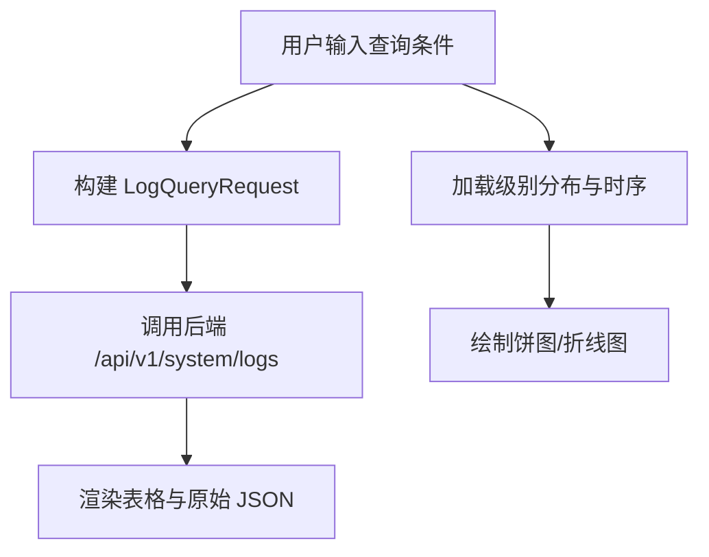
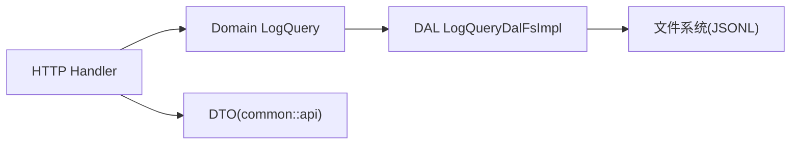

# 日志管理系统

<cite>
**本文引用的文件**
- [src/pkg/logging.rs](file://src/pkg/logging.rs)
- [docs/logging_design.md](file://docs/logging_design.md)
- [ai-orz-macros/src/log_fields.rs](file://ai-orz-macros/src/log_fields.rs)
- [src/service/dal/log_query.rs](file://src/service/dal/log_query.rs)
- [common/src/api/log_stats.rs](file://common/src/api/log_stats.rs)
- [src/handlers/system/logs/query_logs.rs](file://src/handlers/system/logs/query_logs.rs)
- [src/handlers/system/logs/log_stats.rs](file://src/handlers/system/logs/log_stats.rs)
- [src/service/domain/system/mod.rs](file://src/service/domain/system/mod.rs)
- [frontend/src/pages/system/logs.rs](file://frontend/src/pages/system/logs.rs)
</cite>

## 目录
1. [简介](#简介)
2. [项目结构](#项目结构)
3. [核心组件](#核心组件)
4. [架构总览](#架构总览)
5. [详细组件分析](#详细组件分析)
6. [依赖关系分析](#依赖关系分析)
7. [性能考量](#性能考量)
8. [故障排查指南](#故障排查指南)
9. [结论](#结论)
10. [附录](#附录)

## 简介
本文件系统性地梳理并文档化项目的日志管理能力，覆盖日志采集、结构化格式、级别定义、查询与统计、存储策略、导出能力以及最佳实践。系统基于 tracing 实现统一日志宏，输出 JSON 结构化日志并按日滚动到文件；提供按关键词、log_id、级别、时间范围过滤的日志查询 API，以及级别分布与时序统计接口；前端提供可视化查询与图表展示。

## 项目结构
日志相关代码分布在以下层次：
- 采集与输出层：src/pkg/logging.rs（tracing 初始化、JSON 输出、按日滚动、保留清理）
- 宏与字段注入：ai-orz-macros/src/log_fields.rs（自动将 RequestContext 字段注入 span）
- 规范与设计：docs/logging_design.md（日志宏使用规范、上下文注入、迁移指南）
- 查询与存储：src/service/dal/log_query.rs（读取 JSONL 日志文件、过滤、分页）
- 领域与接口：src/service/domain/system/mod.rs（LogQuery 领域方法，聚合统计）
- HTTP 接口：src/handlers/system/logs/query_logs.rs、src/handlers/system/logs/log_stats.rs（查询与统计）
- 公共 DTO：common/src/api/log_stats.rs（请求/响应结构）
- 前端页面：frontend/src/pages/system/logs.rs（查询表单、分页、饼图/折线图）

**图示来源**
- [src/pkg/logging.rs:29-123](file://src/pkg/logging.rs#L29-L123)
- [src/service/dal/log_query.rs:120-210](file://src/service/dal/log_query.rs#L120-L210)
- [src/service/domain/system/mod.rs:281-309](file://src/service/domain/system/mod.rs#L281-L309)
- [src/handlers/system/logs/query_logs.rs:13-28](file://src/handlers/system/logs/query_logs.rs#L13-L28)
- [src/handlers/system/logs/log_stats.rs:25-76](file://src/handlers/system/logs/log_stats.rs#L25-L76)
- [frontend/src/pages/system/logs.rs:67-153](file://frontend/src/pages/system/logs.rs#L67-L153)

**章节来源**
- [src/pkg/logging.rs:29-123](file://src/pkg/logging.rs#L29-L123)
- [src/service/dal/log_query.rs:120-210](file://src/service/dal/log_query.rs#L120-L210)
- [src/handlers/system/logs/query_logs.rs:13-28](file://src/handlers/system/logs/query_logs.rs#L13-L28)
- [src/handlers/system/logs/log_stats.rs:25-76](file://src/handlers/system/logs/log_stats.rs#L25-L76)
- [frontend/src/pages/system/logs.rs:67-153](file://frontend/src/pages/system/logs.rs#L67-L153)

## 核心组件
- 日志采集与输出
  - 支持控制台与文件双通道输出，文件按日滚动生成 ai_orz.log.YYYY-MM-DD，支持 JSON 或文本格式。
  - 支持环境变量控制日志级别过滤，默认 info。
  - 支持保留天数清理旧日志文件。
- 结构化日志与上下文
  - 通过 #[derive(LogFields)] 自动将 RequestContext 的业务字段注入 tracing span，形成统一的上下文字段（如 log_id、user_id、operation 等）。
  - 日志宏支持无上下文与带上下文两种模式，自动检测参数形式。
- 日志查询与存储
  - DAL 直接扫描日志目录下的 JSONL 文件，解析每条日志为结构化对象，支持 keyword、log_id、level、start_time/end_time 过滤，返回分页结果。
  - 限制单次扫描条目数与最近可扫描天数，防止内存与 IO 压力过大。
- 日志统计分析
  - 领域层复用查询逻辑在内存中做级别分布聚合；时序统计由 Domain 提供 time_series 接口（Handler 组装响应）。
- HTTP 接口
  - GET /api/v1/system/logs：日志列表查询（分页）。
  - GET /api/v1/system/logs/stats/level-distribution：级别分布。
  - GET /api/v1/system/logs/stats/time-series：时序数据点。
- 前端可视化
  - 提供查询表单（关键词、log_id、级别、时间范围）、分页表格、原始 JSON 展开查看。
  - 展示级别分布饼图与时序折线图。

**章节来源**
- [docs/logging_design.md:44-127](file://docs/logging_design.md#L44-L127)
- [ai-orz-macros/src/log_fields.rs:50-125](file://ai-orz-macros/src/log_fields.rs#L50-L125)
- [src/service/dal/log_query.rs:34-82](file://src/service/dal/log_query.rs#L34-L82)
- [src/handlers/system/logs/log_stats.rs:25-76](file://src/handlers/system/logs/log_stats.rs#L25-L76)
- [frontend/src/pages/system/logs.rs:23-45](file://frontend/src/pages/system/logs.rs#L23-L45)

## 架构总览
日志系统遵循单向四层调用：Adapter（HTTP Handler）→ Domain → DAL → DAO/存储（此处为文件系统）。日志采集通过 tracing 写入文件，查询链路从 Handler 进入 Domain 再落到 DAL 读取 JSONL 文件。

**图示来源**
- [src/handlers/system/logs/query_logs.rs:13-28](file://src/handlers/system/logs/query_logs.rs#L13-L28)
- [src/service/domain/system/mod.rs:281-284](file://src/service/domain/system/mod.rs#L281-L284)
- [src/service/dal/log_query.rs:120-210](file://src/service/dal/log_query.rs#L120-L210)

## 详细组件分析

### 日志采集与输出（src/pkg/logging.rs）
- 功能要点
  - 根据配置选择 JSON 或文本格式输出。
  - 启用文件日志时，按日滚动创建 ai_orz.log.YYYY-MM-DD，非阻塞写入。
  - 启动时清理超过保留天数的旧日志文件。
  - 全局持有 WorkerGuard，确保进程退出前 flush 所有日志。
- 关键流程
  - 初始化 filter_layer（EnvFilter），构建 console/file layer，注册到 tracing registry。
  - 若启用文件日志，创建 rolling daily appender 与非阻塞 writer。
- 复杂度与性能
  - 文件 I/O 通过非阻塞 writer 降低主线程阻塞。
  - 每日滚动避免单文件过大，便于后续查询与归档。

**图示来源**
- [src/pkg/logging.rs:29-123](file://src/pkg/logging.rs#L29-L123)

**章节来源**
- [src/pkg/logging.rs:29-123](file://src/pkg/logging.rs#L29-L123)

### 结构化日志与上下文注入（ai-orz-macros/src/log_fields.rs）
- 设计要点
  - 通过 #[derive(LogFields)] 扫描标注了 #[log_field] 的字段，自动生成 create_log_span 实现。
  - 针对不同字段类型采用合适的格式化方式（Display/Debug），保证 span 字段稳定输出。
- 影响
  - 所有带上下文的日志都会包含 log_id、user_id、operation 等关键追踪字段，便于跨服务/模块关联。

**图示来源**
- [ai-orz-macros/src/log_fields.rs:50-125](file://ai-orz-macros/src/log_fields.rs#L50-L125)

**章节来源**
- [ai-orz-macros/src/log_fields.rs:50-125](file://ai-orz-macros/src/log_fields.rs#L50-L125)
- [docs/logging_design.md:106-127](file://docs/logging_design.md#L106-L127)

### 日志查询与存储（src/service/dal/log_query.rs）
- 数据结构
  - LogEntry：包含 timestamp、level、message、log_id、user_id、operation、raw。
  - LogQuery：keyword、log_id、level、start_time、end_time、page、page_size。
  - LogPageResult：total、entries、page、page_size。
- 查询算法
  - 收集日志文件：仅匹配 ai_orz.log.YYYY-MM-DD，且不超过 MAX_SCAN_DAYS。
  - 逐行解析 JSON，应用过滤条件（级别、log_id 精确匹配、keyword 不区分大小写包含、时间范围）。
  - 排序后分页返回，限制最大扫描条目数 MAX_SCAN_ENTRIES。
- 时间处理
  - 解析 RFC3339 时间戳为 unix 毫秒用于范围过滤。

**图示来源**
- [src/service/dal/log_query.rs:120-210](file://src/service/dal/log_query.rs#L120-L210)
- [src/service/dal/log_query.rs:260-361](file://src/service/dal/log_query.rs#L260-L361)

**章节来源**
- [src/service/dal/log_query.rs:34-82](file://src/service/dal/log_query.rs#L34-L82)
- [src/service/dal/log_query.rs:120-210](file://src/service/dal/log_query.rs#L120-L210)
- [src/service/dal/log_query.rs:260-361](file://src/service/dal/log_query.rs#L260-L361)

### 日志统计分析（Domain + Handler）
- 级别分布
  - Domain 复用 query_logs 拉取时间范围内日志（上限 10000 条），在 Rust 侧按 level 聚合计数。
  - Handler 将 Vec<(String,u64)> 转换为 LogLevelDistributionResponse。
- 时序统计
  - Handler 调用 Domain time_series 接口获取按小时桶的数据点，封装为 LogTimeSeriesResponse。
- 默认时间窗口
  - 未指定 start_time/end_time 时，默认最近 24 小时。

**图示来源**
- [src/handlers/system/logs/log_stats.rs:25-76](file://src/handlers/system/logs/log_stats.rs#L25-L76)
- [src/service/domain/system/mod.rs:286-309](file://src/service/domain/system/mod.rs#L286-L309)

**章节来源**
- [src/handlers/system/logs/log_stats.rs:25-76](file://src/handlers/system/logs/log_stats.rs#L25-L76)
- [src/service/domain/system/mod.rs:286-309](file://src/service/domain/system/mod.rs#L286-L309)

### 前端日志查询与可视化（frontend/src/pages/system/logs.rs）
- 查询表单
  - 支持 keyword、log_id、level、start_time/end_time（本地时间转 UTC 毫秒）。
  - 默认每页 20 条，首次进入自动加载第一页。
- 可视化
  - 级别分布饼图：颜色映射 ERROR/WARN/INFO/DEBUG/TRACE。
  - 时序折线图：展示最近 24 小时各时段日志数量。
- 交互
  - 点击 log_id 可快速按该 ID 重新查询，便于调用链追踪。

**图示来源**
- [frontend/src/pages/system/logs.rs:67-153](file://frontend/src/pages/system/logs.rs#L67-L153)
- [frontend/src/pages/system/logs.rs:23-45](file://frontend/src/pages/system/logs.rs#L23-L45)

**章节来源**
- [frontend/src/pages/system/logs.rs:67-153](file://frontend/src/pages/system/logs.rs#L67-L153)

## 依赖关系分析
- 层级依赖
  - Handler 依赖 Domain（system::domain().log_query()）。
  - Domain 依赖 DAL（log_query_dal.query_logs）。
  - DAL 依赖文件系统（日志目录与 JSONL 文件）。
- 外部依赖
  - tracing/tracing-subscriber/tracing-appender：日志采集与输出。
  - serde_json：解析 JSONL 日志。
  - chrono：时间解析与比较。
- 耦合与内聚
  - 日志采集与查询解耦：采集只负责写入，查询只负责读取，职责清晰。
  - 统计聚合在 Domain 层完成，避免重复计算。

**图示来源**
- [src/handlers/system/logs/query_logs.rs:13-28](file://src/handlers/system/logs/query_logs.rs#L13-L28)
- [src/service/domain/system/mod.rs:281-284](file://src/service/domain/system/mod.rs#L281-L284)
- [src/service/dal/log_query.rs:120-210](file://src/service/dal/log_query.rs#L120-L210)
- [common/src/api/log_stats.rs:52-76](file://common/src/api/log_stats.rs#L52-L76)

**章节来源**
- [src/handlers/system/logs/query_logs.rs:13-28](file://src/handlers/system/logs/query_logs.rs#L13-L28)
- [src/service/dal/log_query.rs:120-210](file://src/service/dal/log_query.rs#L120-L210)
- [common/src/api/log_stats.rs:52-76](file://common/src/api/log_stats.rs#L52-L76)

## 性能考量
- 扫描限制
  - MAX_SCAN_ENTRIES 限制单次查询最多收集条目数，防止内存溢出。
  - MAX_SCAN_DAYS 限制仅扫描最近 N 天的日志文件，减少 IO 开销。
- 过滤顺序
  - 先进行轻量级过滤（级别、log_id 精确匹配），再进行关键字与时间范围检查，提升命中率。
- 时间解析
  - 仅在启用时间范围过滤时解析 timestamp，避免不必要的解析成本。
- 文件 I/O
  - 非阻塞 writer 与按日滚动降低写入对主流程的影响。
  - 建议配合操作系统层面的磁盘缓存与 SSD 以提升吞吐。

[本节为通用性能指导，无需特定文件引用]

## 故障排查指南
- 无法查询到日志
  - 确认日志目录存在且启用了文件日志；检查 ai_orz.log.* 命名是否符合预期。
  - 检查环境变量日志级别过滤是否过严（如设置为 error 会屏蔽 INFO/DEBUG）。
  - 确认时间范围是否正确（UTC 毫秒），前端会将本地时间转为 UTC。
- 查询缓慢
  - 缩小时间范围，避免跨越多天大文件扫描。
  - 优先使用 log_id 精确匹配定位调用链，减少全量扫描。
  - 合理设置 page_size，避免一次性拉取过多数据。
- 统计不准确
  - 级别分布基于内存聚合，注意 MAX_SCAN_ENTRIES 上限可能截断数据。
  - 时序统计需确保时间窗口合理，避免空桶导致曲线失真。
- 日志丢失
  - 检查进程是否正常退出以触发 flush；确认 WorkerGuard 未被提前 drop。
  - 检查磁盘空间与权限，确保日志目录可写。

**章节来源**
- [src/pkg/logging.rs:126-158](file://src/pkg/logging.rs#L126-L158)
- [src/service/dal/log_query.rs:112-118](file://src/service/dal/log_query.rs#L112-L118)
- [src/service/dal/log_query.rs:330-361](file://src/service/dal/log_query.rs#L330-L361)

## 结论
本项目实现了完整的日志采集、结构化输出、查询与统计能力。通过 tracing 与 JSONL 文件结合，既满足开发调试的可读性，也便于机器分析与可视化。查询层通过严格的扫描限制与过滤策略保障性能，统计层在 Domain 层完成聚合，前后端协同提供直观的监控体验。未来可在索引优化（如建立日志字段索引）与长期归档（压缩与冷存储）方面进一步增强。

[本节为总结性内容，无需特定文件引用]

## 附录

### 日志级别定义与使用
- 级别：DEBUG、INFO、WARN、ERROR、TRACE。
- 推荐：业务代码使用 log_info!/log_warn!/log_error!/log_debug!；系统级场景可使用 sys_* 别名。
- 上下文：带上下文模式必须传入 &ctx 引用，操作名必须是字符串字面量。

**章节来源**
- [docs/logging_design.md:44-127](file://docs/logging_design.md#L44-L127)

### 查询语法与最佳实践
- 高效查询
  - 优先使用 log_id 精确匹配定位调用链。
  - 结合 keyword 与 level 缩小范围。
  - 明确 start_time/end_time，避免全量扫描。
- 索引优化
  - 当前基于文件扫描，建议在高频查询字段（如 log_id、level）上建立外部索引或引入专用日志存储后端。
- 性能调优
  - 控制 page_size，避免前端渲染压力。
  - 合理设置 retention_days，定期清理旧日志。

**章节来源**
- [src/service/dal/log_query.rs:112-118](file://src/service/dal/log_query.rs#L112-L118)
- [src/service/dal/log_query.rs:147-194](file://src/service/dal/log_query.rs#L147-L194)

### 实际分析场景与故障排查
- 场景一：某接口错误率突增
  - 使用 /stats/level-distribution 观察 ERROR/WARN 占比变化。
  - 通过 /stats/time-series 定位异常时间段。
  - 使用 keyword 搜索错误关键字，结合 log_id 追踪具体请求。
- 场景二：性能指标分析
  - 在业务日志中记录耗时字段（如 duration_ms），通过 keyword 筛选慢请求。
  - 结合 time-series 观察高峰时段与资源瓶颈。
- 场景三：调用链追踪
  - 从错误日志中提取 log_id，点击前端 log_id 快速重查同一调用链。
  - 在多模块间保持 operation 命名一致，便于关联。

**章节来源**
- [frontend/src/pages/system/logs.rs:426-441](file://frontend/src/pages/system/logs.rs#L426-L441)
- [src/handlers/system/logs/log_stats.rs:25-76](file://src/handlers/system/logs/log_stats.rs#L25-L76)