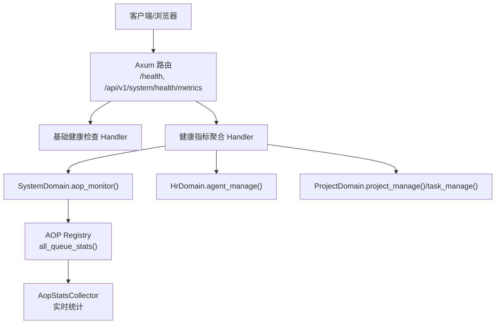
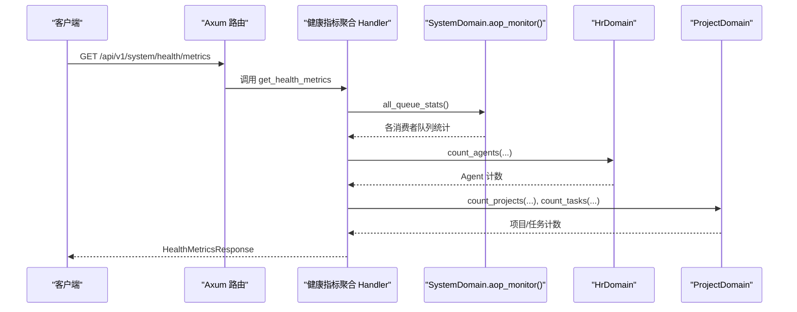
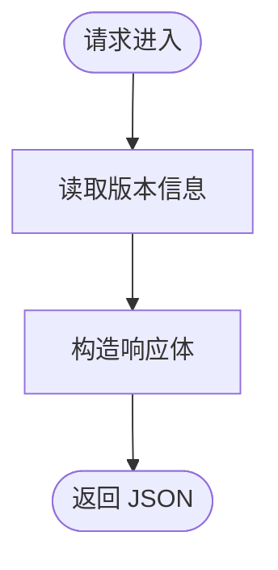
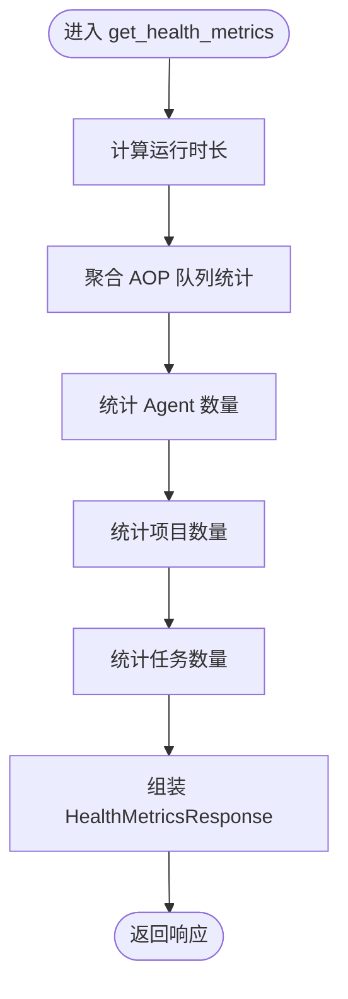
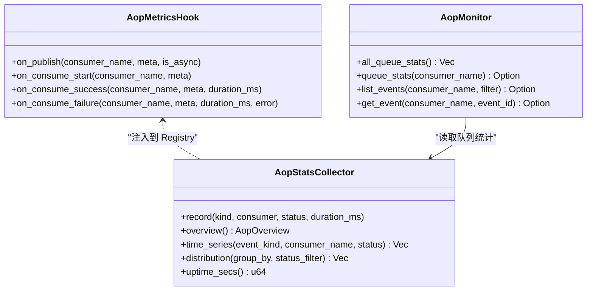
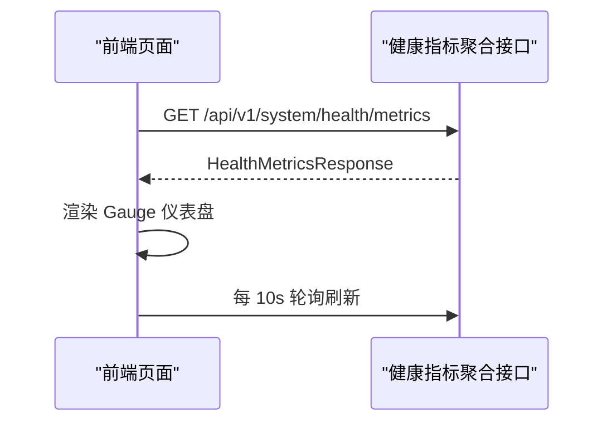
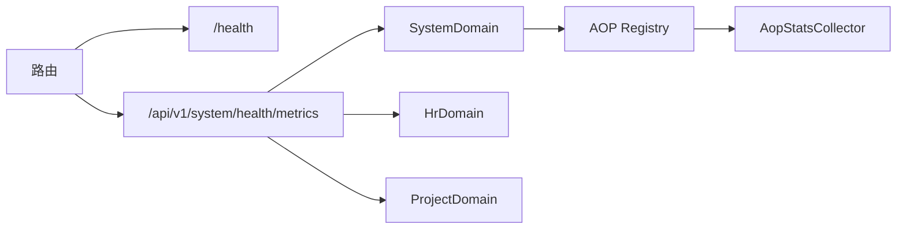

# 系统健康检查

<cite>
**本文引用的文件**
- [src/handlers/health.rs](file://src/handlers/health.rs)
- [src/handlers/system/health_metrics.rs](file://src/handlers/system/health_metrics.rs)
- [common/src/api/system.rs](file://common/src/api/system.rs)
- [src/router.rs](file://src/router.rs)
- [src/service/domain/system/aop_monitor.rs](file://src/service/domain/system/aop_monitor.rs)
- [src/pkg/aop/core/metrics_hook.rs](file://src/pkg/aop/core/metrics_hook.rs)
- [src/consumer/aop_stats_collector.rs](file://src/consumer/aop_stats_collector.rs)
- [frontend/src/pages/system/health.rs](file://frontend/src/pages/system/health.rs)
- [common/config/ai_orz.toml](file://common/config/ai_orz.toml)
- [common/src/config.rs](file://common/src/config.rs)
- [src/config.rs](file://src/config.rs)
</cite>

## 目录
1. [简介](#简介)
2. [项目结构](#项目结构)
3. [核心组件](#核心组件)
4. [架构总览](#架构总览)
5. [详细组件分析](#详细组件分析)
6. [依赖关系分析](#依赖关系分析)
7. [性能考量](#性能考量)
8. [故障诊断指南](#故障诊断指南)
9. [结论](#结论)
10. [附录](#附录)

## 简介
本章节面向“系统健康检查”能力，覆盖服务可用性检测、依赖服务状态监控、资源使用情况检查；并说明性能指标收集（CPU、内存、磁盘、网络 I/O、数据库连接池等）的落地方式与扩展点。文档同时给出健康检查端点设计（/health 基础健康检查、/api/v1/system/health/metrics 聚合指标）、告警机制建议、监控系统集成方案（Prometheus/Grafana/日志聚合），以及配置选项与最佳实践、故障诊断与性能优化指南。

## 项目结构
健康检查相关代码主要分布在以下位置：
- HTTP 路由注册：根路由挂载 /health，系统管理路由下挂载 /api/v1/system/health/metrics
- Handler 实现：基础健康检查与健康指标聚合
- AOP 监控：队列统计、事件生命周期 Hook、实时统计收集器
- 前端 HUD：系统健康监控页面，轮询刷新指标
- 配置：应用配置加载与默认配置

图表来源
- [src/router.rs:57-58](file://src/router.rs#L57-L58)
- [src/router.rs:691-695](file://src/router.rs#L691-L695)
- [src/handlers/health.rs:1-16](file://src/handlers/health.rs#L1-L16)
- [src/handlers/system/health_metrics.rs:1-135](file://src/handlers/system/health_metrics.rs#L1-L135)
- [src/service/domain/system/aop_monitor.rs:1-28](file://src/service/domain/system/aop_monitor.rs#L1-L28)
- [src/consumer/aop_stats_collector.rs:372-818](file://src/consumer/aop_stats_collector.rs#L372-L818)

章节来源
- [src/router.rs:57-58](file://src/router.rs#L57-L58)
- [src/router.rs:691-695](file://src/router.rs#L691-L695)
- [src/handlers/health.rs:1-16](file://src/handlers/health.rs#L1-L16)
- [src/handlers/system/health_metrics.rs:1-135](file://src/handlers/system/health_metrics.rs#L1-L135)
- [src/service/domain/system/aop_monitor.rs:1-28](file://src/service/domain/system/aop_monitor.rs#L1-L28)
- [src/consumer/aop_stats_collector.rs:372-818](file://src/consumer/aop_stats_collector.rs#L372-L818)

## 核心组件
- 基础健康检查端点：返回服务版本与状态，用于存活探针与快速可达性验证
- 健康指标聚合端点：统一聚合 AOP 队列、Agent/Project/Task 计数、运行时长等，供前端 HUD 展示
- AOP 监控与指标采集：通过 Hook 在事件发布/消费成功/失败时记录指标，提供概览、时序、分布查询
- 前端健康监控页面：定时轮询指标，可视化展示关键健康维度

章节来源
- [src/handlers/health.rs:1-16](file://src/handlers/health.rs#L1-L16)
- [src/handlers/system/health_metrics.rs:1-135](file://src/handlers/system/health_metrics.rs#L1-L135)
- [src/pkg/aop/core/metrics_hook.rs:1-90](file://src/pkg/aop/core/metrics_hook.rs#L1-L90)
- [src/consumer/aop_stats_collector.rs:372-818](file://src/consumer/aop_stats_collector.rs#L372-L818)
- [frontend/src/pages/system/health.rs:1-97](file://frontend/src/pages/system/health.rs#L1-L97)

## 架构总览
健康检查由两层组成：
- 轻量级存活检查：/health，无业务依赖，仅返回进程状态与版本
- 综合健康指标：/api/v1/system/health/metrics，聚合多域数据与 AOP 队列快照

图表来源
- [src/router.rs:691-695](file://src/router.rs#L691-L695)
- [src/handlers/system/health_metrics.rs:33-135](file://src/handlers/system/health_metrics.rs#L33-L135)
- [src/service/domain/system/aop_monitor.rs:7-26](file://src/service/domain/system/aop_monitor.rs#L7-L26)

## 详细组件分析

### 基础健康检查端点 /health
- 功能：返回服务在线状态与版本信息，适合 Kubernetes Liveness/Readiness 探针或外部监控
- 特点：无业务依赖，极低开销
- 路由：根路径 /health

图表来源
- [src/handlers/health.rs:1-16](file://src/handlers/health.rs#L1-L16)
- [src/router.rs:57-58](file://src/router.rs#L57-L58)

章节来源
- [src/handlers/health.rs:1-16](file://src/handlers/health.rs#L1-L16)
- [src/router.rs:57-58](file://src/router.rs#L57-L58)

### 健康指标聚合端点 /api/v1/system/health/metrics
- 功能：为前端 HUD 提供单一聚合接口，避免多次并发请求多个域接口
- 指标维度：
  - backend_online：handler 能响应即视为 true
  - aop_pending / aop_in_progress：所有消费者队列待处理与处理中数量之和
  - active_agents / total_agents：按状态过滤后的 Agent 计数
  - active_projects / total_projects：按状态过滤后的项目计数
  - pending_tasks / total_tasks：按状态过滤后的任务计数
  - uptime_secs：首次调用时记录的启动锚点到当前时间的秒数
- 降级策略：跨域获取成本高时允许部分维度降级为 0

图表来源
- [src/handlers/system/health_metrics.rs:28-135](file://src/handlers/system/health_metrics.rs#L28-L135)
- [common/src/api/system.rs:7-33](file://common/src/api/system.rs#L7-L33)

章节来源
- [src/handlers/system/health_metrics.rs:1-135](file://src/handlers/system/health_metrics.rs#L1-L135)
- [common/src/api/system.rs:1-37](file://common/src/api/system.rs#L1-L37)

### AOP 监控与指标采集
- 指标采集 Hook：在事件发布、消费开始、消费成功、消费失败四个节点触发回调，支持零开销空实现
- 实时统计收集器：内存中的滑动窗口（最近 60 分钟，按分钟桶），提供概览、时序、分布查询
- 队列监控：通过 SystemDomain.aop_monitor() 暴露 all_queue_stats、queue_stats、事件列表与详情

图表来源
- [src/pkg/aop/core/metrics_hook.rs:1-90](file://src/pkg/aop/core/metrics_hook.rs#L1-L90)
- [src/consumer/aop_stats_collector.rs:372-818](file://src/consumer/aop_stats_collector.rs#L372-L818)
- [src/service/domain/system/aop_monitor.rs:1-28](file://src/service/domain/system/aop_monitor.rs#L1-L28)

章节来源
- [src/pkg/aop/core/metrics_hook.rs:1-90](file://src/pkg/aop/core/metrics_hook.rs#L1-L90)
- [src/consumer/aop_stats_collector.rs:372-818](file://src/consumer/aop_stats_collector.rs#L372-L818)
- [src/service/domain/system/aop_monitor.rs:1-28](file://src/service/domain/system/aop_monitor.rs#L1-L28)

### 前端健康监控页面
- 功能：使用 Gauge 组件展示后端在线、AOP 队列深度、活跃 Agent/项目比例、待处理任务数、运行时长
- 刷新策略：初始加载后每 10 秒轮询一次，错误时通过 Toast 提示
- 手动检查：可主动调用基础健康检查接口进行校验

图表来源
- [frontend/src/pages/system/health.rs:1-97](file://frontend/src/pages/system/health.rs#L1-L97)
- [src/handlers/system/health_metrics.rs:33-135](file://src/handlers/system/health_metrics.rs#L33-L135)

章节来源
- [frontend/src/pages/system/health.rs:1-97](file://frontend/src/pages/system/health.rs#L1-L97)

## 依赖关系分析
- 路由层：将 /health 与 /api/v1/system/health/metrics 映射到对应 Handler
- Handler 层：健康指标聚合依赖 SystemDomain、HrDomain、ProjectDomain 的计数接口
- AOP 层：通过 Registry 暴露队列统计，供健康指标聚合使用
- 配置层：应用配置加载与默认配置生成，影响日志、存储路径等

图表来源
- [src/router.rs:57-58](file://src/router.rs#L57-L58)
- [src/router.rs:691-695](file://src/router.rs#L691-L695)
- [src/handlers/system/health_metrics.rs:19-26](file://src/handlers/system/health_metrics.rs#L19-L26)
- [src/service/domain/system/aop_monitor.rs:7-26](file://src/service/domain/system/aop_monitor.rs#L7-L26)

章节来源
- [src/router.rs:57-58](file://src/router.rs#L57-L58)
- [src/router.rs:691-695](file://src/router.rs#L691-L695)
- [src/handlers/system/health_metrics.rs:19-26](file://src/handlers/system/health_metrics.rs#L19-L26)
- [src/service/domain/system/aop_monitor.rs:7-26](file://src/service/domain/system/aop_monitor.rs#L7-L26)

## 性能考量
- 健康指标聚合端点采用一次性聚合，减少前端多次并发请求带来的压力
- AOP 指标采集基于内存滑动窗口，避免落库开销；默认保留最近 60 分钟数据
- 运行时长通过 OnceLock 初始化锚点，避免侵入启动流程
- 建议：
  - 合理设置轮询频率（前端默认 10 秒）
  - 在高负载场景下对聚合端点增加超时与重试退避
  - 对跨域计数接口增加降级策略，必要时返回 0 保证整体可用性

[本节为通用指导，不直接分析具体文件]

## 故障诊断指南
- 基础健康检查失败：
  - 检查路由是否注册 /health
  - 确认进程是否正常运行且端口监听正常
- 健康指标聚合异常：
  - 检查 SystemDomain.aop_monitor() 是否能返回队列统计
  - 检查 HrDomain/ProjectDomain 计数接口是否可用
  - 关注前端 Toast 错误提示
- AOP 指标缺失：
  - 确认 AopMetricsHook 已注入到 Registry
  - 检查 AopStatsCollector 是否记录事件（可通过 distribution/time_series 查询）
- 配置问题：
  - 检查 ai_orz.toml 与运行时环境变量是否正确
  - 确认日志目录与数据存储路径存在

章节来源
- [src/router.rs:57-58](file://src/router.rs#L57-L58)
- [src/router.rs:691-695](file://src/router.rs#L691-L695)
- [src/handlers/system/health_metrics.rs:42-120](file://src/handlers/system/health_metrics.rs#L42-L120)
- [src/pkg/aop/core/metrics_hook.rs:57-90](file://src/pkg/aop/core/metrics_hook.rs#L57-L90)
- [src/consumer/aop_stats_collector.rs:550-679](file://src/consumer/aop_stats_collector.rs#L550-L679)
- [common/config/ai_orz.toml:1-43](file://common/config/ai_orz.toml#L1-L43)
- [common/src/config.rs:244-284](file://common/src/config.rs#L244-L284)
- [src/config.rs:26-74](file://src/config.rs#L26-L74)

## 结论
本项目提供了轻量级的基础健康检查与综合健康指标聚合能力，结合 AOP 监控与前端 HUD，形成完整的系统健康观测闭环。通过合理的配置与降级策略，可在高负载环境下保持健康检查的稳定与低开销。后续可扩展 Prometheus 指标暴露、Grafana 仪表板与日志聚合分析，进一步完善告警与运维体系。

[本节为总结，不直接分析具体文件]

## 附录

### 健康检查端点清单
- /health：基础健康检查，返回服务状态与版本
- /api/v1/system/health/metrics：健康指标聚合，返回 AOP 队列、Agent/Project/Task 计数、运行时长等

章节来源
- [src/router.rs:57-58](file://src/router.rs#L57-L58)
- [src/router.rs:691-695](file://src/router.rs#L691-L695)
- [common/src/api/system.rs:7-33](file://common/src/api/system.rs#L7-L33)

### 性能指标收集现状与建议
- 现状：
  - AOP 事件生命周期指标（发布、消费成功/失败、耗时）
  - 队列统计（待处理、处理中）
  - 运行时长
- 建议：
  - 引入进程级指标（CPU、内存、磁盘、网络 I/O）并通过 Prometheus 暴露
  - 接入数据库连接池指标（如 SQLite 连接数、DuckDB 统计写入延迟）
  - 建立告警规则（阈值配置、通知渠道集成）

[本节为通用指导，不直接分析具体文件]

### 配置选项与最佳实践
- 配置项：
  - 服务器监听地址、数据库文件路径、向量存储类型、日志格式与保留天数、JWT 配置、消费者并发与重试策略、A2A Server 开关与端点
- 最佳实践：
  - 生产环境修改 JWT 密钥
  - 根据负载调整消费者并发与重试睡眠
  - 合理设置日志保留天数与输出格式（JSON 便于分析）
  - 健康检查轮询频率与超时设置需匹配业务 SLA

章节来源
- [common/config/ai_orz.toml:9-43](file://common/config/ai_orz.toml#L9-L43)
- [common/src/config.rs:70-168](file://common/src/config.rs#L70-L168)
- [common/src/config.rs:418-488](file://common/src/config.rs#L418-L488)
- [common/src/config.rs:510-548](file://common/src/config.rs#L510-L548)
- [src/config.rs:26-74](file://src/config.rs#L26-L74)