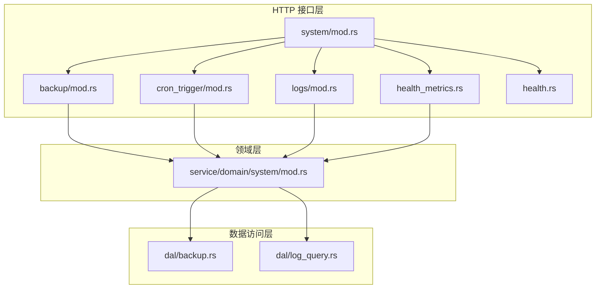
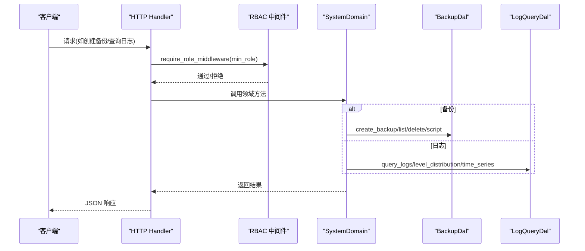
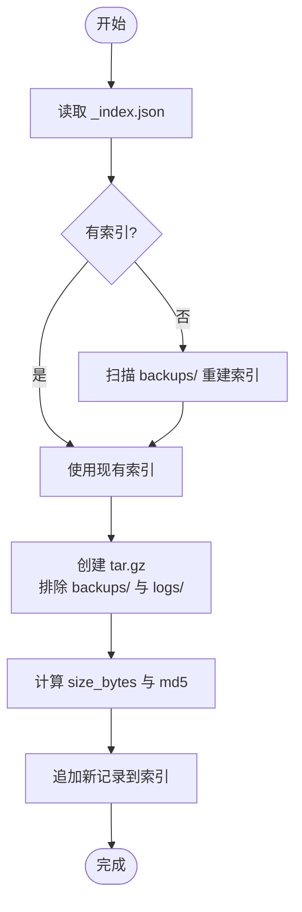
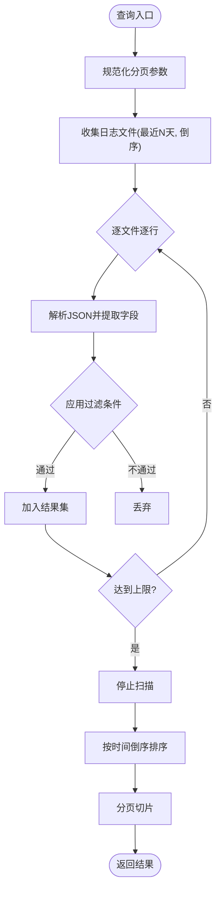
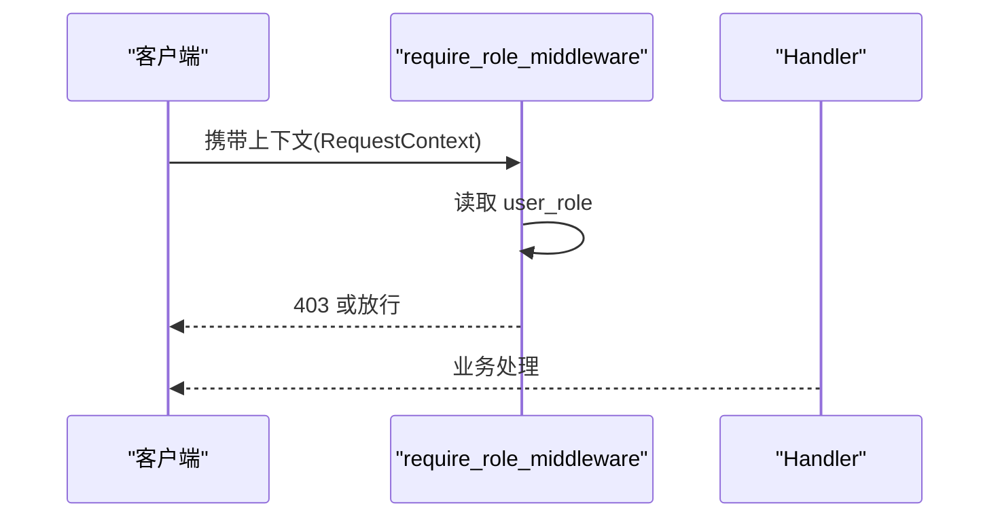
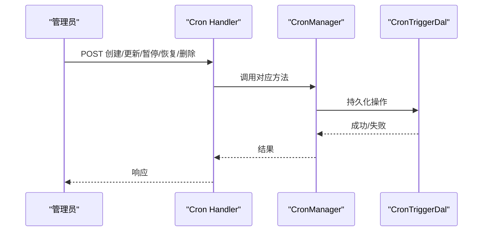
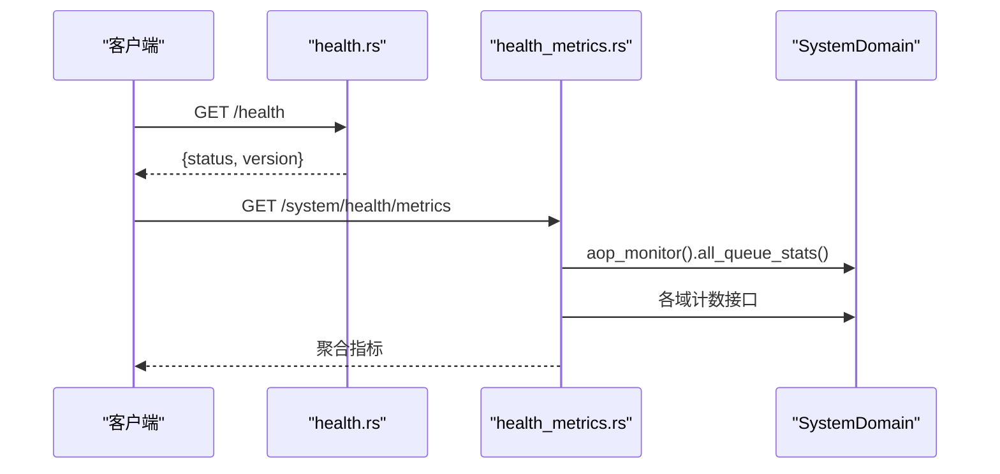
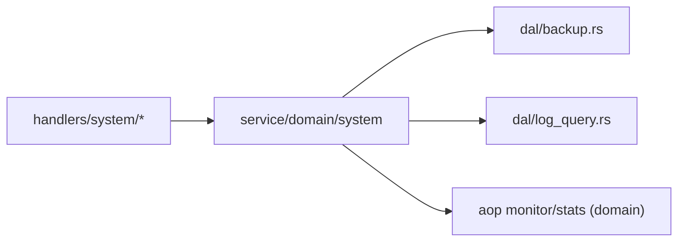

# 系统管理功能

<cite>
**本文引用的文件**
- [src/handlers/system/mod.rs](file://src/handlers/system/mod.rs)
- [src/handlers/system/backup/mod.rs](file://src/handlers/system/backup/mod.rs)
- [src/handlers/system/cron_trigger/mod.rs](file://src/handlers/system/cron_trigger/mod.rs)
- [src/handlers/system/logs/mod.rs](file://src/handlers/system/logs/mod.rs)
- [src/handlers/system/health_metrics.rs](file://src/handlers/system/health_metrics.rs)
- [src/handlers/health.rs](file://src/handlers/health.rs)
- [src/service/domain/system/mod.rs](file://src/service/domain/system/mod.rs)
- [src/service/dal/backup.rs](file://src/service/dal/backup.rs)
- [src/service/dal/log_query.rs](file://src/service/dal/log_query.rs)
- [src/middleware/require_role.rs](file://src/middleware/require_role.rs)
</cite>

## 目录
1. [简介](#简介)
2. [项目结构](#项目结构)
3. [核心组件](#核心组件)
4. [架构总览](#架构总览)
5. [详细组件分析](#详细组件分析)
6. [依赖关系分析](#依赖关系分析)
7. [性能考虑](#性能考虑)
8. [故障排查指南](#故障排查指南)
9. [结论](#结论)
10. [附录：API 示例与最佳实践](#附录api-示例与最佳实践)

## 简介
本章节面向系统管理员，聚焦以下能力：数据备份与恢复、日志查询与分析、基于角色的权限控制（RBAC）、Cron Trigger 的完整生命周期管理、系统健康检查与监控指标聚合。文档以代码实现为依据，给出调用链路、数据结构、边界条件与优化建议，帮助读者快速上手并安全运维。

## 项目结构
系统管理相关能力集中在 handlers/system 层，通过 Domain/DAL/DAO 分层访问数据与业务逻辑。关键入口包括备份、定时任务、日志、健康指标等子模块。

图表来源
- [src/handlers/system/mod.rs:1-13](file://src/handlers/system/mod.rs#L1-L13)
- [src/handlers/system/backup/mod.rs:1-33](file://src/handlers/system/backup/mod.rs#L1-L33)
- [src/handlers/system/cron_trigger/mod.rs:1-21](file://src/handlers/system/cron_trigger/mod.rs#L1-L21)
- [src/handlers/system/logs/mod.rs:1-6](file://src/handlers/system/logs/mod.rs#L1-L6)
- [src/handlers/system/health_metrics.rs:1-135](file://src/handlers/system/health_metrics.rs#L1-L135)
- [src/handlers/health.rs:1-16](file://src/handlers/health.rs#L1-L16)
- [src/service/domain/system/mod.rs:1-416](file://src/service/domain/system/mod.rs#L1-L416)
- [src/service/dal/backup.rs:1-642](file://src/service/dal/backup.rs#L1-L642)
- [src/service/dal/log_query.rs:1-746](file://src/service/dal/log_query.rs#L1-L746)

章节来源
- [src/handlers/system/mod.rs:1-13](file://src/handlers/system/mod.rs#L1-L13)

## 核心组件
- 备份与恢复：基于文件系统归档 tar.gz，维护 _index.json 索引，支持创建、列出、删除、生成恢复脚本。
- 日志查询：读取按日滚动的 JSONL 日志，支持关键词、log_id、级别、时间范围过滤与分页。
- Cron Trigger：提供创建、查询、更新、删除、暂停/恢复、到期扫描与执行标记等能力。
- 健康与监控：轻量存活探针与健康指标聚合（AOP 队列、Agent/Project/Task 计数、运行时长）。
- RBAC：基于中间件的最低角色校验，高危操作二次校验 SuperAdmin。

章节来源
- [src/service/dal/backup.rs:1-642](file://src/service/dal/backup.rs#L1-L642)
- [src/service/dal/log_query.rs:1-746](file://src/service/dal/log_query.rs#L1-L746)
- [src/service/domain/system/mod.rs:102-204](file://src/service/domain/system/mod.rs#L102-L204)
- [src/middleware/require_role.rs:1-39](file://src/middleware/require_role.rs#L1-L39)

## 架构总览
系统管理遵循 Adapter → Domain → DAL → DAO 单向调用。HTTP Handler 仅做参数绑定与鉴权，业务编排在 Domain，DAL 封装持久化细节。

图表来源
- [src/middleware/require_role.rs:16-39](file://src/middleware/require_role.rs#L16-L39)
- [src/service/domain/system/mod.rs:102-204](file://src/service/domain/system/mod.rs#L102-L204)
- [src/service/dal/backup.rs:70-84](file://src/service/dal/backup.rs#L70-L84)
- [src/service/dal/log_query.rs:100-105](file://src/service/dal/log_query.rs#L100-L105)

## 详细组件分析

### 数据备份与恢复
- 策略
  - 全量归档：将 base_data_path 下内容打包为 tar.gz，排除 backups/ 与 logs/ 目录，避免重复与膨胀。
  - 索引管理：_index.json 记录每个备份的版本号、时间戳、文件名、大小、MD5；列表按 version 降序。
  - 恢复脚本：生成 bash 脚本，提示停止服务、备份当前数据、解压到目标目录后重启。
- 流程
  - 创建备份：计算下一版本 -> 构建 tar.gz -> 计算 MD5 -> 写入索引。
  - 列出备份：读取索引，若为空则扫描重建。
  - 删除备份：从索引移除对应条目并删除文件。
  - 恢复脚本：根据版本号定位归档，输出可执行脚本。

图表来源
- [src/service/dal/backup.rs:100-152](file://src/service/dal/backup.rs#L100-L152)
- [src/service/dal/backup.rs:154-174](file://src/service/dal/backup.rs#L154-L174)
- [src/service/dal/backup.rs:176-196](file://src/service/dal/backup.rs#L176-L196)
- [src/service/dal/backup.rs:198-242](file://src/service/dal/backup.rs#L198-L242)
- [src/service/dal/backup.rs:247-266](file://src/service/dal/backup.rs#L247-L266)
- [src/service/dal/backup.rs:268-321](file://src/service/dal/backup.rs#L268-L321)
- [src/service/dal/backup.rs:358-394](file://src/service/dal/backup.rs#L358-L394)

章节来源
- [src/service/dal/backup.rs:1-642](file://src/service/dal/backup.rs#L1-L642)

### 增量备份说明
- 当前实现为全量归档，未实现增量备份。如需增量，可在索引中引入“差异基线”与“变更集”字段，配合外部工具或数据库快照机制实现。

[本节为概念性说明，不直接分析具体文件]

### 恢复流程
- 步骤
  - 获取恢复脚本：调用 generate_restore_script(version)。
  - 停止服务：避免数据写入冲突。
  - 执行脚本：自动备份当前数据目录并解压目标版本。
  - 重启服务：验证数据一致性。
- 注意事项
  - 脚本会覆盖目标目录，务必先停止服务。
  - 建议在低峰期执行，并确保磁盘空间充足。

章节来源
- [src/service/dal/backup.rs:198-242](file://src/service/dal/backup.rs#L198-L242)

### 日志查询系统
- 存储格式：tracing-appender 按日滚动生成 ai_orz.log.YYYY-MM-DD，每行一个 JSON 对象。
- 过滤条件
  - keyword：message 字段包含（不区分大小写）
  - log_id：精确匹配
  - level：INFO/WARN/ERROR/DEBUG/TRACE（不区分大小写）
  - start_time/end_time：unix 毫秒，含边界
  - page/page_size：分页
- 性能与安全
  - 单次最多扫描 MAX_SCAN_ENTRIES=10000 条，防止内存溢出。
  - 仅扫描最近 MAX_SCAN_DAYS=30 天的日志文件。
  - 解析失败行跳过，保证健壮性。
- 统计能力
  - 级别分布：拉取窗口内日志并在 Rust 侧聚合。
  - 时序统计：按小时桶聚合，用于可视化。

图表来源
- [src/service/dal/log_query.rs:119-211](file://src/service/dal/log_query.rs#L119-L211)
- [src/service/dal/log_query.rs:215-258](file://src/service/dal/log_query.rs#L215-L258)
- [src/service/dal/log_query.rs:260-354](file://src/service/dal/log_query.rs#L260-L354)

章节来源
- [src/service/dal/log_query.rs:1-746](file://src/service/dal/log_query.rs#L1-L746)
- [src/handlers/system/logs/query_logs.rs:1-29](file://src/handlers/system/logs/query_logs.rs#L1-L29)

### 基于角色的权限控制（RBAC）
- 中间件：require_role_middleware(min_role) 校验当前用户角色是否满足最低要求。
- 高危操作二次校验：备份的创建/删除/恢复等需 SuperAdmin。
- 设计要点
  - 角色继承：上级角色满足下级要求。
  - 统一错误码：权限不足返回 403。

图表来源
- [src/middleware/require_role.rs:16-39](file://src/middleware/require_role.rs#L16-L39)
- [src/handlers/system/backup/mod.rs:19-32](file://src/handlers/system/backup/mod.rs#L19-L32)

章节来源
- [src/middleware/require_role.rs:1-39](file://src/middleware/require_role.rs#L1-L39)
- [src/handlers/system/backup/mod.rs:1-33](file://src/handlers/system/backup/mod.rs#L1-L33)

### Cron Trigger 完整 CRUD
- 能力
  - 创建：支持 Once/Interval（Cron 类型暂未支持），自动计算 next_run_at。
  - 查询：按 ID 获取、列表查询。
  - 更新：修改触发器配置。
  - 删除：移除触发器。
  - 暂停/恢复：控制调度器是否执行。
  - 执行：list_due_triggers + mark_trigger_executed 配合调度消费端。
- 默认任务：启动时幂等注入系统级任务（agent_rest、project_followup）。

图表来源
- [src/handlers/system/cron_trigger/mod.rs:1-21](file://src/handlers/system/cron_trigger/mod.rs#L1-L21)
- [src/service/domain/system/mod.rs:116-141](file://src/service/domain/system/mod.rs#L116-L141)
- [src/service/domain/system/mod.rs:206-259](file://src/service/domain/system/mod.rs#L206-L259)
- [src/handlers/system/cron_trigger/create_cron_trigger.rs:1-68](file://src/handlers/system/cron_trigger/create_cron_trigger.rs#L1-L68)

章节来源
- [src/handlers/system/cron_trigger/mod.rs:1-21](file://src/handlers/system/cron_trigger/mod.rs#L1-L21)
- [src/service/domain/system/mod.rs:116-259](file://src/service/domain/system/mod.rs#L116-L259)
- [src/handlers/system/cron_trigger/create_cron_trigger.rs:1-68](file://src/handlers/system/cron_trigger/create_cron_trigger.rs#L1-L68)

### 系统健康检查与监控
- 存活探针：/health 返回状态与版本。
- 健康指标聚合：/system/health/metrics 汇总 AOP 队列积压、Agent/Project/Task 数量、进程运行时长等。
- 用途：前端 HUD 仪表盘墙、自动化巡检。

图表来源
- [src/handlers/health.rs:1-16](file://src/handlers/health.rs#L1-L16)
- [src/handlers/system/health_metrics.rs:1-135](file://src/handlers/system/health_metrics.rs#L1-L135)
- [src/service/domain/system/mod.rs:172-204](file://src/service/domain/system/mod.rs#L172-L204)

章节来源
- [src/handlers/health.rs:1-16](file://src/handlers/health.rs#L1-L16)
- [src/handlers/system/health_metrics.rs:1-135](file://src/handlers/system/health_metrics.rs#L1-L135)

## 依赖关系分析
- 耦合度
  - Handler 仅依赖 Domain 暴露的接口，DAL 通过 trait 解耦实现。
  - SystemDomain 聚合 CronManager、BackupManager、LogQuery、AopMonitor、AopStats。
- 外部依赖
  - 文件系统：备份归档、日志读取。
  - 序列化：serde_json 用于索引与日志解析。
  - 压缩：tar + gzip。
  - 哈希：md5 校验备份完整性。

图表来源
- [src/service/domain/system/mod.rs:102-204](file://src/service/domain/system/mod.rs#L102-L204)
- [src/service/dal/backup.rs:70-84](file://src/service/dal/backup.rs#L70-L84)
- [src/service/dal/log_query.rs:100-105](file://src/service/dal/log_query.rs#L100-L105)

章节来源
- [src/service/domain/system/mod.rs:102-204](file://src/service/domain/system/mod.rs#L102-L204)

## 性能考虑
- 备份
  - 大目录归档耗时较长，建议在低峰期执行。
  - 排除 backups/ 与 logs/ 减少体积。
  - 可结合外部对象存储进行异地容灾。
- 日志查询
  - 限制扫描条目数与天数，避免 OOM。
  - 优先使用 log_id 精确过滤提升效率。
  - 对高频查询可考虑缓存热点时间段的结果。
- 健康指标
  - 聚合多个域计数，注意并发下的 DB 压力，必要时加缓存或限流。

[本节提供通用指导，不直接分析具体文件]

## 故障排查指南
- 备份失败
  - 检查 base_data_path 是否存在且可写。
  - 查看 _index.json 是否损坏；若损坏，下次 list_backups 会尝试重建索引。
  - 恢复前确保已停止服务，避免锁竞争。
- 日志查询无结果
  - 确认日志目录与命名规则符合 ai_orz.log.YYYY-MM-DD。
  - 检查时间范围是否合理，keyword 是否过于严格。
  - 关注解析失败行被跳过的设计。
- 权限不足
  - 确认中间件最小角色设置与用户实际角色。
  - 高危操作需 SuperAdmin。

章节来源
- [src/service/dal/backup.rs:154-174](file://src/service/dal/backup.rs#L154-L174)
- [src/service/dal/log_query.rs:119-211](file://src/service/dal/log_query.rs#L119-L211)
- [src/middleware/require_role.rs:16-39](file://src/middleware/require_role.rs#L16-L39)

## 结论
系统管理模块以清晰的分层与明确的职责边界实现了备份恢复、日志查询、Cron 调度与健康监控等关键运维能力。通过严格的 RBAC 与防御性设计（索引重建、扫描上限、排除目录），在保证可用性的同时兼顾了安全性与性能。建议在生产环境结合外部存储与告警体系，形成完整的可观测性与容灾方案。

## 附录：API 示例与最佳实践
- 备份
  - 创建备份：调用备份创建接口，等待完成后下载归档或记录版本。
  - 列出备份：按版本降序选择目标版本。
  - 恢复：生成脚本 -> 停服 -> 执行脚本 -> 重启。
  - 最佳实践：定期全量备份；保留多版本；离线存放一份副本。
- 日志
  - 常用组合：log_id + level + 时间范围，快速定位问题。
  - 最佳实践：生产开启结构化日志；按日滚动；限制保留天数。
- Cron
  - 创建 Once/Interval 任务；谨慎使用 payload 与 action。
  - 暂停/恢复：临时抑制任务执行；查看执行历史由消费端负责。
  - 最佳实践：系统级任务幂等；失败重试与告警。
- 健康与监控
  - 存活探针：集成到容器编排健康检查。
  - 指标聚合：作为仪表盘数据源；异常阈值告警。
  - 最佳实践：指标采集频率适中；避免频繁 DB 查询。

[本节为实践建议，不直接分析具体文件]