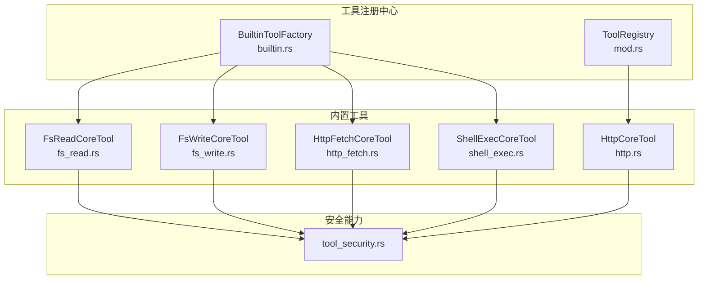
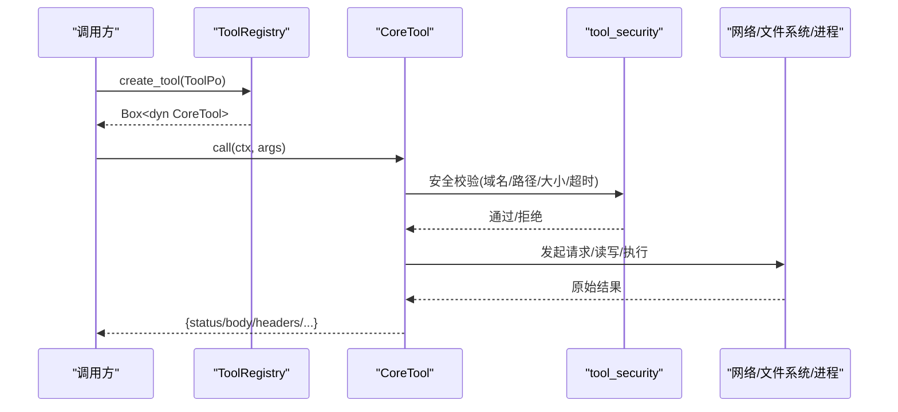
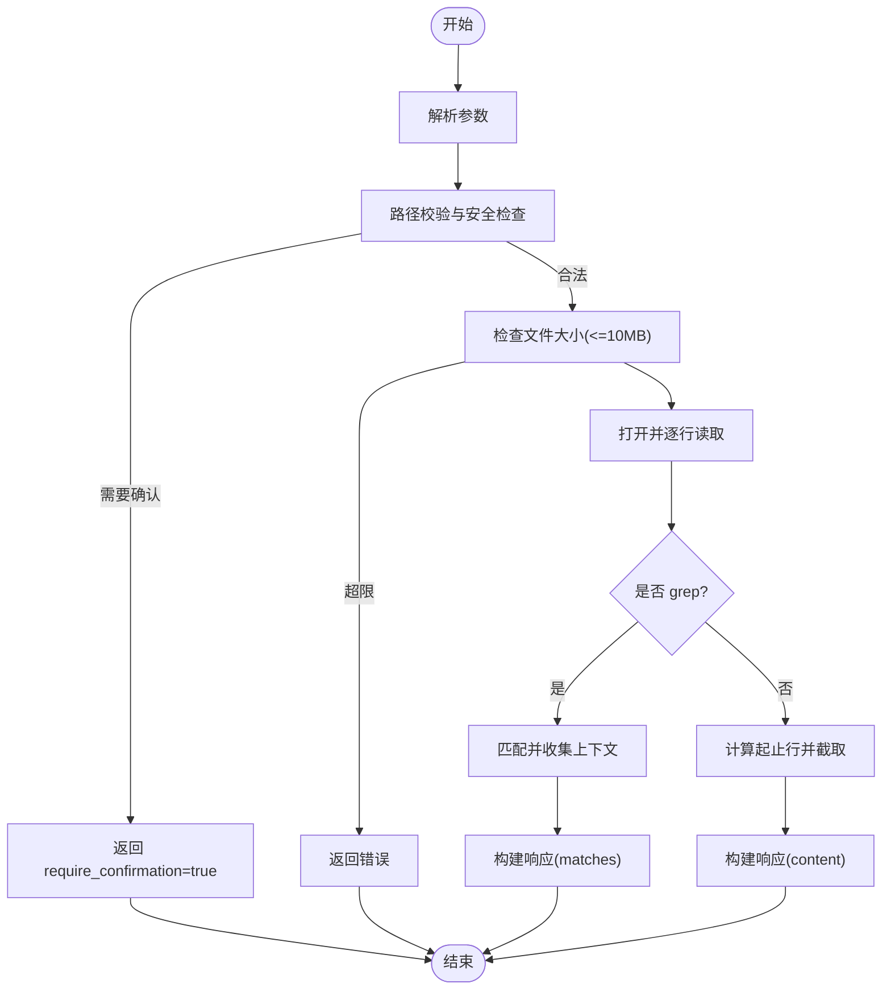
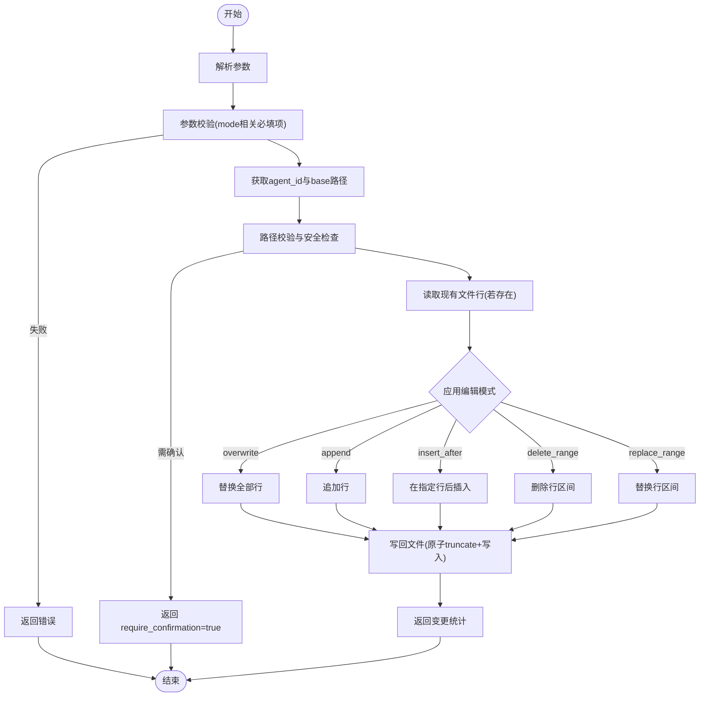
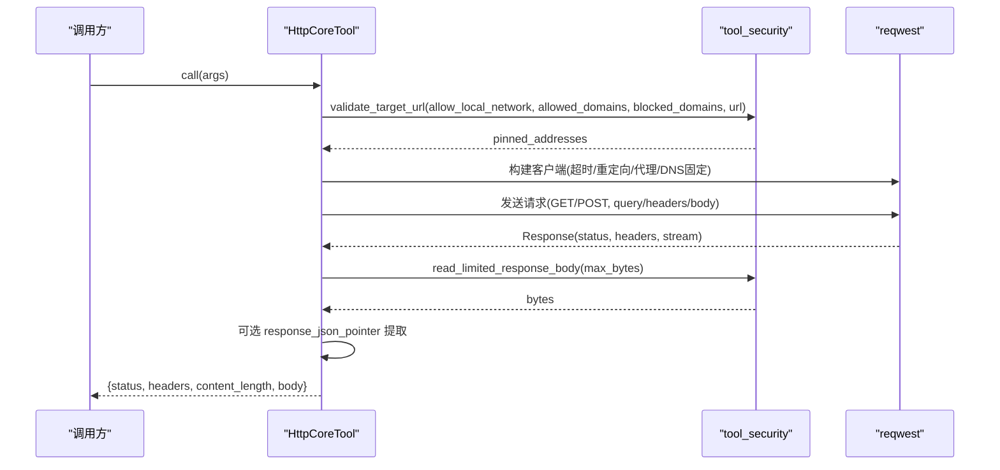
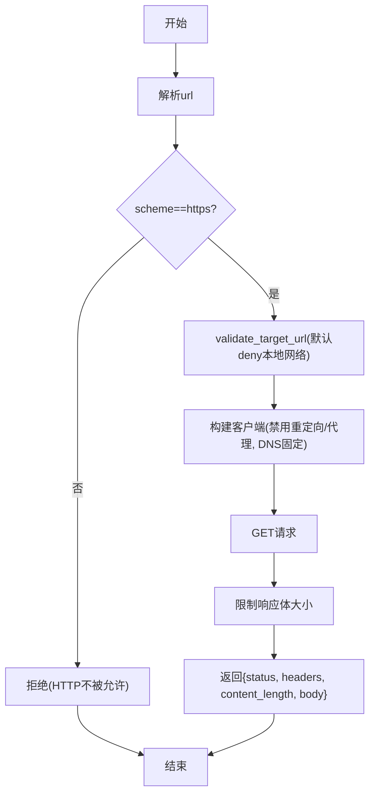
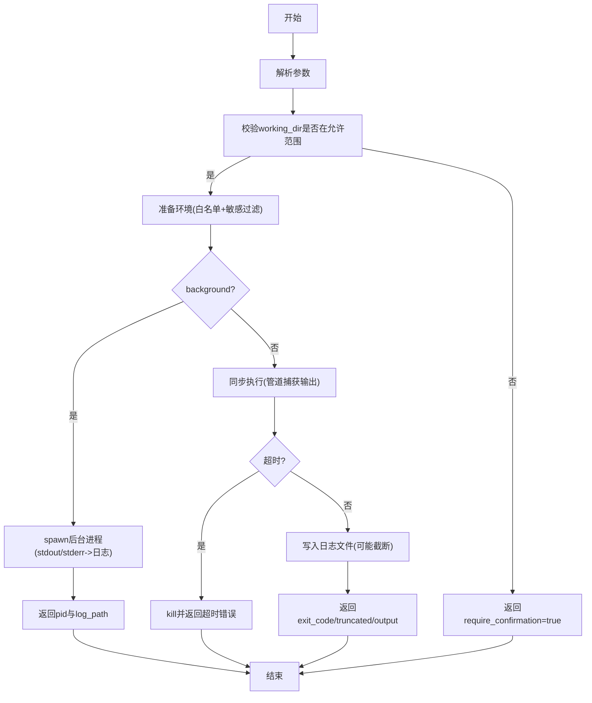
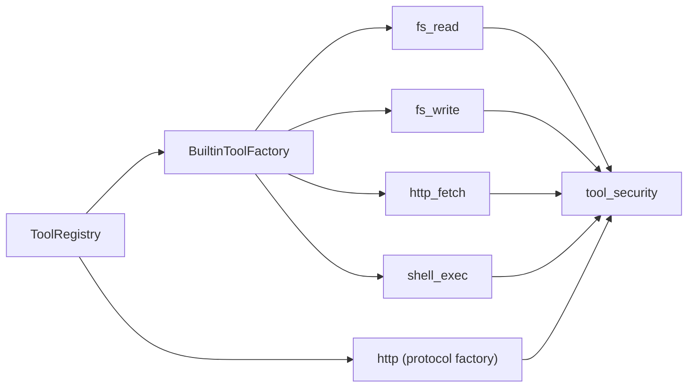

# 内置工具

<cite>
**本文引用的文件**
- [src/pkg/tool_registry/mod.rs](file://src/pkg/tool_registry/mod.rs)
- [src/pkg/tool_registry/builtin.rs](file://src/pkg/tool_registry/builtin.rs)
- [src/pkg/tool_registry/fs_read.rs](file://src/pkg/tool_registry/fs_read.rs)
- [src/pkg/tool_registry/fs_write.rs](file://src/pkg/tool_registry/fs_write.rs)
- [src/pkg/tool_registry/http_fetch.rs](file://src/pkg/tool_registry/http_fetch.rs)
- [src/pkg/tool_registry/http.rs](file://src/pkg/tool_registry/http.rs)
- [src/pkg/tool_registry/shell_exec.rs](file://src/pkg/tool_registry/shell_exec.rs)
- [src/pkg/tool_registry/tool_security.rs](file://src/pkg/tool_registry/tool_security.rs)
- [src/pkg/tool_registry/fs_tests.rs](file://src/pkg/tool_registry/fs_tests.rs)
- [src/pkg/tool_registry/shell_tests.rs](file://src/pkg/tool_registry/shell_tests.rs)
- [docs/generic_builtin_tools_design.md](file://docs/generic_builtin_tools_design.md)
</cite>

## 目录
1. [简介](#简介)
2. [项目结构](#项目结构)
3. [核心组件](#核心组件)
4. [架构总览](#架构总览)
5. [详细组件分析](#详细组件分析)
6. [依赖关系分析](#依赖关系分析)
7. [性能考量](#性能考量)
8. [故障排除指南](#故障排除指南)
9. [结论](#结论)
10. [附录](#附录)

## 简介
本章节面向使用者与集成方，系统化说明本项目中的“内置工具”能力：文件系统操作（fs_read、fs_write）、HTTP 请求（http、http_fetch）、Shell 执行（shell_exec）。文档覆盖参数定义、返回值格式、错误处理机制、安全控制（权限验证、资源限制、沙箱隔离）、注册与配置方式、性能优化建议与故障排除。所有实现均位于 src/pkg/tool_registry 模块下，遵循四层单向调用原则，工具层无业务感知，通过统一 ToolRegistry 进行注册与实例化。

## 项目结构
内置工具围绕以下关键文件组织：
- 全局注册表与协议分发：mod.rs
- 内置工厂与注册入口：builtin.rs
- 文件系统读取：fs_read.rs
- 文件系统写入：fs_write.rs
- HTTP 通用运行时（数据库配置驱动）：http.rs
- HTTP 内置抓取器（固定 GET + 严格安全策略）：http_fetch.rs
- Shell 命令执行（同步/异步、日志落盘、环境白名单）：shell_exec.rs
- 共享安全能力（SSRF、大小限制、路径校验、敏感信息过滤）：tool_security.rs

图表来源
- [src/pkg/tool_registry/mod.rs:29-102](file://src/pkg/tool_registry/mod.rs#L29-L102)
- [src/pkg/tool_registry/builtin.rs:27-43](file://src/pkg/tool_registry/builtin.rs#L27-L43)
- [src/pkg/tool_registry/fs_read.rs:50-123](file://src/pkg/tool_registry/fs_read.rs#L50-L123)
- [src/pkg/tool_registry/fs_write.rs:44-119](file://src/pkg/tool_registry/fs_write.rs#L44-L119)
- [src/pkg/tool_registry/http_fetch.rs:19-58](file://src/pkg/tool_registry/http_fetch.rs#L19-L58)
- [src/pkg/tool_registry/shell_exec.rs:89-166](file://src/pkg/tool_registry/shell_exec.rs#L89-L166)
- [src/pkg/tool_registry/http.rs:23-114](file://src/pkg/tool_registry/http.rs#L23-L114)
- [src/pkg/tool_registry/tool_security.rs:1-231](file://src/pkg/tool_registry/tool_security.rs#L1-L231)

章节来源
- [src/pkg/tool_registry/mod.rs:29-132](file://src/pkg/tool_registry/mod.rs#L29-L132)
- [src/pkg/tool_registry/builtin.rs:27-43](file://src/pkg/tool_registry/builtin.rs#L27-L43)

## 核心组件
- 全局工具注册表 ToolRegistry：维护内置工厂映射与 HTTP 协议级工厂；根据 ToolPo.protocol 分派到具体实现。
- 内置工厂 BuiltinToolFactory：每个内置工具提供 create_po() 与 create()，用于生成元数据与可执行实例。
- 工具安全能力 tool_security：提供 SSRF 防护、域名白/黑名单、DNS 固定、响应体大小限制、超时限制、路径校验、敏感文件名拦截、响应头脱敏等。
- 各工具 CoreTool 实现：统一 call(ctx, args) -> Result<Value> 接口，返回 JSON 结果或错误。

章节来源
- [src/pkg/tool_registry/mod.rs:46-102](file://src/pkg/tool_registry/mod.rs#L46-L102)
- [src/pkg/tool_registry/builtin.rs:13-24](file://src/pkg/tool_registry/builtin.rs#L13-L24)
- [src/pkg/tool_registry/tool_security.rs:1-231](file://src/pkg/tool_registry/tool_security.rs#L1-L231)

## 架构总览
工具执行流程（以 http_fetch 为例）：
- 客户端调用 Agent/系统触发工具执行
- ToolRegistry.create_tool(ToolPo) 创建具体工具实例
- 工具 call() 解析参数、执行安全校验、发起网络/IO/进程操作
- 返回结构化 JSON 结果，包含状态码、头部、内容长度、主体或摘要

图表来源
- [src/pkg/tool_registry/mod.rs:81-102](file://src/pkg/tool_registry/mod.rs#L81-L102)
- [src/pkg/tool_registry/http_fetch.rs:60-143](file://src/pkg/tool_registry/http_fetch.rs#L60-L143)
- [src/pkg/tool_registry/tool_security.rs:92-170](file://src/pkg/tool_registry/tool_security.rs#L92-L170)

## 详细组件分析

### 文件系统读取 fs_read
- 功能：按路径读取文件，支持整文件、行范围读取、grep 模式匹配并返回上下文行。
- 参数（parameters_schema 定义）：
  - path: string，必填，相对工作目录
  - start_line/end_line: integer，可选，1-indexed
  - grep: string，可选，正则匹配
  - context_lines: integer，可选，默认 2
- 返回值：
  - success: bool
  - path: string
  - size_bytes: usize
  - total_lines: usize
  - content: string（带行号）
  - 或 grep 模式下返回 matches 列表（line_number/content/context_before/context_after）
- 安全与限制：
  - 路径必须落在 base_data_path 或 additional_allowed_paths 内；否则返回 require_confirmation=true 提示用户确认
  - 拒绝敏感文件名（如 .env、私钥等）
  - 拒绝符号链接
  - 硬限制：最大读取 10MB
- 错误处理：
  - 非法参数、打开失败、读取失败、过大文件等会返回结构化错误消息
- 使用示例（概念性）：
  - 读取完整文件：{path:"src/main.rs"}
  - 读取行范围：{path:"src/lib.rs", start_line:10, end_line:20}
  - grep 搜索：{path:"src/app.rs", grep:"error", context_lines:3}

图表来源
- [src/pkg/tool_registry/fs_read.rs:23-35](file://src/pkg/tool_registry/fs_read.rs#L23-L35)
- [src/pkg/tool_registry/fs_read.rs:125-216](file://src/pkg/tool_registry/fs_read.rs#L125-L216)
- [src/pkg/tool_registry/tool_security.rs:314-419](file://src/pkg/tool_registry/tool_security.rs#L314-L419)

章节来源
- [src/pkg/tool_registry/fs_read.rs:50-216](file://src/pkg/tool_registry/fs_read.rs#L50-L216)
- [src/pkg/tool_registry/tool_security.rs:314-419](file://src/pkg/tool_registry/tool_security.rs#L314-L419)
- [src/pkg/tool_registry/fs_tests.rs:12-81](file://src/pkg/tool_registry/fs_tests.rs#L12-L81)

### 文件系统写入 fs_write
- 功能：原子写入文件，支持多种模式：overwrite、append、insert_after、delete_range、replace_range。
- 参数：
  - path: string，必填
  - mode: enum，必填，见上
  - content: string，部分模式必填
  - after_line/start_line/end_line: integer，部分模式必填
- 返回值：
  - success: bool
  - path: string
  - mode: string
  - original_lines/final_lines/lines_changed: int
- 安全与限制：
  - 基于 agent_id 的隔离目录（agent_data_dir），路径必须在允许范围内
  - 拒绝敏感文件名与符号链接
  - 超出默认范围需用户确认
- 错误处理：
  - 参数校验失败、打开/写入失败、无效范围等返回结构化错误
- 使用示例（概念性）：
  - 覆盖写入：{path:"output.txt", mode:"overwrite", content:"..."}
  - 追加：{path:"log.txt", mode:"append", content:"..."}
  - 插入：{path:"config.yaml", mode:"insert_after", after_line:5, content:"..."}
  - 删除范围：{path:"data.csv", mode:"delete_range", start_line:10, end_line:20}
  - 替换范围：{path:"readme.md", mode:"replace_range", start_line:1, end_line:3, content:"..."}

图表来源
- [src/pkg/tool_registry/fs_write.rs:24-38](file://src/pkg/tool_registry/fs_write.rs#L24-L38)
- [src/pkg/tool_registry/fs_write.rs:121-275](file://src/pkg/tool_registry/fs_write.rs#L121-L275)
- [src/pkg/tool_registry/tool_security.rs:314-419](file://src/pkg/tool_registry/tool_security.rs#L314-L419)

章节来源
- [src/pkg/tool_registry/fs_write.rs:44-318](file://src/pkg/tool_registry/fs_write.rs#L44-L318)
- [src/pkg/tool_registry/tool_security.rs:314-419](file://src/pkg/tool_registry/tool_security.rs#L314-L419)

### HTTP 通用运行时 http
- 功能：数据库注册的 HTTP 工具，支持 GET/POST，模板渲染 URL/Headers/Query/Body，JSON Pointer 提取响应片段，严格的域白/黑名单与本地网络访问控制。
- 配置（ToolPo.config 为 HttpToolConfig）：
  - method/url/headers/query/body/timeout_ms/response_max_bytes/allowed_status_codes/response_json_pointer/allowed_domains/blocked_domains/allow_local_network
- 参数：由 parameters_schema 约束，支持 required/additionalProperties/enum/type 校验
- 返回值：
  - status: u16
  - headers: object（敏感头脱敏）
  - content_length: usize
  - body: any（JSON 优先，否则字符串）
- 安全与限制：
  - 禁止重定向、禁用代理、DNS 固定到校验后的地址
  - 仅允许 http/https，禁止 userinfo、禁止主机名占位符
  - 默认拒绝本地网络，除非 allow_local_network=true
  - 响应体大小限制（默认 1MB，硬上限 10MB）
  - 超时限制（默认 30s，硬上限 10分钟）
- 错误处理：
  - 配置校验失败、URL 非法、模板未解析、域名被拒、状态码不在允许列表、响应过大、网络错误等

图表来源
- [src/pkg/tool_registry/http.rs:41-114](file://src/pkg/tool_registry/http.rs#L41-L114)
- [src/pkg/tool_registry/http.rs:126-220](file://src/pkg/tool_registry/http.rs#L126-L220)
- [src/pkg/tool_registry/tool_security.rs:92-170](file://src/pkg/tool_registry/tool_security.rs#L92-L170)
- [src/pkg/tool_registry/tool_security.rs:200-231](file://src/pkg/tool_registry/tool_security.rs#L200-L231)

章节来源
- [src/pkg/tool_registry/http.rs:23-599](file://src/pkg/tool_registry/http.rs#L23-L599)
- [src/pkg/tool_registry/tool_security.rs:92-231](file://src/pkg/tool_registry/tool_security.rs#L92-L231)

### HTTP 内置抓取器 http_fetch
- 功能：固定 GET 方法抓取 HTTPS URL，默认仅允许公网 HTTPS，拒绝 HTTP、本地网络与私有 IP。
- 参数：url(string)，必填
- 返回值：同 http 运行时（status/headers/content_length/body）
- 安全与限制：
  - 强制 HTTPS
  - SSRF 保护：默认 deny 本地网络
  - DNS 固定、禁用重定向与代理
  - 响应体大小限制（默认 1MB）
- 错误处理：
  - 非 HTTPS、本地网络、解析失败、网络错误等

图表来源
- [src/pkg/tool_registry/http_fetch.rs:23-58](file://src/pkg/tool_registry/http_fetch.rs#L23-L58)
- [src/pkg/tool_registry/http_fetch.rs:60-143](file://src/pkg/tool_registry/http_fetch.rs#L60-L143)
- [src/pkg/tool_registry/tool_security.rs:92-170](file://src/pkg/tool_registry/tool_security.rs#L92-L170)

章节来源
- [src/pkg/tool_registry/http_fetch.rs:19-143](file://src/pkg/tool_registry/http_fetch.rs#L19-L143)
- [src/pkg/tool_registry/tool_security.rs:92-170](file://src/pkg/tool_registry/tool_security.rs#L92-L170)

### Shell 执行 shell_exec
- 功能：在受限环境中执行 shell 命令，支持同步等待与后台运行；输出超过阈值时截断并保存至日志文件；环境变量白名单过滤。
- 参数：
  - command: string，必填
  - working_dir: string，可选，相对或绝对路径（受安全校验）
  - timeout_ms: integer，可选，默认 300000ms
  - max_output_size_bytes: integer，可选，默认 10MB
  - background: boolean，可选，默认 false
  - env: object<string,string>，可选，附加环境变量
- 返回值：
  - 同步：success/exit_code/truncated/full_output_bytes/log_path/output
  - 后台：success/background/pid/log_path/message
- 安全与限制：
  - 工作目录必须在 base_data_path 或 additional_allowed_paths 内
  - 继承的环境变量经白名单过滤，并屏蔽敏感键（如 password/token 等）
  - 输出大小限制，超长输出保存到日志文件
- 错误处理：
  - 工作目录不合法、命令启动失败、超时、子进程错误等

图表来源
- [src/pkg/tool_registry/shell_exec.rs:70-87](file://src/pkg/tool_registry/shell_exec.rs#L70-L87)
- [src/pkg/tool_registry/shell_exec.rs:158-208](file://src/pkg/tool_registry/shell_exec.rs#L158-L208)
- [src/pkg/tool_registry/shell_exec.rs:256-466](file://src/pkg/tool_registry/shell_exec.rs#L256-L466)

章节来源
- [src/pkg/tool_registry/shell_exec.rs:20-490](file://src/pkg/tool_registry/shell_exec.rs#L20-L490)
- [src/pkg/tool_registry/shell_tests.rs:4-145](file://src/pkg/tool_registry/shell_tests.rs#L4-L145)

## 依赖关系分析
- ToolRegistry 作为中央调度，持有内置工厂集合与 HTTP 协议工厂；create_tool 依据 ToolPo.protocol 路由到对应实现。
- 所有工具依赖 tool_security 提供的安全原语：域名校验、IP 判定、响应体限制、URL 模板边界校验、路径校验与敏感文件名检测。
- 内置工具通过 BuiltinToolFactory 暴露元数据（parameters_schema、control_mode、description）与实例构造逻辑。
- HTTP 工具还依赖 reqwest 与 serde_json，并进行严格的配置校验（validate_config）。

图表来源
- [src/pkg/tool_registry/mod.rs:29-102](file://src/pkg/tool_registry/mod.rs#L29-L102)
- [src/pkg/tool_registry/builtin.rs:27-43](file://src/pkg/tool_registry/builtin.rs#L27-L43)
- [src/pkg/tool_registry/http.rs:23-114](file://src/pkg/tool_registry/http.rs#L23-L114)
- [src/pkg/tool_registry/tool_security.rs:1-231](file://src/pkg/tool_registry/tool_security.rs#L1-L231)

章节来源
- [src/pkg/tool_registry/mod.rs:29-132](file://src/pkg/tool_registry/mod.rs#L29-L132)
- [src/pkg/tool_registry/builtin.rs:27-43](file://src/pkg/tool_registry/builtin.rs#L27-L43)

## 性能考量
- 网络 I/O
  - 合理设置 timeout_ms 与 response_max_bytes，避免长连接与大响应拖慢系统
  - 使用 DNS 固定与禁用重定向减少额外开销与安全风险
- 文件 I/O
  - fs_read 支持行范围读取与 grep，避免全量加载大文件
  - fs_write 采用原子写入（truncate+顺序写），降低并发写入风险
- Shell 执行
  - 对长任务使用 background=true 并记录 pid 与 log_path，避免阻塞主流程
  - 利用 max_output_size_bytes 限制输出内存占用，超大数据落盘日志
- 安全校验前置
  - 在发起网络/IO/进程前完成参数与目标校验，尽早失败，减少资源消耗

[本节为通用指导，无需特定文件引用]

## 故障排除指南
- 路径访问被拒绝
  - 现象：fs_read/fs_write 返回 require_confirmation=true 或错误
  - 排查：确认路径是否在 base_data_path 或 additional_allowed_paths；检查是否存在敏感文件名或符号链接
  - 参考：路径校验与敏感文件名检测
- HTTP 请求失败
  - 现象：状态码不在 allowed_status_codes、响应过大、域名被拒、模板未解析
  - 排查：检查 HttpToolConfig 配置、URL 模板、域名白/黑名单、allow_local_network；查看响应体大小限制与超时
- Shell 执行异常
  - 现象：命令超时、输出过大、工作目录不合法、环境变量缺失
  - 排查：调整 timeout_ms 与 max_output_size_bytes；确认 working_dir 合法性；检查 allowed_env 与环境变量注入
- 测试辅助
  - 使用单元测试验证路径校验、环境过滤、参数解析等行为

章节来源
- [src/pkg/tool_registry/tool_security.rs:314-487](file://src/pkg/tool_registry/tool_security.rs#L314-L487)
- [src/pkg/tool_registry/http.rs:369-599](file://src/pkg/tool_registry/http.rs#L369-L599)
- [src/pkg/tool_registry/shell_exec.rs:256-490](file://src/pkg/tool_registry/shell_exec.rs#L256-L490)
- [src/pkg/tool_registry/fs_tests.rs:12-81](file://src/pkg/tool_registry/fs_tests.rs#L12-L81)
- [src/pkg/tool_registry/shell_tests.rs:4-145](file://src/pkg/tool_registry/shell_tests.rs#L4-L145)

## 结论
内置工具通过统一的注册中心与安全能力，提供了安全的文件系统操作、HTTP 请求与 Shell 执行能力。其设计强调：
- 安全优先：SSRF 防护、域名白/黑名单、DNS 固定、路径沙箱、敏感信息脱敏与过滤
- 可控与可观测：参数 schema 校验、配置校验、超时与大小限制、日志落盘
- 可扩展：协议级工厂与内置工厂分离，便于扩展新的工具类型
建议在生产环境中结合业务需求合理配置 allow_local_network、additional_allowed_paths、allowed_env 与超时/大小限制，以获得最佳的安全与性能平衡。

[本节为总结，无需特定文件引用]

## 附录

### 工具注册与初始化
- 内置工具工厂在启动时被集中注册到全局 ToolRegistry，供后续按需创建实例
- 注册入口与清单参见 builtin.rs 中的 GENERIC_BUILTIN_TOOLS 与 register_all
- 设计文档中亦描述了注册初始化流程与启动调用位置

章节来源
- [src/pkg/tool_registry/builtin.rs:27-43](file://src/pkg/tool_registry/builtin.rs#L27-L43)
- [docs/generic_builtin_tools_design.md:399-442](file://docs/generic_builtin_tools_design.md#L399-L442)

### 安全控制机制汇总
- 文件系统
  - 路径必须在 base_data_path 或 additional_allowed_paths 内
  - 拒绝敏感文件名与符号链接
  - 超大文件限制（fs_read 10MB）
- HTTP
  - 仅允许 http/https，禁止 userinfo 与主机名占位符
  - 域名白/黑名单与本地网络访问控制
  - DNS 固定、禁用重定向与代理
  - 响应体大小限制与超时限制
- Shell
  - 工作目录限制
  - 环境变量白名单与敏感键过滤
  - 输出大小限制与日志落盘

章节来源
- [src/pkg/tool_registry/tool_security.rs:17-231](file://src/pkg/tool_registry/tool_security.rs#L17-L231)
- [src/pkg/tool_registry/fs_read.rs:125-216](file://src/pkg/tool_registry/fs_read.rs#L125-L216)
- [src/pkg/tool_registry/fs_write.rs:121-275](file://src/pkg/tool_registry/fs_write.rs#L121-L275)
- [src/pkg/tool_registry/http.rs:126-220](file://src/pkg/tool_registry/http.rs#L126-L220)
- [src/pkg/tool_registry/shell_exec.rs:256-466](file://src/pkg/tool_registry/shell_exec.rs#L256-L466)