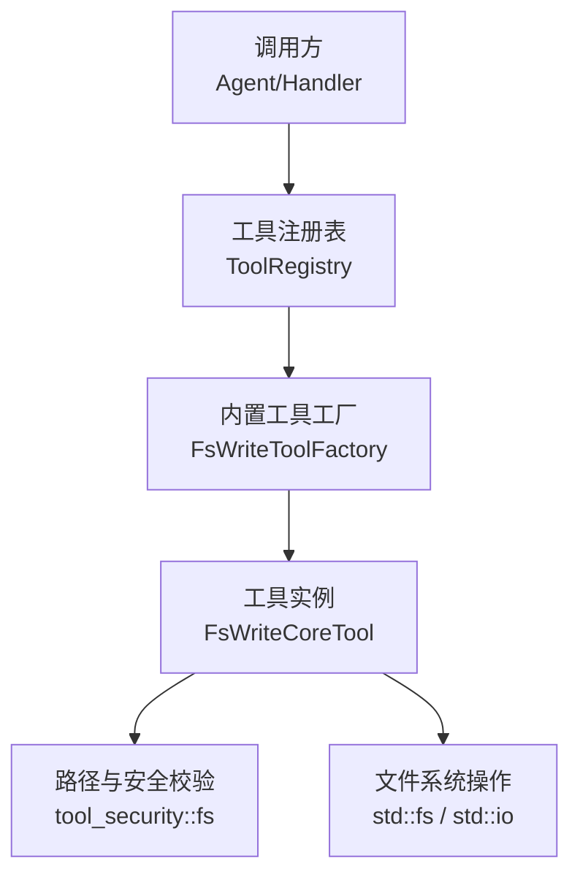
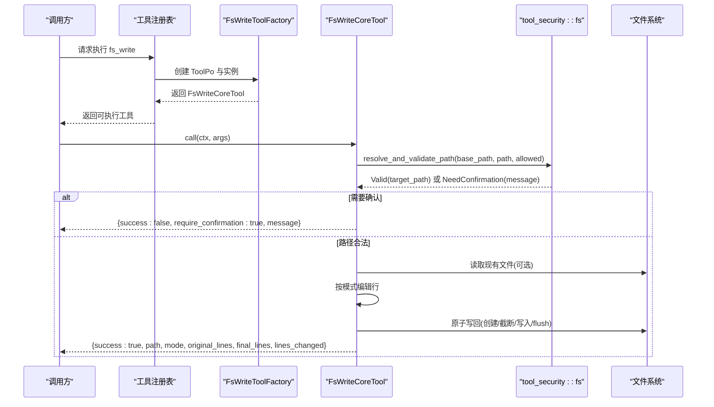
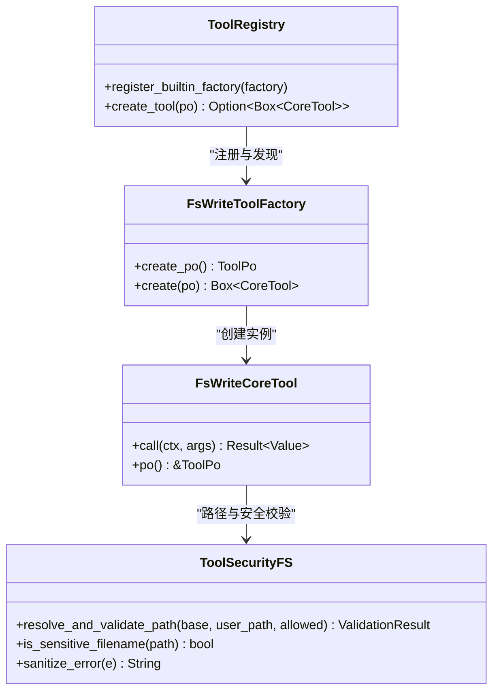

# 文件系统写入工具 (fs_write)

<cite>
**本文引用的文件**
- [src/pkg/tool_registry/fs_write.rs](file://src/pkg/tool_registry/fs_write.rs)
- [src/pkg/tool_registry/tool_security.rs](file://src/pkg/tool_registry/tool_security.rs)
- [src/pkg/tool_registry/builtin.rs](file://src/pkg/tool_registry/builtin.rs)
- [src/pkg/tool_registry/mod.rs](file://src/pkg/tool_registry/mod.rs)
- [src/pkg/tool_registry/fs_tests.rs](file://src/pkg/tool_registry/fs_tests.rs)
- [docs/generic_builtin_tools_design.md](file://docs/generic_builtin_tools_design.md)
</cite>

## 目录
1. [简介](#简介)
2. [项目结构](#项目结构)
3. [核心组件](#核心组件)
4. [架构总览](#架构总览)
5. [详细组件分析](#详细组件分析)
6. [依赖关系分析](#依赖关系分析)
7. [性能考虑](#性能考虑)
8. [故障排除指南](#故障排除指南)
9. [结论](#结论)
10. [附录：参数与返回值规范](#附录参数与返回值规范)

## 简介
fs_write（write_file）是内置的文件系统写入工具，用于在当前项目/工作区范围内对文件进行原子化写入。支持多种写入模式：覆盖整个文件、追加到末尾、在指定行后插入、删除行范围、替换行范围。所有变更以“全有或全无”的原子方式完成，确保数据一致性。该工具具备严格的安全沙箱机制：默认仅允许访问代理的数据目录，拒绝敏感文件名和符号链接；若目标路径超出默认范围，会返回需要用户确认的信号，强制 Agent 停止并请求显式授权后再继续。

## 项目结构
fs_write 位于工具注册中心（tool_registry）下的 pkg 层，属于通用基础设施工具，无业务感知。其核心实现由工厂创建 ToolPo 描述元信息，并在运行时通过 CoreTool::call 执行具体逻辑；安全校验统一由 tool_security::fs 模块提供。

图表来源
- [src/pkg/tool_registry/builtin.rs:24-43](file://src/pkg/tool_registry/builtin.rs#L24-L43)
- [src/pkg/tool_registry/fs_write.rs:44-100](file://src/pkg/tool_registry/fs_write.rs#L44-L100)
- [src/pkg/tool_registry/tool_security.rs:314-419](file://src/pkg/tool_registry/tool_security.rs#L314-L419)

章节来源
- [src/pkg/tool_registry/builtin.rs:24-43](file://src/pkg/tool_registry/builtin.rs#L24-L43)
- [src/pkg/tool_registry/mod.rs:34-73](file://src/pkg/tool_registry/mod.rs#L34-L73)
- [src/pkg/tool_registry/fs_write.rs:44-100](file://src/pkg/tool_registry/fs_write.rs#L44-L100)

## 核心组件
- FsWriteToolFactory：定义 fs_write 工具的元数据（id、name、description、parameters_schema、控制模式等），并负责创建工具实例。
- FsWriteCoreTool：实现 CoreTool::call，解析参数、执行路径与安全校验、按模式修改文件内容、原子写回并返回结果。
- FsToolConfig：工具配置，包含 additional_allowed_paths，用于扩展允许的额外路径集合。
- tool_security::fs：提供 resolve_and_validate_path、is_sensitive_filename、sanitize_error 等安全能力。

章节来源
- [src/pkg/tool_registry/fs_write.rs:16-38](file://src/pkg/tool_registry/fs_write.rs#L16-L38)
- [src/pkg/tool_registry/fs_write.rs:44-118](file://src/pkg/tool_registry/fs_write.rs#L44-L118)
- [src/pkg/tool_registry/tool_security.rs:314-487](file://src/pkg/tool_registry/tool_security.rs#L314-L487)

## 架构总览
fs_write 遵循四层单向调用原则：Adapter → Domain → DAL → DAO。本工具作为 pkg 层的通用工具，不感知业务，被上层通过工具注册表按需创建并调用。调用流程如下：

图表来源
- [src/pkg/tool_registry/fs_write.rs:121-269](file://src/pkg/tool_registry/fs_write.rs#L121-L269)
- [src/pkg/tool_registry/tool_security.rs:329-419](file://src/pkg/tool_registry/tool_security.rs#L329-L419)

## 详细组件分析

### 参数定义与校验
- 必填参数
  - path：相对路径，相对于当前代理的数据目录（agent_data_dir）。
  - mode：写入模式，枚举值包括 overwrite、append、insert_after、delete_range、replace_range。
- 可选参数
  - content：写入内容。在 overwrite、append、insert_after、replace_range 模式下为必填。
  - after_line：在 insert_after 模式下必填，表示在该行之后插入（1 起始）。
  - start_line、end_line：在 delete_range、replace_range 模式下必填，表示行范围（1 起始，end_line 包含）。
- 校验规则
  - 根据 mode 校验必填字段是否齐全，缺失则返回错误。
  - 行号边界处理采用饱和减法与最小值裁剪，避免越界。

章节来源
- [src/pkg/tool_registry/fs_write.rs:24-42](file://src/pkg/tool_registry/fs_write.rs#L24-L42)
- [src/pkg/tool_registry/fs_write.rs:63-90](file://src/pkg/tool_registry/fs_write.rs#L63-L90)
- [src/pkg/tool_registry/fs_write.rs:277-318](file://src/pkg/tool_registry/fs_write.rs#L277-L318)

### 写入模式与行为
- overwrite：完全覆盖文件内容（不存在则创建）。
- append：将内容追加到文件末尾。
- insert_after：在第 after_line 行之后插入新行（1 起始）。
- delete_range：删除从 start_line 到 end_line（含）的行。
- replace_range：用新内容替换从 start_line 到 end_line（含）的行。
- 原子性：先构建内存中的行集合，再一次性打开文件并截断写回，最后 flush，保证要么全部成功，要么不改变原文件。

章节来源
- [src/pkg/tool_registry/fs_write.rs:177-236](file://src/pkg/tool_registry/fs_write.rs#L177-L236)
- [src/pkg/tool_registry/fs_write.rs:241-258](file://src/pkg/tool_registry/fs_write.rs#L241-L258)

### 安全控制机制
- 路径隔离：基于 agent_id 获取 agent_data_dir 作为 base_path，所有相对路径在此范围内解析。
- 敏感文件拦截：文件名匹配 .env、.pem、.key、.p12、.pfx、id_rsa、password、secret、token、credential、auth 等关键字，以及隐藏文件（以 . 开头）直接拒绝。
- 符号链接拒绝：最终路径若为符号链接，直接拒绝。
- 超范围处理：若目标路径不在 base_path 或 additional_allowed_paths 内，返回 require_confirmation=true 提示，要求 Agent 必须停止并询问用户确认后再继续。
- 错误脱敏：IO 错误消息中去除绝对路径片段，防止泄露敏感路径信息。

章节来源
- [src/pkg/tool_registry/tool_security.rs:329-419](file://src/pkg/tool_registry/tool_security.rs#L329-L419)
- [src/pkg/tool_registry/tool_security.rs:421-487](file://src/pkg/tool_registry/tool_security.rs#L421-L487)
- [src/pkg/tool_registry/fs_write.rs:132-152](file://src/pkg/tool_registry/fs_write.rs#L132-L152)

### 返回值格式
- 成功
  - success: true
  - path: 原始传入路径
  - mode: 使用的写入模式
  - original_lines: 写入前文件的行数
  - final_lines: 写入后文件的行数
  - lines_changed: 变化行数（绝对值）
- 需要确认
  - success: false
  - require_confirmation: true
  - message: 提示信息，指示路径超出默认范围，需用户确认
- 失败
  - success: false
  - error: 错误信息（已脱敏）

章节来源
- [src/pkg/tool_registry/fs_write.rs:260-267](file://src/pkg/tool_registry/fs_write.rs#L260-L267)
- [src/pkg/tool_registry/fs_write.rs:145-152](file://src/pkg/tool_registry/fs_write.rs#L145-L152)

### 使用示例（场景化）
- 生成报告：使用 overwrite 模式将结构化文本写入 reports/xxx.txt，便于后续读取与展示。
- 保存配置：使用 append 模式追加键值对到配置文件末尾，注意保持格式一致。
- 记录日志：使用 append 模式追加日志行，结合时间戳与级别字段。
- 批量更新：使用 replace_range 或 delete_range 配合 insert_after，对多行段落进行替换或清理。
- 增量编辑：使用 insert_after 在特定行后插入新步骤或注释。

说明：以上示例为概念性用法，实际调用时请遵循参数定义与安全限制。

[本节为概念性说明，不直接分析具体代码文件]

## 依赖关系分析
- 工具注册与生命周期
  - 启动时通过 builtin.rs 将 fs_write 工厂注册到全局工具注册表。
  - 运行时通过 ToolRegistry 创建工具实例并执行。
- 安全与 IO
  - 路径解析与安全校验依赖 tool_security::fs。
  - 文件读写依赖标准库 std::fs 与 std::io。

图表来源
- [src/pkg/tool_registry/fs_write.rs:44-118](file://src/pkg/tool_registry/fs_write.rs#L44-L118)
- [src/pkg/tool_registry/tool_security.rs:314-487](file://src/pkg/tool_registry/tool_security.rs#L314-L487)
- [src/pkg/tool_registry/builtin.rs:24-43](file://src/pkg/tool_registry/builtin.rs#L24-L43)
- [src/pkg/tool_registry/mod.rs:34-73](file://src/pkg/tool_registry/mod.rs#L34-L73)

章节来源
- [src/pkg/tool_registry/builtin.rs:24-43](file://src/pkg/tool_registry/builtin.rs#L24-L43)
- [src/pkg/tool_registry/mod.rs:34-73](file://src/pkg/tool_registry/mod.rs#L34-L73)

## 性能考虑
- 行级缓冲：读取时使用 BufReader，逐行收集到内存向量，减少多次 I/O 开销。
- 原子写回：先构建完整行集合，再以 truncate 模式一次性写回并 flush，降低部分写入导致的中间态风险。
- 批量写入建议：
  - 合并多次小写入为一次较大写入，减少打开/关闭文件次数。
  - 对于大量追加场景，可在应用层聚合内容后单次 append。
- 异步操作：当前实现为同步 IO，在高并发场景下可通过外部队列或任务调度将写入放入后台任务，避免阻塞主流程。
- 路径缓存：若同一代理频繁访问相同路径，可在上层缓存解析后的 canonical 路径，减少重复 canonicalize 成本。

[本节提供一般性指导，不直接分析具体代码文件]

## 故障排除指南
- 权限错误
  - 现象：无法打开或写入文件。
  - 排查：检查进程对目标目录的读写权限；确认 base_path 与 additional_allowed_paths 配置正确。
- 磁盘空间不足
  - 现象：写入失败或 flush 报错。
  - 排查：检查磁盘剩余空间；尝试写入小文件验证。
- 路径冲突
  - 现象：目标路径被占用或父目录不可写。
  - 排查：确认父目录存在且可写；避免同名文件被其他进程锁定。
- 敏感文件拦截
  - 现象：访问 .env、私钥等被拒绝。
  - 排查：避免使用敏感文件名；如需访问，调整策略并确保合规审批。
- 符号链接拒绝
  - 现象：目标为符号链接被拒绝。
  - 排查：改用真实文件或调整路径指向。
- 参数校验失败
  - 现象：缺少必填参数或模式不匹配。
  - 排查：根据 mode 补齐 content、after_line、start_line、end_line；确保 mode 为枚举之一。

章节来源
- [src/pkg/tool_registry/tool_security.rs:329-419](file://src/pkg/tool_registry/tool_security.rs#L329-L419)
- [src/pkg/tool_registry/fs_write.rs:277-318](file://src/pkg/tool_registry/fs_write.rs#L277-L318)
- [src/pkg/tool_registry/fs_tests.rs:12-50](file://src/pkg/tool_registry/fs_tests.rs#L12-L50)

## 结论
fs_write 提供了安全、原子、易用的文件写入能力，适用于报告生成、配置保存、日志记录等多种场景。通过严格的沙箱与敏感文件拦截，保障系统安全；通过原子写回与行级处理，确保数据一致性。建议在高频写入场景中采用批量化与异步化策略以提升性能，并结合 additional_allowed_paths 精细控制访问范围。

[本节为总结性内容，不直接分析具体代码文件]

## 附录：参数与返回值规范

### 参数定义
- path：字符串，必填。相对路径，相对于当前代理的数据目录。
- mode：字符串，必填。枚举：overwrite、append、insert_after、delete_range、replace_range。
- content：字符串，可选。在 overwrite、append、insert_after、replace_range 模式下必填。
- after_line：整数，可选。在 insert_after 模式下必填，1 起始。
- start_line：整数，可选。在 delete_range、replace_range 模式下必填，1 起始。
- end_line：整数，可选。在 delete_range、replace_range 模式下必填，1 起始，包含。

章节来源
- [src/pkg/tool_registry/fs_write.rs:24-42](file://src/pkg/tool_registry/fs_write.rs#L24-L42)
- [src/pkg/tool_registry/fs_write.rs:63-90](file://src/pkg/tool_registry/fs_write.rs#L63-L90)

### 返回值格式
- 成功
  - success: true
  - path: 原始路径
  - mode: 写入模式
  - original_lines: 写入前行数
  - final_lines: 写入后行数
  - lines_changed: 变化行数
- 需要确认
  - success: false
  - require_confirmation: true
  - message: 提示信息
- 失败
  - success: false
  - error: 错误信息（已脱敏）

章节来源
- [src/pkg/tool_registry/fs_write.rs:260-267](file://src/pkg/tool_registry/fs_write.rs#L260-L267)
- [src/pkg/tool_registry/fs_write.rs:145-152](file://src/pkg/tool_registry/fs_write.rs#L145-L152)

### 安全策略要点
- 默认工作目录：agent_data_dir。
- 额外允许路径：additional_allowed_paths。
- 敏感文件名：包含 .env、.pem、.key、.p12、.pfx、id_rsa、password、secret、token、credential、auth 及隐藏文件。
- 符号链接：拒绝。
- 超范围：返回 require_confirmation=true，强制用户确认。

章节来源
- [src/pkg/tool_registry/tool_security.rs:329-419](file://src/pkg/tool_registry/tool_security.rs#L329-L419)
- [src/pkg/tool_registry/tool_security.rs:421-487](file://src/pkg/tool_registry/tool_security.rs#L421-L487)
- [docs/generic_builtin_tools_design.md:399-442](file://docs/generic_builtin_tools_design.md#L399-L442)