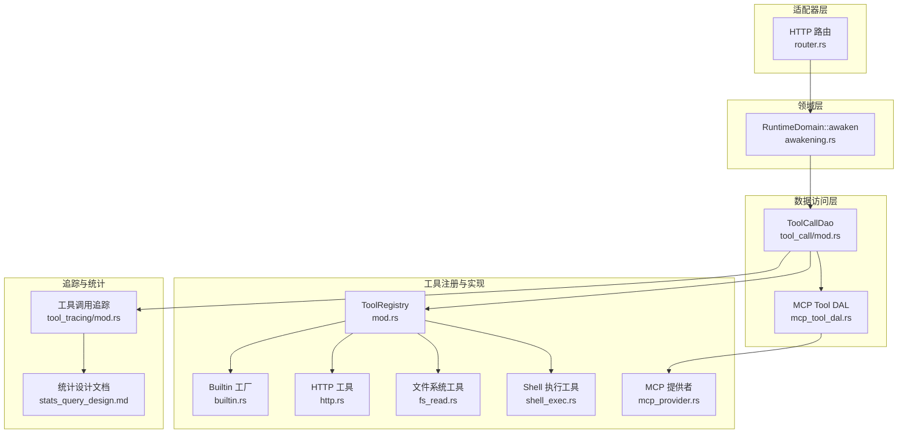
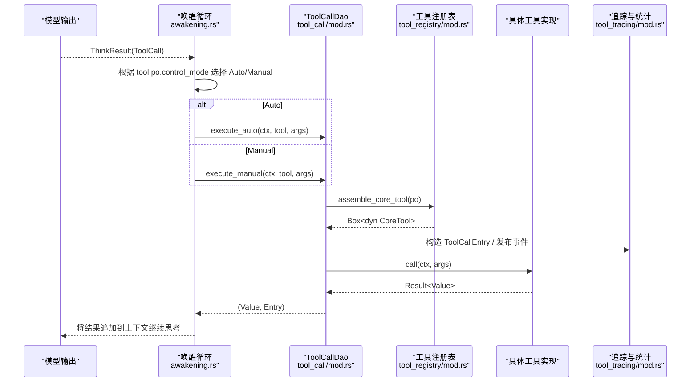
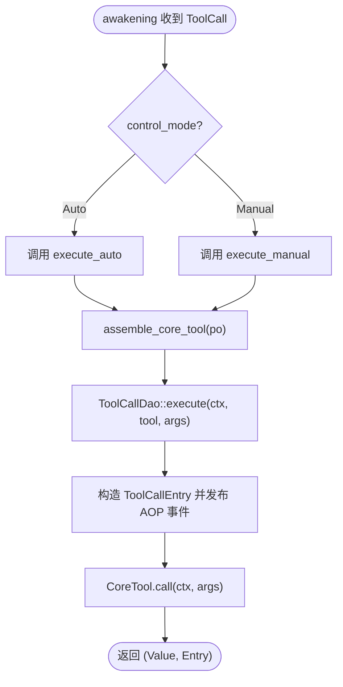
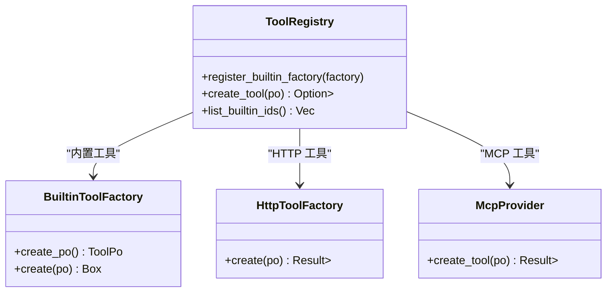
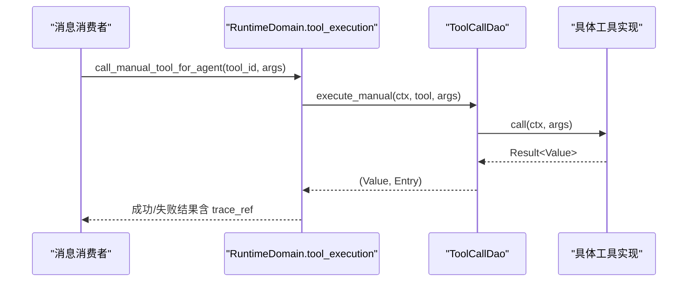
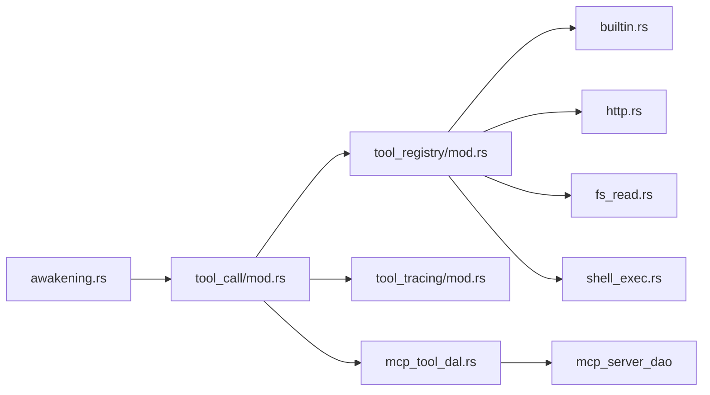

# 统一工具调用架构

<cite>
**本文引用的文件**
- [awakening.rs](file://src/service/domain/runtime/awakening.rs)
- [tool_call/mod.rs](file://src/service/dao/tool_call/mod.rs)
- [tool_call/impl.rs](file://src/service/dao/tool_call/impl.rs)
- [mcp_tool_call.rs](file://src/service/dao/tool_call/mcp.rs)
- [mcp_tool_dal.rs](file://src/service/dal/mcp_tool.rs)
- [tool_registry/mod.rs](file://src/pkg/tool_registry/mod.rs)
- [builtin.rs](file://src/pkg/tool_registry/builtin.rs)
- [http.rs](file://src/pkg/tool_registry/http.rs)
- [fs_read.rs](file://src/pkg/tool_registry/fs_read.rs)
- [shell_exec.rs](file://src/pkg/tool_registry/shell_exec.rs)
- [mcp_provider.rs](file://src/pkg/tool_registry/mcp.rs)
- [tool_tracing/mod.rs](file://src/pkg/tool_tracing/mod.rs)
- [stats_query_design.md](file://docs/stats_query_design.md)
- [generic_builtin_tools_design.md](file://docs/generic_builtin_tools_design.md)
- [router.rs](file://src/router.rs)
</cite>

## 目录
1. [简介](#简介)
2. [项目结构](#项目结构)
3. [核心组件](#核心组件)
4. [架构总览](#架构总览)
5. [详细组件分析](#详细组件分析)
6. [依赖关系分析](#依赖关系分析)
7. [性能与监控](#性能与监控)
8. [故障排查指南](#故障排查指南)
9. [结论](#结论)
10. [附录：工具开发最佳实践](#附录工具开发最佳实践)

## 简介
本文件面向“统一工具调用架构”，系统性说明 Auto（自动）与 Manual（人工）两种调用模式在 Agent 唤醒循环中的三层分发机制，以及工具的注册、发现、权限控制、内置工具使用、MCP 集成、Manual 模式的 internal 转发、工具开发规范与监控统计等。

## 项目结构
围绕工具调用，代码按四层单向调用组织：Adapter → Domain → DAL → DAO；通用能力集中在 pkg 层，业务逻辑在 service 层，HTTP 路由在 handlers/router。

图表来源
- [router.rs:551-585](file://src/router.rs#L551-L585)
- [awakening.rs:250-363](file://src/service/domain/runtime/awakening.rs#L250-L363)
- [tool_call/mod.rs:1-44](file://src/service/dao/tool_call/mod.rs#L1-L44)
- [tool_registry/mod.rs:29-132](file://src/pkg/tool_registry/mod.rs#L29-L132)
- [builtin.rs:1-44](file://src/pkg/tool_registry/builtin.rs#L1-L44)
- [http.rs:1-114](file://src/pkg/tool_registry/http.rs#L1-L114)
- [fs_read.rs:1-255](file://src/pkg/tool_registry/fs_read.rs#L1-L255)
- [shell_exec.rs:1-490](file://src/pkg/tool_registry/shell_exec.rs#L1-L490)
- [mcp_provider.rs:1-26](file://src/pkg/tool_registry/mcp.rs#L1-L26)
- [tool_tracing/mod.rs:1-12](file://src/pkg/tool_tracing/mod.rs#L1-L12)
- [stats_query_design.md:416-465](file://docs/stats_query_design.md#L416-L465)

章节来源
- [router.rs:551-585](file://src/router.rs#L551-L585)
- [awakening.rs:250-363](file://src/service/domain/runtime/awakening.rs#L250-L363)
- [tool_call/mod.rs:1-44](file://src/service/dao/tool_call/mod.rs#L1-L44)
- [tool_registry/mod.rs:29-132](file://src/pkg/tool_registry/mod.rs#L29-L132)

## 核心组件
- 工具调用 DAO（ToolCallDao）：统一的工具执行入口，负责从注册表装配 CoreTool、构造追踪条目、发布 AOP 事件并返回结果与 trace 引用。
- 工具注册表（ToolRegistry）：按协议类型（Builtin/Mcp/Http）管理工厂，根据数据库中的 ToolPo 动态创建可执行工具实例。
- 内置工具工厂（Builtin）：提供 http_fetch、fs_read、fs_write、shell_exec 等通用工具，通过宏或启动时注册到全局注册表。
- HTTP 工具运行时：基于配置驱动的 HTTP 客户端，具备 SSRF 防护、域名白名单/黑名单、响应大小限制、超时控制等安全能力。
- MCP 工具提供者：将数据库中的 MCP 绑定记录转换为可执行工具，连接远程 MCP Server 并调用其工具。
- 工具追踪与统计：统一记录每次工具调用的结构化日志与指标，支持查询与可视化。

章节来源
- [tool_call/mod.rs:1-44](file://src/service/dao/tool_call/mod.rs#L1-L44)
- [tool_registry/mod.rs:29-132](file://src/pkg/tool_registry/mod.rs#L29-L132)
- [builtin.rs:1-44](file://src/pkg/tool_registry/builtin.rs#L1-L44)
- [http.rs:1-114](file://src/pkg/tool_registry/http.rs#L1-L114)
- [mcp_provider.rs:1-26](file://src/pkg/tool_registry/mcp.rs#L1-L26)
- [tool_tracing/mod.rs:1-12](file://src/pkg/tool_tracing/mod.rs#L1-L12)

## 架构总览
Auto 与 Manual 两种模式在 Agent 唤醒循环中由 control_mode 决定分发路径，最终都汇聚到 ToolCallDao 的统一执行原语，再进入具体协议实现。

图表来源
- [awakening.rs:250-363](file://src/service/domain/runtime/awakening.rs#L250-L363)
- [tool_call/mod.rs:1-44](file://src/service/dao/tool_call/mod.rs#L1-L44)
- [tool_call/impl.rs:1-82](file://src/service/dao/tool_call/impl.rs#L1-L82)
- [tool_registry/mod.rs:29-132](file://src/pkg/tool_registry/mod.rs#L29-L132)
- [tool_tracing/mod.rs:1-12](file://src/pkg/tool_tracing/mod.rs#L1-L12)

## 详细组件分析

### 三层分发机制：awakening → call_tool → ToolCallDao::execute + decorate
- 第一层（awakening 循环）：当模型返回 ToolCall 时，按 tool.po.control_mode 分支为 Auto 或 Manual，分别调用对应的 DAL/DAO 方法。
- 第二层（call_tool 直接执行）：DAL/DAO 层将 ToolPo 装配为 CoreTool 实例，准备参数与上下文。
- 第三层（ToolCallDao::execute + decorate）：统一构造追踪条目、发布 AOP 事件、执行工具并返回结果与 trace_ref；错误路径携带 trace 引用以便上层定位。

图表来源
- [awakening.rs:250-363](file://src/service/domain/runtime/awakening.rs#L250-L363)
- [tool_call/mod.rs:1-44](file://src/service/dao/tool_call/mod.rs#L1-L44)
- [tool_call/impl.rs:1-82](file://src/service/dao/tool_call/impl.rs#L1-L82)

章节来源
- [awakening.rs:250-363](file://src/service/domain/runtime/awakening.rs#L250-L363)
- [tool_call/mod.rs:1-44](file://src/service/dao/tool_call/mod.rs#L1-L44)
- [tool_call/impl.rs:1-82](file://src/service/dao/tool_call/impl.rs#L1-L82)

### 工具的注册、发现与权限控制
- 注册：
  - 内置工具通过 BuiltinToolFactory 在启动时注册到全局 ToolRegistry。
  - HTTP 工具为配置驱动，由 HttpToolFactory 根据 ToolPo.config 创建可执行实例。
  - MCP 工具通过 mcp_provider 将数据库绑定记录转为可执行工具。
- 发现：
  - ToolRegistry::create_tool 根据 ToolPo.protocol 分派到对应工厂，返回 Box<dyn CoreTool>。
- 权限与安全：
  - HTTP 工具：URL 方案校验、域名白名单/黑名单、禁止本地网络默认策略、响应大小限制、超时控制。
  - 文件系统工具：路径必须在 base_data_path 或额外允许路径内，越界需显式确认；大文件保护。
  - Shell 执行工具：工作目录受限、环境变量白名单过滤、敏感变量屏蔽、输出大小限制与日志落盘。
  - MCP 工具：仅 Manual 模式，避免自动执行外部服务。

图表来源
- [tool_registry/mod.rs:29-132](file://src/pkg/tool_registry/mod.rs#L29-L132)
- [builtin.rs:1-44](file://src/pkg/tool_registry/builtin.rs#L1-L44)
- [http.rs:1-114](file://src/pkg/tool_registry/http.rs#L1-L114)
- [mcp_provider.rs:1-26](file://src/pkg/tool_registry/mcp.rs#L1-L26)

章节来源
- [tool_registry/mod.rs:29-132](file://src/pkg/tool_registry/mod.rs#L29-L132)
- [builtin.rs:1-44](file://src/pkg/tool_registry/builtin.rs#L1-L44)
- [http.rs:1-114](file://src/pkg/tool_registry/http.rs#L1-L114)
- [mcp_provider.rs:1-26](file://src/pkg/tool_registry/mcp.rs#L1-L26)

### 内置工具使用方法
- 文件系统读取（fs_read）：
  - 支持全文、行范围、grep 匹配与上下文行。
  - 权限：仅允许 base_data_path 及额外允许路径；越界返回 require_confirmation 提示。
  - 大文件保护：超过阈值拒绝读取。
- HTTP 请求（http）：
  - 配置驱动：method/url/query/headers/timeout/response_max_bytes/allowed_domains/blocked_domains/allow_local_network 等。
  - 安全：仅允许受审的 HTTP 方法、严格 URL 方案校验、禁止本地网络默认、响应体大小限制。
- Shell 执行（shell_exec）：
  - 同步/异步（后台）执行命令，输出写入日志文件，支持超时与最大输出限制。
  - 环境变量白名单过滤，敏感变量屏蔽；工作目录限制。

章节来源
- [fs_read.rs:1-255](file://src/pkg/tool_registry/fs_read.rs#L1-L255)
- [http.rs:1-114](file://src/pkg/tool_registry/http.rs#L1-L114)
- [shell_exec.rs:1-490](file://src/pkg/tool_registry/shell_exec.rs#L1-L490)
- [generic_builtin_tools_design.md:311-475](file://docs/generic_builtin_tools_design.md#L311-L475)

### MCP 工具的集成方式
- 数据库绑定：ToolPo.config 存储 server_id 与 tool_name，服务器连接细节在 McpServerPo.config。
- 同步与列表：DAL 提供从远端 MCP Server 同步工具元数据、列出某服务器的工具、失效缓存等方法。
- 执行路径：通过 McpToolDal 组装可执行工具，调用 rmcp 客户端执行远程工具。
- 控制模式：MCP 工具强制 Manual，避免自动执行不可信外部服务。

章节来源
- [mcp_tool_dal.rs:72-330](file://src/service/dal/mcp_tool.rs#L72-L330)
- [mcp_provider.rs:1-26](file://src/pkg/tool_registry/mcp.rs#L1-L26)

### Manual 模式如何通过特殊 internal 工具转发同步/异步调用
- 在消息消费流程中，当需要以 Manual 模式执行工具时，会通过 runtime_domain.tool_execution().call_manual_tool_for_agent(...) 发起调用。
- 该调用会封装为内部工具调用，支持同步等待或异步处理，并将结果通过消息投递回给请求方。
- 错误路径会将错误信息包装为 ToolCallExecutionOutcome::Failure，并附带 trace_ref。

图表来源
- [message.rs:439-477](file://src/consumer/message.rs#L439-L477)
- [tool_call/mod.rs:1-44](file://src/service/dao/tool_call/mod.rs#L1-L44)

章节来源
- [message.rs:439-477](file://src/consumer/message.rs#L439-L477)
- [tool_call/mod.rs:1-44](file://src/service/dao/tool_call/mod.rs#L1-L44)

## 依赖关系分析
- awakening 依赖 ToolCallDao 进行工具执行，不直接感知协议细节。
- ToolCallDao 依赖 ToolRegistry 装配 CoreTool，并依赖 tool_tracing 进行追踪。
- 各协议工具（HTTP/FS/Shell/MCP）通过注册表暴露统一接口，便于替换与扩展。
- MCP 工具 DAL 依赖 MCP Server DAO 与 McpToolCallDao 完成远端工具同步与执行。

图表来源
- [awakening.rs:250-363](file://src/service/domain/runtime/awakening.rs#L250-L363)
- [tool_call/mod.rs:1-44](file://src/service/dao/tool_call/mod.rs#L1-L44)
- [tool_registry/mod.rs:29-132](file://src/pkg/tool_registry/mod.rs#L29-L132)
- [tool_tracing/mod.rs:1-12](file://src/pkg/tool_tracing/mod.rs#L1-L12)
- [mcp_tool_dal.rs:72-330](file://src/service/dal/mcp_tool.rs#L72-L330)

章节来源
- [awakening.rs:250-363](file://src/service/domain/runtime/awakening.rs#L250-L363)
- [tool_call/mod.rs:1-44](file://src/service/dao/tool_call/mod.rs#L1-L44)
- [tool_registry/mod.rs:29-132](file://src/pkg/tool_registry/mod.rs#L29-L132)
- [mcp_tool_dal.rs:72-330](file://src/service/dal/mcp_tool.rs#L72-L330)

## 性能与监控
- 工具调用统计：
  - 在工具执行链路中统一发送 ToolCallEvent，包含工具 ID、名称、Agent ID、参数/结果长度、耗时、状态等。
  - 支持查询调用摘要、失败计数、时间序列等指标。
- 日志记录：
  - 工具调用日志采用每日 JSONL 格式持久化，便于审计与回溯。
  - HTTP/MCP 工具对敏感值进行脱敏处理。
- 性能建议：
  - 合理设置 HTTP 超时与响应大小限制，避免长尾请求阻塞。
  - Shell 执行使用后台模式与日志落盘，避免阻塞主线程。
  - 文件系统读取限制文件大小，避免 OOM。

章节来源
- [stats_query_design.md:416-465](file://docs/stats_query_design.md#L416-L465)
- [tool_tracing/mod.rs:1-12](file://src/pkg/tool_tracing/mod.rs#L1-L12)
- [http.rs:1-114](file://src/pkg/tool_registry/http.rs#L1-L114)
- [shell_exec.rs:1-490](file://src/pkg/tool_registry/shell_exec.rs#L1-L490)
- [fs_read.rs:1-255](file://src/pkg/tool_registry/fs_read.rs#L1-L255)

## 故障排查指南
- 工具未找到：
  - 检查 agent.tools 是否包含对应工具，或 ToolPo 是否正确注册。
- HTTP 工具失败：
  - 检查 URL 方案与方法是否受支持，域名是否在白名单，是否误触本地网络限制。
- 文件系统工具拒绝：
  - 确认路径是否在 base_data_path 或额外允许路径；如需越界，需显式确认。
- Shell 执行超时或失败：
  - 检查超时配置、工作目录权限、环境变量白名单；查看日志文件定位问题。
- MCP 工具不可用：
  - 确认 MCP Server 已启用且可连接；工具元数据已同步；工具处于 Enabled 状态。

章节来源
- [http.rs:1-114](file://src/pkg/tool_registry/http.rs#L1-L114)
- [fs_read.rs:1-255](file://src/pkg/tool_registry/fs_read.rs#L1-L255)
- [shell_exec.rs:1-490](file://src/pkg/tool_registry/shell_exec.rs#L1-L490)
- [mcp_tool_dal.rs:72-330](file://src/service/dal/mcp_tool.rs#L72-L330)

## 结论
统一工具调用架构通过“awakening → call_tool → ToolCallDao::execute”的三层分发，将 Auto 与 Manual 模式统一到一致的执行原语，结合注册表与协议实现，实现了工具的可插拔、可观测与安全可控。内置工具覆盖常见场景，MCP 提供外部工具集成能力，配合追踪与统计，形成完整的工具生态。

## 附录：工具开发最佳实践
- 工具接口定义：
  - 实现 CoreTool 接口，提供 call(ctx, args) 与 po() 方法。
  - 使用 ToolPo 描述工具元数据（名称、描述、参数 Schema、协议、控制模式）。
- 参数验证：
  - 在 call 中解析并校验参数，返回明确的错误信息；必要时返回 require_confirmation 提示。
- 错误处理：
  - 使用统一错误类型，确保错误链携带 trace_ref；对外错误脱敏。
- 安全控制：
  - 网络工具：限制 URL 方案、域名白名单/黑名单、禁止本地网络默认、响应大小限制。
  - 文件系统：路径限制、大文件保护、符号链接拒绝。
  - Shell：工作目录限制、环境变量白名单、敏感变量屏蔽、超时与输出限制。
- 监控与日志：
  - 通过 ToolCallDao 统一记录调用轨迹与指标；遵循日志脱敏规范。
- 测试建议：
  - 覆盖正常路径、边界条件、安全拒绝路径；使用内存数据库与模拟网络环境。

章节来源
- [tool_call/mod.rs:1-44](file://src/service/dao/tool_call/mod.rs#L1-L44)
- [http.rs:1-114](file://src/pkg/tool_registry/http.rs#L1-L114)
- [fs_read.rs:1-255](file://src/pkg/tool_registry/fs_read.rs#L1-L255)
- [shell_exec.rs:1-490](file://src/pkg/tool_registry/shell_exec.rs#L1-L490)
- [generic_builtin_tools_design.md:311-475](file://docs/generic_builtin_tools_design.md#L311-L475)
- [stats_query_design.md:416-465](file://docs/stats_query_design.md#L416-L465)