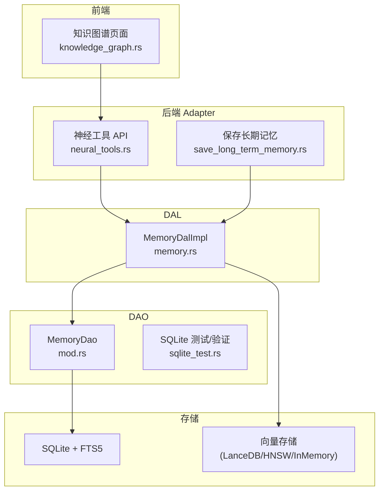
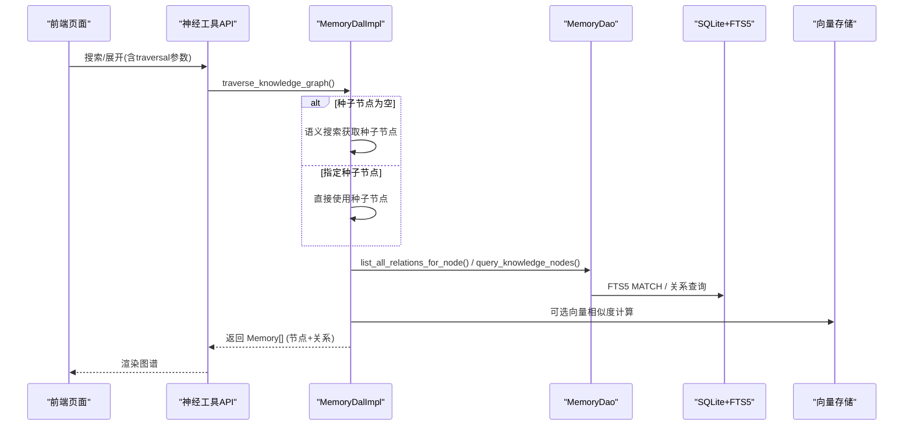
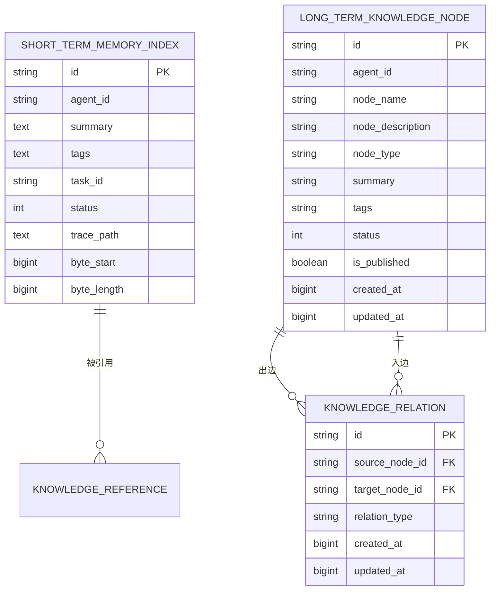
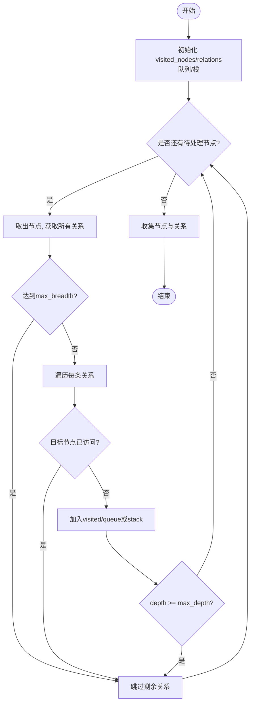
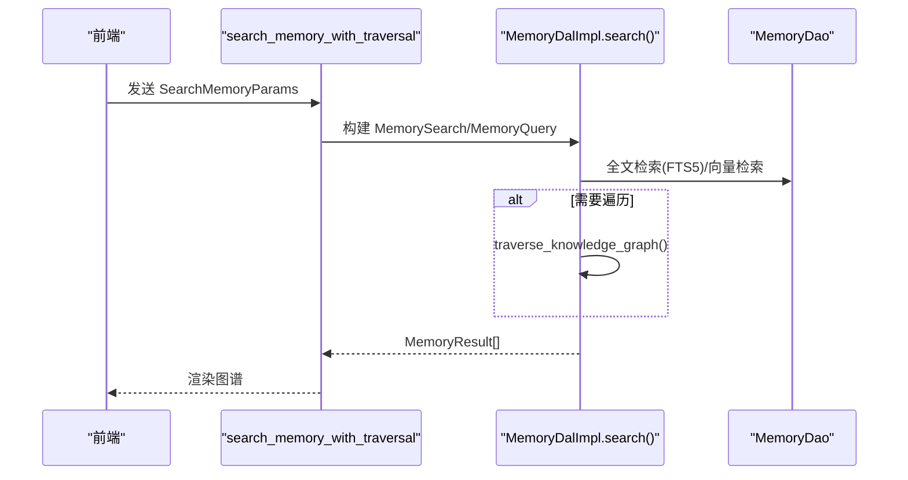
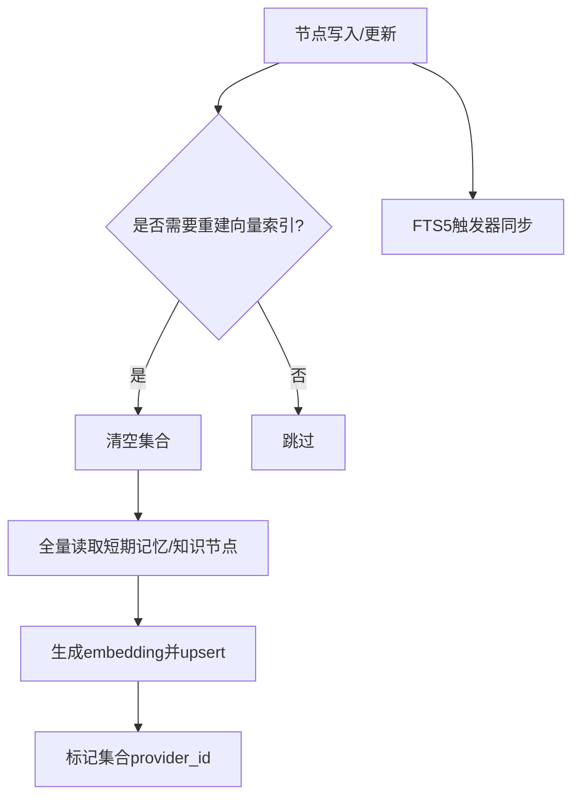
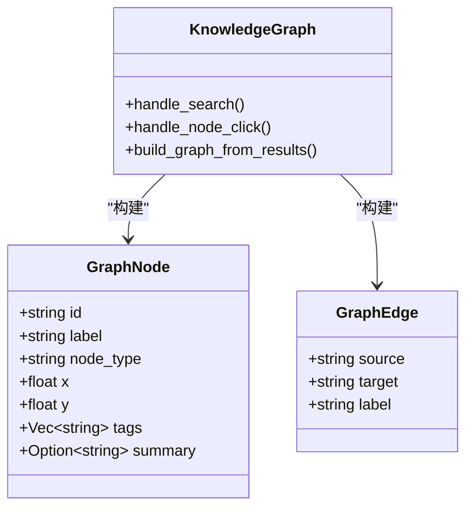
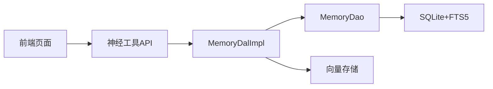

# 知识图谱搜索

<cite>
**本文引用的文件**
- [memory.rs](file://src/service/dal/memory.rs)
- [mod.rs（Memory DAO）](file://src/service/dao/memory/mod.rs)
- [sqlite_test.rs](file://src/service/dao/memory/sqlite_test.rs)
- [neural_tools.rs](file://common/src/api/neural_tools.rs)
- [knowledge_graph.rs（前端页面）](file://frontend/src/pages/hr/knowledge_graph.rs)
- [20260724000000_knowledge_node_tags.sql](file://migrations/20260724000000_knowledge_node_tags.sql)
- [save_long_term_memory.rs](file://src/handlers/hr/agent/save_long_term_memory.rs)
- [graph_test.rs](file://src/pkg/utils/graph/graph_test.rs)
</cite>

## 目录
1. [简介](#简介)
2. [项目结构](#项目结构)
3. [核心组件](#核心组件)
4. [架构总览](#架构总览)
5. [详细组件分析](#详细组件分析)
6. [依赖关系分析](#依赖关系分析)
7. [性能与优化](#性能与优化)
8. [故障排查指南](#故障排查指南)
9. [结论](#结论)
10. [附录：API 使用示例](#附录api-使用示例)

## 简介
本技术文档围绕“知识图谱搜索”能力，系统阐述数据模型、遍历算法、查询语言与解析机制、索引构建与维护、性能优化策略、缓存与分布式扩展方案，以及可视化渲染与前端集成。该功能基于四层单向调用架构（Adapter → Domain → DAL → DAO），DAL 层实现跨 DAO 流程编排，DAO 层负责 SQLite 持久化与向量存储，Domain 层对外暴露业务实体与事件，Adapter 层提供 HTTP Handler 与神经工具接口。

## 项目结构
知识图谱搜索涉及后端 DAL/DAO、前端页面与迁移脚本等关键位置：
- DAL 层：记忆数据访问与图谱遍历（BFS/DFS）、混合搜索、推荐起点、重建向量索引等
- DAO 层：短期记忆索引、长期知识节点、引用与关系、FTS5 全文检索、向量索引 CRUD
- 前端：知识图谱页面、节点展开、Canvas/SVG 双渲染、推荐起点展示
- 迁移：为知识节点新增 tags 字段并重建 FTS5 索引
- 神经工具：保存长/短期记忆、搜索记忆（含遍历参数）

**图表来源**
- [memory.rs:1-177](file://src/service/dal/memory.rs#L1-L177)
- [mod.rs（Memory DAO）:1-583](file://src/service/dao/memory/mod.rs#L1-L583)
- [knowledge_graph.rs:1-759](file://frontend/src/pages/hr/knowledge_graph.rs#L1-L759)
- [neural_tools.rs:1-449](file://common/src/api/neural_tools.rs#L1-L449)
- [save_long_term_memory.rs:40-109](file://src/handlers/hr/agent/save_long_term_memory.rs#L40-L109)

**章节来源**
- [memory.rs:1-177](file://src/service/dal/memory.rs#L1-L177)
- [mod.rs（Memory DAO）:1-583](file://src/service/dao/memory/mod.rs#L1-L583)
- [knowledge_graph.rs:1-759](file://frontend/src/pages/hr/knowledge_graph.rs#L1-L759)
- [neural_tools.rs:1-449](file://common/src/api/neural_tools.rs#L1-L449)
- [save_long_term_memory.rs:40-109](file://src/handlers/hr/agent/save_long_term_memory.rs#L40-L109)

## 核心组件
- 遍历策略枚举与状态封装：支持 BFS/DFS，维护 visited_nodes/visited_relations/result_relations
- MemoryDalImpl：统一混合搜索、推荐起点、创建/更新/删除、图谱遍历、沉淀短期到长期、重建向量索引
- MemoryDao：短期记忆索引、长期知识节点、引用与关系、批量查询、FTS5 全文检索
- 前端 KnowledgeGraph：搜索、推荐起点、点击节点展开子图、Canvas/SVG 切换、详情面板

**章节来源**
- [memory.rs:25-37](file://src/service/dal/memory.rs#L25-L37)
- [memory.rs:126-177](file://src/service/dal/memory.rs#L126-L177)
- [mod.rs（Memory DAO）:13-58](file://src/service/dao/memory/mod.rs#L13-L58)
- [knowledge_graph.rs:17-22](file://frontend/src/pages/hr/knowledge_graph.rs#L17-L22)

## 架构总览
知识图谱搜索的端到端流程如下：
- 前端发起搜索或节点展开请求，携带 traversal_depth/traversal_breadth/strategy/seed_node_ids/tags 等参数
- DAL 层根据策略执行 BFS/DFS，聚合节点与关系，返回 Memory 列表
- DAO 层通过 SQLite 查询节点与关系，结合 FTS5 与向量存储进行混合检索
- 前端将结果转换为 GraphNode/GraphEdge，使用 Canvas 或 SVG 渲染

**图表来源**
- [memory.rs:518-576](file://src/service/dal/memory.rs#L518-L576)
- [mod.rs（Memory DAO）:396-448](file://src/service/dao/memory/mod.rs#L396-L448)
- [knowledge_graph.rs:163-239](file://frontend/src/pages/hr/knowledge_graph.rs#L163-L239)

## 详细组件分析

### 数据结构设计
- 节点类型
  - 短期记忆索引：用于快速检索与向量化摘要
  - 长期知识节点：包含名称、描述、类型、摘要、标签、状态、是否发布等
  - 关系：源节点 ID、目标节点 ID、关系类型、时间戳
- 属性存储
  - 短期记忆：summary、tags、task_id、status、trace 定位信息
  - 长期知识节点：node_name、node_description、node_type、summary、tags、status、is_published
  - 关系：relation_type（枚举映射）、source/target 节点 ID
- 索引与检索
  - FTS5 虚拟表对 node_name、summary、node_description、tags 建立 trigram 分词索引
  - 向量存储支持短期记忆与知识节点的 embedding 索引，支持多后端降级

**图表来源**
- [mod.rs（Memory DAO）:203-486](file://src/service/dao/memory/mod.rs#L203-L486)
- [20260724000000_knowledge_node_tags.sql:1-77](file://migrations/20260724000000_knowledge_node_tags.sql#L1-L77)

**章节来源**
- [mod.rs（Memory DAO）:13-58](file://src/service/dao/memory/mod.rs#L13-L58)
- [20260724000000_knowledge_node_tags.sql:1-77](file://migrations/20260724000000_knowledge_node_tags.sql#L1-L77)

### 图谱遍历算法
- 广度优先搜索（BFS）
  - 从种子节点出发，逐层扩展邻居，记录已访问节点与关系，限制每层最大展开数
  - 适合发现“近邻关联”，避免过深分支
- 深度优先搜索（DFS）
  - 使用栈按深度优先深入，同样限制最大深度与每层展开数
  - 适合探索“深层链路”
- 最短路径查找
  - 当前实现未直接提供通用最短路径算法；可通过 BFS 在无权图中获得最少跳数的路径（需在上层记录前驱以回溯路径）

**图表来源**
- [memory.rs:518-576](file://src/service/dal/memory.rs#L518-L576)
- [memory.rs:879-926](file://src/service/dal/memory.rs#L879-L926)

**章节来源**
- [memory.rs:25-37](file://src/service/dal/memory.rs#L25-L37)
- [memory.rs:518-576](file://src/service/dal/memory.rs#L518-L576)
- [memory.rs:879-926](file://src/service/dal/memory.rs#L879-L926)

### 查询语言与解析机制
- 查询参数（SearchMemoryParams）
  - query：关键词（FTS5 匹配）
  - memory_type：过滤记忆类型
  - traversal_depth/traversal_breadth/strategy：控制图谱遍历
  - seed_node_ids：跳过语义搜索，直接以给定节点为起点
  - tags/task_id/agent_id：业务过滤条件
- 解析与路由
  - 前端构造 SearchMemoryParams，调用 search_memory_with_traversal
  - 后端 Handler 将参数转为 DAL 层的 MemorySearch/MemoryQuery，组合 FTS5 与向量检索
  - 若 traversal_depth > 0，则调用 traverse_knowledge_graph 进行遍历

**图表来源**
- [neural_tools.rs:8-32](file://common/src/api/neural_tools.rs#L8-L32)
- [knowledge_graph.rs:163-239](file://frontend/src/pages/hr/knowledge_graph.rs#L163-L239)
- [memory.rs:190-276](file://src/service/dal/memory.rs#L190-L276)

**章节来源**
- [neural_tools.rs:8-32](file://common/src/api/neural_tools.rs#L8-L32)
- [knowledge_graph.rs:163-239](file://frontend/src/pages/hr/knowledge_graph.rs#L163-L239)
- [memory.rs:190-276](file://src/service/dal/memory.rs#L190-L276)

### API 使用示例
- 节点发现
  - 使用 search_memory_with_traversal，传入 query/tags/agent_id，设置 traversal_depth=0 仅做检索
- 关系查询
  - 使用 query_memory 或 search_memory_with_traversal，设置 memory_type="relation"，配合 tags/task_id 过滤
- 子图提取
  - 使用 search_memory_with_traversal，设置 traversal_depth>0、strategy="breadth_first"/"depth_first"、seed_node_ids 指定起点，返回节点与关系集合

**章节来源**
- [neural_tools.rs:8-32](file://common/src/api/neural_tools.rs#L8-L32)
- [knowledge_graph.rs:163-239](file://frontend/src/pages/hr/knowledge_graph.rs#L163-L239)
- [memory.rs:190-276](file://src/service/dal/memory.rs#L190-L276)

### 索引构建与维护
- 节点标签索引
  - 为 long_term_knowledge_node.tags 添加 B-tree 索引，便于按标签过滤
- 关系类型索引
  - 关系表通过 source/target 列及关系类型进行查询，可在 DAO 层按类型筛选
- 属性值索引
  - FTS5 虚拟表对 node_name、summary、node_description、tags 建立 trigram 分词索引
  - 向量存储维护短期记忆与知识节点的 embedding 索引，支持多后端降级
- 维护策略
  - 创建/更新节点时自动同步 FTS5（触发器）
  - 重建向量索引：清空集合后全量重新嵌入并 upsert，失败单条不影响整体

**图表来源**
- [memory.rs:654-799](file://src/service/dal/memory.rs#L654-L799)
- [20260724000000_knowledge_node_tags.sql:1-77](file://migrations/20260724000000_knowledge_node_tags.sql#L1-L77)

**章节来源**
- [memory.rs:654-799](file://src/service/dal/memory.rs#L654-L799)
- [20260724000000_knowledge_node_tags.sql:1-77](file://migrations/20260724000000_knowledge_node_tags.sql#L1-L77)

### 可视化渲染支持与前端集成
- 渲染风格
  - Canvas：HUD 驾驶舱风格，适合大规模节点
  - SVG：兜底方案，适合少量节点
- 交互
  - 搜索历史、推荐起点、节点点击展开子图、选中节点高亮、详情面板
- 数据转换
  - 将 MemoryResult 转换为 GraphNode/GraphEdge，去重与布局计算

**图表来源**
- [knowledge_graph.rs:24-88](file://frontend/src/pages/hr/knowledge_graph.rs#L24-L88)
- [knowledge_graph.rs:113-162](file://frontend/src/pages/hr/knowledge_graph.rs#L113-L162)

**章节来源**
- [knowledge_graph.rs:17-22](file://frontend/src/pages/hr/knowledge_graph.rs#L17-L22)
- [knowledge_graph.rs:24-88](file://frontend/src/pages/hr/knowledge_graph.rs#L24-L88)
- [knowledge_graph.rs:113-162](file://frontend/src/pages/hr/knowledge_graph.rs#L113-L162)

## 依赖关系分析
- DAL 依赖 DAO 与向量存储
- DAO 依赖 SQLite 与 FTS5
- 前端依赖后端 API（神经工具）
- 迁移脚本影响数据库结构与索引

**图表来源**
- [memory.rs:1-177](file://src/service/dal/memory.rs#L1-L177)
- [mod.rs（Memory DAO）:1-583](file://src/service/dao/memory/mod.rs#L1-L583)
- [knowledge_graph.rs:1-759](file://frontend/src/pages/hr/knowledge_graph.rs#L1-L759)

**章节来源**
- [memory.rs:1-177](file://src/service/dal/memory.rs#L1-L177)
- [mod.rs（Memory DAO）:1-583](file://src/service/dao/memory/mod.rs#L1-L583)
- [knowledge_graph.rs:1-759](file://frontend/src/pages/hr/knowledge_graph.rs#L1-L759)

## 性能与优化
- 遍历控制
  - max_depth 限制遍历深度，max_breadth 限制每层展开数量，避免指数级增长
- 混合搜索排序
  - Hybrid > Vector > Keyword/None，组内按向量距离或 BM25 排序
- 向量索引降级
  - Embedding Provider 不可用时跳过向量化，主流程不受影响
- 并发与防抖
  - 前端点击节点时使用 request_id 丢弃过期结果，避免竞态
- 内存与缓存
  - detail_map 限制大小（如超过 200 清理），减少内存占用
- 分布式扩展建议
  - 向量存储可横向扩展（LanceDB/HNSW 集群）
  - SQLite 作为单机存储，读写瓶颈时可考虑分库分表或引入只读副本
  - 遍历逻辑可并行化（按种子节点分片），但需注意去重与一致性

[本节为通用指导，不直接分析具体文件]

## 故障排查指南
- 向量索引失败
  - 日志中记录 warn，主流程继续；检查 Embedding Provider 配置与可用性
- FTS5 索引不同步
  - 确认触发器存在且生效；必要时重建 FTS5 虚拟表
- 关系查询为空
  - 检查 source/target 节点是否存在；确认关系类型映射正确
- 前端渲染异常
  - 切换 Canvas/SVG 对比；检查节点/边数据格式与去重逻辑

**章节来源**
- [memory.rs:401-461](file://src/service/dal/memory.rs#L401-L461)
- [memory.rs:654-799](file://src/service/dal/memory.rs#L654-L799)
- [sqlite_test.rs:957-988](file://src/service/dao/memory/sqlite_test.rs#L957-L988)
- [knowledge_graph.rs:241-325](file://frontend/src/pages/hr/knowledge_graph.rs#L241-L325)

## 结论
知识图谱搜索在本项目中实现了从数据建模、遍历算法、查询语言、索引维护到前端可视化的完整闭环。通过 BFS/DFS 遍历、FTS5 与向量混合检索、推荐起点与标签过滤，提供了灵活高效的图谱探索能力。后续可进一步引入最短路径算法、并行遍历与分布式向量存储，以提升大规模图谱下的性能与可扩展性。

[本节为总结，不直接分析具体文件]

## 附录：API 使用示例
- 保存长期记忆（含关系）
  - 调用 save_long_term_memory，传入 node_name/node_description/node_type/tags/relations
  - 后端创建知识节点与关系，返回 node_id 与 relation_ids
- 搜索记忆（含遍历）
  - 调用 search_memory_with_traversal，传入 query/tags/agent_id/traversal_depth/traversal_breadth/strategy/seed_node_ids
  - 返回 MemoryResult[]，前端构建图谱并渲染
- 推荐起点
  - 调用 recommend_seed_nodes，传入 agent_id/limit，返回按度数排序的候选节点

**章节来源**
- [save_long_term_memory.rs:40-109](file://src/handlers/hr/agent/save_long_term_memory.rs#L40-L109)
- [neural_tools.rs:8-32](file://common/src/api/neural_tools.rs#L8-L32)
- [knowledge_graph.rs:141-162](file://frontend/src/pages/hr/knowledge_graph.rs#L141-L162)