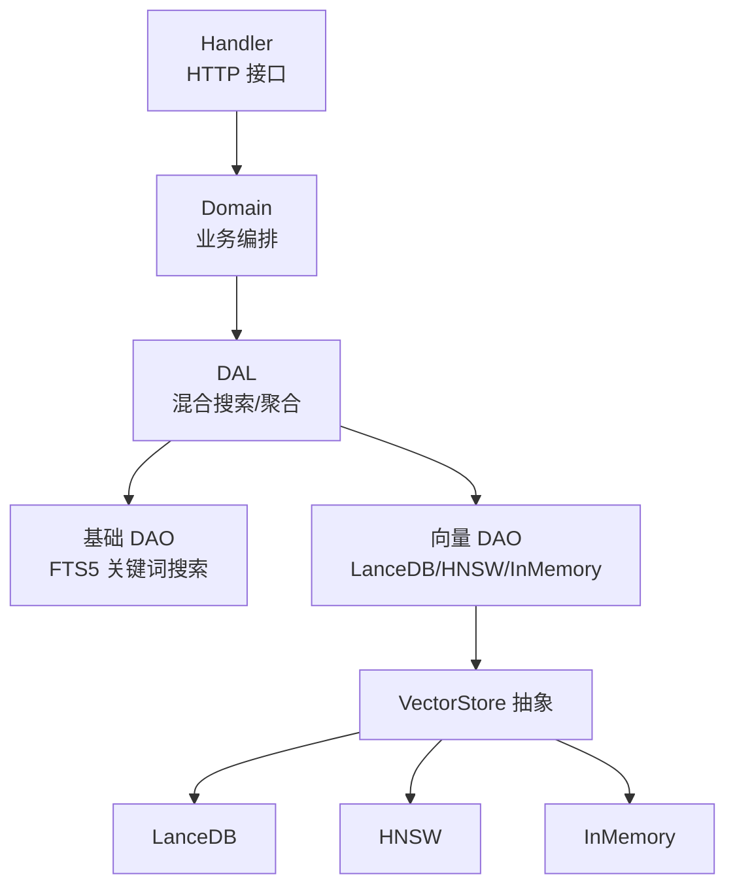
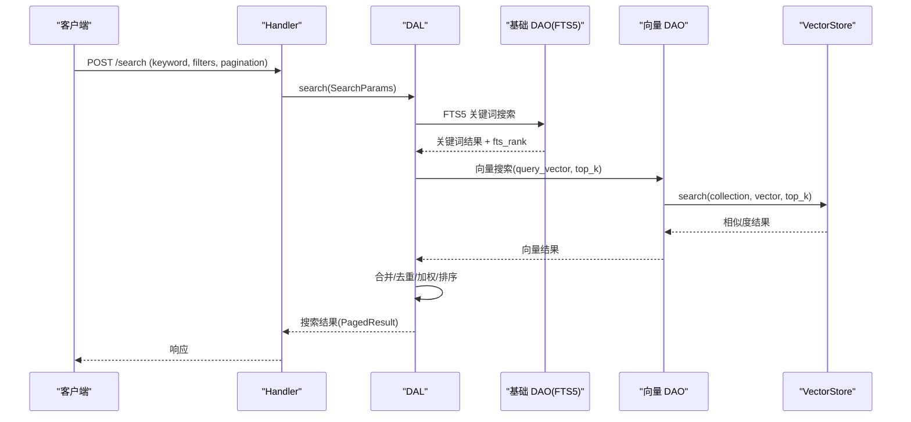
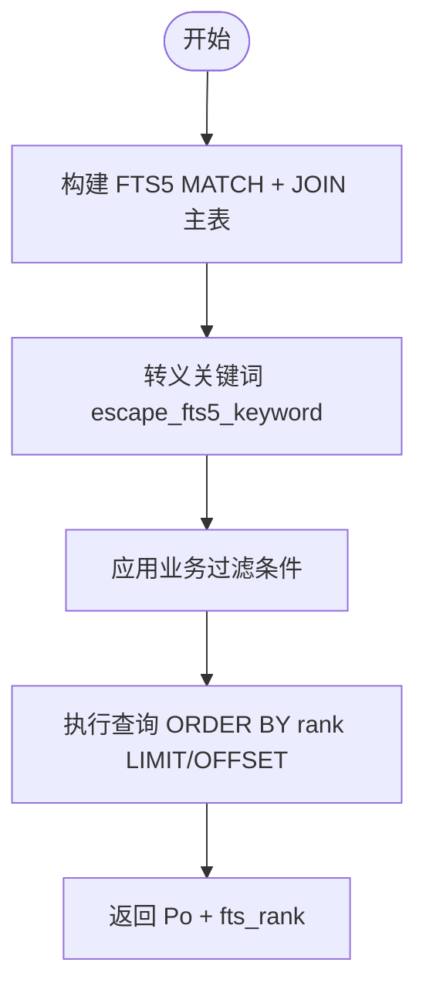
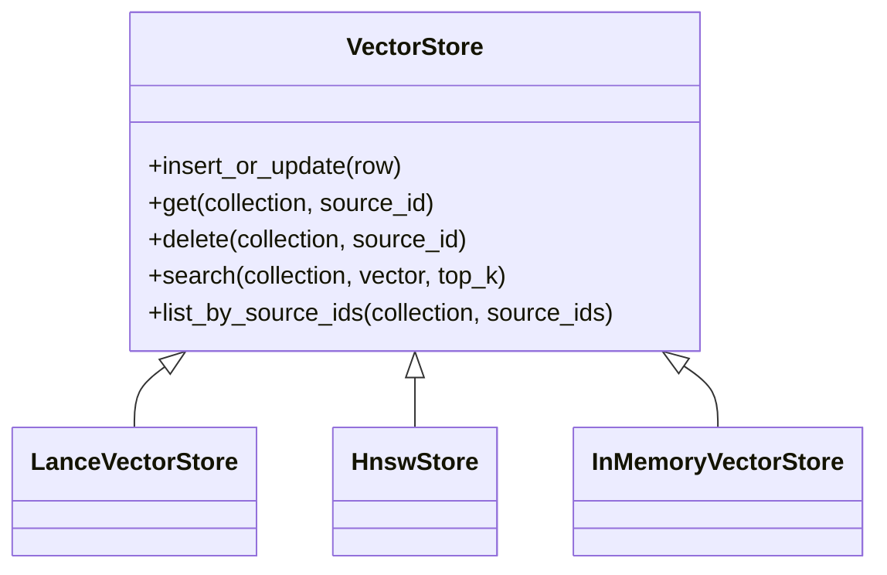
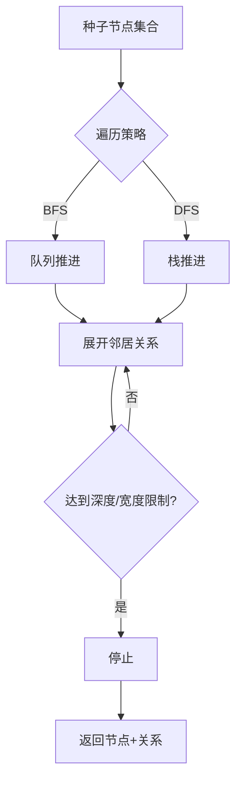
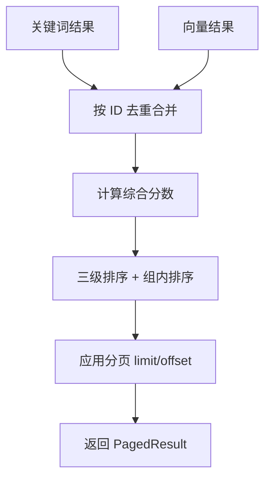
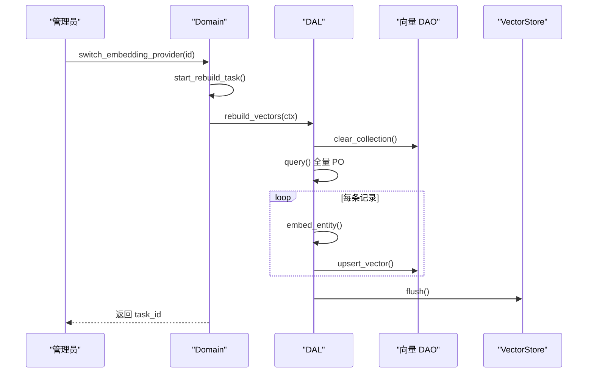
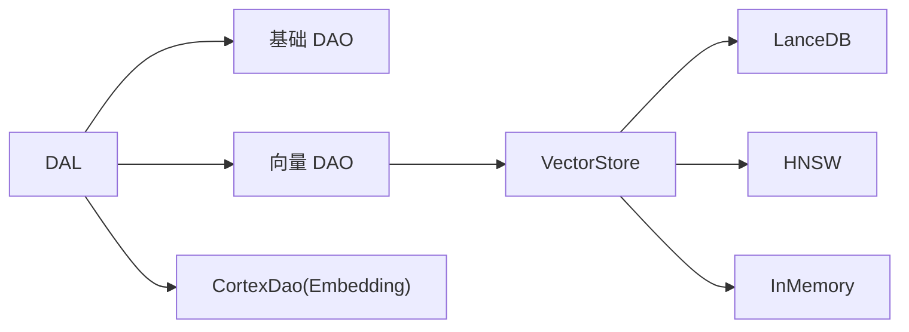

# 综合搜索能力

<cite>
**本文引用的文件**
- [vector_search_architecture.md](file://docs/vector_search_architecture.md)
- [2026-07-16-vector-search-enhancement.md](file://docs/superpowers/plans/2026-07-16-vector-search-enhancement.md)
- [2026-08-01-unify-project-search.md](file://docs/superpowers/plans/2026-08-01-unify-project-search.md)
- [2026-07-24-query-pagination.md](file://docs/superpowers/plans/2026-07-24-query-pagination.md)
- [memory.rs](file://src/service/dal/memory.rs)
- [message.rs](file://src/service/dal/message.rs)
- [task.rs](file://src/service/dal/task.rs)
- [project.rs](file://src/service/dal/project.rs)
- [skill.rs](file://src/service/dal/skill.rs)
- [search_skills.rs](file://src/handlers/hr/skill/search_skills.rs)
- [search_messages.rs](file://src/handlers/finance/message/search_messages.rs)
- [lance.rs](file://src/pkg/storage/lance.rs)
- [mod.rs（Memory DAO）](file://src/service/dao/memory/mod.rs)
- [sqlite_test.rs（Project FTS5）](file://src/service/dao/project/sqlite_test.rs)
- [memory_test.rs（集成测试）](file://tests/integration/memory_test.rs)
</cite>

## 目录
1. [简介](#简介)
2. [项目结构](#项目结构)
3. [核心组件](#核心组件)
4. [架构总览](#架构总览)
5. [详细组件分析](#详细组件分析)
6. [依赖关系分析](#依赖关系分析)
7. [性能与优化](#性能与优化)
8. [故障排查指南](#故障排查指南)
9. [结论](#结论)
10. [附录：API 使用示例](#附录api-使用示例)

## 简介
本技术文档围绕“综合搜索能力”展开，系统阐述三种搜索方式及其组合：
- FTS5 关键词搜索：基于 SQLite FTS5 + trigram 分词器，支持中英文关键词匹配与 BM25 相关性排序。
- 向量语义搜索：通过 Embedding 模型将文本转为向量，使用 LanceDB/HNSW/InMemory 等后端进行相似度检索。
- 知识图谱搜索：以记忆系统中的短期记忆与长期知识节点为实体，通过关系边进行广度/深度遍历，实现“从种子节点出发”的关联检索。

同时说明混合搜索的权重计算、结果合并与去重策略；索引构建与维护（增量更新、批量重建、异步化与并发控制）；搜索结果的相关性排序、分页处理与缓存策略；以及监控、调优与扩展自定义字段的方法。

## 项目结构
搜索能力贯穿 Handler → Domain → DAL → DAO → Storage 各层，遵循单向调用与职责分离原则：
- Handler 层：接收请求参数，构造 Search/Query 对象并调用 Domain/DAL。
- Domain 层：业务编排与规则校验（如切换 Embedding Provider）。
- DAL 层：组合基础 DAO 与向量 DAO，实现混合搜索、结果聚合与排序。
- DAO 层：基础数据 CRUD 与 FTS5 关键词搜索；向量 DAO 仅负责向量索引操作。
- Storage 层：通用存储抽象（VectorStore trait），封装 LanceDB/HNSW/InMemory 等后端。

图表来源
- [vector_search_architecture.md:46-68](file://docs/vector_search_architecture.md#L46-L68)
- [lance.rs:1-41](file://src/pkg/storage/lance.rs#L1-L41)

章节来源
- [vector_search_architecture.md:46-68](file://docs/vector_search_architecture.md#L46-L68)

## 核心组件
- FTS5 关键词搜索：通过 SQLite FTS5 虚拟表与触发器自动维护索引，支持 trigram 中文分词，返回 BM25 相关性评分（fts_rank）。
- 向量语义搜索：DAL 层根据 keyword 生成 query_vector，调用 VectorDao.search_vector 获取候选 ID，再回查主表得到完整实体。
- 知识图谱搜索：DAL 提供 traverse_knowledge_graph，支持 BFS/DFS 两种策略，限制 max_depth 与 max_breadth 控制遍历范围。
- 混合搜索：DAL 统一入口 search()，先并行执行 FTS5 与向量搜索，再按 Hybrid > Vector > Keyword 三级排序，组内分别按 vector_distance 或 fts_rank 细排。

章节来源
- [memory.rs:72-177](file://src/service/dal/memory.rs#L72-L177)
- [vector_search_architecture.md:72-130](file://docs/vector_search_architecture.md#L72-L130)

## 架构总览
混合搜索采用“三态匹配”模型，每个结果携带 match_type（Hybrid/Vector/Keyword）与相关元信息（fts_rank、vector_distance、embedding_model、indexed_at）。DAL 层负责：
- 选择搜索策略（keyword → FTS5；query_vector → 向量；两者都有 → 混合）
- 结果合并与去重（HashMap 按 id 去重，累加分数）
- 三级排序与组内排序
- 降级策略（向量失败时降级到纯关键词搜索）

图表来源
- [message.rs:493-579](file://src/service/dal/message.rs#L493-L579)
- [vector_search_architecture.md:97-130](file://docs/vector_search_architecture.md#L97-L130)

章节来源
- [message.rs:493-579](file://src/service/dal/message.rs#L493-L579)
- [vector_search_architecture.md:97-130](file://docs/vector_search_architecture.md#L97-L130)

## 详细组件分析

### FTS5 关键词搜索
- 原理：SQLite FTS5 虚拟表对指定列建立倒排索引，MATCH 查询返回 BM25 相关性评分（rank 越小越相关）。
- 中文支持：启用 trigram 分词器，满足中文关键词检索需求。
- 维护：通过数据库触发器在 INSERT/UPDATE/DELETE 时自动同步 FTS5 索引。
- 过滤与安全：使用 escape_fts5_keyword 转义关键字，避免 SQL 注入与 MATCH 语法错误；结合 push_query_filters 应用 root_user_id/status_in/owner_agent_id/ids 等业务过滤条件。

图表来源
- [2026-08-01-unify-project-search.md:93-205](file://docs/superpowers/plans/2026-08-01-unify-project-search.md#L93-L205)
- [sqlite_test.rs（Project FTS5）:390-429](file://src/service/dao/project/sqlite_test.rs#L390-L429)

章节来源
- [2026-08-01-unify-project-search.md:93-205](file://docs/superpowers/plans/2026-08-01-unify-project-search.md#L93-L205)
- [sqlite_test.rs（Project FTS5）:390-429](file://src/service/dao/project/sqlite_test.rs#L390-L429)

### 向量语义搜索
- 原理：将文本通过 Embedding 模型转换为高维向量，使用 LanceDB/HNSW/InMemory 进行相似度检索（余弦距离）。
- 后端：默认 LanceDB（生产级高性能），支持 InMemory（测试/小数据集）、HNSW（纯 Rust，lazy rebuild）、SqliteVss（可选）。
- 生命周期：创建/更新时 upsert 向量；删除/归档时清理向量索引；内容未变化时通过 content_hash 跳过重复向量化。
- 降级：向量不可用时降级到 FTS5 关键词搜索，不影响主流程。

图表来源
- [vector_search_architecture.md:161-203](file://docs/vector_search_architecture.md#L161-L203)
- [lance.rs:1-41](file://src/pkg/storage/lance.rs#L1-L41)

章节来源
- [vector_search_architecture.md:161-203](file://docs/vector_search_architecture.md#L161-L203)
- [lance.rs:1-41](file://src/pkg/storage/lance.rs#L1-L41)

### 知识图谱搜索
- 原理：以短期记忆与长期知识节点为实体，通过关系边进行遍历（BFS/DFS），支持 max_depth 与 max_breadth 控制。
- 用途：从种子节点出发探索关联网络，或追溯因果链/前置关系。
- 实现：DAL 层提供 traverse_knowledge_graph，内部维护 visited_nodes/visited_relations 避免重复访问。

图表来源
- [memory.rs:843-952](file://src/service/dal/memory.rs#L843-L952)

章节来源
- [memory.rs:843-952](file://src/service/dal/memory.rs#L843-L952)

### 混合搜索与权重计算
- 三态匹配：Hybrid（双命中）> Vector（仅语义）> Keyword（仅关键词）。
- 权重与合并：
  - 关键词结果按位置赋予权重（例如 keyword_weight * (1 - i/len)）。
  - 向量结果按位置赋予权重（例如 vector_weight * (1 - i/len)）。
  - 同一 ID 的结果合并，match_type 升级为 Hybrid，累加分数。
- 排序：
  - 三级分组排序：Hybrid 优先，其次 Vector，最后 Keyword。
  - 组内排序：Hybrid/Vector 按 vector_distance 升序；Keyword 按 fts_rank 升序。
- 阈值：可配置向量距离阈值（默认 0.8），低于阈值的向量结果才纳入。

图表来源
- [message.rs:520-572](file://src/service/dal/message.rs#L520-L572)
- [vector_search_architecture.md:72-130](file://docs/vector_search_architecture.md#L72-L130)

章节来源
- [message.rs:520-572](file://src/service/dal/message.rs#L520-L572)
- [vector_search_architecture.md:72-130](file://docs/vector_search_architecture.md#L72-L130)

### 索引构建与维护
- 增量更新：
  - FTS5：由数据库触发器自动同步，无需额外逻辑。
  - 向量：创建/更新时 upsert；删除/归档时清理；content_hash 变化才重新向量化。
- 批量重建：
  - 清空 collection → 查询全量 PO → 逐条 embed + upsert。
  - 支持异步化：switch 接口立即返回 task_id，后台 spawn tokio 任务执行重建；提供进度查询接口。
- 并发控制：同一时刻仅允许一个重建任务，已有任务运行时新 switch 返回 409 RebuildInProgress。
- 持久化：HNSW 索引支持 bincode 序列化落盘，冷启动加载，定时扫描 dirty flag 落盘。

图表来源
- [2026-07-16-vector-search-enhancement.md:465-493](file://docs/superpowers/plans/2026-07-16-vector-search-enhancement.md#L465-L493)
- [vector_search_architecture.md:465-493](file://docs/vector_search_architecture.md#L465-L493)

章节来源
- [2026-07-16-vector-search-enhancement.md:465-493](file://docs/superpowers/plans/2026-07-16-vector-search-enhancement.md#L465-L493)
- [vector_search_architecture.md:465-493](file://docs/vector_search_architecture.md#L465-L493)

## 依赖关系分析
- 分层解耦：Storage 层无业务感知；DAO 层单一职责；DAL 层组合协调；Domain 层编排规则。
- 外部依赖：
  - SQLite FTS5 + trigram 分词器用于关键词搜索。
  - LanceDB/HNSW/InMemory 作为向量存储后端。
  - CortexDao 提供 Embedding API 调用。
- 潜在风险：
  - 向量维度不一致：通过 Embedding Provider 唯一性约束避免。
  - 向量不可用：降级到 FTS5，保证可用性。
  - 大表 OFFSET 性能：建议结合游标或时间戳分页优化。

图表来源
- [vector_search_architecture.md:46-68](file://docs/vector_search_architecture.md#L46-L68)
- [lance.rs:1-41](file://src/pkg/storage/lance.rs#L1-L41)

章节来源
- [vector_search_architecture.md:46-68](file://docs/vector_search_architecture.md#L46-L68)

## 性能与优化
- FTS5 优化：
  - 使用 QueryBuilder 动态拼接 SQL，复用 push_query_filters，避免 N+1 查询。
  - 限制搜索返回数量（LIMIT 20），减少后续合并成本。
- 向量搜索优化：
  - 使用 LanceDB 内置 HNSW 索引，支持百万级向量快速检索。
  - lazy rebuild 策略（HNSW）：写入标记 dirty，搜索时按需重建。
  - 内容哈希校验避免重复向量化，节省 API 成本。
- 混合搜索优化：
  - 先取前 MAX_SEARCH_RESULTS 条向量结果，与 FTS5 限制一致，减少合并开销。
  - 组内排序使用稳定排序，保证 Hybrid/Vector/Keyword 优先级。
- 分页优化：
  - 统一 PagedResult<T>，COUNT 与 LIST 共用 push_query_filters。
  - 大表建议使用游标或时间戳分页替代 OFFSET。

章节来源
- [2026-07-24-query-pagination.md:17-450](file://docs/superpowers/plans/2026-07-24-query-pagination.md#L17-L450)
- [vector_search_architecture.md:161-203](file://docs/vector_search_architecture.md#L161-L203)

## 故障排查指南
- 向量搜索失败：
  - 现象：向量搜索报错或无结果。
  - 处理：降级到 FTS5 关键词搜索，记录 warn 日志。
  - 检查：Embedding Provider 是否可用、向量维度是否一致。
- FTS5 搜索无结果：
  - 现象：关键词搜索返回空。
  - 处理：检查关键词是否被正确转义、触发器是否正常同步、分词器是否支持中文。
- 索引重建阻塞：
  - 现象：switch 接口长时间无响应。
  - 处理：确认是否有其他重建任务运行（409 RebuildInProgress），查看进度接口。
- 性能问题：
  - 现象：搜索延迟高。
  - 处理：检查 LIMIT/OFFSET 是否过大、是否使用了合适的分页策略、向量存储后端是否合适。

章节来源
- [memory.rs:72-177](file://src/service/dal/memory.rs#L72-L177)
- [2026-07-16-vector-search-enhancement.md:465-493](file://docs/superpowers/plans/2026-07-16-vector-search-enhancement.md#L465-L493)

## 结论
本项目实现了三位一体的搜索能力：FTS5 关键词搜索、向量语义搜索、知识图谱搜索，并通过 DAL 层统一编排混合搜索。索引维护支持增量更新与批量重建，具备异步化与并发控制。混合搜索采用三态匹配与加权合并，保证结果相关性。通过 Storage 抽象与多后端支持，系统具备良好的可扩展性与可维护性。

## 附录：API 使用示例
- 简单关键词搜索：POST /api/v1/skills/search，传入 keyword 与 filters，返回 PagedResult<SkillListItem>。
- 语义相似度搜索：POST /api/v1/finance/messages/search，传入 keyword（自动生成 query_vector），返回 MessageSearchResponse。
- 组合条件搜索：在 filters 中组合 ids/status/category/tags/pagination 等条件，DAL 层统一处理。

章节来源
- [search_skills.rs:1-50](file://src/handlers/hr/skill/search_skills.rs#L1-L50)
- [search_messages.rs:1-79](file://src/handlers/finance/message/search_messages.rs#L1-L79)