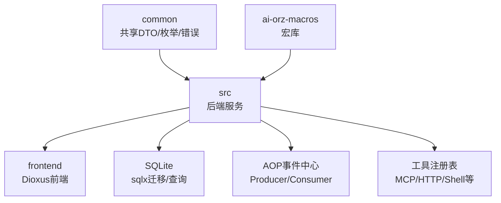
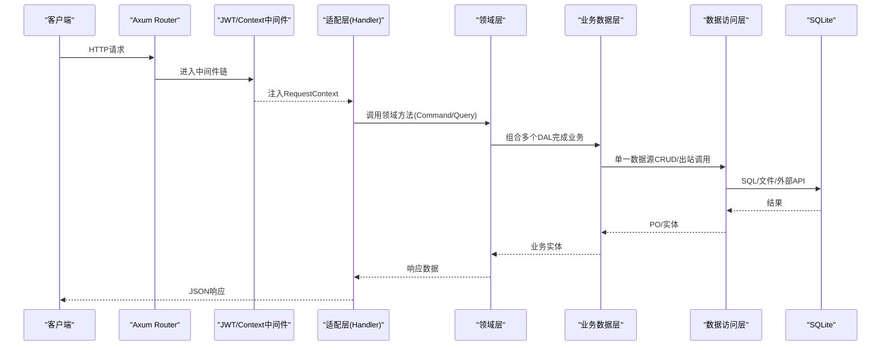
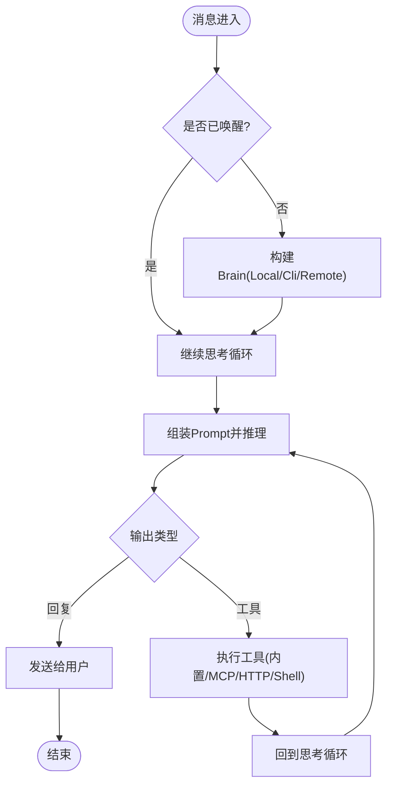
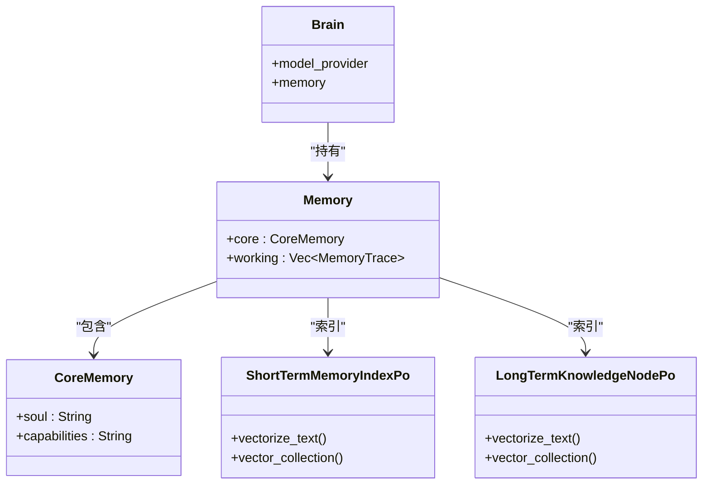
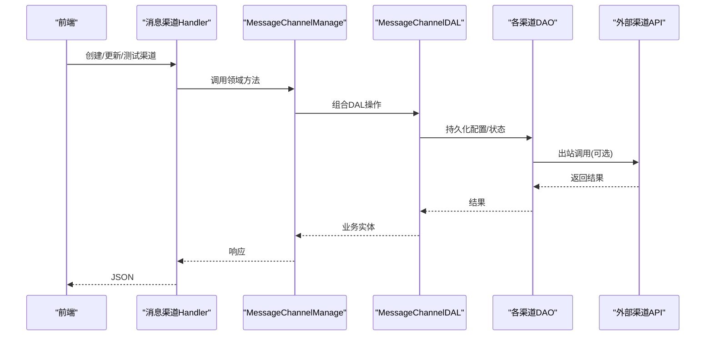
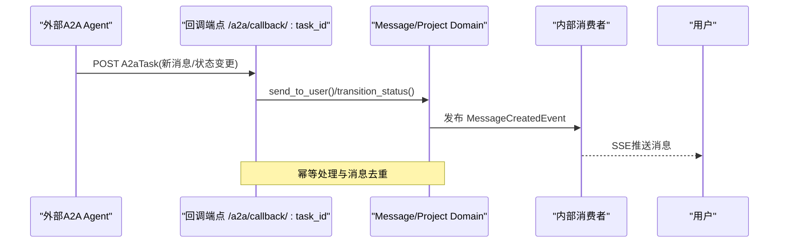
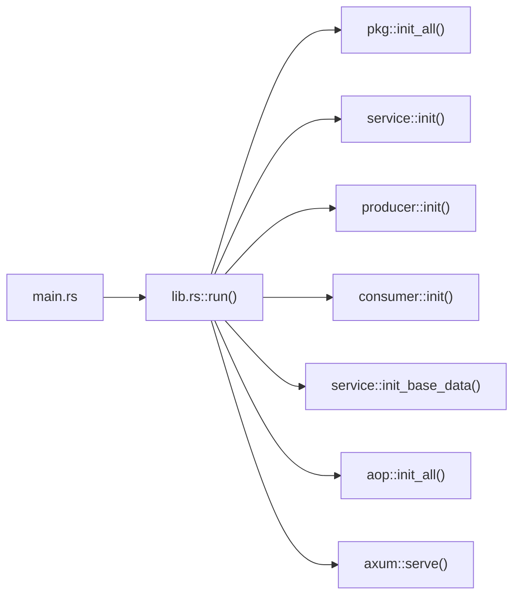

# 项目概述

<cite>
**本文引用的文件**
- [Cargo.toml](file://Cargo.toml)
- [src/main.rs](file://src/main.rs)
- [src/lib.rs](file://src/lib.rs)
- [common/config/ai_orz.toml](file://common/config/ai_orz.toml)
- [docs/ARCHITECTURE.md](file://docs/ARCHITECTURE.md)
- [docs/README.md](file://docs/README.md)
- [AGENTS.md](file://AGENTS.md)
- [docs/design/external_agent_design.md](file://docs/design/external_agent_design.md)
- [docs/plan/architecture_status_20260725.md](file://docs/plan/architecture_status_20260725.md)
- [src/models/message_channel.rs](file://src/models/message_channel.rs)
- [src/service/domain/finance/message_channel.rs](file://src/service/domain/finance/message_channel.rs)
</cite>

## 更新摘要
**变更内容**
- 更新了文档组织结构部分，反映新的四象限文档架构
- 增强了项目文档导航和查找指南
- 更新了设计文档分类和维护规则说明
- 完善了项目知识管理体系

## 目录
1. [简介](#简介)
2. [项目结构](#项目结构)
3. [核心组件](#核心组件)
4. [架构总览](#架构总览)
5. [详细组件分析](#详细组件分析)
6. [依赖关系分析](#依赖关系分析)
7. [性能与可扩展性](#性能与可扩展性)
8. [故障排查指南](#故障排查指南)
9. [结论](#结论)
10. [附录：快速开始](#附录快速开始)

## 简介
AI Orz 是一个全栈 Rust 多 Agent 协作框架，目标是将 AI 代理以"组织化"的形式进行长期角色管理，支持代理间协作、记忆沉淀、工具调用与外部系统集成。它通过严格分层与事件驱动架构，将 Agent 的生命周期、思考循环、消息路由、知识图谱与多渠道通信统一编排，提供从本地模型到外部 Agent（A2A/Cli）的混合执行能力，并以 Dioxus 前端提供可视化工作台。

- **技术栈**：Rust + Axum + SQLite + sqlx；前端 Dioxus (WASM) + Tailwind CSS v4 + DaisyUI v5
- **设计要点**：四层严格单向依赖、AOP 事件中心、插件化工具与渠道、向量+全文混合检索、A2A 协议对接外部 Agent
- **核心能力**：Agent 全生命周期管理、Brain/Memory/Cortex 协同、A2A 协议、多渠道消息、知识图谱与统计监控

**章节来源**
- [AGENTS.md:11-18](file://AGENTS.md#L11-L18)
- [docs/ARCHITECTURE.md:5-119](file://docs/ARCHITECTURE.md#L5-L119)

## 项目结构
仓库采用三级 cargo workspace：
- common：前后端共享 API DTO、枚举、错误类型等
- ai-orz-macros：日志宏、统计事件宏等编译期辅助
- src：后端服务（handlers、service、consumer/producer、pkg、models、middleware）
- frontend：Dioxus 前端应用（页面、组件、API 客户端、布局与状态管理）

**图表来源**
- [Cargo.toml:1-8](file://Cargo.toml#L1-L8)
- [docs/ARCHITECTURE.md:11-46](file://docs/ARCHITECTURE.md#L11-L46)

**章节来源**
- [docs/ARCHITECTURE.md:11-46](file://docs/ARCHITECTURE.md#L11-L46)
- [AGENTS.md:188-232](file://AGENTS.md#L188-L232)

## 核心组件
- Agent 与 Brain：Agent 作为独立执行单元，持有 Brain（聚合根），Brain 包含 Memory（分层记忆）与 Cortex（推理执行）。
- 记忆系统：Core/Working/Short-term/Long-term 四层，短期与长期分别索引于 SQLite，原始细节按天 Markdown 存储。
- 工具与技能：统一工具注册与调度，支持 MCP、HTTP、Shell 等；技能包可安装并注入 Prompt。
- 消息与渠道：用户↔Agent 双向对话，消息持久化与 SSE 推送；多渠道出站（飞书/微信/Slack/邮件/Webhook）与入站适配。
- A2A 外部 Agent：完整 A2A 协议支持（Client/Server），异步结果回传（Push 回调 + 轮询兜底）。
- 事件中心（AOP）：纯框架级事件生产-订阅-调度，支持同步/异步消费、顺序保证与崩溃恢复。
- 搜索与知识：FTS5 关键词 + 向量语义 + 图谱关系三位一体混合检索；知识图谱节点与关系持久化。
- 统计与监控：DuckDB 多维统计 + 运行时内存收集器 + AOP 队列监控。

**章节来源**
- [docs/ARCHITECTURE.md:69-119](file://docs/ARCHITECTURE.md#L69-L119)
- [docs/ARCHITECTURE.md:150-227](file://docs/ARCHITECTURE.md#L150-L227)
- [AGENTS.md:19-78](file://AGENTS.md#L19-L78)
- [docs/external_agent_design.md:1-28](file://docs/external_agent_design.md#L1-L28)

## 架构总览
系统遵循严格分层：Adapter（Handler/Producer）→ Domain → DAL → DAO → Models，禁止跨层调用与同层互调。Axum 中间件顺序为 JWT 认证外层、RequestContext 内层，确保受保护路由鉴权正确。

**图表来源**
- [docs/ARCHITECTURE.md:122-147](file://docs/ARCHITECTURE.md#L122-L147)
- [docs/ARCHITECTURE.md:325-385](file://docs/ARCHITECTURE.md#L325-L385)

**章节来源**
- [docs/ARCHITECTURE.md:122-147](file://docs/ARCHITECTURE.md#L122-L147)
- [docs/ARCHITECTURE.md:325-385](file://docs/ARCHITECTURE.md#L325-L385)

## 详细组件分析

### Agent 全生命周期与 Brain 装配
- Agent 分类：Local（本地模型）、Cli（CLI子进程）、Remote（A2A远程）
- Brain 装配：根据 kind 选择不同执行路径，统一入口 `BrainDal.think`
- 思考循环：组装 Prompt → 调用 Cortex/外部 → 解析输出 → 工具调用或回复 → 深度计数与反思

**图表来源**
- [docs/external_agent_design.md:35-66](file://docs/external_agent_design.md#L35-L66)
- [docs/project_management_design.md:544-600](file://docs/project_management_design.md#L544-L600)

**章节来源**
- [docs/external_agent_design.md:1-28](file://docs/external_agent_design.md#L1-L28)
- [docs/project_management_design.md:544-600](file://docs/project_management_design.md#L544-L600)

### 记忆系统与知识图谱
- 四层记忆：Core/Working/Short-term/Long-term，短期与长期分别索引于 SQLite，原始细节按天 Markdown 追加
- 向量化：PO 实现 Vectorizable trait，统一 embed_entity 流程，collection 名由 trait 提供
- 知识图谱：节点与关系持久化，支持标签、发布状态、混合检索

**图表来源**
- [docs/ARCHITECTURE.md:75-99](file://docs/ARCHITECTURE.md#L75-L99)
- [docs/ARCHITECTURE.md:150-183](file://docs/ARCHITECTURE.md#L150-L183)
- [AGENTS.md:499-582](file://AGENTS.md#L499-L582)

**章节来源**
- [docs/ARCHITECTURE.md:150-183](file://docs/ARCHITECTURE.md#L150-L183)
- [AGENTS.md:499-582](file://AGENTS.md#L499-L582)

### 多渠道消息系统
- 消息实体：MessageChannel 业务实体内部持有 PO，提供 ID/类型/状态等访问方法
- 领域接口：FinanceDomainImpl 暴露 create/get/query/update/delete/test 等方法
- 出站通道：飞书/微信/Slack/邮件/Webhook 等，配置与状态管理

**图表来源**
- [src/models/message_channel.rs:19-60](file://src/models/message_channel.rs#L19-L60)
- [src/service/domain/finance/message_channel.rs:11-72](file://src/service/domain/finance/message_channel.rs#L11-L72)

**章节来源**
- [src/models/message_channel.rs:19-60](file://src/models/message_channel.rs#L19-L60)
- [src/service/domain/finance/message_channel.rs:11-72](file://src/service/domain/finance/message_channel.rs#L11-L72)

### A2A 外部 Agent 集成
- 三类 Agent：Local/Cli/Remote，差异封装在 DAL/DAO，Domain 保持通用
- 异步更新双通道：Push 回调（推荐）+ Poll 轮询（兜底）
- 幂等与去重：基于 Task.tags 中的 a2a_task_id 与 a2a_synced_msgs 计数

**图表来源**
- [docs/external_agent_design.md:107-174](file://docs/external_agent_design.md#L107-L174)

**章节来源**
- [docs/external_agent_design.md:107-174](file://docs/external_agent_design.md#L107-L174)

## 依赖关系分析
- 工作区成员：主 crate、frontend、common、ai-orz-macros
- 关键依赖：tokio、axum、sqlx、fastembed、lancedb、rmcp、duckdb、tracing、jsonwebtoken
- 启动流程：main 调用 run → 初始化配置与 pkg → service init → producer/consumer 注册 → 基础数据注入 → AOP 调度器 → 启动 Axum 服务器

**图表来源**
- [src/main.rs:1-5](file://src/main.rs#L1-L5)
- [src/lib.rs:114-173](file://src/lib.rs#L114-L173)
- [Cargo.toml:1-8](file://Cargo.toml#L1-L8)

**章节来源**
- [src/main.rs:1-5](file://src/main.rs#L1-L5)
- [src/lib.rs:114-173](file://src/lib.rs#L114-L173)
- [Cargo.toml:17-71](file://Cargo.toml#L17-L71)

## 性能与可扩展性
- 并发模型：Tokio 异步任务，相同 order_key 顺序锁保证顺序，不同 key 并行
- 存储优化：SQLite STRICT 模式、FTS5 全文检索、LanceDB/HNSW 向量索引、按天 Markdown 原始细节
- 事件总线：持久化消息表、崩溃恢复、优先级排序、内存队列与 Hook 统计
- 扩展点：工具注册表、渠道 DAO、CortexDao 多实现、A2A 外部 Agent 接入

[本节为通用指导，不直接分析具体文件]

## 故障排查指南
- 中间件顺序：确保 JWT 认证在外层、RequestContext 在内层，否则受保护路由可能返回 401/403
- 数据库迁移：所有建表语句集中管理，启用 STRICT 模式，枚举字段使用 Rust 枚举映射
- 日志规范：统一使用 log_info!/log_error! 等宏，避免直接调用 tracing::*
- 向量降级：无 Embedding Provider 时主流程应可用，记录 warn 并跳过向量化
- A2A 回调：校验任务存在且状态活跃，基于 tags 去重，终态任务直接返回 ok

**章节来源**
- [docs/ARCHITECTURE.md:137-147](file://docs/ARCHITECTURE.md#L137-L147)
- [AGENTS.md:430-438](file://AGENTS.md#L430-L438)
- [AGENTS.md:453-498](file://AGENTS.md#L453-L498)
- [docs/external_agent_design.md:176-188](file://docs/external_agent_design.md#L176-L188)

## 结论
AI Orz 以严格的四层架构与事件驱动为核心，提供了完整的 Agent 生命周期管理、记忆沉淀、工具调用、多渠道消息与 A2A 外部 Agent 集成能力。其技术选型（Rust/Axum/SQLite/Dioxus）兼顾性能与开发体验，配合完善的测试与质量门禁，适合构建企业级多 Agent 协作平台。

[本节为总结，不直接分析具体文件]

## 附录：快速开始
- 配置文件：默认监听 0.0.0.0:3000，SQLite 文件名 ai_orz.db，静态资源目录 dist，日志目录 logs，A2A Server 默认启用，JWT 密钥可通过环境变量覆盖
- 启动步骤：
  1. 复制并修改 common/config/ai_orz.toml
  2. 运行后端服务（main 调用 lib::run）
  3. 构建前端静态资源（Dioxus 构建脚本自动 npm install + Tailwind 编译）
  4. 访问前端页面，完成系统初始化与登录

**章节来源**
- [common/config/ai_orz.toml:9-43](file://common/config/ai_orz.toml#L9-L43)
- [src/lib.rs:114-173](file://src/lib.rs#L114-L173)

## 文档组织结构（新增章节）

### 四象限文档架构
项目采用清晰的四象限文档组织结构，便于按问题类型快速定位所需文档：

| 目录/文档 | 回答的问题 | 性质与维护方式 |
|-----------|------------|----------------|
| **docs/wiki/** | **是什么**：代码现状百科 | IDE 生成（源自 `.qoder/repowiki`），随代码演进再生成；阅读第一站 |
| **docs/ARCHITECTURE.md** | **权威纲要**：核心概念与实体关系 | 手工维护，唯一权威架构总纲 |
| **docs/LAYERED_ARCHITECTURE_PRACTICE.md** | **怎么做**：分层实践与避坑 | 手工维护，开发必读 |
| **docs/design/** | **为什么**：当时的设计决策 | 决策快照，写定后不追赶现状 |
| **docs/plan/** | **要去哪**：规划与状态快照 | 按阶段追加 |
| **docs/archive/** | **被什么取代**：历史方案归档 | 只进不出 |

### 文档维护规则
1. 代码现状变化 → 再生成 wiki；不回头改 design/ 旧文（不一致时以 wiki 为准）
2. 开发规范变化 → 更新根目录 AGENTS.md 与 LAYERED 实践文档
3. 架构核心概念变化 → 更新 ARCHITECTURE.md
4. 新功能设计 → 先写 design/ 新文档，落地后由 wiki 承接现状描述
5. 被取代的方案 → 移入 archive/，原位置不留副本

### 设计文档分类
- **design/**：包含具体的设计决策文档，如外部Agent设计、消息渠道设计、事件设计等
- **plan/**：包含项目规划和状态跟踪，如架构状态报告、待办事项等
- **archive/**：归档已被替代的历史方案，保持文档的时效性和准确性

**章节来源**
- [docs/README.md:1-24](file://docs/README.md#L1-L24)
- [AGENTS.md:102-118](file://AGENTS.md#L102-L118)