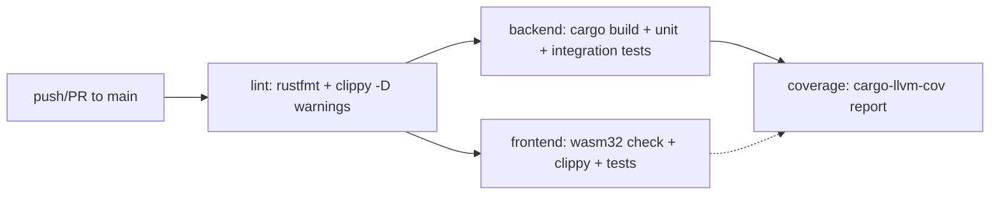

> 📦 归档标记（2026-08-15）：被 [Rust Workspace + Dioxus WASM 全栈构建与 CI_CD 流水线](docs/wiki/knowledge/zh/Rust Workspace + Dioxus WASM 全栈构建与 CI_CD 流水线/Rust Workspace + Dioxus WASM 全栈构建与 CI_CD 流水线.md) 取代。保留原因：历史参考，主卡已吸收本卡独有源码锚点与硬约束。生效方案：主卡真实路径作为唯一 RAG 召回目标。
---
kind: build_system
name: Rust Workspace + Shell 启动脚本 + GitHub Actions CI 构建体系
category: build_system
scope:
    - '**'
source_files:
    - Cargo.toml
    - start.sh
    - build.sh
    - .github/workflows/rust.yml
    - rust-toolchain.toml
    - frontend/build.rs
    - frontend/Cargo.toml
    - common/Cargo.toml
    - ai-orz-macros/Cargo.toml
    - .env.example
---

## 1. 构建系统总览

本项目采用 **Cargo workspace**（`resolver = "2"`）聚合四个 crate：后端 `ai_orz`、前端 `frontend`（Dioxus WASM）、共享库 `common`、过程宏 `ai-orz-macros`。所有 Rust 代码统一通过 `cargo build/test/clippy/fmt` 管理，前端额外依赖 Dioxus CLI (`dx`) 与 npm/Tailwind CSS。

- **工具链锁定**：`rust-toolchain.toml` 固定使用 `stable` channel，并预装 `rustfmt`、`clippy` 组件以及 `wasm32-unknown-unknown` target。
- **版本策略**：workspace 内各 crate 独立声明 `version = "0.1.0"`，无统一的版本号同步机制；发布产物为后端二进制 `target/release/ai_orz` 与前端静态资源 `dist/`。

## 2. 关键文件与职责

| 文件 | 作用 |
|---|---|
| `Cargo.toml`（根） | 定义 workspace members、后端依赖、`[[test]]` 集成测试入口 |
| `common/Cargo.toml` | 共享 crate，通过 optional features（`sqlx`、`axum-integration`、`reqwest-integration`、`tokio-integration`、`toml-integration`、`bincode-integration`、`jwt-integration`、`base64-integration`）裁剪依赖 |
| `frontend/Cargo.toml` | Dioxus WASM 前端依赖，仅引入 `web` 特性 |
| `ai-orz-macros/Cargo.toml` | `proc-macro = true` 的纯编译期 crate |
| `build.sh` | 薄包装，转发到 `start.sh build` |
| `start.sh` | 统一入口：`dev`/`prod`/`build`/`backend`/`frontend`/`help` 五种模式 |
| `frontend/build.rs` | 编译期读取 `../.ai_orz/ai_orz.toml`（不存在则回退到 `common/config/ai_orz.toml`），生成 `COMPILED_CONFIG` 常量嵌入前端；同时调用 `tailwindcss` 编译 CSS |
| `.github/workflows/rust.yml` | GitHub Actions CI：lint → backend → frontend（并行）→ coverage |
| `rust-toolchain.toml` | 固定 toolchain 与 wasm target |
| `.env.example` | 环境变量模板（`DATABASE_URL`、`SQLX_OFFLINE=true`、可选的 LLM/Embedding 测试密钥） |

## 3. 架构与约定

### 3.1 开发 / 构建 / 生产 三态

- **开发模式** `./start.sh dev`：后台运行 `cargo run`（后端）+ `cd frontend && dx serve`（前端），端口分别为 `localhost:3000`（API）和 `localhost:8080`（UI），捕获 SIGINT/SIGTERM 优雅终止子进程。
- **构建模式** `./start.sh build`：先 `cd frontend && dx build --release`（忽略 wasm-opt 失败），将 `*.wasm`、`frontend.js`、`snippets/` 复制到 `dist/pkg/`，再 `cargo build --release` 产出后端二进制。
- **生产模式** `./start.sh prod`：执行 `cmd_build` 后直接 `./target/release/ai_orz`，监听 `0.0.0.0:${SERVER_PORT:-3000}`。
- `build.sh` 仅为兼容入口，全部委托给 `start.sh`。

### 3.2 前端构建管线

`frontend/build.rs` 在 Cargo 编译阶段完成两件事：
1. 读取后端配置 TOML（优先 `../.ai_orz/ai_orz.toml`，否则 `common/config/ai_orz.toml`），序列化为 JSON 并以字符串字面量形式写入 `OUT_DIR/compiled_config.rs`，供运行时 `get_config()` 解析。
2. 调用 `node_modules/.bin/tailwindcss -i styles/input.css -o public/output.css --minify`；若 `npm install` 或 tailwindcss 不可用则降级跳过（仅 `cargo:warning` 不中断构建）。

### 3.3 SQLx 离线查询检查

`.env.example` 强制设置 `SQLX_OFFLINE=true`，配合根目录 `.sqlx/query-*.json` 预生成的查询校验缓存，使 `cargo build` 无需真实数据库即可通过 SQLx 查询类型检查。

### 3.4 测试组织

- 单元测试：`cargo test --lib`（含 `pkg/`、`models/`、`service/dao/*_test.rs` 等模块内 `#[cfg(test)]`）。
- 集成测试：根 `Cargo.toml` 中显式声明 `[[test]]` 条目指向 `tests/integration/*.rs`，CI 通过 `cargo test --test '*'` 批量执行。
- 覆盖率：`coverage` job 使用 `cargo-llvm-cov`，按分支差异化阈值（main push ≥ 45%，PR ≥ 38%），排除 `tests/common/`、`/cargo/registry/`、`/rustc/`、`build.rs`、`target/`。

## 4. CI 流水线（GitHub Actions）

- **Lint 门禁**：安装 `protobuf-compiler`（lancedb 依赖），启用 sccache，`cargo fmt --all --check` 与 `cargo clippy --all-targets -- -D warnings`。
- **Backend**：`cargo build --verbose` → `cargo test --lib` → `cargo test --test '*'`。
- **Frontend**：`rustup target add wasm32-unknown-unknown` → `cargo check --target wasm32-unknown-unknown` → `cargo clippy --target wasm32-unknown-unknown --all-targets -- -D warnings` → `cargo test`。
- **Coverage**：`cargo llvm-cov --workspace --tests --no-clean --no-fail-fast --ignore-filename-regex ...`，输出 `lcov.info` 与 HTML artifact。
- **缓存**：全局启用 sccache（`~/.cache/sccache`，key 基于 `**/Cargo.lock`），另缓存 `~/.cache/ort`（ONNX Runtime 预编译二进制）。
- **环境变量**：`CARGO_INCREMENTAL=0`（让 sccache 完全接管增量编译），`SQLX_OFFLINE=true`。

## 5. 约束与约定

- **必须**：新增集成测试需在根 `Cargo.toml` 的 `[[test]]` 段注册，否则不会被 `cargo test --test '*'` 发现。
- **必须**：SQL 变更需添加迁移脚本至 `migrations/`（时间戳命名），并在本地通过 sqlx-cli 更新 `.sqlx/` 缓存。
- **必须**：前端配置修改需同步更新 `common/config/ai_orz.toml` 默认值，因为 `frontend/build.rs` 会将其作为回退配置嵌入。
- **推荐**：CI 环境需预先安装 `protoc`（lancedb 依赖），否则 lint/backend 会失败。
- **约定**：所有构建/运行入口统一走 `start.sh`，禁止绕过它直接调用 `cargo run` 或 `dx serve`。
- **约束**：`frontend/build.rs` 中 Tailwind CSS 编译失败不会中断构建（仅 warning），但 `dx build --release` 的 wasm-opt 失败也被 `|| true` 忽略——这意味着前端产物可能不完整，需人工确认。
- **约束**：workspace 未使用 `[workspace.dependencies]` 集中管理版本，各 crate 各自声明依赖版本，存在潜在版本漂移风险。
- **约束**：未提供 Dockerfile 或容器化方案；部署产物为裸二进制 + `dist/` 静态目录，由外部进程管理器（如 systemd、PM2）托管。
