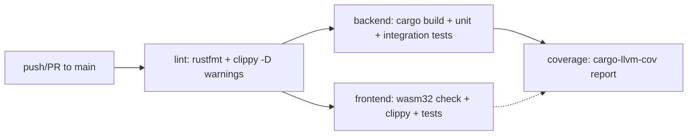

## 1. 使用的系统与工具

- **Cargo Workspace**：根 `Cargo.toml` 将 `ai_orz`（后端）、`frontend`（Dioxus WASM）、`common`（共享 crate）、`ai-orz-macros`（过程宏）聚合为单一 workspace，resolver = "2"。
- **统一启动脚本**：`start.sh` 是开发/构建/生产唯一入口，支持 `dev`、`build`、`prod`、`backend`、`frontend`、`help` 六个子命令；`build.sh` 仅作为转发到 `start.sh build` 的薄壳。
- **Dioxus 前端构建**：通过 `dx build --release` 编译 WASM，产物由 `start.sh` 复制到 `dist/pkg/`，并复制 `index.html` 到 `dist/`；Tailwind CSS 在 `frontend/build.rs` 中通过调用 `node_modules/.bin/tailwindcss -i styles/input.css -o public/output.css --minify` 编译。
- **配置内嵌**：`frontend/build.rs` 在编译期读取 `.ai_orz/ai_orz.toml`（不存在则回退到 `common/config/ai_orz.toml`），解析为 `AppConfig` 后生成 `compiled_config.rs`，以字符串常量形式嵌入前端二进制，保证前后端配置一致。
- **数据库迁移内嵌**：后端使用 sqlx `migrate` feature，迁移 SQL 位于 `migrations/` 目录，首次运行自动生成 `.ai_orz/ai_orz.toml`。
- **CI/CD**：GitHub Actions 提供两套 workflow —— `.github/workflows/rust.yml`（push/PR 触发 lint、测试、覆盖率）和 `.github/workflows/release.yml`（tag `v*` 触发多平台 release 打包与 GitHub Release 发布）。
- **工具链锁定**：`rust-toolchain.toml` 固定 channel = "stable"，并预注册 `wasm32-unknown-unknown` target。

## 2. 关键文件

- `Cargo.toml`（workspace 根）：定义 workspace members、后端包依赖、`[[test]]` 集成测试条目。
- `start.sh`：统一编排 dev/build/prod/backend/frontend 五种模式，负责 dx/cargo 调用、进程管理、信号捕获、产物拷贝。
- `build.sh`：`exec start.sh build` 的薄包装。
- `frontend/build.rs`：编译期 Tailwind CSS 编译、docs 静态资源复制、后端配置读取并生成 `COMPILED_CONFIG` 常量。
- `frontend/Cargo.toml`：Dioxus WASM 包定义，依赖 `common` 共享类型。
- `rust-toolchain.toml`：固定 stable toolchain + wasm32 target。
- `scripts/build_frontend.sh`：封装 `dx build --release`、查找 dx 输出目录（兼容新旧路径）、复制 `index.html` 与 `public/` 静态资源到仓库根 `dist/`，并清理未被引用的旧 hash 资产。被 `start.sh` 和 CI e2e job 共用。
- `.github/workflows/rust.yml`：fmt → clippy → backend(test) / frontend(clippy+wasm) / coverage 并行流水线，启用 sccache、SQLX_OFFLINE=true；另缓存 `~/.cache/ort`（ONNX Runtime 预编译二进制）。
- `.github/workflows/release.yml`：matrix 构建 `ubuntu-latest → x86_64-unknown-linux-gnu` 与 `macos-latest → aarch64-apple-darwin`（不做交叉编译，lancedb/ort-sys 交叉链太重），安装 dioxus-cli → 复用 `./scripts/start.sh build` → 打包 `ai_orz-{tag}-{target}.tar.gz` 并上传 artifact；仅当 push tag 形如 `refs/tags/v*` 或手动触发 `workflow_dispatch` 时执行；对 `${REF_NAME}` 做白名单正则校验，拒绝 shell/路径特殊字符。
- `.env.example`：环境变量模板（`DATABASE_URL`、`SQLX_OFFLINE=true`、可选的 LLM/Embedding 测试密钥 `TEST_*`）
- `common/config/ai_orz.toml`：默认配置模板，作为前端编译期回退源
- `migrations/*.sql`：SQLx 数据库迁移脚本（时间戳命名），迁移功能通过 sqlx `migrate` feature 在首次运行自动执行

## 3. 架构与约定

### 构建阶段分层
1. **源码层**：Rust workspace 四个成员，无 Makefile 或 Dockerfile，全部通过 cargo/dx/bash 编排。
2. **编译期预处理**：`frontend/build.rs` 在 cargo 编译前端前执行，完成 Tailwind CSS 编译、docs 复制、配置注入；若 `node_modules` 缺失则自动 `npm install`，失败时降级跳过 CSS 构建而不中断。
3. **产物产出**：
   - 后端：`cargo build --release` → `target/release/ai_orz`。
   - 前端：`dx build --release` → 产物位置因 dx 版本而异（`target/dx/frontend/release/web/public` 或 `pkg`），`start.sh` 自动探测并复制 `*_bg.wasm`、`frontend.js`、`snippets/` 到 `dist/pkg/`。
4. **部署产物**：release workflow 将后端二进制与 `dist/` 目录打包为 `ai_orz-{tag}-{target}.tar.gz`，解压后直接运行 `./ai_orz`，监听 `0.0.0.0:3000`，前端静态资源从同目录 `dist/` 提供。

### CI 流水线设计

- **分阶段门禁**：`fmt`（最快，独立 job）→ `lint`（clippy --all-targets -- -D warnings，需安装 protoc 以满足 lancedb/lance-encoding 的 build script）→ 下游 job 并行（backend / frontend / coverage 三者依赖 lint 后并行）。
- **缓存策略**：全局启用 sccache（`mozilla-actions/sccache-action`，`RUSTC_WRAPPER=sccache`），按 `sccache-${{ runner.os }}-${{ hashFiles('**/Cargo.lock') }}` 缓存；另对 `~/.cache/ort`（ort-sys 预编译 ONNX Runtime）做独立缓存。
- **覆盖率门禁**：`coverage` job 与 backend/frontend 并行，使用 `cargo-llvm-cov`，push main 要求 fail-under-lines ≥ 45%，PR 要求 ≥ 38%；报告通过 `--ignore-filename-regex` 排除 tests/common、registry、rustc、build.rs、target；报告同时输出日志与 GitHub Summary。
- **前端交叉编译**：`frontend` job 安装 `wasm32-unknown-unknown` target 并执行 `cargo check --target wasm32-unknown-unknown` → `cargo clippy --target wasm32-unknown-unknown --all-targets -- -D warnings` → `cargo test`，确保 WASM 目标可编译。
- **测试组织**：单元测试 `cargo test --lib`（含 `pkg/`、`models/`、`service/dao/*_test.rs` 等模块内 `#[cfg(test)]`）；集成测试在根 `Cargo.toml` 中显式声明 `[[test]]` 条目指向 `tests/integration/*.rs`，CI 通过 `cargo test --test '*'` 批量执行；E2E 测试当前已移出 CI，仅在 `e2e/` 目录本地运行 Playwright。
- **环境约束**：`CARGO_INCREMENTAL=0`（让 sccache 完全接管缓存，避免增量编译干扰）、`SQLX_OFFLINE=true`（使用 `.sqlx/` 离线 schema）。

### 开发与生产模式约定
- `make dev`（路由 `./scripts/start.sh dev`）：后台同时启动 `cargo run`（后端 API，默认 3000）和 `dx serve`（前端开发服务器，默认 8080），Ctrl+C 时通过 trap 终止两个子进程。
- `make prod`（路由 `./scripts/start.sh prod`）：先执行 `cmd_build`，再运行 `./target/release/ai_orz`，监听 `0.0.0.0:${SERVER_PORT:-3000}`。
- `make build`（路由 `./scripts/start.sh build`）：仅编译，不启动服务；前端构建允许 `wasm-opt` 失败（`|| true`），但会检查最终产物是否存在。

## 4. 约定与约束

- **Workspace 成员固定**：仅允许 `.`、`frontend`、`common`、`ai-orz-macros` 四个成员，新增模块必须加入 workspace。
- **Toolchain 锁定**：必须使用 `rust-toolchain.toml` 指定的 stable channel，且已包含 rustfmt、clippy、wasm32 target，禁止随意切换 toolchain。
- **CI 强制门禁**：`cargo fmt --check`、`cargo clippy --all-targets -- -D warnings`（含前端 wasm32 目标）均为阻塞步骤；覆盖率低于阈值（main 45% / PR 38%）阻断合并。
- **依赖系统库**：lancedb 的 lance-encoding 依赖 protobuf，CI 中显式安装 `protobuf-compiler` 与 `libprotobuf-dev`；release 构建也需在 Linux/macOS 分别安装对应 protoc。
- **配置来源优先级**：前端编译期优先读取 `.ai_orz/ai_orz.toml`，不存在则回退到 `common/config/ai_orz.toml`；该行为由 `frontend/build.rs` 硬编码实现。
- **构建产物位置约定**：后端二进制固定输出到 `target/release/ai_orz`；前端静态资源固定输出到 `dist/`（含 `dist/pkg/*.wasm`、`dist/pkg/frontend.js`、`dist/index.html`），release 打包基于此路径。
- **Release 触发条件**：仅当 push tag 匹配 `v*` 或手动触发 `workflow_dispatch` 时执行 release workflow；publish job 进一步限制 `startsWith(github.ref, 'refs/tags/v')`，防止非 v 前缀 tag 发布。
- **增量编译互斥**：CI 显式设置 `CARGO_INCREMENTAL=0`，让 sccache 完全接管缓存，避免增量编译与 sccache 内容寻址冲突。
- **SQLX 离线模式**：所有 CI job 设置 `SQLX_OFFLINE=true`，依赖 `.sqlx/` 中的查询缓存，无需连接数据库即可编译。
- **单入口原则**：所有构建/启动场景均通过 `start.sh` 子命令进入（`dev`/`build`/`prod`/`backend`/`frontend`/`help`），禁止绕过脚本直接调用 `cargo` 或 `dx`。
- **产物位置约定**：前端静态资源统一产出到仓库根 `dist/`（由 `scripts/build_frontend.sh` 负责，统一逻辑被 start.sh 和 CI 共用），后端二进制位于 `target/release/ai_orz`；生产模式下后端从同目录 `dist/` 提供前端 SPA。
- **跨模块依赖边界**：workspace 中 `common` 与 `ai-orz-macros` 不依赖后端 `service` 代码，保持可独立编译；前端通过 `common` 共享 DTO/枚举/错误类型。
- **无 Dockerfile**：项目未使用容器化镜像，发布产物为自包含 tar.gz（二进制 + dist/ 静态文件 + migrations 内嵌），解压后可直接运行。
- **集成测试注册**：新增集成测试需在根 `Cargo.toml` 的 `[[test]]` 段注册，否则不会被 `cargo test --test '*'` 发现。
- **SQL 变更流程**：SQL 变更需添加迁移脚本至 `migrations/`（时间戳命名），并在本地通过 sqlx-cli 更新 `.sqlx/` 缓存；`.env.example` 强制设置 `SQLX_OFFLINE=true`。
- **前端配置同步**：前端配置修改需同步更新 `common/config/ai_orz.toml` 默认值，因为 `frontend/build.rs` 会将其作为回退配置嵌入；`cargo:rerun-if-changed` 监听两个配置文件变更触发重建。
- **降级容错**：`frontend/build.rs` 中 Tailwind CSS 编译失败不会中断构建（仅 warning），`dx build --release` 的 wasm-opt 失败也被 `|| true` 忽略——这意味着前端产物可能不完整，需人工确认。
- **workspace 版本管理现状**：workspace 未使用 `[workspace.dependencies]` 集中管理版本，各 crate 各自声明依赖版本，存在潜在版本漂移风险。
- **Tag 校验**：release workflow 对 `REF_NAME` 执行正则 `^[A-Za-z0-9._-]+$` 校验，拒绝 shell/路径特殊字符，防止注入攻击；publish job 进一步限制 `startsWith(github.ref, 'refs/tags/v')`，防止非 v 前缀 tag 发布。
