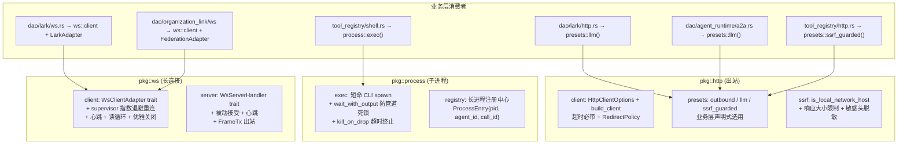

## §1 概述

**本卡角色**：pkg 层三项基建统一的知识卡。覆盖 `pkg/http`（全项目出站 HTTP 单一入口 + HttpClientOptions 声明式构建 + SSRF 防护三件套）、`pkg/process::exec`（短命 CLI 调用统一执行原语 + wait_with_output 防 64KB 管道死锁）、`pkg/ws`（通用 WS 客户端/服务端管理器 + adapter 模式业务解耦 + supervisor 指数退避重连）。**定位：新增出站 HTTP 调用、调试子进程超时僵尸、接入新的 WS 业务时读。**

pkg 层基建重构从"散落在各 DAO 里直调 reqwest::Client::new()/builder() 和 Command::new()"统一为 pkg 单一原语——业务层只声明"要哪种客户端预设"或"执行什么命令"，不再手写 builder 和 spawn。硬约束：默认必带超时，禁止裸 reqwest 实例，exec 必用 wait_with_output，WS 管理器不含业务语义。

- **pkg/http 三件套分层**（src/pkg/http/mod.rs）：`client` 统一构建入口——`HttpClientOptions` 声明式选项 + `build_client` 单一函数（超时必带、User-Agent 统一、重定向策略可控）；`presets` 业务预设——`outbound()` 一般 30s / `llm()` 推理 120s / `ssrf_guarded()` 安全 30s+本地阻断+1MB限制；`ssrf` 安全模块——is_local_network_host + is_private_network_ip + DEFAULT_RESPONSE_MAX_BYTES=1MB (hard 10MB) + 敏感头脱敏。**业务层禁止再调 reqwest::Client::new()/builder()**。
- **pkg/process::exec 执行原语**（src/pkg/process/exec.rs）：短命 CLI 调用（gh/lark/browser/codex 等）的统一 spawn 原语。关键：**输出捕获恒用 wait_with_output()**——先 wait() 后读 stdout 的写法在子进程输出超过 ~64KB 管道缓冲区时双向阻塞直到超时，exec 原语下此死锁结构性不可能发生。超时必终止（kill_on_drop），stdin 写入 best-effort（Broken pipe 合法）。DEFAULT_EXEC_TIMEOUT=60s / MAX=600s。
- **pkg/process 注册中心（管理端，与 exec 互补）**：exec 是生产端（毫秒级 CLI 调用，不进注册中心），registry 是管理端（Agent 可管理的长生命周期进程：shell_exec 后台模式）——ProcessEntry{pid, cmd, agent_id, call_id, started_at} 供 shell_kill 权限边界审计。v1 接受 pid 复用风险，entry 带 started_at 人工甄别。
- **pkg/ws 通用管理器**（src/pkg/ws/mod.rs + server.rs）：**client 侧**——WsClientAdapter trait（业务帧解析实现方）+ supervisor 指数退避重连 + 心跳（adapter.heartbeat_frame() 返回自定义文本帧 / 默认 WS Ping 控制帧）+ 读循环 + 优雅关闭 stop_client + conn_state_snapshot 连接状态快照；**server 侧**——被动接受连接（无 supervisor，断开即结束）+ 30s 心跳 + WsServerHandler trait。**核心：pkg::ws 不含任何业务语义**——帧类型定义、业务错误转码、federation/lark/agent 等关键词全部交给 adapter 实现方。
- **迁移后的消费者**：`service/dao/lark/http.rs`（Lark API 出站走 presets::llm 120s）、`service/dao/agent_runtime/a2a.rs`（A2aRuntimeDao JSON-RPC 出站走 presets::llm）、`pkg/tool_registry/http.rs`（fetch_remote_content builtin 走 presets::ssrf_guarded）、`service/dao/lark/ws.rs`（Lark P2P WS 入站迁 pkg::ws client 管理器）。

---

## §2 关键文件与职责表

| 文件 | 角色 | 内容摘要 | 源码锚点 |
|------|------|---------|---------|
| pkg/http/mod.rs | HTTP 基建模块入口 | client + presets + ssrf 三层；默认必带超时硬约束；业务层禁裸 reqwest | `:L1-L34` |
| pkg/http/client.rs HttpClientOptions + build_client | 客户端统一构建 | DEFAULT_TIMEOUT_MS=30_000 + MAX_TIMEOUT_MS=600_000 + USER_AGENT + RedirectPolicy | `:L1-L200` |
| pkg/http/ssrf.rs | SSRF 防护 + 安全 | is_local_network_host(localhost+内网IP段+169.254) + DEFAULT_RESPONSE_MAX_BYTES=1MB + 敏感头脱敏 | `:L1-L230` |
| pkg/http/presets.rs | 业务预设 | outbound(30s) + llm(120s) + ssrf_guarded(30s+本地阻断+1MB) + FEDERATION_TIMEOUT_MS | `:L1-L119` |
| pkg/process/exec.rs | 子进程执行原语 | exec(spawn + wait_with_output + 超时 kill_on_drop) + ExecOptions{timeout, stdin, env, cwd} + DEFAULT_EXEC_TIMEOUT=60s | `:L1-L321` |
| pkg/process/mod.rs | 进程注册中心 | ProcessStatus Running/Exited + ProcessEntry{pid, cmd, agent_id, call_id, started_at} + 内存注册表 | `:L1-L278` |
| pkg/ws/mod.rs | WS client 管理器 | WsClientAdapter trait + supervisor 指数退避重连 + 心跳 + 读循环 + 优雅关闭 + conn_state_snapshot；**不含业务语义** | `:L1-L635` |
| pkg/ws/server.rs | WS server 会话循环 | WsServerHandler trait + 被动接受(无 supervisor) + 30s 心跳 + FrameTx 出站句柄 | `:L1-L141` |
| pkg/mod.rs | pkg 模块声明 | pub mod http / process / ws 全部注册；与 jwt / request_context / aop 同级 | `:L1-L95` |
| service/dao/lark/http.rs | 迁移后消费者 | 全部 Lark API 出站走 pkg::http::presets 预设 | 见文件 |
| pkg/tool_registry/http.rs | 迁移后消费者 | fetch_remote_content builtin 走 presets::ssrf_guarded | 见文件 |

**章节来源**
- [http/mod.rs:L1-L34](src/pkg/http/mod.rs#L1-L34)
- [process/exec.rs:L1-L321](src/pkg/process/exec.rs#L1-L321)
- [ws/mod.rs:L1-L635](src/pkg/ws/mod.rs#L1-L635)

---

## §3 架构约定

本卡为 pkg 基建层独立主题（Level 5 纯新），与 **【联邦组网地基】** 构成上下游关系——联邦 WS 长连接业务层消费 pkg::ws 通用管理器（pkg 提供生命周期，联邦 adapter 提供业务帧语义）。与 **【工具系统三层调用架构】** 构成消费者关系——内置工具 shell_exec / http_fetch 分别调用 pkg::process::exec / pkg::http::ssrf_guarded。

### 三件套分层

---

## §4 硬约束与回归红线

1. **禁止业务层直接调用 reqwest::Client::new() 或 .builder()**：全局 grep `reqwest::Client::new` 或 `reqwest::Client::builder` 不应命中 pkg/http/ 外的任何文件。业务层想做 HTTP 出站 → 只能用 `presets::outbound()` / `presets::llm()` / `presets::ssrf_guarded()` 或 `HttpClientOptions::new().with_timeout(...)` 叠加。裸 reqwest 实例无超时（网络抖动永久挂起），且会绕过 SSRF 防护、敏感头脱敏、统一 User-Agent。
2. **exec 原语输出捕获恒用 wait_with_output()，禁止先 wait() 再读**：先 wait() 等子进程退出 → 再读 stdout/stderr 的模式在输出超过 ~64KB 管道缓冲区时双向阻塞（stdout 写满 → 进程阻塞 → 永远不退出 → wait() 永远阻塞）。`tokio::process::Command::new(...).spawn()?.wait_with_output().await` 并发读管道彻底消除此死锁。pkg::process::exec.rs 的 exec 函数永远 wait_with_output，调用方禁止绕过 exec 直接 Command::new + spawn。
3. **pkg::ws 通用管理器严禁嵌入任何业务语义**：pkg::ws/mod.rs 和 server.rs 是纯 WS 生命周期组件——只关心建连、心跳、重连、读循环、优雅关闭。帧类型枚举、业务错误码（Error::organization_not_found vs Error::federation_call_fail）、federation/lark/agent 业务关键词——全部交给 WsClientAdapter / WsServerHandler 实现方。静态 grep pkg::ws 目录下文件，不应出现 "federation" / "lark" / "agent" / "a2a" 等业务关键词。
4. **SSRF 防护三件套必须同时启用（URL 校验 + 响应大小限制 + 敏感头脱敏）**：任何需要 HTTP 出站但又不想默认 ssrf_guarded 预设的场景（极少数，如内网间服务调用），必须在 HttpClientOptions 里**显式关闭** `ssrf_guard(false)` + `response_max_bytes(0)` + `sensitive_header_redact(false)`——默认值是全部开启。代码 review 发现有人创建 HttpClientOptions 时忘记加 ssrf 相关选项（默认开启但可能以为默认关闭）= fail（改为 ssrf_guarded 预设或显式注明关闭理由）。
5. **exec 超时必终止（kill_on_drop）**：超时丢弃 future 时，tokio 后台 orphan reaper 负责回收僵尸进程——但前提是 Command 必须用 `.kill_on_drop(true)`（或默认 true）。pkg::process::exec.rs 的 ExecOptions 默认 kill_on_drop=true，禁止业务层设置 false。如果有合理需求（如让进程跑完不管 timeout），必须走 registry 长进程管理而不是 exec。
6. **HttpClientOptions 默认 RedirectPolicy=Default，但 ssrf_guarded 预设必须 RedirectPolicy=None**：重定向可以绕过 SSRF 防护——你 fetch 一个看起来公网的 URL，被重定向到 localhost:22。ssrf_guarded 预设显式禁用重定向，任何 SSRF 防护场景（HTTP 工具、fetch_remote_content 内置工具）都必须用此预设。
7. **User-Agent 统一为 ai-orz/<CARGO_PKG_VERSION>**：pkg::http::USER_AGENT 常量由编译期 env 注入，所有 build_client 构建的实例自动带此 UA。禁止业务层自己拼 User-Agent 字符串（版本号分散后排查困难）。
