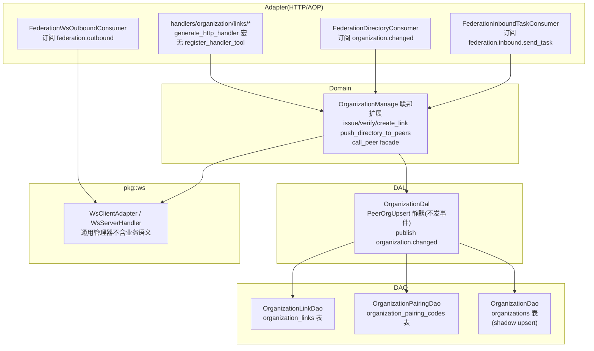

## §1 概述

**本卡角色**：联邦组网的地基知识卡。覆盖 OrganizationScope 三态（Local/Linked/Remote）扩展组织表语义、organization_links 点对点连接契约表、配对码（pairing code）短时效单用途握手协议、目录推拉结合同步（推送保证时效 + cron 定时对账保证最终一致）、WS 长连接（pkg::ws 通用管理器 + adapter 模式业务解耦）四层。**定位：新增组织间组网能力、排查建联失败、调试目录同步卡住、理解 shadow upsert 静默写入时读。**

- **OrganizationScope 三态扩展（common/src/enums/organization.rs）**：`Local(0)` 本地组织（自建/自管，默认值）→ `Linked(1)` 已建联对端（organizations 表影子记录，scope=Linked 表示已建 organization_links 连接契约，双向可通信）→ `Remote(2)` 仅目录同步所得（影子记录，未建联，只读展示）。scope 决定"能否通信"——只有 Linked 可发跨组织命令。**集团=group_name 纯展示标签，不参与任何逻辑判断**（ADR D1，消解分布式一致性问题）。
- **连接契约与实体分离（ADR D4）**：organizations 表描述组织本身（高频被全系统 join）；organization_links 表承载点对点连接的 endpoint + 双向凭证（access_token 明文出站 + peer_token_hash SHA256 入站校验）+ capabilities 连接级能力白名单 JSON。凭证不进 organizations 表，防止放大泄漏面。唯一约束 `(local_org_id, peer_org_id)` 保证两个组织间只有一条有效连接。
- **配对码协议（ADR D5，复用邀请码范式）**：签发（用户侧 JWT）→ verify + 凭证交换（机器侧，配对码鉴权）→ create_link（双向凭证落库 + shadow upsert 对端影子记录 + 目录拉取）。**配对码 24 字符去 0/O/1/I 字符集 + 10 分钟 TTL + 用后即焚**。`OrganizationPairingDao::consume` 单条 UPDATE 原子完成四判定（哈希匹配 + 未消费 + 未过期 + 置 consumed_at），任何不匹配返回 None——上层统一转 `Error::unauthorized`，**不区分原因防枚举探测**（评审稿 §6.3）。
- **shadow upsert 静默写入（src/service/dal/organization.rs）**：对端组织影子写入 organizations 表时走 `PeerOrgUpsert` trait，**不发事件**——与普通组织创建（发 `organization.changed` 事件触发 FederationDirectoryConsumer）严格分离，防止影子记录无限触发推送。静默写入逻辑封装在 organization DAL 层，domain 调用 `upsert_peer_org` 时显式走静默路径。
- **目录推拉结合同步**（src/consumer/federation_directory.rs + scheduler cron）：① **推送保证时效**——本地组织变更（创建/更新/删除）→ publish `organization.changed` → FederationDirectoryConsumer → `push_directory_to_peers` 全量推送所有 Active 对端（best-effort，推送失败不阻断主流程）；② **cron 定时对账保证最终一致**——SchedulerConsumer 每分钟触发 `directory_reconcile` → 查所有 Active 连接 → 双向 GET directory → 对比差异 → 差异方 pull 补齐。两条链路同源（最终调 OrganizationManage::push_directory_to_peers / reconcile_directories），推送快、对账稳。
- **WS 长连接架构（P8 落地）**：`pkg::ws` 通用管理器（client 侧 supervisor 指数退避重连 + 心跳 + 读循环；server 侧被动接受 + 心跳 + 优雅关闭）**不含任何业务语义**——帧解析与处置由 `WsClientAdapter` / `WsServerHandler` adapter 实现方全权解释。联邦 WS 出站 consumer 订阅 `federation.outbound` → ws::connection push 帧；入站 consumer 订阅 `federation.inbound.send_task` → 复用 HTTP send_task 核心函数。**命令发起方（call_peer facade）先查注册表决定走 WS 还是回退 HTTP**——无活连接时 WS consumer 告警丢弃不重试，避免自动 fallback 掩盖问题。

---

## §2 关键文件与职责表

| 文件 | 角色 | 内容摘要 | 源码锚点 |
|------|------|---------|---------|
| common/enums/organization.rs OrganizationScope | scope 三态枚举 | Local=0(默认) / Linked=1(已建联) / Remote=2(仅目录影子)；#[repr(i32)]+sqlx::Type；scope 列 migration ALTER | `:L1-L183` |
| common/api/organization_link.rs DTO 单一事实源 | 配对码 + 凭证交换 + 身份声明 | PAIRING_CODE_TTL_MS=600_000(10min) / PAIRING_CODE_LEN=24；IssuePairingCodeRequest/Response(签发) / VerifyPairingCodeRequest/Response(验证) / CreateLinkRequest/Response(建联) / FederationCallerDeclaration(明文身份声明 JSON，可选) | `:L1-L329` |
| models/organization_link.rs OrganizationLinkPo | 连接契约 PO | local_org_id + peer_org_id + endpoint + access_token(明文出站 32 字节随机) + peer_token_hash(SHA256 入站校验) + capabilities(JSON 数组) + status + (local_org_id, peer_org_id) 唯一约束 | `:L1-L89` |
| models/organization_pairing_code.rs OrganizationPairingCodePo | 配对码 PO | org_id + code_hash(仅存 SHA256) + expires_at + consumed_at(消费判定) | `:L1-L28` |
| service/dao/organization_link/mod.rs OrganizationLinkDao | 连接契约 DAO trait | insert / find_by_id / find_by_pair / find_by_token_hash(机器侧端点鉴权) / list / revoke | `:L1-L72` |
| service/dao/organization_pairing/mod.rs OrganizationPairingDao | 配对码 DAO trait | insert + consume(原子消费：哈希匹配 + 未消费 + 未过期 + 置 consumed_at + 返回签发 org_id；错误统一 None) | `:L1-L34` |
| service/domain/organization/org.rs OrganizationManage 联邦扩展 | Domain 层联邦能力编排 | issue_pairing_code(Rand 24 字符 → SHA256 → INSERT) / verify_pairing_code(consume) / create_link(双向凭证生成 + shadow upsert 对端影子 + 目录拉取) / push_directory_to_peers / reconcile_directories | `:L1-L1294` |
| service/dal/organization.rs OrganizationDal | DAL 层 shadow upsert + 事件发布 | PeerOrgUpsert 静默写入(不发事件) / publish organization.changed(推送触发) / cron directory_reconcile / call_peer facade(统一 WS/HTTP 出站入口) | `:L1-L515` |
| handlers/organization/links/mod.rs 联邦 Handler 模块 | 8 端点 HTTP 接口 | 统一前缀 /api/v1/organization/links/*；generate_http_handler 宏标注，**不注册 register_handler_tool** | `:L1-L27` |
| consumer/federation_directory.rs FederationDirectoryConsumer | 目录推送消费者 | 订阅 EventKind["organization.changed"] → push_directory_to_peers best-effort | `:L1-L72` |
| consumer/federation_ws_outbound.rs FederationWsOutboundConsumer | WS 出站帧投递 | 订阅 EventKind["federation.outbound"] → ws::connection push；无活连接告警丢弃 | `:L1-L79` |
| consumer/federation_inbound_task.rs FederationInboundTaskConsumer | WS 入站命令执行 | 订阅 EventKind["federation.inbound.send_task"] → 复用 handle_send_task → publish response 帧 | `:L1-L132` |
| pkg/ws/mod.rs 通用 WS 管理器 | WS 基建层 | client: supervisor 指数退避重连 + 心跳 + 读循环；server: 被动接受 + 心跳；adapter 模式业务解耦；**不含业务语义** | `:L1-L635` |
| migrations/20260904000001-000004 + 20260905000001 | 5 个联邦迁移 | group_name(展示) → organization_links(连接) → organization_pairing_codes(配对码) → capabilities(白名单) → addresses(多地址自报 + scope ALTER) | 见 migration files |
| docs/plan/组织组网与去中心化联邦方案.md | Phase 1 评审稿 | ADR D1-D7 + scope 三态数据模型 + 配对码协议 + 分阶段实施；集团=group_name 纯展示标签 | `:L1-L245` |

**章节来源**
- [organization.rs:L1-L183](common/src/enums/organization.rs#L1-L183)
- [org.rs:L1-L1294](src/service/domain/organization/org.rs#L1-L1294)
- [organization.rs(L515)](src/service/dal/organization.rs#L515)

---

## §3 架构约定

本卡为联邦组网的主主题，与 **【跨组织业务调用鉴权模型】** 互为兄弟卡（Level 3 视角兄弟卡）——本卡负责**连接建立**（scope 三态 + 连接表 + 配对码 + 目录 + WS 长连接），兄弟卡负责**跨组织调用时的鉴权与身份识别**（dual-mode auth + federation_identity + delegation + audit + capabilities）。

### 分层架构（Adapter → Domain → DAL → DAO，单向）



### 组网时序（配对码 → 建联 → 目录同步）

```
A 组织管理员发起配对
  → POST /links/issue_pairing_code (JWT)
  → OrganizationManage::issue_pairing_code
    → Rand 24 字符 → SHA256 → OrganizationPairingDao::insert
    → 返回 pairing_code + expires_at(10min) + ttl_seconds
  → 管理员把配对码给 B 组织

B 组织管理员验证配对码
  → POST /links/verify (machine-side, pairing_code in body)
  → OrganizationManage::verify_pairing_code
    → OrganizationPairingDao::consume(code_hash, now)
      → 原子 UPDATE: hash 匹配 + 未消费 + 未过期 → 置 consumed_at
      → 返回 A 的 org_id
    → 返回 A 的 endpoint + org_id + B 的 peer_token_hash

凭证交换 → 建联
  → POST /links/create (B 侧, machine-side)
  → OrganizationManage::create_link
    → 生成 access_token(32 字节随机) + B 存 peer_token_hash(SHA256)
    → 双向凭证交换完成
    → OrganizationLinkDao::insert (Active 连接)
    → PeerOrgUpsert::upsert_peer_org(A 作为影子 scope=Linked)
      → **静默写入，不发事件**
    → GET /links/get_directory(A) → 拉 A 的组织目录 → shadow upsert
    → publish organization.changed(B) → FederationDirectoryConsumer
      → push_directory_to_peers(A) → 全量推 B 的目录给 A
  → 完成，双向可通信
```

### WS 长连接命令帧投递

```
call_peer facade (发起方，domain/organization/org.rs)
  → 查 connection registry: 有活 WS → publish federation.outbound(event_id, frame, peer_org_id)
    → FederationWsOutboundConsumer → ws::connection push frame
    → 无活连接告警丢弃（发起方决定是否回退 HTTP）

接收方 WS 读循环 (pkg::ws 通用管理器)
  → adapter 解析帧 → EventKind["federation.inbound.send_task"]
    → FederationInboundTaskConsumer.consume
      → 复用 handle_send_task(ctx, params) (HTTP/Domain 零改动)
      → publish FederationOutboundEvent(response frame, event_id=请求方 event_id 配对)
        → 出站 consumer → 推回发起方
```

---

## §4 硬约束与回归红线

1. **配对码 consume 错误统一返回 None，上层转 Error::unauthorized，绝不区分无效/过期/已使用**：任何区分原因的错误返回都会被攻击者用来探测（枚举哪些配对码已过期/已用）。单元测试必须覆盖三种不匹配路径，都断言返回 None。
2. **shadow upsert 对端影子必须走 PeerOrgUpsert trait，不发事件**：如果 shadow upsert 发 `organization.changed`，FederationDirectoryConsumer 会把影子记录再次推送出去，形成无限循环推送风暴。代码走静态路径：create_link 里显式调 `organization::dal().upsert_peer_org(...)` 而非 `organization::domain().create_organization(...)`。
3. **organizations + organization_links 必须在同一个事务内写入**：create_link 时（B 侧），peer_org 影子 upsert 与 OrganizationLinkPo insert 必须包在同一个 `.transaction(|tx| ...)` 里——成功则双写、失败则全回滚。如果连接写成功但影子写失败，会出现"有连接但查不到对端组织"的半残状态，导致后续目录拉取 NPE。
4. **access_token 出站明文存本地，peer_token_hash 入站只存 SHA256**：凭证交换是对称的——A 生成 access_token 给 B，A 自己只存 peer_token_hash = SHA256(token_B)（B 调 A 时带 token_B，A 哈希后匹配）。**禁止任何一侧存对方 token 的明文**——明文泄漏（DB dump / 日志 / debug build）会导致伪造跨组织调用。
5. **capabilities 白名单默认值 '[]' 表示无能力开放**：新建联默认 capabilities='[]'（JSON 空数组字符串）——所有跨组织调用一律 403。必须显式追加允许的能力（如 `["a2a_task"]`）后才放行。这是 fail-closed 设计，防止建联即默认开放全部能力。
6. **handlers/organization/links/* 只标 generate_http_handler，绝不注册 register_handler_tool**：联邦组网端点是**管理员操作**，Agent 误触（如"帮我删了这个组织的连接"）是高危操作。Handler 模块显式无 `register_handler_tool!` 宏调用——该模块所有端点不会出现在 Agent 可调用工具列表里。全局 grep `register_handler_tool` 不应匹配任何 links 目录下的文件。
7. **call_peer facade 先查 WS registry 决定走 WS 还是回退 HTTP，WS 出站 consumer 无活连接时只告警不重试**：WS consumer 的职责是「已决定走 WS 的帧投递」，不负责策略判断。如果 consumer 检测无活连接时自动重试 HTTP fallback，会掩盖「发起方本该提前发现无连接就不走 WS」的设计缺陷，导致断线时静默失败。consumer 日志 WARN "no active WS connection for peer_org_id=xxx, dropping federation.outbound event"，由运维排障。
8. **pkg::ws 通用管理器严禁嵌入任何业务语义**：pkg::ws/mod.rs 和 server.rs 是纯 WS 生命周期组件——只关心建连、心跳、重连、读循环、优雅关闭。帧解析、业务帧类型映射、错误转业务错误——全部交给 WsClientAdapter / WsServerHandler 实现方。任何在 pkg::ws 模块里出现 "federation" / "lark" / "agent" 等业务关键词直接 fail。
9. **scope 列默认值 Local + scope=Linked/Remote 的判定规则不得修改**：现有任何代码不得新增 scope 比较逻辑，也不得把 group_name 作为判定条件。`WHERE scope IN (0, 1)` 才是"本地 + 已建联"，`scope = 1` 才是"已建联可通信"。禁止代码里出现 `scope == 2` 时执行写操作（Remote 是只读影子）。
10. **目录推送 + cron 对账双链路必须同同源最终调 OrganizationManage 方法**：推送走 `push_directory_to_peers`，对账走 `reconcile_directories` — 两条链路最终汇总到同一个 Domain 方法。禁止各 consumer 自己拼 HTTP 推送逻辑（逻辑分叉会导致 bug 难以排查）。
