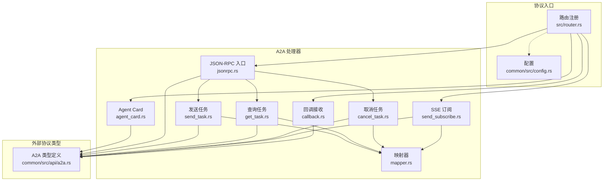
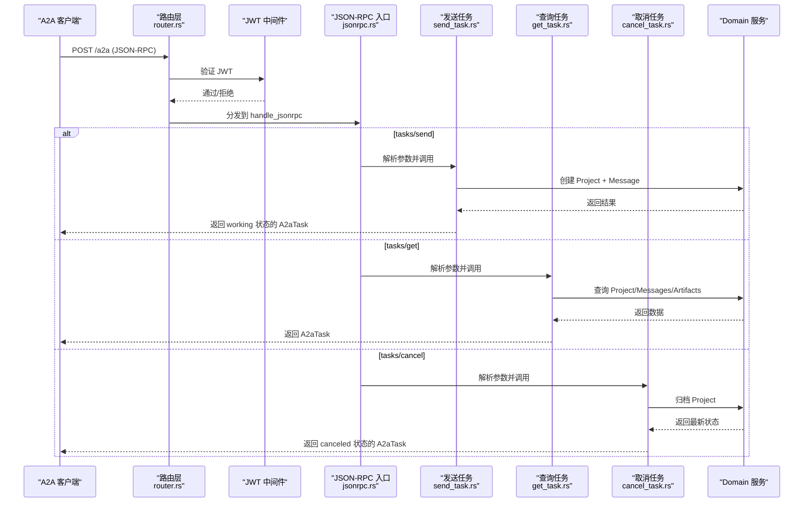
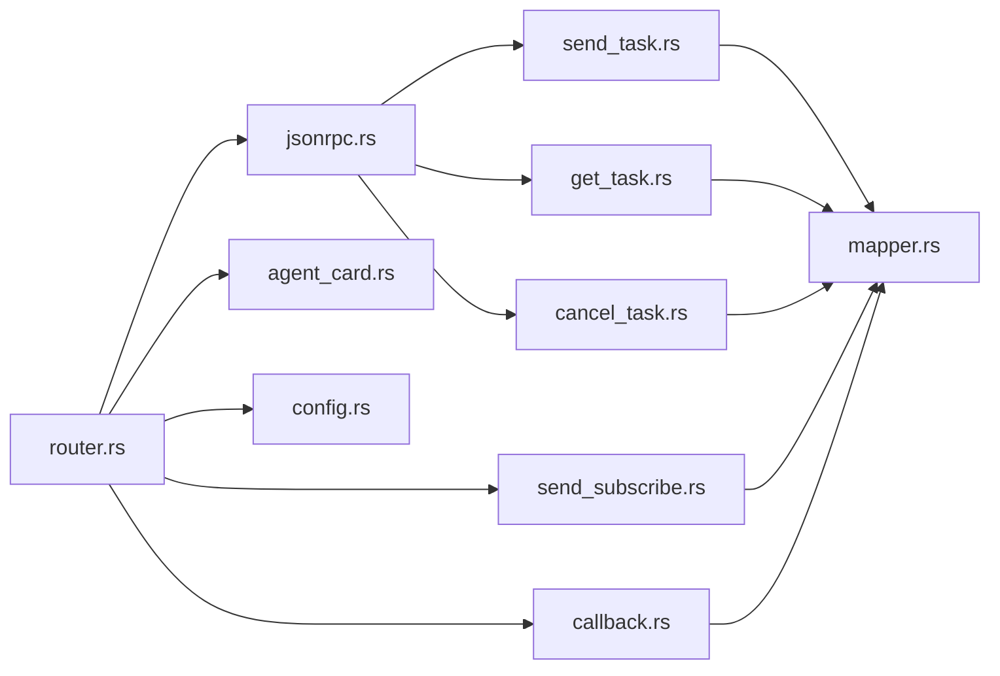

# A2A 协议

<cite>
**本文引用的文件**
- [common/src/api/a2a.rs](common/src/api/a2a.rs)
- [src/handlers/a2a/mod.rs](src/handlers/a2a/mod.rs)
- [src/handlers/a2a/jsonrpc.rs](src/handlers/a2a/jsonrpc.rs)
- [src/handlers/a2a/agent_card.rs](src/handlers/a2a/agent_card.rs)
- [src/handlers/a2a/send_task.rs](src/handlers/a2a/send_task.rs)
- [src/handlers/a2a/get_task.rs](src/handlers/a2a/get_task.rs)
- [src/handlers/a2a/cancel_task.rs](src/handlers/a2a/cancel_task.rs)
- [src/handlers/a2a/send_subscribe.rs](src/handlers/a2a/send_subscribe.rs)
- [src/handlers/a2a/callback.rs](src/handlers/a2a/callback.rs)
- [src/handlers/a2a/mapper.rs](src/handlers/a2a/mapper.rs)
- [src/router.rs](src/router.rs)
- [common/src/config.rs](common/src/config.rs)
- [docs/archive/design-archive/a2a_server_design.md](docs/archive/design-archive/a2a_server_design.md)
- [docs/external_agent_design.md](docs/external_agent_design.md)
</cite>

## 目录
1. [简介](#简介)
2. [项目结构](#项目结构)
3. [核心组件](#核心组件)
4. [架构总览](#架构总览)
5. [详细组件分析](#详细组件分析)
6. [依赖关系分析](#依赖关系分析)
7. [性能与可靠性](#性能与可靠性)
8. [故障排查指南](#故障排查指南)
9. [结论](#结论)
10. [附录：协议交互示例](#附录协议交互示例)

## 简介
本规范定义 ai_orz 作为 A2A Server 对外暴露的 Agent-to-Agent 协议能力，包括：
- Agent 发现机制（/.well-known/agent.json）
- JSON-RPC 2.0 通信协议（POST /a2a）
- 任务生命周期管理（tasks/send、tasks/get、tasks/cancel）
- 实时通知机制（tasks/sendSubscribe SSE）
- 回调机制（POST /a2a/callback/:task_id）
- 消息格式、状态转换、错误处理与重试策略
- 安全验证、身份认证与访问控制
- 调试工具与常见问题排查

该实现遵循“适配层只做协议转换，Domain 层不感知 A2A”的原则，复用现有 JWT、前台 Agent 路由、消息投递与 SSE 基础设施。

## 项目结构
A2A 协议相关代码集中在 handlers/a2a 模块，协议实体在 common/src/api/a2a.rs，路由注册在 src/router.rs，配置项在 common/src/config.rs。

**图表来源**
- [src/router.rs:12-59](src/router.rs#L12-L59)
- [src/handlers/a2a/mod.rs:1-28](src/handlers/a2a/mod.rs#L1-L28)
- [common/src/api/a2a.rs:1-306](common/src/api/a2a.rs#L1-L306)
- [common/src/config.rs:21-59](common/src/config.rs#L21-L59)

**章节来源**
- [src/router.rs:12-59](src/router.rs#L12-L59)
- [src/handlers/a2a/mod.rs:1-28](src/handlers/a2a/mod.rs#L1-L28)
- [common/src/api/a2a.rs:1-306](common/src/api/a2a.rs#L1-L306)
- [common/src/config.rs:21-59](common/src/config.rs#L21-L59)

## 核心组件
- Agent Card：公开组织级能力描述，无需认证。
- JSON-RPC 入口：统一解析请求、校验版本、分发方法。
- 任务操作：
  - tasks/send：异步提交任务，立即返回 working。
  - tasks/get：查询任务状态、消息与产物。
  - tasks/cancel：取消任务并归档。
- SSE 流式：tasks/sendSubscribe 建立 SSE 通道，推送完整 A2A Task。
- 回调：/a2a/callback/:task_id 接收外部 Agent 的状态更新与新消息。
- 映射器：A2A 实体与内部实体的双向转换。

**章节来源**
- [src/handlers/a2a/agent_card.rs:1-37](src/handlers/a2a/agent_card.rs#L1-L37)
- [src/handlers/a2a/jsonrpc.rs:1-94](src/handlers/a2a/jsonrpc.rs#L1-L94)
- [src/handlers/a2a/send_task.rs:1-128](src/handlers/a2a/send_task.rs#L1-L128)
- [src/handlers/a2a/get_task.rs:1-49](src/handlers/a2a/get_task.rs#L1-L49)
- [src/handlers/a2a/cancel_task.rs:1-55](src/handlers/a2a/cancel_task.rs#L1-L55)
- [src/handlers/a2a/send_subscribe.rs:1-212](src/handlers/a2a/send_subscribe.rs#L1-L212)
- [src/handlers/a2a/callback.rs:1-198](src/handlers/a2a/callback.rs#L1-L198)
- [src/handlers/a2a/mapper.rs:1-99](src/handlers/a2a/mapper.rs#L1-L99)
- [common/src/api/a2a.rs:1-306](common/src/api/a2a.rs#L1-L306)

## 架构总览
A2A 协议通过 HTTP 暴露，分为公开端点（Agent Card、回调）与受保护端点（JSON-RPC、SSE）。所有业务逻辑调用 Domain 层完成，A2A 概念不出现在 Domain 层。

**图表来源**
- [src/router.rs:21-56](src/router.rs#L21-L56)
- [src/handlers/a2a/jsonrpc.rs:22-93](src/handlers/a2a/jsonrpc.rs#L22-L93)
- [src/handlers/a2a/send_task.rs:32-127](src/handlers/a2a/send_task.rs#L32-L127)
- [src/handlers/a2a/get_task.rs:18-48](src/handlers/a2a/get_task.rs#L18-L48)
- [src/handlers/a2a/cancel_task.rs:18-53](src/handlers/a2a/cancel_task.rs#L18-L53)

## 详细组件分析

### Agent 发现（/.well-known/agent.json）
- 公开 GET 端点，无需 JWT。
- 返回组织级 AgentCard，包含 name、description、version、url、capabilities、skills、默认输入输出模式等。
- capabilities.streaming 当前为 false；push_notifications 为 true。

**章节来源**
- [src/handlers/a2a/agent_card.rs:1-37](src/handlers/a2a/agent_card.rs#L1-L37)
- [common/src/api/a2a.rs:12-62](common/src/api/a2a.rs#L12-L62)
- [src/router.rs:21-26](src/router.rs#L21-L26)

### JSON-RPC 通信协议（POST /a2a）
- 固定 jsonrpc 版本 "2.0"，未匹配版本返回 INVALID_REQUEST。
- 支持方法：
  - tasks/send：异步提交，立即返回 working。
  - tasks/get：查询任务状态、消息、产物。
  - tasks/cancel：取消任务并归档。
- 未知方法返回 METHOD_NOT_FOUND。
- 错误统一封装为 JsonRpcResponse.error。

**章节来源**
- [src/handlers/a2a/jsonrpc.rs:22-93](src/handlers/a2a/jsonrpc.rs#L22-L93)
- [common/src/api/a2a.rs:64-145](common/src/api/a2a.rs#L64-L145)

### 任务发送（tasks/send）
- 流程要点：
  - 从 RequestContext 提取用户上下文。
  - 使用 hr_domain().resolve_agent(ctx) 获取前台 Agent（不耦合 project）。
  - 创建 Project（对应 A2A task），绑定 owner_agent_id。
  - 启动 Project（转为 InProgress）。
  - 创建 Message（from=user, to=agent），自动入队事件队列。
  - 若提供 notification_url，创建 A2aCallback 渠道（scope_project 限定）。
  - 立即返回 working 状态的 A2aTask。
- 唤醒由 consumer 异步闭环，handler 不调用 wake/awaken。

**章节来源**
- [src/handlers/a2a/send_task.rs:32-127](src/handlers/a2a/send_task.rs#L32-L127)
- [docs/archive/design-archive/a2a_server_design.md:361-387](docs/archive/design-archive/a2a_server_design.md#L361-L387)

### 任务查询（tasks/get）
- 根据 id 查询 Project，再查询 Messages 与 Artifacts。
- 通过 mapper.build_a2a_task 转换为 A2aTask。

**章节来源**
- [src/handlers/a2a/get_task.rs:18-48](src/handlers/a2a/get_task.rs#L18-L48)
- [src/handlers/a2a/mapper.rs:57-84](src/handlers/a2a/mapper.rs#L57-L84)

### 任务取消（tasks/cancel）
- 查询 Project 确保存在。
- 归档 Project（对应 A2A canceled）。
- 重新查询并构建 A2aTask 返回。

**章节来源**
- [src/handlers/a2a/cancel_task.rs:18-53](src/handlers/a2a/cancel_task.rs#L18-L53)

### 实时通知（tasks/sendSubscribe SSE）
- 创建 Project + Message（同 tasks/send）。
- 订阅用户 SSE 通道（复用 message_push 机制）。
- 每次收到消息更新时推送完整 A2A Task（当前仅 messages，artifacts 为空）。
- 连接关闭或进程退出时自动清理订阅。

**章节来源**
- [src/handlers/a2a/send_subscribe.rs:35-124](src/handlers/a2a/send_subscribe.rs#L35-L124)
- [src/handlers/a2a/send_subscribe.rs:126-212](src/handlers/a2a/send_subscribe.rs#L126-L212)

### 回调机制（POST /a2a/callback/:task_id）
- 公开端点，无需 JWT。
- 校验本地 Task 存在且非终态。
- 校验外部 task_id 与本地 tags 中记录一致。
- 去重策略：基于 tags 中的 a2a_synced_msgs:N 只处理新消息。
- 将 agent/assistant 角色的文本消息投递给用户（send_to_user）。
- 状态映射：Completed→Completed；Failed/Canceled→Cancelled；Working/Submitted/InputRequired→Pending→InProgress。
- 幂等性：终态任务直接返回 ok；失败可重试。

**章节来源**
- [src/handlers/a2a/callback.rs:17-197](src/handlers/a2a/callback.rs#L17-L197)
- [docs/external_agent_design.md:107-188](docs/external_agent_design.md#L107-L188)

### 映射器（A2A ↔ 内部实体）
- 状态映射：ProjectStatus → A2aTaskState。
- 消息映射：MessagePo → A2aMessage（role 区分 user/agent）。
- 产物映射：Artifact → A2aArtifact。
- 构建 A2aTask：聚合 status、messages、artifacts、session_id。
- 提取文本：从 A2aMessage.parts 中提取 Text 内容。

**章节来源**
- [src/handlers/a2a/mapper.rs:14-99](src/handlers/a2a/mapper.rs#L14-L99)

### 安全验证、身份认证与访问控制
- Agent Card：公开路由，无需认证。
- JSON-RPC（/a2a）与 SSE（/a2a/subscribe）：挂 JWT 中间件，复用现有 Claims（user_id、organization_id、role）。
- 回调（/a2a/callback/:task_id）：公开路由，用于外部系统推送，内部做 task_id 一致性校验。
- 权限沿用用户角色，无新增表。

**章节来源**
- [src/router.rs:21-56](src/router.rs#L21-L56)
- [docs/archive/design-archive/a2a_server_design.md:79-106](docs/archive/design-archive/a2a_server_design.md#L79-L106)

## 依赖关系分析
- 路由层负责注册 A2A 端点与中间件顺序（jwt_auth → request_context）。
- JSON-RPC 入口按 method 分发到具体 handler。
- 各 handler 调用 Domain 层完成业务，并通过 mapper 进行协议转换。
- 配置项控制 A2A Server 开关与协议版本。

**图表来源**
- [src/router.rs:21-56](src/router.rs#L21-L56)
- [src/handlers/a2a/jsonrpc.rs:22-93](src/handlers/a2a/jsonrpc.rs#L22-L93)
- [src/handlers/a2a/mapper.rs:57-99](src/handlers/a2a/mapper.rs#L57-L99)
- [common/src/config.rs:21-59](common/src/config.rs#L21-L59)

**章节来源**
- [src/router.rs:21-56](src/router.rs#L21-L56)
- [src/handlers/a2a/jsonrpc.rs:22-93](src/handlers/a2a/jsonrpc.rs#L22-L93)
- [src/handlers/a2a/mapper.rs:57-99](src/handlers/a2a/mapper.rs#L57-L99)
- [common/src/config.rs:21-59](common/src/config.rs#L21-L59)

## 性能与可靠性
- 异步提交：tasks/send 立即返回 working，唤醒由 consumer 异步闭环，避免阻塞。
- SSE 推送：复用 message_push 广播通道，同用户多订阅共享同一通道。
- 回调幂等：终态任务跳过；消息去重基于 a2a_synced_msgs 计数。
- 轮询兜底：外部 Remote Agent 场景下，每 30 秒轮询一次，天然支持重试。
- 配置开关：a2a_server.enabled=false 时端点返回 404，不影响其他功能。

**章节来源**
- [src/handlers/a2a/send_task.rs:32-127](src/handlers/a2a/send_task.rs#L32-L127)
- [src/handlers/a2a/send_subscribe.rs:35-124](src/handlers/a2a/send_subscribe.rs#L35-L124)
- [src/handlers/a2a/callback.rs:17-197](src/handlers/a2a/callback.rs#L17-L197)
- [docs/external_agent_design.md:118-188](docs/external_agent_design.md#L118-L188)
- [common/src/config.rs:21-59](common/src/config.rs#L21-L59)

## 故障排查指南
- 无法访问 /a2a：
  - 检查 a2a_server.enabled 是否为 true。
  - 确认携带有效 JWT 令牌。
- 未知方法错误：
  - 检查 method 字段是否支持（tasks/send、tasks/get、tasks/cancel）。
- 任务不存在：
  - 检查传入的 id 是否正确。
- 回调失败：
  - 检查 task_id 是否与本地 tags 中 a2a_task_id 一致。
  - 检查任务是否已处于终态。
- SSE 无推送：
  - 检查订阅是否成功建立。
  - 检查消息是否属于目标 project_id。

**章节来源**
- [src/handlers/a2a/jsonrpc.rs:22-93](src/handlers/a2a/jsonrpc.rs#L22-L93)
- [src/handlers/a2a/get_task.rs:18-48](src/handlers/a2a/get_task.rs#L18-L48)
- [src/handlers/a2a/callback.rs:17-197](src/handlers/a2a/callback.rs#L17-L197)
- [src/handlers/a2a/send_subscribe.rs:35-124](src/handlers/a2a/send_subscribe.rs#L35-L124)

## 结论
本规范实现了 A2A Server 的核心能力：Agent 发现、JSON-RPC 通信、任务生命周期管理、SSE 实时通知与回调机制。通过适配层隔离协议与领域模型，复用现有认证、路由与消息基础设施，保证扩展性与稳定性。后续可进一步增强 artifacts 推送、InputRequired 处理与轮询性能优化。

## 附录：协议交互示例

### Agent 发现
- 请求：GET /.well-known/agent.json
- 响应：AgentCard（name、description、version、url、capabilities、skills、default_input_modes、default_output_modes）

**章节来源**
- [src/handlers/a2a/agent_card.rs:13-36](src/handlers/a2a/agent_card.rs#L13-L36)
- [common/src/api/a2a.rs:12-62](common/src/api/a2a.rs#L12-L62)

### 握手与鉴权
- 请求：POST /a2a（JSON-RPC 2.0）
- 头部：Authorization: Bearer <token>
- 校验：jsonrpc 版本必须为 "2.0"，否则返回 INVALID_REQUEST。

**章节来源**
- [src/handlers/a2a/jsonrpc.rs:22-44](src/handlers/a2a/jsonrpc.rs#L22-L44)
- [src/router.rs:27-38](src/router.rs#L27-L38)

### 任务执行（tasks/send）
- 请求体：JsonRpcRequest{method:"tasks/send", params: SendTaskParams}
- 行为：创建 Project + Message，立即返回 working 状态的 A2aTask。
- 可选：notification_url 用于 PushNotifications。

**章节来源**
- [src/handlers/a2a/jsonrpc.rs:77-81](src/handlers/a2a/jsonrpc.rs#L77-L81)
- [src/handlers/a2a/send_task.rs:32-127](src/handlers/a2a/send_task.rs#L32-L127)
- [common/src/api/a2a.rs:269-288](common/src/api/a2a.rs#L269-L288)

### 状态更新（tasks/get）
- 请求体：JsonRpcRequest{method:"tasks/get", params: GetTaskParams}
- 行为：查询 Project/Messages/Artifacts，返回 A2aTask。

**章节来源**
- [src/handlers/a2a/jsonrpc.rs:83-86](src/handlers/a2a/jsonrpc.rs#L83-L86)
- [src/handlers/a2a/get_task.rs:18-48](src/handlers/a2a/get_task.rs#L18-L48)
- [common/src/api/a2a.rs:290-298](common/src/api/a2a.rs#L290-L298)

### 取消操作（tasks/cancel）
- 请求体：JsonRpcRequest{method:"tasks/cancel", params: CancelTaskParams}
- 行为：归档 Project，返回 canceled 状态的 A2aTask。

**章节来源**
- [src/handlers/a2a/jsonrpc.rs:89-92](src/handlers/a2a/jsonrpc.rs#L89-L92)
- [src/handlers/a2a/cancel_task.rs:18-53](src/handlers/a2a/cancel_task.rs#L18-L53)
- [common/src/api/a2a.rs:300-305](common/src/api/a2a.rs#L300-L305)

### 实时通知（tasks/sendSubscribe）
- 请求：POST /a2a/subscribe（JSON-RPC 风格参数，但走 SSE）
- 行为：创建任务后建立 SSE 通道，推送完整 A2aTask。

**章节来源**
- [src/router.rs:39-48](src/router.rs#L39-L48)
- [src/handlers/a2a/send_subscribe.rs:35-124](src/handlers/a2a/send_subscribe.rs#L35-L124)

### 回调机制（PushNotifications）
- 请求：POST /a2a/callback/:task_id（无需 JWT）
- 行为：校验 task_id，去重新消息，投递给用户，更新任务状态。

**章节来源**
- [src/router.rs:49-56](src/router.rs#L49-L56)
- [src/handlers/a2a/callback.rs:17-197](src/handlers/a2a/callback.rs#L17-L197)