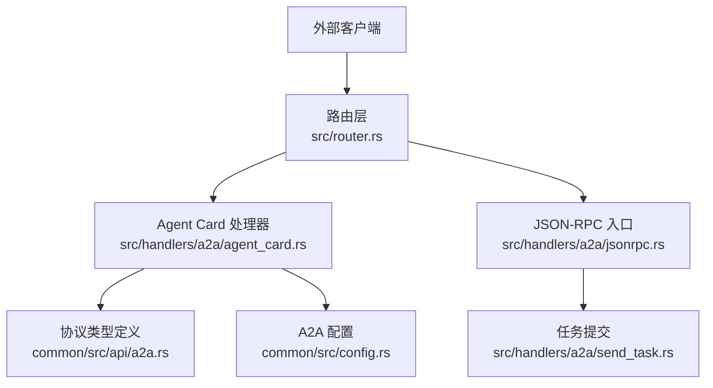
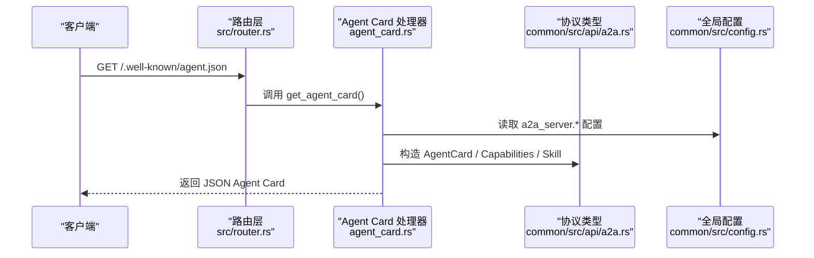
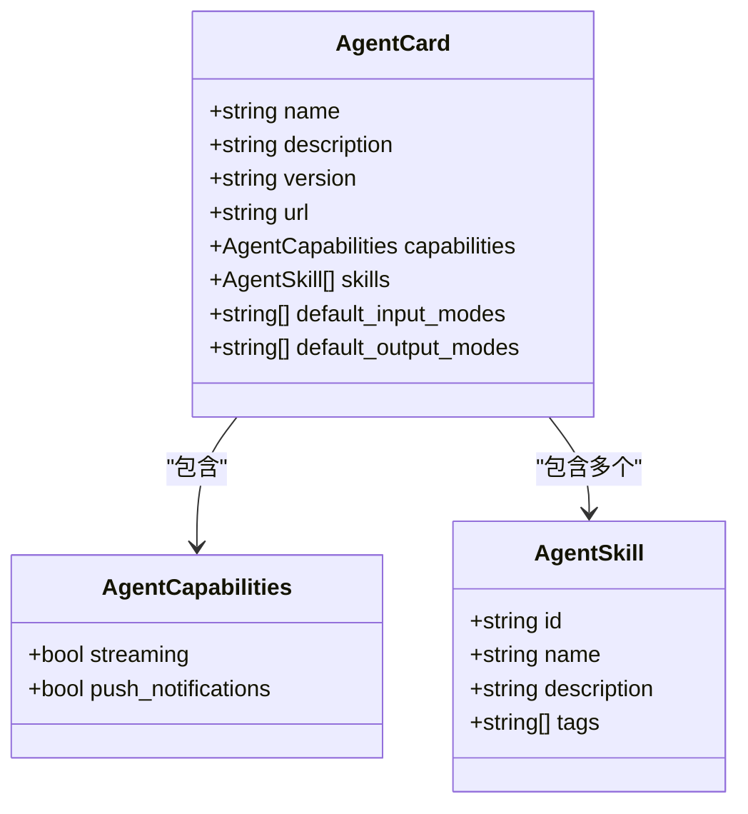
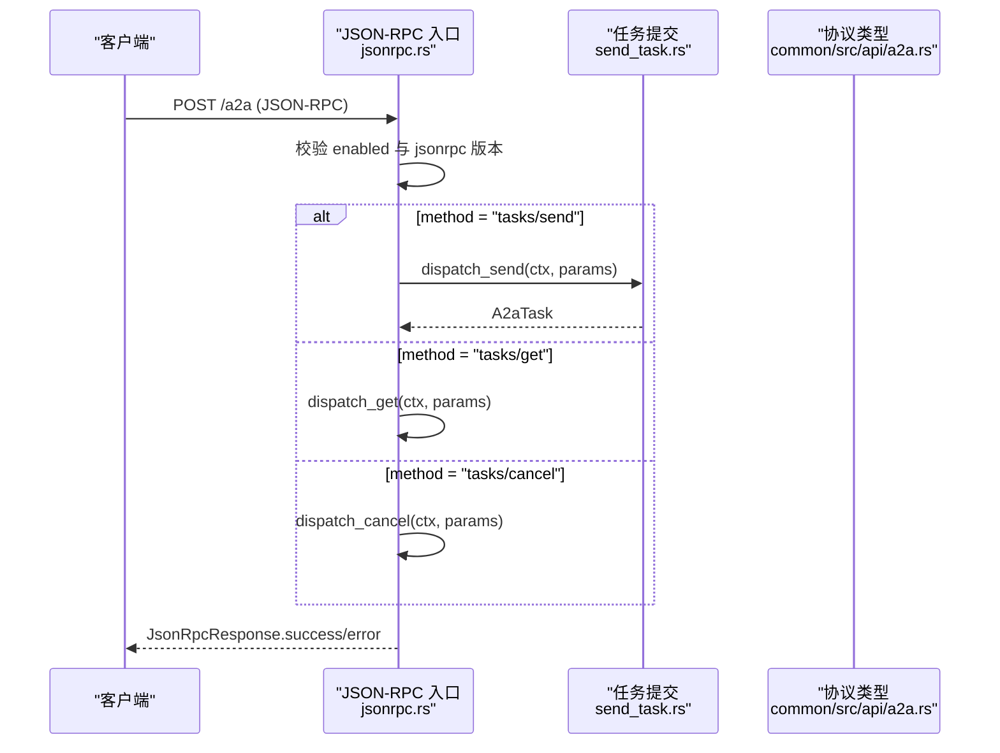
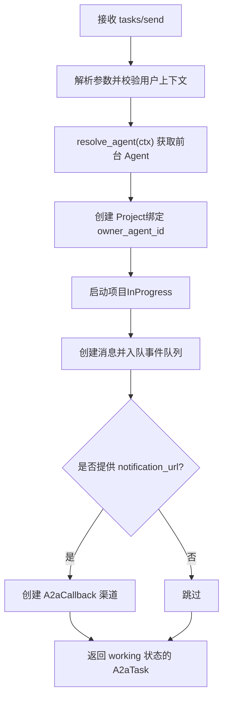
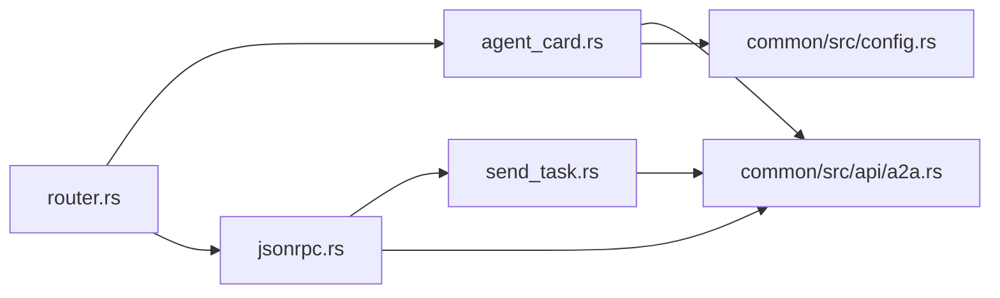

# Agent 发现机制

<cite>
**本文引用的文件**
- [src/handlers/a2a/agent_card.rs](src/handlers/a2a/agent_card.rs)
- [common/src/api/a2a.rs](common/src/api/a2a.rs)
- [src/router.rs](src/router.rs)
- [common/src/config.rs](common/src/config.rs)
- [src/handlers/a2a/jsonrpc.rs](src/handlers/a2a/jsonrpc.rs)
- [src/handlers/a2a/send_task.rs](src/handlers/a2a/send_task.rs)
- [tests/integration/a2a_flow_test.rs](tests/integration/a2a_flow_test.rs)
- [docs/superpowers/specs/2026-07-19-a2a-server/spec.md](docs/superpowers/specs/2026-07-19-a2a-server/spec.md)
- [A2A 协议层：AgentCard 发现 + JSON-RPC 2.0 + A2aTask 任务状态机 + A2aMessage 双向消息](docs/wiki/knowledge/zh/A2A 协议层：AgentCard 发现 + JSON-RPC 2.0 + A2aTask 任务状态机 + A2aMessage 双向消息/A2A 协议层：AgentCard 发现 + JSON-RPC 2.0 + A2aTask 任务状态机 + A2aMessage 双向消息.md)
</cite>

## 目录
1. [简介](#简介)
2. [项目结构](#项目结构)
3. [核心组件](#核心组件)
4. [架构总览](#架构总览)
5. [详细组件分析](#详细组件分析)
6. [依赖关系分析](#依赖关系分析)
7. [性能与可用性](#性能与可用性)
8. [故障排查指南](#故障排查指南)
9. [结论](#结论)
10. [附录：示例与集成片段](#附录示例与集成片段)

## 简介
本文件聚焦 A2A 协议的 Agent 发现机制，围绕公开端点 GET /.well-known/agent.json 的作用、响应格式（Agent Card）、能力声明、技能描述、默认输入输出模式等字段进行完整说明；并基于代码实现梳理 Agent 注册流程、动态发现与版本管理机制，给出验证规则、安全考虑与最佳实践，最后提供端到端集成要点与常见问题排查方法。

## 项目结构
A2A 发现机制由路由层、Handler 层、协议类型定义与配置共同构成：
- 路由层：在应用启动时注册公开发现端点与受保护的 JSON-RPC 端点。
- Handler 层：/.well-known/agent.json 返回组织级 Agent Card；/a2a 处理 JSON-RPC 请求。
- 协议类型：common 模块中定义 A2A 协议实体（AgentCard、Capabilities、Skill、Task、Message 等）。
- 配置：A2aServerConfig 控制是否启用、协议版本、JSON-RPC 端点路径与 Agent Card 路径。



图表来源
- [src/router.rs:12-59](src/router.rs#L12-L59)
- [src/handlers/a2a/agent_card.rs:1-36](src/handlers/a2a/agent_card.rs#L1-L36)
- [common/src/api/a2a.rs:10-62](common/src/api/a2a.rs#L10-L62)
- [common/src/config.rs:510-549](common/src/config.rs#L510-L549)

章节来源
- [src/router.rs:12-59](src/router.rs#L12-L59)
- [src/handlers/a2a/agent_card.rs:1-36](src/handlers/a2a/agent_card.rs#L1-L36)
- [common/src/api/a2a.rs:10-62](common/src/api/a2a.rs#L10-L62)
- [common/src/config.rs:510-549](common/src/config.rs#L510-L549)

## 核心组件
- Agent Card 端点：GET /.well-known/agent.json，公开访问，无需 JWT，返回组织级能力描述。
- Agent Card 数据结构：包含 name、description、version、url、capabilities、skills、default_input_modes、default_output_modes。
- 能力声明：streaming（SSE 流式）与 push_notifications（推送通知）布尔标志。
- 技能描述：id、name、description、tags 的 AgentSkill 列表。
- 配置开关：A2aServerConfig.enabled 控制 JSON-RPC 端点是否可用；protocol_version、endpoint、card_path 决定版本与路径。

章节来源
- [src/handlers/a2a/agent_card.rs:1-36](src/handlers/a2a/agent_card.rs#L1-L36)
- [common/src/api/a2a.rs:10-62](common/src/api/a2a.rs#L10-L62)
- [common/src/config.rs:510-549](common/src/config.rs#L510-L549)

## 架构总览
A2A 发现机制遵循四层单向调用原则：适配层（HTTP Handler）→ 领域层 → 数据访问层 → 持久化层。Agent Card 属于适配层公开端点，仅读取配置并返回静态能力描述，不耦合具体内部 Agent。



图表来源
- [src/router.rs:21-26](src/router.rs#L21-L26)
- [src/handlers/a2a/agent_card.rs:13-35](src/handlers/a2a/agent_card.rs#L13-L35)
- [common/src/api/a2a.rs:10-62](common/src/api/a2a.rs#L10-L62)
- [common/src/config.rs:510-549](common/src/config.rs#L510-L549)

## 详细组件分析

### Agent Card 端点与响应格式
- 端点：GET /.well-known/agent.json
- 认证：公开，无需 JWT，仅需 RequestContext 中间件注入上下文。
- 响应体：AgentCard 对象，包含：
  - name：组织名称
  - description：可选的组织描述
  - version：协议版本（来自配置）
  - url：协议端点路径（来自配置）
  - capabilities：{ streaming, push_notifications }
  - skills：AgentSkill[]，每个包含 id、name、description、tags
  - default_input_modes：默认输入模式数组
  - default_output_modes：默认输出模式数组



图表来源
- [common/src/api/a2a.rs:10-62](common/src/api/a2a.rs#L10-L62)

章节来源
- [src/handlers/a2a/agent_card.rs:1-36](src/handlers/a2a/agent_card.rs#L1-L36)
- [common/src/api/a2a.rs:10-62](common/src/api/a2a.rs#L10-L62)

### 路由与中间件
- 路由注册：在 create_router 中注册 /.well-known/agent.json 与 /a2a、/a2a/subscribe、/a2a/callback/{task_id}。
- 中间件顺序：
  - Agent Card：仅 request_context_middleware，无需 JWT。
  - JSON-RPC：先 jwt_auth_middleware，再 request_context_middleware。
  - SSE 订阅：同 JSON-RPC 中间件顺序。
  - 回调端点：公开，仅 RequestContext。

```mermaid
flowchart TD
Start(["请求进入"]) --> Route{"路径匹配"}
Route --> |/.well-known/agent.json| Card["get_agent_card()<br/>仅 RequestContext"]
Route --> |/a2a| RPC["handle_jsonrpc()<br/>JWT + RequestContext"]
Route --> |/a2a/subscribe| Sub["send_subscribe()<br/>JWT + RequestContext"]
Route --> |/a2a/callback/{task_id}| CB["callback()<br/>仅 RequestContext"]
Card --> End(["返回 Agent Card"])
RPC --> End
Sub --> End
CB --> End
```

图表来源
- [src/router.rs:21-59](src/router.rs#L21-L59)

章节来源
- [src/router.rs:21-59](src/router.rs#L21-L59)

### JSON-RPC 入口与方法分发
- POST /a2a：接收 JSON-RPC 2.0 请求，校验 jsonrpc 版本，按 method 分发到 tasks/send、tasks/get、tasks/cancel。
- 错误处理：未启用 A2A Server、不支持版本、方法不存在均返回标准错误码。
- 成功响应：将业务结果序列化为 Value 并包装为 JsonRpcResponse.success。



图表来源
- [src/handlers/a2a/jsonrpc.rs:22-94](src/handlers/a2a/jsonrpc.rs#L22-L94)
- [src/handlers/a2a/send_task.rs:31-128](src/handlers/a2a/send_task.rs#L31-L128)
- [common/src/api/a2a.rs:64-145](common/src/api/a2a.rs#L64-L145)

章节来源
- [src/handlers/a2a/jsonrpc.rs:22-94](src/handlers/a2a/jsonrpc.rs#L22-L94)
- [src/handlers/a2a/send_task.rs:31-128](src/handlers/a2a/send_task.rs#L31-L128)

### 任务提交流程（tasks/send）
- 步骤：
  1. 从 RequestContext 提取用户 ID。
  2. 通过 hr_domain().resolve_agent(ctx) 获取前台 Agent（handler 层显式组合 agent 与 project 两个维度）。
  3. 创建 Project（对应 A2A Task），绑定 owner_agent_id。
  4. 启动项目状态流转至 InProgress。
  5. 创建消息（from=user, to=agent），自动入队事件队列，consumer 异步唤醒 Agent。
  6. 立即返回 working 状态的 A2aTask（不等待 Agent 回复）。
  7. 若提供 notification_url，创建 A2aCallback 渠道用于后续推送。



图表来源
- [src/handlers/a2a/send_task.rs:31-128](src/handlers/a2a/send_task.rs#L31-L128)

章节来源
- [src/handlers/a2a/send_task.rs:31-128](src/handlers/a2a/send_task.rs#L31-L128)

### 版本管理与动态发现
- 版本管理：
  - protocol_version 来自 A2aServerConfig，默认 "0.3.0"。
  - JSON-RPC 入口强制要求 jsonrpc 版本为 "2.0"，否则返回 INVALID_REQUEST。
- 动态发现：
  - Agent Card 路径 card_path 默认 "/.well-known/agent.json"。
  - 客户端可通过该路径拉取组织级能力描述，无需认证。
  - 能力字段 streaming/push_notifications 指示服务端支持特性。

章节来源
- [common/src/config.rs:510-549](common/src/config.rs#L510-L549)
- [src/handlers/a2a/jsonrpc.rs:22-44](src/handlers/a2a/jsonrpc.rs#L22-L44)
- [src/handlers/a2a/agent_card.rs:13-35](src/handlers/a2a/agent_card.rs#L13-L35)

### 安全考虑与最佳实践
- 认证策略：
  - Agent Card 公开，便于外部系统发现；但敏感操作（如 tasks/send）必须通过 JWT 保护。
  - 回调端点公开，用于外部 Agent 推送更新；需在 handler 内做必要校验（例如 task_id 合法性）。
- 最小暴露原则：
  - Agent Card 仅暴露组织级能力，不列出具体内部 Agent，避免信息泄露。
- 配置安全：
  - 生产环境务必启用 A2A Server 开关并设置合理的 endpoint/card_path。
  - 使用 HTTPS 保护所有 A2A 端点，尤其是 JSON-RPC 与回调。
- 输入校验：
  - JSON-RPC 参数严格反序列化，非法参数返回 INVALID_PARAMS。
  - tasks/send 要求有效的 user 上下文与可用的前台 Agent。

章节来源
- [src/router.rs:21-59](src/router.rs#L21-L59)
- [src/handlers/a2a/jsonrpc.rs:22-94](src/handlers/a2a/jsonrpc.rs#L22-L94)
- [src/handlers/a2a/send_task.rs:31-128](src/handlers/a2a/send_task.rs#L31-L128)

## 依赖关系分析
- 路由依赖：router.rs 注册 A2A 相关路由，并挂载中间件。
- Handler 依赖：
  - agent_card.rs 依赖 common::api::a2a 类型与全局配置。
  - jsonrpc.rs 依赖 send_task、get_task、cancel_task 及协议类型。
  - send_task.rs 依赖 hr_domain、project_domain、message_domain。
- 配置依赖：A2aServerConfig 控制功能开关与端点路径。



图表来源
- [src/router.rs:21-59](src/router.rs#L21-L59)
- [src/handlers/a2a/agent_card.rs:1-36](src/handlers/a2a/agent_card.rs#L1-L36)
- [src/handlers/a2a/jsonrpc.rs:22-94](src/handlers/a2a/jsonrpc.rs#L22-L94)
- [src/handlers/a2a/send_task.rs:31-128](src/handlers/a2a/send_task.rs#L31-L128)
- [common/src/api/a2a.rs:10-62](common/src/api/a2a.rs#L10-L62)
- [common/src/config.rs:510-549](common/src/config.rs#L510-L549)

章节来源
- [src/router.rs:21-59](src/router.rs#L21-L59)
- [src/handlers/a2a/jsonrpc.rs:22-94](src/handlers/a2a/jsonrpc.rs#L22-L94)
- [src/handlers/a2a/send_task.rs:31-128](src/handlers/a2a/send_task.rs#L31-L128)
- [common/src/api/a2a.rs:10-62](common/src/api/a2a.rs#L10-L62)
- [common/src/config.rs:510-549](common/src/config.rs#L510-L549)

## 性能与可用性
- Agent Card 为静态响应，无数据库查询，延迟极低。
- JSON-RPC 入口对 tasks/send 采用异步模型：立即返回 working 状态，由 consumer 异步唤醒 Agent，提升吞吐与响应速度。
- 推送通知（push_notifications）可结合 notification_url 减少轮询开销。
- 建议：
  - 在高并发场景下，确保 consumer 并发度与队列容量合理配置。
  - 对 tasks/get 实施分页或历史长度限制，避免大消息集传输。

[本节为通用指导，不直接分析具体文件]

## 故障排查指南
- 无法获取 Agent Card：
  - 检查路由是否正确注册（/.well-known/agent.json）。
  - 确认服务已启动且端口可达。
  - 验证响应包含 capabilities、name、version、skills 等必需字段。
- JSON-RPC 不可用：
  - 检查 A2aServerConfig.enabled 是否为 true。
  - 确认请求携带有效 JWT。
  - 校验 jsonrpc 版本是否为 "2.0"。
  - 查看错误码：METHOD_NOT_FOUND、INVALID_REQUEST、INTERNAL_ERROR。
- tasks/send 失败：
  - 确认存在可用的前台 Agent（Onboarded 状态）。
  - 检查用户上下文是否有效。
  - 查看 Project 创建与消息入队日志。
- 推送通知未生效：
  - 确认提供了有效的 notification_url。
  - 检查 A2aCallback 渠道是否创建成功。
  - 验证回调端点可被外部系统访问。

章节来源
- [tests/integration/a2a_flow_test.rs:24-65](tests/integration/a2a_flow_test.rs#L24-L65)
- [tests/integration/a2a_flow_test.rs:67-200](tests/integration/a2a_flow_test.rs#L67-L200)
- [src/handlers/a2a/jsonrpc.rs:22-94](src/handlers/a2a/jsonrpc.rs#L22-L94)
- [src/handlers/a2a/send_task.rs:31-128](src/handlers/a2a/send_task.rs#L31-L128)

## 结论
本项目实现了符合 A2A 规范的 Agent 发现机制：通过公开端点 /.well-known/agent.json 暴露组织级能力描述，结合 JSON-RPC 2.0 提供任务提交、查询与取消能力。Agent Card 的结构清晰、能力声明明确，配合配置开关与路由中间件，既保证了安全性又提升了可扩展性。推荐在生产环境中启用 HTTPS、严格校验输入、合理配置 consumer 并发与推送通道，以获得稳定高效的跨 Agent 协作体验。

[本节为总结，不直接分析具体文件]

## 附录：示例与集成片段
- 发现端点：
  - 请求：GET /.well-known/agent.json
  - 响应：AgentCard JSON，包含 name、version、url、capabilities、skills、default_input_modes、default_output_modes。
- 任务提交：
  - 请求：POST /a2a，JSON-RPC 2.0，method="tasks/send"，params 包含 id、message、session_id、metadata、notification_url。
  - 响应：JsonRpcResponse.success(result=A2aTask)。
- 任务查询：
  - 请求：POST /a2a，method="tasks/get"，params 包含 id、history_length。
  - 响应：JsonRpcResponse.success(result=A2aTask)。
- 任务取消：
  - 请求：POST /a2a，method="tasks/cancel"，params 包含 id。
  - 响应：JsonRpcResponse.success(result=A2aTask)。

章节来源
- [common/src/api/a2a.rs:147-306](common/src/api/a2a.rs#L147-L306)
- [tests/integration/a2a_flow_test.rs:67-200](tests/integration/a2a_flow_test.rs#L67-L200)
- [docs/superpowers/specs/2026-07-19-a2a-server/spec.md:148-175](docs/superpowers/specs/2026-07-19-a2a-server/spec.md#L148-L175)