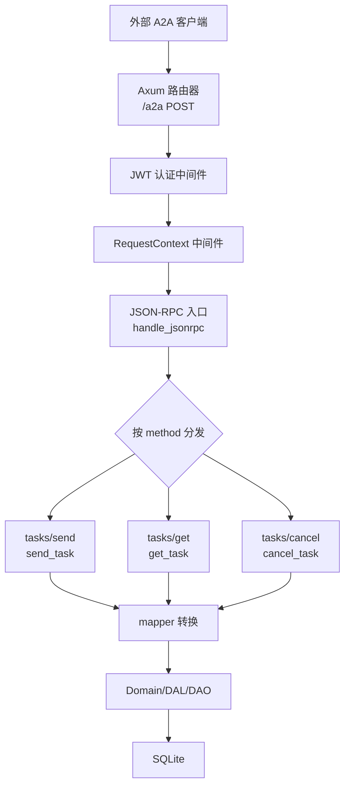
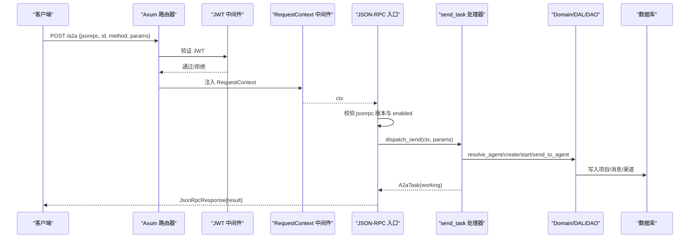
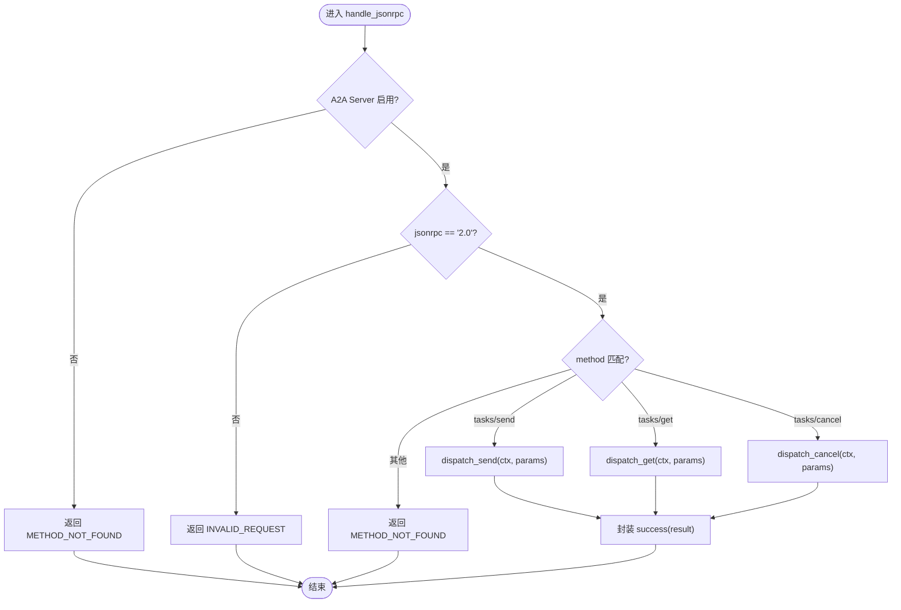
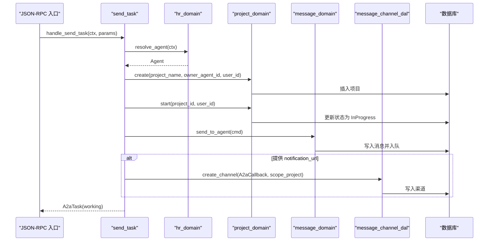
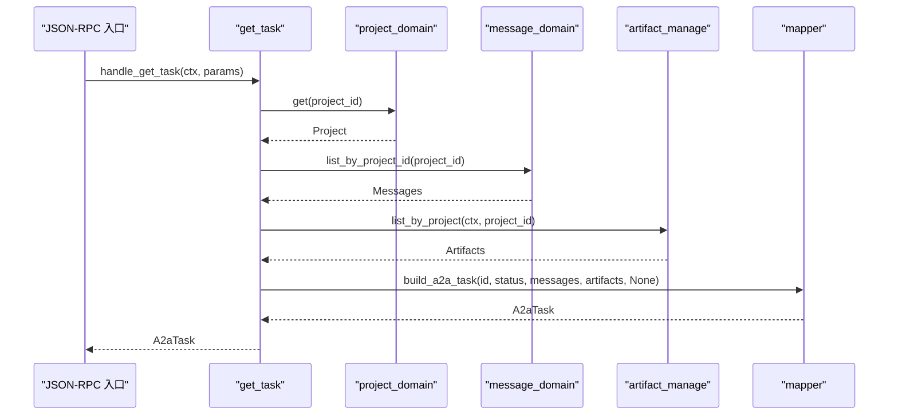
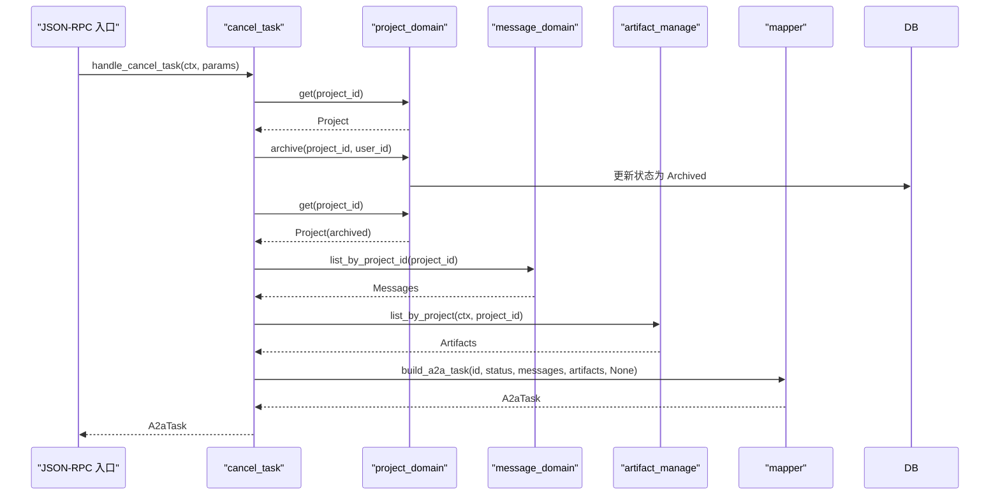
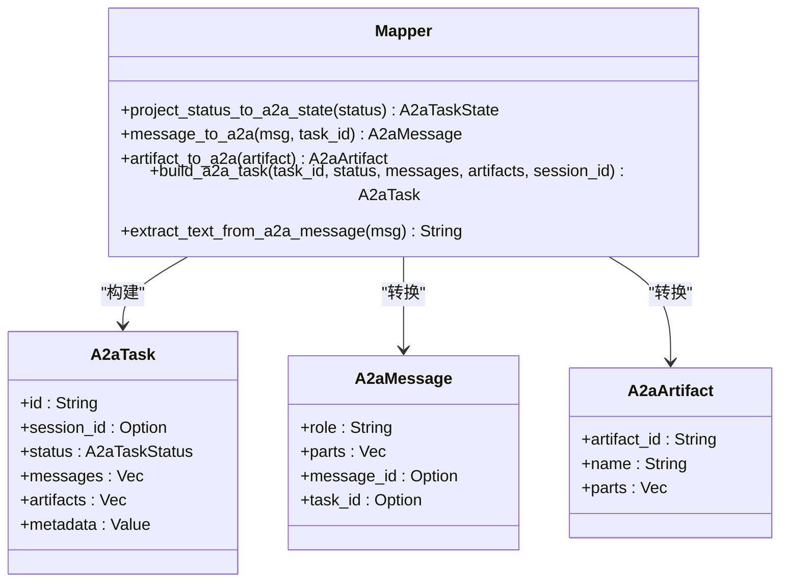
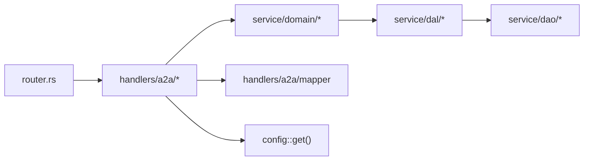

# JSON-RPC 通信协议

<cite>
**本文引用的文件**
- [jsonrpc.rs](src/handlers/a2a/jsonrpc.rs)
- [mod.rs](src/handlers/a2a/mod.rs)
- [mapper.rs](src/handlers/a2a/mapper.rs)
- [send_task.rs](src/handlers/a2a/send_task.rs)
- [get_task.rs](src/handlers/a2a/get_task.rs)
- [cancel_task.rs](src/handlers/a2a/cancel_task.rs)
- [a2a.rs](common/src/api/a2a.rs)
- [router.rs](src/router.rs)
- [ai_orz.toml](common/config/ai_orz.toml)
- [integration_test.rs](src/handlers/a2a/integration_test.rs)
</cite>

## 目录
1. [简介](#简介)
2. [项目结构](#项目结构)
3. [核心组件](#核心组件)
4. [架构总览](#架构总览)
5. [详细组件分析](#详细组件分析)
6. [依赖关系分析](#依赖关系分析)
7. [性能考虑](#性能考虑)
8. [故障排除指南](#故障排除指南)
9. [结论](#结论)
10. [附录：RPC 调用示例与最佳实践](#附录rpc-调用示例与最佳实践)

## 简介
本技术文档围绕 A2A 协议的 JSON-RPC 通信层，系统化说明消息格式、请求/响应结构、错误码定义、异常处理机制、方法调用约定、参数传递规则与返回值格式；并覆盖连接管理、会话保持、超时策略、消息映射器实现原理与数据转换逻辑；最后提供同步/异步调用示例、性能优化建议与故障排除指南。该通信层基于 Axum 路由与中间件，采用 JSON-RPC 2.0 标准，面向外部 A2A Client 暴露统一入口，内部通过 handler → domain → DAL → DAO 的单向分层调用完成业务处理。

## 项目结构
A2A JSON-RPC 通信层位于 handlers/a2a 模块，包含以下关键文件：
- jsonrpc.rs：JSON-RPC 2.0 入口与分发
- send_task.rs / get_task.rs / cancel_task.rs：任务提交、查询、取消的业务处理
- mapper.rs：A2A 协议实体与内部实体的双向转换
- mod.rs：模块组织与职责说明
- router.rs：路由注册与中间件（JWT、RequestContext）装配
- common/src/api/a2a.rs：共享的 A2A 协议类型与错误码
- common/config/ai_orz.toml：A2A Server 开关配置

图表来源
- [router.rs:27-56](src/router.rs#L27-L56)
- [jsonrpc.rs:21-75](src/handlers/a2a/jsonrpc.rs#L21-L75)
- [send_task.rs:31-127](src/handlers/a2a/send_task.rs#L31-L127)
- [get_task.rs:17-48](src/handlers/a2a/get_task.rs#L17-L48)
- [cancel_task.rs:17-54](src/handlers/a2a/cancel_task.rs#L17-L54)
- [mapper.rs:14-84](src/handlers/a2a/mapper.rs#L14-L84)

章节来源
- [mod.rs:1-22](src/handlers/a2a/mod.rs#L1-L22)
- [router.rs:12-58](src/router.rs#L12-L58)
- [jsonrpc.rs:1-75](src/handlers/a2a/jsonrpc.rs#L1-L75)

## 核心组件
- JSON-RPC 入口与分发：负责解析请求体、校验版本、按 method 分发到具体处理器，并将结果或错误封装为 JSON-RPC 响应。
- 任务处理器：
  - tasks/send：创建项目（Task）、启动项目、发送消息至 Agent、可选创建回调渠道，立即返回 working 状态。
  - tasks/get：根据 task_id 查询项目、消息、产物，转换为 A2aTask 返回。
  - tasks/cancel：归档项目（对应 canceled），再查询最新状态与数据返回。
- 消息映射器：将内部 Message/Artifact/ProjectStatus 与 A2A 协议实体进行转换，包括角色映射、文本提取、状态映射等。
- 协议类型与错误码：在 common/src/api/a2a.rs 中统一定义 JSON-RPC 请求/响应、错误码、Task/Message/Artifact 等结构。
- 路由与中间件：/a2a 端点受 JWT 保护，/a2a/subscribe SSE 流式端点同样受 JWT 保护；/.well-known/agent.json 公开发现端点；/a2a/callback/{task_id} 公开回调端点。

章节来源
- [a2a.rs:64-145](common/src/api/a2a.rs#L64-L145)
- [a2a.rs:147-306](common/src/api/a2a.rs#L147-L306)
- [jsonrpc.rs:21-75](src/handlers/a2a/jsonrpc.rs#L21-L75)
- [send_task.rs:31-127](src/handlers/a2a/send_task.rs#L31-L127)
- [get_task.rs:17-48](src/handlers/a2a/get_task.rs#L17-L48)
- [cancel_task.rs:17-54](src/handlers/a2a/cancel_task.rs#L17-L54)
- [mapper.rs:14-99](src/handlers/a2a/mapper.rs#L14-L99)
- [router.rs:21-56](src/router.rs#L21-L56)

## 架构总览
A2A JSON-RPC 通信层遵循四层单向调用：Adapter（HTTP Handler / 公开回调 Handler / AOP Producer）→ Domain → DAL → DAO。Handler 层组合 agent 与 project 两个维度，不直接唤醒 Agent；唤醒由 consumer 异步闭环。所有公共方法跨层传递使用 RequestContext::clone()。

图表来源
- [router.rs:27-38](src/router.rs#L27-L38)
- [jsonrpc.rs:21-75](src/handlers/a2a/jsonrpc.rs#L21-L75)
- [send_task.rs:31-127](src/handlers/a2a/send_task.rs#L31-L127)

章节来源
- [router.rs:12-58](src/router.rs#L12-L58)
- [jsonrpc.rs:1-75](src/handlers/a2a/jsonrpc.rs#L1-L75)

## 详细组件分析

### JSON-RPC 入口与分发
- 入口函数接收 RequestContext 与 JSON-RPC 请求体，检查 A2A Server 是否启用与版本是否为 "2.0"。
- 按 method 分发到 tasks/send、tasks/get、tasks/cancel；未知方法返回 METHOD_NOT_FOUND。
- 成功时封装 result，失败时封装 error，错误信息来自 Error 的 Display 输出。

图表来源
- [jsonrpc.rs:21-75](src/handlers/a2a/jsonrpc.rs#L21-L75)

章节来源
- [jsonrpc.rs:1-75](src/handlers/a2a/jsonrpc.rs#L1-L75)

### 任务提交（tasks/send）
- 从 RequestContext 获取用户 ID，校验上下文。
- 通过 hr_domain().resolve_agent(ctx) 查找前台 Agent，绑定到项目。
- 创建项目（Task），名称截取前 50 字符避免过长；启动项目至 InProgress。
- 构造 SendToAgentCommand，发送消息至 Agent，自动入队 event_queue，consumer 异步唤醒 Agent。
- 若提供 notification_url，创建 A2aCallback 渠道（scope_project=project_id），后续推送消息。
- 立即返回 working 状态的 A2aTask，不含消息内容（等待 Agent 回复）。

图表来源
- [send_task.rs:31-127](src/handlers/a2a/send_task.rs#L31-L127)

章节来源
- [send_task.rs:1-128](src/handlers/a2a/send_task.rs#L1-L128)

### 任务查询（tasks/get）
- 根据 task_id 查询项目，不存在则返回 not_found。
- 查询关联 messages 与 artifacts。
- 使用 build_a2a_task 组装 A2aTask，session_id 不持久化，get 时不返回。

图表来源
- [get_task.rs:17-48](src/handlers/a2a/get_task.rs#L17-L48)
- [mapper.rs:57-84](src/handlers/a2a/mapper.rs#L57-L84)

章节来源
- [get_task.rs:1-49](src/handlers/a2a/get_task.rs#L1-L49)

### 任务取消（tasks/cancel）
- 查询项目确保存在。
- 归档项目（对应 A2A canceled 状态）。
- 重新查询项目获取最新状态，再查询 messages + artifacts。
- 使用 build_a2a_task 组装并返回。

图表来源
- [cancel_task.rs:17-54](src/handlers/a2a/cancel_task.rs#L17-L54)
- [mapper.rs:57-84](src/handlers/a2a/mapper.rs#L57-L84)

章节来源
- [cancel_task.rs:1-55](src/handlers/a2a/cancel_task.rs#L1-L55)

### 消息映射器（mapper）
- project_status_to_a2a_state：将内部 ProjectStatus 映射为 A2A TaskState（Active/PendingReview→Submitted，InProgress→Working，Completed→Completed，Archived→Canceled，Deleted→Failed）。
- message_to_a2a：将内部 Message 转为 A2A Message，from_role=User 映射为 role="user"，其余为 "agent"；附带 message_id 与 task_id。
- artifact_to_a2a：将内部 Artifact 转为 A2A Artifact，parts 包含文本描述。
- build_a2a_task：组装 A2aTask，包含状态、时间戳、消息列表、产物列表、元数据。
- extract_text_from_a2a_message：从 A2A Message 中提取所有 Text part 拼接为字符串，忽略 File/Data part。

图表来源
- [mapper.rs:14-99](src/handlers/a2a/mapper.rs#L14-L99)

章节来源
- [mapper.rs:1-99](src/handlers/a2a/mapper.rs#L1-L99)

### 协议类型与错误码
- JSON-RPC 请求：包含 jsonrpc、id、method、params。
- JSON-RPC 响应：包含 jsonrpc、id、result（成功）或 error（失败）。
- 错误码：PARSE_ERROR(-32700)、INVALID_REQUEST(-32600)、METHOD_NOT_FOUND(-32601)、INVALID_PARAMS(-32602)、INTERNAL_ERROR(-32603)。
- A2A Task：id、session_id、status、messages、artifacts、metadata。
- A2A Message：role、parts、message_id、task_id。
- A2A Artifact：artifact_id、name、parts。
- 方法参数：SendTaskParams（id、message、session_id、metadata、notification_url）、GetTaskParams（id、history_length）、CancelTaskParams（id）。

章节来源
- [a2a.rs:64-145](common/src/api/a2a.rs#L64-L145)
- [a2a.rs:147-306](common/src/api/a2a.rs#L147-L306)

### 路由与中间件
- /.well-known/agent.json：公开发现端点，仅需要 RequestContext。
- /a2a：JSON-RPC 入口，POST，需 JWT 认证与 RequestContext。
- /a2a/subscribe：SSE 流式端点，POST，需 JWT 认证与 RequestContext。
- /a2a/callback/{task_id}：公开回调端点，POST，仅需 RequestContext。
- 中间件顺序：jwt_auth_middleware（外层）→ request_context_middleware（内层），确保 RequestContext 包含 JWT 注入的用户信息。

章节来源
- [router.rs:21-56](src/router.rs#L21-L56)

## 依赖关系分析
- Handler 层依赖 Domain 层进行业务编排，不直接访问 DAL/DAO。
- Domain 层通过 DAL 访问 DAO，DAL 对外接口使用业务实体而非 PO。
- 消息映射器独立于 Domain，仅在 Handler 层用于协议与内部实体转换。
- 配置通过全局单例读取，A2A Server 开关控制入口行为。

图表来源
- [router.rs:21-56](src/router.rs#L21-L56)
- [send_task.rs:31-127](src/handlers/a2a/send_task.rs#L31-L127)
- [get_task.rs:17-48](src/handlers/a2a/get_task.rs#L17-L48)
- [cancel_task.rs:17-54](src/handlers/a2a/cancel_task.rs#L17-L54)

章节来源
- [send_task.rs:1-128](src/handlers/a2a/send_task.rs#L1-L128)
- [get_task.rs:1-49](src/handlers/a2a/get_task.rs#L1-L49)
- [cancel_task.rs:1-55](src/handlers/a2a/cancel_task.rs#L1-L55)

## 性能考虑
- 异步提交：tasks/send 立即返回 working 状态，不阻塞等待 Agent 回复，降低请求延迟。
- 轮询优化：客户端通过 tasks/get 轮询任务状态，可结合 history_length 限制历史消息长度，减少响应体积。
- 回调推送：当提供 notification_url 时，服务端通过 A2aCallback 渠道推送任务更新，减少轮询开销。
- 资源隔离：每个任务对应一个项目，消息与产物按项目隔离，便于分页与索引。
- 配置开关：通过 a2a_server.enabled 控制入口启用，便于灰度发布与降级。

[本节为通用指导，无需特定文件引用]

## 故障排除指南
- 未启用 A2A Server：返回 METHOD_NOT_FOUND，检查配置 a2a_server.enabled。
- 无效 JSON-RPC 版本：返回 INVALID_REQUEST，确保 jsonrpc 字段为 "2.0"。
- 方法未找到：返回 METHOD_NOT_FOUND，确认 method 为 tasks/send、tasks/get、tasks/cancel。
- 参数无效：返回 INVALID_PARAMS，检查 params 结构与必填字段。
- 内部错误：返回 INTERNAL_ERROR，查看错误日志与堆栈。
- 任务不存在：get/cancel 返回 not_found，确认 task_id 正确且已创建。
- 缺少用户上下文：send_task 校验 ctx.uid() 为空时报错，检查 JWT 是否正确携带。

章节来源
- [jsonrpc.rs:21-75](src/handlers/a2a/jsonrpc.rs#L21-L75)
- [send_task.rs:31-43](src/handlers/a2a/send_task.rs#L31-L43)
- [get_task.rs:17-25](src/handlers/a2a/get_task.rs#L17-L25)
- [cancel_task.rs:17-25](src/handlers/a2a/cancel_task.rs#L17-L25)

## 结论
A2A JSON-RPC 通信层以标准化协议与清晰的分层架构实现了外部 Agent 协作能力。通过 JSON-RPC 2.0 的请求/响应模型、严格的错误码体系与灵活的映射器设计，系统能够高效地处理任务提交、查询与取消，并支持异步唤醒与回调推送。配合路由中间件的认证与上下文注入，确保了安全性与可观测性。建议在集成测试中覆盖完整流程，并结合监控指标持续优化性能与稳定性。

[本节为总结，无需特定文件引用]

## 附录：RPC 调用示例与最佳实践

### 同步调用模式（tasks/get）
- 目的：查询任务状态与历史消息。
- 步骤：
  1. 准备 JSON-RPC 请求：{jsonrpc:"2.0", id:<任意>, method:"tasks/get", params:{id:"<task_id>", history_length:<可选>}}。
  2. 携带有效 JWT 头，POST 到 /a2a。
  3. 解析响应，若 result 存在则获取 A2aTask；若 error 存在则根据 code 处理。
- 最佳实践：合理设置 history_length，避免过大响应；轮询间隔建议指数退避。

章节来源
- [a2a.rs:290-298](common/src/api/a2a.rs#L290-L298)
- [get_task.rs:17-48](src/handlers/a2a/get_task.rs#L17-L48)

### 异步调用模式（tasks/send）
- 目的：提交任务并立即获得 working 状态，后续通过轮询或回调获取结果。
- 步骤：
  1. 准备 JSON-RPC 请求：{jsonrpc:"2.0", id:<任意>, method:"tasks/send", params:{id:"<client_task_id>", message:{role:"user", parts:[{type:"text", text:"<内容>"}]}, session_id:<可选>, metadata:<可选>, notification_url:<可选>}}。
  2. 携带有效 JWT 头，POST 到 /a2a。
  3. 解析响应，若 result 存在则获取 A2aTask(working)；若 error 存在则处理。
  4. 若提供 notification_url，服务端会推送任务更新；否则通过 tasks/get 轮询。
- 最佳实践：session_id 用于多轮对话关联；notification_url 提升实时性；content 截断避免过长项目名称。

章节来源
- [a2a.rs:269-288](common/src/api/a2a.rs#L269-L288)
- [send_task.rs:31-127](src/handlers/a2a/send_task.rs#L31-L127)

### 取消任务（tasks/cancel）
- 目的：将任务标记为 canceled。
- 步骤：
  1. 准备 JSON-RPC 请求：{jsonrpc:"2.0", id:<任意>, method:"tasks/cancel", params:{id:"<task_id>"}}。
  2. 携带有效 JWT 头，POST 到 /a2a。
  3. 解析响应，若 result 存在则获取 A2aTask(canceled)；若 error 存在则处理。
- 最佳实践：确保任务处于可取消状态；取消后仍可查询历史消息。

章节来源
- [a2a.rs:300-305](common/src/api/a2a.rs#L300-L305)
- [cancel_task.rs:17-54](src/handlers/a2a/cancel_task.rs#L17-L54)

### 连接管理与会话保持
- 连接管理：基于 HTTP/HTTPS 长连接或短连接，建议客户端实现重试与超时。
- 会话保持：通过 session_id 关联多轮对话，服务端不持久化 session_id，get 时不返回。
- 超时处理：客户端应设置合理的请求超时与重试策略；服务端无显式超时配置，依赖框架默认行为。

[本节为通用指导，无需特定文件引用]

### 集成测试参考
- 测试环境初始化：包括 DAO/DAL/Domain 初始化与工具追踪日志。
- 用例覆盖：前台 Agent 解析、任务查询不存在、任务取消不存在等场景。
- 执行方式：使用 sqlx::test 运行，确保 SQLite 环境就绪。

章节来源
- [integration_test.rs:1-135](src/handlers/a2a/integration_test.rs#L1-L135)